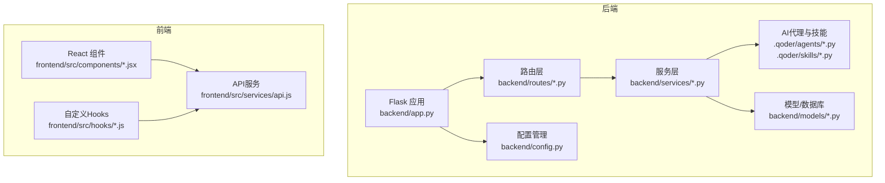
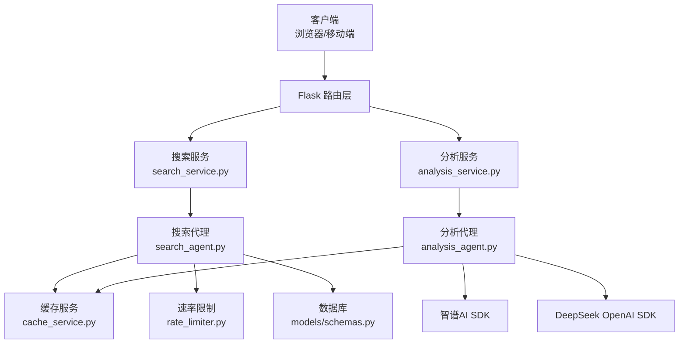
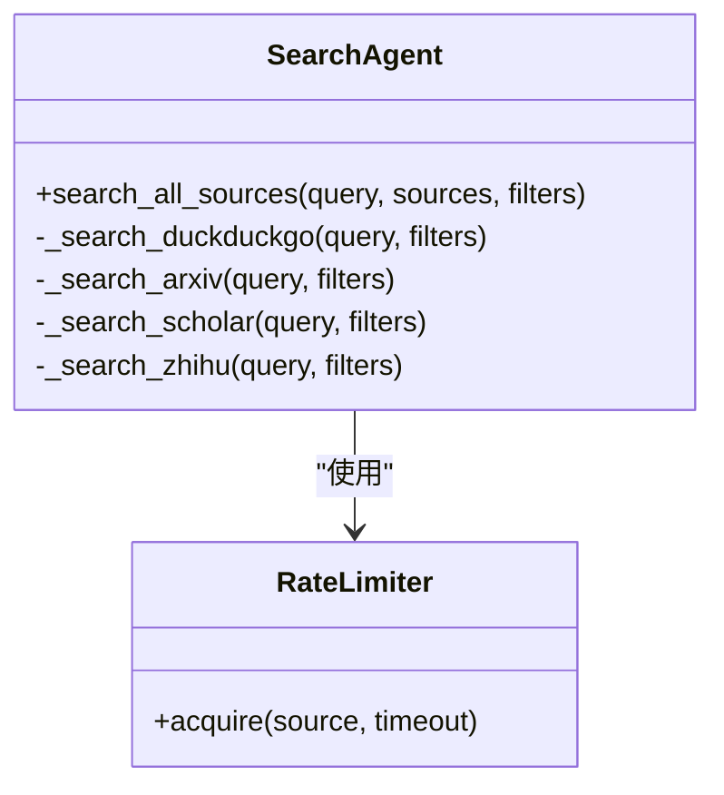
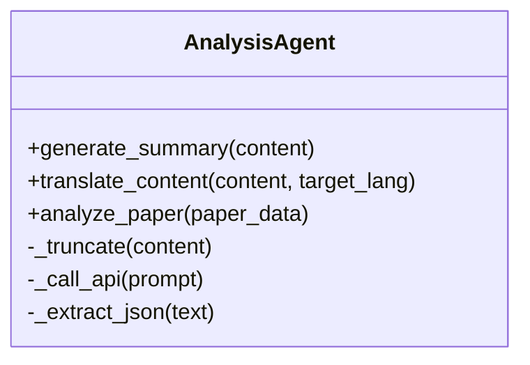
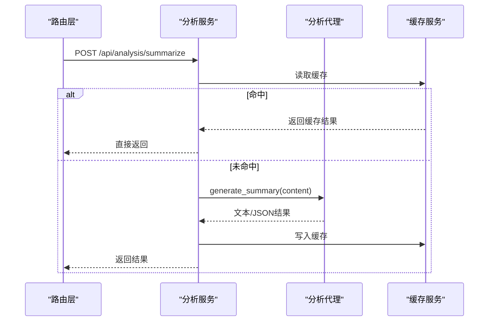
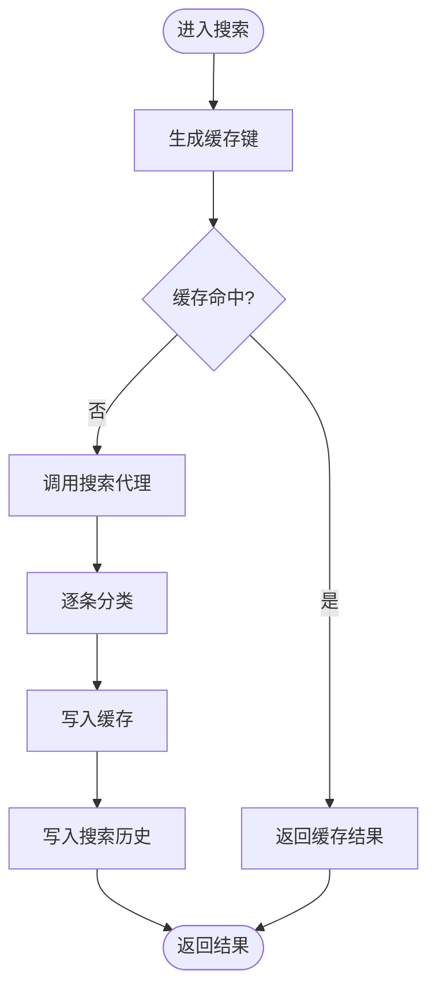
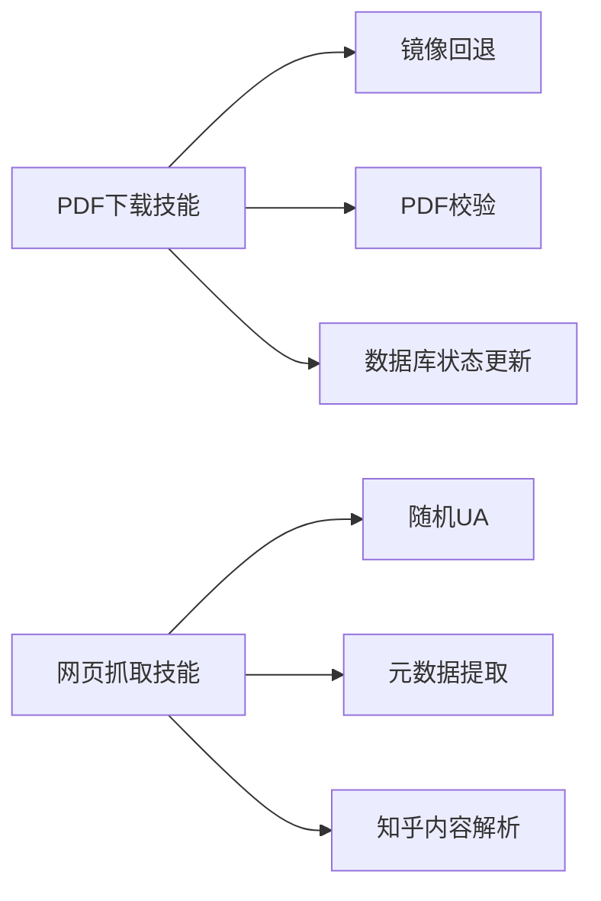
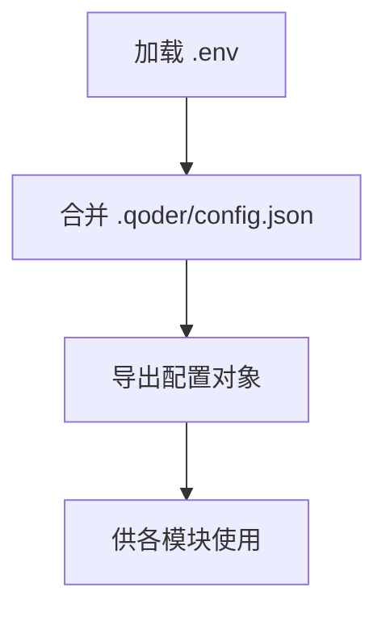
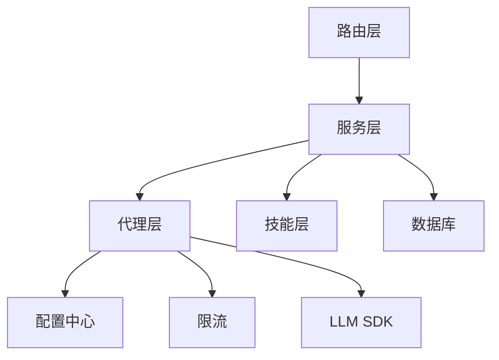

# AI代理系统

<cite>
**本文引用的文件**
- [README.md](file://README.md)
- [.qoder/config.json](file://.qoder/config.json)
- [backend/app.py](file://backend/app.py)
- [backend/config.py](file://backend/config.py)
- [backend/routes/search.py](file://backend/routes/search.py)
- [backend/routes/analysis.py](file://backend/routes/analysis.py)
- [backend/services/search_service.py](file://backend/services/search_service.py)
- [backend/services/analysis_service.py](file://backend/services/analysis_service.py)
- [backend/models/schemas.py](file://backend/models/schemas.py)
- [.qoder/agents/search_agent.py](file://.qoder/agents/search_agent.py)
- [.qoder/agents/analysis_agent.py](file://.qoder/agents/analysis_agent.py)
- [.qoder/skills/pdf_download_skill.py](file://.qoder/skills/pdf_download_skill.py)
- [.qoder/skills/web_scraping_skill.py](file://.qoder/skills/web_scraping_skill.py)
</cite>

## 目录
1. [简介](#简介)
2. [项目结构](#项目结构)
3. [核心组件](#核心组件)
4. [架构总览](#架构总览)
5. [详细组件分析](#详细组件分析)
6. [依赖关系分析](#依赖关系分析)
7. [性能考虑](#性能考虑)
8. [故障排查指南](#故障排查指南)
9. [结论](#结论)
10. [附录](#附录)

## 简介
本项目是一个“全网内容检索与智能分析”系统，提供多源聚合搜索、智能内容分类、AI内容分析（摘要、翻译、论文解析）、PDF下载管理与搜索历史等功能。系统采用前后端分离架构，后端基于Flask，前端基于React/Vite，并通过RESTful API交互。

系统的核心亮点包括：
- 多LLM提供商支持：智谱AI与DeepSeek（通过兼容接口）
- 搜索代理与分析代理：分别负责多源搜索与AI分析的编排与执行
- 技能模块化：如PDF下载、网页抓取等可复用能力
- 配置中心化：运行时配置集中于.qoder/config.json，结合环境变量
- 缓存与限流：搜索与分析结果缓存，以及基于令牌桶的速率限制

## 项目结构
后端采用分层组织：应用入口、配置、路由、服务、模型与工具；前端采用组件化与Hook封装；AI相关逻辑集中在.qoder目录下的agents与skills中。

图表来源
- [backend/app.py](file://backend/app.py#L21-L67)
- [backend/config.py](file://backend/config.py#L15-L84)
- [backend/routes/search.py](file://backend/routes/search.py#L1-L28)
- [backend/routes/analysis.py](file://backend/routes/analysis.py#L1-L66)
- [backend/services/search_service.py](file://backend/services/search_service.py#L1-L98)
- [backend/services/analysis_service.py](file://backend/services/analysis_service.py#L1-L91)
- [backend/models/schemas.py](file://backend/models/schemas.py#L1-L38)
- [.qoder/agents/search_agent.py](file://.qoder/agents/search_agent.py#L1-L305)
- [.qoder/agents/analysis_agent.py](file://.qoder/agents/analysis_agent.py#L1-L211)
- [.qoder/skills/pdf_download_skill.py](file://.qoder/skills/pdf_download_skill.py#L1-L146)
- [.qoder/skills/web_scraping_skill.py](file://.qoder/skills/web_scraping_skill.py#L1-L128)

章节来源
- [README.md](file://README.md#L376-L404)

## 核心组件
- 应用入口与蓝图注册：Flask应用初始化、CORS配置、静态资源托管、全局异常处理，以及各API蓝图注册。
- 配置中心：合并.env与.qoder/config.json，统一管理LLM密钥、速率限制、搜索默认值、下载设置与分析设置。
- 路由层：提供搜索、分析、下载、历史等REST接口。
- 服务层：封装业务逻辑，协调代理与缓存。
- AI代理层：搜索代理负责多源并发搜索与去重；分析代理负责LLM调用与结果解析。
- 技能层：PDF下载、网页抓取与元数据提取等可插拔能力。
- 数据模型：SQLite表结构定义，包含搜索历史、搜索缓存、分析缓存与下载记录。

章节来源
- [backend/app.py](file://backend/app.py#L21-L78)
- [backend/config.py](file://backend/config.py#L15-L84)
- [backend/routes/search.py](file://backend/routes/search.py#L1-L28)
- [backend/routes/analysis.py](file://backend/routes/analysis.py#L1-L66)
- [backend/services/search_service.py](file://backend/services/search_service.py#L1-L98)
- [backend/services/analysis_service.py](file://backend/services/analysis_service.py#L1-L91)
- [backend/models/schemas.py](file://backend/models/schemas.py#L1-L38)
- [.qoder/agents/search_agent.py](file://.qoder/agents/search_agent.py#L21-L112)
- [.qoder/agents/analysis_agent.py](file://.qoder/agents/analysis_agent.py#L13-L61)
- [.qoder/skills/pdf_download_skill.py](file://.qoder/skills/pdf_download_skill.py#L21-L48)
- [.qoder/skills/web_scraping_skill.py](file://.qoder/skills/web_scraping_skill.py#L27-L46)

## 架构总览
系统采用“路由-服务-代理/技能”的分层架构，AI分析能力通过AnalysisAgent统一抽象，支持多LLM提供商切换；搜索能力通过SearchAgent统一调度多个数据源，配合缓存与限流提升性能与稳定性。

图表来源
- [backend/routes/search.py](file://backend/routes/search.py#L10-L27)
- [backend/routes/analysis.py](file://backend/routes/analysis.py#L10-L65)
- [backend/services/search_service.py](file://backend/services/search_service.py#L28-L67)
- [backend/services/analysis_service.py](file://backend/services/analysis_service.py#L25-L90)
- [.qoder/agents/search_agent.py](file://.qoder/agents/search_agent.py#L33-L111)
- [.qoder/agents/analysis_agent.py](file://.qoder/agents/analysis_agent.py#L18-L61)
- [backend/models/schemas.py](file://backend/models/schemas.py#L1-L38)

## 详细组件分析

### 搜索代理（SearchAgent）
职责与特性：
- 并发多源搜索：使用线程池并发执行不同数据源的搜索任务，支持超时控制与部分完成处理。
- 数据源适配：支持DuckDuckGo（通过Bing中国站）、arXiv、Semantic Scholar、知乎（站内搜索）。
- 去重与分类：按URL去重，随后交由分类服务进行内容类型识别。
- 速率限制：每个数据源独立令牌桶限速，避免被外部API限流。
- 错误处理：单源失败不影响整体结果，记录状态便于诊断。

图表来源
- [.qoder/agents/search_agent.py](file://.qoder/agents/search_agent.py#L21-L112)
- [.qoder/agents/search_agent.py](file://.qoder/agents/search_agent.py#L113-L305)

章节来源
- [.qoder/agents/search_agent.py](file://.qoder/agents/search_agent.py#L21-L112)
- [.qoder/agents/search_agent.py](file://.qoder/agents/search_agent.py#L113-L305)

### 分析代理（AnalysisAgent）
职责与特性：
- 多LLM提供商抽象：支持“zhipu”和“deepseek”，根据配置动态初始化客户端。
- 统一分析接口：摘要生成、内容翻译、论文深度分析，均通过统一prompt与调用流程。
- 结果解析：尝试从LLM响应中抽取JSON结构，若失败则回退为纯文本。
- 配置驱动：模型名称、最大内容长度、温度、缓存过期天数等均来自配置中心。

图表来源
- [.qoder/agents/analysis_agent.py](file://.qoder/agents/analysis_agent.py#L13-L61)
- [.qoder/agents/analysis_agent.py](file://.qoder/agents/analysis_agent.py#L86-L185)

章节来源
- [.qoder/agents/analysis_agent.py](file://.qoder/agents/analysis_agent.py#L13-L61)
- [.qoder/agents/analysis_agent.py](file://.qoder/agents/analysis_agent.py#L86-L185)

### 分析服务（analysis_service.py）
职责与特性：
- 缓存策略：针对摘要、翻译、论文分析分别计算缓存键，命中则直接返回，未命中再调用AnalysisAgent。
- 延迟初始化：首次使用时才导入并实例化AnalysisAgent，降低启动开销。
- 错误隔离：当LLM调用失败时返回错误信息，不抛出异常至路由层。

图表来源
- [backend/routes/analysis.py](file://backend/routes/analysis.py#L10-L24)
- [backend/services/analysis_service.py](file://backend/services/analysis_service.py#L25-L43)
- [.qoder/agents/analysis_agent.py](file://.qoder/agents/analysis_agent.py#L86-L114)

章节来源
- [backend/routes/analysis.py](file://backend/routes/analysis.py#L10-L24)
- [backend/services/analysis_service.py](file://backend/services/analysis_service.py#L25-L43)

### 搜索服务（search_service.py）
职责与特性：
- 缓存策略：对查询参数组合生成唯一缓存键，命中则直接返回，未命中再调用SearchAgent。
- 结果分类：对每条结果调用分类服务，标注类别（学术、博客、问答、论坛、网页）。
- 历史记录：将每次搜索的查询、过滤条件与结果数量写入数据库。
- 延迟初始化：首次使用时才导入并实例化SearchAgent。

图表来源
- [backend/services/search_service.py](file://backend/services/search_service.py#L28-L67)
- [backend/models/schemas.py](file://backend/models/schemas.py#L1-L38)

章节来源
- [backend/services/search_service.py](file://backend/services/search_service.py#L28-L67)
- [backend/models/schemas.py](file://backend/models/schemas.py#L1-L38)

### 技能模块（Skills）
- PDF下载技能：支持arXiv镜像回退、并发下载、校验与状态持久化。
- 网页抓取技能：随机User-Agent、页面内容提取、元数据解析（OpenGraph）与知乎内容解析。

图表来源
- [.qoder/skills/pdf_download_skill.py](file://.qoder/skills/pdf_download_skill.py#L21-L88)
- [.qoder/skills/web_scraping_skill.py](file://.qoder/skills/web_scraping_skill.py#L27-L83)

章节来源
- [.qoder/skills/pdf_download_skill.py](file://.qoder/skills/pdf_download_skill.py#L21-L88)
- [.qoder/skills/web_scraping_skill.py](file://.qoder/skills/web_scraping_skill.py#L27-L83)

### 配置管理（Config）
- 合并策略：优先加载.env中的环境变量，再合并.qoder/config.json中的运行时配置。
- 关键配置项：LLM提供商与模型、最大内容长度、温度、缓存过期、速率限制、下载设置等。
- 目录确保：数据库与下载目录自动创建。

图表来源
- [backend/config.py](file://backend/config.py#L15-L84)
- [.qoder/config.json](file://.qoder/config.json#L1-L31)

章节来源
- [backend/config.py](file://backend/config.py#L15-L84)
- [.qoder/config.json](file://.qoder/config.json#L1-L31)

## 依赖关系分析
- 组件耦合：路由层仅依赖服务层；服务层依赖代理/技能与配置；代理依赖配置与限流；分析代理依赖LLM SDK。
- 外部依赖：arxiv、requests、BeautifulSoup4、zhipuai、openai等。
- 循环依赖：未发现循环导入；代理与服务通过延迟导入避免相互引用。

图表来源
- [backend/routes/search.py](file://backend/routes/search.py#L1-L28)
- [backend/routes/analysis.py](file://backend/routes/analysis.py#L1-L66)
- [backend/services/search_service.py](file://backend/services/search_service.py#L1-L98)
- [backend/services/analysis_service.py](file://backend/services/analysis_service.py#L1-L91)
- [.qoder/agents/search_agent.py](file://.qoder/agents/search_agent.py#L1-L305)
- [.qoder/agents/analysis_agent.py](file://.qoder/agents/analysis_agent.py#L1-L211)

## 性能考虑
- 并发与限流：搜索阶段使用线程池并发执行，每个数据源独立令牌桶限速，避免外部API限流与抖动。
- 缓存策略：搜索与分析结果均具备缓存，显著降低重复请求与LLM调用成本。
- 超时与降级：搜索超时采用as_completed收集已完成结果，未完成标记为超时并取消，避免阻塞。
- LLM调用优化：内容截断、固定温度与最大tokens，减少上下文长度与响应时间。
- 下载优化：并发线程池与镜像回退，提高成功率与速度。

章节来源
- [.qoder/agents/search_agent.py](file://.qoder/agents/search_agent.py#L71-L97)
- [backend/services/search_service.py](file://backend/services/search_service.py#L44-L61)
- [backend/services/analysis_service.py](file://backend/services/analysis_service.py#L32-L43)

## 故障排查指南
- AI分析不可用
  - 检查LLM提供商配置与API密钥是否正确设置。
  - 确认分析设置中的provider与模型名称。
  - 查看分析代理初始化日志与错误返回。
- 搜索为空或超时
  - 检查数据源限速配置与实际可用性。
  - 观察路由层错误日志，确认异常堆栈。
- PDF下载失败
  - 检查下载记录状态与日志，确认镜像可用性与文件有效性。
- 速率限制与429
  - 调整.qoder/config.json中的rate_limits，或降低并发与频率。
- 缓存命中异常
  - 检查缓存键生成规则与过期时间，必要时清理缓存。

章节来源
- [backend/routes/analysis.py](file://backend/routes/analysis.py#L22-L24)
- [backend/routes/search.py](file://backend/routes/search.py#L25-L27)
- [.qoder/agents/analysis_agent.py](file://.qoder/agents/analysis_agent.py#L34-L61)
- [.qoder/skills/pdf_download_skill.py](file://.qoder/skills/pdf_download_skill.py#L56-L88)

## 结论
本系统通过“搜索代理+分析代理+技能模块”的架构，实现了多源搜索与AI智能分析的解耦与扩展。配置中心化与缓存策略提升了可用性与性能，多LLM提供商支持为用户提供了灵活的AI能力接入方案。未来可进一步引入代理工厂模式与技能注册机制，以支持更丰富的AI能力与第三方扩展。

## 附录

### API接口一览
- 搜索接口：POST /api/search
- 摘要接口：POST /api/analysis/summarize
- 翻译接口：POST /api/analysis/translate
- 论文分析接口：POST /api/analysis/paper
- arXiv下载接口：POST /api/download/arxiv、GET /api/download/status/<id>、GET /api/download/file/<id>、GET /api/download/history

章节来源
- [README.md](file://README.md#L229-L274)

### 配置项说明
- 分析设置：provider、zhipu_model、deepseek_model、max_content_length、temperature、cache_expire_days
- 速率限制：各数据源的容量与补充速率
- 搜索默认：每源最大结果数、超时秒数、缓存过期小时数、默认数据源
- 下载设置：保存目录、最大并发下载、arXiv镜像列表

章节来源
- [.qoder/config.json](file://.qoder/config.json#L1-L31)
- [backend/config.py](file://backend/config.py#L50-L73)