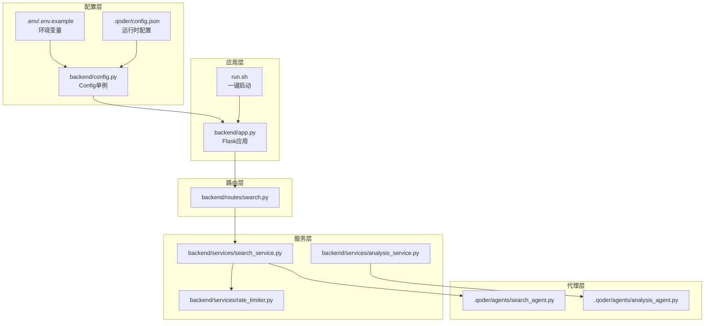
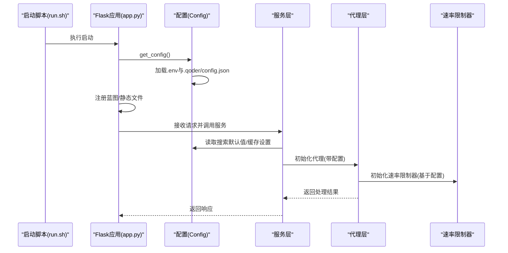
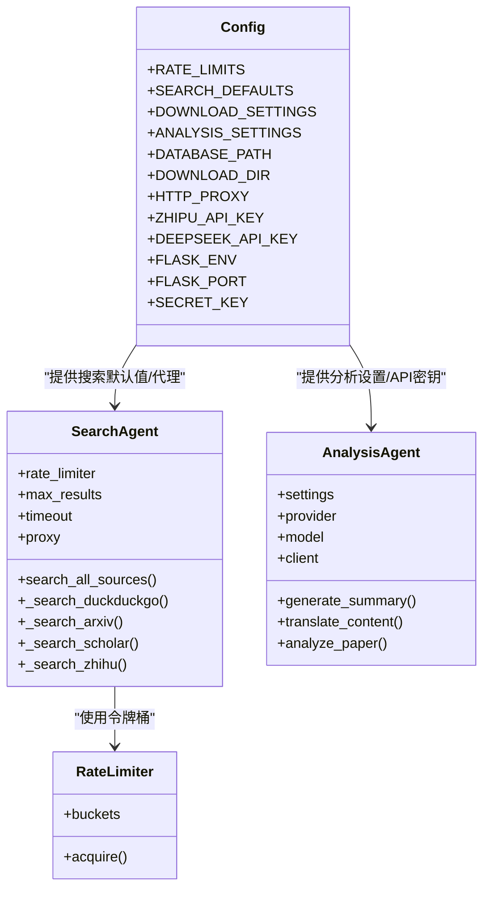

# 代理配置管理

<cite>
**本文档引用的文件**
- [.qoder/config.json](file://.qoder/config.json)
- [backend/config.py](file://backend/config.py)
- [.env](file://.env)
- [.env.example](file://.env.example)
- [backend/app.py](file://backend/app.py)
- [run.sh](file://run.sh)
- [backend/services/rate_limiter.py](file://backend/services/rate_limiter.py)
- [backend/services/search_service.py](file://backend/services/search_service.py)
- [backend/routes/search.py](file://backend/routes/search.py)
- [.qoder/agents/search_agent.py](file://.qoder/agents/search_agent.py)
- [.qoder/agents/analysis_agent.py](file://.qoder/agents/analysis_agent.py)
- [backend/services/analysis_service.py](file://backend/services/analysis_service.py)
- [README.md](file://README.md)
</cite>

## 目录
1. [简介](#简介)
2. [项目结构](#项目结构)
3. [核心组件](#核心组件)
4. [架构总览](#架构总览)
5. [详细组件分析](#详细组件分析)
6. [依赖关系分析](#依赖关系分析)
7. [性能考量](#性能考量)
8. [故障排查指南](#故障排查指南)
9. [结论](#结论)
10. [附录](#附录)

## 简介
本文件面向AI代理系统的配置管理，系统采用“运行时配置文件 + 环境变量”的双层配置机制，确保灵活性与安全性。运行时配置位于 .qoder/config.json，涵盖速率限制、搜索默认行为、下载设置与分析设置；环境变量位于 .env/.env.example，用于API密钥、数据库路径、Flask运行参数与可选代理配置。本文将详细说明配置结构、加载机制、环境变量覆盖、默认值处理、不同代理类型的配置差异、性能参数调优、资源限制、配置验证、热更新与迁移策略，并提供最佳实践与常见问题排查。

## 项目结构
系统采用前后端分离架构，配置管理集中在后端，通过单例配置类统一读取与暴露配置项。关键位置如下：
- 运行时配置：.qoder/config.json
- 环境变量：.env 与 .env.example
- 配置加载：backend/config.py
- 应用入口：backend/app.py
- 一键启动：run.sh
- 代理实现：.qoder/agents/search_agent.py、.qoder/agents/analysis_agent.py
- 服务层：backend/services/search_service.py、backend/services/analysis_service.py、backend/services/rate_limiter.py
- 路由层：backend/routes/search.py

图表来源
- [backend/config.py](file://backend/config.py#L15-L85)
- [backend/app.py](file://backend/app.py#L21-L78)
- [run.sh](file://run.sh#L1-L50)
- [backend/services/search_service.py](file://backend/services/search_service.py#L28-L67)
- [backend/services/analysis_service.py](file://backend/services/analysis_service.py#L25-L91)
- [backend/services/rate_limiter.py](file://backend/services/rate_limiter.py#L45-L74)
- [.qoder/agents/search_agent.py](file://.qoder/agents/search_agent.py#L21-L32)
- [.qoder/agents/analysis_agent.py](file://.qoder/agents/analysis_agent.py#L13-L33)
- [backend/routes/search.py](file://backend/routes/search.py#L10-L27)

章节来源
- [backend/config.py](file://backend/config.py#L15-L85)
- [backend/app.py](file://backend/app.py#L21-L78)
- [run.sh](file://run.sh#L1-L50)

## 核心组件
- 运行时配置文件：.qoder/config.json，包含速率限制、搜索默认值、下载设置、分析设置四个部分。
- 环境变量：.env/.env.example，包含API密钥、Flask运行参数、数据库路径、下载目录与可选代理。
- 配置类：backend/config.py 的 Config 单例，负责合并 .env 与 .qoder/config.json，并提供默认值与目录初始化。
- 代理实现：.qoder/agents/search_agent.py 与 .qoder/agents/analysis_agent.py，分别消费搜索与分析配置。
- 服务层：search_service/analysis_service 使用配置进行缓存、超时、代理与LLM客户端初始化。
- 路由层：routes/search.py 接收请求并调用服务层。

章节来源
- [.qoder/config.json](file://.qoder/config.json#L1-L31)
- [backend/config.py](file://backend/config.py#L15-L85)
- [.qoder/agents/search_agent.py](file://.qoder/agents/search_agent.py#L21-L32)
- [.qoder/agents/analysis_agent.py](file://.qoder/agents/analysis_agent.py#L13-L33)
- [backend/services/search_service.py](file://backend/services/search_service.py#L28-L67)
- [backend/services/analysis_service.py](file://backend/services/analysis_service.py#L25-L91)
- [backend/routes/search.py](file://backend/routes/search.py#L10-L27)

## 架构总览
配置加载与使用流程如下：
- 启动时加载 .env 并初始化 Config 单例，读取 .qoder/config.json 并合并环境变量。
- Flask 应用通过 get_config() 获取配置，注册蓝图并启动服务。
- 服务层在执行业务逻辑前读取配置，如搜索默认值、缓存过期时间、下载目录、分析提供商与模型等。
- 代理层根据配置初始化速率限制器、超时、代理与LLM客户端。

图表来源
- [run.sh](file://run.sh#L39-L50)
- [backend/app.py](file://backend/app.py#L21-L78)
- [backend/config.py](file://backend/config.py#L20-L78)
- [backend/services/search_service.py](file://backend/services/search_service.py#L40-L67)
- [.qoder/agents/search_agent.py](file://.qoder/agents/search_agent.py#L24-L32)
- [backend/services/rate_limiter.py](file://backend/services/rate_limiter.py#L55-L62)

## 详细组件分析

### 运行时配置文件结构与参数
.qoder/config.json 包含四大配置段：
- 速率限制(rate_limits)：为各数据源配置容量与补充速率，用于令牌桶算法。
- 搜索默认(search_defaults)：最大结果数、超时秒数、缓存过期小时数、默认数据源列表。
- 下载设置(download_settings)：保存目录、最大并发下载数、arXiv镜像地址列表。
- 分析设置(analysis_settings)：提供商(provider)、zhipu/deepseek模型名、最大内容长度、温度、缓存过期天数。

章节来源
- [.qoder/config.json](file://.qoder/config.json#L1-L31)

### 环境变量覆盖与默认值处理
- 环境变量加载：启动时通过 python-dotenv 加载 .env，未找到则不报错。
- 默认值策略：
  - Flask：密钥、运行环境、端口等提供默认值。
  - 数据库路径与下载目录：若 .env 未提供则使用相对路径默认值。
  - API密钥：为空字符串表示未配置。
  - 代理：优先使用 HTTP_PROXY，否则回退 HTTPS_PROXY。
  - 运行时配置：若 .qoder/config.json 缺失或字段缺失，使用 Config 类中的默认值。
- 目录初始化：确保数据库与下载目录存在。

章节来源
- [backend/config.py](file://backend/config.py#L11-L12)
- [backend/config.py](file://backend/config.py#L30-L48)
- [backend/config.py](file://backend/config.py#L50-L77)

### 配置加载机制与生命周期
- 单例Config：首次调用 get_config() 时实例化，后续复用。
- 启动顺序：run.sh -> app.py -> get_config() -> Config.__init__() -> 读取 .env 与 .qoder/config.json -> 初始化目录。
- 应用启动：app.py 通过 get_config() 设置 Flask SECRET_KEY，并注册蓝图。

章节来源
- [backend/config.py](file://backend/config.py#L80-L85)
- [backend/app.py](file://backend/app.py#L21-L78)
- [run.sh](file://run.sh#L39-L50)

### 不同代理类型的配置差异
- 搜索代理(SearchAgent)：
  - 读取 SEARCH_DEFAULTS：最大结果数、超时、代理。
  - 读取 RATE_LIMITS：为各数据源初始化令牌桶。
  - 并发搜索：使用线程池并发调用各数据源，超时与失败状态记录。
- 分析代理(AnalysisAgent)：
  - 读取 ANALYSIS_SETTINGS：提供商(provider)、模型名(zhipu_model/deepseek_model)、最大内容长度、温度。
  - 根据提供商初始化对应SDK客户端（ZhipuAI 或 OpenAI 兼容接口）。
  - 对内容进行截断、提示词构造与API调用，返回摘要、翻译或论文分析结果。

章节来源
- [.qoder/agents/search_agent.py](file://.qoder/agents/search_agent.py#L24-L32)
- [.qoder/agents/search_agent.py](file://.qoder/agents/search_agent.py#L113-L200)
- [.qoder/agents/analysis_agent.py](file://.qoder/agents/analysis_agent.py#L18-L33)
- [.qoder/agents/analysis_agent.py](file://.qoder/agents/analysis_agent.py#L13-L61)

### 性能参数调优与资源限制
- 速率限制：
  - 令牌桶容量与补充速率：决定并发访问强度与平滑突发能力。
  - 超时：搜索代理对每个数据源设置超时，避免长时间阻塞。
- 缓存策略：
  - 搜索与分析均使用缓存键与TTL，降低重复请求与LLM调用成本。
- 并发与资源：
  - 搜索并发数等于数据源数量，受线程池限制。
  - 下载并发数由 download_settings 控制，arXiv镜像提升可用性。
- LLM调优：
  - 温度与最大内容长度影响输出稳定性与成本。

章节来源
- [backend/services/rate_limiter.py](file://backend/services/rate_limiter.py#L5-L43)
- [backend/services/search_service.py](file://backend/services/search_service.py#L40-L67)
- [.qoder/config.json](file://.qoder/config.json#L8-L29)
- [.qoder/agents/search_agent.py](file://.qoder/agents/search_agent.py#L71-L96)
- [.qoder/agents/analysis_agent.py](file://.qoder/agents/analysis_agent.py#L68-L85)

### 配置验证机制
- 配置存在性与类型：Config 类在读取 .qoder/config.json 时使用 get() 提供默认值，避免KeyError。
- API密钥校验：AnalysisAgent 在初始化时检查API密钥是否存在，不存在则记录警告并跳过调用。
- 代理可用性：SearchAgent 仅在 .env 中配置了代理时才启用。
- 数据目录存在性：Config 初始化时确保数据库与下载目录存在。

章节来源
- [backend/config.py](file://backend/config.py#L50-L77)
- [.qoder/agents/analysis_agent.py](file://.qoder/agents/analysis_agent.py#L34-L61)
- [.qoder/agents/search_agent.py](file://.qoder/agents/search_agent.py#L29-L32)

### 配置热更新与迁移指南
- 热更新：
  - 当前实现为一次性加载，重启生效。若需热更新，建议：
    - 将 Config 改为可刷新的单例，增加定时读取或文件监控。
    - 对于速率限制与分析设置，可在代理层增加动态参数注入。
    - 对于Flask配置（端口、密钥），需重启进程。
- 迁移策略：
  - 新增字段：在 Config 类中提供默认值，保证旧配置兼容。
  - 字段重命名：保留旧字段一段时间并映射到新字段，输出迁移提示。
  - 删除字段：在升级文档中明确说明，避免运行时报错。

章节来源
- [backend/config.py](file://backend/config.py#L20-L78)
- [.qoder/config.json](file://.qoder/config.json#L1-L31)

### 配置最佳实践
- API密钥安全：使用 .env 管理密钥，生产环境建议使用环境变量或密钥管理服务。
- 速率限制合理设置：根据上游API配额与SLA调整容量与补充速率。
- 缓存策略：结合业务场景设置合理的缓存过期时间，平衡新鲜度与成本。
- 并发控制：根据硬件资源与网络状况调整最大并发下载与搜索并发数。
- 代理配置：仅在必要时启用代理，避免不必要的延迟。

章节来源
- [README.md](file://README.md#L340-L345)
- [.qoder/config.json](file://.qoder/config.json#L8-L29)
- [backend/config.py](file://backend/config.py#L50-L77)

## 依赖关系分析

图表来源
- [backend/config.py](file://backend/config.py#L50-L77)
- [.qoder/agents/search_agent.py](file://.qoder/agents/search_agent.py#L24-L32)
- [.qoder/agents/analysis_agent.py](file://.qoder/agents/analysis_agent.py#L18-L33)
- [backend/services/rate_limiter.py](file://backend/services/rate_limiter.py#L45-L74)

章节来源
- [backend/config.py](file://backend/config.py#L50-L77)
- [.qoder/agents/search_agent.py](file://.qoder/agents/search_agent.py#L24-L32)
- [.qoder/agents/analysis_agent.py](file://.qoder/agents/analysis_agent.py#L18-L33)
- [backend/services/rate_limiter.py](file://backend/services/rate_limiter.py#L45-L74)

## 性能考量
- 速率限制：通过令牌桶算法限制各数据源请求频率，避免触发上游限流。
- 缓存：搜索与分析结果缓存显著降低重复请求与LLM调用成本。
- 并发：线程池并发搜索与可控的下载并发，需结合硬件与网络资源调优。
- 超时：为每个数据源设置超时，避免长时间阻塞导致整体响应变慢。
- 日志与监控：通过日志记录失败、超时与状态，便于定位性能瓶颈。

章节来源
- [backend/services/rate_limiter.py](file://backend/services/rate_limiter.py#L5-L43)
- [backend/services/search_service.py](file://backend/services/search_service.py#L40-L67)
- [.qoder/agents/search_agent.py](file://.qoder/agents/search_agent.py#L71-L96)

## 故障排查指南
- API密钥未配置：
  - 症状：分析功能不可用或报错。
  - 排查：确认 .env 中 ZHIPU_API_KEY 或 DEEPSEEK_API_KEY 是否填写。
- 代理无法访问：
  - 症状：搜索代理日志显示代理连接失败。
  - 排查：确认 .env 中 HTTP_PROXY/HTTPS_PROXY 配置正确且可用。
- 速率限制触发：
  - 症状：某些数据源频繁失败或超时。
  - 排查：调整 .qoder/config.json 中对应数据源的 capacity/refill_rate。
- 缓存异常：
  - 症状：重复请求未命中缓存。
  - 排查：检查缓存键生成逻辑与 TTL 设置是否一致。
- 目录权限：
  - 症状：数据库或下载目录创建失败。
  - 排查：确认运行用户对 DATABASE_PATH/DOWNLOAD_DIR 有写权限。

章节来源
- [.qoder/agents/analysis_agent.py](file://.qoder/agents/analysis_agent.py#L34-L61)
- [.qoder/agents/search_agent.py](file://.qoder/agents/search_agent.py#L29-L32)
- [backend/config.py](file://backend/config.py#L75-L77)
- [README.md](file://README.md#L361-L375)

## 结论
本系统通过 .qoder/config.json 与 .env 的双层配置机制，实现了灵活、可维护且安全的代理配置管理。Config 单例负责加载与合并配置，代理层与服务层按需消费配置，形成清晰的职责边界。通过速率限制、缓存与并发控制，系统在性能与稳定性之间取得平衡。建议在生产环境中遵循密钥安全、合理调优与可观测性的最佳实践，并在升级时采用渐进式迁移策略以保障配置兼容性。

## 附录

### 配置项速查表
- 速率限制(rate_limits)
  - arxiv/capacity：整数，令牌桶容量
  - arxiv/refill_rate：浮点数，每秒补充令牌数
  - duckduckgo/scholar/zhihu：同上
- 搜索默认(search_defaults)
  - max_results_per_source：整数，每源最大结果数
  - timeout_seconds：整数，请求超时秒数
  - cache_expire_hours：整数，缓存过期小时数
  - default_sources：数组，数据源名称列表
- 下载设置(download_settings)
  - save_directory：字符串，下载保存目录
  - max_concurrent_downloads：整数，最大并发下载数
  - arxiv_mirrors：数组，arXiv镜像URL列表
- 分析设置(analysis_settings)
  - provider：字符串，"zhipu"或"deepseek"
  - zhipu_model/deepseek_model：字符串，模型名称
  - max_content_length：整数，最大内容长度
  - temperature：浮点数，采样温度
  - cache_expire_days：整数，分析缓存过期天数

章节来源
- [.qoder/config.json](file://.qoder/config.json#L2-L29)