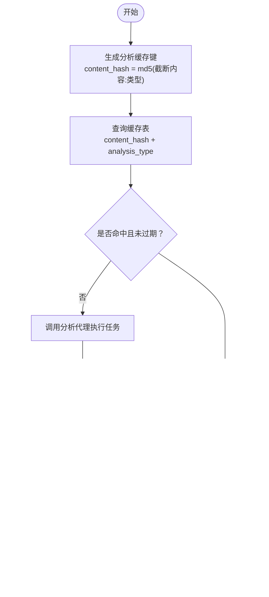

# 分析代理

<cite>
**本文引用的文件**
- [backend/services/analysis_service.py](file://backend/services/analysis_service.py)
- [backend/routes/analysis.py](file://backend/routes/analysis.py)
- [backend/config.py](file://backend/config.py)
- [.qoder/config.json](file://.qoder/config.json)
- [.qoder/agents/analysis_agent.py](file://.qoder/agents/analysis_agent.py)
- [backend/services/cache_service.py](file://backend/services/cache_service.py)
- [backend/models/schemas.py](file://backend/models/schemas.py)
- [backend/models/database.py](file://backend/models/database.py)
- [frontend/src/hooks/useAnalysis.js](file://frontend/src/hooks/useAnalysis.js)
- [frontend/src/services/api.js](file://frontend/src/services/api.js)
- [README.md](file://README.md)
</cite>

## 目录
1. [简介](#简介)
2. [项目结构](#项目结构)
3. [核心组件](#核心组件)
4. [架构总览](#架构总览)
5. [详细组件分析](#详细组件分析)
6. [依赖关系分析](#依赖关系分析)
7. [性能考虑](#性能考虑)
8. [故障排查指南](#故障排查指南)
9. [结论](#结论)
10. [附录](#附录)

## 简介
本文件系统化阐述“分析代理”的设计与实现，覆盖多大模型（LLM）提供商集成（智谱AI、DeepSeek）、模型调用流程、响应解析与缓存策略，并给出摘要生成、内容翻译、论文分析三类任务的输入输出规范、参数传递与错误处理策略。同时提供性能优化建议、缓存清理机制以及扩展新分析功能的方法。

## 项目结构
后端采用分层设计：路由层负责HTTP接口与参数校验；服务层封装分析逻辑与缓存；模型层负责数据库初始化与表结构；配置层统一读取环境变量与.qoder配置；前端通过React Hook与API服务交互。

图表来源
- [backend/routes/analysis.py](file://backend/routes/analysis.py#L1-L66)
- [backend/services/analysis_service.py](file://backend/services/analysis_service.py#L1-L91)
- [.qoder/agents/analysis_agent.py](file://.qoder/agents/analysis_agent.py#L1-L211)
- [backend/services/cache_service.py](file://backend/services/cache_service.py#L1-L104)
- [backend/config.py](file://backend/config.py#L1-L85)
- [backend/models/database.py](file://backend/models/database.py#L1-L51)
- [backend/models/schemas.py](file://backend/models/schemas.py#L1-L38)

章节来源
- [backend/routes/analysis.py](file://backend/routes/analysis.py#L1-L66)
- [backend/services/analysis_service.py](file://backend/services/analysis_service.py#L1-L91)
- [.qoder/agents/analysis_agent.py](file://.qoder/agents/analysis_agent.py#L1-L211)
- [backend/services/cache_service.py](file://backend/services/cache_service.py#L1-L104)
- [backend/config.py](file://backend/config.py#L1-L85)
- [backend/models/schemas.py](file://backend/models/schemas.py#L1-L38)
- [backend/models/database.py](file://backend/models/database.py#L1-L51)

## 核心组件
- 路由层（analysis.py）：暴露三个分析接口，分别对应摘要、翻译、论文分析；进行基础参数校验与异常捕获。
- 服务层（analysis_service.py）：封装分析业务，统一调用分析代理；实现缓存命中与写入；延迟初始化分析代理。
- 分析代理（agents/analysis_agent.py）：封装多LLM提供商客户端（OpenAI兼容/智谱），负责提示词构造、调用LLM、响应解析与错误回传。
- 缓存服务（cache_service.py）：基于SQLite的分析缓存，支持内容哈希键、类型维度、过期时间控制与清理。
- 配置（config.py 与 .qoder/config.json）：合并环境变量与本地配置，提供分析设置（提供商、模型、温度、最大长度、缓存过期等）。
- 数据库与表结构（database.py、schemas.py）：初始化分析缓存表及索引。

章节来源
- [backend/routes/analysis.py](file://backend/routes/analysis.py#L1-L66)
- [backend/services/analysis_service.py](file://backend/services/analysis_service.py#L1-L91)
- [.qoder/agents/analysis_agent.py](file://.qoder/agents/analysis_agent.py#L1-L211)
- [backend/services/cache_service.py](file://backend/services/cache_service.py#L1-L104)
- [backend/config.py](file://backend/config.py#L1-L85)
- [.qoder/config.json](file://.qoder/config.json#L1-L31)
- [backend/models/schemas.py](file://backend/models/schemas.py#L1-L38)
- [backend/models/database.py](file://backend/models/database.py#L1-L51)

## 架构总览
下图展示从前端到后端、再到LLM提供商的整体调用链路与数据流。

图表来源
- [frontend/src/services/api.js](file://frontend/src/services/api.js#L1-L32)
- [backend/routes/analysis.py](file://backend/routes/analysis.py#L1-L66)
- [backend/services/analysis_service.py](file://backend/services/analysis_service.py#L1-L91)
- [.qoder/agents/analysis_agent.py](file://.qoder/agents/analysis_agent.py#L1-L211)

## 详细组件分析

### 路由层（analysis.py）
- 接口职责
  - 摘要：接收content，校验非空，调用服务层summarize，返回{"summary","key_points","error"}。
  - 翻译：接收content与target_lang，校验非空，调用服务层translate，返回{"translated_text","source_lang","error"}。
  - 论文分析：接收title/abstract/snippet至少一项，调用服务层analyze_paper，返回{"abstract_summary","method","innovation","results","conclusion","error"}。
- 错误处理：捕获异常并记录日志，返回统一错误结构。
- 参数校验：对必填字段进行校验，返回400错误。

章节来源
- [backend/routes/analysis.py](file://backend/routes/analysis.py#L1-L66)

### 服务层（analysis_service.py）
- 延迟初始化分析代理：首次调用时动态导入agents/analysis_agent.py并实例化AnalysisAgent。
- 缓存策略
  - 摘要：以content+类型"summary"生成哈希键，查询缓存；若无错误则写入。
  - 翻译：以content+类型"translate_{target_lang}"生成哈希键，查询缓存；若无错误则写入。
  - 论文分析：以标题+摘要片段拼接生成哈希键，查询缓存；若无错误则写入。
- 返回格式：严格遵循各任务定义的键集合，error为空表示成功。

章节来源
- [backend/services/analysis_service.py](file://backend/services/analysis_service.py#L1-L91)
- [backend/services/cache_service.py](file://backend/services/cache_service.py#L1-L104)

### 分析代理（agents/analysis_agent.py）
- 多提供商支持
  - 提供商枚举："zhipu"、"deepseek"。
  - 客户端初始化：DeepSeek使用OpenAI兼容SDK，base_url指向官方网关；智谱使用zhipuai SDK。
  - 模型选择：根据provider从配置中读取对应模型名，默认值分别为"glm-4-flash"与"deepseek-chat"。
- 内容截断：默认最大长度来自配置，超过则截断并追加省略标记。
- 提示词工程
  - 摘要：要求返回JSON对象，包含summary与key_points；若响应非JSON则回退为纯文本摘要。
  - 翻译：按目标语言生成翻译提示，固定返回英文源语言标识。
  - 论文分析：要求返回JSON对象，包含abstract_summary、method、innovation、results、conclusion；若响应非JSON则回退为纯文本。
- 响应解析
  - 直接JSON解析优先；
  - 若包含代码块（含/不含json标签），尝试提取并解析；
  - 否则抛出错误，交由上层服务层处理。
- 错误回传：当客户端未初始化或调用异常时，返回error字符串，供上层统一处理。

图表来源
- [.qoder/agents/analysis_agent.py](file://.qoder/agents/analysis_agent.py#L1-L211)

章节来源
- [.qoder/agents/analysis_agent.py](file://.qoder/agents/analysis_agent.py#L1-L211)

### 缓存服务与数据库
- 缓存键生成
  - 搜索缓存：query_hash = md5(sort_keys后的查询参数)。
  - 分析缓存：content_hash = md5(截断后的内容+":"+"分析类型")。
- 查询与写入
  - 分析缓存：按content_hash与analysis_type查询；若在7天内未过期则返回；否则删除过期项。
  - 写入：以INSERT OR REPLACE方式持久化JSON化的结果。
- 清理策略：定时清理过期条目，减少存储膨胀。
- 数据库初始化：自动创建analysis_cache表与索引。

图表来源
- [backend/services/cache_service.py](file://backend/services/cache_service.py#L1-L104)
- [backend/models/schemas.py](file://backend/models/schemas.py#L1-L38)
- [backend/models/database.py](file://backend/models/database.py#L1-L51)

章节来源
- [backend/services/cache_service.py](file://backend/services/cache_service.py#L1-L104)
- [backend/models/schemas.py](file://backend/models/schemas.py#L1-L38)
- [backend/models/database.py](file://backend/models/database.py#L1-L51)

### 配置与提供商集成
- 环境变量
  - ZHIPU_API_KEY：智谱AI密钥（必填其一）。
  - DEEPSEEK_API_KEY：DeepSeek密钥（必填其一）。
  - HTTP_PROXY/HTTPS_PROXY：可选HTTP代理。
- .qoder/config.json
  - analysis_settings.provider：选择"zhipu"或"deepseek"。
  - analysis_settings.zhipu_model/deepseek_model：各自默认模型名。
  - analysis_settings.max_content_length、temperature、cache_expire_days等。
- 合并策略：config.py优先加载.env，再读取.qoder/config.json中的analysis_settings并合并到Config实例。

章节来源
- [backend/config.py](file://backend/config.py#L1-L85)
- [.qoder/config.json](file://.qoder/config.json#L1-L31)
- [README.md](file://README.md#L48-L128)

### 输入输出与参数传递
- 摘要生成
  - 输入：{"content": "..." }
  - 输出：{"summary": "...", "key_points": ["...", "..."], "error": null|"..."}
- 翻译
  - 输入：{"content": "...", "target_lang": "zh"|其它}
  - 输出：{"translated_text": "...", "source_lang": "en", "error": null|"..."}
- 论文分析
  - 输入：{"title": "...", "abstract": "..."} 或 {"title": "...", "snippet": "..."}
  - 输出：{"abstract_summary": "...", "method": "...", "innovation": "...", "results": "...", "conclusion": "...", "error": null|"..."}

章节来源
- [backend/routes/analysis.py](file://backend/routes/analysis.py#L1-L66)
- [backend/services/analysis_service.py](file://backend/services/analysis_service.py#L1-L91)
- [.qoder/agents/analysis_agent.py](file://.qoder/agents/analysis_agent.py#L1-L211)

### 错误处理策略
- 客户端未初始化：返回"API key not configured or client initialization failed"。
- LLM调用异常：捕获异常并返回错误字符串，供上层统一包装。
- 响应解析失败：当JSON提取失败时，摘要/论文分析回退为纯文本，翻译固定返回英文源语言标识。
- 路由层：捕获服务层异常，记录日志并返回{"error","detail"}。

章节来源
- [.qoder/agents/analysis_agent.py](file://.qoder/agents/analysis_agent.py#L68-L85)
- [.qoder/agents/analysis_agent.py](file://.qoder/agents/analysis_agent.py#L101-L114)
- [.qoder/agents/analysis_agent.py](file://.qoder/agents/analysis_agent.py#L164-L185)
- [backend/routes/analysis.py](file://backend/routes/analysis.py#L22-L24)
- [backend/routes/analysis.py](file://backend/routes/analysis.py#L42-L43)
- [backend/routes/analysis.py](file://backend/routes/analysis.py#L63-L65)

### 不同类型分析任务的实现与调用示例
- 摘要生成
  - 实现：调用generate_summary，内部构造摘要提示词，限制最大长度，解析JSON或回退纯文本。
  - 调用：前端通过useAnalysis.js的summarize触发，后端路由/服务层完成缓存与返回。
- 内容翻译
  - 实现：调用translate_content，按目标语言生成翻译提示，固定返回英文源语言标识。
  - 调用：前端通过useAnalysis.js的translate触发，后端路由/服务层完成缓存与返回。
- 论文分析
  - 实现：调用analyze_paper，组合标题与摘要/片段，构造结构化JSON提示词，解析并回退。
  - 调用：前端通过useAnalysis.js的analyzePaper触发，后端路由/服务层完成缓存与返回。

章节来源
- [.qoder/agents/analysis_agent.py](file://.qoder/agents/analysis_agent.py#L86-L115)
- [.qoder/agents/analysis_agent.py](file://.qoder/agents/analysis_agent.py#L116-L139)
- [.qoder/agents/analysis_agent.py](file://.qoder/agents/analysis_agent.py#L141-L185)
- [frontend/src/hooks/useAnalysis.js](file://frontend/src/hooks/useAnalysis.js#L11-L24)
- [frontend/src/hooks/useAnalysis.js](file://frontend/src/hooks/useAnalysis.js#L26-L42)
- [frontend/src/hooks/useAnalysis.js](file://frontend/src/hooks/useAnalysis.js#L44-L57)

## 依赖关系分析
- 组件耦合
  - 路由层仅依赖服务层；服务层仅依赖分析代理与缓存服务；分析代理依赖配置与日志。
  - 缓存服务依赖数据库连接与表结构；数据库初始化依赖配置与表定义。
- 外部依赖
  - 智谱：zhipuai SDK。
  - DeepSeek：OpenAI兼容SDK（base_url=https://api.deepseek.com）。
- 配置来源
  - 环境变量与.qoder/config.json合并，形成统一的分析设置。

图表来源
- [backend/routes/analysis.py](file://backend/routes/analysis.py#L1-L66)
- [backend/services/analysis_service.py](file://backend/services/analysis_service.py#L1-L91)
- [.qoder/agents/analysis_agent.py](file://.qoder/agents/analysis_agent.py#L1-L211)
- [backend/services/cache_service.py](file://backend/services/cache_service.py#L1-L104)
- [backend/models/database.py](file://backend/models/database.py#L1-L51)
- [backend/models/schemas.py](file://backend/models/schemas.py#L1-L38)
- [backend/config.py](file://backend/config.py#L1-L85)

章节来源
- [backend/routes/analysis.py](file://backend/routes/analysis.py#L1-L66)
- [backend/services/analysis_service.py](file://backend/services/analysis_service.py#L1-L91)
- [.qoder/agents/analysis_agent.py](file://.qoder/agents/analysis_agent.py#L1-L211)
- [backend/services/cache_service.py](file://backend/services/cache_service.py#L1-L104)
- [backend/models/schemas.py](file://backend/models/schemas.py#L1-L38)
- [backend/models/database.py](file://backend/models/database.py#L1-L51)
- [backend/config.py](file://backend/config.py#L1-L85)

## 性能考虑
- 缓存命中率
  - 使用内容哈希+类型维度作为缓存键，避免重复计算；分析缓存默认7天有效期，降低LLM调用频率。
- 内容截断
  - 默认最大长度来自配置，避免超长输入导致成本与耗时上升。
- 并发与连接
  - 数据库采用线程局部连接与WAL模式，提升并发读写稳定性。
- 响应解析优化
  - 支持从代码块中提取JSON，提高鲁棒性；解析失败时快速回退，避免阻塞主流程。
- 前端交互
  - 使用React Hook集中管理状态与加载态，减少不必要的重复请求。

章节来源
- [backend/services/cache_service.py](file://backend/services/cache_service.py#L22-L25)
- [backend/services/cache_service.py](file://backend/services/cache_service.py#L57-L75)
- [.qoder/agents/analysis_agent.py](file://.qoder/agents/analysis_agent.py#L62-L66)
- [backend/models/database.py](file://backend/models/database.py#L11-L21)
- [.qoder/agents/analysis_agent.py](file://.qoder/agents/analysis_agent.py#L187-L210)
- [frontend/src/hooks/useAnalysis.js](file://frontend/src/hooks/useAnalysis.js#L1-L86)

## 故障排查指南
- 无法初始化客户端
  - 症状：返回"API key not configured or client initialization failed"。
  - 排查：确认.env中已配置对应提供商API密钥；检查.qoder/config.json中provider与模型配置是否正确。
- LLM调用异常
  - 症状：返回错误字符串。
  - 排查：查看后端日志；确认网络可达性与代理设置；检查模型限额与配额。
- 响应非JSON
  - 症状：摘要/论文分析返回纯文本而非结构化字段。
  - 排查：调整提示词确保稳定输出JSON；或接受回退逻辑。
- 缓存未生效
  - 症状：相同输入重复触发LLM调用。
  - 排查：确认缓存键生成规则与内容截断一致；检查数据库表与索引是否存在。
- 前端错误提示
  - 症状：UI显示“请求过于频繁/服务器内部错误/参数错误”等。
  - 排查：前端api拦截器已处理常见HTTP状态码与超时；检查后端路由层异常日志。

章节来源
- [.qoder/agents/analysis_agent.py](file://.qoder/agents/analysis_agent.py#L34-L60)
- [.qoder/agents/analysis_agent.py](file://.qoder/agents/analysis_agent.py#L82-L84)
- [.qoder/agents/analysis_agent.py](file://.qoder/agents/analysis_agent.py#L101-L114)
- [.qoder/agents/analysis_agent.py](file://.qoder/agents/analysis_agent.py#L164-L185)
- [backend/services/cache_service.py](file://backend/services/cache_service.py#L57-L75)
- [backend/routes/analysis.py](file://backend/routes/analysis.py#L22-L24)
- [frontend/src/services/api.js](file://frontend/src/services/api.js#L10-L29)

## 结论
分析代理通过清晰的分层设计与统一的配置体系，实现了对多LLM提供商的无缝集成。结合缓存与内容截断策略，在保证质量的同时显著降低了调用成本与延迟。通过标准化的输入输出与错误处理机制，便于扩展新的分析任务与优化现有流程。

## 附录

### 扩展新分析功能的方法
- 新增任务步骤
  - 在agents/analysis_agent.py中新增方法，构造提示词与解析逻辑，返回标准键集合。
  - 在services/analysis_service.py中新增函数，生成缓存键并调用代理方法，必要时写入缓存。
  - 在routes/analysis.py中新增路由，进行参数校验与异常捕获。
  - 在.qoder/config.json中完善analysis_settings，确保provider/model/温度等参数可用。
- 注意事项
  - 保持输出键集合与前端约定一致。
  - 控制最大内容长度，避免超限。
  - 为新任务设计合适的缓存键与过期策略。

章节来源
- [.qoder/agents/analysis_agent.py](file://.qoder/agents/analysis_agent.py#L1-L211)
- [backend/services/analysis_service.py](file://backend/services/analysis_service.py#L1-L91)
- [backend/routes/analysis.py](file://backend/routes/analysis.py#L1-L66)
- [.qoder/config.json](file://.qoder/config.json#L22-L29)