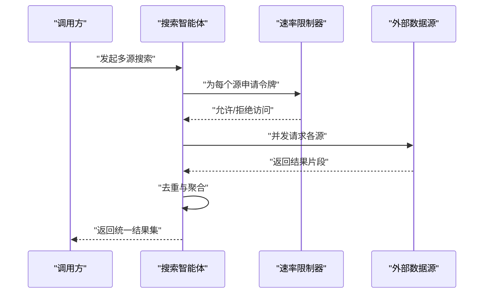
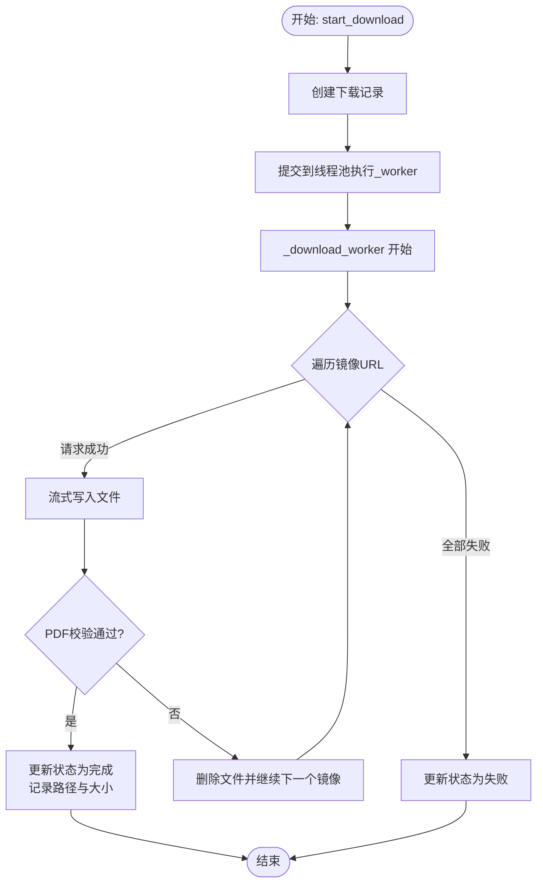
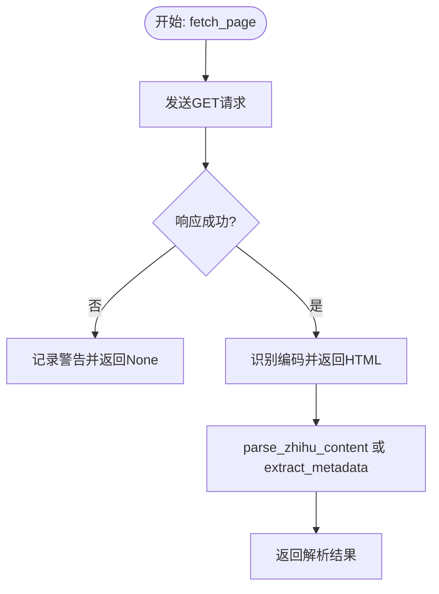
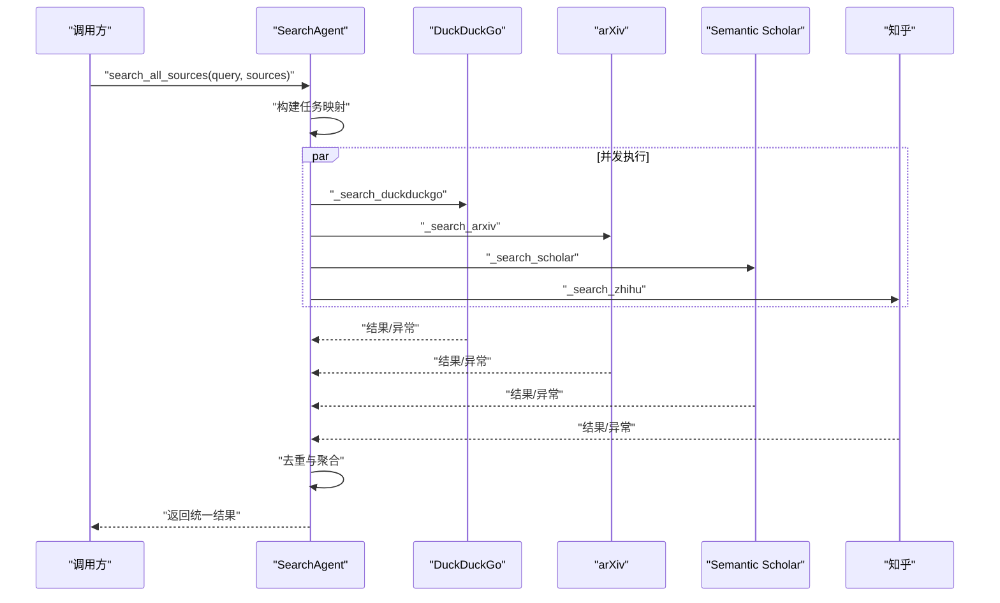
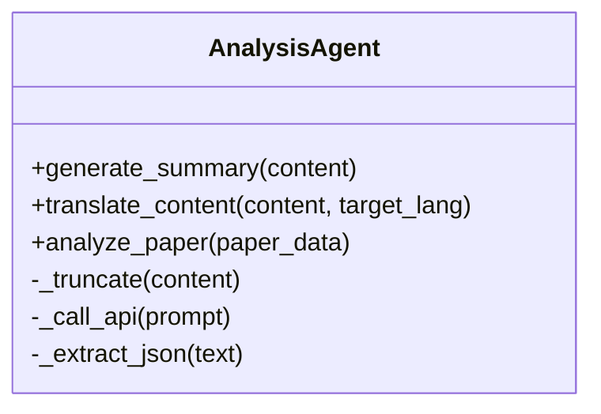
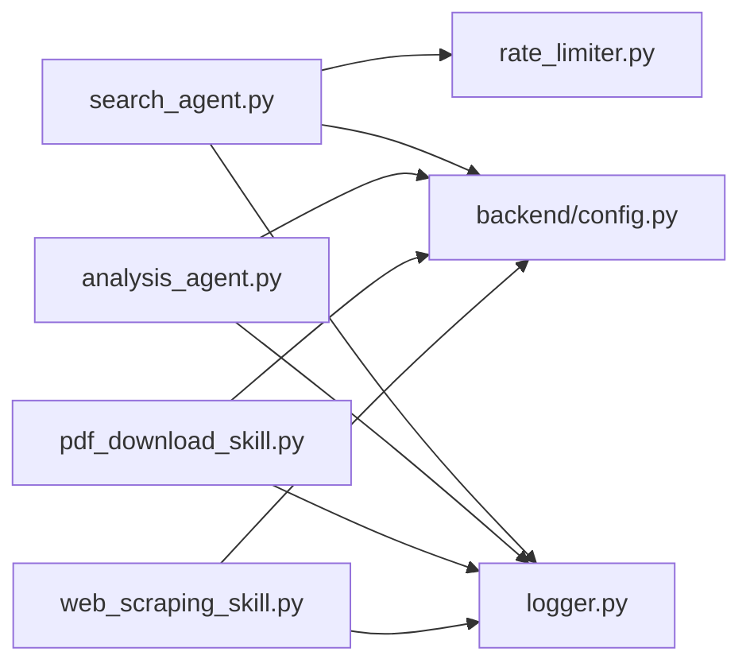

# 技能模块

<cite>
**本文引用的文件**
- [.qoder/skills/pdf_download_skill.py](file://.qoder/skills/pdf_download_skill.py)
- [.qoder/skills/web_scraping_skill.py](file://.qoder/skills/web_scraping_skill.py)
- [.qoder/agents/analysis_agent.py](file://.qoder/agents/analysis_agent.py)
- [.qoder/agents/search_agent.py](file://.qoder/agents/search_agent.py)
- [.qoder/config.json](file://.qoder/config.json)
- [backend/config.py](file://backend/config.py)
- [backend/services/rate_limiter.py](file://backend/services/rate_limiter.py)
- [backend/utils/logger.py](file://backend/utils/logger.py)
</cite>

## 目录
1. [简介](#简介)
2. [项目结构](#项目结构)
3. [核心组件](#核心组件)
4. [架构总览](#架构总览)
5. [详细组件分析](#详细组件分析)
6. [依赖关系分析](#依赖关系分析)
7. [性能考量](#性能考量)
8. [故障排查指南](#故障排查指南)
9. [结论](#结论)
10. [附录：自定义技能开发指南](#附录自定义技能开发指南)

## 简介
本文件系统化阐述“技能模块”的设计与实现，覆盖技能的定义方式、参数配置、执行流程、工厂模式思想、优先级管理与动态加载机制，并结合现有内置技能（PDF 下载、网页抓取、摘要生成、内容翻译、论文分析）给出最佳实践、性能优化与故障排查建议。同时提供面向扩展开发者的自定义技能开发指南，帮助快速接入新技能。

## 项目结构
技能模块位于 .qoder/skills 目录，当前包含两类内置技能：
- PDF 下载技能：负责 arXiv 论文的后台下载、校验与状态记录
- 网页抓取技能：负责网页内容抓取、元数据提取与特定站点解析

此外，.qoder/agents 提供两类智能体：
- 搜索智能体：多源并发搜索与去重
- 分析智能体：基于 LLM 的摘要、翻译与论文分析能力

配置由 .qoder/config.json 统一管理，运行时通过 backend/config.py 合并环境变量与配置文件，形成全局可用的配置对象。

图表来源
- [.qoder/skills/pdf_download_skill.py](file://.qoder/skills/pdf_download_skill.py#L1-L146)
- [.qoder/skills/web_scraping_skill.py](file://.qoder/skills/web_scraping_skill.py#L1-L128)
- [.qoder/agents/search_agent.py](file://.qoder/agents/search_agent.py#L1-L305)
- [.qoder/agents/analysis_agent.py](file://.qoder/agents/analysis_agent.py#L1-L211)
- [.qoder/config.json](file://.qoder/config.json#L1-L31)
- [backend/config.py](file://backend/config.py#L1-L85)
- [backend/services/rate_limiter.py](file://backend/services/rate_limiter.py#L1-L75)
- [backend/utils/logger.py](file://backend/utils/logger.py#L1-L23)

章节来源
- file://.qoder/skills/pdf_download_skill.py#L1-L146
- file://.qoder/skills/web_scraping_skill.py#L1-L128
- file://.qoder/agents/search_agent.py#L1-L305
- file://.qoder/agents/analysis_agent.py#L1-L211
- file://.qoder/config.json#L1-L31
- file://backend/config.py#L1-L85
- file://backend/services/rate_limiter.py#L1-L75
- file://backend/utils/logger.py#L1-L23

## 核心组件
- 技能接口与职责
  - PDF 下载技能：提供启动下载、镜像回退下载、校验、状态更新、查询下载记录等能力
  - 网页抓取技能：提供页面抓取、知乎内容解析、OpenGraph 元数据提取等能力
- 智能体编排
  - 搜索智能体：多源并发搜索、统一去重、超时控制、速率限制
  - 分析智能体：封装不同 LLM 提供商的客户端，提供摘要、翻译、论文分析等服务
- 配置与基础设施
  - 配置合并：.qoder/config.json 与 .env 合并为全局配置
  - 速率限制：Token Bucket 实现多源限流
  - 日志：统一日志器，便于追踪与排障

章节来源
- file://.qoder/skills/pdf_download_skill.py#L21-L146
- file://.qoder/skills/web_scraping_skill.py#L27-L128
- file://.qoder/agents/search_agent.py#L33-L111
- file://.qoder/agents/analysis_agent.py#L18-L211
- file://backend/config.py#L15-L85
- file://backend/services/rate_limiter.py#L5-L75
- file://backend/utils/logger.py#L5-L23

## 架构总览
技能模块采用“技能函数 + 智能体编排 + 配置驱动”的分层架构。技能以纯函数或模块级函数形式暴露，智能体作为上层编排者，按需调用技能并组合结果；配置驱动所有可调参数，包括速率限制、默认搜索源、下载设置、分析模型等。

图表来源
- [.qoder/agents/search_agent.py](file://.qoder/agents/search_agent.py#L33-L111)
- [backend/services/rate_limiter.py](file://backend/services/rate_limiter.py#L45-L75)

章节来源
- file://.qoder/agents/search_agent.py#L33-L111
- file://backend/services/rate_limiter.py#L45-L75

## 详细组件分析

### PDF 下载技能
- 职责边界
  - 启动下载：写入数据库记录、提交后台任务
  - 下载执行：镜像回退、断点续传式写入、超时控制
  - 校验与状态：PDF 头部校验、状态更新、失败回滚
  - 查询接口：按记录 ID 查询、列出全部记录
- 关键流程
  - 启动阶段：创建记录、异步执行下载
  - 执行阶段：循环镜像尝试、流式写入、校验
  - 结果阶段：成功/失败状态落库，记录路径与大小
- 参数与配置
  - 最大并发：线程池最大工作数
  - 保存目录：来自配置
  - 镜像列表：来自配置
  - 数据库路径：由调用方传入
- 错误处理
  - 请求异常：记录警告并继续下一个镜像
  - 校验失败：删除无效文件并标记失败
  - 超时与异常：统一捕获并记录错误日志

图表来源
- [.qoder/skills/pdf_download_skill.py](file://.qoder/skills/pdf_download_skill.py#L21-L106)

章节来源
- file://.qoder/skills/pdf_download_skill.py#L21-L146

### 网页抓取技能
- 职责边界
  - 页面抓取：随机 UA、编码识别、超时控制
  - 内容解析：知乎问答标题与答案片段、作者信息
  - 元数据提取：OpenGraph 标签优先，回退至 <title> 与 meta description
- 关键流程
  - 抓取：构造请求头、发送 GET、异常捕获
  - 解析：BeautifulSoup 解析，按规则提取字段
  - 回退：缺失时使用备选策略
- 参数与配置
  - 超时：可配置
  - UA 列表：随机选择
- 错误处理
  - 抓取失败：返回空值并记录警告
  - 解析异常：返回空结构或部分结果并记录警告

图表来源
- [.qoder/skills/web_scraping_skill.py](file://.qoder/skills/web_scraping_skill.py#L27-L128)

章节来源
- file://.qoder/skills/web_scraping_skill.py#L27-L128

### 搜索智能体
- 职责边界
  - 多源并发：支持 DuckDuckGo、arXiv、Semantic Scholar、知乎
  - 去重与聚合：按 URL 去重，汇总统计与状态
  - 超时控制：统一超时，未完成标记为超时
  - 速率限制：按源维度的令牌桶限流
- 关键流程
  - 任务构建：根据源映射到具体方法
  - 并发执行：ThreadPoolExecutor 提交任务
  - 结果收集：完成即取回，异常记录状态
  - 去重：基于 URL 去重
- 参数与配置
  - 默认每源结果数、超时秒数、代理
  - 速率限制参数来自配置
- 错误处理
  - 源不可用：跳过并记录 skipped
  - 异常：记录 failed 并继续其他任务
  - 超时：未完成标记 timeout

图表来源
- [.qoder/agents/search_agent.py](file://.qoder/agents/search_agent.py#L33-L111)

章节来源
- file://.qoder/agents/search_agent.py#L33-L111

### 分析智能体
- 职责边界
  - LLM 客户端初始化：支持 ZhipuAI 与 DeepSeek
  - 文本截断：按最大长度限制
  - API 调用：统一 chat.completions 接口
  - 结果解析：JSON 提取与回退文本
- 内置分析能力
  - 摘要生成：返回摘要与关键要点
  - 内容翻译：目标语言可配置
  - 论文分析：返回摘要概述、方法、创新点、结果与结论
- 参数与配置
  - provider、模型名、最大内容长度、温度
- 错误处理
  - API 初始化失败：返回提示
  - 调用异常：返回错误信息
  - JSON 解析失败：回退为纯文本

图表来源
- [.qoder/agents/analysis_agent.py](file://.qoder/agents/analysis_agent.py#L13-L211)

章节来源
- file://.qoder/agents/analysis_agent.py#L18-L211

## 依赖关系分析
- 技能与智能体
  - 搜索智能体在搜索阶段可能调用网页抓取技能进行内容解析或元数据提取
  - 分析智能体在摘要、翻译、论文分析前，可能需要先通过搜索智能体获取内容
- 配置与限流
  - 搜索智能体依赖速率限制器与配置中的限流参数
  - 所有组件共享 backend/config.py 提供的全局配置
- 日志
  - 所有模块通过 backend/utils/logger.py 获取日志器，统一输出格式

图表来源
- [.qoder/agents/search_agent.py](file://.qoder/agents/search_agent.py#L1-L305)
- [.qoder/agents/analysis_agent.py](file://.qoder/agents/analysis_agent.py#L1-L211)
- [.qoder/skills/pdf_download_skill.py](file://.qoder/skills/pdf_download_skill.py#L1-L146)
- [.qoder/skills/web_scraping_skill.py](file://.qoder/skills/web_scraping_skill.py#L1-L128)
- [backend/services/rate_limiter.py](file://backend/services/rate_limiter.py#L1-L75)
- [backend/config.py](file://backend/config.py#L1-L85)
- [backend/utils/logger.py](file://backend/utils/logger.py#L1-L23)

章节来源
- file://.qoder/agents/search_agent.py#L1-L305
- file://.qoder/agents/analysis_agent.py#L1-L211
- file://.qoder/skills/pdf_download_skill.py#L1-L146
- file://.qoder/skills/web_scraping_skill.py#L1-L128
- file://backend/services/rate_limiter.py#L1-L75
- file://backend/config.py#L1-L85
- file://backend/utils/logger.py#L1-L23

## 性能考量
- 并发与限流
  - 搜索智能体使用线程池并发拉取多个源，避免串行瓶颈
  - 速率限制器按源维度控制请求频率，降低被限流风险
- I/O 优化
  - PDF 下载采用流式写入，减少内存占用
  - 网页抓取设置合理超时，避免长时间阻塞
- 缓存与复用
  - 配置中提供缓存过期时间（搜索与分析），可结合业务场景启用
- 资源隔离
  - PDF 下载线程池独立于搜索线程池，避免相互影响

[本节为通用性能建议，不直接分析具体文件]

## 故障排查指南
- 日志定位
  - 使用统一日志器输出，按模块区分（如 pdf_download_skill、web_scraping_skill、search_agent、analysis_agent）
- 常见问题
  - API 密钥未配置：分析智能体会返回相应提示
  - 下载失败：检查镜像可用性、网络状况与磁盘权限
  - 抓取失败：UA 可能被反爬，适当调整或增加重试
  - 速率受限：调整配置中的容量与补充速率
- 快速验证
  - 检查 .env 中的 API KEY 与代理设置
  - 查看 .qoder/config.json 的各项参数是否符合预期
  - 使用日志级别提升定位问题范围

章节来源
- file://backend/utils/logger.py#L5-L23
- file://.qoder/agents/analysis_agent.py#L34-L61
- file://.qoder/skills/pdf_download_skill.py#L51-L88
- file://.qoder/skills/web_scraping_skill.py#L38-L46
- file://backend/services/rate_limiter.py#L27-L42

## 结论
技能模块通过“纯函数技能 + 智能体编排 + 配置驱动”的方式，实现了可扩展、可维护、可观察的 AI 代理能力体系。现有内置技能覆盖了内容获取、解析与分析的关键路径；通过速率限制与日志体系保障了稳定性与可观测性。后续可通过扩展技能与智能体，进一步丰富代理能力矩阵。

[本节为总结性内容，不直接分析具体文件]

## 附录：自定义技能开发指南
- 设计原则
  - 单一职责：每个技能聚焦一个明确任务域
  - 明确输入输出：约定清晰的参数与返回结构
  - 可配置性：尽量从配置中读取参数，避免硬编码
  - 可观测性：使用统一日志器记录关键事件
- 工厂模式与动态加载
  - 当前仓库未实现显式的“技能工厂”，但可通过“源到方法映射”实现类似效果（参考搜索智能体的任务映射）
  - 建议：为新增技能建立“名称 -> 函数/类”的注册表，配合配置文件启用/禁用
- 优先级管理
  - 对于多路返回的场景，可在上层智能体中引入权重或策略进行排序与裁剪
- 开发步骤
  - 在 .qoder/skills 新建模块，定义技能函数
  - 在 .qoder/config.json 中添加必要配置项
  - 在智能体中注册调用入口（或通过映射自动发现）
  - 编写单元测试与集成测试，确保边界条件与异常处理完备
- 最佳实践
  - 合理设置超时与重试
  - 流式处理大文件与长文本
  - 使用速率限制保护外部依赖
  - 通过日志与指标监控关键路径

[本节为开发指南，不直接分析具体文件]