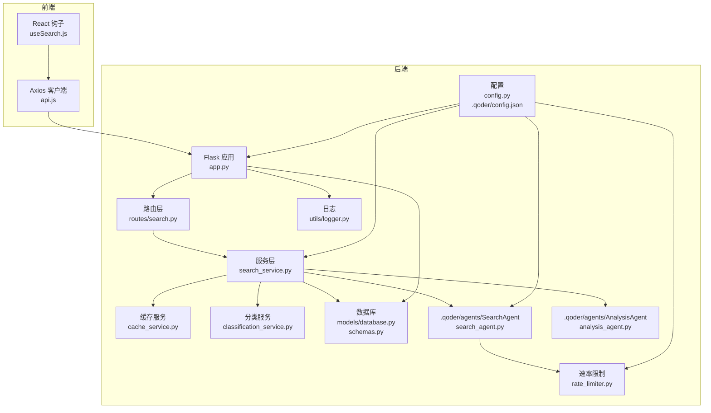
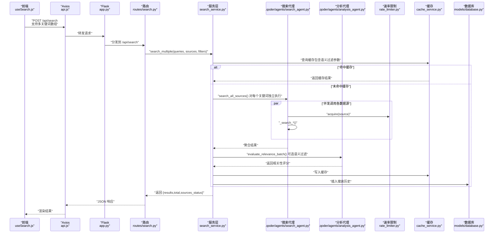
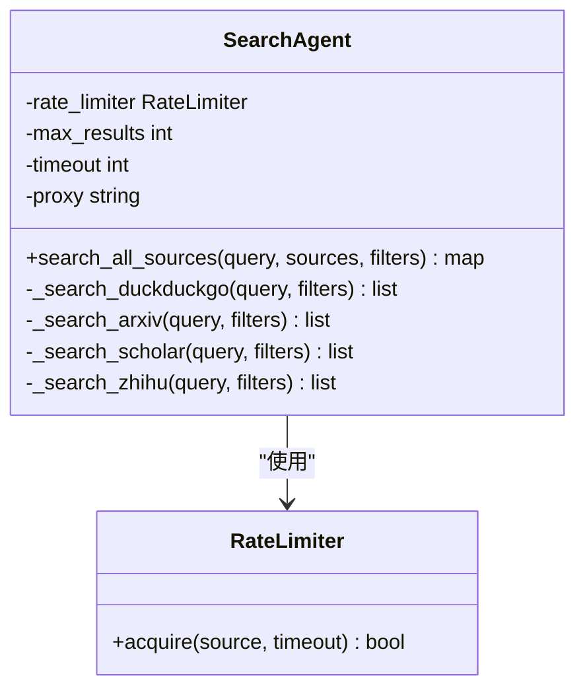
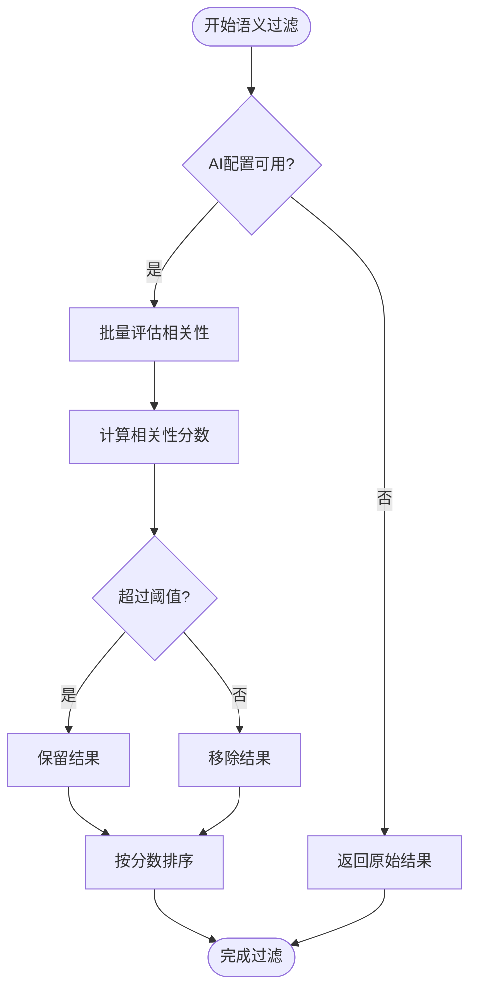
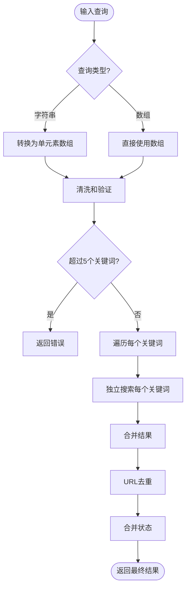
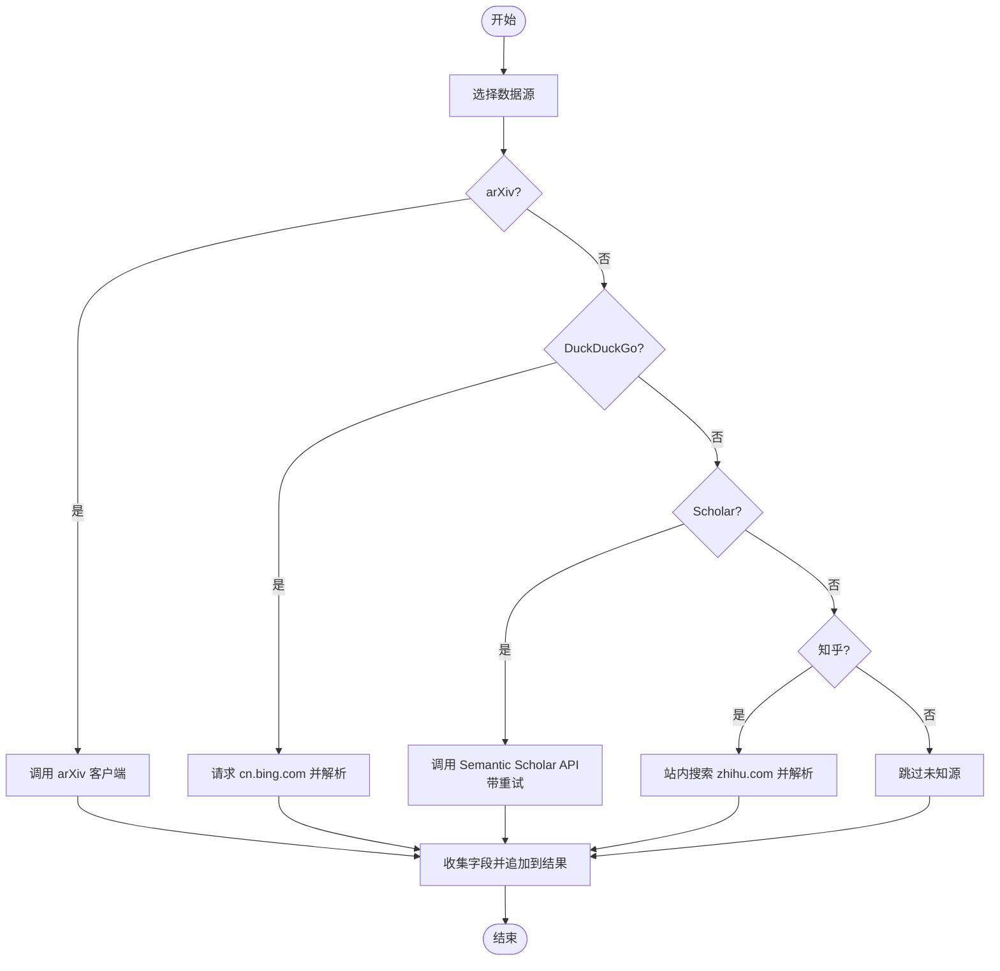
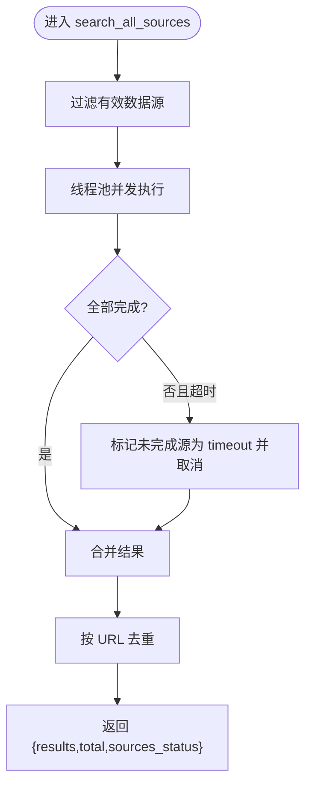
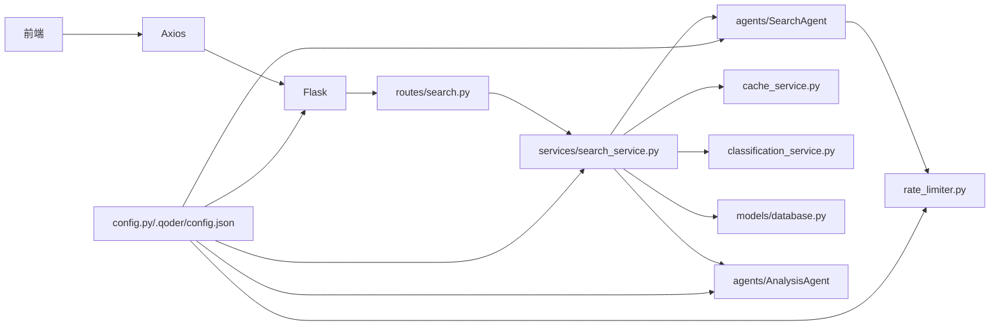

# 搜索代理

<cite>
**本文引用的文件**
- [README.md](file://README.md)
- [run.sh](file://run.sh)
- [backend/app.py](file://backend/app.py)
- [backend/config.py](file://backend/config.py)
- [.qoder/config.json](file://.qoder/config.json)
- [backend/routes/search.py](file://backend/routes/search.py)
- [backend/services/search_service.py](file://backend/services/search_service.py)
- [backend/services/cache_service.py](file://backend/services/cache_service.py)
- [backend/services/classification_service.py](file://backend/services/classification_service.py)
- [backend/services/rate_limiter.py](file://backend/services/rate_limiter.py)
- [backend/models/database.py](file://backend/models/database.py)
- [backend/models/schemas.py](file://backend/models/schemas.py)
- [backend/utils/logger.py](file://backend/utils/logger.py)
- [.qoder/agents/search_agent.py](file://.qoder/agents/search_agent.py)
- [.qoder/agents/analysis_agent.py](file://.qoder/agents/analysis_agent.py)
- [frontend/src/hooks/useSearch.js](file://frontend/src/hooks/useSearch.js)
- [frontend/src/services/api.js](file://frontend/src/services/api.js)
</cite>

## 目录
1. [简介](#简介)
2. [项目结构](#项目结构)
3. [核心组件](#核心组件)
4. [架构总览](#架构总览)
5. [详细组件分析](#详细组件分析)
6. [依赖关系分析](#依赖关系分析)
7. [性能考量](#性能考量)
8. [故障排查指南](#故障排查指南)
9. [结论](#结论)
10. [附录](#附录)

## 简介
本文件面向"Search Is All You Need"项目中的多源搜索代理，系统性阐述其设计与实现，包括：
- 代理工厂模式与懒加载初始化
- 多数据源（arXiv、DuckDuckGo/Bing、Google Scholar/Semantic Scholar、知乎）的集成方式
- **新增** 多关键词搜索与独立查询处理
- **新增** AI驱动的语义过滤与相关性评分
- 搜索结果聚合与去重策略
- 生命周期管理、错误处理与性能优化
- 配置参数、调用示例与扩展新数据源的方法
- 调试技巧与常见问题解决方案

## 项目结构
后端采用 Flask 应用，路由层负责接收请求，服务层编排搜索与缓存，模型层负责数据库初始化与表结构，工具层提供日志与通用能力；搜索代理位于 .qoder/agents 目录，作为可插拔的搜索执行器。

**图表来源**
- [backend/app.py](file://backend/app.py#L21-L78)
- [backend/routes/search.py](file://backend/routes/search.py#L10-L28)
- [backend/services/search_service.py](file://backend/services/search_service.py#L28-L98)
- [backend/services/cache_service.py](file://backend/services/cache_service.py#L16-L104)
- [backend/services/classification_service.py](file://backend/services/classification_service.py#L30-L64)
- [backend/services/rate_limiter.py](file://backend/services/rate_limiter.py#L45-L75)
- [backend/models/database.py](file://backend/models/database.py#L36-L51)
- [backend/models/schemas.py](file://backend/models/schemas.py#L1-L38)
- [backend/config.py](file://backend/config.py#L15-L85)
- [.qoder/config.json](file://.qoder/config.json#L1-L31)
- [backend/utils/logger.py](file://backend/utils/logger.py#L5-L23)
- [.qoder/agents/search_agent.py](file://.qoder/agents/search_agent.py#L21-L305)
- [.qoder/agents/analysis_agent.py](file://.qoder/agents/analysis_agent.py#L13-L310)

**章节来源**
- [README.md](file://README.md#L376-L409)
- [backend/app.py](file://backend/app.py#L21-L78)
- [backend/config.py](file://backend/config.py#L15-L85)
- [.qoder/config.json](file://.qoder/config.json#L1-L31)

## 核心组件
- 搜索代理（SearchAgent）：负责多源并发搜索、速率限制、结果聚合与去重、异常处理与日志记录。
- **新增** 分析代理（AnalysisAgent）：提供AI驱动的语义相关性评估、摘要生成和翻译功能。
- 服务层（search_service）：对外暴露统一搜索接口，负责缓存命中、分类标注、历史记录持久化与延迟初始化代理，**新增** 语义过滤与多关键词搜索处理。
- 路由层（routes/search）：接收前端请求，校验参数，调用服务层并返回结果，**支持多关键词查询**。
- 缓存服务（cache_service）：基于 SQLite 的搜索与分析缓存，带过期清理。
- 分类服务（classification_service）：根据来源与 URL 规则对结果进行内容类别标注。
- 速率限制（rate_limiter）：基于令牌桶的多源并发节流。
- 数据库（models/database, models/schemas）：SQLite 初始化、WAL 模式、索引与表结构。
- 配置（config.py, .qoder/config.json）：合并 .env 与 .qoder/config.json，提供搜索、下载、分析、速率限制等默认值。
- 日志（utils/logger）：统一日志格式与输出。

**章节来源**
- [.qoder/agents/search_agent.py](file://.qoder/agents/search_agent.py#L21-L305)
- [.qoder/agents/analysis_agent.py](file://.qoder/agents/analysis_agent.py#L13-L310)
- [backend/services/search_service.py](file://backend/services/search_service.py#L28-L98)
- [backend/routes/search.py](file://backend/routes/search.py#L10-L28)
- [backend/services/cache_service.py](file://backend/services/cache_service.py#L16-L104)
- [backend/services/classification_service.py](file://backend/services/classification_service.py#L30-L64)
- [backend/services/rate_limiter.py](file://backend/services/rate_limiter.py#L45-L75)
- [backend/models/database.py](file://backend/models/database.py#L36-L51)
- [backend/models/schemas.py](file://backend/models/schemas.py#L1-L38)
- [backend/config.py](file://backend/config.py#L15-L85)
- [.qoder/config.json](file://.qoder/config.json#L1-L31)
- [backend/utils/logger.py](file://backend/utils/logger.py#L5-L23)

## 架构总览
多源搜索的整体流程如下：前端发起搜索请求 → 路由层接收 → 服务层检查缓存/分类/历史 → 代理并发调用各数据源 → **新增** 语义过滤与相关性评分 → 聚合去重 → 返回结果。

**图表来源**
- [frontend/src/hooks/useSearch.js](file://frontend/src/hooks/useSearch.js#L23-L43)
- [frontend/src/services/api.js](file://frontend/src/services/api.js#L4-L32)
- [backend/app.py](file://backend/app.py#L21-L78)
- [backend/routes/search.py](file://backend/routes/search.py#L13-L44)
- [backend/services/search_service.py](file://backend/services/search_service.py#L135-L186)
- [.qoder/agents/search_agent.py](file://.qoder/agents/search_agent.py#L73-L175)
- [.qoder/agents/analysis_agent.py](file://.qoder/agents/analysis_agent.py#L212-L310)
- [backend/services/rate_limiter.py](file://backend/services/rate_limiter.py#L64-L75)
- [backend/services/cache_service.py](file://backend/services/cache_service.py#L30-L53)
- [backend/models/database.py](file://backend/models/database.py#L36-L51)

## 详细组件分析

### 搜索代理（SearchAgent）与工厂模式
- 懒加载与单例：服务层通过私有变量延迟导入并实例化代理，避免应用启动即加载外部依赖。
- 工厂映射：以字典将数据源名称映射到对应搜索方法，便于扩展与裁剪。
- 并发执行：使用线程池并发调用各数据源，按完成顺序收集结果，支持超时取消。
- 聚合与去重：按 URL 去重，保证结果唯一性。
- 状态上报：对每个数据源返回 success/failed/skipped/timeout 四种状态，便于前端展示与统计。

**图表来源**
- [.qoder/agents/search_agent.py](file://.qoder/agents/search_agent.py#L21-L305)
- [backend/services/rate_limiter.py](file://backend/services/rate_limiter.py#L45-L75)

**章节来源**
- [backend/services/search_service.py](file://backend/services/search_service.py#L23-L29)
- [.qoder/agents/search_agent.py](file://.qoder/agents/search_agent.py#L73-L175)

### 新增：分析代理（AnalysisAgent）与语义过滤
- **AI驱动相关性评估**：使用LLM API对搜索结果进行语义相关性评分（0-100分）。
- **批量处理优化**：支持批量评估多个结果，减少API调用次数。
- **多提供商支持**：支持ZhipuAI和DeepSeek两种AI提供商。
- **可配置阈值**：用户可设置相关性阈值，过滤不相关的搜索结果。
- **降级处理**：当AI服务不可用时，返回原始结果而不影响搜索流程。

**图表来源**
- [.qoder/agents/analysis_agent.py](file://.qoder/agents/analysis_agent.py#L212-L310)
- [backend/services/search_service.py](file://backend/services/search_service.py#L41-L78)

**章节来源**
- [.qoder/agents/analysis_agent.py](file://.qoder/agents/analysis_agent.py#L13-L310)
- [backend/services/search_service.py](file://backend/services/search_service.py#L41-L78)

### 新增：多关键词搜索与独立查询处理
- **查询格式支持**：同时支持字符串（单关键词）和数组（多关键词）两种查询格式。
- **独立查询执行**：对每个关键词独立执行搜索，然后合并结果。
- **URL去重**：合并后按URL去重，避免重复结果。
- **状态合并**：合并各关键词的搜索状态，保留最差状态。
- **查询限制**：最多支持5个关键词，防止滥用。

**图表来源**
- [backend/routes/search.py](file://backend/routes/search.py#L18-L44)
- [backend/services/search_service.py](file://backend/services/search_service.py#L135-L186)

**章节来源**
- [backend/routes/search.py](file://backend/routes/search.py#L13-L44)
- [backend/services/search_service.py](file://backend/services/search_service.py#L135-L186)

### 数据源集成方式
- arXiv：使用官方客户端进行检索，设置分页大小与重试次数，提取作者、发表时间、PDF 链接等字段。
- DuckDuckGo（通过 Bing）：构造中文 Bing 搜索链接，解析搜索结果列表，提取标题、URL、摘要。
- Google Scholar（通过 Semantic Scholar）：调用免费 API，带指数退避重试，优先选择 DOI 或 ArXiv 链接。
- 知乎：通过 Bing 站内搜索限定域名，解析结果并过滤非知乎链接。

**图表来源**
- [.qoder/agents/search_agent.py](file://.qoder/agents/search_agent.py#L177-L407)

**章节来源**
- [.qoder/agents/search_agent.py](file://.qoder/agents/search_agent.py#L177-L407)

### 搜索结果聚合算法
- 并发策略：线程池最大并发等于有效数据源数量，确保资源可控。
- 超时控制：统一超时阈值，未完成的任务被取消并标记为 timeout。
- 去重策略：以 URL 为键集合去重，保留首次出现的结果，保证唯一性。
- 状态汇总：记录每个数据源的最终状态，便于前端反馈与统计。

**图表来源**
- [.qoder/agents/search_agent.py](file://.qoder/agents/search_agent.py#L73-L175)

**章节来源**
- [.qoder/agents/search_agent.py](file://.qoder/agents/search_agent.py#L73-L175)

### 生命周期管理
- 应用启动：初始化数据库、注册蓝图、设置静态文件与全局错误处理器。
- 服务层：首次搜索时才导入并实例化代理，避免常驻内存。
- 缓存：按配置设置 TTL，定期清理过期条目。
- 数据库：线程本地连接、WAL 模式、外键启用，保证并发与一致性。

**章节来源**
- [backend/app.py](file://backend/app.py#L21-L78)
- [backend/services/search_service.py](file://backend/services/search_service.py#L23-L29)
- [backend/services/cache_service.py](file://backend/services/cache_service.py#L91-L104)
- [backend/models/database.py](file://backend/models/database.py#L11-L21)

### 错误处理机制
- 代理层：捕获各数据源异常并记录错误日志，将失败源标记为 failed；超时以 timeout 标记。
- 服务层：捕获异常并返回统一错误响应；历史记录保存失败不中断主流程。
- 路由层：参数校验与异常兜底，返回结构化错误信息。
- 前端：拦截 HTTP 状态码并提示用户，如 429、5xx、400 等。

**章节来源**
- [.qoder/agents/search_agent.py](file://.qoder/agents/search_agent.py#L118-L136)
- [backend/services/search_service.py](file://backend/services/search_service.py#L118-L122)
- [backend/routes/search.py](file://backend/routes/search.py#L42-L44)
- [frontend/src/services/api.js](file://frontend/src/services/api.js#L10-L29)

### 性能优化策略
- 速率限制：为各数据源配置独立令牌桶，避免触发上游限流。
- 并发与超时：按数据源数量动态调整并发度，统一超时阈值，缩短整体等待时间。
- 缓存：搜索与分析结果缓存，降低重复请求；定期清理过期缓存。
- 去重：URL 去重减少冗余，提升用户体验。
- 代理：按需加载代理，避免启动开销。
- **新增** 批量语义评估：分析代理支持批量处理，减少API调用次数。

**章节来源**
- [backend/services/rate_limiter.py](file://backend/services/rate_limiter.py#L45-L75)
- [.qoder/agents/search_agent.py](file://.qoder/agents/search_agent.py#L111-L175)
- [backend/services/cache_service.py](file://backend/services/cache_service.py#L91-L104)
- [backend/services/search_service.py](file://backend/services/search_service.py#L118-L122)
- [.qoder/agents/analysis_agent.py](file://.qoder/agents/analysis_agent.py#L212-L240)

### 配置参数
- 速率限制（.qoder/config.json）：每源容量与补充速率。
- 搜索默认值（.qoder/config.json）：每源最大结果数、超时秒数、缓存过期间小时、默认数据源。
- 下载设置（.qoder/config.json）：保存目录、并发数、arXiv 镜像列表。
- 分析设置（.qoder/config.json）：提供商、模型、最大内容长度、温度、缓存过期天数。
- 环境变量（.env）：密钥、端口、数据库路径、下载目录、HTTP 代理。

**章节来源**
- [.qoder/config.json](file://.qoder/config.json#L1-L31)
- [backend/config.py](file://backend/config.py#L50-L78)
- [README.md](file://README.md#L48-L96)

### 调用示例
- 前端调用：通过自定义 Hook 发起搜索，传入查询词与数据源列表，接收结果与状态。
- 后端接口：POST /api/search，请求体包含 queries（数组）或 query（字符串）、sources、filters，返回 results、total、sources_status。
- **新增** 多关键词示例：`{"queries": ["机器学习", "深度学习", "神经网络"]}`

**章节来源**
- [frontend/src/hooks/useSearch.js](file://frontend/src/hooks/useSearch.js#L23-L43)
- [backend/routes/search.py](file://backend/routes/search.py#L13-L44)
- [README.md](file://README.md#L229-L248)

### 扩展新数据源的方法
- 在代理类中新增搜索方法，遵循统一返回结构（标题、URL、摘要、来源、作者、发表时间、额外字段）。
- 在工厂映射中添加新数据源名称到方法的映射。
- 如需限流，为新源在配置中添加速率限制参数。
- 如需分类标注，可在分类规则中加入域名或来源映射。

**章节来源**
- [.qoder/agents/search_agent.py](file://.qoder/agents/search_agent.py#L93-L98)
- [.qoder/agents/search_agent.py](file://.qoder/agents/search_agent.py#L177-L407)
- [backend/services/classification_service.py](file://backend/services/classification_service.py#L42-L48)
- [.qoder/config.json](file://.qoder/config.json#L2-L7)

## 依赖关系分析
- 组件耦合：服务层依赖代理、缓存、分类与数据库；代理依赖速率限制与配置；路由依赖服务层；前端依赖路由。
- 外部依赖：arxiv、requests、BeautifulSoup4、duckduckgo_search 等第三方库。
- 配置耦合：配置中心集中管理搜索、下载、分析与速率限制参数。

**图表来源**
- [backend/app.py](file://backend/app.py#L21-L78)
- [backend/routes/search.py](file://backend/routes/search.py#L10-L28)
- [backend/services/search_service.py](file://backend/services/search_service.py#L28-L98)
- [.qoder/agents/search_agent.py](file://.qoder/agents/search_agent.py#L21-L305)
- [.qoder/agents/analysis_agent.py](file://.qoder/agents/analysis_agent.py#L13-L310)
- [backend/services/rate_limiter.py](file://backend/services/rate_limiter.py#L45-L75)
- [backend/services/cache_service.py](file://backend/services/cache_service.py#L16-L104)
- [backend/services/classification_service.py](file://backend/services/classification_service.py#L30-L64)
- [backend/models/database.py](file://backend/models/database.py#L36-L51)
- [backend/config.py](file://backend/config.py#L15-L85)
- [.qoder/config.json](file://.qoder/config.json#L1-L31)

## 性能考量
- 并发度：按数据源数量动态并发，避免过度并发导致资源争用。
- 超时与取消：统一超时阈值，未完成任务及时取消，减少资源浪费。
- 限流策略：为高限流风险的数据源设置更保守的容量与补充速率。
- 缓存命中：合理设置 TTL，结合定期清理，平衡新鲜度与性能。
- 去重成本：URL 去重为 O(n) 额外空间与时间，建议在结果规模较大时评估内存占用。
- **新增** 批量处理：分析代理的批量处理减少了API调用次数，提升了整体性能。

## 故障排查指南
- 搜索无结果
  - arXiv 仅支持英文关键词，建议改用英文或混合关键词。
  - Semantic Scholar API 有 429 限流，系统会自动重试，若仍失败请降低并发或延长时间间隔。
  - 查看后端日志定位具体错误。
- **新增** 语义过滤不可用
  - 确认已配置有效的AI提供商密钥与正确的 provider 设置。
  - 检查AI服务是否可用，必要时禁用语义过滤功能。
- PDF 下载失败
  - arXiv 服务器临时不可用，系统会尝试国内镜像；可稍后重试。
- 前端报错
  - 429：请求过于频繁，请稍后再试。
  - 5xx：服务器内部错误，请查看后端日志。
  - 400：请求参数错误。
  - 超时：请求超时，请重试或增加超时时间。

**章节来源**
- [README.md](file://README.md#L361-L375)
- [frontend/src/services/api.js](file://frontend/src/services/api.js#L10-L29)

## 结论
该搜索代理通过工厂模式与懒加载实现可插拔的多源搜索，结合线程池并发、令牌桶限流、缓存与去重策略，提供了稳定高效的聚合搜索体验。**新增的多关键词搜索功能**使得用户可以同时搜索多个相关概念，而**AI驱动的语义过滤**进一步提升了搜索结果的相关性和质量。配合清晰的配置体系与完善的错误处理，既满足易用性也兼顾了可维护性与可扩展性。

## 附录
- 一键启动：脚本会自动创建虚拟环境、安装依赖、构建前端并启动后端服务。
- 环境变量与配置：请参考 README 的环境配置与 .qoder/config.json 的配置项说明。

**章节来源**
- [run.sh](file://run.sh#L1-L50)
- [README.md](file://README.md#L48-L128)