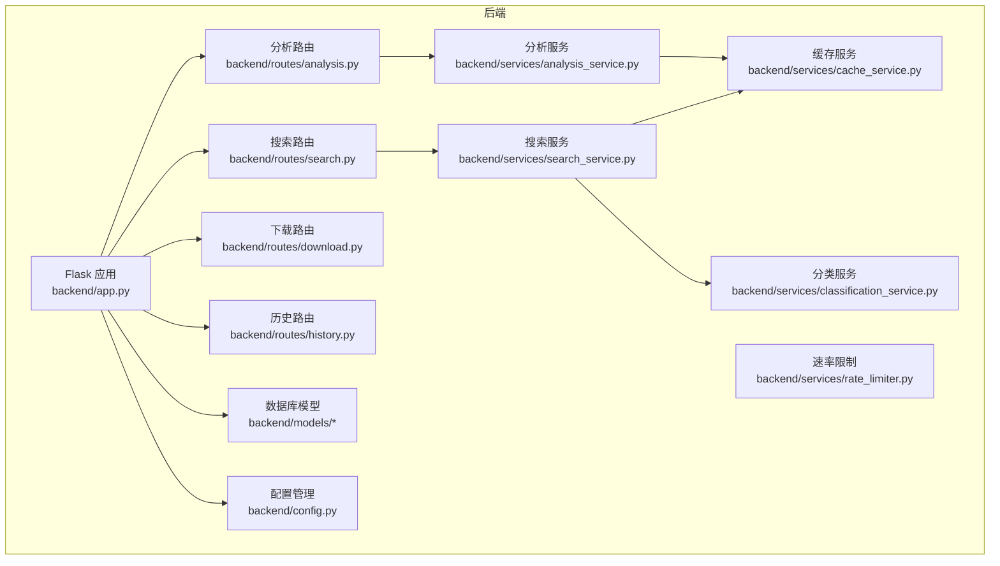
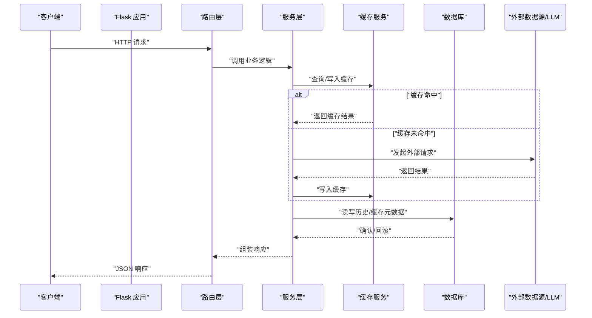
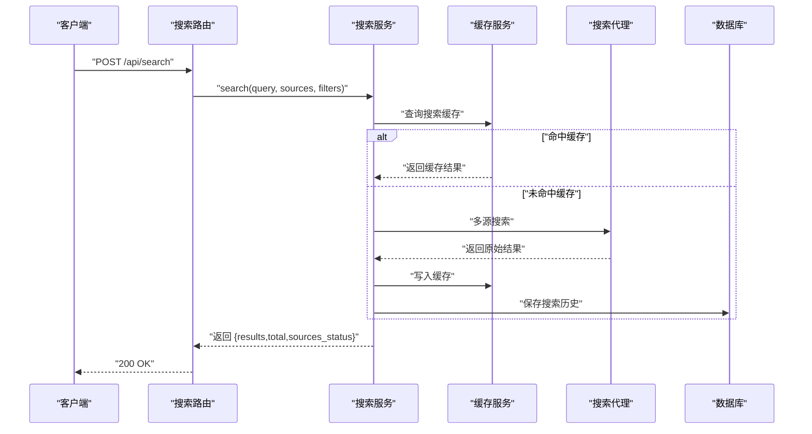
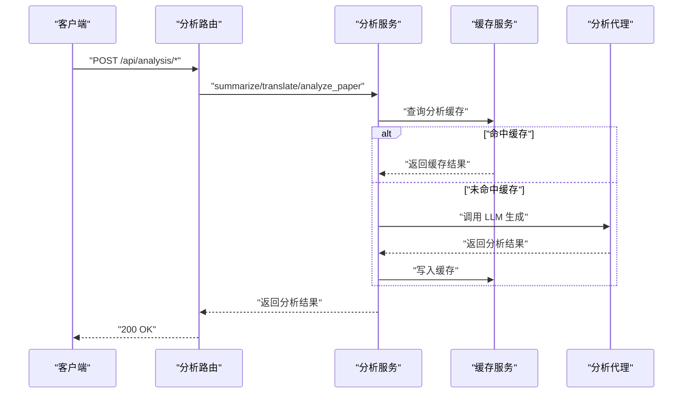
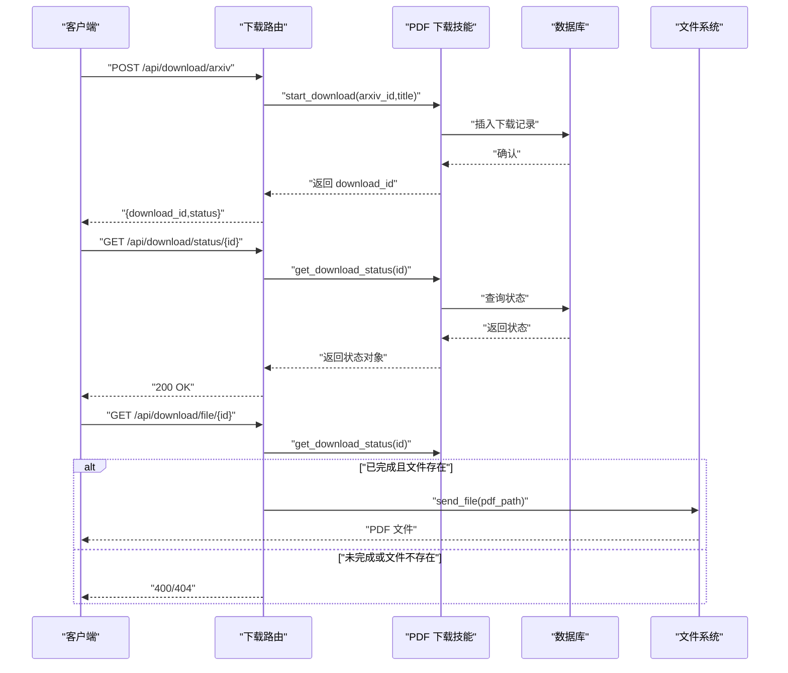
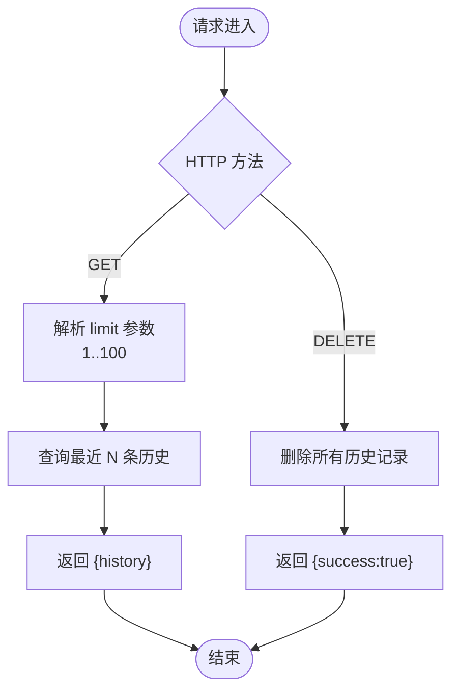
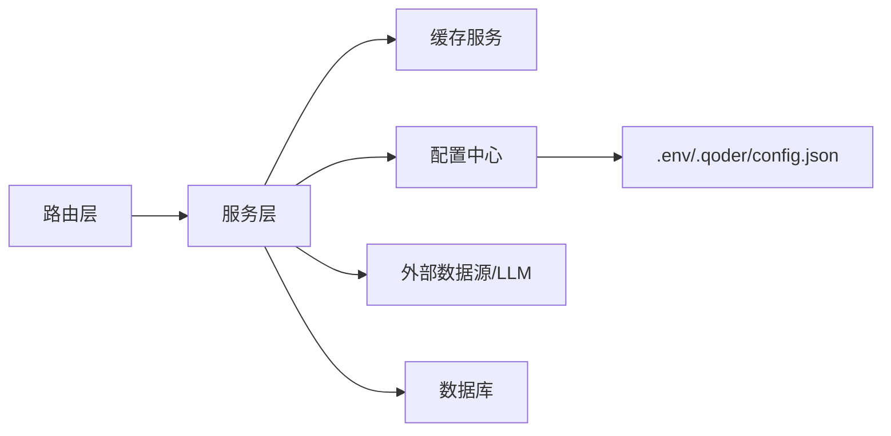

# API接口参考

<cite>
**本文档引用的文件**
- [backend/app.py](file://backend/app.py)
- [backend/config.py](file://backend/config.py)
- [backend/routes/search.py](file://backend/routes/search.py)
- [backend/routes/analysis.py](file://backend/routes/analysis.py)
- [backend/routes/download.py](file://backend/routes/download.py)
- [backend/routes/history.py](file://backend/routes/history.py)
- [backend/services/search_service.py](file://backend/services/search_service.py)
- [backend/services/analysis_service.py](file://backend/services/analysis_service.py)
- [backend/services/cache_service.py](file://backend/services/cache_service.py)
- [backend/services/classification_service.py](file://backend/services/classification_service.py)
- [backend/services/rate_limiter.py](file://backend/services/rate_limiter.py)
- [backend/models/database.py](file://backend/models/database.py)
- [backend/models/schemas.py](file://backend/models/schemas.py)
- [.env.example](file://.env.example)
- [.qoder/config.json](file://.qoder/config.json)
- [README.md](file://README.md)
</cite>

## 目录
1. [简介](#简介)
2. [项目结构](#项目结构)
3. [核心组件](#核心组件)
4. [架构总览](#架构总览)
5. [详细组件分析](#详细组件分析)
6. [依赖关系分析](#依赖关系分析)
7. [性能考量](#性能考量)
8. [故障排查指南](#故障排查指南)
9. [结论](#结论)
10. [附录](#附录)

## 简介
本文件为 Search Is All You Need 的完整 RESTful API 接口参考，覆盖搜索、分析、下载与历史四大模块。文档提供每个端点的 HTTP 方法、URL 模式、请求参数、响应格式、错误码说明，并补充认证方式、速率限制、安全考虑与版本信息。同时给出请求/响应示例、客户端实现建议与性能优化策略，帮助集成开发者快速、准确地对接系统。

## 项目结构
后端采用 Flask 微服务风格，按路由分层组织 API；服务层封装业务逻辑；模型层负责数据库初始化与表结构；配置层统一读取环境变量与运行时配置；前端通过静态资源托管提供 SPA。

图表来源
- [backend/app.py](file://backend/app.py#L21-L67)
- [backend/routes/search.py](file://backend/routes/search.py#L1-L28)
- [backend/routes/analysis.py](file://backend/routes/analysis.py#L1-L66)
- [backend/routes/download.py](file://backend/routes/download.py#L1-L98)
- [backend/routes/history.py](file://backend/routes/history.py#L1-L33)
- [backend/services/search_service.py](file://backend/services/search_service.py#L1-L98)
- [backend/services/analysis_service.py](file://backend/services/analysis_service.py#L1-L91)
- [backend/services/cache_service.py](file://backend/services/cache_service.py#L1-L104)
- [backend/services/classification_service.py](file://backend/services/classification_service.py#L1-L64)
- [backend/services/rate_limiter.py](file://backend/services/rate_limiter.py#L1-L75)
- [backend/models/database.py](file://backend/models/database.py#L1-L51)
- [backend/models/schemas.py](file://backend/models/schemas.py#L1-L38)

章节来源
- [backend/app.py](file://backend/app.py#L21-L67)
- [backend/config.py](file://backend/config.py#L15-L84)

## 核心组件
- 应用入口与静态资源托管：负责注册蓝图、CORS 配置、全局异常处理与 SPA 回退。
- 配置中心：合并 .env 与 .qoder/config.json，提供数据库、LLM、下载、分析、速率限制等配置。
- 路由层：定义各模块 API 端点，校验请求参数并调用对应服务。
- 服务层：封装搜索、分析、缓存、分类与速率限制等业务逻辑。
- 数据层：SQLite 表结构与连接管理，支持 WAL 模式与超时控制。
- 缓存层：多级缓存（搜索/分析）与过期清理。

章节来源
- [backend/app.py](file://backend/app.py#L21-L67)
- [backend/config.py](file://backend/config.py#L15-L84)
- [backend/models/database.py](file://backend/models/database.py#L11-L51)
- [backend/models/schemas.py](file://backend/models/schemas.py#L1-L38)

## 架构总览
系统采用前后端分离，后端提供 RESTful API，前端通过静态资源托管运行。API 调用链从路由层进入，经服务层处理，必要时访问外部数据源或 LLM，最终返回 JSON 响应。

图表来源
- [backend/routes/search.py](file://backend/routes/search.py#L10-L27)
- [backend/routes/analysis.py](file://backend/routes/analysis.py#L10-L65)
- [backend/routes/download.py](file://backend/routes/download.py#L14-L97)
- [backend/routes/history.py](file://backend/routes/history.py#L10-L32)
- [backend/services/search_service.py](file://backend/services/search_service.py#L28-L67)
- [backend/services/analysis_service.py](file://backend/services/analysis_service.py#L25-L90)
- [backend/services/cache_service.py](file://backend/services/cache_service.py#L30-L86)
- [backend/models/database.py](file://backend/models/database.py#L24-L43)

## 详细组件分析

### 搜索接口
- 端点：POST /api/search
- 功能：多源聚合搜索，返回结果列表、总数与各源状态
- 请求参数
  - query: 字符串，必填
  - sources: 数组，可选，默认来自配置
  - filters: 对象，可选
- 成功响应字段
  - results: 数组，搜索结果项集合
  - total: 整数，总结果数
  - sources_status: 对象，各数据源状态
- 错误码
  - 400: 缺少 query
  - 500: 搜索失败
- 示例
  - 请求体示例路径：[请求体示例](file://README.md#L237-L247)
  - 响应示例路径：[响应示例](file://README.md#L243-L247)

图表来源
- [backend/routes/search.py](file://backend/routes/search.py#L10-L27)
- [backend/services/search_service.py](file://backend/services/search_service.py#L28-L67)
- [backend/services/cache_service.py](file://backend/services/cache_service.py#L30-L52)
- [backend/models/database.py](file://backend/models/database.py#L72-L79)

章节来源
- [backend/routes/search.py](file://backend/routes/search.py#L10-L27)
- [backend/services/search_service.py](file://backend/services/search_service.py#L28-L67)
- [backend/services/cache_service.py](file://backend/services/cache_service.py#L16-L52)
- [backend/services/classification_service.py](file://backend/services/classification_service.py#L30-L63)
- [README.md](file://README.md#L229-L248)

### 分析接口
- 端点
  - POST /api/analysis/summarize：生成摘要与关键点
  - POST /api/analysis/translate：内容翻译
  - POST /api/analysis/paper：论文深度分析
- 公共请求参数
  - content: 字符串，必填（除 paper）
  - target_lang: 字符串，可选，默认 zh（translate）
  - paper_data: 对象，包含 title/abstract/snippet 至少一项（paper）
- 成功响应字段
  - summarize: summary、key_points、error
  - translate: translated_text、source_lang、error
  - paper: abstract_summary、method、innovation、results、conclusion、error
- 错误码
  - 400: 缺少必要字段
  - 500: 分析失败
- 示例
  - 请求体示例路径：[分析请求示例](file://README.md#L257-L258)

图表来源
- [backend/routes/analysis.py](file://backend/routes/analysis.py#L10-L65)
- [backend/services/analysis_service.py](file://backend/services/analysis_service.py#L25-L90)
- [backend/services/cache_service.py](file://backend/services/cache_service.py#L57-L86)

章节来源
- [backend/routes/analysis.py](file://backend/routes/analysis.py#L10-L65)
- [backend/services/analysis_service.py](file://backend/services/analysis_service.py#L25-L90)
- [backend/services/cache_service.py](file://backend/services/cache_service.py#L22-L86)
- [README.md](file://README.md#L250-L258)

### 下载接口
- 端点
  - POST /api/download/arxiv：开始 arXiv PDF 下载
  - GET /api/download/status/{id}：查询下载状态
  - GET /api/download/file/{id}：下载 PDF 文件
  - GET /api/download/history：获取下载历史
- 请求参数
  - POST /api/download/arxiv
    - arxiv_id: 字符串，必填
    - title: 字符串，可选
- 响应字段
  - status: pending/completed/failed
  - pdf_path: 文件绝对路径（完成时）
  - downloads: 历史数组（history）
- 错误码
  - 400: 下载未完成或参数缺失
  - 404: 下载不存在或文件不存在
  - 500: 下载启动/查询/文件服务失败
- 示例
  - 请求体示例路径：[下载请求示例](file://README.md#L262-L267)

图表来源
- [backend/routes/download.py](file://backend/routes/download.py#L14-L97)
- [backend/models/schemas.py](file://backend/models/schemas.py#L28-L36)

章节来源
- [backend/routes/download.py](file://backend/routes/download.py#L14-L97)
- [backend/models/schemas.py](file://backend/models/schemas.py#L28-L36)
- [README.md](file://README.md#L260-L267)

### 历史接口
- 端点
  - GET /api/history：获取搜索历史（支持 limit 参数，默认 20，范围 1-100）
  - DELETE /api/history：清空搜索历史
- 成功响应
  - GET: {"history": [...]}
  - DELETE: {"success": true}
- 错误码
  - 500: 查询/清空失败

图表来源
- [backend/routes/history.py](file://backend/routes/history.py#L10-L32)
- [backend/services/search_service.py](file://backend/services/search_service.py#L82-L97)
- [backend/models/schemas.py](file://backend/models/schemas.py#L2-L8)

章节来源
- [backend/routes/history.py](file://backend/routes/history.py#L10-L32)
- [backend/services/search_service.py](file://backend/services/search_service.py#L82-L97)
- [backend/models/schemas.py](file://backend/models/schemas.py#L2-L8)

## 依赖关系分析
- 组件耦合
  - 路由层仅负责参数校验与调用服务层，低耦合高内聚
  - 服务层依赖缓存与配置，必要时调用外部代理
  - 数据层通过上下文管理器确保事务一致性
- 外部依赖
  - LLM 提供商：智谱 AI / DeepSeek（通过配置切换）
  - 数据源：arXiv、Bing/Semantic Scholar、知乎等
- 速率限制
  - 令牌桶算法，按数据源配置容量与补充速率

图表来源
- [backend/routes/search.py](file://backend/routes/search.py#L1-L27)
- [backend/routes/analysis.py](file://backend/routes/analysis.py#L1-L65)
- [backend/routes/download.py](file://backend/routes/download.py#L1-L97)
- [backend/routes/history.py](file://backend/routes/history.py#L1-L32)
- [backend/services/search_service.py](file://backend/services/search_service.py#L1-L98)
- [backend/services/analysis_service.py](file://backend/services/analysis_service.py#L1-L91)
- [backend/services/cache_service.py](file://backend/services/cache_service.py#L1-L104)
- [backend/config.py](file://backend/config.py#L15-L84)
- [.qoder/config.json](file://.qoder/config.json#L1-L31)
- [.env.example](file://.env.example#L1-L21)

章节来源
- [backend/services/rate_limiter.py](file://backend/services/rate_limiter.py#L45-L75)
- [backend/config.py](file://backend/config.py#L50-L73)

## 性能考量
- 缓存策略
  - 搜索缓存：基于查询参数哈希，支持按小时过期
  - 分析缓存：基于内容哈希，支持按天过期
  - 过期清理：定期清理过期条目
- 数据库优化
  - WAL 模式提升并发写入性能
  - 适当 busy_timeout 与外键约束
- 并发与限流
  - 令牌桶按数据源限速，避免外部服务限流
- 建议
  - 控制单次搜索数据源数量
  - 合理设置缓存 TTL 与内容长度上限
  - 使用批量请求与去重策略

章节来源
- [backend/services/cache_service.py](file://backend/services/cache_service.py#L28-L103)
- [backend/models/database.py](file://backend/models/database.py#L11-L21)
- [backend/services/rate_limiter.py](file://backend/services/rate_limiter.py#L45-L75)
- [backend/config.py](file://backend/config.py#L50-L73)

## 故障排查指南
- 通用错误
  - 400：缺少必填参数或状态不满足条件
  - 404：资源不存在（下载记录/文件）
  - 500：内部异常，检查后端日志
- 搜索相关
  - arXiv 仅支持英文关键词
  - Semantic Scholar API 有速率限制，系统会自动重试
- 分析相关
  - 确认已配置有效 API 密钥与提供商设置
- 下载相关
  - arXiv 服务器可能临时不可用，系统自动尝试镜像
- 日志与监控
  - 后端统一异常处理输出到日志，便于定位问题

章节来源
- [backend/app.py](file://backend/app.py#L61-L65)
- [backend/routes/search.py](file://backend/routes/search.py#L16-L17)
- [backend/routes/analysis.py](file://backend/routes/analysis.py#L16-L17)
- [backend/routes/download.py](file://backend/routes/download.py#L22-L23)
- [README.md](file://README.md#L361-L375)

## 结论
本 API 文档提供了 Search Is All You Need 的完整接口规范与实现参考。通过清晰的端点设计、完善的错误处理与性能优化建议，开发者可以高效集成搜索、分析、下载与历史管理能力。建议在生产环境中合理配置速率限制与缓存策略，并关注外部数据源与 LLM 的可用性与配额。

## 附录

### 认证方式
- 当前版本未内置鉴权机制，建议在网关或反向代理层添加认证/授权策略（如 JWT、API Key）。

章节来源
- [backend/app.py](file://backend/app.py#L32-L33)

### 速率限制
- 默认配置（按数据源）
  - arxiv: 容量 5，补充速率 ~0.33 次/秒
  - duckduckgo: 容量 20，补充速率 ~2.0 次/秒
  - zhihu: 容量 3，补充速率 ~0.2 次/秒
  - scholar: 容量 10，补充速率 ~1.0 次/秒
- 配置位置：.qoder/config.json 中 rate_limits 字段

章节来源
- [backend/services/rate_limiter.py](file://backend/services/rate_limiter.py#L45-L53)
- [.qoder/config.json](file://.qoder/config.json#L2-L7)

### 安全考虑
- 环境变量与密钥
  - ZHIPU_API_KEY / DEEPSEEK_API_KEY 必须妥善保管，避免泄露
  - 生产环境建议使用环境变量或密钥管理服务
- CORS
  - 开发环境允许 Vite 本地地址跨域访问
- 代理
  - 如需访问受限服务，可在 .env 中配置 HTTP_PROXY/HTTPS_PROXY

章节来源
- [.env.example](file://.env.example#L1-L21)
- [backend/app.py](file://backend/app.py#L32-L33)

### 版本信息
- 后端技术栈：Python 3.8+、Flask 3.0、SQLite（WAL）、zhipuai/openai、arxiv、requests、BeautifulSoup4
- 前端技术栈：React 18.2、Vite 5.0、Ant Design 5.12、Axios 1.6、Day.js 1.11
- 项目版本：基于仓库当前提交

章节来源
- [README.md](file://README.md#L24-L47)

### 客户端实现指南
- 基础建议
  - 使用 JSON Content-Type 发送请求
  - 对 4xx/5xx 错误进行重试与降级处理
  - 对下载接口采用轮询查询状态，完成后拉取文件
- 搜索流程
  - 组织请求体（query、sources、filters）
  - 解析返回的 results、total、sources_status
- 分析流程
  - 对长文本分片处理，避免超过最大长度限制
  - 缓存分析结果以减少重复调用
- 下载流程
  - 记录 download_id，轮询 status 直至 completed
  - 使用 file 接口下载 PDF

章节来源
- [backend/routes/search.py](file://backend/routes/search.py#L10-L27)
- [backend/routes/analysis.py](file://backend/routes/analysis.py#L10-L65)
- [backend/routes/download.py](file://backend/routes/download.py#L14-L97)
- [backend/config.py](file://backend/config.py#L67-L73)