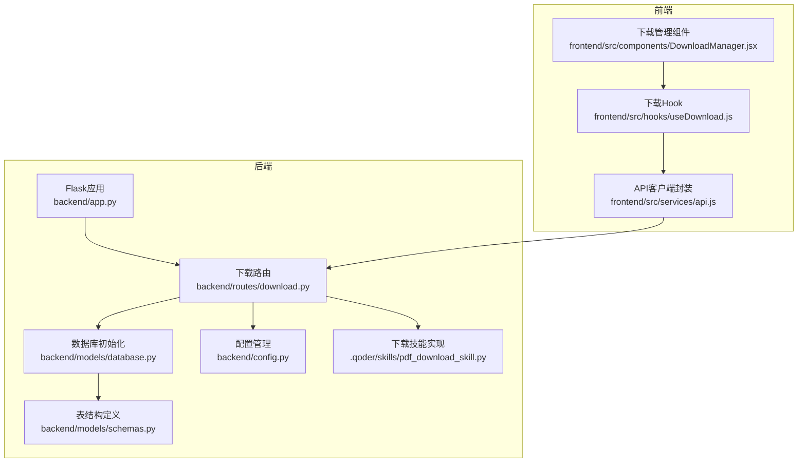
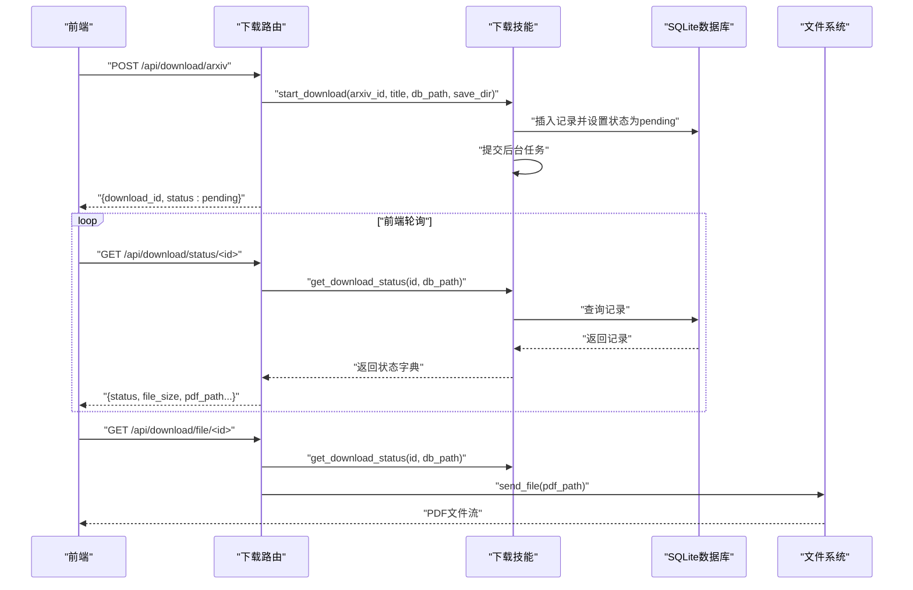
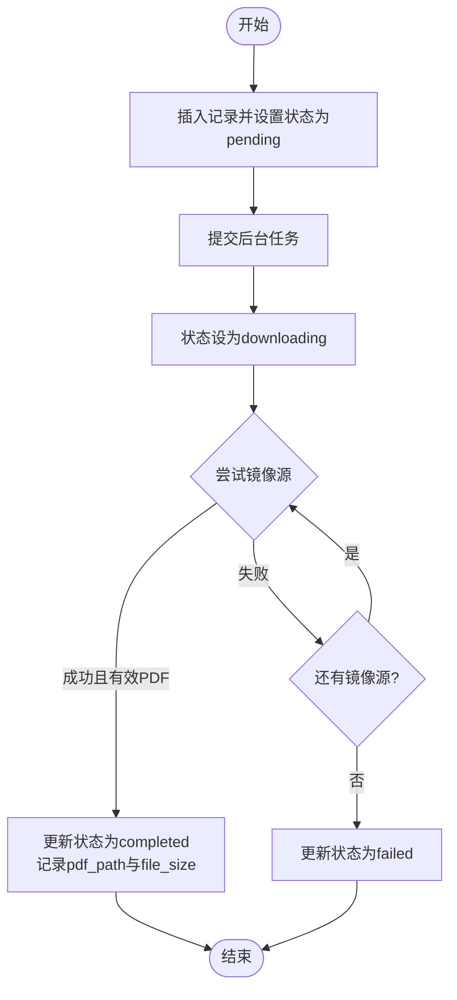
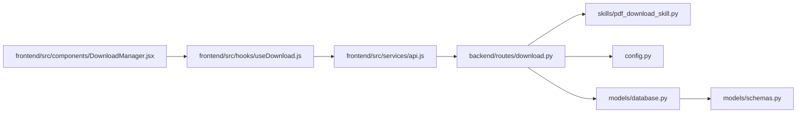

# 下载API

<cite>
**本文引用的文件**
- [backend/routes/download.py](file://backend/routes/download.py)
- [.qoder/skills/pdf_download_skill.py](file://.qoder/skills/pdf_download_skill.py)
- [backend/config.py](file://backend/config.py)
- [backend/models/database.py](file://backend/models/database.py)
- [backend/models/schemas.py](file://backend/models/schemas.py)
- [backend/app.py](file://backend/app.py)
- [frontend/src/hooks/useDownload.js](file://frontend/src/hooks/useDownload.js)
- [frontend/src/components/DownloadManager.jsx](file://frontend/src/components/DownloadManager.jsx)
- [frontend/src/services/api.js](file://frontend/src/services/api.js)
- [.qoder/config.json](file://.qoder/config.json)
- [README.md](file://README.md)
</cite>

## 目录
1. [简介](#简介)
2. [项目结构](#项目结构)
3. [核心组件](#核心组件)
4. [架构总览](#架构总览)
5. [详细组件分析](#详细组件分析)
6. [依赖关系分析](#依赖关系分析)
7. [性能考虑](#性能考虑)
8. [故障排查指南](#故障排查指南)
9. [结论](#结论)
10. [附录](#附录)

## 简介
本文件面向下载管理API，系统性说明以下端点的功能与使用方法：
- POST /api/download/arxiv：触发arXiv论文PDF下载
- GET /api/download/status/<id>：查询下载状态
- GET /api/download/file/<id>：获取已下载PDF文件
- GET /api/download/history：查询下载历史

文档覆盖下载触发方式、状态查询机制、文件获取流程、历史记录查询、并发下载控制、下载队列管理、进度跟踪与错误恢复机制，并提供请求/响应示例、下载ID生成规则、状态枚举值、文件命名规范，以及性能优化、网络异常处理与存储空间管理建议。

## 项目结构
后端采用Flask蓝图组织路由，下载相关逻辑集中在download蓝图；下载技能实现位于.qoder/skills/pdf_download_skill.py；数据库初始化与表结构定义在models层；前端通过React组件与自定义Hook管理下载状态与轮询。

图表来源
- [backend/app.py](file://backend/app.py#L21-L67)
- [backend/routes/download.py](file://backend/routes/download.py#L14-L98)
- [backend/models/database.py](file://backend/models/database.py#L36-L43)
- [backend/models/schemas.py](file://backend/models/schemas.py#L28-L37)
- [backend/config.py](file://backend/config.py#L47-L65)
- [.qoder/skills/pdf_download_skill.py](file://.qoder/skills/pdf_download_skill.py#L21-L48)
- [frontend/src/services/api.js](file://frontend/src/services/api.js#L4-L31)
- [frontend/src/hooks/useDownload.js](file://frontend/src/hooks/useDownload.js#L9-L24)
- [frontend/src/components/DownloadManager.jsx](file://frontend/src/components/DownloadManager.jsx#L59-L64)

章节来源
- [backend/app.py](file://backend/app.py#L21-L67)
- [backend/routes/download.py](file://backend/routes/download.py#L14-L98)
- [backend/models/database.py](file://backend/models/database.py#L36-L43)
- [backend/models/schemas.py](file://backend/models/schemas.py#L28-L37)
- [backend/config.py](file://backend/config.py#L47-L65)
- [.qoder/skills/pdf_download_skill.py](file://.qoder/skills/pdf_download_skill.py#L21-L48)
- [frontend/src/services/api.js](file://frontend/src/services/api.js#L4-L31)
- [frontend/src/hooks/useDownload.js](file://frontend/src/hooks/useDownload.js#L9-L24)
- [frontend/src/components/DownloadManager.jsx](file://frontend/src/components/DownloadManager.jsx#L59-L64)

## 核心组件
- 下载路由层：负责接收请求、校验参数、调用下载技能、返回JSON响应或文件流。
- 下载技能层：负责后台下载任务的调度、镜像回退、状态持久化、PDF有效性校验。
- 数据库层：维护下载记录表，提供状态查询与历史查询。
- 配置层：提供下载并发数、镜像源、保存目录等运行时配置。
- 前端层：发起下载、轮询状态、展示进度与完成态文件下载链接。

章节来源
- [backend/routes/download.py](file://backend/routes/download.py#L14-L98)
- [.qoder/skills/pdf_download_skill.py](file://.qoder/skills/pdf_download_skill.py#L21-L146)
- [backend/models/schemas.py](file://backend/models/schemas.py#L28-L37)
- [backend/config.py](file://backend/config.py#L47-L65)
- [frontend/src/hooks/useDownload.js](file://frontend/src/hooks/useDownload.js#L9-L24)
- [frontend/src/components/DownloadManager.jsx](file://frontend/src/components/DownloadManager.jsx#L59-L64)

## 架构总览
下载API遵循“请求-后台任务-状态持久化-文件提供”的闭环设计。前端通过POST触发下载，后端写入数据库并提交后台任务；随后前端轮询状态；完成后通过文件端点下载PDF。

图表来源
- [backend/routes/download.py](file://backend/routes/download.py#L14-L98)
- [.qoder/skills/pdf_download_skill.py](file://.qoder/skills/pdf_download_skill.py#L21-L146)
- [backend/models/schemas.py](file://backend/models/schemas.py#L28-L37)

## 详细组件分析

### 端点：POST /api/download/arxiv
- 功能：触发arXiv论文PDF下载，返回下载ID与初始状态。
- 请求体字段
  - arxiv_id：必需，论文ID（如“2301.00001”）
  - title：可选，标题，默认“untitled”
- 返回
  - 成功：{download_id: 整数, status: "pending"}
  - 参数缺失：400 {error}
  - 异常：500 {error, detail}

下载触发流程
- 校验arxiv_id非空
- 读取配置（数据库路径、下载目录）
- 调用下载技能start_download，写入数据库并提交后台任务
- 返回download_id与初始状态

章节来源
- [backend/routes/download.py](file://backend/routes/download.py#L14-L40)
- [.qoder/skills/pdf_download_skill.py](file://.qoder/skills/pdf_download_skill.py#L21-L48)
- [backend/config.py](file://backend/config.py#L36-L48)

### 端点：GET /api/download/status/<id>
- 功能：查询指定下载记录的状态详情
- 路径参数
  - id：整数，下载记录ID
- 返回
  - 成功：记录对象（包含id、title、url、pdf_path、status、file_size、timestamp）
  - 未找到：404 {error}
  - 异常：500 {error}

状态字段说明
- pending：已创建记录，等待下载
- downloading：正在下载
- completed：下载完成，pdf_path与file_size有效
- failed：下载失败

章节来源
- [backend/routes/download.py](file://backend/routes/download.py#L42-L56)
- [.qoder/skills/pdf_download_skill.py](file://.qoder/skills/pdf_download_skill.py#L122-L135)
- [backend/models/schemas.py](file://backend/models/schemas.py#L28-L36)

### 端点：GET /api/download/file/<id>
- 功能：下载已完成的PDF文件
- 路径参数
  - id：整数，下载记录ID
- 返回
  - 成功：application/pdf文件流（浏览器触发下载）
  - 未找到：404 {error}
  - 未完成：400 {error, status}
  - 文件不存在：404 {error}
  - 异常：500 {error}

文件命名与保存
- 保存路径：由配置DOWNLOAD_DIR决定
- 文件名：以arXiv ID替换斜杠后的形式命名（如“2301_00001.pdf”）

章节来源
- [backend/routes/download.py](file://backend/routes/download.py#L59-L82)
- [.qoder/skills/pdf_download_skill.py](file://.qoder/skills/pdf_download_skill.py#L54-L76)
- [backend/config.py](file://backend/config.py#L48-L48)

### 端点：GET /api/download/history
- 功能：获取全部下载记录（按时间倒序）
- 返回
  - 成功：{downloads: [记录对象...]}
  - 异常：500 {error}

记录字段
- id、title、url、pdf_path、status、file_size、timestamp

章节来源
- [backend/routes/download.py](file://backend/routes/download.py#L85-L97)
- [.qoder/skills/pdf_download_skill.py](file://.qoder/skills/pdf_download_skill.py#L137-L145)
- [backend/models/schemas.py](file://backend/models/schemas.py#L28-L36)

### 并发下载控制与队列管理
- 线程池并发：全局ThreadPoolExecutor，最大工作线程数由配置决定
- 配置项
  - max_concurrent_downloads：默认3
  - arxiv_mirrors：默认["https://arxiv.org/pdf/", "https://cn.arxiv.org/pdf/"]
- 下载流程
  - 插入记录并设置状态为pending
  - 提交后台任务，状态切换为downloading
  - 顺序尝试镜像源，下载完成后进行PDF有效性校验
  - 更新状态为completed或failed

图表来源
- [.qoder/skills/pdf_download_skill.py](file://.qoder/skills/pdf_download_skill.py#L21-L88)

章节来源
- [.qoder/skills/pdf_download_skill.py](file://.qoder/skills/pdf_download_skill.py#L12-L18)
- [.qoder/config.json](file://.qoder/config.json#L14-L21)
- [backend/config.py](file://backend/config.py#L62-L65)

### 进度跟踪与前端集成
- 前端轮询策略
  - 使用useDownload Hook在存在“pending”或“downloading”任务时每2秒轮询一次
  - 轮询期间忽略错误，避免中断UI体验
- 下载管理组件
  - 展示状态图标与文本（等待中/下载中/完成/失败）
  - 完成后提供下载链接（/_blank新窗口打开）
  - 显示文件大小（MB）

章节来源
- [frontend/src/hooks/useDownload.js](file://frontend/src/hooks/useDownload.js#L26-L64)
- [frontend/src/components/DownloadManager.jsx](file://frontend/src/components/DownloadManager.jsx#L15-L101)

### 错误恢复机制
- 网络异常
  - 请求异常时记录警告并清理临时文件，尝试下一个镜像源
- PDF校验失败
  - 删除无效文件，标记为failed
- 未找到记录或文件
  - 返回相应4xx错误码与错误信息
- 服务器异常
  - 全局异常处理器统一返回500

章节来源
- [.qoder/skills/pdf_download_skill.py](file://.qoder/skills/pdf_download_skill.py#L81-L88)
- [backend/routes/download.py](file://backend/routes/download.py#L37-L39)
- [backend/app.py](file://backend/app.py#L62-L65)

## 依赖关系分析
- 路由依赖下载技能与配置
- 下载技能依赖SQLite数据库与文件系统
- 前端依赖API封装与下载Hook

图表来源
- [frontend/src/services/api.js](file://frontend/src/services/api.js#L4-L31)
- [frontend/src/hooks/useDownload.js](file://frontend/src/hooks/useDownload.js#L9-L24)
- [frontend/src/components/DownloadManager.jsx](file://frontend/src/components/DownloadManager.jsx#L59-L64)
- [backend/routes/download.py](file://backend/routes/download.py#L14-L98)
- [.qoder/skills/pdf_download_skill.py](file://.qoder/skills/pdf_download_skill.py#L21-L48)
- [backend/config.py](file://backend/config.py#L47-L65)
- [backend/models/database.py](file://backend/models/database.py#L36-L43)
- [backend/models/schemas.py](file://backend/models/schemas.py#L28-L37)

章节来源
- [frontend/src/services/api.js](file://frontend/src/services/api.js#L4-L31)
- [frontend/src/hooks/useDownload.js](file://frontend/src/hooks/useDownload.js#L9-L24)
- [frontend/src/components/DownloadManager.jsx](file://frontend/src/components/DownloadManager.jsx#L59-L64)
- [backend/routes/download.py](file://backend/routes/download.py#L14-L98)
- [.qoder/skills/pdf_download_skill.py](file://.qoder/skills/pdf_download_skill.py#L21-L48)
- [backend/config.py](file://backend/config.py#L47-L65)
- [backend/models/database.py](file://backend/models/database.py#L36-L43)
- [backend/models/schemas.py](file://backend/models/schemas.py#L28-L37)

## 性能考虑
- 并发控制
  - 通过线程池限制最大并发下载数，避免资源争用
  - 建议根据服务器CPU/IO能力调整max_concurrent_downloads
- 镜像回退
  - 默认双镜像源，提升成功率与速度
- 流式下载
  - 使用requests流式下载，分块写入，降低内存占用
- 数据库优化
  - WAL模式、超时与外键开启，提升并发稳定性
- 前端轮询
  - 2秒间隔适中，既保证及时反馈又避免频繁请求

章节来源
- [.qoder/config.json](file://.qoder/config.json#L14-L21)
- [.qoder/skills/pdf_download_skill.py](file://.qoder/skills/pdf_download_skill.py#L12-L18)
- [.qoder/skills/pdf_download_skill.py](file://.qoder/skills/pdf_download_skill.py#L60-L72)
- [backend/models/database.py](file://backend/models/database.py#L17-L18)
- [frontend/src/hooks/useDownload.js](file://frontend/src/hooks/useDownload.js#L55-L59)

## 故障排查指南
- 下载无法开始
  - 确认请求体包含arxiv_id
  - 检查后端日志中的异常堆栈
- 状态一直为pending或downloading
  - 检查线程池是否饱和（并发数已达上限）
  - 查看镜像源连通性
- 下载失败（failed）
  - 网络不稳定或镜像源不可用
  - PDF校验失败（非PDF或损坏），系统会删除文件
- 文件无法下载
  - 确认状态为completed
  - 检查pdf_path是否存在
- 服务器错误
  - 查看全局异常处理器返回的500错误

章节来源
- [backend/routes/download.py](file://backend/routes/download.py#L22-L23)
- [backend/routes/download.py](file://backend/routes/download.py#L37-L39)
- [.qoder/skills/pdf_download_skill.py](file://.qoder/skills/pdf_download_skill.py#L74-L88)
- [backend/app.py](file://backend/app.py#L62-L65)

## 结论
下载API通过“请求-后台任务-状态持久化-文件提供”的清晰流程，结合镜像回退、PDF校验与线程池并发控制，提供了稳定可靠的arXiv论文下载能力。前端轮询与可视化组件进一步提升了用户体验。建议在生产环境中合理配置并发数与镜像源，并关注磁盘空间与网络稳定性。

## 附录

### 请求/响应示例
- 触发下载
  - 请求
    - POST /api/download/arxiv
    - Content-Type: application/json
    - 示例体：{"arxiv_id": "2301.00001", "title": "示例论文"}
  - 响应
    - 200 OK
    - 示例体：{"download_id": 123, "status": "pending"}

- 查询状态
  - 请求
    - GET /api/download/status/123
  - 响应
    - 200 OK：{"id": 123, "title": "示例论文", "url": "https://arxiv.org/pdf/2301.00001.pdf", "status": "completed", "file_size": 1048576, "pdf_path": "/data/downloads/2301_00001.pdf", "timestamp": "2025-01-01T00:00:00"}

- 获取文件
  - 请求
    - GET /api/download/file/123
  - 响应
    - 200 OK：application/pdf文件流（浏览器下载）

- 历史记录
  - 请求
    - GET /api/download/history
  - 响应
    - 200 OK：{"downloads": [...]}

章节来源
- [backend/routes/download.py](file://backend/routes/download.py#L14-L98)
- [.qoder/skills/pdf_download_skill.py](file://.qoder/skills/pdf_download_skill.py#L122-L145)

### 下载ID生成规则
- 由数据库自增主键生成，调用start_download后立即返回
- 前端收到响应中的download_id即可用于状态查询与文件下载

章节来源
- [.qoder/skills/pdf_download_skill.py](file://.qoder/skills/pdf_download_skill.py#L37-L44)

### 状态枚举值
- pending：已创建记录，等待下载
- downloading：正在下载
- completed：下载完成，pdf_path与file_size有效
- failed：下载失败

章节来源
- [backend/models/schemas.py](file://backend/models/schemas.py#L33-L33)
- [.qoder/skills/pdf_download_skill.py](file://.qoder/skills/pdf_download_skill.py#L53-L53)
- [.qoder/skills/pdf_download_skill.py](file://.qoder/skills/pdf_download_skill.py#L87-L87)

### 文件命名规范
- 保存目录：由配置DOWNLOAD_DIR决定
- 文件名：arXiv ID中的斜杠替换为下划线，扩展名为.pdf

章节来源
- [backend/config.py](file://backend/config.py#L48-L48)
- [.qoder/skills/pdf_download_skill.py](file://.qoder/skills/pdf_download_skill.py#L54-L54)

### 配置项参考
- 下载设置
  - save_directory：下载保存目录
  - max_concurrent_downloads：最大并发下载数
  - arxiv_mirrors：镜像源列表
- 其他
  - DATABASE_PATH：SQLite数据库路径
  - SECRET_KEY、FLASK_PORT、DEBUG：Flask运行参数

章节来源
- [.qoder/config.json](file://.qoder/config.json#L14-L21)
- [backend/config.py](file://backend/config.py#L36-L48)
- [backend/config.py](file://backend/config.py#L30-L33)