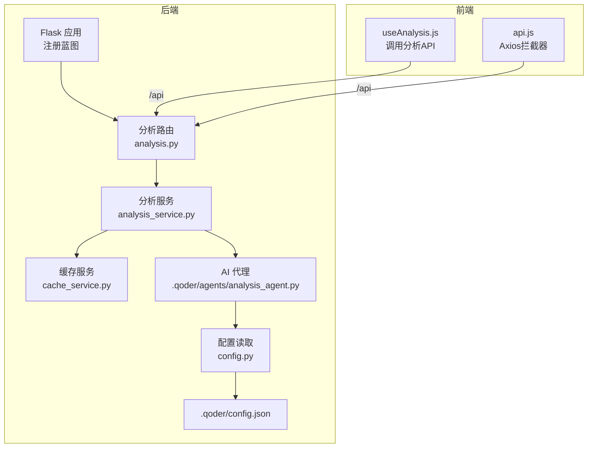
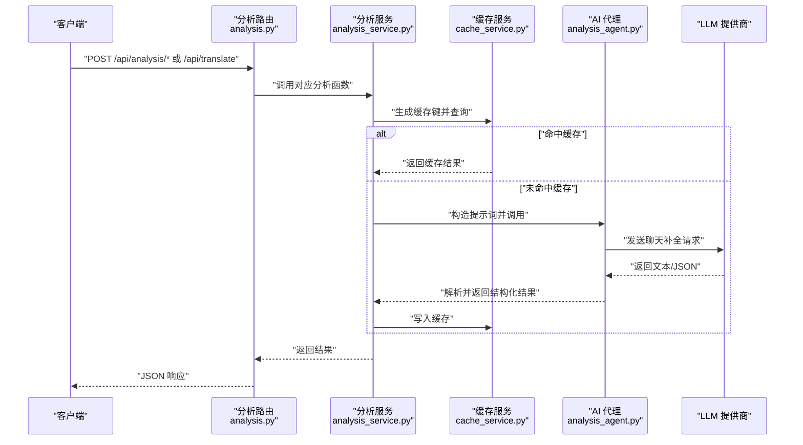
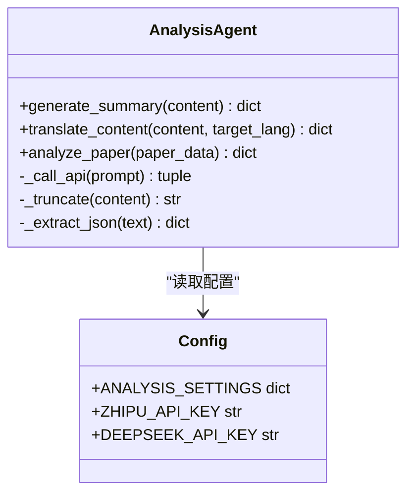
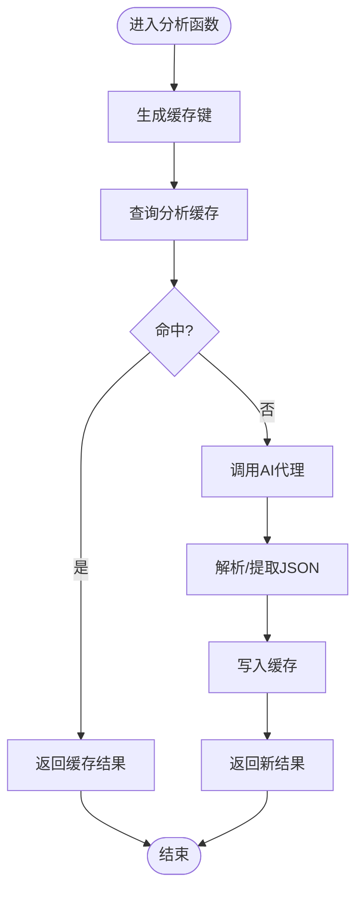
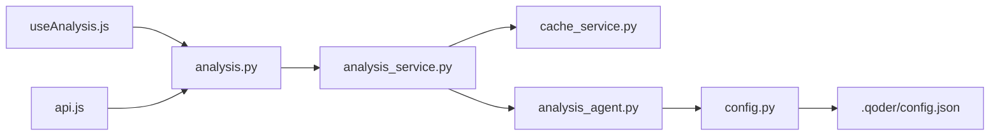

# 分析API

<cite>
**本文引用的文件**
- [backend/routes/analysis.py](file://backend/routes/analysis.py)
- [backend/services/analysis_service.py](file://backend/services/analysis_service.py)
- [backend/services/cache_service.py](file://backend/services/cache_service.py)
- [.qoder/agents/analysis_agent.py](file://.qoder/agents/analysis_agent.py)
- [backend/config.py](file://backend/config.py)
- [.qoder/config.json](file://.qoder/config.json)
- [backend/app.py](file://backend/app.py)
- [frontend/src/hooks/useAnalysis.js](file://frontend/src/hooks/useAnalysis.js)
- [frontend/src/services/api.js](file://frontend/src/services/api.js)
- [README.md](file://README.md)
- [backend/test_integration.py](file://backend/test_integration.py)
</cite>

## 目录
1. [简介](#简介)
2. [项目结构](#项目结构)
3. [核心组件](#核心组件)
4. [架构总览](#架构总览)
5. [详细组件分析](#详细组件分析)
6. [依赖关系分析](#依赖关系分析)
7. [性能考量](#性能考量)
8. [故障排查指南](#故障排查指南)
9. [结论](#结论)
10. [附录](#附录)

## 简介
本文件面向后端与前端开发者及使用者，系统化说明 AI 分析相关 API 的设计与使用方法，覆盖以下端点：
- POST /api/analysis/summarize：生成内容摘要与关键要点
- POST /api/analysis/translate：将内容翻译为目标语言
- POST /api/translate：**新增** 简化翻译接口，专为批量导出功能设计
- POST /api/analysis/paper：对学术论文进行深度分析

文档内容包括：
- 请求参数与支持的文本格式
- AI 模型配置与温度、最大长度等参数
- 响应格式与典型字段
- 不同分析类型的适用场景与最佳实践
- 错误处理与性能优化建议
- 前后端集成示例与参考路径

## 项目结构
后端采用 Flask 蓝图组织路由，分析相关逻辑集中在 analysis 蓝图中；业务层封装在 analysis_service 中，并通过缓存服务实现分析结果的持久化；AI 调用由 AnalysisAgent 统一封装，支持智谱与 DeepSeek 两个提供商。

**图表来源**
- [backend/app.py](file://backend/app.py#L35-L39)
- [backend/routes/analysis.py](file://backend/routes/analysis.py#L1-L7)
- [backend/services/analysis_service.py](file://backend/services/analysis_service.py#L1-L10)
- [backend/services/cache_service.py](file://backend/services/cache_service.py#L1-L10)
- [.qoder/agents/analysis_agent.py](file://.qoder/agents/analysis_agent.py#L1-L10)
- [backend/config.py](file://backend/config.py#L67-L73)
- [.qoder/config.json](file://.qoder/config.json#L22-L29)
- [frontend/src/hooks/useAnalysis.js](file://frontend/src/hooks/useAnalysis.js#L11-L57)
- [frontend/src/services/api.js](file://frontend/src/services/api.js#L4-L8)

**章节来源**
- [backend/app.py](file://backend/app.py#L21-L67)
- [backend/routes/analysis.py](file://backend/routes/analysis.py#L1-L7)

## 核心组件
- 路由层：负责接收请求、参数校验与错误处理，并将请求转发给服务层。
- 服务层：实现分析流程的编排，包含缓存命中判断、代理初始化与调用。
- 缓存层：基于 SQLite 的分析缓存表，支持过期清理。
- AI 代理：封装 LLM 客户端初始化、提示词构造与响应解析。
- 配置层：统一读取环境变量与 .qoder/config.json 中的分析设置。

**章节来源**
- [backend/routes/analysis.py](file://backend/routes/analysis.py#L10-L65)
- [backend/services/analysis_service.py](file://backend/services/analysis_service.py#L16-L90)
- [backend/services/cache_service.py](file://backend/services/cache_service.py#L22-L86)
- [.qoder/agents/analysis_agent.py](file://.qoder/agents/analysis_agent.py#L18-L33)
- [backend/config.py](file://backend/config.py#L67-L73)
- [.qoder/config.json](file://.qoder/config.json#L22-L29)

## 架构总览
下图展示从客户端到 AI 服务的整体调用链路与关键决策点。

**图表来源**
- [backend/routes/analysis.py](file://backend/routes/analysis.py#L10-L65)
- [backend/services/analysis_service.py](file://backend/services/analysis_service.py#L25-L90)
- [backend/services/cache_service.py](file://backend/services/cache_service.py#L57-L86)
- [.qoder/agents/analysis_agent.py](file://.qoder/agents/analysis_agent.py#L68-L85)

## 详细组件分析

### POST /api/analysis/summarize
- 功能：对给定内容生成摘要与关键要点。
- 请求参数
  - content：必填，待分析的文本内容
- 响应字段
  - summary：摘要文本
  - key_points：关键要点数组
  - error：错误信息（可选）
- 文本格式与长度
  - 支持任意文本；内部会截断至配置的最大长度
- AI 模型与参数
  - 由 AnalysisAgent 根据 provider 与 model 配置初始化
  - 温度与最大长度来自配置项
- 使用场景与最佳实践
  - 适用于网页、报告、会议纪要等长文本的快速概览
  - 建议先清洗噪声再传入，提升摘要质量
- 错误处理
  - 参数缺失返回 400
  - 异常捕获并返回 500，包含 detail 字段
- 前端调用参考
  - [frontend/src/hooks/useAnalysis.js](file://frontend/src/hooks/useAnalysis.js#L11-L24)

**章节来源**
- [backend/routes/analysis.py](file://backend/routes/analysis.py#L10-L25)
- [backend/services/analysis_service.py](file://backend/services/analysis_service.py#L25-L44)
- [.qoder/agents/analysis_agent.py](file://.qoder/agents/analysis_agent.py#L86-L115)
- [backend/config.py](file://backend/config.py#L67-L73)
- [.qoder/config.json](file://.qoder/config.json#L22-L29)
- [frontend/src/hooks/useAnalysis.js](file://frontend/src/hooks/useAnalysis.js#L11-L24)

### POST /api/analysis/translate
- 功能：将内容翻译为目标语言。
- 请求参数
  - content：必填，待翻译文本
  - target_lang：可选，默认 zh
- 响应字段
  - translated_text：翻译结果
  - source_lang：源语言（示例：en）
  - error：错误信息（可选）
- 文本格式与长度
  - 支持任意文本；内部会截断至配置的最大长度
- AI 模型与参数
  - 由 AnalysisAgent 根据 provider 与 model 配置初始化
  - 温度与最大长度来自配置项
- 使用场景与最佳实践
  - 适合将英文技术文档、论文摘要翻译为中文
  - 对于术语较多的领域，建议保留原文并在翻译后加注释
- 错误处理
  - 参数缺失返回 400
  - 异常捕获并返回 500，包含 detail 字段
- 前端调用参考
  - [frontend/src/hooks/useAnalysis.js](file://frontend/src/hooks/useAnalysis.js#L26-L42)

**章节来源**
- [backend/routes/analysis.py](file://backend/routes/analysis.py#L27-L44)
- [backend/services/analysis_service.py](file://backend/services/analysis_service.py#L46-L65)
- [.qoder/agents/analysis_agent.py](file://.qoder/agents/analysis_agent.py#L116-L139)
- [backend/config.py](file://backend/config.py#L67-L73)
- [.qoder/config.json](file://.qoder/config.json#L22-L29)
- [frontend/src/hooks/useAnalysis.js](file://frontend/src/hooks/useAnalysis.js#L26-L42)

### POST /api/translate **新增**
- 功能：**简化翻译接口，专为批量导出功能设计**。相比标准翻译接口，返回格式更简洁，专门用于批量导出场景。
- 请求参数
  - text：必填，待翻译文本
  - target_lang：可选，默认 zh
- 响应字段
  - translated：翻译结果文本
  - source_lang：源语言（示例：en）
  - error：错误信息（可选）
- 文本格式与长度
  - 支持任意文本；内部会截断至配置的最大长度
- AI 模型与参数
  - 由 AnalysisAgent 根据 provider 与 model 配置初始化
  - 温度与最大长度来自配置项
- 使用场景与最佳实践
  - 专为批量导出功能设计，简化前端处理逻辑
  - 适合需要大量文本翻译但不需要复杂错误处理的场景
  - 当翻译失败时，返回原文本而非错误对象，确保批量导出的稳定性
- 错误处理
  - 参数缺失返回 400
  - 翻译失败时返回 200，包含原始文本和错误标记
- 前端调用参考
  - 无前端直接调用示例（主要用于后端批量导出）

**章节来源**
- [backend/routes/analysis.py](file://backend/routes/analysis.py#L46-L66)
- [backend/services/analysis_service.py](file://backend/services/analysis_service.py#L46-L65)
- [.qoder/agents/analysis_agent.py](file://.qoder/agents/analysis_agent.py#L116-L139)
- [backend/config.py](file://backend/config.py#L67-L73)
- [.qoder/config.json](file://.qoder/config.json#L22-L29)

### POST /api/analysis/paper
- 功能：对学术论文进行深度分析，输出摘要概述、方法、创新点、结果与结论等维度。
- 请求参数
  - title：可选，论文标题
  - abstract：可选，摘要
  - snippet：可选，片段（当缺少 abstract 时可用作替代）
  - 至少需提供 title 或 abstract/snippet 之一
- 响应字段
  - abstract_summary：摘要概述
  - method：研究方法
  - innovation：主要创新点
  - results：实验结果
  - conclusion：结论与局限性
  - error：错误信息（可选）
- 文本格式与长度
  - 支持标题与摘要组合；内部会截断至配置的最大长度
- AI 模型与参数
  - 由 AnalysisAgent 根据 provider 与 model 配置初始化
  - 温度与最大长度来自配置项
- 使用场景与最佳实践
  - 适合论文初筛、快速了解研究贡献与方法
  - 若仅有标题，建议补充摘要或片段以提升分析质量
- 错误处理
  - 参数缺失返回 400
  - 异常捕获并返回 500，包含 detail 字段
- 前端调用参考
  - [frontend/src/hooks/useAnalysis.js](file://frontend/src/hooks/useAnalysis.js#L44-L57)

**章节来源**
- [backend/routes/analysis.py](file://backend/routes/analysis.py#L68-L88)
- [backend/services/analysis_service.py](file://backend/services/analysis_service.py#L67-L90)
- [.qoder/agents/analysis_agent.py](file://.qoder/agents/analysis_agent.py#L141-L185)
- [backend/config.py](file://backend/config.py#L67-L73)
- [.qoder/config.json](file://.qoder/config.json#L22-L29)
- [frontend/src/hooks/useAnalysis.js](file://frontend/src/hooks/useAnalysis.js#L44-L57)

### AI 代理与模型配置
- 提供商与模型
  - 支持 zhipu 与 deepseek
  - 默认模型由 .qoder/config.json 中的 analysis_settings.provider 决定
- 关键配置项
  - provider：zhipu 或 deepseek
  - zhipu_model / deepseek_model：对应模型名称
  - max_content_length：最大内容长度（字符）
  - temperature：采样温度
  - cache_expire_days：分析缓存过期天数
- 初始化流程
  - AnalysisAgent 根据 provider 选择 SDK 并初始化客户端
  - 若未配置 API Key，将记录警告并无法调用 LLM

**图表来源**
- [.qoder/agents/analysis_agent.py](file://.qoder/agents/analysis_agent.py#L18-L33)
- [backend/config.py](file://backend/config.py#L67-L73)
- [.qoder/config.json](file://.qoder/config.json#L22-L29)

**章节来源**
- [.qoder/agents/analysis_agent.py](file://.qoder/agents/analysis_agent.py#L18-L33)
- [backend/config.py](file://backend/config.py#L67-L73)
- [.qoder/config.json](file://.qoder/config.json#L22-L29)

### 缓存机制与性能
- 缓存键生成
  - 基于内容前缀与分析类型生成哈希键
  - 分析缓存默认 7 天过期
- 命中流程
  - 未命中时调用 AI 代理并写入缓存
  - 命中则直接返回缓存结果，降低延迟与成本
- 过期清理
  - 定期清理过期条目，避免数据库膨胀

**图表来源**
- [backend/services/analysis_service.py](file://backend/services/analysis_service.py#L32-L43)
- [backend/services/cache_service.py](file://backend/services/cache_service.py#L57-L86)

**章节来源**
- [backend/services/analysis_service.py](file://backend/services/analysis_service.py#L32-L43)
- [backend/services/cache_service.py](file://backend/services/cache_service.py#L57-L86)

## 依赖关系分析
- 路由依赖服务层，服务层依赖缓存与配置，AI 代理依赖配置与 LLM SDK。
- 前端通过 Axios 发送请求，统一拦截器处理错误与超时。

**图表来源**
- [backend/routes/analysis.py](file://backend/routes/analysis.py#L1-L7)
- [backend/services/analysis_service.py](file://backend/services/analysis_service.py#L1-L10)
- [backend/services/cache_service.py](file://backend/services/cache_service.py#L1-L10)
- [.qoder/agents/analysis_agent.py](file://.qoder/agents/analysis_agent.py#L1-L10)
- [backend/config.py](file://backend/config.py#L15-L28)
- [.qoder/config.json](file://.qoder/config.json#L1-L31)
- [frontend/src/hooks/useAnalysis.js](file://frontend/src/hooks/useAnalysis.js#L1-L10)
- [frontend/src/services/api.js](file://frontend/src/services/api.js#L1-L8)

**章节来源**
- [backend/routes/analysis.py](file://backend/routes/analysis.py#L1-L7)
- [backend/services/analysis_service.py](file://backend/services/analysis_service.py#L1-L10)
- [backend/services/cache_service.py](file://backend/services/cache_service.py#L1-L10)
- [.qoder/agents/analysis_agent.py](file://.qoder/agents/analysis_agent.py#L1-L10)
- [backend/config.py](file://backend/config.py#L15-L28)
- [.qoder/config.json](file://.qoder/config.json#L1-L31)
- [frontend/src/hooks/useAnalysis.js](file://frontend/src/hooks/useAnalysis.js#L1-L10)
- [frontend/src/services/api.js](file://frontend/src/services/api.js#L1-L8)

## 性能考量
- 缓存命中率：对相同内容重复分析可显著降低延迟与成本
- 内容截断：避免超长文本导致的 API 费用与超时风险
- 并发与限流：结合全局速率限制与 LLM 限额合理规划调用量
- 前端超时：Axios 默认 60 秒超时，建议根据内容长度调整

## 故障排查指南
- 常见错误码
  - 400：请求参数缺失（如 content 或论文必需字段）
  - 500：服务内部异常，响应体包含 error 与 detail
- 日志定位
  - 路由层与服务层均记录错误日志，便于定位异常
- 前端错误提示
  - Axios 拦截器对 429、5xx、400 等状态进行用户提示
- 集成测试参考
  - 包含对分析接口参数校验的测试用例

**章节来源**
- [backend/routes/analysis.py](file://backend/routes/analysis.py#L16-L24)
- [backend/routes/analysis.py](file://backend/routes/analysis.py#L33-L43)
- [backend/routes/analysis.py](file://backend/routes/analysis.py#L57-L65)
- [frontend/src/services/api.js](file://frontend/src/services/api.js#L10-L29)
- [backend/test_integration.py](file://backend/test_integration.py#L55-L65)

## 结论
本分析 API 通过统一的路由与服务层抽象，结合缓存与 AI 代理，提供了稳定高效的摘要、翻译与论文分析能力。配合灵活的模型配置与前端集成，可满足多场景下的内容理解与知识提炼需求。新增的简化翻译接口进一步完善了批量导出功能的用户体验。

## 附录

### 请求与响应示例（参考路径）
- 摘要生成
  - 请求：POST /api/analysis/summarize
  - 示例请求体：{"content": "..." }
  - 示例响应：{"summary": "...", "key_points": ["...", "..."], "error": null}
  - 参考实现：[backend/routes/analysis.py](file://backend/routes/analysis.py#L10-L25)，[backend/services/analysis_service.py](file://backend/services/analysis_service.py#L25-L44)
- 翻译
  - 请求：POST /api/analysis/translate
  - 示例请求体：{"content": "...", "target_lang": "zh"}
  - 示例响应：{"translated_text": "...", "source_lang": "en", "error": null}
  - 参考实现：[backend/routes/analysis.py](file://backend/routes/analysis.py#L27-L44)，[backend/services/analysis_service.py](file://backend/services/analysis_service.py#L46-L65)
- 简化翻译 **新增**
  - 请求：POST /api/translate
  - 示例请求体：{"text": "...", "target_lang": "zh"}
  - 示例响应：{"translated": "...", "source_lang": "en"}
  - 参考实现：[backend/routes/analysis.py](file://backend/routes/analysis.py#L46-L66)，[backend/services/analysis_service.py](file://backend/services/analysis_service.py#L46-L65)
- 论文分析
  - 请求：POST /api/analysis/paper
  - 示例请求体：{"title": "...", "abstract": "..."}
  - 示例响应：{"abstract_summary": "...", "method": "...", "innovation": "...", "results": "...", "conclusion": "...", "error": null}
  - 参考实现：[backend/routes/analysis.py](file://backend/routes/analysis.py#L68-L88)，[backend/services/analysis_service.py](file://backend/services/analysis_service.py#L67-L90)

### 配置清单（关键项）
- 环境变量
  - ZHIPU_API_KEY / DEEPSEEK_API_KEY：任选其一
  - SECRET_KEY、FLASK_PORT、DATABASE_PATH、DOWNLOAD_DIR、HTTP_PROXY
- .qoder/config.json
  - analysis_settings.provider：zhipu 或 deepseek
  - analysis_settings.zhipu_model / analysis_settings.deepseek_model：模型名
  - analysis_settings.max_content_length：最大长度
  - analysis_settings.temperature：采样温度
  - analysis_settings.cache_expire_days：缓存过期天数

**章节来源**
- [.qoder/config.json](file://.qoder/config.json#L22-L29)
- [backend/config.py](file://backend/config.py#L38-L48)
- [backend/config.py](file://backend/config.py#L67-L73)
- [README.md](file://README.md#L97-L111)
- [README.md](file://README.md#L48-L95)