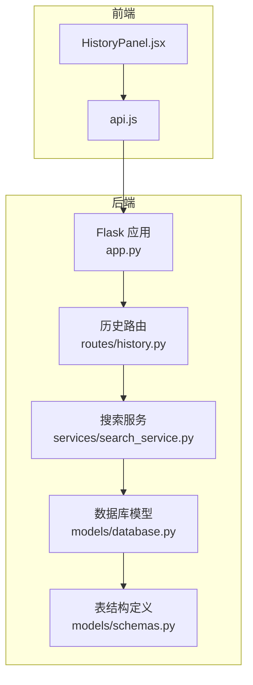
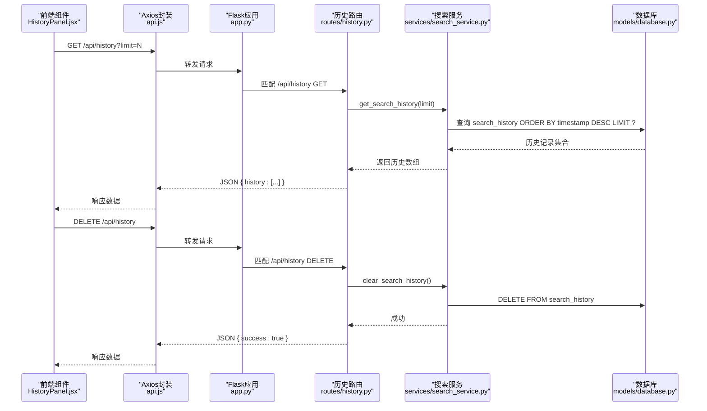
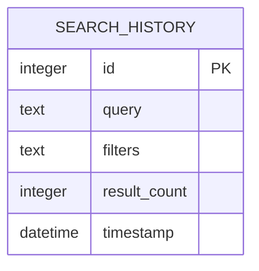
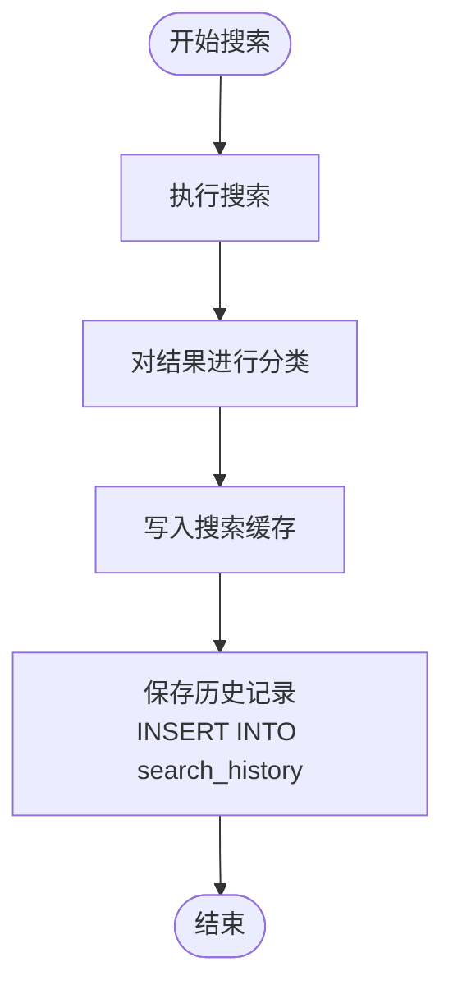
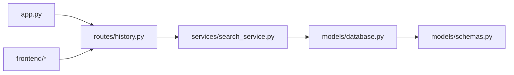

# 历史记录API

<cite>
**本文引用的文件**
- [backend/routes/history.py](file://backend/routes/history.py)
- [backend/services/search_service.py](file://backend/services/search_service.py)
- [backend/models/schemas.py](file://backend/models/schemas.py)
- [backend/models/database.py](file://backend/models/database.py)
- [backend/app.py](file://backend/app.py)
- [frontend/src/components/HistoryPanel.jsx](file://frontend/src/components/HistoryPanel.jsx)
- [frontend/src/services/api.js](file://frontend/src/services/api.js)
- [backend/config.py](file://backend/config.py)
- [README.md](file://README.md)
</cite>

## 目录
1. [简介](#简介)
2. [项目结构](#项目结构)
3. [核心组件](#核心组件)
4. [架构总览](#架构总览)
5. [详细组件分析](#详细组件分析)
6. [依赖关系分析](#依赖关系分析)
7. [性能考虑](#性能考虑)
8. [故障排查指南](#故障排查指南)
9. [结论](#结论)
10. [附录](#附录)

## 简介
本文件面向历史记录API的使用者与维护者，系统性说明GET /api/history与DELETE /api/history两个端点的功能、参数、响应格式、数据结构与存储策略，并给出查询方式、分页机制、时间范围过滤、排序规则、权限与一致性保障、隐私与数据保留策略以及性能优化建议。同时提供请求/响应示例与常见问题排查指引。

## 项目结构
后端采用Flask + SQLite架构，历史记录功能位于路由层与服务层之间，数据持久化基于SQLite表search_history。前端通过HistoryPanel组件调用历史记录API。

图表来源
- [backend/app.py](file://backend/app.py#L21-L67)
- [backend/routes/history.py](file://backend/routes/history.py#L1-L33)
- [backend/services/search_service.py](file://backend/services/search_service.py#L82-L97)
- [backend/models/database.py](file://backend/models/database.py#L36-L43)
- [backend/models/schemas.py](file://backend/models/schemas.py#L1-L37)
- [frontend/src/components/HistoryPanel.jsx](file://frontend/src/components/HistoryPanel.jsx#L12-L35)
- [frontend/src/services/api.js](file://frontend/src/services/api.js#L4-L8)

章节来源
- [backend/app.py](file://backend/app.py#L21-L67)
- [backend/routes/history.py](file://backend/routes/history.py#L1-L33)
- [backend/services/search_service.py](file://backend/services/search_service.py#L82-L97)
- [backend/models/database.py](file://backend/models/database.py#L36-L43)
- [backend/models/schemas.py](file://backend/models/schemas.py#L1-L37)
- [frontend/src/components/HistoryPanel.jsx](file://frontend/src/components/HistoryPanel.jsx#L12-L35)
- [frontend/src/services/api.js](file://frontend/src/services/api.js#L4-L8)

## 核心组件
- 历史记录路由层：提供GET /api/history与DELETE /api/history两个端点，负责参数校验、异常捕获与响应封装。
- 搜索服务层：提供查询历史与清空历史的实现，包含插入历史记录、查询历史、清空历史的数据库操作。
- 数据库层：SQLite WAL模式连接、事务上下文管理、表结构定义（search_history、search_cache、analysis_cache、download_records）。
- 前端组件：HistoryPanel负责拉取历史、展示列表、触发清空；api.js统一拦截器处理错误。

章节来源
- [backend/routes/history.py](file://backend/routes/history.py#L10-L32)
- [backend/services/search_service.py](file://backend/services/search_service.py#L82-L97)
- [backend/models/database.py](file://backend/models/database.py#L24-L43)
- [backend/models/schemas.py](file://backend/models/schemas.py#L1-L37)
- [frontend/src/components/HistoryPanel.jsx](file://frontend/src/components/HistoryPanel.jsx#L12-L35)
- [frontend/src/services/api.js](file://frontend/src/services/api.js#L10-L29)

## 架构总览
历史记录API遵循“路由-服务-数据”三层结构，请求从Flask蓝图进入，经服务层处理，最终落到SQLite数据库。前端通过Axios封装的api.js发起请求，HistoryPanel组件负责UI交互。

图表来源
- [backend/app.py](file://backend/app.py#L35-L39)
- [backend/routes/history.py](file://backend/routes/history.py#L10-L32)
- [backend/services/search_service.py](file://backend/services/search_service.py#L82-L97)
- [backend/models/database.py](file://backend/models/database.py#L24-L33)
- [frontend/src/components/HistoryPanel.jsx](file://frontend/src/components/HistoryPanel.jsx#L12-L35)
- [frontend/src/services/api.js](file://frontend/src/services/api.js#L4-L8)

## 详细组件分析

### 历史记录数据模型
search_history表用于存储用户搜索历史，字段如下：
- id：自增主键
- query：搜索关键词文本
- filters：JSON字符串形式的过滤条件，默认为空对象
- result_count：本次搜索返回的结果数量
- timestamp：记录创建时间，默认为当前时间

图表来源
- [backend/models/schemas.py](file://backend/models/schemas.py#L2-L8)

章节来源
- [backend/models/schemas.py](file://backend/models/schemas.py#L1-L37)

### GET /api/history
- 功能：获取最近的搜索历史，按时间倒序排列。
- 查询参数
  - limit：整数，最大100，最小1，默认20。用于限制返回的历史条目数量。
- 响应体
  - 成功：JSON对象，包含history字段，值为历史记录数组；每条记录包含id、query、filters、result_count、timestamp。
  - 失败：JSON对象，包含error字段，值为错误信息；HTTP状态码500。
- 时间排序：按timestamp降序（最新在前）。
- 分页机制：通过limit参数限制返回数量；当前实现未提供offset或游标分页。
- 时间范围过滤：当前实现未提供时间范围过滤参数；如需范围过滤可在服务层扩展SQL条件。
- 前端调用示例：HistoryPanel在可见时调用GET /api/history?limit=50。

请求示例
- GET /api/history?limit=20
- GET /api/history?limit=50

响应示例
- 成功
  - {
      "history": [
        {
          "id": 1,
          "query": "机器学习",
          "filters": "{}",
          "result_count": 15,
          "timestamp": "2025-04-05T12:34:56"
        },
        {
          "id": 2,
          "query": "深度学习",
          "filters": "{\"type\": \"academic\"}",
          "result_count": 23,
          "timestamp": "2025-04-05T11:22:33"
        }
      ]
    }
- 失败
  - {
      "error": "数据库连接异常"
    }

章节来源
- [backend/routes/history.py](file://backend/routes/history.py#L10-L21)
- [backend/services/search_service.py](file://backend/services/search_service.py#L82-L90)
- [frontend/src/components/HistoryPanel.jsx](file://frontend/src/components/HistoryPanel.jsx#L12-L22)

### DELETE /api/history
- 功能：清空所有搜索历史记录。
- 响应体
  - 成功：JSON对象，包含success字段，值为true；HTTP状态码200。
  - 失败：JSON对象，包含error字段，值为错误信息；HTTP状态码500。
- 权限与一致性
  - 当前实现未进行鉴权检查；清空操作为原子删除，由数据库事务保证一致性。
  - 前端在确认弹窗后调用该接口，并清空本地历史列表。

请求示例
- DELETE /api/history

响应示例
- 成功
  - {
      "success": true
    }
- 失败
  - {
      "error": "删除历史失败"
    }

章节来源
- [backend/routes/history.py](file://backend/routes/history.py#L24-L32)
- [backend/services/search_service.py](file://backend/services/search_service.py#L93-L97)
- [frontend/src/components/HistoryPanel.jsx](file://frontend/src/components/HistoryPanel.jsx#L28-L35)

### 历史记录写入流程
每次成功搜索后，系统会将查询信息写入search_history表，字段来自搜索请求与统计结果：
- query：搜索关键词
- filters：过滤条件（JSON字符串）
- result_count：本次搜索返回总数

图表来源
- [backend/services/search_service.py](file://backend/services/search_service.py#L28-L67)
- [backend/services/search_service.py](file://backend/services/search_service.py#L70-L79)

章节来源
- [backend/services/search_service.py](file://backend/services/search_service.py#L28-L67)
- [backend/services/search_service.py](file://backend/services/search_service.py#L70-L79)

### 前端集成
- HistoryPanel在抽屉打开时拉取历史，limit默认50。
- 清空历史时弹出确认对话框，确认后调用DELETE /api/history并清空本地列表。
- api.js统一设置baseURL为/api，拦截器处理429、5xx、400等错误并提示。

章节来源
- [frontend/src/components/HistoryPanel.jsx](file://frontend/src/components/HistoryPanel.jsx#L12-L35)
- [frontend/src/services/api.js](file://frontend/src/services/api.js#L4-L29)

## 依赖关系分析
- 路由依赖服务层：history路由依赖search_service提供的查询与清空能力。
- 服务层依赖数据库层：查询与清空均通过数据库连接执行SQL。
- 数据库层依赖配置与表结构：初始化时根据SCHEMA_SQL创建表，连接使用WAL模式与超时设置。
- 应用层注册蓝图：app.py在启动时注册history蓝图，使API可用。

图表来源
- [backend/app.py](file://backend/app.py#L35-L39)
- [backend/routes/history.py](file://backend/routes/history.py#L3)
- [backend/services/search_service.py](file://backend/services/search_service.py#L7)
- [backend/models/database.py](file://backend/models/database.py#L6)
- [backend/models/schemas.py](file://backend/models/schemas.py#L1)

章节来源
- [backend/app.py](file://backend/app.py#L35-L39)
- [backend/routes/history.py](file://backend/routes/history.py#L3)
- [backend/services/search_service.py](file://backend/services/search_service.py#L7)
- [backend/models/database.py](file://backend/models/database.py#L6)
- [backend/models/schemas.py](file://backend/models/schemas.py#L1)

## 性能考虑
- 查询性能
  - 当前查询按timestamp降序并限制数量，适合小到中等规模历史数据。
  - 若历史量增长较大，建议在timestamp列添加索引以提升排序与LIMIT性能（当前表结构未显式声明索引，但排序通常依赖索引）。
- 写入性能
  - 历史写入在搜索完成后执行，属于轻量INSERT，对整体性能影响较小。
- 数据库连接
  - 使用线程局部连接与WAL模式，减少锁竞争；超时与外键约束配置有助于稳定性。
- 前端渲染
  - 前端默认limit=50，避免一次性加载过多历史导致UI卡顿。

章节来源
- [backend/services/search_service.py](file://backend/services/search_service.py#L82-L90)
- [backend/models/database.py](file://backend/models/database.py#L11-L21)

## 故障排查指南
- 429 频率限制
  - 前端拦截器已处理，提示“请求过于频繁，请稍后再试”。请降低请求频率或增加limit。
- 500 服务器错误
  - 路由层与服务层均捕获异常并返回错误信息。检查后端日志定位具体异常。
- 400 参数错误
  - 当limit不在有效范围内（1~100）时，路由层会将其裁剪至边界值；若出现其他参数错误，检查请求是否携带非法参数。
- 数据库连接问题
  - 初始化数据库时会创建表；若首次运行出现异常，检查DATABASE_PATH与权限。

章节来源
- [frontend/src/services/api.js](file://frontend/src/services/api.js#L10-L29)
- [backend/routes/history.py](file://backend/routes/history.py#L13-L14)
- [backend/models/database.py](file://backend/models/database.py#L36-L43)

## 结论
历史记录API提供了简洁高效的查询与清空能力，配合SQLite的轻量特性与WAL模式，满足日常使用场景。当前实现未包含鉴权、时间范围过滤与分页游标，如需扩展可按服务层SQL与路由参数进行增强。前端组件与API交互清晰，错误处理完善，具备良好的用户体验。

## 附录

### API定义与参数说明
- GET /api/history
  - 查询参数
    - limit：整数，范围1~100，默认20
  - 响应
    - 成功：JSON对象，包含history数组
    - 失败：JSON对象，包含error字段
- DELETE /api/history
  - 响应
    - 成功：JSON对象，包含success字段
    - 失败：JSON对象，包含error字段

章节来源
- [backend/routes/history.py](file://backend/routes/history.py#L10-L32)
- [README.md](file://README.md#L269-L274)

### 历史记录字段说明
- id：自增主键
- query：搜索关键词
- filters：过滤条件（JSON字符串）
- result_count：结果数量
- timestamp：记录时间

章节来源
- [backend/models/schemas.py](file://backend/models/schemas.py#L2-L8)

### 存储策略与数据保留
- 存储介质：SQLite数据库（WAL模式）
- 表结构：search_history
- 数据保留：当前实现未设置自动清理策略；可通过定期维护或扩展服务层实现定时清理
- 前端默认limit=50，避免大量历史一次性加载

章节来源
- [backend/models/schemas.py](file://backend/models/schemas.py#L1-L37)
- [backend/models/database.py](file://backend/models/database.py#L11-L21)
- [frontend/src/components/HistoryPanel.jsx](file://frontend/src/components/HistoryPanel.jsx#L12-L22)

### 隐私与合规建议
- 历史记录包含用户搜索关键词与过滤条件，建议：
  - 在生产环境中启用鉴权与访问控制
  - 对敏感字段进行脱敏或加密存储
  - 提供用户删除单条历史与批量清空的能力
  - 明确数据保留期限并在到期后自动清理

[本节为通用建议，不直接分析具体文件]