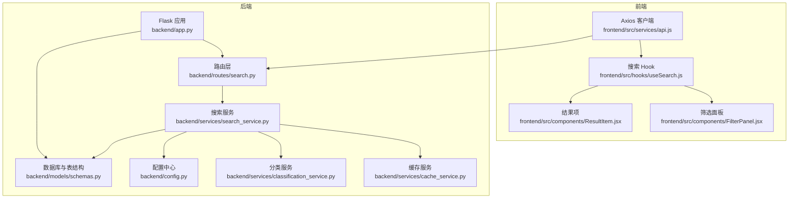
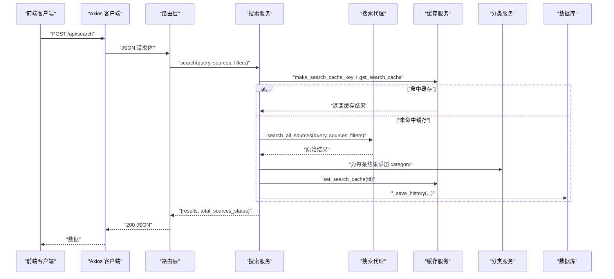
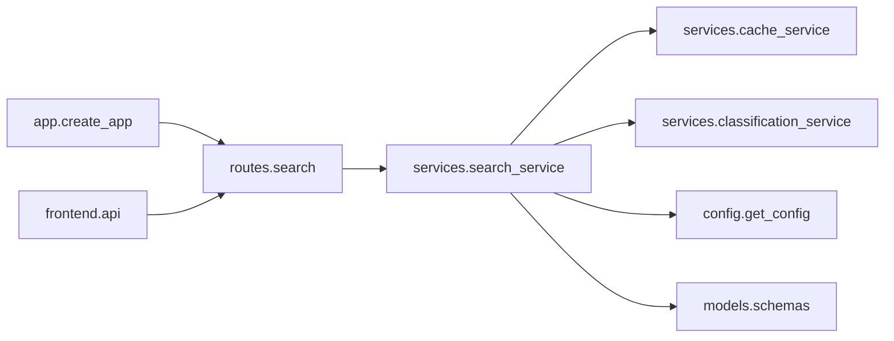

# 搜索API

<cite>
**本文引用的文件**
- [backend/routes/search.py](file://backend/routes/search.py)
- [backend/services/search_service.py](file://backend/services/search_service.py)
- [backend/services/cache_service.py](file://backend/services/cache_service.py)
- [backend/services/classification_service.py](file://backend/services/classification_service.py)
- [backend/models/schemas.py](file://backend/models/schemas.py)
- [backend/app.py](file://backend/app.py)
- [backend/config.py](file://backend/config.py)
- [frontend/src/services/api.js](file://frontend/src/services/api.js)
- [frontend/src/hooks/useSearch.js](file://frontend/src/hooks/useSearch.js)
- [frontend/src/components/FilterPanel.jsx](file://frontend/src/components/FilterPanel.jsx)
- [frontend/src/components/ResultItem.jsx](file://frontend/src/components/ResultItem.jsx)
- [.qoder/config.json](file://.qoder/config.json)
- [README.md](file://README.md)
- [backend/test_integration.py](file://backend/test_integration.py)
</cite>

## 目录
1. [简介](#简介)
2. [项目结构](#项目结构)
3. [核心组件](#核心组件)
4. [架构总览](#架构总览)
5. [详细组件分析](#详细组件分析)
6. [依赖关系分析](#依赖关系分析)
7. [性能考虑](#性能考虑)
8. [故障排查指南](#故障排查指南)
9. [结论](#结论)
10. [附录](#附录)

## 简介
本文件面向使用者与开发者，系统性说明 POST /api/search 搜索接口的功能、请求参数、响应格式、错误处理、查询参数与过滤机制、结果数据结构与排序规则、速率限制与性能优化建议，并提供完整请求/响应示例与常见问题解决方案。

## 项目结构
后端采用 Flask 微服务架构，路由层负责接收请求并校验参数，服务层执行多源搜索、缓存与分类，模型层负责数据库表结构，配置层集中管理运行参数与默认值。前端通过 Axios 发起请求并与 UI 组件协作完成搜索与展示。

图表来源
- [backend/app.py](file://backend/app.py#L21-L78)
- [backend/routes/search.py](file://backend/routes/search.py#L1-L28)
- [backend/services/search_service.py](file://backend/services/search_service.py#L1-L98)
- [backend/services/cache_service.py](file://backend/services/cache_service.py#L1-L104)
- [backend/services/classification_service.py](file://backend/services/classification_service.py#L1-L64)
- [backend/models/schemas.py](file://backend/models/schemas.py#L1-L38)
- [backend/config.py](file://backend/config.py#L1-L85)
- [frontend/src/services/api.js](file://frontend/src/services/api.js#L1-L32)
- [frontend/src/hooks/useSearch.js](file://frontend/src/hooks/useSearch.js#L1-L54)
- [frontend/src/components/FilterPanel.jsx](file://frontend/src/components/FilterPanel.jsx#L1-L52)
- [frontend/src/components/ResultItem.jsx](file://frontend/src/components/ResultItem.jsx#L1-L108)

章节来源
- [backend/app.py](file://backend/app.py#L21-L78)
- [backend/routes/search.py](file://backend/routes/search.py#L1-L28)
- [backend/services/search_service.py](file://backend/services/search_service.py#L1-L98)
- [backend/services/cache_service.py](file://backend/services/cache_service.py#L1-L104)
- [backend/services/classification_service.py](file://backend/services/classification_service.py#L1-L64)
- [backend/models/schemas.py](file://backend/models/schemas.py#L1-L38)
- [backend/config.py](file://backend/config.py#L1-L85)
- [frontend/src/services/api.js](file://frontend/src/services/api.js#L1-L32)
- [frontend/src/hooks/useSearch.js](file://frontend/src/hooks/useSearch.js#L1-L54)
- [frontend/src/components/FilterPanel.jsx](file://frontend/src/components/FilterPanel.jsx#L1-L52)
- [frontend/src/components/ResultItem.jsx](file://frontend/src/components/ResultItem.jsx#L1-L108)

## 核心组件
- 路由层：接收 POST /api/search，校验 query 必填，转发给服务层并返回 JSON。
- 服务层：多源搜索、缓存命中、结果分类、历史记录持久化。
- 缓存层：基于 SQLite 的搜索结果缓存与过期管理。
- 分类层：根据 URL 与来源对结果进行内容类别标注。
- 配置层：读取 .qoder/config.json 与 .env，提供搜索默认值与速率限制。
- 前端：Axios 客户端统一拦截错误；Hook 管理搜索状态与过滤；组件渲染结果与交互。

章节来源
- [backend/routes/search.py](file://backend/routes/search.py#L10-L28)
- [backend/services/search_service.py](file://backend/services/search_service.py#L28-L67)
- [backend/services/cache_service.py](file://backend/services/cache_service.py#L16-L53)
- [backend/services/classification_service.py](file://backend/services/classification_service.py#L30-L64)
- [backend/config.py](file://backend/config.py#L50-L65)
- [frontend/src/services/api.js](file://frontend/src/services/api.js#L10-L29)

## 架构总览
POST /api/search 的端到端流程如下：

图表来源
- [backend/routes/search.py](file://backend/routes/search.py#L10-L28)
- [backend/services/search_service.py](file://backend/services/search_service.py#L28-L67)
- [backend/services/cache_service.py](file://backend/services/cache_service.py#L16-L53)
- [backend/services/classification_service.py](file://backend/services/classification_service.py#L30-L64)
- [backend/models/schemas.py](file://backend/models/schemas.py#L1-L38)

## 详细组件分析

### 接口定义与行为
- 方法与路径：POST /api/search
- 内容类型：application/json
- 请求体字段
  - query: 字符串，必填。搜索关键词。
  - sources: 数组，可选。数据源名称列表，默认来自配置。
  - filters: 对象，可选。当前实现中服务层接收但未使用具体过滤逻辑（前端侧会在客户端进行分类过滤）。
- 成功响应：返回包含 results、total、sources_status 的对象。
- 错误处理：
  - 参数缺失（query 为空）：返回 400，包含错误信息。
  - 服务异常：返回 500，包含错误信息与 detail。

章节来源
- [backend/routes/search.py](file://backend/routes/search.py#L10-L28)
- [backend/services/search_service.py](file://backend/services/search_service.py#L28-L67)
- [frontend/src/hooks/useSearch.js](file://frontend/src/hooks/useSearch.js#L19-L50)

### 请求参数详解
- query
  - 类型：字符串
  - 必填：是
  - 说明：搜索关键词。若为空则直接返回 400。
- sources
  - 类型：数组
  - 默认值：来自配置中的 SEARCH_DEFAULTS.default_sources（默认 ["duckduckgo", "arxiv"]）
  - 支持的数据源（依据前端与 README 描述）：["duckduckgo", "arxiv", "scholar", "zhihu"]
  - 说明：指定本次搜索启用的数据源集合。注意不同数据源的可用性与限制。
- filters
  - 类型：对象
  - 当前服务层：接收并参与缓存键生成，但未在服务层做具体过滤。
  - 前端侧：客户端会根据 category 进行本地过滤（如 academic、qa、blog、forum、webpage）。

章节来源
- [backend/routes/search.py](file://backend/routes/search.py#L15-L20)
- [backend/config.py](file://backend/config.py#L54-L59)
- [.qoder/config.json](file://.qoder/config.json#L8-L13)
- [frontend/src/hooks/useSearch.js](file://frontend/src/hooks/useSearch.js#L13-L17)
- [frontend/src/components/FilterPanel.jsx](file://frontend/src/components/FilterPanel.jsx#L7-L14)

### 响应格式与字段说明
- 返回对象包含：
  - results: 数组。每个元素为一条搜索结果，字段包括但不限于：
    - title: 标题
    - url: 链接
    - snippet: 摘要
    - source: 来源（如 duckduckgo、arxiv、scholar、zhihu）
    - category: 类别（academic、qa、blog、forum、webpage），由分类服务生成
    - authors: 作者（部分来源提供）
    - published: 发布时间（ISO 字符串，部分来源提供）
    - extra: 扩展信息（如 arxiv_id、pdf_url 等）
  - total: 整数。本次查询返回的总结果数。
  - sources_status: 对象。各数据源的执行状态（如 success）。
- 排序规则：服务层未显式排序；前端在客户端按 category 过滤，不改变服务层返回顺序。

章节来源
- [backend/services/search_service.py](file://backend/services/search_service.py#L28-L67)
- [backend/services/classification_service.py](file://backend/services/classification_service.py#L30-L64)
- [frontend/src/components/ResultItem.jsx](file://frontend/src/components/ResultItem.jsx#L37-L108)

### 数据源与过滤选项
- 支持的数据源（依据前端与 README 描述）：["duckduckgo", "arxiv", "scholar", "zhihu"]
- 说明：
  - DuckDuckGo：通用网页搜索（底层使用 Bing，偏向中文内容）
  - arXiv：学术预印本论文（英文为主）
  - Google Scholar：通过 Semantic Scholar API 提供学术文献
  - 知乎：通过 Bing 站内搜索 site:zhihu.com
- 过滤选项：
  - 服务层：filters 参数参与缓存键生成，但未在服务层做具体过滤。
  - 前端：客户端按 category 做本地过滤（academic、qa、blog、forum、webpage、all）。

章节来源
- [README.md](file://README.md#L189-L196)
- [frontend/src/components/FilterPanel.jsx](file://frontend/src/components/FilterPanel.jsx#L7-L14)
- [frontend/src/hooks/useSearch.js](file://frontend/src/hooks/useSearch.js#L35-L38)

### 错误处理与状态码
- 400：请求体缺少 query 或为空字符串
- 500：服务内部异常（捕获异常并记录日志）
- 前端拦截器：对 429、5xx、400 等状态进行用户提示

章节来源
- [backend/routes/search.py](file://backend/routes/search.py#L16-L17)
- [backend/routes/search.py](file://backend/routes/search.py#L25-L27)
- [frontend/src/services/api.js](file://frontend/src/services/api.js#L15-L21)

### 请求与响应示例
- 成功示例
  - 请求
    - POST /api/search
    - Content-Type: application/json
    - 示例体：
      - {
        - "query": "机器学习",
        - "sources": ["duckduckgo", "arxiv"],
        - "filters": {}
        - }
  - 响应
    - 状态码：200
    - 示例体：
      - {
        - "results": [...],
        - "total": 15,
        - "sources_status": {"duckduckgo": "success", "arxiv": "success"}
        - }
- 错误示例
  - 请求体为空
    - 状态码：400
    - 响应体：{"error": "query is required"}
  - 服务异常
    - 状态码：500
    - 响应体：{"error": "Search failed", "detail": "<异常信息>"}

章节来源
- [backend/routes/search.py](file://backend/routes/search.py#L15-L17)
- [backend/routes/search.py](file://backend/routes/search.py#L25-L27)
- [backend/test_integration.py](file://backend/test_integration.py#L48-L58)

### 速率限制
- 速率限制来源于 .qoder/config.json 的 rate_limits 配置，包含各数据源的容量与补充速率。
- 该配置用于后端的令牌桶限流实现（具体实现位于 .qoder 目录下的 agents 与 skills 中，不在当前仓库可见范围内）。
- 前端对 429 状态进行友好提示。

章节来源
- [.qoder/config.json](file://.qoder/config.json#L2-L7)
- [frontend/src/services/api.js](file://frontend/src/services/api.js#L15-L16)
- [README.md](file://README.md#L19-L20)

### 缓存与历史
- 缓存键：基于 query、sources（排序后）、filters 的 JSON 字符串生成哈希。
- 缓存有效期：来自 SEARCH_DEFAULTS.cache_expire_hours（默认 24 小时）。
- 历史记录：每次搜索会写入 search_history 表，包含 query、filters、result_count。
- 历史查询接口：GET /api/history、DELETE /api/history。

章节来源
- [backend/services/cache_service.py](file://backend/services/cache_service.py#L16-L53)
- [backend/services/search_service.py](file://backend/services/search_service.py#L60-L64)
- [backend/models/schemas.py](file://backend/models/schemas.py#L1-L17)
- [backend/config.py](file://backend/config.py#L54-L59)

## 依赖关系分析

图表来源
- [backend/routes/search.py](file://backend/routes/search.py#L1-L28)
- [backend/services/search_service.py](file://backend/services/search_service.py#L1-L98)
- [backend/services/cache_service.py](file://backend/services/cache_service.py#L1-L104)
- [backend/services/classification_service.py](file://backend/services/classification_service.py#L1-L64)
- [backend/models/schemas.py](file://backend/models/schemas.py#L1-L38)
- [backend/app.py](file://backend/app.py#L21-L78)
- [frontend/src/services/api.js](file://frontend/src/services/api.js#L1-L32)

章节来源
- [backend/routes/search.py](file://backend/routes/search.py#L1-L28)
- [backend/services/search_service.py](file://backend/services/search_service.py#L1-L98)
- [backend/services/cache_service.py](file://backend/services/cache_service.py#L1-L104)
- [backend/services/classification_service.py](file://backend/services/classification_service.py#L1-L64)
- [backend/models/schemas.py](file://backend/models/schemas.py#L1-L38)
- [backend/app.py](file://backend/app.py#L21-L78)
- [frontend/src/services/api.js](file://frontend/src/services/api.js#L1-L32)

## 性能考虑
- 缓存策略：命中缓存可显著降低延迟；缓存 TTL 可通过配置调整。
- 并发与超时：SEARCH_DEFAULTS.timeout_seconds 控制单次搜索超时；建议避免同时勾选过多数据源。
- 客户端过滤：前端按类别过滤不会增加后端负载，但会减少渲染量。
- 代理与网络：README 提示可通过 HTTP/HTTPS/SOCKS5 代理访问外部服务，当前主流搜索引擎在国内可直连。

章节来源
- [backend/services/cache_service.py](file://backend/services/cache_service.py#L43-L52)
- [backend/config.py](file://backend/config.py#L54-L59)
- [README.md](file://README.md#L355-L359)

## 故障排查指南
- 搜索返回空结果
  - arXiv 仅支持英文搜索
  - Semantic Scholar API 有速率限制，短时间内多次搜索可能触发 429（系统会自动重试）
  - 查看后端日志了解具体错误
- AI 分析功能不可用
  - 确认已配置有效的 API 密钥
  - 检查 .qoder/config.json 中的 provider 设置
- PDF 下载失败
  - arXiv 服务器可能临时不可用
  - 系统会自动尝试国内镜像
- 参数错误
  - 缺少 query 字段会导致 400
- 服务异常
  - 500 错误通常表示内部异常，检查日志

章节来源
- [README.md](file://README.md#L361-L375)
- [backend/routes/search.py](file://backend/routes/search.py#L16-L17)
- [backend/routes/search.py](file://backend/routes/search.py#L25-L27)

## 结论
POST /api/search 提供了多源聚合搜索能力，结合缓存与分类服务，能够稳定地返回结构化的搜索结果。前端侧的客户端过滤进一步提升了用户体验。通过合理的数据源选择、缓存与超时配置以及速率限制，可在保证性能的同时满足多样化的搜索需求。

## 附录

### API 定义与示例
- 端点：POST /api/search
- 请求头：Content-Type: application/json
- 请求体字段
  - query: 字符串，必填
  - sources: 数组，可选
  - filters: 对象，可选
- 成功响应字段
  - results: 数组
  - total: 整数
  - sources_status: 对象
- 错误响应字段
  - error: 字符串
  - detail: 字符串（500 时存在）

章节来源
- [backend/routes/search.py](file://backend/routes/search.py#L10-L28)
- [backend/services/search_service.py](file://backend/services/search_service.py#L28-L67)

### 前端集成要点
- Axios 客户端统一拦截错误，对 429、5xx、400 等状态进行用户提示
- useSearch Hook 负责发起搜索、设置 loading/error、合并结果与状态
- FilterPanel 与 ResultItem 负责筛选与展示

章节来源
- [frontend/src/services/api.js](file://frontend/src/services/api.js#L10-L29)
- [frontend/src/hooks/useSearch.js](file://frontend/src/hooks/useSearch.js#L19-L50)
- [frontend/src/components/FilterPanel.jsx](file://frontend/src/components/FilterPanel.jsx#L16-L51)
- [frontend/src/components/ResultItem.jsx](file://frontend/src/components/ResultItem.jsx#L37-L108)