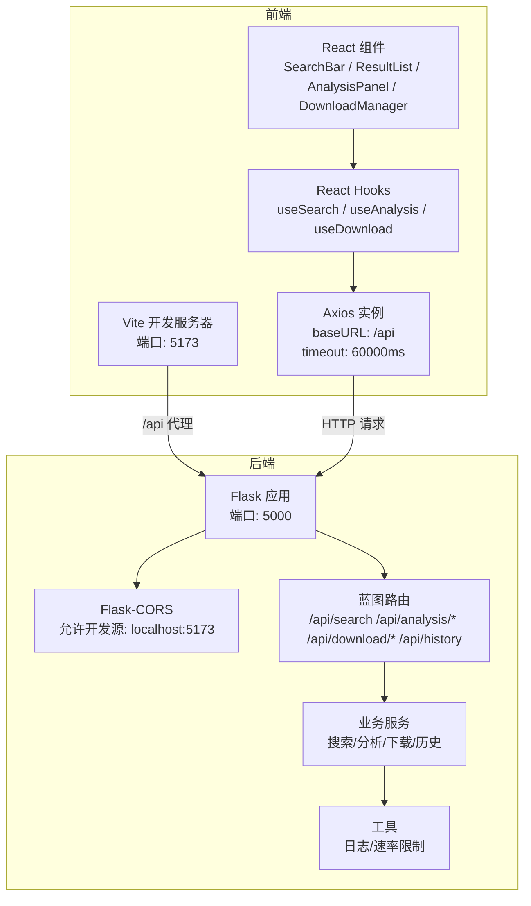
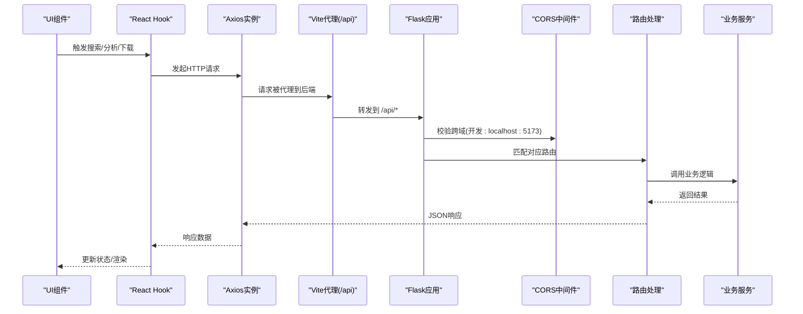
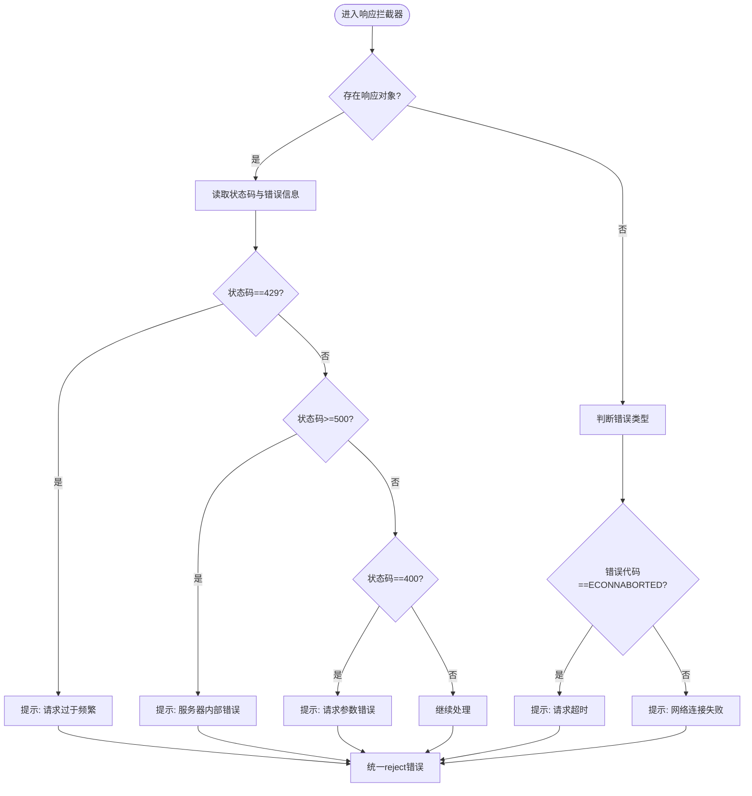
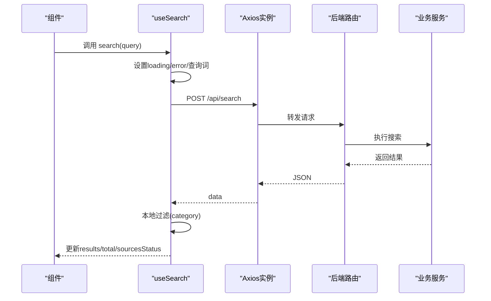
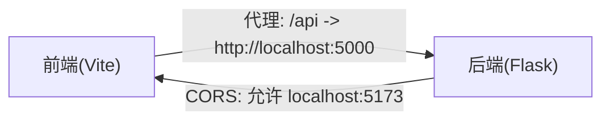
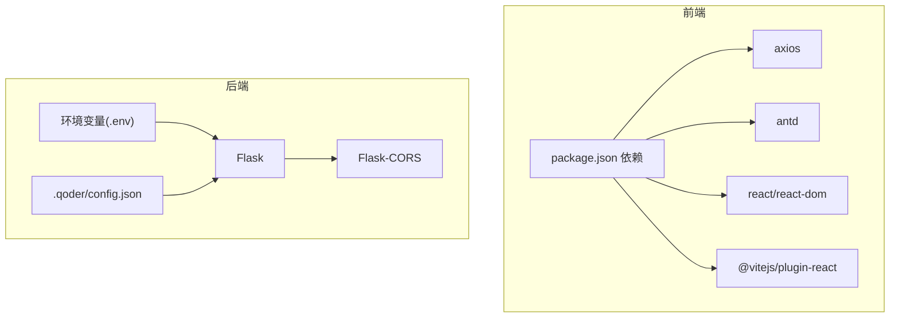

# API集成层

<cite>
**本文引用的文件**
- [frontend/src/services/api.js](file://frontend/src/services/api.js)
- [frontend/src/hooks/useSearch.js](file://frontend/src/hooks/useSearch.js)
- [frontend/src/hooks/useAnalysis.js](file://frontend/src/hooks/useAnalysis.js)
- [frontend/src/hooks/useDownload.js](file://frontend/src/hooks/useDownload.js)
- [frontend/vite.config.js](file://frontend/vite.config.js)
- [backend/app.py](file://backend/app.py)
- [backend/config.py](file://backend/config.py)
- [backend/routes/search.py](file://backend/routes/search.py)
- [backend/routes/analysis.py](file://backend/routes/analysis.py)
- [backend/routes/download.py](file://backend/routes/download.py)
- [backend/routes/history.py](file://backend/routes/history.py)
- [backend/services/rate_limiter.py](file://backend/services/rate_limiter.py)
- [backend/utils/logger.py](file://backend/utils/logger.py)
- [frontend/package.json](file://frontend/package.json)
- [README.md](file://README.md)
- [.env.example](file://.env.example)
</cite>

## 目录
1. [简介](#简介)
2. [项目结构](#项目结构)
3. [核心组件](#核心组件)
4. [架构总览](#架构总览)
5. [详细组件分析](#详细组件分析)
6. [依赖关系分析](#依赖关系分析)
7. [性能考虑](#性能考虑)
8. [故障排查指南](#故障排查指南)
9. [结论](#结论)
10. [附录](#附录)

## 简介
本文件聚焦于前端API集成层，系统性阐述HTTP客户端配置、请求与响应处理、错误统一处理、API服务封装模式、超时与重试策略、认证与CORS跨域方案，以及最佳实践、性能优化与调试技巧。目标是帮助开发者在不深入源码的前提下，也能高效理解并维护该系统的API集成层。

## 项目结构
前端采用React + Vite + Axios的组合；后端采用Flask，提供RESTful API，并内置CORS支持。开发阶段通过Vite代理将/api前缀转发至后端，避免跨域问题；生产模式下Flask静态托管前端产物，统一由后端提供API与静态资源。

图表来源
- [frontend/vite.config.js](file://frontend/vite.config.js#L6-L14)
- [frontend/src/services/api.js](file://frontend/src/services/api.js#L4-L8)
- [backend/app.py](file://backend/app.py#L21-L39)
- [backend/routes/search.py](file://backend/routes/search.py#L10-L27)
- [backend/routes/analysis.py](file://backend/routes/analysis.py#L10-L65)
- [backend/routes/download.py](file://backend/routes/download.py#L14-L97)
- [backend/routes/history.py](file://backend/routes/history.py#L10-L32)

章节来源
- [README.md](file://README.md#L1-L409)
- [frontend/vite.config.js](file://frontend/vite.config.js#L1-L20)
- [backend/app.py](file://backend/app.py#L1-L78)

## 核心组件
- Axios实例与拦截器
  - 基础配置：baseURL、timeout、Content-Type
  - 响应拦截器：统一抽取响应体、集中错误提示与分类处理
- React Hooks封装
  - useSearch：封装搜索请求、状态管理与本地过滤
  - useAnalysis：封装摘要/翻译/论文分析请求
  - useDownload：封装下载任务发起、轮询状态与可见性控制
- 开发代理与CORS
  - Vite代理：将/api转发至后端
  - Flask-CORS：开发时允许前端源访问

章节来源
- [frontend/src/services/api.js](file://frontend/src/services/api.js#L1-L32)
- [frontend/src/hooks/useSearch.js](file://frontend/src/hooks/useSearch.js#L1-L74)
- [frontend/src/hooks/useAnalysis.js](file://frontend/src/hooks/useAnalysis.js#L1-L86)
- [frontend/src/hooks/useDownload.js](file://frontend/src/hooks/useDownload.js#L1-L78)
- [frontend/vite.config.js](file://frontend/vite.config.js#L6-L14)
- [backend/app.py](file://backend/app.py#L32-L33)

## 架构总览
从前端到后端的数据流与控制流如下：

图表来源
- [frontend/src/hooks/useSearch.js](file://frontend/src/hooks/useSearch.js#L19-L50)
- [frontend/src/hooks/useAnalysis.js](file://frontend/src/hooks/useAnalysis.js#L11-L57)
- [frontend/src/hooks/useDownload.js](file://frontend/src/hooks/useDownload.js#L9-L48)
- [frontend/src/services/api.js](file://frontend/src/services/api.js#L10-L29)
- [frontend/vite.config.js](file://frontend/vite.config.js#L8-L13)
- [backend/app.py](file://backend/app.py#L32-L39)
- [backend/routes/search.py](file://backend/routes/search.py#L10-L27)
- [backend/routes/analysis.py](file://backend/routes/analysis.py#L10-L65)
- [backend/routes/download.py](file://backend/routes/download.py#L14-L97)

## 详细组件分析

### Axios实例与拦截器
- 基础配置
  - baseURL：统一前缀为/api，便于开发代理与生产静态托管
  - timeout：60秒，兼顾长任务与及时失败
  - Content-Type：application/json
- 响应拦截器
  - 成功：返回响应体中的数据字段
  - 失败：根据状态码与错误类型进行分类提示
    - 429：请求过于频繁
    - 5xx：服务器内部错误
    - 400：请求参数错误
    - 超时：ECONNABORTED
    - 其他：网络连接失败
  - 最终统一reject，便于上层Hook捕获

图表来源
- [frontend/src/services/api.js](file://frontend/src/services/api.js#L10-L29)

章节来源
- [frontend/src/services/api.js](file://frontend/src/services/api.js#L4-L8)
- [frontend/src/services/api.js](file://frontend/src/services/api.js#L10-L29)

### API服务封装模式
- 统一入口：所有HTTP请求通过Axios实例发起
- Hook职责：
  - useSearch：组织查询参数、调用API、合并本地过滤、管理加载与错误状态
  - useAnalysis：分别封装摘要、翻译、论文分析三个子功能，统一loading与错误回退
  - useDownload：发起下载、轮询状态、清理轮询定时器、移除已完成任务
- 状态管理：在Hook中集中维护loading、error、results、filters等状态，UI层只负责展示

图表来源
- [frontend/src/hooks/useSearch.js](file://frontend/src/hooks/useSearch.js#L19-L50)
- [backend/routes/search.py](file://backend/routes/search.py#L10-L27)

章节来源
- [frontend/src/hooks/useSearch.js](file://frontend/src/hooks/useSearch.js#L1-L74)
- [frontend/src/hooks/useAnalysis.js](file://frontend/src/hooks/useAnalysis.js#L1-L86)
- [frontend/src/hooks/useDownload.js](file://frontend/src/hooks/useDownload.js#L1-L78)

### 请求重试策略与超时处理
- 超时处理
  - Axios实例设置60秒超时，拦截器中对ECONNABORTED进行专门提示
- 重试策略
  - 当前未实现自动重试；可在拦截器中基于状态码或错误类型扩展指数退避重试
  - 对于429等可重试场景，建议结合后端速率限制策略与前端退避策略协同

章节来源
- [frontend/src/services/api.js](file://frontend/src/services/api.js#L6)
- [frontend/src/services/api.js](file://frontend/src/services/api.js#L22-L26)

### 认证机制
- 当前未实现认证头注入；如需鉴权，可在Axios实例添加请求拦截器统一注入Authorization头
- 建议配合后端路由保护与CORS策略，确保仅受信任域名可访问

章节来源
- [frontend/src/services/api.js](file://frontend/src/services/api.js#L4-L8)

### CORS处理与跨域解决方案
- 开发环境
  - Vite代理：将/api转发至后端，避免浏览器同源策略
  - Flask-CORS：允许开发源localhost:5173访问
- 生产环境
  - Flask静态托管前端产物，统一由后端提供API与静态资源，天然避免跨域

图表来源
- [frontend/vite.config.js](file://frontend/vite.config.js#L8-L13)
- [backend/app.py](file://backend/app.py#L32-L33)

章节来源
- [frontend/vite.config.js](file://frontend/vite.config.js#L1-L20)
- [backend/app.py](file://backend/app.py#L32-L33)

### API调用最佳实践
- 参数校验：在Hook中进行基础校验，减少无效请求
- 加载与错误状态：统一在Hook中管理，避免UI层分散处理
- 本地过滤：在前端完成轻量过滤，降低后端压力
- 轮询策略：useDownload中基于活跃任务动态启停轮询，避免常驻定时器
- 错误提示：使用统一拦截器进行分类提示，提升用户感知

章节来源
- [frontend/src/hooks/useSearch.js](file://frontend/src/hooks/useSearch.js#L19-L50)
- [frontend/src/hooks/useAnalysis.js](file://frontend/src/hooks/useAnalysis.js#L11-L57)
- [frontend/src/hooks/useDownload.js](file://frontend/src/hooks/useDownload.js#L51-L64)
- [frontend/src/services/api.js](file://frontend/src/services/api.js#L10-L29)

## 依赖关系分析
- 前端依赖
  - axios：HTTP客户端
  - antd：UI与消息提示
  - react/react-dom：视图框架
  - vite：开发与构建
- 后端依赖
  - flask/flask-cors：Web框架与CORS
  - 环境变量与配置：.env与.qoder/config.json

图表来源
- [frontend/package.json](file://frontend/package.json#L11-L22)
- [backend/app.py](file://backend/app.py#L8)
- [.env.example](file://.env.example#L1-L21)

章节来源
- [frontend/package.json](file://frontend/package.json#L1-L24)
- [backend/config.py](file://backend/config.py#L1-L85)

## 性能考虑
- 超时与重试
  - 合理设置超时时间，避免长时间阻塞
  - 对429等可恢复错误实施退避重试
- 并发控制
  - 控制同时勾选的数据源数量，避免并发过高导致超时或限流
- 本地过滤
  - 在前端完成轻量过滤，减少后端计算与网络传输
- 轮询优化
  - 基于活跃任务动态启停轮询，降低CPU占用
- 缓存与复用
  - 后端具备多级缓存策略，前端可结合业务场景复用结果

章节来源
- [README.md](file://README.md#L355-L359)
- [backend/services/rate_limiter.py](file://backend/services/rate_limiter.py#L45-L75)

## 故障排查指南
- 常见错误与提示
  - 429：请求过于频繁，检查重试策略与并发
  - 5xx：服务器内部错误，查看后端日志
  - 400：请求参数错误，检查请求体格式
  - ECONNABORTED：请求超时，调整超时阈值或网络环境
  - 网络连接失败：确认代理与CORS配置
- 日志与监控
  - 后端全局异常处理器统一返回错误信息
  - 使用日志工具输出详细堆栈，定位问题根因
- 速率限制
  - 后端实现令牌桶限流，避免外部API滥用
  - 前端可根据429与限流策略调整请求节奏

章节来源
- [frontend/src/services/api.js](file://frontend/src/services/api.js#L13-L26)
- [backend/app.py](file://backend/app.py#L62-L65)
- [backend/utils/logger.py](file://backend/utils/logger.py#L5-L22)
- [backend/services/rate_limiter.py](file://backend/services/rate_limiter.py#L5-L43)

## 结论
该API集成层以Axios为核心，结合Vite代理与Flask-CORS，实现了前后端分离下的稳定通信。通过统一的响应拦截器与Hooks封装，实现了清晰的状态管理与错误处理。建议在现有基础上补充自动重试、鉴权头注入与更细粒度的超时/重试策略，以进一步提升稳定性与可维护性。

## 附录
- API接口清单
  - 搜索：POST /api/search
  - 分析：POST /api/analysis/summarize、POST /api/analysis/translate、POST /api/analysis/paper
  - 下载：POST /api/download/arxiv、GET /api/download/status/{id}、GET /api/download/file/{id}、GET /api/download/history
  - 历史：GET /api/history、DELETE /api/history
- 开发与生产
  - 开发：Vite代理 + Flask-CORS
  - 生产：Flask静态托管前端，统一提供API与静态资源

章节来源
- [README.md](file://README.md#L229-L274)
- [backend/routes/search.py](file://backend/routes/search.py#L10-L27)
- [backend/routes/analysis.py](file://backend/routes/analysis.py#L10-L65)
- [backend/routes/download.py](file://backend/routes/download.py#L14-L97)
- [backend/routes/history.py](file://backend/routes/history.py#L10-L32)
- [backend/app.py](file://backend/app.py#L42-L59)