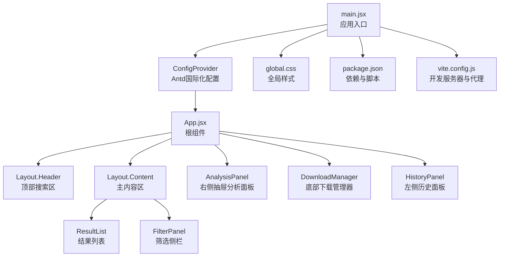
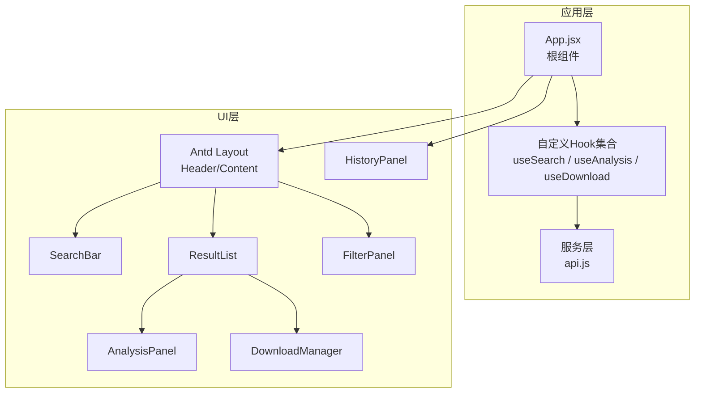
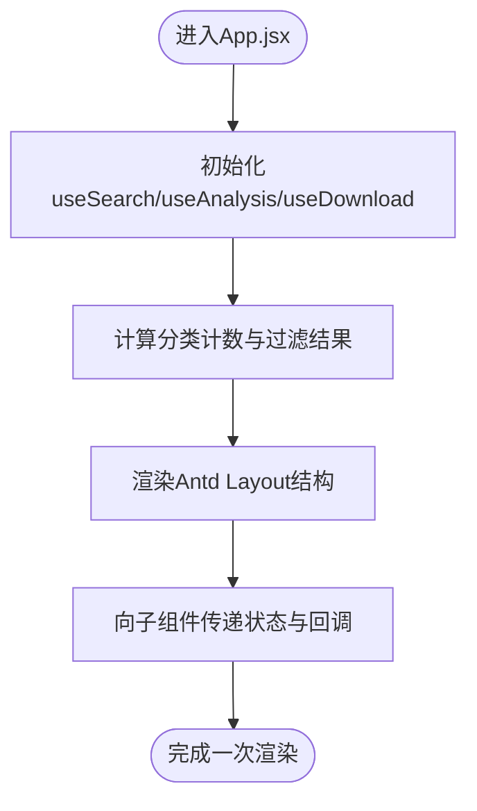
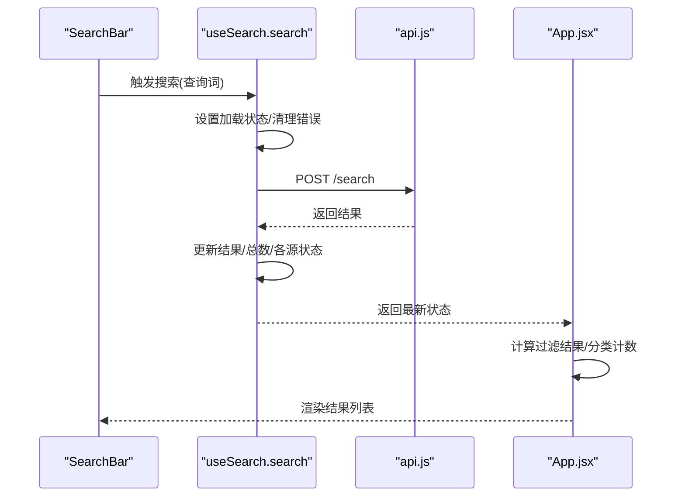
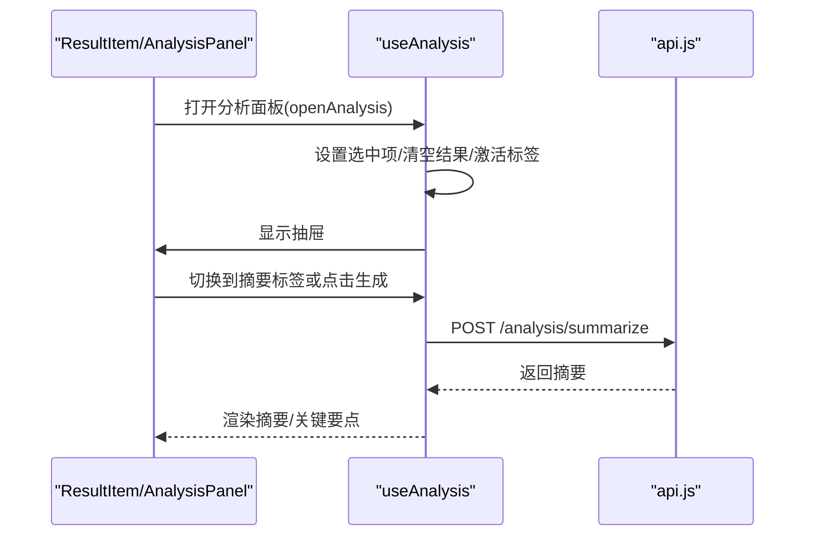
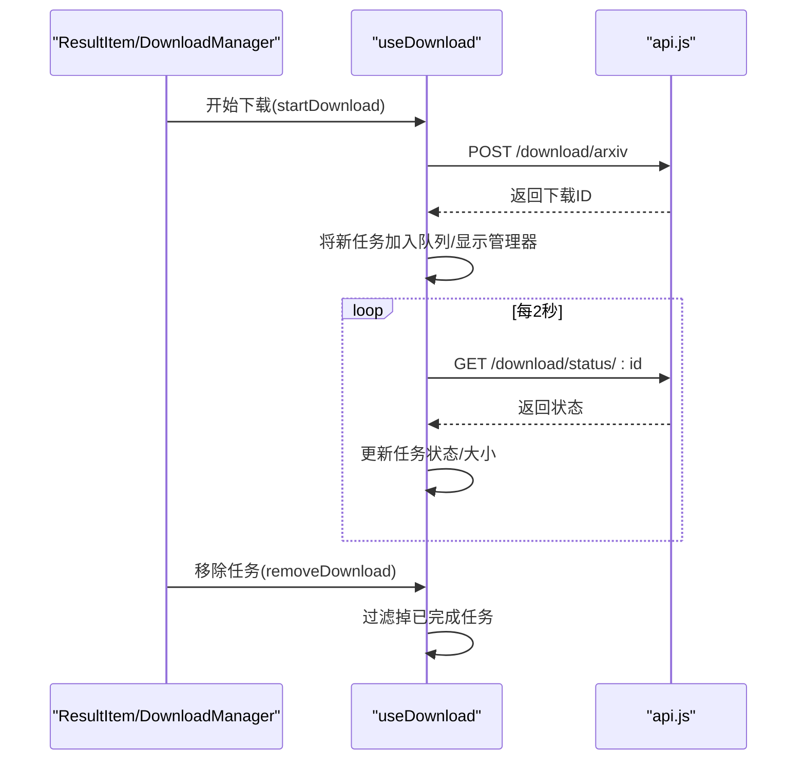
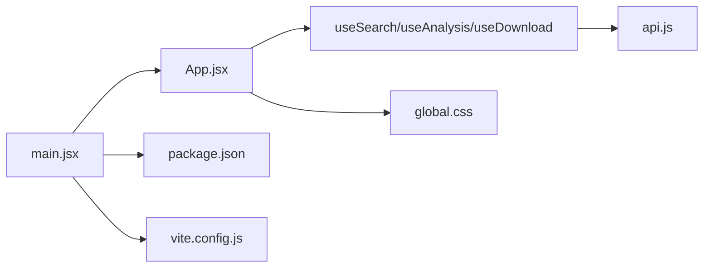

# React应用入口

<cite>
**本文档引用的文件**
- [frontend/src/main.jsx](file://frontend/src/main.jsx)
- [frontend/src/App.jsx](file://frontend/src/App.jsx)
- [frontend/src/hooks/useSearch.js](file://frontend/src/hooks/useSearch.js)
- [frontend/src/hooks/useAnalysis.js](file://frontend/src/hooks/useAnalysis.js)
- [frontend/src/hooks/useDownload.js](file://frontend/src/hooks/useDownload.js)
- [frontend/src/services/api.js](file://frontend/src/services/api.js)
- [frontend/src/components/SearchBar.jsx](file://frontend/src/components/SearchBar.jsx)
- [frontend/src/components/FilterPanel.jsx](file://frontend/src/components/FilterPanel.jsx)
- [frontend/src/components/ResultList.jsx](file://frontend/src/components/ResultList.jsx)
- [frontend/src/components/AnalysisPanel.jsx](file://frontend/src/components/AnalysisPanel.jsx)
- [frontend/src/components/DownloadManager.jsx](file://frontend/src/components/DownloadManager.jsx)
- [frontend/src/components/HistoryPanel.jsx](file://frontend/src/components/HistoryPanel.jsx)
- [frontend/src/styles/global.css](file://frontend/src/styles/global.css)
- [frontend/package.json](file://frontend/package.json)
- [frontend/vite.config.js](file://frontend/vite.config.js)
</cite>

## 目录
1. [简介](#简介)
2. [项目结构](#项目结构)
3. [核心组件](#核心组件)
4. [架构总览](#架构总览)
5. [详细组件分析](#详细组件分析)
6. [依赖关系分析](#依赖关系分析)
7. [性能考虑](#性能考虑)
8. [故障排除指南](#故障排除指南)
9. [结论](#结论)
10. [附录](#附录)

## 简介
本文件面向前端开发者，系统化阐述该React应用的入口初始化流程与组件树结构，深入解析App.jsx作为根组件的设计思路（状态管理、组件组合模式、布局设计），并覆盖Ant Design布局组件的使用方式、全局状态传递机制以及组件间通信策略。同时提供应用启动流程、性能优化技巧与开发调试方法，帮助开发者快速理解架构并进行后续扩展。

## 项目结构
前端采用Vite构建工具，入口位于frontend/src/main.jsx，根组件为App.jsx。应用通过自定义Hook实现业务状态管理，并以Ant Design组件库为基础搭建UI框架。样式通过全局CSS统一管理，路由与后端API交互通过代理配置在开发环境生效。

**图表来源**
- [frontend/src/main.jsx](file://frontend/src/main.jsx#L1-L15)
- [frontend/src/App.jsx](file://frontend/src/App.jsx#L1-L149)
- [frontend/src/styles/global.css](file://frontend/src/styles/global.css#L1-L156)
- [frontend/package.json](file://frontend/package.json#L1-L24)
- [frontend/vite.config.js](file://frontend/vite.config.js#L1-L20)

**章节来源**
- [frontend/src/main.jsx](file://frontend/src/main.jsx#L1-L15)
- [frontend/src/App.jsx](file://frontend/src/App.jsx#L1-L149)
- [frontend/src/styles/global.css](file://frontend/src/styles/global.css#L1-L156)
- [frontend/package.json](file://frontend/package.json#L1-L24)
- [frontend/vite.config.js](file://frontend/vite.config.js#L1-L20)

## 核心组件
- 应用入口：main.jsx负责挂载React应用，注入Ant Design的ConfigProvider以启用中文本地化，并渲染根组件App。
- 根组件App：集中管理三大业务域状态（搜索、分析、下载），计算派生数据（如分类统计与过滤后的结果），并通过属性向下传递给子组件。
- 自定义Hook：useSearch、useAnalysis、useDownload分别封装独立领域的状态与副作用逻辑，提升可复用性与可测试性。
- Ant Design布局：使用Layout.Header与Layout.Content构建页面骨架，配合Drawer、Modal等组件实现分析、历史等功能面板。
- 全局样式：通过global.css统一字体、间距、响应式布局与特定组件容器样式。

**章节来源**
- [frontend/src/main.jsx](file://frontend/src/main.jsx#L1-L15)
- [frontend/src/App.jsx](file://frontend/src/App.jsx#L1-L149)
- [frontend/src/hooks/useSearch.js](file://frontend/src/hooks/useSearch.js#L1-L74)
- [frontend/src/hooks/useAnalysis.js](file://frontend/src/hooks/useAnalysis.js#L1-L86)
- [frontend/src/hooks/useDownload.js](file://frontend/src/hooks/useDownload.js#L1-L78)
- [frontend/src/styles/global.css](file://frontend/src/styles/global.css#L1-L156)

## 架构总览
应用采用“根组件集中状态 + 自定义Hook拆分领域”的架构模式。根组件负责：
- 组合多个自定义Hook，形成统一的业务上下文
- 计算派生数据（如分类计数、客户端过滤结果）
- 通过props向子组件传递状态与回调函数
- 使用Ant Design布局组件组织页面结构

**图表来源**
- [frontend/src/App.jsx](file://frontend/src/App.jsx#L1-L149)
- [frontend/src/hooks/useSearch.js](file://frontend/src/hooks/useSearch.js#L1-L74)
- [frontend/src/hooks/useAnalysis.js](file://frontend/src/hooks/useAnalysis.js#L1-L86)
- [frontend/src/hooks/useDownload.js](file://frontend/src/hooks/useDownload.js#L1-L78)
- [frontend/src/services/api.js](file://frontend/src/services/api.js#L1-L32)

## 详细组件分析

### 根组件App.jsx设计思路
- 状态聚合：集中从三个Hook获取状态与动作，避免跨层级传递。
- 派生计算：使用useMemo计算分类计数与客户端过滤结果，减少不必要渲染。
- 组件组合：将搜索、结果、筛选、分析、下载、历史等功能模块以Ant Design布局组件有序组织。
- 事件处理：对外部事件（如下载）进行封装，统一提示与状态更新。

**图表来源**
- [frontend/src/App.jsx](file://frontend/src/App.jsx#L1-L149)

**章节来源**
- [frontend/src/App.jsx](file://frontend/src/App.jsx#L1-L149)

### 自定义Hook：useSearch（搜索域）
- 职责：维护搜索结果、总数、各数据源状态、加载与错误状态；提供查询、切换数据源与分类筛选的方法。
- 数据流：调用api.post('/search')获取结果，支持客户端分类过滤。
- 性能：通过useCallback稳定回调，避免子组件不必要的重渲染。

**图表来源**
- [frontend/src/hooks/useSearch.js](file://frontend/src/hooks/useSearch.js#L1-L74)
- [frontend/src/services/api.js](file://frontend/src/services/api.js#L1-L32)
- [frontend/src/components/SearchBar.jsx](file://frontend/src/components/SearchBar.jsx#L1-L42)

**章节来源**
- [frontend/src/hooks/useSearch.js](file://frontend/src/hooks/useSearch.js#L1-L74)
- [frontend/src/components/SearchBar.jsx](file://frontend/src/components/SearchBar.jsx#L1-L42)
- [frontend/src/services/api.js](file://frontend/src/services/api.js#L1-L32)

### 自定义Hook：useAnalysis（分析域）
- 职责：维护分析面板可见性、选中项、活动标签页与分析结果；提供摘要、翻译、论文分析等动作。
- 生命周期：在抽屉打开且无默认摘要时自动触发摘要生成。
- 错误处理：将错误信息写入分析结果对象，便于UI展示。

**图表来源**
- [frontend/src/hooks/useAnalysis.js](file://frontend/src/hooks/useAnalysis.js#L1-L86)
- [frontend/src/services/api.js](file://frontend/src/services/api.js#L1-L32)
- [frontend/src/components/AnalysisPanel.jsx](file://frontend/src/components/AnalysisPanel.jsx#L1-L171)

**章节来源**
- [frontend/src/hooks/useAnalysis.js](file://frontend/src/hooks/useAnalysis.js#L1-L86)
- [frontend/src/components/AnalysisPanel.jsx](file://frontend/src/components/AnalysisPanel.jsx#L1-L171)
- [frontend/src/services/api.js](file://frontend/src/services/api.js#L1-L32)

### 自定义Hook：useDownload（下载域）
- 职责：维护下载队列、可见性与轮询状态；提供开始下载、移除任务与状态刷新。
- 轮询机制：当存在进行中或等待中的任务时，每2秒轮询一次下载状态，结束后停止轮询。
- 用户体验：通过消息提示与进度条反馈下载状态变化。

**图表来源**
- [frontend/src/hooks/useDownload.js](file://frontend/src/hooks/useDownload.js#L1-L78)
- [frontend/src/services/api.js](file://frontend/src/services/api.js#L1-L32)
- [frontend/src/components/DownloadManager.jsx](file://frontend/src/components/DownloadManager.jsx#L1-L114)

**章节来源**
- [frontend/src/hooks/useDownload.js](file://frontend/src/hooks/useDownload.js#L1-L78)
- [frontend/src/components/DownloadManager.jsx](file://frontend/src/components/DownloadManager.jsx#L1-L114)
- [frontend/src/services/api.js](file://frontend/src/services/api.js#L1-L32)

### 组件间通信策略
- 单向数据流：根组件通过props向下传递状态与回调，子组件只负责展示与触发动作。
- 事件冒泡：子组件通过回调向上通知根组件，根组件再决定是否更新状态或执行副作用。
- 抽屉/抽屉面板：AnalysisPanel与HistoryPanel采用Ant Design的Drawer组件，通过visible与onClose控制显隐，避免跨层级状态提升。

**章节来源**
- [frontend/src/App.jsx](file://frontend/src/App.jsx#L1-L149)
- [frontend/src/components/AnalysisPanel.jsx](file://frontend/src/components/AnalysisPanel.jsx#L1-L171)
- [frontend/src/components/HistoryPanel.jsx](file://frontend/src/components/HistoryPanel.jsx#L1-L91)

### Ant Design布局组件使用
- Layout.Header：放置标题、搜索框与历史按钮，使用渐变背景与阴影增强视觉层次。
- Layout.Content：承载结果列表与筛选侧栏，采用flex布局实现主次区域分离。
- 分析面板：使用Drawer实现右侧抽屉，避免遮挡主要内容。
- 下载管理器：固定在页面底部，使用Badge与Progress反馈任务状态。
- 响应式设计：在小屏设备上调整布局方向与宽度，保证可用性。

**章节来源**
- [frontend/src/App.jsx](file://frontend/src/App.jsx#L75-L147)
- [frontend/src/styles/global.css](file://frontend/src/styles/global.css#L19-L155)
- [frontend/src/components/AnalysisPanel.jsx](file://frontend/src/components/AnalysisPanel.jsx#L147-L169)
- [frontend/src/components/DownloadManager.jsx](file://frontend/src/components/DownloadManager.jsx#L29-L112)

## 依赖关系分析
- 入口依赖：main.jsx依赖React、ReactDOM、Ant Design ConfigProvider与全局样式。
- 根组件依赖：App.jsx依赖Ant Design Layout与多个自定义Hook及业务组件。
- Hook依赖：三个Hook均依赖api.js提供的HTTP客户端。
- 组件依赖：各功能组件依赖Ant Design基础组件与图标库。
- 构建与运行：package.json声明React、Ant Design、Axios等依赖；vite.config.js配置开发服务器与API代理。

**图表来源**
- [frontend/src/main.jsx](file://frontend/src/main.jsx#L1-L15)
- [frontend/src/App.jsx](file://frontend/src/App.jsx#L1-L149)
- [frontend/src/hooks/useSearch.js](file://frontend/src/hooks/useSearch.js#L1-L74)
- [frontend/src/hooks/useAnalysis.js](file://frontend/src/hooks/useAnalysis.js#L1-L86)
- [frontend/src/hooks/useDownload.js](file://frontend/src/hooks/useDownload.js#L1-L78)
- [frontend/src/services/api.js](file://frontend/src/services/api.js#L1-L32)
- [frontend/src/styles/global.css](file://frontend/src/styles/global.css#L1-L156)
- [frontend/package.json](file://frontend/package.json#L1-L24)
- [frontend/vite.config.js](file://frontend/vite.config.js#L1-L20)

**章节来源**
- [frontend/src/main.jsx](file://frontend/src/main.jsx#L1-L15)
- [frontend/src/App.jsx](file://frontend/src/App.jsx#L1-L149)
- [frontend/src/hooks/useSearch.js](file://frontend/src/hooks/useSearch.js#L1-L74)
- [frontend/src/hooks/useAnalysis.js](file://frontend/src/hooks/useAnalysis.js#L1-L86)
- [frontend/src/hooks/useDownload.js](file://frontend/src/hooks/useDownload.js#L1-L78)
- [frontend/src/services/api.js](file://frontend/src/services/api.js#L1-L32)
- [frontend/src/styles/global.css](file://frontend/src/styles/global.css#L1-L156)
- [frontend/package.json](file://frontend/package.json#L1-L24)
- [frontend/vite.config.js](file://frontend/vite.config.js#L1-L20)

## 性能考虑
- 渲染优化
  - 使用useMemo缓存分类计数与过滤结果，避免每次渲染都重新计算。
  - 在useSearch与useAnalysis中使用useCallback稳定回调，降低子组件重渲染概率。
- 网络与轮询
  - useDownload基于任务状态动态启停轮询，减少无效请求；轮询间隔为2秒，平衡实时性与资源消耗。
  - api.js拦截器统一处理错误与超时，避免重复错误提示。
- UI交互
  - 抽屉与抽屉面板按需渲染，避免常驻DOM节点。
  - 列表组件在加载与空状态时使用轻量占位，减少复杂DOM结构。
- 样式与布局
  - 使用Flex布局与媒体查询适配移动端，减少额外JS判断。
  - 固定下载管理器位置，避免频繁重排。

**章节来源**
- [frontend/src/App.jsx](file://frontend/src/App.jsx#L59-L73)
- [frontend/src/hooks/useSearch.js](file://frontend/src/hooks/useSearch.js#L19-L50)
- [frontend/src/hooks/useAnalysis.js](file://frontend/src/hooks/useAnalysis.js#L11-L24)
- [frontend/src/hooks/useDownload.js](file://frontend/src/hooks/useDownload.js#L50-L64)
- [frontend/src/services/api.js](file://frontend/src/services/api.js#L10-L29)
- [frontend/src/styles/global.css](file://frontend/src/styles/global.css#L144-L155)

## 故障排除指南
- 启动与代理
  - 确认开发服务器端口与后端地址一致，代理规则指向后端服务。
  - 若出现跨域问题，检查代理配置与后端CORS设置。
- 网络请求
  - 当出现429/5xx/400等错误时，拦截器会弹出相应提示；检查后端接口状态与参数。
  - 超时错误通常由网络不稳定导致，建议重试或调整超时时间。
- 下载状态异常
  - 若下载状态长时间不变，检查轮询逻辑与后端状态接口返回格式。
  - 移除任务后仍显示，确认状态更新逻辑与去重策略。
- UI显示异常
  - 抽屉无法关闭：检查visible与onClose回调绑定。
  - 结果为空但未显示空状态：确认结果数组与总数的同步逻辑。

**章节来源**
- [frontend/vite.config.js](file://frontend/vite.config.js#L6-L14)
- [frontend/src/services/api.js](file://frontend/src/services/api.js#L10-L29)
- [frontend/src/hooks/useDownload.js](file://frontend/src/hooks/useDownload.js#L26-L48)
- [frontend/src/components/AnalysisPanel.jsx](file://frontend/src/components/AnalysisPanel.jsx#L147-L169)
- [frontend/src/components/ResultList.jsx](file://frontend/src/components/ResultList.jsx#L15-L25)

## 结论
该应用以App.jsx为核心，结合自定义Hook与Ant Design组件，实现了清晰的职责划分与良好的用户体验。通过集中状态管理与单向数据流，组件间通信简洁可靠；借助useMemo与useCallback等优化手段，兼顾了性能与可维护性。开发调试方面，代理配置与拦截器提供了便捷的联调路径。建议在后续迭代中持续关注状态粒度与副作用边界，保持Hook的单一职责原则，以进一步提升可扩展性。

## 附录
- 开发命令
  - dev：启动Vite开发服务器
  - build：打包生产资源
  - preview：预览生产构建
- 关键配置
  - 本地代理：将/api前缀转发至后端服务
  - Ant Design本地化：启用简体中文

**章节来源**
- [frontend/package.json](file://frontend/package.json#L6-L10)
- [frontend/vite.config.js](file://frontend/vite.config.js#L4-L19)