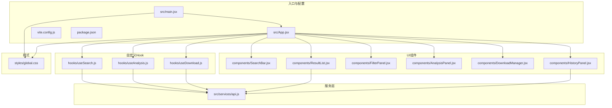
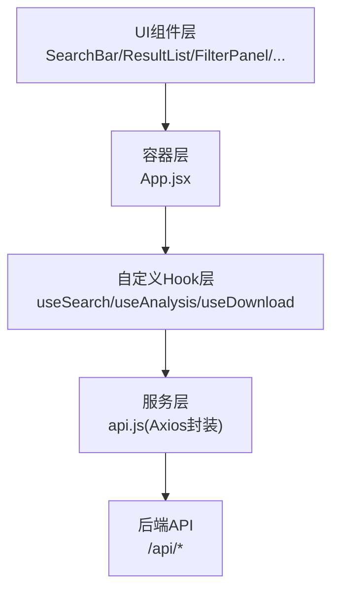
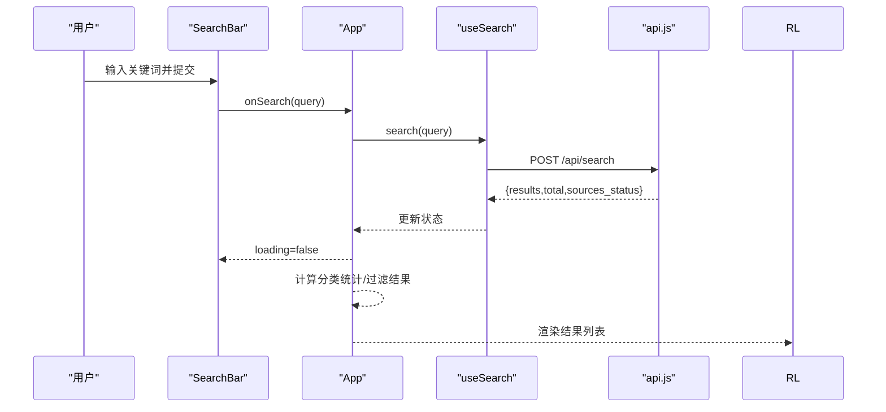
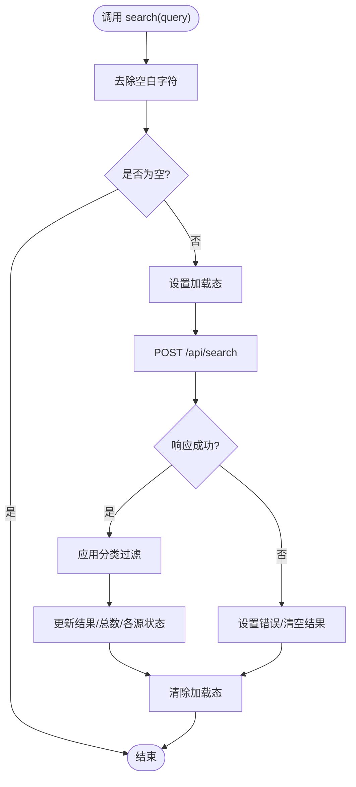
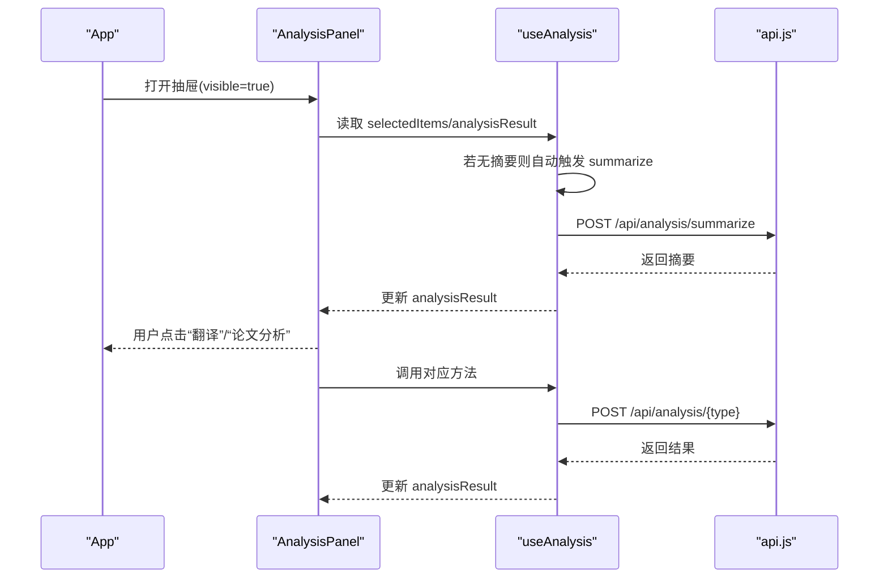
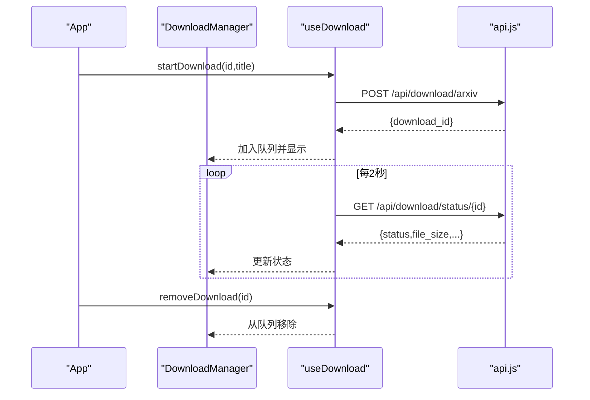
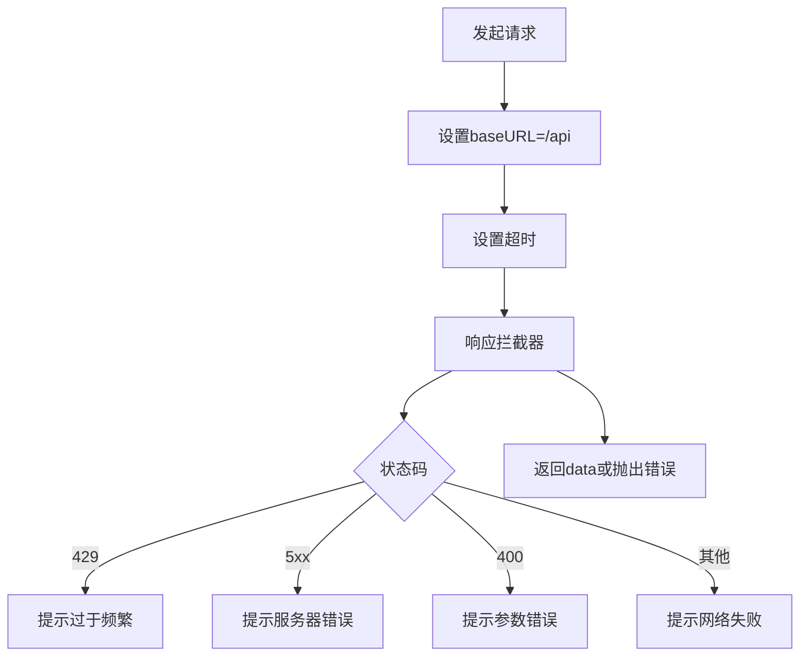
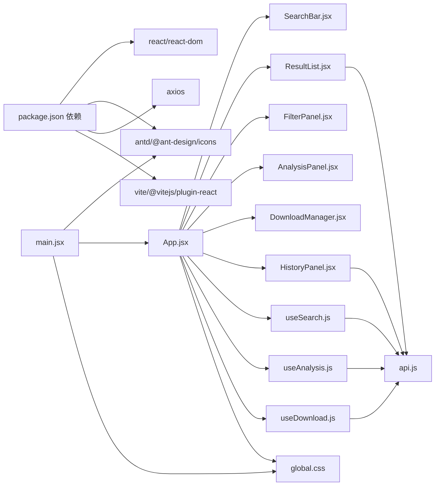

# 前端开发指南

<cite>
**本文档引用的文件**
- [frontend/src/main.jsx](file://frontend/src/main.jsx)
- [frontend/src/App.jsx](file://frontend/src/App.jsx)
- [frontend/src/services/api.js](file://frontend/src/services/api.js)
- [frontend/src/hooks/useSearch.js](file://frontend/src/hooks/useSearch.js)
- [frontend/src/hooks/useAnalysis.js](file://frontend/src/hooks/useAnalysis.js)
- [frontend/src/hooks/useDownload.js](file://frontend/src/hooks/useDownload.js)
- [frontend/src/components/SearchBar.jsx](file://frontend/src/components/SearchBar.jsx)
- [frontend/src/components/ResultList.jsx](file://frontend/src/components/ResultList.jsx)
- [frontend/src/components/FilterPanel.jsx](file://frontend/src/components/FilterPanel.jsx)
- [frontend/src/components/AnalysisPanel.jsx](file://frontend/src/components/AnalysisPanel.jsx)
- [frontend/src/components/DownloadManager.jsx](file://frontend/src/components/DownloadManager.jsx)
- [frontend/src/components/HistoryPanel.jsx](file://frontend/src/components/HistoryPanel.jsx)
- [frontend/src/styles/global.css](file://frontend/src/styles/global.css)
- [frontend/package.json](file://frontend/package.json)
- [frontend/vite.config.js](file://frontend/vite.config.js)
</cite>

## 目录
1. [简介](#简介)
2. [项目结构](#项目结构)
3. [核心组件](#核心组件)
4. [架构总览](#架构总览)
5. [详细组件分析](#详细组件分析)
6. [依赖关系分析](#依赖关系分析)
7. [性能考虑](#性能考虑)
8. [故障排查指南](#故障排查指南)
9. [结论](#结论)
10. [附录](#附录)

## 简介
本指南面向前端开发者，系统讲解基于 React 的搜索应用开发与维护。内容涵盖应用入口、组件架构、自定义 Hook 设计、API 集成策略、组件通信与状态管理、响应式设计、Ant Design 使用与样式定制、性能优化、开发规范、测试策略以及构建与部署流程。目标是帮助团队建立一致的开发标准，提升可维护性与扩展性。

## 项目结构
前端采用 Vite 构建工具，React 18 + Ant Design 5 作为 UI 基础，通过自定义 Hook 封装业务逻辑，组件按功能模块化组织，样式集中管理。

**图表来源**
- [frontend/src/main.jsx](file://frontend/src/main.jsx#L1-L15)
- [frontend/src/App.jsx](file://frontend/src/App.jsx#L1-L149)
- [frontend/src/services/api.js](file://frontend/src/services/api.js#L1-L32)
- [frontend/src/hooks/useSearch.js](file://frontend/src/hooks/useSearch.js#L1-L74)
- [frontend/src/hooks/useAnalysis.js](file://frontend/src/hooks/useAnalysis.js#L1-L86)
- [frontend/src/hooks/useDownload.js](file://frontend/src/hooks/useDownload.js#L1-L78)
- [frontend/src/components/SearchBar.jsx](file://frontend/src/components/SearchBar.jsx#L1-L42)
- [frontend/src/components/ResultList.jsx](file://frontend/src/components/ResultList.jsx#L1-L58)
- [frontend/src/components/FilterPanel.jsx](file://frontend/src/components/FilterPanel.jsx#L1-L52)
- [frontend/src/components/AnalysisPanel.jsx](file://frontend/src/components/AnalysisPanel.jsx#L1-L171)
- [frontend/src/components/DownloadManager.jsx](file://frontend/src/components/DownloadManager.jsx#L1-L114)
- [frontend/src/components/HistoryPanel.jsx](file://frontend/src/components/HistoryPanel.jsx#L1-L91)
- [frontend/src/styles/global.css](file://frontend/src/styles/global.css#L1-L156)
- [frontend/vite.config.js](file://frontend/vite.config.js#L1-L20)
- [frontend/package.json](file://frontend/package.json#L1-L24)

**章节来源**
- [frontend/src/main.jsx](file://frontend/src/main.jsx#L1-L15)
- [frontend/src/App.jsx](file://frontend/src/App.jsx#L1-L149)
- [frontend/vite.config.js](file://frontend/vite.config.js#L1-L20)
- [frontend/package.json](file://frontend/package.json#L1-L24)

## 核心组件
- 应用入口：在入口文件中配置国际化、全局样式与根组件渲染。
- 主应用：负责状态聚合、计算派生数据（如分类统计、过滤结果）、组件间通信与弹窗控制。
- 自定义 Hook：封装搜索、分析、下载三大业务域的状态与副作用，暴露统一接口给上层组件。
- 组件层：以职责单一的展示型或容器型组件为主，通过 props 传递数据与回调。
- 样式层：集中于全局样式，结合 Ant Design 组件样式进行覆盖与增强。

**章节来源**
- [frontend/src/main.jsx](file://frontend/src/main.jsx#L1-L15)
- [frontend/src/App.jsx](file://frontend/src/App.jsx#L16-L148)
- [frontend/src/styles/global.css](file://frontend/src/styles/global.css#L1-L156)

## 架构总览
应用采用“容器 + 展示”的分层架构，主应用作为容器协调多个自定义 Hook 与子组件；API 层统一处理请求与错误；UI 层以 Ant Design 组件为基础，配合全局样式实现一致的视觉与交互体验。

**图表来源**
- [frontend/src/App.jsx](file://frontend/src/App.jsx#L1-L149)
- [frontend/src/hooks/useSearch.js](file://frontend/src/hooks/useSearch.js#L1-L74)
- [frontend/src/hooks/useAnalysis.js](file://frontend/src/hooks/useAnalysis.js#L1-L86)
- [frontend/src/hooks/useDownload.js](file://frontend/src/hooks/useDownload.js#L1-L78)
- [frontend/src/services/api.js](file://frontend/src/services/api.js#L1-L32)

## 详细组件分析

### 应用入口与国际化
- 在入口文件中引入全局样式与 Ant Design 国际化配置，确保应用从根部即具备一致的主题与语言环境。
- 使用严格模式包裹应用，便于发现潜在问题。

**章节来源**
- [frontend/src/main.jsx](file://frontend/src/main.jsx#L1-L15)

### 主应用 App.jsx
- 负责：
  - 状态聚合：整合搜索、分析、下载三类状态。
  - 计算派生数据：如分类统计、客户端过滤后的结果集。
  - 组件通信：通过 props 向子组件传递数据与回调，控制抽屉/侧边栏可见性。
- 关键交互：
  - 搜索触发与结果展示。
  - 分析面板打开/关闭与标签页切换。
  - 下载任务创建与轮询更新。
  - 历史面板开关与查询回填。

**图表来源**
- [frontend/src/components/SearchBar.jsx](file://frontend/src/components/SearchBar.jsx#L12-L28)
- [frontend/src/App.jsx](file://frontend/src/App.jsx#L19-L73)
- [frontend/src/hooks/useSearch.js](file://frontend/src/hooks/useSearch.js#L19-L50)
- [frontend/src/services/api.js](file://frontend/src/services/api.js#L4-L8)

**章节来源**
- [frontend/src/App.jsx](file://frontend/src/App.jsx#L16-L148)

### 自定义 Hook 设计

#### useSearch 搜索 Hook
- 状态：结果集、总数、各搜索源状态、加载态、错误、查询词、过滤器。
- 行为：
  - 触发搜索：向后端发送查询，接收结果并做客户端分类过滤。
  - 更新筛选：支持多源选择与分类过滤。
- 性能：使用防抖与记忆化避免重复渲染；对过滤逻辑进行记忆化处理。

**图表来源**
- [frontend/src/hooks/useSearch.js](file://frontend/src/hooks/useSearch.js#L19-L50)

**章节来源**
- [frontend/src/hooks/useSearch.js](file://frontend/src/hooks/useSearch.js#L1-L74)

#### useAnalysis 分析 Hook
- 状态：分析结果、加载态、可见性、选中项、活动标签页。
- 行为：
  - 摘要生成、翻译、论文深度分析。
  - 打开/关闭分析面板，重置选中项与结果。
- 交互：首次打开时自动触发摘要生成，避免空状态。

**图表来源**
- [frontend/src/components/AnalysisPanel.jsx](file://frontend/src/components/AnalysisPanel.jsx#L23-L28)
- [frontend/src/hooks/useAnalysis.js](file://frontend/src/hooks/useAnalysis.js#L11-L57)
- [frontend/src/services/api.js](file://frontend/src/services/api.js#L4-L8)

**章节来源**
- [frontend/src/hooks/useAnalysis.js](file://frontend/src/hooks/useAnalysis.js#L1-L86)
- [frontend/src/components/AnalysisPanel.jsx](file://frontend/src/components/AnalysisPanel.jsx#L1-L171)

#### useDownload 下载 Hook
- 状态：下载队列、可见性、轮询句柄。
- 行为：
  - 创建下载任务，加入队列并显示下载管理器。
  - 定时轮询任务状态，动态更新进度与大小。
  - 支持移除已完成或失败的任务。
- 性能：仅在存在活动任务时启动轮询，避免资源浪费。

**图表来源**
- [frontend/src/hooks/useDownload.js](file://frontend/src/hooks/useDownload.js#L9-L64)
- [frontend/src/components/DownloadManager.jsx](file://frontend/src/components/DownloadManager.jsx#L22-L113)
- [frontend/src/services/api.js](file://frontend/src/services/api.js#L4-L8)

**章节来源**
- [frontend/src/hooks/useDownload.js](file://frontend/src/hooks/useDownload.js#L1-L78)
- [frontend/src/components/DownloadManager.jsx](file://frontend/src/components/DownloadManager.jsx#L1-L114)

### 组件间通信机制
- 父子通信：通过 props 传递数据与回调函数，实现自上而下的数据流与自下而上的事件回传。
- 控制通信：通过 App 管理抽屉/侧边栏可见性，实现跨组件的状态同步。
- 计算派生：在 App 中计算分类统计与过滤结果，减少子组件重复计算。

**章节来源**
- [frontend/src/App.jsx](file://frontend/src/App.jsx#L17-L73)
- [frontend/src/components/FilterPanel.jsx](file://frontend/src/components/FilterPanel.jsx#L16-L49)

### 状态管理模式
- 本地状态：组件自身状态（如可见性、临时输入）。
- 共享状态：通过自定义 Hook 管理跨组件共享的状态与副作用。
- 外部状态：通过 API 获取的数据，统一由 Hook 管理并注入到组件。

**章节来源**
- [frontend/src/hooks/useSearch.js](file://frontend/src/hooks/useSearch.js#L6-L17)
- [frontend/src/hooks/useAnalysis.js](file://frontend/src/hooks/useAnalysis.js#L4-L9)
- [frontend/src/hooks/useDownload.js](file://frontend/src/hooks/useDownload.js#L4-L7)

### 响应式设计实现
- 布局：主内容区最大宽度限制与居中，侧边栏固定宽度。
- 移动端：在小屏设备下，结果区域改为纵向布局，侧边栏占满宽度，下载管理器适配全宽。
- 交互：抽屉与侧边栏在移动端更易操作。

**章节来源**
- [frontend/src/styles/global.css](file://frontend/src/styles/global.css#L37-L60)
- [frontend/src/styles/global.css](file://frontend/src/styles/global.css#L144-L155)

### Ant Design 组件库使用与样式定制
- 使用场景：输入、按钮、列表、抽屉、标签页、进度条、徽章等。
- 国际化：在入口处配置中文语言包。
- 样式覆盖：通过全局样式覆盖默认主题变量与组件样式，保证一致性。

**章节来源**
- [frontend/src/main.jsx](file://frontend/src/main.jsx#L3-L4)
- [frontend/src/styles/global.css](file://frontend/src/styles/global.css#L19-L155)

### API 集成策略
- Axios 封装：统一基础路径、超时、请求头；拦截器集中处理错误码与提示。
- 错误处理：区分 429、5xx、400、超时与网络异常，分别给出用户提示。
- 请求复用：三个 Hook 共用同一实例，避免重复创建。

**图表来源**
- [frontend/src/services/api.js](file://frontend/src/services/api.js#L4-L29)

**章节来源**
- [frontend/src/services/api.js](file://frontend/src/services/api.js#L1-L32)

## 依赖关系分析

**图表来源**
- [frontend/package.json](file://frontend/package.json#L11-L22)
- [frontend/src/main.jsx](file://frontend/src/main.jsx#L1-L15)
- [frontend/src/App.jsx](file://frontend/src/App.jsx#L1-L14)
- [frontend/src/services/api.js](file://frontend/src/services/api.js#L1-L32)

**章节来源**
- [frontend/package.json](file://frontend/package.json#L1-L24)

## 性能考虑
- 计算优化
  - 对分类统计与过滤结果使用记忆化，避免每次渲染都重新计算。
  - 在搜索 Hook 中对过滤逻辑进行记忆化，减少不必要的 setState。
- 渲染优化
  - 列表项使用稳定 key，避免重排。
  - 抽屉与侧边栏按需渲染，减少 DOM 数量。
- 网络优化
  - 合理设置超时与错误提示，避免长时间阻塞 UI。
  - 下载轮询仅在有活动任务时开启，降低无效请求。
- 构建优化
  - 使用 Vite 快速开发与打包，启用产物清理与输出目录配置。

**章节来源**
- [frontend/src/App.jsx](file://frontend/src/App.jsx#L59-L73)
- [frontend/src/hooks/useSearch.js](file://frontend/src/hooks/useSearch.js#L35-L38)
- [frontend/src/hooks/useDownload.js](file://frontend/src/hooks/useDownload.js#L50-L64)
- [frontend/vite.config.js](file://frontend/vite.config.js#L15-L19)

## 故障排查指南
- 搜索无结果
  - 检查查询词是否为空；确认后端接口可用与代理配置正确。
  - 查看响应拦截器中的错误提示，定位 429/5xx/400 场景。
- 分析面板不显示摘要
  - 确认首次打开时是否自动触发摘要生成；检查 selectedItems 是否存在。
- 下载管理器不更新
  - 确认轮询定时器是否启动；检查状态字段与后端返回字段一致。
- 国际化与样式异常
  - 检查入口是否正确配置中文语言包；确认全局样式未被覆盖冲突。

**章节来源**
- [frontend/src/services/api.js](file://frontend/src/services/api.js#L10-L29)
- [frontend/src/components/AnalysisPanel.jsx](file://frontend/src/components/AnalysisPanel.jsx#L23-L28)
- [frontend/src/hooks/useDownload.js](file://frontend/src/hooks/useDownload.js#L50-L64)
- [frontend/src/main.jsx](file://frontend/src/main.jsx#L3-L4)

## 结论
该前端应用以清晰的分层架构与自定义 Hook 实现了高内聚、低耦合的模块化设计。通过 Ant Design 提供一致的 UI 体验，结合全局样式与响应式布局，满足多端使用需求。建议在后续迭代中补充单元测试与 E2E 测试，完善错误边界与加载态提示，持续优化性能与可维护性。

## 附录

### 开发规范
- 文件命名：组件使用帕斯卡命名，Hook 使用 use 前缀，服务文件使用名词。
- 组件拆分：单一职责，尽量无状态或最小状态，复杂逻辑下沉至 Hook。
- Props 设计：明确必填与可选属性，提供默认值与类型约束。
- 样式：优先使用 Ant Design 组件样式，必要时在全局样式中覆盖。

### 测试策略
- 单元测试：针对 Hook 的异步逻辑与计算逻辑编写测试，模拟 API 返回与错误场景。
- 组件测试：使用轻量渲染与事件模拟，验证交互行为与状态变更。
- 端到端测试：覆盖关键流程（搜索、分析、下载），确保集成稳定性。

### 构建与部署
- 开发：使用 Vite 提供热更新与快速启动。
- 构建：Vite 输出到 dist 目录，配置了代理与端口。
- 部署：将 dist 目录部署至静态服务器或反向代理，确保 /api 前缀路由转发到后端。

**章节来源**
- [frontend/vite.config.js](file://frontend/vite.config.js#L1-L20)
- [frontend/package.json](file://frontend/package.json#L6-L10)