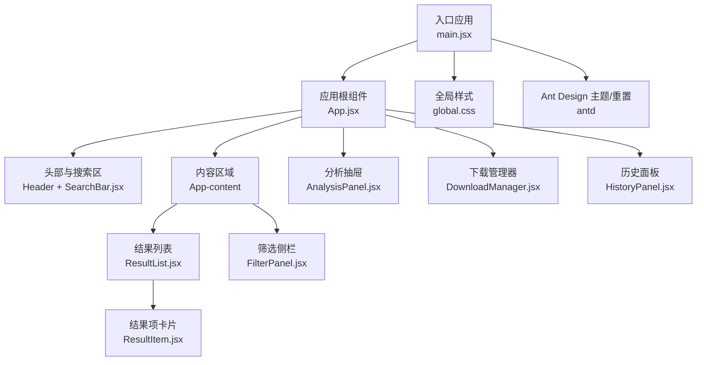
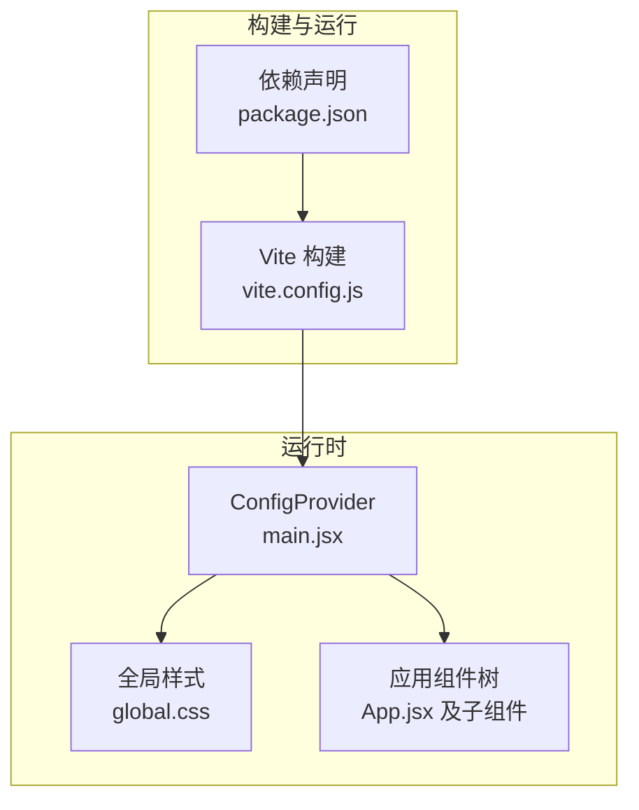
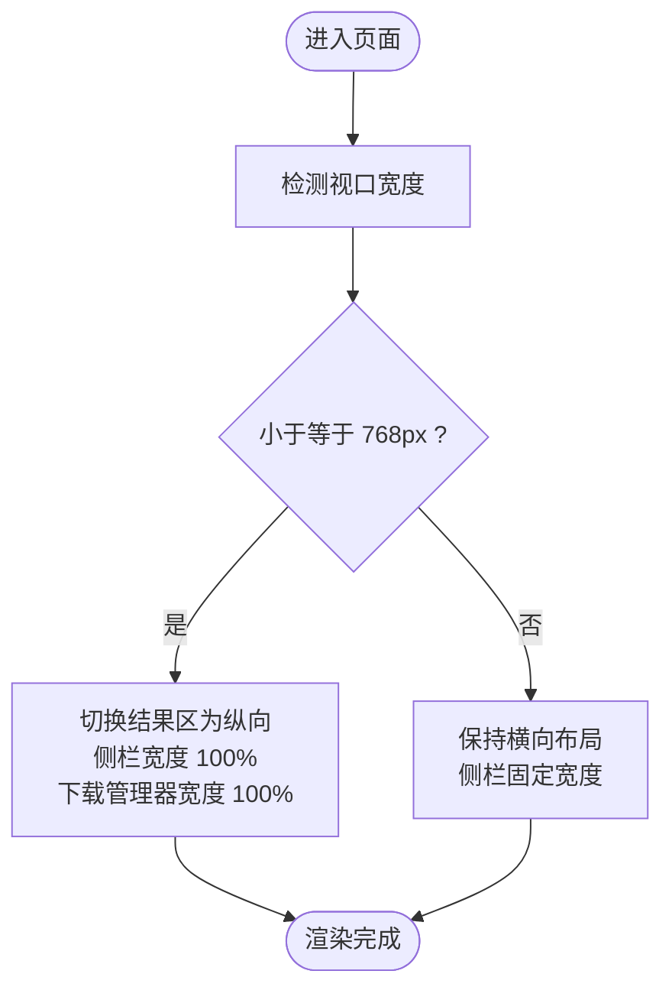
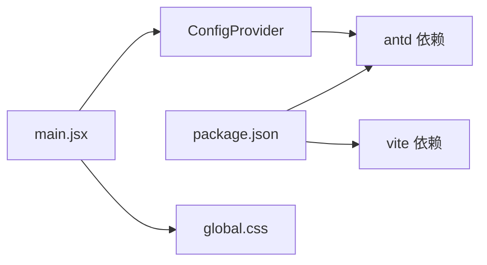

# 样式和主题设计

<cite>
**本文引用的文件**
- [frontend/src/styles/global.css](file://frontend/src/styles/global.css)
- [frontend/src/main.jsx](file://frontend/src/main.jsx)
- [frontend/src/App.jsx](file://frontend/src/App.jsx)
- [frontend/src/components/SearchBar.jsx](file://frontend/src/components/SearchBar.jsx)
- [frontend/src/components/ResultList.jsx](file://frontend/src/components/ResultList.jsx)
- [frontend/src/components/ResultItem.jsx](file://frontend/src/components/ResultItem.jsx)
- [frontend/src/components/FilterPanel.jsx](file://frontend/src/components/FilterPanel.jsx)
- [frontend/src/components/AnalysisPanel.jsx](file://frontend/src/components/AnalysisPanel.jsx)
- [frontend/src/components/DownloadManager.jsx](file://frontend/src/components/DownloadManager.jsx)
- [frontend/src/components/HistoryPanel.jsx](file://frontend/src/components/HistoryPanel.jsx)
- [frontend/package.json](file://frontend/package.json)
- [frontend/vite.config.js](file://frontend/vite.config.js)
</cite>

## 目录
1. [简介](#简介)
2. [项目结构](#项目结构)
3. [核心组件](#核心组件)
4. [架构总览](#架构总览)
5. [详细组件分析](#详细组件分析)
6. [依赖分析](#依赖分析)
7. [性能考虑](#性能考虑)
8. [故障排查指南](#故障排查指南)
9. [结论](#结论)
10. [附录](#附录)

## 简介
本设计文档聚焦于前端样式系统的架构与实现，围绕以下目标展开：CSS 模块化与全局样式组织、Ant Design 主题覆盖与组件样式定制、响应式设计实践、样式命名规范（含 BEM 方法论）、CSS-in-JS 方案现状与建议、样式性能优化、浏览器兼容性与可维护性策略，并补充暗色主题支持、动画效果与视觉设计规范。

## 项目结构
前端采用 Vite 构建，Ant Design v5 作为基础 UI 库，通过 ConfigProvider 提供本地化与基础主题能力；全局样式集中于单文件，配合若干业务组件类名进行布局与视觉控制。

图表来源
- [frontend/src/main.jsx](file://frontend/src/main.jsx#L1-L15)
- [frontend/src/App.jsx](file://frontend/src/App.jsx#L1-L149)
- [frontend/src/styles/global.css](file://frontend/src/styles/global.css#L1-L156)

章节来源
- [frontend/src/main.jsx](file://frontend/src/main.jsx#L1-L15)
- [frontend/src/App.jsx](file://frontend/src/App.jsx#L1-L149)
- [frontend/src/styles/global.css](file://frontend/src/styles/global.css#L1-L156)
- [frontend/package.json](file://frontend/package.json#L1-L24)
- [frontend/vite.config.js](file://frontend/vite.config.js#L1-L20)

## 核心组件
- 全局样式：统一重置、基础排版、容器与网格、组件级样式（如卡片悬停阴影、标题链接、元信息标签等），并包含移动端断点规则。
- Ant Design 集成：通过 ConfigProvider 设置语言包，保证组件文案与交互符合中文场景。
- 组件样式策略：以类名驱动，结合 Ant Design 组件的默认样式与局部内联样式，形成“类名 + 组件属性”的组合式定制。

章节来源
- [frontend/src/styles/global.css](file://frontend/src/styles/global.css#L1-L156)
- [frontend/src/main.jsx](file://frontend/src/main.jsx#L1-L15)
- [frontend/src/App.jsx](file://frontend/src/App.jsx#L1-L149)

## 架构总览
样式系统采用“全局样式 + 组件类名”的混合模式：
- 全局层：reset、排版、布局、响应式断点。
- 组件层：Ant Design 组件样式 + 业务类名 + 少量内联样式。
- 主题层：Ant Design ConfigProvider 提供基础主题与本地化；当前未引入自定义主题变量覆盖。

图表来源
- [frontend/vite.config.js](file://frontend/vite.config.js#L1-L20)
- [frontend/package.json](file://frontend/package.json#L1-L24)
- [frontend/src/main.jsx](file://frontend/src/main.jsx#L1-L15)
- [frontend/src/styles/global.css](file://frontend/src/styles/global.css#L1-L156)
- [frontend/src/App.jsx](file://frontend/src/App.jsx#L1-L149)

## 详细组件分析

### 全局样式与布局
- 重置与排版：统一 margin/padding、box-sizing，设置基础字体族、背景与文字颜色，确保最小高度。
- 容器与网格：页面主体最大宽度、居中与内边距；结果区域采用 Flex 布局，主区自适应、侧栏固定宽度。
- 卡片与交互：结果卡片圆角与阴影过渡；悬停增强；标题链接颜色与下划线行为；摘要文本截断与行高控制。
- 下载管理器：固定定位、渐变标题、折叠体、滚动区域与阴影。
- 响应式：在小屏设备上将结果区从横向改为纵向，侧栏宽度自适应，下载管理器宽度铺满。

章节来源
- [frontend/src/styles/global.css](file://frontend/src/styles/global.css#L1-L156)

### Ant Design 主题与本地化
- 本地化：通过 ConfigProvider 注入中文语言包，使组件文案与日历等组件符合中文用户习惯。
- 主题覆盖：当前未引入自定义主题变量覆盖，Ant Design 默认主题生效。

章节来源
- [frontend/src/main.jsx](file://frontend/src/main.jsx#L1-L15)
- [frontend/package.json](file://frontend/package.json#L11-L18)

### 头部与搜索区
- 头部容器使用渐变背景、阴影与 Flex 对齐，内部包含搜索框与历史按钮。
- 搜索框采用大尺寸、清除按钮与加载态，搜索源通过复选框组选择。
- 按钮与文本颜色在深色背景下保持高对比度。

章节来源
- [frontend/src/App.jsx](file://frontend/src/App.jsx#L75-L95)
- [frontend/src/components/SearchBar.jsx](file://frontend/src/components/SearchBar.jsx#L1-L42)
- [frontend/src/styles/global.css](file://frontend/src/styles/global.css#L19-L35)

### 结果列表与卡片
- 列表加载态与空状态处理；展示总数与当前数量；按来源状态展示成功/失败标记。
- 单个结果卡片包含标题、摘要、分类与来源标签、作者与发布时间、链接域名等元信息。
- 行为按钮包括 AI 分析、翻译与 PDF 下载（仅 arXiv）。

章节来源
- [frontend/src/components/ResultList.jsx](file://frontend/src/components/ResultList.jsx#L1-L58)
- [frontend/src/components/ResultItem.jsx](file://frontend/src/components/ResultItem.jsx#L1-L108)
- [frontend/src/styles/global.css](file://frontend/src/styles/global.css#L62-L115)

### 筛选侧栏
- 使用卡片容器承载筛选项，内容分类采用单选按钮组，右侧显示各分类计数。
- 小尺寸卡片与紧凑布局提升信息密度。

章节来源
- [frontend/src/components/FilterPanel.jsx](file://frontend/src/components/FilterPanel.jsx#L1-L52)

### 分析抽屉
- 抽屉右侧滑出，包含摘要、翻译、论文分析三类标签页。
- 根据内容类型启用/禁用功能按钮，渲染结构化段落与要点列表。

章节来源
- [frontend/src/components/AnalysisPanel.jsx](file://frontend/src/components/AnalysisPanel.jsx#L1-L171)

### 下载管理器
- 固定在底部右上角，支持折叠/展开；根据任务状态显示图标、颜色与进度条。
- 支持移除与完成后的下载链接。

章节来源
- [frontend/src/components/DownloadManager.jsx](file://frontend/src/components/DownloadManager.jsx#L1-L114)
- [frontend/src/styles/global.css](file://frontend/src/styles/global.css#L117-L142)

### 历史面板
- 左侧抽屉展示历史记录，支持清空与点击回放搜索。
- 列表项包含查询词、结果数量与时间戳。

章节来源
- [frontend/src/components/HistoryPanel.jsx](file://frontend/src/components/HistoryPanel.jsx#L1-L91)

### 响应式设计流程

图表来源
- [frontend/src/styles/global.css](file://frontend/src/styles/global.css#L144-L155)

## 依赖分析
- Ant Design 依赖：作为 UI 基础库，提供大量组件与默认样式。
- 构建工具：Vite 负责开发服务器、代理与打包输出目录。
- 运行时注入：ConfigProvider 在根节点注入语言包，影响所有子组件。

图表来源
- [frontend/package.json](file://frontend/package.json#L11-L22)
- [frontend/src/main.jsx](file://frontend/src/main.jsx#L1-L15)
- [frontend/src/styles/global.css](file://frontend/src/styles/global.css#L1-L156)

章节来源
- [frontend/package.json](file://frontend/package.json#L1-L24)
- [frontend/vite.config.js](file://frontend/vite.config.js#L1-L20)
- [frontend/src/main.jsx](file://frontend/src/main.jsx#L1-L15)

## 性能考虑
- 样式体积控制
  - 合理拆分全局样式与组件样式，避免重复定义。
  - 减少深层嵌套与复杂选择器，降低样式匹配成本。
- 动画与过渡
  - 控制过渡时长与缓动函数，避免在低端设备上造成掉帧。
  - 对高频动画（如滚动、悬停）进行节流或降级。
- 构建优化
  - 使用构建工具的 CSS 压缩与 Tree Shaking，剔除未使用样式。
  - 将第三方组件样式与业务样式分离，便于缓存与增量更新。
- 渲染性能
  - 避免在组件内频繁创建新的内联样式对象，尽量使用类名切换。
  - 对长列表使用虚拟化或分页，减少一次性渲染的 DOM 节点数量。

## 故障排查指南
- 样式不生效
  - 检查全局样式是否正确引入（入口文件中是否导入）。
  - 确认 Ant Design 的 reset 是否被覆盖或冲突。
- 组件样式异常
  - 检查组件内联样式与类名优先级关系。
  - 确认 ConfigProvider 的语言包与主题未导致样式错位。
- 响应式问题
  - 核对媒体查询断点与容器宽度计算逻辑。
  - 在小屏设备上验证 Flex 布局与固定定位元素的行为。

章节来源
- [frontend/src/main.jsx](file://frontend/src/main.jsx#L1-L15)
- [frontend/src/styles/global.css](file://frontend/src/styles/global.css#L144-L155)

## 结论
当前样式系统以 Ant Design 为基础，结合少量全局样式与组件类名实现布局与交互。建议后续引入主题变量覆盖、CSS-in-JS 方案（如 Emotion）以提升主题灵活性与样式隔离能力；同时完善命名规范（BEM）、暗色主题支持与动画规范，持续优化性能与可维护性。

## 附录

### 样式命名规范与 BEM 实践
- 命名原则
  - 语义化：类名表达意图而非表现（如 .result-card 而非 .card1）。
  - 层次清晰：父-子-修饰符结构，避免过深嵌套。
- BEM 示例
  - 块（Block）：.result-card
  - 元素（Element）：.result-card__title
  - 修饰符（Modifier）：.result-card--hover（可通过伪类或状态类实现）
- 与 Ant Design 的协作
  - 优先使用 Ant Design 组件提供的属性与类名，必要时通过局部样式覆盖。
  - 避免与组件默认样式产生冲突，必要时使用更具体的选择器或 !important（谨慎使用）。

章节来源
- [frontend/src/styles/global.css](file://frontend/src/styles/global.css#L62-L115)

### Ant Design 主题覆盖与组件定制
- 当前做法
  - 通过 ConfigProvider 注入语言包，保持组件文案与交互一致。
- 建议方案
  - 引入主题变量覆盖：在构建阶段注入 CSS 变量或使用 CSS-in-JS 的主题上下文。
  - 对关键组件（如 Layout、Card、Button）进行轻量定制，统一品牌色彩与间距。
  - 为暗色主题预留变量与切换逻辑，保证在夜间模式下的可读性与舒适度。

章节来源
- [frontend/src/main.jsx](file://frontend/src/main.jsx#L1-L15)
- [frontend/package.json](file://frontend/package.json#L11-L18)

### CSS-in-JS 方案建议
- 适用场景
  - 动态主题切换、组件级样式隔离、运行时样式计算。
- 推荐方案
  - 使用具备服务端渲染支持的方案（如 Emotion），在组件内以模板字符串或对象形式定义样式。
  - 将主题变量抽取为独立模块，便于跨组件共享与热替换。
- 注意事项
  - 避免在渲染路径中频繁创建新样式对象，使用 memo 化或缓存策略。
  - 与全局样式共存时，明确优先级与作用域边界。

章节来源
- [frontend/package.json](file://frontend/package.json#L11-L18)

### 动画与视觉设计规范
- 动画策略
  - 使用简洁的过渡（如 0.2s）增强交互反馈，避免过长动画影响效率。
  - 对抽屉、模态框等覆盖层使用淡入淡出与平滑位移。
- 视觉一致性
  - 统一字号、行高、字重与间距，确保在不同断点下的可读性。
  - 使用品牌色作为强调色，辅以中性色与灰阶，保证对比度与无障碍访问。

### 浏览器兼容性
- 建议
  - 使用 Autoprefixer 或构建工具内置兼容处理，确保关键属性带厂商前缀。
  - 对 Flexbox、媒体查询等现代特性进行降级处理或提供替代方案。
  - 在低端设备上简化动画与阴影，保障流畅体验。