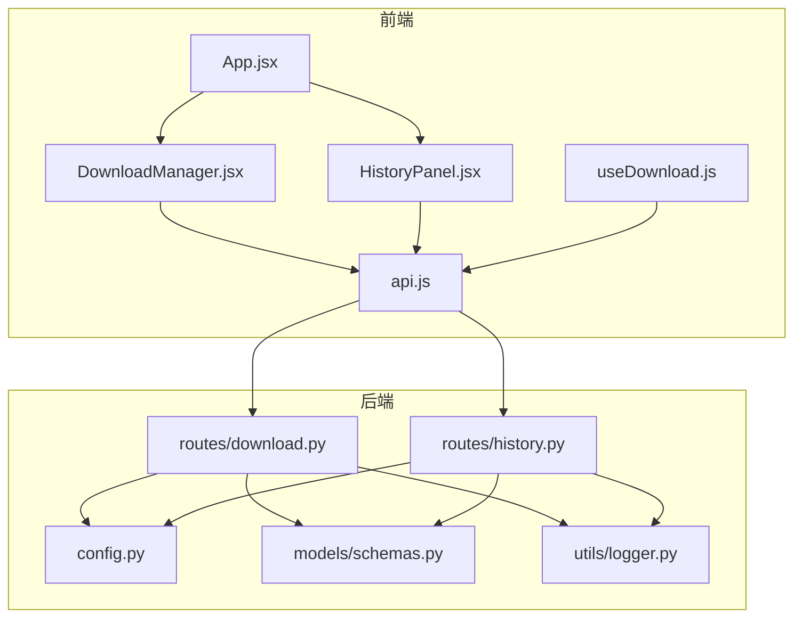
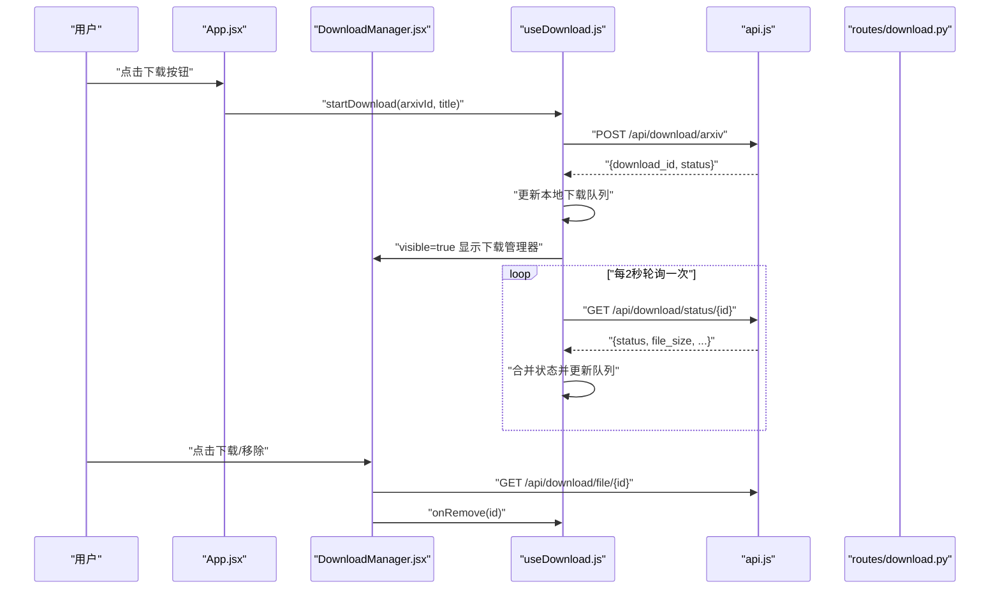
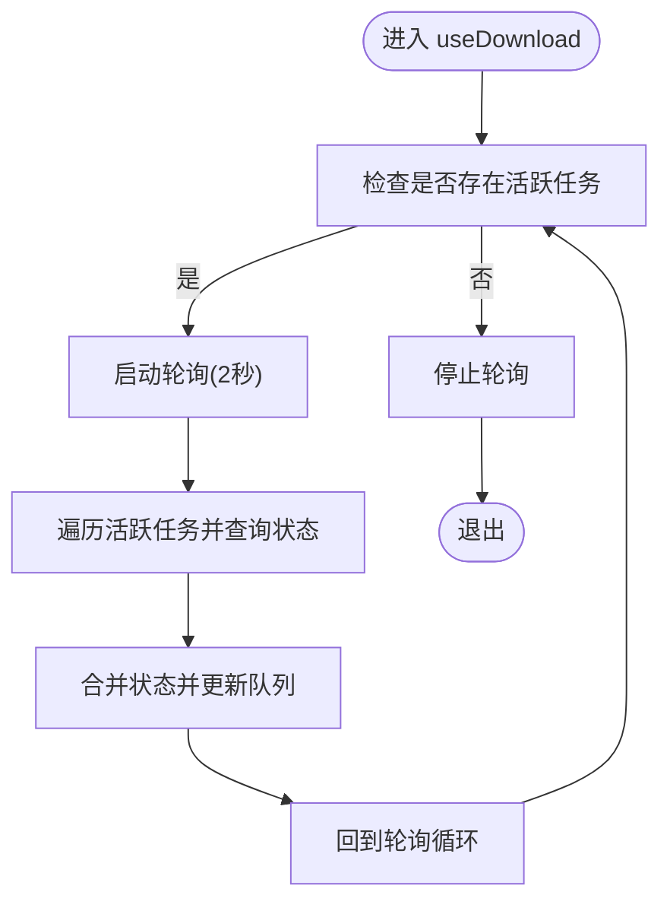
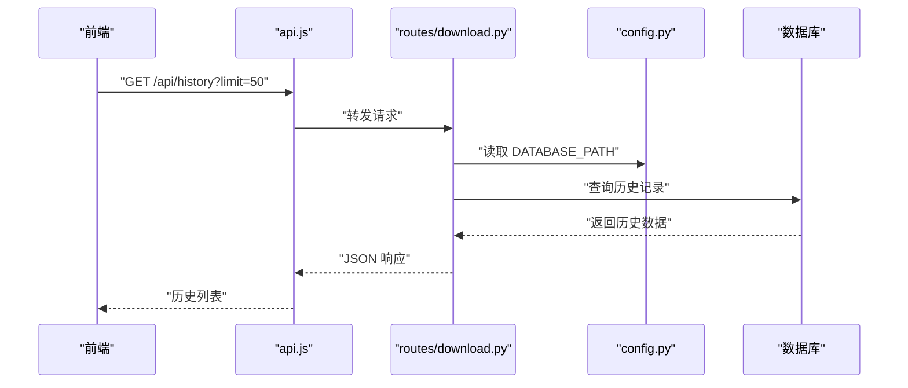
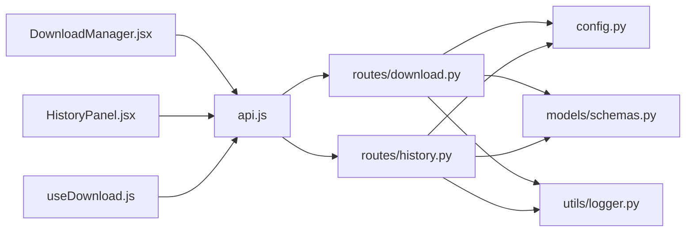

# 下载与历史组件

<cite>
**本文引用的文件**
- [frontend/src/components/DownloadManager.jsx](file://frontend/src/components/DownloadManager.jsx)
- [frontend/src/components/HistoryPanel.jsx](file://frontend/src/components/HistoryPanel.jsx)
- [frontend/src/hooks/useDownload.js](file://frontend/src/hooks/useDownload.js)
- [frontend/src/services/api.js](file://frontend/src/services/api.js)
- [frontend/src/App.jsx](file://frontend/src/App.jsx)
- [backend/routes/download.py](file://backend/routes/download.py)
- [backend/routes/history.py](file://backend/routes/history.py)
- [backend/models/schemas.py](file://backend/models/schemas.py)
- [backend/config.py](file://backend/config.py)
- [backend/utils/logger.py](file://backend/utils/logger.py)
- [.qoder/config.json](file://.qoder/config.json)
</cite>

## 目录
1. [简介](#简介)
2. [项目结构](#项目结构)
3. [核心组件](#核心组件)
4. [架构总览](#架构总览)
5. [组件详解](#组件详解)
6. [依赖关系分析](#依赖关系分析)
7. [性能考量](#性能考量)
8. [故障排查指南](#故障排查指南)
9. [结论](#结论)
10. [附录](#附录)

## 简介
本文件聚焦于前端“下载与历史”两大管理型组件：DownloadManager（下载管理器）与HistoryPanel（历史面板）。文档从架构、数据流、状态管理、错误处理与用户反馈、到与后端的同步机制与性能优化进行系统性阐述，并给出可操作的实践建议与排障指引。

## 项目结构
- 前端采用 React + Ant Design 组件库，通过自定义 Hook 管理下载状态与轮询，通过 API 服务封装统一的请求与错误提示。
- 后端使用 Flask 蓝图组织路由，分别提供下载与历史相关的接口；数据库模式在后端集中定义，确保前后端对表结构的一致理解。

图表来源
- [frontend/src/App.jsx](file://frontend/src/App.jsx#L1-L149)
- [frontend/src/components/DownloadManager.jsx](file://frontend/src/components/DownloadManager.jsx#L1-L114)
- [frontend/src/components/HistoryPanel.jsx](file://frontend/src/components/HistoryPanel.jsx#L1-L91)
- [frontend/src/hooks/useDownload.js](file://frontend/src/hooks/useDownload.js#L1-L78)
- [frontend/src/services/api.js](file://frontend/src/services/api.js#L1-L32)
- [backend/routes/download.py](file://backend/routes/download.py#L1-L98)
- [backend/routes/history.py](file://backend/routes/history.py#L1-L33)
- [backend/config.py](file://backend/config.py#L1-L85)
- [backend/models/schemas.py](file://backend/models/schemas.py#L1-L38)
- [backend/utils/logger.py](file://backend/utils/logger.py#L1-L23)

章节来源
- [frontend/src/App.jsx](file://frontend/src/App.jsx#L1-L149)
- [backend/routes/download.py](file://backend/routes/download.py#L1-L98)
- [backend/routes/history.py](file://backend/routes/history.py#L1-L33)

## 核心组件
- DownloadManager：负责展示下载队列、状态与进度，提供移除与触发下载文件下载的操作入口。
- HistoryPanel：负责展示搜索历史、支持清空历史与点击回放搜索。
- useDownload：封装下载启动、状态轮询、活跃任务检测与下载项移除等逻辑。
- api：封装 axios 实例与响应拦截器，统一对 429、5xx、400、超时等错误进行用户提示。

章节来源
- [frontend/src/components/DownloadManager.jsx](file://frontend/src/components/DownloadManager.jsx#L1-L114)
- [frontend/src/components/HistoryPanel.jsx](file://frontend/src/components/HistoryPanel.jsx#L1-L91)
- [frontend/src/hooks/useDownload.js](file://frontend/src/hooks/useDownload.js#L1-L78)
- [frontend/src/services/api.js](file://frontend/src/services/api.js#L1-L32)

## 架构总览
- 前端通过 API 服务调用后端接口，DownloadManager 与 HistoryPanel 分别消费下载与历史数据。
- 后端路由按模块划分：下载路由与历史路由，均通过配置中心读取数据库路径与下载目录，保证运行期一致性。
- 日志模块为各路由提供统一日志输出，便于问题定位。

图表来源
- [frontend/src/App.jsx](file://frontend/src/App.jsx#L52-L57)
- [frontend/src/hooks/useDownload.js](file://frontend/src/hooks/useDownload.js#L9-L48)
- [frontend/src/components/DownloadManager.jsx](file://frontend/src/components/DownloadManager.jsx#L47-L107)
- [frontend/src/services/api.js](file://frontend/src/services/api.js#L10-L29)
- [backend/routes/download.py](file://backend/routes/download.py#L14-L82)

## 组件详解

### DownloadManager 组件
- 展示职责
  - 列表渲染下载项，根据状态映射显示图标、颜色与文案。
  - 当存在“下载中/等待中”任务时，在标题处以徽标显示数量。
  - 对已完成的任务，提供直接下载文件的链接。
  - 支持移除下载项。
- 状态与进度
  - 使用状态映射表将后端返回的状态值转换为 UI 友好的展示。
  - 下载中时显示进度条占位。
- 用户交互
  - 支持展开/收起面板，点击列表项标题可触发下载或移除。
- 数据来源
  - 由父组件传入的 downloads 数组驱动渲染。
  - 通过 onRemove 回调与父组件通信以移除任务。

章节来源
- [frontend/src/components/DownloadManager.jsx](file://frontend/src/components/DownloadManager.jsx#L15-L114)

### HistoryPanel 组件
- 展示职责
  - 抽屉式面板展示搜索历史，支持清空全部历史。
  - 点击历史项可回放搜索并关闭抽屉。
- 数据加载与交互
  - 打开面板时拉取最近历史，默认限制条数。
  - 清空历史时调用删除接口并清空本地状态。
- 错误与空态
  - 加载中显示骨架，空历史时展示空状态占位。

章节来源
- [frontend/src/components/HistoryPanel.jsx](file://frontend/src/components/HistoryPanel.jsx#L1-L91)

### useDownload Hook（下载状态管理）
- 下载启动
  - 发送 POST 请求至后端创建下载任务，成功后将新任务插入队列顶部并显示下载管理器。
- 状态轮询
  - 仅对“等待中/下载中”的任务发起轮询，轮询间隔固定为 2 秒。
  - 每个活跃任务独立发起 GET 请求查询状态，合并后更新队列。
- 活跃任务检测
  - 通过定时器在有活跃任务时开启轮询，在无活跃任务时停止轮询，避免资源浪费。
- 下载项移除
  - 提供移除回调，从本地队列剔除对应任务。

图表来源
- [frontend/src/hooks/useDownload.js](file://frontend/src/hooks/useDownload.js#L26-L64)

章节来源
- [frontend/src/hooks/useDownload.js](file://frontend/src/hooks/useDownload.js#L1-L78)

### API 服务与错误处理
- 统一拦截器
  - 对 429 进行友好提示；对 5xx 返回错误信息；对 400 返回参数错误提示；对超时与网络异常进行提示。
- 基础配置
  - 基础 URL 指向 /api，统一超时时间与内容类型。

章节来源
- [frontend/src/services/api.js](file://frontend/src/services/api.js#L1-L32)

### 后端接口与同步机制
- 下载接口
  - 创建下载任务：POST /api/download/arxiv，返回 download_id 与初始状态。
  - 查询状态：GET /api/download/status/{id}，返回当前状态与文件大小等。
  - 下载文件：GET /api/download/file/{id}，仅在完成状态下允许下载。
  - 获取历史：GET /api/download/history，返回所有下载记录。
- 历史接口
  - 获取历史：GET /api/history?limit=N，限制范围 1~100。
  - 清空历史：DELETE /api/history。
- 配置与持久化
  - 配置中心提供数据库路径与下载目录，确保前后端一致。
  - 数据库模式定义了搜索历史、缓存与下载记录表结构，用于历史与下载记录的持久化。

图表来源
- [frontend/src/components/HistoryPanel.jsx](file://frontend/src/components/HistoryPanel.jsx#L12-L22)
- [backend/routes/history.py](file://backend/routes/history.py#L10-L21)
- [backend/config.py](file://backend/config.py#L36-L37)
- [backend/models/schemas.py](file://backend/models/schemas.py#L2-L8)

章节来源
- [backend/routes/download.py](file://backend/routes/download.py#L14-L97)
- [backend/routes/history.py](file://backend/routes/history.py#L10-L32)
- [backend/config.py](file://backend/config.py#L36-L48)
- [backend/models/schemas.py](file://backend/models/schemas.py#L28-L36)

## 依赖关系分析
- 组件耦合
  - DownloadManager 与 HistoryPanel 通过父组件 App 进行状态传递与事件回调，保持低耦合。
  - useDownload 作为下载域的唯一状态源，避免多处重复轮询逻辑。
- 外部依赖
  - 前端依赖 axios 与 Ant Design；后端依赖 Flask、环境变量与 .qoder 配置。
- 数据一致性
  - 前端通过轮询与后端状态保持同步；后端通过配置中心与数据库模式确保一致性。

图表来源
- [frontend/src/components/DownloadManager.jsx](file://frontend/src/components/DownloadManager.jsx#L1-L114)
- [frontend/src/components/HistoryPanel.jsx](file://frontend/src/components/HistoryPanel.jsx#L1-L91)
- [frontend/src/hooks/useDownload.js](file://frontend/src/hooks/useDownload.js#L1-L78)
- [frontend/src/services/api.js](file://frontend/src/services/api.js#L1-L32)
- [backend/routes/download.py](file://backend/routes/download.py#L1-L98)
- [backend/routes/history.py](file://backend/routes/history.py#L1-L33)
- [backend/config.py](file://backend/config.py#L1-L85)
- [backend/models/schemas.py](file://backend/models/schemas.py#L1-L38)
- [backend/utils/logger.py](file://backend/utils/logger.py#L1-L23)

章节来源
- [frontend/src/App.jsx](file://frontend/src/App.jsx#L134-L145)
- [frontend/src/hooks/useDownload.js](file://frontend/src/hooks/useDownload.js#L1-L78)

## 性能考量
- 轮询频率与活跃任务检测
  - 固定 2 秒轮询，仅在存在活跃任务时启动定时器，避免无效请求与资源消耗。
- 并发控制
  - 后端配置提供最大并发下载数，前端可在 UI 上进行提示与限制，避免过多任务堆积导致资源紧张。
- 缓存与索引
  - 历史与分析结果具备缓存与索引，减少重复计算与查询成本。
- 文件下载
  - 仅在完成状态下允许下载，避免无效 IO；文件路径存在性校验降低错误率。

章节来源
- [frontend/src/hooks/useDownload.js](file://frontend/src/hooks/useDownload.js#L51-L64)
- [backend/config.py](file://backend/config.py#L62-L65)
- [backend/models/schemas.py](file://backend/models/schemas.py#L10-L26)

## 故障排查指南
- 下载任务无法开始
  - 检查请求参数是否包含 arxiv_id；确认后端日志是否有异常。
- 状态不更新
  - 确认是否存在活跃任务；检查轮询是否被正确启动与停止；查看网络拦截器是否报错。
- 文件下载失败
  - 确认任务状态为完成；检查文件路径是否存在；查看后端日志定位具体原因。
- 历史为空或未刷新
  - 确认抽屉打开时已触发拉取；检查 limit 参数范围；查看后端历史接口日志。
- 错误提示
  - 429：请求过于频繁，稍后再试；5xx：服务器内部错误；400：参数错误；超时或网络异常：请重试。

章节来源
- [frontend/src/services/api.js](file://frontend/src/services/api.js#L10-L29)
- [backend/routes/download.py](file://backend/routes/download.py#L38-L56)
- [backend/routes/history.py](file://backend/routes/history.py#L19-L31)
- [backend/utils/logger.py](file://backend/utils/logger.py#L5-L22)

## 结论
DownloadManager 与 HistoryPanel 通过清晰的职责划分与统一的 API 封装，实现了下载队列管理、状态轮询与历史记录展示的完整闭环。结合后端配置中心与数据库模式，系统在可维护性、可扩展性与用户体验方面达到良好平衡。建议在生产环境中进一步引入节流、指数退避与更细粒度的错误恢复策略，以提升稳定性与性能。

## 附录

### API 接口清单
- 下载
  - POST /api/download/arxiv：创建下载任务，返回 download_id 与初始状态。
  - GET /api/download/status/{id}：查询任务状态。
  - GET /api/download/file/{id}：下载完成的 PDF 文件。
  - GET /api/download/history：获取所有下载记录。
- 历史
  - GET /api/history?limit=N：获取搜索历史，N 范围 1~100。
  - DELETE /api/history：清空搜索历史。

章节来源
- [backend/routes/download.py](file://backend/routes/download.py#L14-L97)
- [backend/routes/history.py](file://backend/routes/history.py#L10-L32)

### 数据模型概览
- 搜索历史表：包含查询文本、过滤条件、结果数量与时间戳。
- 搜索缓存表：按查询哈希存储结果与过期时间，带索引加速。
- 分析缓存表：按内容哈希与分析类型存储结果，带过期清理。
- 下载记录表：包含标题、URL、PDF 路径、状态、文件大小与时间戳。

章节来源
- [backend/models/schemas.py](file://backend/models/schemas.py#L2-L36)

### 配置要点
- 数据库路径与下载目录：由配置中心统一提供，确保前后端一致。
- 下载设置：最大并发数、镜像地址等。
- 搜索默认参数与缓存过期时间等。

章节来源
- [backend/config.py](file://backend/config.py#L36-L77)
- [.qoder/config.json](file://.qoder/config.json#L14-L21)