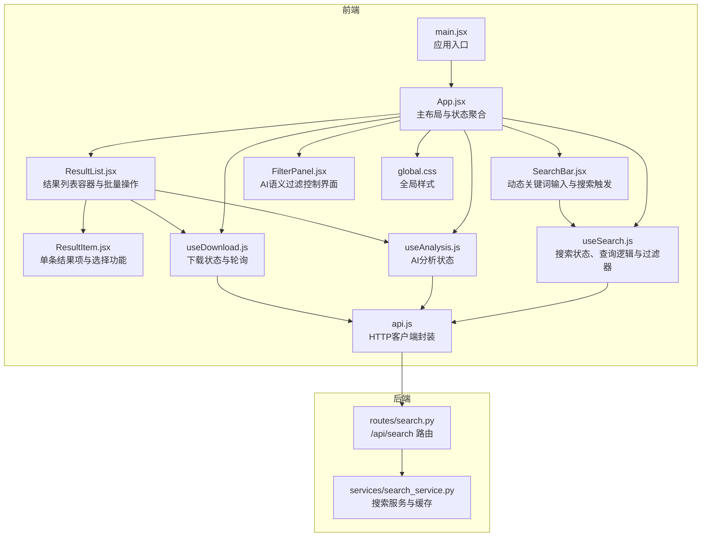
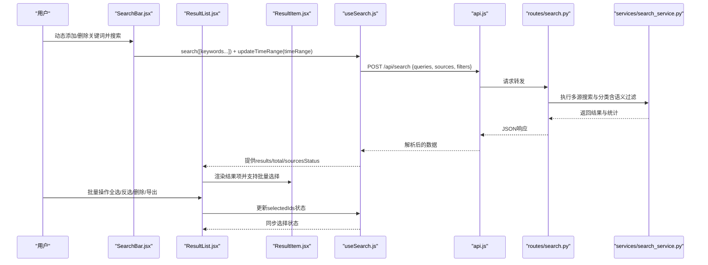
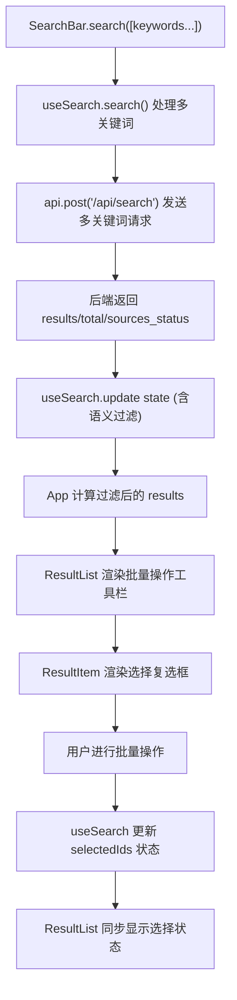
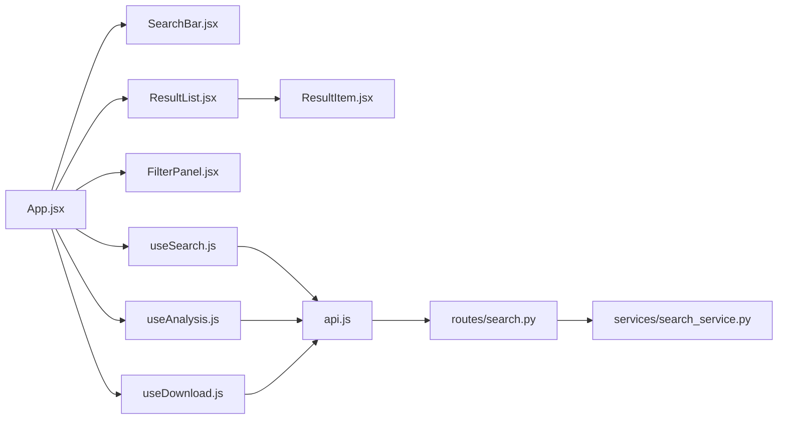

# 搜索相关组件

<cite>
**本文档引用的文件**
- [frontend/src/components/SearchBar.jsx](file://frontend/src/components/SearchBar.jsx)
- [frontend/src/components/ResultList.jsx](file://frontend/src/components/ResultList.jsx)
- [frontend/src/components/ResultItem.jsx](file://frontend/src/components/ResultItem.jsx)
- [frontend/src/components/FilterPanel.jsx](file://frontend/src/components/FilterPanel.jsx)
- [frontend/src/hooks/useSearch.js](file://frontend/src/hooks/useSearch.js)
- [frontend/src/hooks/useAnalysis.js](file://frontend/src/hooks/useAnalysis.js)
- [frontend/src/hooks/useDownload.js](file://frontend/src/hooks/useDownload.js)
- [frontend/src/services/api.js](file://frontend/src/services/api.js)
- [frontend/src/App.jsx](file://frontend/src/App.jsx)
- [frontend/src/main.jsx](file://frontend/src/main.jsx)
- [frontend/src/styles/global.css](file://frontend/src/styles/global.css)
- [backend/routes/search.py](file://backend/routes/search.py)
- [backend/services/search_service.py](file://backend/services/search_service.py)
- [README.md](file://README.md)
</cite>

## 更新摘要
**变更内容**
- 更新SearchBar组件文档以反映动态关键词输入管理功能
- 新增批量操作工具栏的详细说明，包括全选、反选、删除选中项和导出功能
- 新增AI语义过滤控制界面的完整文档，包括开关控制和相关性阈值调节
- 更新架构图以展示新的批量操作和语义过滤数据流

## 目录
1. [简介](#简介)
2. [项目结构](#项目结构)
3. [核心组件](#核心组件)
4. [架构总览](#架构总览)
5. [详细组件分析](#详细组件分析)
6. [依赖关系分析](#依赖关系分析)
7. [性能考虑](#性能考虑)
8. [故障排查指南](#故障排查指南)
9. [结论](#结论)
10. [附录](#附录)

## 简介
本文件聚焦于前端搜索相关组件的详细设计与实现，涵盖 SearchBar、ResultList、ResultItem 和 FilterPanel 四大核心组件。文档从组件职责、props 接口、事件处理、状态管理到样式设计进行系统化梳理，并结合 useSearch、useAnalysis、useDownload 等 Hook 的协作模式，解释数据流与交互流程。同时提供使用示例与最佳实践，帮助开发者快速理解与扩展搜索功能。

**更新** 新增动态关键词输入管理、批量操作工具栏和AI语义过滤控制界面，显著提升了搜索体验和效率。

## 项目结构
前端采用 React + Ant Design 架构，组件位于 frontend/src/components，状态逻辑通过自定义 Hook 管理，API 调用封装在 api.js 中。后端提供多源搜索服务，路由与业务服务分别位于 backend/routes 与 backend/services。

**图表来源**
- [frontend/src/main.jsx](file://frontend/src/main.jsx#L1-L15)
- [frontend/src/App.jsx](file://frontend/src/App.jsx#L1-L151)
- [frontend/src/components/SearchBar.jsx](file://frontend/src/components/SearchBar.jsx#L1-L133)
- [frontend/src/components/ResultList.jsx](file://frontend/src/components/ResultList.jsx#L1-L205)
- [frontend/src/components/ResultItem.jsx](file://frontend/src/components/ResultItem.jsx#L1-L118)
- [frontend/src/components/FilterPanel.jsx](file://frontend/src/components/FilterPanel.jsx#L1-L108)
- [frontend/src/hooks/useSearch.js](file://frontend/src/hooks/useSearch.js#L1-L156)
- [frontend/src/hooks/useAnalysis.js](file://frontend/src/hooks/useAnalysis.js#L1-L85)
- [frontend/src/hooks/useDownload.js](file://frontend/src/hooks/useDownload.js#L1-L78)
- [frontend/src/services/api.js](file://frontend/src/services/api.js#L1-L32)
- [frontend/src/styles/global.css](file://frontend/src/styles/global.css#L1-L156)
- [backend/routes/search.py](file://backend/routes/search.py#L1-L28)
- [backend/services/search_service.py](file://backend/services/search_service.py#L1-L98)

**章节来源**
- [frontend/src/main.jsx](file://frontend/src/main.jsx#L1-L15)
- [frontend/src/App.jsx](file://frontend/src/App.jsx#L1-L151)
- [frontend/src/styles/global.css](file://frontend/src/styles/global.css#L1-L156)

## 核心组件
本节概述四大核心组件的职责与协作方式：
- SearchBar：负责动态关键词输入管理、数据源选择和时间范围筛选，支持最多5个关键词的灵活输入。
- ResultList：作为结果容器，展示总数、各源状态与批量操作工具栏，支持全选、反选、删除选中项和导出功能。
- ResultItem：渲染单条结果项，提供分析、翻译与下载等交互，支持结果选择功能。
- FilterPanel：提供AI语义过滤控制界面，包括语义过滤开关和相关性阈值调节。

**更新** 新增批量操作工具栏和AI语义过滤控制界面，显著提升搜索结果的管理和筛选能力。

**章节来源**
- [frontend/src/components/SearchBar.jsx](file://frontend/src/components/SearchBar.jsx#L1-L133)
- [frontend/src/components/ResultList.jsx](file://frontend/src/components/ResultList.jsx#L1-L205)
- [frontend/src/components/ResultItem.jsx](file://frontend/src/components/ResultItem.jsx#L1-L118)
- [frontend/src/components/FilterPanel.jsx](file://frontend/src/components/FilterPanel.jsx#L1-L108)

## 架构总览
下图展示了从前端组件到后端服务的数据流与交互顺序，包括新增的批量操作和语义过滤功能。

**图表来源**
- [frontend/src/components/SearchBar.jsx](file://frontend/src/components/SearchBar.jsx#L22-L49)
- [frontend/src/components/ResultList.jsx](file://frontend/src/components/ResultList.jsx#L15-L29)
- [frontend/src/hooks/useSearch.js](file://frontend/src/hooks/useSearch.js#L23-L67)
- [frontend/src/services/api.js](file://frontend/src/services/api.js#L35-L43)
- [backend/routes/search.py](file://backend/routes/search.py#L10-L27)
- [backend/services/search_service.py](file://backend/services/search_service.py#L28-L67)

## 详细组件分析

### SearchBar 组件
- 职责
  - 提供动态关键词输入管理，支持最多5个关键词的添加、删除和编辑。
  - 提供输入框与"搜索"按钮，支持回车触发搜索。
  - 提供数据源复选框组，允许用户选择 DuckDuckGo、arXiv、Google Scholar、知乎等。
  - 提供时间范围单选按钮组，支持不限、近一周、近一月、近一年、近三年五种筛选选项。
  - 将用户输入、数据源变更和时间范围变更回调给父组件，由父组件统一调度查询。
- Props 接口
  - onSearch: (queries: string[]) => void
  - sources: string[]（当前选中的数据源集合）
  - onSourcesChange: (sources: string[]) => void
  - loading: boolean（用于 Input.Search 的 loading 状态）
  - timeRange: string | null（当前选中的时间范围）
  - onTimeRangeChange: (timeRange: string | null) => void（时间范围变更回调）
- 事件处理
  - handleKeywordChange：动态更新指定索引的关键词值。
  - addKeywordInput：当关键词数量小于5时添加新的输入框。
  - removeKeywordInput：当关键词数量大于1时移除指定索引的输入框。
  - handleSearch：收集所有有效关键词（去除空白字符）并调用 onSearch。
  - handleKeyPress：监听回车键触发搜索。
- 状态管理
  - 使用 useState 管理关键词数组，支持动态增删。
  - 该组件为纯展示型，不维护内部状态，所有状态由父组件 useSearch 管理。
- 样式设计
  - 使用 Ant Design 的 Input、Checkbox.Group、Radio.Group 与 Space，配合全局样式实现统一视觉风格。
  - 集成 PlusOutlined、MinusOutlined、SearchOutlined、ClockCircleOutlined 等图标。

**更新** 完全重构为动态关键词输入管理，支持最多5个关键词的灵活配置。

**章节来源**
- [frontend/src/components/SearchBar.jsx](file://frontend/src/components/SearchBar.jsx#L1-L133)

### ResultList 组件
- 职责
  - 展示搜索结果的容器，包括加载态、空态与结果计数。
  - 显示各数据源的执行状态（成功/失败）。
  - 提供批量操作工具栏，支持全选、取消全选、反选、删除选中项和导出功能。
  - 将每条结果交给 ResultItem 进行渲染。
- Props 接口
  - results: Array（当前结果数组）
  - total: number（总结果数）
  - loading: boolean（是否处于加载中）
  - sourcesStatus: Record<string, string>（各源状态）
  - onAnalyze: (item) => void（打开分析面板）
  - onDownload: (arxivId, title) => void（发起下载）
  - selectedIds: Set（当前选中的结果ID集合）
  - onToggleSelect: (id) => void（切换选择状态）
  - onSelectAll: () => void（全选）
  - onDeselectAll: () => void（取消全选）
  - onInvertSelection: () => void（反选）
  - onRemoveSelected: () => void（删除选中项）
  - getSelectedResults: () => Array（获取选中结果）
- 渲染逻辑
  - loading 时显示大号加载指示器。
  - 无结果时显示"暂无搜索结果"的空态。
  - 否则展示总数与当前显示数量，并遍历结果渲染 ResultItem。
- 批量操作工具栏
  - 显示已选择项目数量。
  - 提供全选、取消全选、反选、删除选中项、导出选中结果按钮。
  - 导出功能支持批量翻译和CSV文件生成。
- 交互
  - 通过 onAnalyze/onDownload 将用户操作传递给上层处理。
  - 通过批量操作回调更新选择状态和结果列表。

**更新** 新增完整的批量操作工具栏，包括全选、反选、删除选中项和导出功能。

**章节来源**
- [frontend/src/components/ResultList.jsx](file://frontend/src/components/ResultList.jsx#L1-L205)

### ResultItem 组件
- 职责
  - 渲染单条搜索结果，包含标题、摘要、元信息与操作按钮。
  - 针对 arXiv 结果提供 PDF 下载能力。
  - 支持结果选择功能，用于批量操作。
- Props 接口
  - item: 包含 url、title、snippet、category、source、authors、published、extra 等字段的对象
  - onAnalyze: (item) => void
  - onDownload: (arxivId, title) => void
  - selected: boolean（是否被选中）
  - onToggleSelect: (id) => void（切换选择状态）
- 渲染细节
  - 标题：外链跳转至原文，支持新窗口打开。
  - 摘要：默认"暂无摘要"，支持多行省略显示。
  - 元信息：类别标签、来源标签、作者、发布时间、域名等。
  - 操作：AI分析、翻译、arXiv PDF 下载（仅 arXiv 且存在 arxiv_id 时显示）。
  - 选择：左侧复选框支持单个结果选择。
- 交互
  - 分析与翻译均调用 onAnalyze，具体分析类型由上层 useAnalysis 控制。
  - arXiv 下载调用 onDownload，传入 arxivId 与标题。
  - 选择状态通过 onToggleSelect 与上层同步。

**章节来源**
- [frontend/src/components/ResultItem.jsx](file://frontend/src/components/ResultItem.jsx#L1-L118)

### FilterPanel 组件
- 职责
  - 提供AI语义过滤控制界面，增强搜索结果的相关性。
  - 支持内容分类筛选和相关性阈值调节。
- Props 接口
  - filters: Object（当前过滤器状态）
  - onCategoryChange: (category) => void（内容分类变更）
  - onSemanticFilterChange: (enabled) => void（语义过滤开关）
  - onRelevanceThresholdChange: (threshold) => void（相关性阈值变更）
  - resultCounts: Record<string, number>（各类别结果数量）
- 渲染逻辑
  - 内容分类：提供全部、学术论文、问答内容、博客文章、论坛帖子、网页六种分类。
  - AI语义过滤：提供开关控制和相关性阈值滑块。
  - 相关性阈值：0-100分范围，步进5分，带提示说明。
- 交互
  - 语义过滤开关：启用后显示相关性阈值调节。
  - 分类筛选：根据用户选择更新内容分类过滤器。
  - 阈值调节：实时更新相关性阈值，影响结果过滤严格程度。

**更新** 新增AI语义过滤控制界面，提供智能结果筛选功能。

**章节来源**
- [frontend/src/components/FilterPanel.jsx](file://frontend/src/components/FilterPanel.jsx#L1-L108)

### 状态与数据流（Hook 与组件协作）
- useSearch
  - 管理搜索结果、总数、各源状态、加载状态、错误信息与查询词。
  - **更新** 支持多关键词搜索，search 方法接受字符串数组或单个字符串。
  - **更新** 提供完整的批量操作功能：toggleSelect、selectAll、deselectAll、invertSelection、removeSelected、getSelectedResults。
  - **更新** 提供语义过滤控制：updateSemanticFilter、updateRelevanceThreshold。
  - **更新** filters 对象包含 semantic_filter 和 relevance_threshold 字段，默认启用语义过滤，相关性阈值40分。
  - **更新** 为每个结果添加唯一ID _id，用于选择状态跟踪。
- useAnalysis
  - 管理分析面板可见性、选中项、活动标签页与分析结果。
  - 提供 summarize、translate、analyzePaper 等分析方法。
- useDownload
  - 管理下载队列、可见性与轮询刷新。
  - 通过定时器每 2 秒轮询一次下载状态，自动更新进度与状态。

**图表来源**
- [frontend/src/components/SearchBar.jsx](file://frontend/src/components/SearchBar.jsx#L23-L49)
- [frontend/src/hooks/useSearch.js](file://frontend/src/hooks/useSearch.js#L23-L67)
- [frontend/src/services/api.js](file://frontend/src/services/api.js#L35-L43)
- [backend/routes/search.py](file://backend/routes/search.py#L10-L27)
- [backend/services/search_service.py](file://backend/services/search_service.py#L28-L67)
- [frontend/src/App.jsx](file://frontend/src/App.jsx#L19-L38)
- [frontend/src/components/ResultList.jsx](file://frontend/src/components/ResultList.jsx#L15-L29)
- [frontend/src/components/ResultItem.jsx](file://frontend/src/components/ResultItem.jsx#L37-L48)

**更新** 新增多关键词搜索、批量操作和语义过滤的完整数据流。

**章节来源**
- [frontend/src/hooks/useSearch.js](file://frontend/src/hooks/useSearch.js#L1-L156)
- [frontend/src/hooks/useAnalysis.js](file://frontend/src/hooks/useAnalysis.js#L1-L85)
- [frontend/src/hooks/useDownload.js](file://frontend/src/hooks/useDownload.js#L1-L78)
- [frontend/src/App.jsx](file://frontend/src/App.jsx#L1-L151)

## 依赖关系分析
- 组件间依赖
  - App.jsx 聚合 useSearch、useAnalysis、useDownload，向下传递 props。
  - SearchBar 依赖 useSearch 的 search、filters 和 updateTimeRange。
  - ResultList 依赖 useSearch 的 results、total、sourcesStatus、selectedIds 和批量操作回调。
  - ResultItem 依赖 ResultList 的 onAnalyze、onDownload 和 onToggleSelect。
  - FilterPanel 依赖 useSearch 的 filters 和更新回调。
- 外部依赖
  - api.js 封装 axios，统一拦截错误与提示。
  - 后端 routes/search.py 与 services/search_service.py 提供多源搜索、分类与缓存。

**图表来源**
- [frontend/src/App.jsx](file://frontend/src/App.jsx#L1-L151)
- [frontend/src/components/SearchBar.jsx](file://frontend/src/components/SearchBar.jsx#L1-L133)
- [frontend/src/components/ResultList.jsx](file://frontend/src/components/ResultList.jsx#L1-L205)
- [frontend/src/components/ResultItem.jsx](file://frontend/src/components/ResultItem.jsx#L1-L118)
- [frontend/src/components/FilterPanel.jsx](file://frontend/src/components/FilterPanel.jsx#L1-L108)
- [frontend/src/hooks/useSearch.js](file://frontend/src/hooks/useSearch.js#L1-L156)
- [frontend/src/hooks/useAnalysis.js](file://frontend/src/hooks/useAnalysis.js#L1-L85)
- [frontend/src/hooks/useDownload.js](file://frontend/src/hooks/useDownload.js#L1-L78)
- [frontend/src/services/api.js](file://frontend/src/services/api.js#L1-L32)
- [backend/routes/search.py](file://backend/routes/search.py#L1-L28)
- [backend/services/search_service.py](file://backend/services/search_service.py#L1-L98)

**章节来源**
- [frontend/src/App.jsx](file://frontend/src/App.jsx#L1-L151)
- [frontend/src/services/api.js](file://frontend/src/services/api.js#L1-L32)
- [backend/routes/search.py](file://backend/routes/search.py#L1-L28)
- [backend/services/search_service.py](file://backend/services/search_service.py#L1-L98)

## 性能考虑
- 列表渲染
  - 当前使用 Ant Design List 默认渲染策略，适合中小规模结果集。若结果量较大，建议引入虚拟滚动或分页加载，减少 DOM 节点数量与重排开销。
- 缓存与去抖
  - 后端已实现搜索结果缓存与历史记录保存，前端可结合本地缓存进一步降低重复请求。
- 轮询策略
  - 下载轮询间隔为 2 秒，可根据实际场景调整频率，避免过度轮询导致资源浪费。
- 图片与长文本
  - 摘要采用多行省略显示，避免长文本造成渲染压力；链接域名显示使用 Tooltip，避免过长文本影响布局。
- **新增** 批量操作性能
  - 选择状态使用 Set 数据结构，支持 O(1) 的查找和操作，适合大量结果的批量处理。
  - 导出功能采用渐进式处理，显示进度条，避免长时间阻塞界面。
- **新增** 语义过滤性能
  - AI语义过滤在后端执行，前端仅控制开关和阈值，不影响前端渲染性能。

## 故障排查指南
- 搜索无结果
  - 检查查询词是否为空，确认 onSearch 是否被正确调用。
  - 查看 useSearch 的 loading 与 error 状态，确认后端返回是否包含 total 与 results。
  - **新增** 检查关键词数组是否包含有效内容，确保至少有一个非空关键词。
- 数据源状态异常
  - 检查 sourcesStatus 的键值映射，确保每个源的状态为 success 或 failure。
- 批量操作异常
  - **新增** 检查 selectedIds 是否正确更新，确认每个结果都有唯一的 _id。
  - **新增** 检查批量操作回调是否正确传递到 ResultList。
- 导出功能问题
  - **新增** 检查选中结果数量，确保至少选择一个结果。
  - **新增** 检查翻译API调用，确认非中文内容能够正确翻译。
- 语义过滤问题
  - **新增** 检查 semantic_filter 开关状态，确认相关性阈值在合理范围内（0-100）。
  - **新增** 检查后端语义过滤服务是否正常工作。
- 下载失败
  - 确认 arxivId 与标题是否正确传入，检查下载轮询是否正常运行。
- 网络错误
  - api.js 已拦截常见错误并弹出消息，如 429、5xx、400、超时等，根据提示调整请求频率或参数。
- 后端异常
  - 后端路由返回 400 时需检查请求体格式，返回 500 时查看日志定位问题。

**章节来源**
- [frontend/src/hooks/useSearch.js](file://frontend/src/hooks/useSearch.js#L60-L67)
- [frontend/src/hooks/useDownload.js](file://frontend/src/hooks/useDownload.js#L26-L48)
- [frontend/src/services/api.js](file://frontend/src/services/api.js#L10-L29)
- [backend/routes/search.py](file://backend/routes/search.py#L15-L17)

## 结论
SearchBar、ResultList、ResultItem 和 FilterPanel 四个组件形成完整的搜索生态系统：动态关键词输入与筛选由 SearchBar 负责，批量操作与结果管理由 ResultList 管理，单条结果的渲染与操作由 ResultItem 承担，AI语义过滤控制由 FilterPanel 提供。配合 useSearch、useAnalysis、useDownload 的状态管理，实现了从多关键词搜索到批量操作与智能过滤的完整闭环。

**更新** 新增的动态关键词管理、批量操作工具栏和AI语义过滤控制界面显著提升了搜索体验和效率，使用户能够更精确地控制搜索结果并进行高效的结果管理。

后续可在大规模结果场景引入虚拟滚动与分页，进一步提升性能与用户体验。

## 附录

### 组件 Props 一览
- SearchBar
  - onSearch: (queries: string[]) => void
  - sources: string[]
  - onSourcesChange: (sources: string[]) => void
  - loading: boolean
  - timeRange: string | null
  - onTimeRangeChange: (timeRange: string | null) => void
- ResultList
  - results: Array
  - total: number
  - loading: boolean
  - sourcesStatus: Record<string, string>
  - onAnalyze: (item) => void
  - onDownload: (arxivId, title) => void
  - selectedIds: Set
  - onToggleSelect: (id) => void
  - onSelectAll: () => void
  - onDeselectAll: () => void
  - onInvertSelection: () => void
  - onRemoveSelected: () => void
  - getSelectedResults: () => Array
- ResultItem
  - item: 对象（包含 url、title、snippet、category、source、authors、published、extra、_id 等）
  - onAnalyze: (item) => void
  - onDownload: (arxivId, title) => void
  - selected: boolean
  - onToggleSelect: (id) => void
- FilterPanel
  - filters: Object（包含 category、semantic_filter、relevance_threshold）
  - onCategoryChange: (category) => void
  - onSemanticFilterChange: (enabled) => void
  - onRelevanceThresholdChange: (threshold) => void
  - resultCounts: Record<string, number>

**章节来源**
- [frontend/src/components/SearchBar.jsx](file://frontend/src/components/SearchBar.jsx#L22-L28)
- [frontend/src/components/ResultList.jsx](file://frontend/src/components/ResultList.jsx#L15-L29)
- [frontend/src/components/ResultItem.jsx](file://frontend/src/components/ResultItem.jsx#L37-L48)
- [frontend/src/components/FilterPanel.jsx](file://frontend/src/components/FilterPanel.jsx#L24-L30)

### 使用示例与最佳实践
- 在 App.jsx 中组合使用
  - 将 useSearch 的 search、filters 与 loading 传递给 SearchBar。
  - **更新** 将 filters.time_range 与 updateTimeRange 传递给 SearchBar。
  - 将 filteredResults、total、sourcesStatus 与批量操作回调传递给 ResultList。
  - **更新** 将 selectedIds、onToggleSelect、onSelectAll、onDeselectAll、onInvertSelection、onRemoveSelected、getSelectedResults 传递给 ResultList。
  - **更新** 将 filters、onCategoryChange、onSemanticFilterChange、onRelevanceThresholdChange、resultCounts 传递给 FilterPanel。
  - 在 ResultItem 中根据 item.source 与 extra.arxiv_id 决定是否显示下载按钮。
- **新增** 动态关键词管理最佳实践
  - 默认提供一个关键词输入框，用户可根据需要添加更多关键词。
  - 最多支持5个关键词，每个关键词独立管理。
  - 支持关键词的添加、删除和编辑，提升搜索灵活性。
- **新增** 批量操作最佳实践
  - 利用批量操作工具栏提高结果管理效率。
  - 合理使用反选功能，快速调整选择范围。
  - 导出功能支持批量翻译，提升结果利用价值。
- **新增** AI语义过滤最佳实践
  - 默认启用语义过滤，相关性阈值建议设置在40-60分之间。
  - 学术搜索场景可适当提高阈值以获得更精确的结果。
  - 新闻资讯场景可降低阈值以获得更多相关内容。
- 最佳实践
  - 保持组件无状态化，通过 props 传递数据与回调。
  - 在 useSearch 中进行客户端过滤（如按类别），减少后端负担。
  - 对下载任务启用轮询，及时反馈状态变化。
  - 为长文本与链接添加省略与提示，提升可读性与可用性。

**章节来源**
- [frontend/src/App.jsx](file://frontend/src/App.jsx#L19-L38)
- [frontend/src/hooks/useSearch.js](file://frontend/src/hooks/useSearch.js#L131-L154)
- [frontend/src/hooks/useDownload.js](file://frontend/src/hooks/useDownload.js#L26-L48)

### AI语义过滤选项说明
- 语义过滤开关：启用后，AI会评估每个结果与搜索词的语义相关性，过滤掉不相关的内容。
- 相关性阈值：0-100分范围，分数越高过滤越严格。
- 默认值：40分，建议值：40-60分。
- 影响：启用语义过滤可显著提升搜索结果质量，但可能减少结果数量。

**章节来源**
- [frontend/src/components/FilterPanel.jsx](file://frontend/src/components/FilterPanel.jsx#L65-L103)
- [frontend/src/hooks/useSearch.js](file://frontend/src/hooks/useSearch.js#L14-L21)

### 批量操作功能说明
- 全选：选择当前页面显示的所有结果。
- 反选：切换当前页面显示结果的选择状态。
- 删除选中项：移除已选择的结果。
- 导出选中结果：批量导出为CSV文件，包含标题、中文摘要和原始链接。
- 导出过程：自动翻译非中文摘要为中文，显示进度条。

**章节来源**
- [frontend/src/components/ResultList.jsx](file://frontend/src/components/ResultList.jsx#L135-L187)
- [frontend/src/hooks/useSearch.js](file://frontend/src/hooks/useSearch.js#L69-L109)