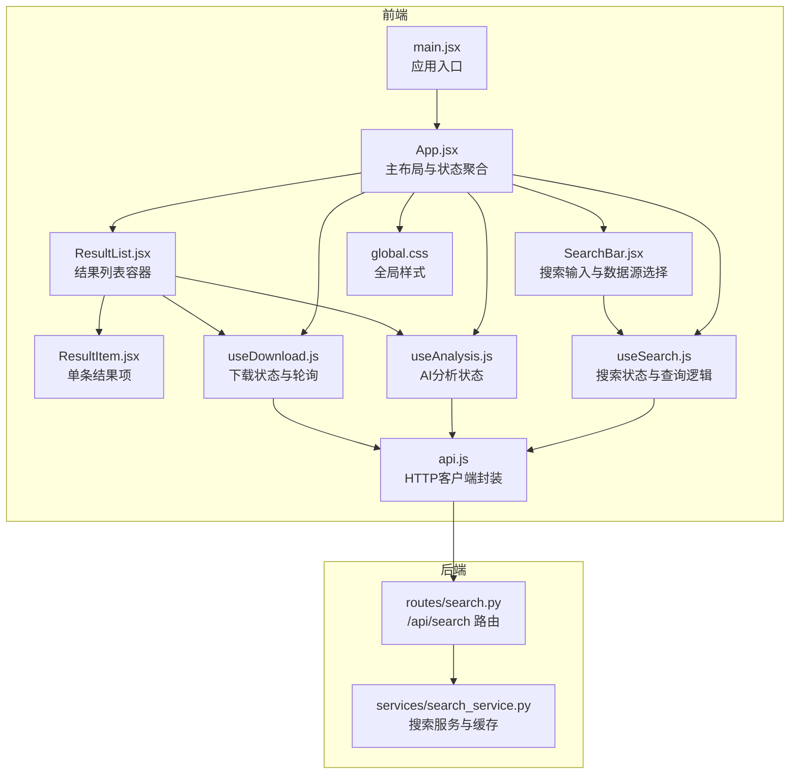
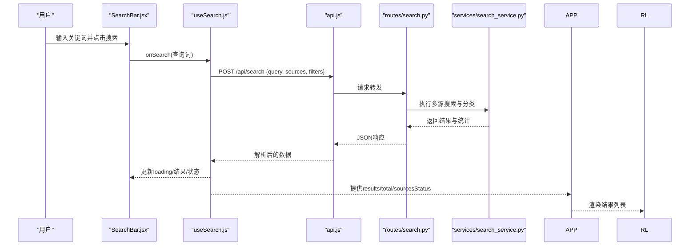
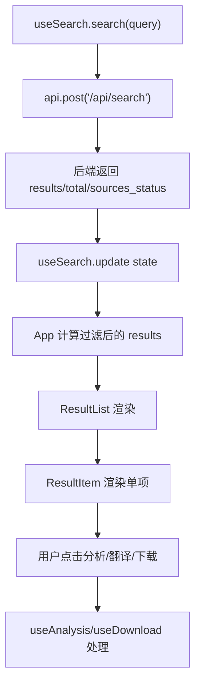
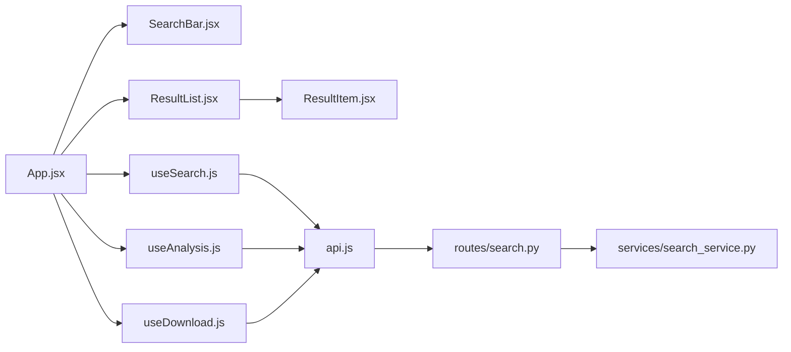

# 搜索相关组件

<cite>
**本文档引用的文件**
- [frontend/src/components/SearchBar.jsx](file://frontend/src/components/SearchBar.jsx)
- [frontend/src/components/ResultList.jsx](file://frontend/src/components/ResultList.jsx)
- [frontend/src/components/ResultItem.jsx](file://frontend/src/components/ResultItem.jsx)
- [frontend/src/hooks/useSearch.js](file://frontend/src/hooks/useSearch.js)
- [frontend/src/hooks/useAnalysis.js](file://frontend/src/hooks/useAnalysis.js)
- [frontend/src/hooks/useDownload.js](file://frontend/src/hooks/useDownload.js)
- [frontend/src/services/api.js](file://frontend/src/services/api.js)
- [frontend/src/App.jsx](file://frontend/src/App.jsx)
- [frontend/src/main.jsx](file://frontend/src/main.jsx)
- [frontend/src/styles/global.css](file://frontend/src/styles/global.css)
- [backend/routes/search.py](file://backend/routes/search.py)
- [backend/services/search_service.py](file://backend/services/search_service.py)
</cite>

## 目录
1. [简介](#简介)
2. [项目结构](#项目结构)
3. [核心组件](#核心组件)
4. [架构总览](#架构总览)
5. [详细组件分析](#详细组件分析)
6. [依赖关系分析](#依赖关系分析)
7. [性能考虑](#性能考虑)
8. [故障排查指南](#故障排查指南)
9. [结论](#结论)
10. [附录](#附录)

## 简介
本文件聚焦于前端搜索相关组件的详细设计与实现，涵盖 SearchBar、ResultList 和 ResultItem 三大核心组件。文档从组件职责、props 接口、事件处理、状态管理到样式设计进行系统化梳理，并结合 useSearch、useAnalysis、useDownload 等 Hook 的协作模式，解释数据流与交互流程。同时提供使用示例与最佳实践，帮助开发者快速理解与扩展搜索功能。

## 项目结构
前端采用 React + Ant Design 架构，组件位于 frontend/src/components，状态逻辑通过自定义 Hook 管理，API 调用封装在 api.js 中。后端提供多源搜索服务，路由与业务服务分别位于 backend/routes 与 backend/services。

图表来源
- [frontend/src/main.jsx](file://frontend/src/main.jsx#L1-L15)
- [frontend/src/App.jsx](file://frontend/src/App.jsx#L1-L149)
- [frontend/src/components/SearchBar.jsx](file://frontend/src/components/SearchBar.jsx#L1-L42)
- [frontend/src/components/ResultList.jsx](file://frontend/src/components/ResultList.jsx#L1-L58)
- [frontend/src/components/ResultItem.jsx](file://frontend/src/components/ResultItem.jsx#L1-L108)
- [frontend/src/hooks/useSearch.js](file://frontend/src/hooks/useSearch.js#L1-L74)
- [frontend/src/hooks/useAnalysis.js](file://frontend/src/hooks/useAnalysis.js#L1-L86)
- [frontend/src/hooks/useDownload.js](file://frontend/src/hooks/useDownload.js#L1-L78)
- [frontend/src/services/api.js](file://frontend/src/services/api.js#L1-L32)
- [frontend/src/styles/global.css](file://frontend/src/styles/global.css#L1-L156)
- [backend/routes/search.py](file://backend/routes/search.py#L1-L28)
- [backend/services/search_service.py](file://backend/services/search_service.py#L1-L98)

章节来源
- [frontend/src/main.jsx](file://frontend/src/main.jsx#L1-L15)
- [frontend/src/App.jsx](file://frontend/src/App.jsx#L1-L149)
- [frontend/src/styles/global.css](file://frontend/src/styles/global.css#L1-L156)

## 核心组件
本节概述三个核心组件的职责与协作方式：
- SearchBar：负责用户输入与数据源选择，触发搜索查询。
- ResultList：作为结果容器，展示总数、各源状态与分页/虚拟滚动（此处为 Ant Design List 的默认行为）。
- ResultItem：渲染单条结果项，提供分析、翻译与下载等交互。

章节来源
- [frontend/src/components/SearchBar.jsx](file://frontend/src/components/SearchBar.jsx#L1-L42)
- [frontend/src/components/ResultList.jsx](file://frontend/src/components/ResultList.jsx#L1-L58)
- [frontend/src/components/ResultItem.jsx](file://frontend/src/components/ResultItem.jsx#L1-L108)

## 架构总览
下图展示了从前端组件到后端服务的数据流与交互顺序。

图表来源
- [frontend/src/components/SearchBar.jsx](file://frontend/src/components/SearchBar.jsx#L12-L28)
- [frontend/src/hooks/useSearch.js](file://frontend/src/hooks/useSearch.js#L19-L50)
- [frontend/src/services/api.js](file://frontend/src/services/api.js#L10-L29)
- [backend/routes/search.py](file://backend/routes/search.py#L10-L27)
- [backend/services/search_service.py](file://backend/services/search_service.py#L28-L67)

## 详细组件分析

### SearchBar 组件
- 职责
  - 提供输入框与“搜索”按钮，支持回车触发。
  - 提供数据源复选框组，允许用户选择 DuckDuckGo、arXiv、Google Scholar、知乎等。
  - 将用户输入与数据源变更回调给父组件，由父组件统一调度查询。
- Props 接口
  - onSearch: (query: string) => void
  - sources: string[]（当前选中的数据源集合）
  - onSourcesChange: (sources: string[]) => void
  - loading: boolean（用于 Input.Search 的 loading 状态）
- 事件处理
  - handleSearch：当输入非空时调用 onSearch，避免空查询。
  - Checkbox.Group onChange：更新 sources 并通过 onSourcesChange 回传。
- 状态管理
  - 该组件为纯展示型，不维护内部状态，所有状态由父组件 useSearch 管理。
- 样式设计
  - 使用 Ant Design 的 Input.Search 与 Checkbox.Group，配合全局样式实现统一视觉风格。

章节来源
- [frontend/src/components/SearchBar.jsx](file://frontend/src/components/SearchBar.jsx#L12-L41)

### ResultList 组件
- 职责
  - 展示搜索结果的容器，包括加载态、空态与结果计数。
  - 显示各数据源的执行状态（成功/失败）。
  - 将每条结果交给 ResultItem 进行渲染。
- Props 接口
  - results: Array（当前结果数组）
  - total: number（总结果数）
  - loading: boolean（是否处于加载中）
  - sourcesStatus: Record<string, string>（各源状态）
  - onAnalyze: (item) => void（打开分析面板）
  - onDownload: (arxivId, title) => void（发起下载）
- 渲染逻辑
  - loading 时显示大号加载指示器。
  - 无结果时显示“暂无搜索结果”的空态。
  - 否则展示总数与当前显示数量，并遍历结果渲染 ResultItem。
- 交互
  - 通过 onAnalyze/onDownload 将用户操作传递给上层处理。
- 性能与可扩展性
  - 当前使用 Ant Design List，默认渲染策略适用于中小规模结果集。若结果量较大，可考虑虚拟滚动或分页加载以优化性能。

章节来源
- [frontend/src/components/ResultList.jsx](file://frontend/src/components/ResultList.jsx#L7-L57)

### ResultItem 组件
- 职责
  - 渲染单条搜索结果，包含标题、摘要、元信息与操作按钮。
  - 针对 arXiv 结果提供 PDF 下载能力。
- Props 接口
  - item: 包含 url、title、snippet、category、source、authors、published、extra 等字段的对象
  - onAnalyze: (item) => void
  - onDownload: (arxivId, title) => void
- 渲染细节
  - 标题：外链跳转至原文，支持新窗口打开。
  - 摘要：默认“暂无摘要”，支持多行省略显示。
  - 元信息：类别标签、来源标签、作者、发布时间、域名等。
  - 操作：AI分析、翻译、arXiv PDF 下载（仅 arXiv 且存在 arxiv_id 时显示）。
- 交互
  - 分析与翻译均调用 onAnalyze，具体分析类型由上层 useAnalysis 控制。
  - arXiv 下载调用 onDownload，传入 arxivId 与标题。
- 样式设计
  - 使用 Ant Design Card、Tag、Button、Tooltip 等组件，配合全局样式实现统一外观与悬停效果。

章节来源
- [frontend/src/components/ResultItem.jsx](file://frontend/src/components/ResultItem.jsx#L37-L107)

### 状态与数据流（Hook 与组件协作）
- useSearch
  - 管理搜索结果、总数、各源状态、加载状态、错误信息与查询词。
  - 提供 search(query) 发起搜索，updateSources 与 updateCategory 更新过滤条件。
  - 内部通过 api.js 调用 /api/search，返回数据后进行客户端分类过滤。
- useAnalysis
  - 管理分析面板可见性、选中项、活动标签页与分析结果。
  - 提供 summarize、translate、analyzePaper 等分析方法。
- useDownload
  - 管理下载队列、可见性与轮询刷新。
  - 通过定时器每 2 秒轮询一次下载状态，自动更新进度与状态。

图表来源
- [frontend/src/hooks/useSearch.js](file://frontend/src/hooks/useSearch.js#L19-L50)
- [frontend/src/services/api.js](file://frontend/src/services/api.js#L10-L29)
- [backend/routes/search.py](file://backend/routes/search.py#L10-L27)
- [backend/services/search_service.py](file://backend/services/search_service.py#L28-L67)
- [frontend/src/App.jsx](file://frontend/src/App.jsx#L69-L73)
- [frontend/src/components/ResultList.jsx](file://frontend/src/components/ResultList.jsx#L44-L54)
- [frontend/src/components/ResultItem.jsx](file://frontend/src/components/ResultItem.jsx#L77-L103)

章节来源
- [frontend/src/hooks/useSearch.js](file://frontend/src/hooks/useSearch.js#L1-L74)
- [frontend/src/hooks/useAnalysis.js](file://frontend/src/hooks/useAnalysis.js#L1-L86)
- [frontend/src/hooks/useDownload.js](file://frontend/src/hooks/useDownload.js#L1-L78)
- [frontend/src/App.jsx](file://frontend/src/App.jsx#L1-L149)

## 依赖关系分析
- 组件间依赖
  - App.jsx 聚合 useSearch、useAnalysis、useDownload，向下传递 props。
  - SearchBar 依赖 useSearch 的 search 与 filters。
  - ResultList 依赖 useSearch 的 results、total、sourcesStatus，并调用 useAnalysis 与 useDownload。
  - ResultItem 依赖 ResultList 的 onAnalyze 与 onDownload。
- 外部依赖
  - api.js 封装 axios，统一拦截错误与提示。
  - 后端 routes/search.py 与 services/search_service.py 提供多源搜索、分类与缓存。

图表来源
- [frontend/src/App.jsx](file://frontend/src/App.jsx#L1-L149)
- [frontend/src/components/SearchBar.jsx](file://frontend/src/components/SearchBar.jsx#L1-L42)
- [frontend/src/components/ResultList.jsx](file://frontend/src/components/ResultList.jsx#L1-L58)
- [frontend/src/components/ResultItem.jsx](file://frontend/src/components/ResultItem.jsx#L1-L108)
- [frontend/src/hooks/useSearch.js](file://frontend/src/hooks/useSearch.js#L1-L74)
- [frontend/src/hooks/useAnalysis.js](file://frontend/src/hooks/useAnalysis.js#L1-L86)
- [frontend/src/hooks/useDownload.js](file://frontend/src/hooks/useDownload.js#L1-L78)
- [frontend/src/services/api.js](file://frontend/src/services/api.js#L1-L32)
- [backend/routes/search.py](file://backend/routes/search.py#L1-L28)
- [backend/services/search_service.py](file://backend/services/search_service.py#L1-L98)

章节来源
- [frontend/src/App.jsx](file://frontend/src/App.jsx#L1-L149)
- [frontend/src/services/api.js](file://frontend/src/services/api.js#L1-L32)
- [backend/routes/search.py](file://backend/routes/search.py#L1-L28)
- [backend/services/search_service.py](file://backend/services/search_service.py#L1-L98)

## 性能考虑
- 列表渲染
  - 当前使用 Ant Design List 默认渲染策略，适合中小规模结果集。若结果量较大，建议引入虚拟滚动或分页加载，减少 DOM 节点数量与重排开销。
- 缓存与去抖
  - 后端已实现搜索结果缓存与历史记录保存，前端可结合本地缓存进一步降低重复请求。
- 轮询策略
  - 下载轮询间隔为 2 秒，可根据实际场景调整频率，避免过度轮询导致资源浪费。
- 图片与长文本
  - 摘要采用多行省略显示，避免长文本造成渲染压力；链接域名显示使用 Tooltip，避免过长文本影响布局。

[本节为通用性能建议，无需特定文件引用]

## 故障排查指南
- 搜索无结果
  - 检查查询词是否为空，确认 onSearch 是否被正确调用。
  - 查看 useSearch 的 loading 与 error 状态，确认后端返回是否包含 total 与 results。
- 数据源状态异常
  - 检查 sourcesStatus 的键值映射，确保每个源的状态为 success 或 failure。
- 下载失败
  - 确认 arxivId 与标题是否正确传入，检查下载轮询是否正常运行。
- 网络错误
  - api.js 已拦截常见错误并弹出消息，如 429、5xx、400、超时等，根据提示调整请求频率或参数。
- 后端异常
  - 后端路由返回 400 时需检查请求体格式，返回 500 时查看日志定位问题。

章节来源
- [frontend/src/hooks/useSearch.js](file://frontend/src/hooks/useSearch.js#L43-L49)
- [frontend/src/hooks/useDownload.js](file://frontend/src/hooks/useDownload.js#L50-L64)
- [frontend/src/services/api.js](file://frontend/src/services/api.js#L10-L29)
- [backend/routes/search.py](file://backend/routes/search.py#L15-L17)

## 结论
SearchBar、ResultList 与 ResultItem 三者形成清晰的职责分工：输入与筛选由 SearchBar 负责，结果容器与交互由 ResultList 管理，单条结果的渲染与操作由 ResultItem 承担。配合 useSearch、useAnalysis、useDownload 的状态管理，实现了从查询到分析与下载的完整闭环。后续可在大规模结果场景引入虚拟滚动与分页，进一步提升性能与用户体验。

[本节为总结性内容，无需特定文件引用]

## 附录

### 组件 Props 一览
- SearchBar
  - onSearch: (query: string) => void
  - sources: string[]
  - onSourcesChange: (sources: string[]) => void
  - loading: boolean
- ResultList
  - results: Array
  - total: number
  - loading: boolean
  - sourcesStatus: Record<string, string>
  - onAnalyze: (item) => void
  - onDownload: (arxivId, title) => void
- ResultItem
  - item: 对象（包含 url、title、snippet、category、source、authors、published、extra 等）
  - onAnalyze: (item) => void
  - onDownload: (arxivId, title) => void

章节来源
- [frontend/src/components/SearchBar.jsx](file://frontend/src/components/SearchBar.jsx#L12-L17)
- [frontend/src/components/ResultList.jsx](file://frontend/src/components/ResultList.jsx#L7-L14)
- [frontend/src/components/ResultItem.jsx](file://frontend/src/components/ResultItem.jsx#L37-L37)

### 使用示例与最佳实践
- 在 App.jsx 中组合使用
  - 将 useSearch 的 search、filters 与 loading 传递给 SearchBar。
  - 将 filteredResults、total、sourcesStatus 与 onAnalyze/onDownload 传递给 ResultList。
  - 在 ResultItem 中根据 item.source 与 extra.arxiv_id 决定是否显示下载按钮。
- 最佳实践
  - 保持组件无状态化，通过 props 传递数据与回调。
  - 在 useSearch 中进行客户端过滤（如按类别），减少后端负担。
  - 对下载任务启用轮询，及时反馈状态变化。
  - 为长文本与链接添加省略与提示，提升可读性与可用性。

章节来源
- [frontend/src/App.jsx](file://frontend/src/App.jsx#L75-L118)
- [frontend/src/hooks/useSearch.js](file://frontend/src/hooks/useSearch.js#L35-L38)
- [frontend/src/hooks/useDownload.js](file://frontend/src/hooks/useDownload.js#L50-L64)