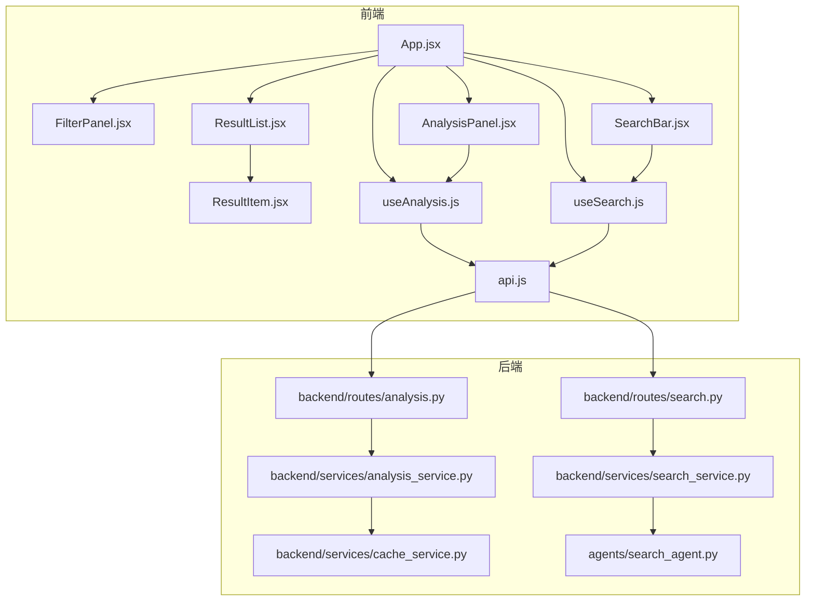
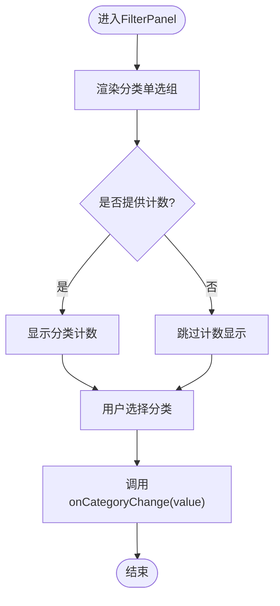
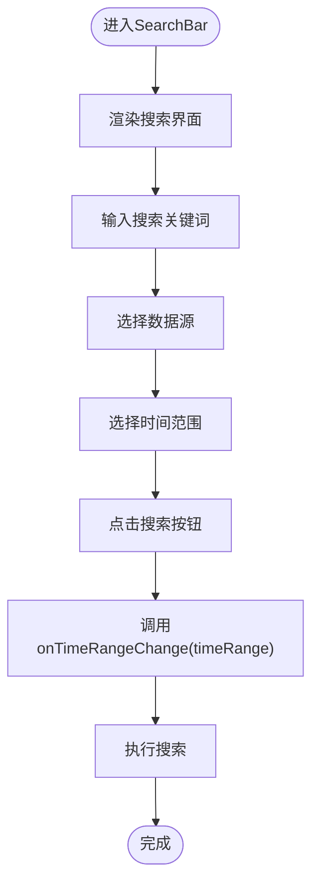
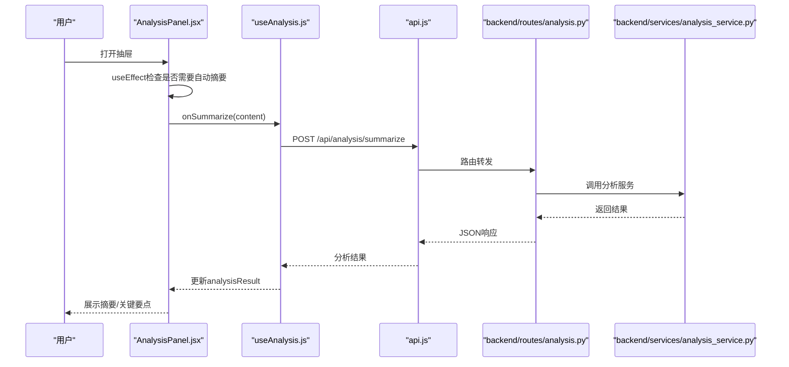
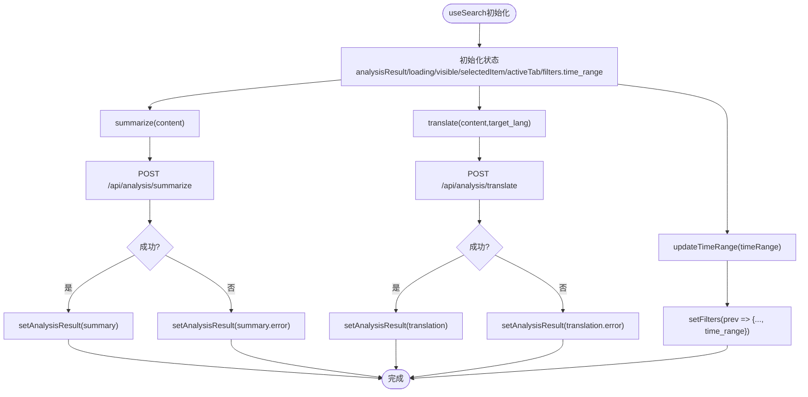
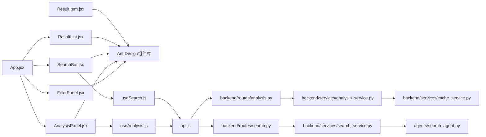

# 筛选与分析组件

<cite>
**本文档引用的文件**
- [FilterPanel.jsx](file://frontend/src/components/FilterPanel.jsx)
- [AnalysisPanel.jsx](file://frontend/src/components/AnalysisPanel.jsx)
- [SearchBar.jsx](file://frontend/src/components/SearchBar.jsx)
- [useAnalysis.js](file://frontend/src/hooks/useAnalysis.js)
- [useSearch.js](file://frontend/src/hooks/useSearch.js)
- [App.jsx](file://frontend/src/App.jsx)
- [ResultList.jsx](file://frontend/src/components/ResultList.jsx)
- [ResultItem.jsx](file://frontend/src/components/ResultItem.jsx)
- [api.js](file://frontend/src/services/api.js)
- [analysis.py](file://backend/routes/analysis.py)
- [analysis_service.py](file://backend/services/analysis_service.py)
- [cache_service.py](file://backend/services/cache_service.py)
- [search.py](file://backend/routes/search.py)
- [search_service.py](file://backend/services/search_service.py)
- [search_agent.py](file://.qoder/agents/search_agent.py)
</cite>

## 更新摘要
**变更内容**
- 更新FilterPanel组件分析，强调其当前专注于内容分类筛选，但整体架构支持未来扩展时间范围过滤功能
- 新增SearchBar组件的详细分析，展示时间范围过滤功能的完整实现
- 更新useSearch hook的分析，突出time_range状态管理的完整支持
- 新增后端SearchAgent的时间范围过滤实现分析
- 更新架构图以反映时间范围过滤的完整数据流

## 目录
1. [简介](#简介)
2. [项目结构](#项目结构)
3. [核心组件](#核心组件)
4. [架构总览](#架构总览)
5. [详细组件分析](#详细组件分析)
6. [依赖关系分析](#依赖关系分析)
7. [性能考虑](#性能考虑)
8. [故障排除指南](#故障排除指南)
9. [结论](#结论)

## 简介
本文件聚焦于前端筛选与分析两大核心组件：FilterPanel（筛选面板）与AnalysisPanel（AI分析面板）。FilterPanel当前专注于内容分类筛选，但整体架构设计支持未来扩展时间范围过滤功能。AnalysisPanel提供摘要生成、翻译与学术论文深度分析的AI能力。文档将从架构设计、状态管理、用户交互、响应式布局、配置选项、事件回调、数据绑定以及与后端API的集成模式等维度进行全面阐述。

## 项目结构
筛选与分析组件位于前端src/components目录下，配合自定义Hook与API服务层共同工作：
- 组件层：FilterPanel.jsx、AnalysisPanel.jsx、SearchBar.jsx、ResultList.jsx、ResultItem.jsx
- Hook层：useSearch.js、useAnalysis.js、useDownload.js
- 服务层：api.js
- 后端路由与服务：backend/routes/analysis.py、backend/services/analysis_service.py、backend/services/cache_service.py、backend/routes/search.py、backend/services/search_service.py、.qoder/agents/search_agent.py



**图表来源**
- [App.jsx](file://frontend/src/App.jsx#L1-L152)
- [FilterPanel.jsx](file://frontend/src/components/FilterPanel.jsx#L1-L52)
- [AnalysisPanel.jsx](file://frontend/src/components/AnalysisPanel.jsx#L1-L171)
- [SearchBar.jsx](file://frontend/src/components/SearchBar.jsx#L1-L66)
- [ResultList.jsx](file://frontend/src/components/ResultList.jsx#L1-L58)
- [ResultItem.jsx](file://frontend/src/components/ResultItem.jsx#L1-L108)
- [useSearch.js](file://frontend/src/hooks/useSearch.js#L1-L81)
- [useAnalysis.js](file://frontend/src/hooks/useAnalysis.js#L1-L86)
- [api.js](file://frontend/src/services/api.js#L1-L32)
- [analysis.py](file://backend/routes/analysis.py#L1-L66)
- [analysis_service.py](file://backend/services/analysis_service.py#L1-L91)
- [cache_service.py](file://backend/services/cache_service.py#L1-L104)
- [search.py](file://backend/routes/search.py#L1-L34)
- [search_service.py](file://backend/services/search_service.py#L1-L98)
- [search_agent.py](file://.qoder/agents/search_agent.py#L1-L350)

**章节来源**
- [App.jsx](file://frontend/src/App.jsx#L1-L152)

## 核心组件
- **FilterPanel**：当前专注于内容分类筛选，支持"全部/学术论文/问答内容/博客文章/论坛帖子/网页"等类别，显示各分类的结果数量，并通过回调更新父组件的筛选状态。整体架构设计支持未来扩展时间范围过滤功能。
- **SearchBar**：提供完整的筛选界面，包括搜索关键词输入、数据源选择、时间范围过滤（不限/近一周/近一月/近一年/近三年）和搜索按钮。
- **AnalysisPanel**：基于抽屉的AI分析面板，包含摘要、翻译、论文分析三个选项卡，根据加载状态与返回数据动态渲染，支持自动触发摘要生成与手动触发翻译/论文分析。

**章节来源**
- [FilterPanel.jsx](file://frontend/src/components/FilterPanel.jsx#L1-L52)
- [SearchBar.jsx](file://frontend/src/components/SearchBar.jsx#L1-L66)
- [AnalysisPanel.jsx](file://frontend/src/components/AnalysisPanel.jsx#L1-L171)

## 架构总览
筛选与分析组件采用"容器组件+展示组件+自定义Hook"的分层架构：
- **容器组件（App.jsx）**：聚合useSearch与useAnalysis状态，计算筛选后的结果集，向子组件传递props与回调。
- **展示组件（FilterPanel、SearchBar、AnalysisPanel、ResultList、ResultItem）**：专注UI与交互。
- **自定义Hook（useSearch、useAnalysis）**：封装数据获取、状态管理与副作用处理。
- **API层（api.js）**：统一拦截HTTP响应，处理错误与超时。
- **后端路由（analysis.py、search.py）**：暴露分析与搜索接口，服务层（analysis_service.py、search_service.py）调用分析代理并结合缓存（cache_service.py）提升性能。

```mermaid
sequenceDiagram
participant U as "用户"
participant SB as "SearchBar.jsx"
participant AP as "App.jsx"
participant FP as "FilterPanel.jsx"
participantrt RL as "ResultList.jsx"
participant AI as "AnalysisPanel.jsx"
participant US as "useSearch.js"
participant UA as "useAnalysis.js"
participant API as "api.js"
participant RS as "backend/routes/search.py"
participant AS as "backend/routes/analysis.py"
participant SS as "backend/services/search_service.py"
participant SA as "agents/search_agent.py"
participant AC as "backend/services/analysis_service.py"
U->>SB : 输入查询并选择时间范围
SB->>US : updateTimeRange(timeRange)
US->>US : 更新filters.time_range
SB->>US : 触发搜索
US->>API : POST /search
API->>RS : 路由转发
RS->>SS : 调用搜索服务
SS->>SA : 调用SearchAgent
SA->>SA : 应用时间范围过滤
SA-->>SS : 返回过滤后的结果
SS-->>RS : 返回搜索结果
RS-->>API : JSON响应
API-->>US : 搜索结果
US->>AP : 更新results/total
AP->>RL : 渲染结果列表
U->>FP : 选择分类
FP->>AP : onCategoryChange(category)
AP->>AP : 更新filters.category
AP->>RL : 重新渲染filteredResults
U->>AI : 打开AI分析抽屉
AI->>UA : 触发摘要生成自动
UA->>API : POST /api/analysis/summarize
API->>AS : 路由转发
AS->>AC : 调用分析服务
AC-->>AS : 返回分析结果
AS-->>API : JSON响应
API-->>UA : 分析结果
UA-->>AI : 更新analysisResult
AI-->>U : 展示摘要/关键要点
```

**图表来源**
- [App.jsx](file://frontend/src/App.jsx#L1-L152)
- [SearchBar.jsx](file://frontend/src/components/SearchBar.jsx#L1-L66)
- [FilterPanel.jsx](file://frontend/src/components/FilterPanel.jsx#L1-L52)
- [AnalysisPanel.jsx](file://frontend/src/components/AnalysisPanel.jsx#L1-L171)
- [useSearch.js](file://frontend/src/hooks/useSearch.js#L1-L81)
- [useAnalysis.js](file://frontend/src/hooks/useAnalysis.js#L1-L86)
- [api.js](file://frontend/src/services/api.js#L1-L32)
- [search.py](file://backend/routes/search.py#L1-L34)
- [analysis.py](file://backend/routes/analysis.py#L1-L66)
- [search_service.py](file://backend/services/search_service.py#L1-L98)
- [search_agent.py](file://.qoder/agents/search_agent.py#L1-L350)
- [analysis_service.py](file://backend/services/analysis_service.py#L1-L91)

## 详细组件分析

### FilterPanel 组件
- **功能职责**
  - 提供内容分类单选框组，支持"全部/学术论文/问答内容/博客文章/论坛帖子/网页"。
  - 显示每个分类的结果数量（来自父组件传入的resultCounts）。
  - 通过回调onCategoryChange通知父组件更新filters.category。
- **数据流**
  - 接收filters.category用于受控显示当前选中项。
  - 接收resultCounts用于显示各分类计数。
  - 用户选择后调用onCategoryChange(category)。
- **响应式与交互**
  - 使用Ant Design的Radio.Group与Typography.Text实现清晰的视觉层级。
  - 列表垂直排列，支持小尺寸以节省空间。
- **配置与事件**
  - props: filters, onCategoryChange, resultCounts
  - 无内部状态，纯展示型组件，便于复用与测试。
- **架构扩展性**
  - 当前版本专注于内容分类筛选，但整体架构设计支持未来扩展时间范围过滤功能。
  - 与useSearch的filters.time_range状态保持一致的扩展模式。



**图表来源**
- [FilterPanel.jsx](file://frontend/src/components/FilterPanel.jsx#L1-L52)

**章节来源**
- [FilterPanel.jsx](file://frontend/src/components/FilterPanel.jsx#L1-L52)

### SearchBar 组件
- **功能职责**
  - 提供完整的搜索界面，包括关键词输入、数据源选择和时间范围过滤。
  - 支持多数据源选择：DuckDuckGo、arXiv、Google Scholar、知乎。
  - 提供时间范围过滤选项：不限、近一周、近一月、近一年、近三年。
- **状态管理**
  - 通过props接收timeRange和onTimeRangeChange回调。
  - 将时间范围状态传递给useSearch的updateTimeRange函数。
- **数据流**
  - 用户选择时间范围后，通过onTimeRangeChange回调更新父组件状态。
  - 搜索执行时，useSearch将time_range参数包含在API请求中。
- **与后端集成**
  - time_range参数被传递到后端SearchAgent进行实际过滤。
  - 不同数据源对时间过滤的支持程度不同。



**图表来源**
- [SearchBar.jsx](file://frontend/src/components/SearchBar.jsx#L1-L66)

**章节来源**
- [SearchBar.jsx](file://frontend/src/components/SearchBar.jsx#L1-L66)

### AnalysisPanel 组件
- **功能职责**
  - 抽屉式AI分析面板，包含摘要、翻译、论文分析三个选项卡。
  - 自动在首次打开且未有摘要时触发摘要生成。
  - 支持手动触发翻译与论文分析，带禁用态与错误提示。
- **状态与生命周期**
  - 通过useEffect在visible与selectedItem变化时自动摘要。
  - loading控制加载态，analysisResult承载三类分析结果。
- **选项卡与渲染**
  - 摘要：展示summary与key_points，支持错误提示。
  - 翻译：提供"翻译为中文"按钮，成功后展示翻译文本。
  - 论文分析：仅当category为academic时可用，按节段展示分析结果。
- **配置与事件**
  - props: visible, onClose, selectedItem, analysisResult, loading, activeTab, onTabChange, onSummarize, onTranslate, onAnalyzePaper
  - 通过onTabChange与setActiveTab管理选项卡切换。



**图表来源**
- [AnalysisPanel.jsx](file://frontend/src/components/AnalysisPanel.jsx#L1-L171)
- [useAnalysis.js](file://frontend/src/hooks/useAnalysis.js#L1-L86)
- [api.js](file://frontend/src/services/api.js#L1-L32)
- [analysis.py](file://backend/routes/analysis.py#L1-L66)
- [analysis_service.py](file://backend/services/analysis_service.py#L1-L91)

**章节来源**
- [AnalysisPanel.jsx](file://frontend/src/components/AnalysisPanel.jsx#L1-L171)
- [useAnalysis.js](file://frontend/src/hooks/useAnalysis.js#L1-L86)

### useSearch Hook
- **状态管理**
  - analysisResult：三类分析结果的合并对象，按需更新对应字段。
  - loading：全局加载状态，影响所有选项卡的加载态。
  - visible：抽屉可见性。
  - selectedItem：当前分析对象。
  - activeTab：当前激活的选项卡键值。
  - **新增**：filters.time_range：时间范围筛选状态，默认为null（不限）。
- **行为**
  - summarize/translate/analyzePaper：分别调用对应API，捕获异常并写入error字段。
  - openAnalysis/closeAnalysis：打开/关闭抽屉并清理状态。
  - setActiveTab：外部控制选项卡切换。
  - **新增**：updateTimeRange：更新时间范围筛选状态。
- **与API层交互**
  - 通过api.js统一POST到后端分析路由，拦截错误并提示。
- **时间范围过滤集成**
  - filters.time_range被包含在搜索请求的filters参数中。
  - 传递给后端SearchAgent进行实际的时间范围过滤。



**图表来源**
- [useSearch.js](file://frontend/src/hooks/useSearch.js#L1-L81)
- [api.js](file://frontend/src/services/api.js#L1-L32)
- [analysis.py](file://backend/routes/analysis.py#L1-L66)

**章节来源**
- [useSearch.js](file://frontend/src/hooks/useSearch.js#L1-L81)

### useAnalysis Hook 与 App.jsx 的协作
- **状态与筛选**
  - useSearch维护查询词、结果集、总数、来源状态、加载与错误状态，以及filters（包含sources、category、language、time_range）。
  - App.jsx计算resultCounts与filteredResults，向FilterPanel与ResultList传递。
- **过滤逻辑**
  - App.jsx使用useMemo计算分类计数与客户端过滤，确保只在依赖变化时重建。
  - **新增**：useSearch的time_range状态参与搜索请求，后端进行时间范围过滤。
- **与AnalysisPanel的数据绑定**
  - App.jsx将useAnalysis的分析状态与回调传递给AnalysisPanel，实现双向数据流。


**图表来源**
- [App.jsx](file://frontend/src/App.jsx#L1-L152)
- [useSearch.js](file://frontend/src/hooks/useSearch.js#L1-L81)
- [FilterPanel.jsx](file://frontend/src/components/FilterPanel.jsx#L1-L52)
- [ResultList.jsx](file://frontend/src/components/ResultList.jsx#L1-L58)
- [AnalysisPanel.jsx](file://frontend/src/components/AnalysisPanel.jsx#L1-L171)

**章节来源**
- [App.jsx](file://frontend/src/App.jsx#L1-L152)
- [useSearch.js](file://frontend/src/hooks/useSearch.js#L1-L81)

### 后端时间范围过滤实现
- **SearchAgent._calculate_date_range**
  - 将时间范围关键字转换为具体的日期范围。
  - 支持"week"(7天)、"month"(30天)、"year"(365天)、"3years"(1095天)。
- **数据源支持情况**
  - **arXiv**：原生支持，通过submittedDate查询语法精确过滤。
  - **Google Scholar**：原生支持，通过Semantic Scholar API的year参数过滤。
  - **DuckDuckGo**：不支持，Bing搜索结果缺少可靠的时间元数据，忽略时间参数。
  - **知乎**：不支持，基于Bing站内搜索，忽略时间参数。
- **过滤应用流程**
  - SearchAgent根据filters.time_range计算日期范围。
  - 对支持时间过滤的数据源应用相应的过滤逻辑。
  - 对不支持时间过滤的数据源记录日志并忽略时间参数。

**章节来源**
- [search_agent.py](file://.qoder/agents/search_agent.py#L35-L48)
- [search_agent.py](file://.qoder/agents/search_agent.py#L178-L220)
- [search_agent.py](file://.qoder/agents/search_agent.py#L222-L298)
- [search_agent.py](file://.qoder/agents/search_agent.py#L130-L176)
- [search_agent.py](file://.qoder/agents/search_agent.py#L300-L349)

## 依赖关系分析
- **前端组件依赖**
  - FilterPanel依赖Ant Design的Card、Radio、Space、Typography。
  - AnalysisPanel依赖Ant Design的Drawer、Tabs、Spin、Tag、Empty、Button、Divider。
  - SearchBar依赖Ant Design的Input、Checkbox、Radio、Space。
  - ResultList与ResultItem提供结果列表与条目展示。
- **Hook与服务**
  - useAnalysis与useSearch均依赖api.js进行HTTP通信。
  - AnalysisPanel依赖useAnalysis提供的分析能力。
  - **新增**：SearchBar依赖useSearch的updateTimeRange回调。
- **后端依赖**
  - analysis.py路由依赖analysis_service.py服务层。
  - search.py路由依赖search_service.py服务层。
  - search_service.py依赖agents/search_agent.py进行实际搜索。
  - analysis_service.py依赖cache_service.py进行缓存读写。



**图表来源**
- [FilterPanel.jsx](file://frontend/src/components/FilterPanel.jsx#L1-L52)
- [AnalysisPanel.jsx](file://frontend/src/components/AnalysisPanel.jsx#L1-L171)
- [SearchBar.jsx](file://frontend/src/components/SearchBar.jsx#L1-L66)
- [ResultList.jsx](file://frontend/src/components/ResultList.jsx#L1-L58)
- [ResultItem.jsx](file://frontend/src/components/ResultItem.jsx#L1-L108)
- [useAnalysis.js](file://frontend/src/hooks/useAnalysis.js#L1-L86)
- [useSearch.js](file://frontend/src/hooks/useSearch.js#L1-L81)
- [api.js](file://frontend/src/services/api.js#L1-L32)
- [analysis.py](file://backend/routes/analysis.py#L1-L66)
- [search.py](file://backend/routes/search.py#L1-L34)
- [search_service.py](file://backend/services/search_service.py#L1-L98)
- [analysis_service.py](file://backend/services/analysis_service.py#L1-L91)
- [cache_service.py](file://backend/services/cache_service.py#L1-L104)
- [search_agent.py](file://.qoder/agents/search_agent.py#L1-L350)

**章节来源**
- [search.py](file://backend/routes/search.py#L1-L34)
- [search_service.py](file://backend/services/search_service.py#L1-L98)
- [search_agent.py](file://.qoder/agents/search_agent.py#L1-L350)
- [analysis.py](file://backend/routes/analysis.py#L1-L66)
- [analysis_service.py](file://backend/services/analysis_service.py#L1-L91)
- [cache_service.py](file://backend/services/cache_service.py#L1-L104)

## 性能考虑
- **缓存策略**
  - 后端analysis_service.py对摘要、翻译、论文分析结果进行缓存，避免重复计算。
  - cache_service.py对分析结果设置7天有效期，到期自动清理。
  - **新增**：search_service.py对搜索结果进行缓存，支持时间范围过滤的缓存键生成。
- **前端优化**
  - App.jsx使用useMemo计算resultCounts与filteredResults，减少不必要的渲染。
  - AnalysisPanel在首次打开时自动触发摘要生成，后续可直接使用缓存结果。
  - **新增**：useSearch的filters.time_range状态变化时触发重新搜索。
- **错误与超时处理**
  - api.js拦截HTTP错误码与超时，统一提示，避免未处理异常导致的崩溃。
- **并发与轮询**
  - useDownload.js对下载任务进行2秒轮询刷新，避免频繁请求。
- **时间范围过滤优化**
  - SearchAgent._calculate_date_range方法计算日期范围，避免重复计算。
  - 不支持时间过滤的数据源直接跳过过滤步骤，提高效率。

**章节来源**
- [search_service.py](file://backend/services/search_service.py#L44-L67)
- [analysis_service.py](file://backend/services/analysis_service.py#L1-L91)
- [cache_service.py](file://backend/services/cache_service.py#L1-L104)
- [App.jsx](file://frontend/src/App.jsx#L1-L152)
- [useAnalysis.js](file://frontend/src/hooks/useAnalysis.js#L1-L86)
- [api.js](file://frontend/src/services/api.js#L1-L32)
- [useDownload.js](file://frontend/src/hooks/useDownload.js#L1-L78)
- [search_agent.py](file://.qoder/agents/search_agent.py#L35-L48)

## 故障排除指南
- **常见错误与处理**
  - 请求过于频繁（429）：api.js拦截并提示"请求过于频繁，请稍后再试"。
  - 服务器内部错误（5xx）：提示"服务器内部错误"，并记录日志。
  - 参数错误（400）：提示"请求参数错误"。
  - 网络连接失败或超时：提示相应错误信息。
- **分析结果错误**
  - 当分析接口返回错误时，AnalysisPanel会显示错误提示，同时useAnalysis将错误写入analysisResult对应字段。
- **缓存失效**
  - 若缓存过期，后端会删除旧记录并重新计算，前端需等待下次请求返回最新结果。
- **时间范围过滤问题**
  - **新增**：某些数据源不支持时间过滤时，会在日志中记录相关信息，但不会影响其他数据源的搜索结果。
  - **新增**：无效的时间范围参数会被后端路由验证并返回400错误。

**章节来源**
- [api.js](file://frontend/src/services/api.js#L1-L32)
- [AnalysisPanel.jsx](file://frontend/src/components/AnalysisPanel.jsx#L1-L171)
- [useAnalysis.js](file://frontend/src/hooks/useAnalysis.js#L1-L86)
- [analysis_service.py](file://backend/services/analysis_service.py#L1-L91)
- [cache_service.py](file://backend/services/cache_service.py#L1-L104)
- [search.py](file://backend/routes/search.py#L24-L27)

## 结论
FilterPanel与AnalysisPanel通过清晰的职责划分与状态管理，实现了高效的筛选与AI分析体验。FilterPanel当前专注于内容分类筛选，但整体架构设计支持未来扩展时间范围过滤功能。SearchBar提供了完整的筛选界面，包括时间范围过滤的完整实现。AnalysisPanel基于抽屉的AI分析面板提供了丰富的分析能力。前端采用受控组件与自定义Hook，后端引入缓存与错误拦截，整体具备良好的可扩展性与稳定性。建议后续可在以下方面持续优化：
- **FilterPanel扩展**：在未来版本中添加时间范围过滤功能，与SearchBar保持一致的用户体验。
- **时间范围过滤优化**：改进不支持时间过滤的数据源的处理策略，提供更好的用户反馈。
- **分析结果增强**：在AnalysisPanel中增加"复制/导出"等便捷操作。
- **缓存策略优化**：对分析结果进行本地持久化，提升离线可用性。
- **性能监控**：增加时间范围过滤的性能监控，优化不同数据源的过滤效率。