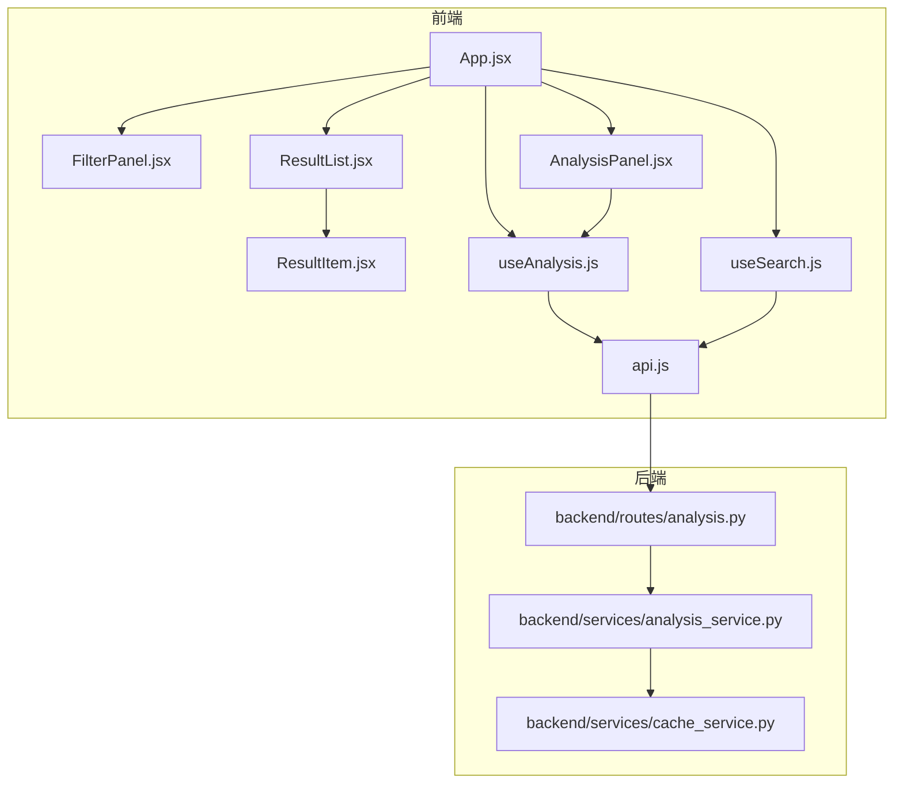
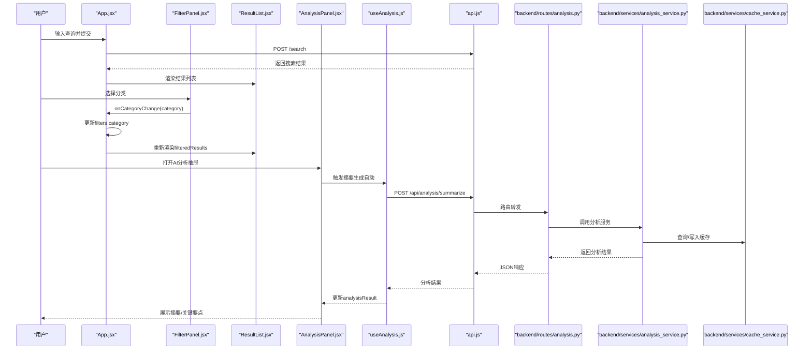
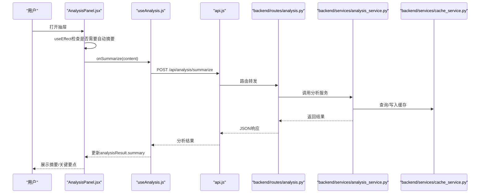
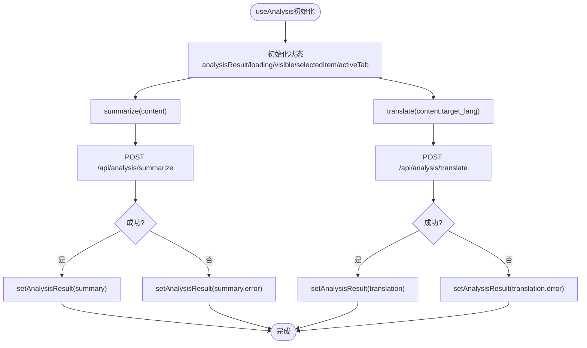
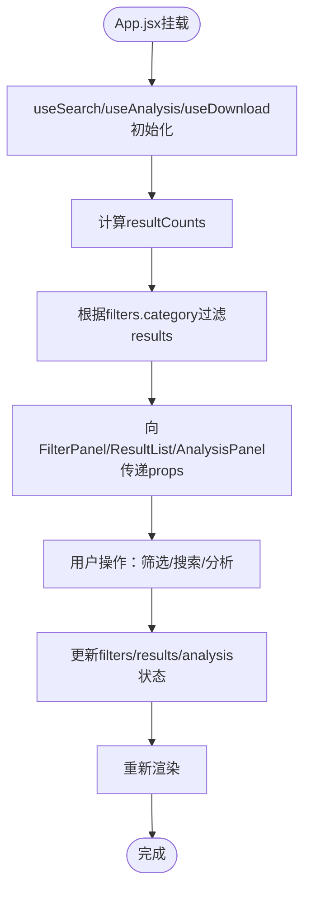
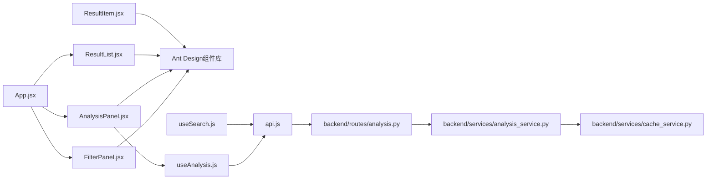

# 筛选与分析组件

<cite>
**本文档引用的文件**
- [FilterPanel.jsx](file://frontend/src/components/FilterPanel.jsx)
- [AnalysisPanel.jsx](file://frontend/src/components/AnalysisPanel.jsx)
- [useAnalysis.js](file://frontend/src/hooks/useAnalysis.js)
- [useSearch.js](file://frontend/src/hooks/useSearch.js)
- [App.jsx](file://frontend/src/App.jsx)
- [ResultList.jsx](file://frontend/src/components/ResultList.jsx)
- [ResultItem.jsx](file://frontend/src/components/ResultItem.jsx)
- [api.js](file://frontend/src/services/api.js)
- [analysis.py](file://backend/routes/analysis.py)
- [analysis_service.py](file://backend/services/analysis_service.py)
- [cache_service.py](file://backend/services/cache_service.py)
</cite>

## 目录
1. [简介](#简介)
2. [项目结构](#项目结构)
3. [核心组件](#核心组件)
4. [架构总览](#架构总览)
5. [详细组件分析](#详细组件分析)
6. [依赖关系分析](#依赖关系分析)
7. [性能考虑](#性能考虑)
8. [故障排除指南](#故障排除指南)
9. [结论](#结论)

## 简介
本文件聚焦于前端筛选与分析两大核心组件：FilterPanel（筛选面板）与AnalysisPanel（AI分析面板）。前者负责内容分类筛选与结果计数展示，后者提供摘要生成、翻译与学术论文深度分析的AI能力，并通过抽屉式布局进行交互。文档将从架构设计、状态管理、用户交互、响应式布局、配置选项、事件回调、数据绑定以及与后端API的集成模式等维度进行全面阐述。

## 项目结构
筛选与分析组件位于前端src/components目录下，配合自定义Hook与API服务层共同工作：
- 组件层：FilterPanel.jsx、AnalysisPanel.jsx、ResultList.jsx、ResultItem.jsx
- Hook层：useSearch.js、useAnalysis.js、useDownload.js
- 服务层：api.js
- 后端路由与服务：backend/routes/analysis.py、backend/services/analysis_service.py、backend/services/cache_service.py

图表来源
- [App.jsx](file://frontend/src/App.jsx#L1-L149)
- [FilterPanel.jsx](file://frontend/src/components/FilterPanel.jsx#L1-L52)
- [AnalysisPanel.jsx](file://frontend/src/components/AnalysisPanel.jsx#L1-L171)
- [ResultList.jsx](file://frontend/src/components/ResultList.jsx#L1-L58)
- [ResultItem.jsx](file://frontend/src/components/ResultItem.jsx#L1-L108)
- [useSearch.js](file://frontend/src/hooks/useSearch.js#L1-L74)
- [useAnalysis.js](file://frontend/src/hooks/useAnalysis.js#L1-L86)
- [api.js](file://frontend/src/services/api.js#L1-L32)
- [analysis.py](file://backend/routes/analysis.py#L1-L66)
- [analysis_service.py](file://backend/services/analysis_service.py#L1-L91)
- [cache_service.py](file://backend/services/cache_service.py#L1-L104)

章节来源
- [App.jsx](file://frontend/src/App.jsx#L1-L149)

## 核心组件
- FilterPanel：提供内容分类筛选，支持“全部/学术论文/问答内容/博客文章/论坛帖子/网页”等类别，显示各分类的结果数量，并通过回调更新父组件的筛选状态。
- AnalysisPanel：基于抽屉的AI分析面板，包含摘要、翻译、论文分析三个选项卡，根据加载状态与返回数据动态渲染，支持自动触发摘要生成与手动触发翻译/论文分析。

章节来源
- [FilterPanel.jsx](file://frontend/src/components/FilterPanel.jsx#L1-L52)
- [AnalysisPanel.jsx](file://frontend/src/components/AnalysisPanel.jsx#L1-L171)

## 架构总览
筛选与分析组件采用“容器组件+展示组件+自定义Hook”的分层架构：
- 容器组件（App.jsx）聚合useSearch与useAnalysis状态，计算筛选后的结果集，向子组件传递props与回调。
- 展示组件（FilterPanel、AnalysisPanel、ResultList、ResultItem）专注UI与交互。
- 自定义Hook（useSearch、useAnalysis）封装数据获取、状态管理与副作用处理。
- API层（api.js）统一拦截HTTP响应，处理错误与超时。
- 后端路由（analysis.py）暴露摘要、翻译、论文分析接口，服务层（analysis_service.py）调用分析代理并结合缓存（cache_service.py）提升性能。

图表来源
- [App.jsx](file://frontend/src/App.jsx#L1-L149)
- [FilterPanel.jsx](file://frontend/src/components/FilterPanel.jsx#L1-L52)
- [AnalysisPanel.jsx](file://frontend/src/components/AnalysisPanel.jsx#L1-L171)
- [useAnalysis.js](file://frontend/src/hooks/useAnalysis.js#L1-L86)
- [api.js](file://frontend/src/services/api.js#L1-L32)
- [analysis.py](file://backend/routes/analysis.py#L1-L66)
- [analysis_service.py](file://backend/services/analysis_service.py#L1-L91)
- [cache_service.py](file://backend/services/cache_service.py#L1-L104)

## 详细组件分析

### FilterPanel 组件
- 功能职责
  - 提供内容分类单选框组，支持“全部/学术论文/问答内容/博客文章/论坛帖子/网页”。
  - 显示每个分类的结果数量（来自父组件传入的resultCounts）。
  - 通过回调onCategoryChange通知父组件更新filters.category。
- 数据流
  - 接收filters.category用于受控显示当前选中项。
  - 接收resultCounts用于显示各分类计数。
  - 用户选择后调用onCategoryChange(category)。
- 响应式与交互
  - 使用Ant Design的Radio.Group与Typography.Text实现清晰的视觉层级。
  - 列表垂直排列，支持小尺寸以节省空间。
- 配置与事件
  - props: filters, onCategoryChange, resultCounts
  - 无内部状态，纯展示型组件，便于复用与测试。

图表来源
- [FilterPanel.jsx](file://frontend/src/components/FilterPanel.jsx#L1-L52)

章节来源
- [FilterPanel.jsx](file://frontend/src/components/FilterPanel.jsx#L1-L52)

### AnalysisPanel 组件
- 功能职责
  - 抽屉式AI分析面板，包含摘要、翻译、论文分析三个选项卡。
  - 自动在首次打开且未有摘要时触发摘要生成。
  - 支持手动触发翻译与论文分析，带禁用态与错误提示。
- 状态与生命周期
  - 通过useEffect在visible与selectedItem变化时自动摘要。
  - loading控制加载态，analysisResult承载三类分析结果。
- 选项卡与渲染
  - 摘要：展示summary与key_points，支持错误提示。
  - 翻译：提供“翻译为中文”按钮，成功后展示翻译文本。
  - 论文分析：仅当category为academic时可用，按节段展示分析结果。
- 配置与事件
  - props: visible, onClose, selectedItem, analysisResult, loading, activeTab, onTabChange, onSummarize, onTranslate, onAnalyzePaper
  - 通过onTabChange与setActiveTab管理选项卡切换。

图表来源
- [AnalysisPanel.jsx](file://frontend/src/components/AnalysisPanel.jsx#L1-L171)
- [useAnalysis.js](file://frontend/src/hooks/useAnalysis.js#L1-L86)
- [api.js](file://frontend/src/services/api.js#L1-L32)
- [analysis.py](file://backend/routes/analysis.py#L1-L66)
- [analysis_service.py](file://backend/services/analysis_service.py#L1-L91)
- [cache_service.py](file://backend/services/cache_service.py#L1-L104)

章节来源
- [AnalysisPanel.jsx](file://frontend/src/components/AnalysisPanel.jsx#L1-L171)
- [useAnalysis.js](file://frontend/src/hooks/useAnalysis.js#L1-L86)

### useAnalysis Hook
- 状态管理
  - analysisResult：三类分析结果的合并对象，按需更新对应字段。
  - loading：全局加载状态，影响所有选项卡的加载态。
  - visible：抽屉可见性。
  - selectedItem：当前分析对象。
  - activeTab：当前激活的选项卡键值。
- 行为
  - summarize/translate/analyzePaper：分别调用对应API，捕获异常并写入error字段。
  - openAnalysis/closeAnalysis：打开/关闭抽屉并清理状态。
  - setActiveTab：外部控制选项卡切换。
- 与API层交互
  - 通过api.js统一POST到后端分析路由，拦截错误并提示。

图表来源
- [useAnalysis.js](file://frontend/src/hooks/useAnalysis.js#L1-L86)
- [api.js](file://frontend/src/services/api.js#L1-L32)
- [analysis.py](file://backend/routes/analysis.py#L1-L66)

章节来源
- [useAnalysis.js](file://frontend/src/hooks/useAnalysis.js#L1-L86)

### useSearch Hook 与 App.jsx 的协作
- 状态与筛选
  - useSearch维护查询词、结果集、总数、来源状态、加载与错误状态，以及filters（包含sources、category、language）。
  - App.jsx计算resultCounts与filteredResults，向FilterPanel与ResultList传递。
- 过滤逻辑
  - App.jsx使用useMemo计算分类计数与客户端过滤，确保只在依赖变化时重建。
- 与AnalysisPanel的数据绑定
  - App.jsx将useAnalysis的分析状态与回调传递给AnalysisPanel，实现双向数据流。

图表来源
- [App.jsx](file://frontend/src/App.jsx#L1-L149)
- [useSearch.js](file://frontend/src/hooks/useSearch.js#L1-L74)
- [FilterPanel.jsx](file://frontend/src/components/FilterPanel.jsx#L1-L52)
- [ResultList.jsx](file://frontend/src/components/ResultList.jsx#L1-L58)
- [AnalysisPanel.jsx](file://frontend/src/components/AnalysisPanel.jsx#L1-L171)

章节来源
- [App.jsx](file://frontend/src/App.jsx#L1-L149)
- [useSearch.js](file://frontend/src/hooks/useSearch.js#L1-L74)

## 依赖关系分析
- 前端组件依赖
  - FilterPanel依赖Ant Design的Card、Radio、Space、Typography。
  - AnalysisPanel依赖Ant Design的Drawer、Tabs、Spin、Tag、Empty、Button、Divider。
  - ResultList与ResultItem提供结果列表与条目展示。
- Hook与服务
  - useAnalysis与useSearch均依赖api.js进行HTTP通信。
  - AnalysisPanel依赖useAnalysis提供的分析能力。
- 后端依赖
  - analysis.py路由依赖analysis_service.py服务层。
  - analysis_service.py依赖cache_service.py进行缓存读写。

图表来源
- [FilterPanel.jsx](file://frontend/src/components/FilterPanel.jsx#L1-L52)
- [AnalysisPanel.jsx](file://frontend/src/components/AnalysisPanel.jsx#L1-L171)
- [ResultList.jsx](file://frontend/src/components/ResultList.jsx#L1-L58)
- [ResultItem.jsx](file://frontend/src/components/ResultItem.jsx#L1-L108)
- [useAnalysis.js](file://frontend/src/hooks/useAnalysis.js#L1-L86)
- [useSearch.js](file://frontend/src/hooks/useSearch.js#L1-L74)
- [api.js](file://frontend/src/services/api.js#L1-L32)
- [analysis.py](file://backend/routes/analysis.py#L1-L66)
- [analysis_service.py](file://backend/services/analysis_service.py#L1-L91)
- [cache_service.py](file://backend/services/cache_service.py#L1-L104)

章节来源
- [analysis.py](file://backend/routes/analysis.py#L1-L66)
- [analysis_service.py](file://backend/services/analysis_service.py#L1-L91)
- [cache_service.py](file://backend/services/cache_service.py#L1-L104)

## 性能考虑
- 缓存策略
  - 后端analysis_service.py对摘要、翻译、论文分析结果进行缓存，避免重复计算。
  - cache_service.py对分析结果设置7天有效期，到期自动清理。
- 前端优化
  - App.jsx使用useMemo计算resultCounts与filteredResults，减少不必要的渲染。
  - AnalysisPanel在首次打开时自动触发摘要生成，后续可直接使用缓存结果。
- 错误与超时处理
  - api.js拦截HTTP错误码与超时，统一提示，避免未处理异常导致的崩溃。
- 并发与轮询
  - useDownload.js对下载任务进行2秒轮询刷新，避免频繁请求。

章节来源
- [analysis_service.py](file://backend/services/analysis_service.py#L1-L91)
- [cache_service.py](file://backend/services/cache_service.py#L1-L104)
- [App.jsx](file://frontend/src/App.jsx#L1-L149)
- [useAnalysis.js](file://frontend/src/hooks/useAnalysis.js#L1-L86)
- [api.js](file://frontend/src/services/api.js#L1-L32)
- [useDownload.js](file://frontend/src/hooks/useDownload.js#L1-L78)

## 故障排除指南
- 常见错误与处理
  - 请求过于频繁（429）：api.js拦截并提示“请求过于频繁，请稍后再试”。
  - 服务器内部错误（5xx）：提示“服务器内部错误”，并记录日志。
  - 参数错误（400）：提示“请求参数错误”。
  - 网络连接失败或超时：提示相应错误信息。
- 分析结果错误
  - 当分析接口返回错误时，AnalysisPanel会显示错误提示，同时useAnalysis将错误写入analysisResult对应字段。
- 缓存失效
  - 若缓存过期，后端会删除旧记录并重新计算，前端需等待下次请求返回最新结果。

章节来源
- [api.js](file://frontend/src/services/api.js#L1-L32)
- [AnalysisPanel.jsx](file://frontend/src/components/AnalysisPanel.jsx#L1-L171)
- [useAnalysis.js](file://frontend/src/hooks/useAnalysis.js#L1-L86)
- [analysis_service.py](file://backend/services/analysis_service.py#L1-L91)
- [cache_service.py](file://backend/services/cache_service.py#L1-L104)

## 结论
FilterPanel与AnalysisPanel通过清晰的职责划分与状态管理，实现了高效的筛选与AI分析体验。前端采用受控组件与自定义Hook，后端引入缓存与错误拦截，整体具备良好的可扩展性与稳定性。建议后续可在以下方面持续优化：
- 增加更多筛选维度（语言、时间范围等）与对应的计数统计。
- 在AnalysisPanel中增加“复制/导出”等便捷操作。
- 对分析结果进行本地持久化，提升离线可用性。
- 优化缓存键策略，进一步降低重复计算成本。