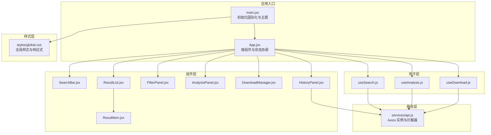
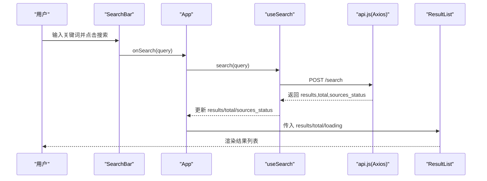
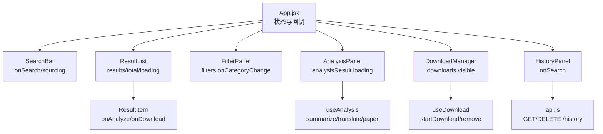
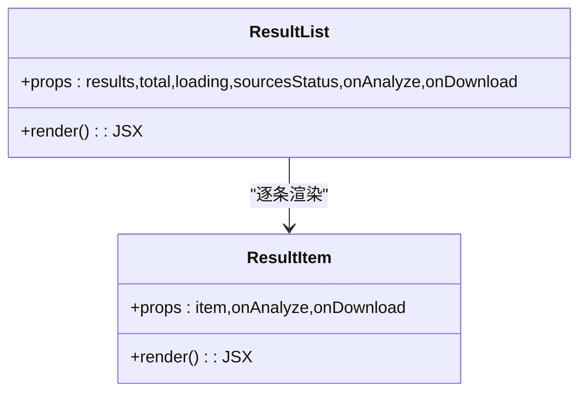
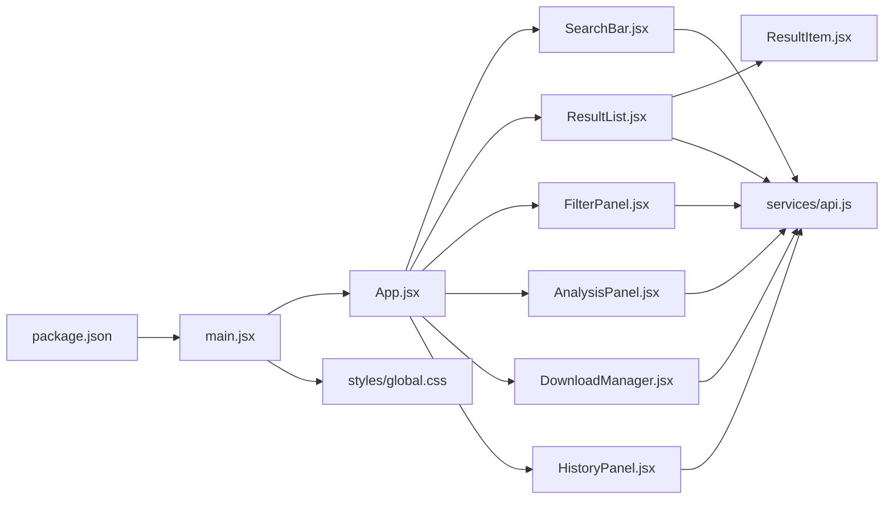

# 组件架构设计

<cite>
**本文引用的文件**
- [frontend/src/App.jsx](file://frontend/src/App.jsx)
- [frontend/src/main.jsx](file://frontend/src/main.jsx)
- [frontend/src/components/SearchBar.jsx](file://frontend/src/components/SearchBar.jsx)
- [frontend/src/components/ResultList.jsx](file://frontend/src/components/ResultList.jsx)
- [frontend/src/components/ResultItem.jsx](file://frontend/src/components/ResultItem.jsx)
- [frontend/src/components/FilterPanel.jsx](file://frontend/src/components/FilterPanel.jsx)
- [frontend/src/components/AnalysisPanel.jsx](file://frontend/src/components/AnalysisPanel.jsx)
- [frontend/src/components/DownloadManager.jsx](file://frontend/src/components/DownloadManager.jsx)
- [frontend/src/components/HistoryPanel.jsx](file://frontend/src/components/HistoryPanel.jsx)
- [frontend/src/hooks/useSearch.js](file://frontend/src/hooks/useSearch.js)
- [frontend/src/hooks/useAnalysis.js](file://frontend/src/hooks/useAnalysis.js)
- [frontend/src/hooks/useDownload.js](file://frontend/src/hooks/useDownload.js)
- [frontend/src/services/api.js](file://frontend/src/services/api.js)
- [frontend/src/styles/global.css](file://frontend/src/styles/global.css)
- [frontend/package.json](file://frontend/package.json)
</cite>

## 目录
1. [引言](#引言)
2. [项目结构](#项目结构)
3. [核心组件](#核心组件)
4. [架构总览](#架构总览)
5. [组件详细分析](#组件详细分析)
6. [依赖关系分析](#依赖关系分析)
7. [性能考量](#性能考量)
8. [故障排查指南](#故障排查指南)
9. [结论](#结论)
10. [附录](#附录)

## 引言
本设计文档面向前端组件系统，系统采用 React + Ant Design 构建，围绕“搜索—筛选—分析—下载—历史”主流程组织组件与状态。核心理念包括：
- 单向数据流与状态提升：由根组件统一管理全局状态与副作用，子组件通过回调接收数据与行为。
- 可组合的业务钩子：useSearch/useAnalysis/useDownload 封装独立业务域的状态与 API 调用，便于复用与测试。
- 组件职责清晰：展示型组件负责渲染，容器型组件负责状态与交互，面板型组件负责局部交互窗口。
- 响应式与可访问性：通过媒体查询适配移动端，使用语义化标签与图标提升可用性。

## 项目结构
前端采用按功能模块划分的目录组织方式，核心文件分布如下：
- 组件层：components/* 提供页面级与业务级展示组件
- 钩子层：hooks/* 封装业务逻辑与副作用
- 服务层：services/api.js 统一封装 HTTP 客户端与拦截器
- 样式层：styles/global.css 提供全局样式与响应式规则
- 应用入口：main.jsx 初始化国际化与主题；App.jsx 作为根组件协调各子系统

图表来源
- [frontend/src/main.jsx](file://frontend/src/main.jsx#L1-L15)
- [frontend/src/App.jsx](file://frontend/src/App.jsx#L1-L149)
- [frontend/src/components/SearchBar.jsx](file://frontend/src/components/SearchBar.jsx#L1-L42)
- [frontend/src/components/ResultList.jsx](file://frontend/src/components/ResultList.jsx#L1-L58)
- [frontend/src/components/ResultItem.jsx](file://frontend/src/components/ResultItem.jsx#L1-L108)
- [frontend/src/components/FilterPanel.jsx](file://frontend/src/components/FilterPanel.jsx#L1-L52)
- [frontend/src/components/AnalysisPanel.jsx](file://frontend/src/components/AnalysisPanel.jsx#L1-L171)
- [frontend/src/components/DownloadManager.jsx](file://frontend/src/components/DownloadManager.jsx#L1-L114)
- [frontend/src/components/HistoryPanel.jsx](file://frontend/src/components/HistoryPanel.jsx#L1-L91)
- [frontend/src/hooks/useSearch.js](file://frontend/src/hooks/useSearch.js#L1-L74)
- [frontend/src/hooks/useAnalysis.js](file://frontend/src/hooks/useAnalysis.js#L1-L86)
- [frontend/src/hooks/useDownload.js](file://frontend/src/hooks/useDownload.js#L1-L78)
- [frontend/src/services/api.js](file://frontend/src/services/api.js#L1-L32)
- [frontend/src/styles/global.css](file://frontend/src/styles/global.css#L1-L156)

章节来源
- [frontend/src/main.jsx](file://frontend/src/main.jsx#L1-L15)
- [frontend/src/App.jsx](file://frontend/src/App.jsx#L1-L149)
- [frontend/src/styles/global.css](file://frontend/src/styles/global.css#L1-L156)
- [frontend/package.json](file://frontend/package.json#L1-L24)

## 核心组件
本系统的核心组件围绕搜索主流程展开，职责与接口如下：

- SearchBar（搜索栏）
  - 功能：提供关键词输入与多源选择，触发搜索回调
  - 关键属性：onSearch, sources, onSourcesChange, loading
  - 事件：onSearch(value) -> 执行搜索
  - 设计要点：使用受控组件与防抖策略（在父组件中通过钩子实现）

- ResultList（结果列表）
  - 功能：展示搜索结果、总数统计、各源状态指示
  - 关键属性：results, total, loading, sourcesStatus, onAnalyze, onDownload
  - 事件：onAnalyze(item), onDownload(id,title)
  - 设计要点：空态与加载态处理；分页/截断由后端控制，前端做客户端过滤

- ResultItem（单条结果）
  - 功能：渲染单个结果项，提供分析、翻译、下载等操作入口
  - 关键属性：item, onAnalyze, onDownload
  - 事件：点击“AI分析”、“翻译”、“下载PDF”
  - 设计要点：基于类别与来源设置标签颜色；对长文本进行省略显示

- FilterPanel（筛选面板）
  - 功能：按内容分类进行筛选，显示各类别数量
  - 关键属性：filters, onCategoryChange, resultCounts
  - 事件：Radio.Group 改变时调用 onCategoryChange
  - 设计要点：与 App.jsx 中的计算结果计数联动

- AnalysisPanel（分析抽屉）
  - 功能：提供摘要、翻译、论文深度分析三类能力
  - 关键属性：visible, onClose, selectedItem, analysisResult, loading, activeTab, onTabChange, onSummarize, onTranslate, onAnalyzePaper
  - 事件：切换标签、触发摘要/翻译/论文分析
  - 设计要点：首次打开自动触发摘要；根据内容类型启用/禁用功能

- DownloadManager（下载管理）
  - 功能：集中展示下载任务状态与进度，支持移除与查看文件
  - 关键属性：downloads, visible, onToggle, onRemove
  - 事件：点击下载链接、删除任务
  - 设计要点：悬浮在右下角，支持折叠；活跃任务定时轮询更新

- HistoryPanel（历史记录）
  - 功能：展示最近搜索历史，支持一键回放与清空
  - 关键属性：visible, onClose, onSearch
  - 事件：点击历史项触发 onSearch
  - 设计要点：进入时懒加载；支持批量清空

章节来源
- [frontend/src/components/SearchBar.jsx](file://frontend/src/components/SearchBar.jsx#L1-L42)
- [frontend/src/components/ResultList.jsx](file://frontend/src/components/ResultList.jsx#L1-L58)
- [frontend/src/components/ResultItem.jsx](file://frontend/src/components/ResultItem.jsx#L1-L108)
- [frontend/src/components/FilterPanel.jsx](file://frontend/src/components/FilterPanel.jsx#L1-L52)
- [frontend/src/components/AnalysisPanel.jsx](file://frontend/src/components/AnalysisPanel.jsx#L1-L171)
- [frontend/src/components/DownloadManager.jsx](file://frontend/src/components/DownloadManager.jsx#L1-L114)
- [frontend/src/components/HistoryPanel.jsx](file://frontend/src/components/HistoryPanel.jsx#L1-L91)

## 架构总览
系统采用“根组件协调 + 钩子封装 + 组件渲染”的三层架构：
- 根组件 App.jsx 负责：
  - 合并 useSearch/useAnalysis/useDownload 的状态与方法
  - 计算筛选结果与分类计数
  - 传递属性到子组件，暴露回调给子组件
- 钩子层 useSearch/useAnalysis/useDownload 封装：
  - 状态管理（useState）
  - API 调用（services/api.js）
  - 业务副作用（轮询、过滤、聚合）
- 组件层负责：
  - 展示与交互
  - 通过 props 与回调与上层通信

图表来源
- [frontend/src/components/SearchBar.jsx](file://frontend/src/components/SearchBar.jsx#L12-L17)
- [frontend/src/App.jsx](file://frontend/src/App.jsx#L19-L28)
- [frontend/src/hooks/useSearch.js](file://frontend/src/hooks/useSearch.js#L19-L50)
- [frontend/src/services/api.js](file://frontend/src/services/api.js#L1-L32)
- [frontend/src/components/ResultList.jsx](file://frontend/src/components/ResultList.jsx#L7-L14)

## 组件详细分析

### 组件关系与数据流
- 数据自顶向下流动：App.jsx 通过 props 将状态与回调传递给子组件
- 事件自底向上冒泡：子组件通过回调通知 App.jsx 更新状态或触发副作用
- 过滤与聚合：App.jsx 计算分类计数与过滤后的结果，减少子组件重复计算

图表来源
- [frontend/src/App.jsx](file://frontend/src/App.jsx#L16-L148)
- [frontend/src/components/SearchBar.jsx](file://frontend/src/components/SearchBar.jsx#L12-L17)
- [frontend/src/components/ResultList.jsx](file://frontend/src/components/ResultList.jsx#L7-L14)
- [frontend/src/components/FilterPanel.jsx](file://frontend/src/components/FilterPanel.jsx#L16-L17)
- [frontend/src/components/AnalysisPanel.jsx](file://frontend/src/components/AnalysisPanel.jsx#L11-L22)
- [frontend/src/components/DownloadManager.jsx](file://frontend/src/components/DownloadManager.jsx#L22-L23)
- [frontend/src/components/HistoryPanel.jsx](file://frontend/src/components/HistoryPanel.jsx#L8-L8)
- [frontend/src/hooks/useAnalysis.js](file://frontend/src/hooks/useAnalysis.js#L4-L84)
- [frontend/src/hooks/useDownload.js](file://frontend/src/hooks/useDownload.js#L4-L77)
- [frontend/src/services/api.js](file://frontend/src/services/api.js#L1-L32)

### SearchBar 组件分析
- 属性接口
  - onSearch: (value: string) => void
  - sources: string[]
  - onSourcesChange: (sources: string[]) => void
  - loading: boolean
- 事件处理
  - 输入框回车或点击按钮时，清理空白并调用 onSearch
  - 多源选择通过 Checkbox.Group 受控更新
- 设计要点
  - 使用 Ant Design Input.Search 与 Checkbox.Group，保持一致的 UI/UX
  - loading 状态直接透传到 Input.Search，提升反馈一致性

章节来源
- [frontend/src/components/SearchBar.jsx](file://frontend/src/components/SearchBar.jsx#L12-L41)

### ResultList 与 ResultItem 分析
- ResultList
  - 属性：results, total, loading, sourcesStatus, onAnalyze, onDownload
  - 行为：加载态、空态、总数与来源状态展示、逐条渲染 ResultItem
- ResultItem
  - 属性：item, onAnalyze, onDownload
  - 行为：渲染标题、摘要、元信息（作者、时间、来源域名）、操作按钮
  - 特殊逻辑：arXiv 来源且存在 arxiv_id 时才显示“下载PDF”

图表来源
- [frontend/src/components/ResultList.jsx](file://frontend/src/components/ResultList.jsx#L7-L57)
- [frontend/src/components/ResultItem.jsx](file://frontend/src/components/ResultItem.jsx#L37-L107)

章节来源
- [frontend/src/components/ResultList.jsx](file://frontend/src/components/ResultList.jsx#L1-L58)
- [frontend/src/components/ResultItem.jsx](file://frontend/src/components/ResultItem.jsx#L1-L108)

### FilterPanel 分析
- 属性：filters, onCategoryChange, resultCounts
- 行为：以 Radio.Group 展示分类选项，右侧显示对应计数；变更时调用 onCategoryChange
- 与 App.jsx 的协作：App.jsx 通过 useMemo 计算 resultCounts 并传入

章节来源
- [frontend/src/components/FilterPanel.jsx](file://frontend/src/components/FilterPanel.jsx#L16-L51)
- [frontend/src/App.jsx](file://frontend/src/App.jsx#L59-L73)

### AnalysisPanel 分析
- 属性：visible, onClose, selectedItem, analysisResult, loading, activeTab, onTabChange, onSummarize, onTranslate, onAnalyzePaper
- 生命周期：首次打开且未有摘要时，自动基于 snippet/title 触发摘要
- 三类标签页：
  - 摘要：支持生成与展示关键要点
  - 翻译：支持触发翻译
  - 论文分析：仅学术论文可用，返回结构化段落
- 错误处理：各接口异常时在对应区域展示错误信息

章节来源
- [frontend/src/components/AnalysisPanel.jsx](file://frontend/src/components/AnalysisPanel.jsx#L11-L171)
- [frontend/src/hooks/useAnalysis.js](file://frontend/src/hooks/useAnalysis.js#L11-L57)

### DownloadManager 分析
- 属性：downloads, visible, onToggle, onRemove
- 行为：悬浮在右下角，支持折叠；显示待下载/下载中/完成/失败四种状态；完成时提供下载链接；支持移除
- 轮询：当存在活跃任务时每 2 秒刷新一次状态

章节来源
- [frontend/src/components/DownloadManager.jsx](file://frontend/src/components/DownloadManager.jsx#L22-L113)
- [frontend/src/hooks/useDownload.js](file://frontend/src/hooks/useDownload.js#L50-L64)

### HistoryPanel 分析
- 属性：visible, onClose, onSearch
- 行为：进入时拉取最近历史；点击历史项触发 onSearch 并关闭抽屉；支持清空历史
- 与 API 的交互：GET /history?limit=50；DELETE /history

章节来源
- [frontend/src/components/HistoryPanel.jsx](file://frontend/src/components/HistoryPanel.jsx#L8-L90)
- [frontend/src/services/api.js](file://frontend/src/services/api.js#L10-L29)

### 钩子函数分析

#### useSearch（搜索域）
- 状态：results, total, sourcesStatus, loading, error, query, filters
- 方法：search, updateSources, updateCategory
- 逻辑要点：
  - search 发起 /search 请求，合并客户端分类过滤
  - updateSources/updateCategory 更新 filters，影响后续搜索与计算

章节来源
- [frontend/src/hooks/useSearch.js](file://frontend/src/hooks/useSearch.js#L6-L73)

#### useAnalysis（分析域）
- 状态：analysisResult, loading, visible, selectedItem, activeTab
- 方法：summarize, translate, analyzePaper, openAnalysis, closeAnalysis
- 逻辑要点：
  - openAnalysis 清空上次结果并打开抽屉
  - 各分析接口异常时在对应字段写入错误对象，避免崩溃

章节来源
- [frontend/src/hooks/useAnalysis.js](file://frontend/src/hooks/useAnalysis.js#L4-L85)

#### useDownload（下载域）
- 状态：downloads, visible
- 方法：startDownload, removeDownload
- 轮询：当存在活跃任务时启动定时器，每 2 秒刷新一次状态
- 逻辑要点：新增任务置顶、去重活跃任务、失败静默处理

章节来源
- [frontend/src/hooks/useDownload.js](file://frontend/src/hooks/useDownload.js#L4-L77)

## 依赖关系分析
- 组件依赖
  - App.jsx 依赖所有业务组件与三个钩子
  - ResultList 依赖 ResultItem
  - AnalysisPanel/DownloadManager/HistoryPanel 依赖 services/api.js
- 外部依赖
  - React 生态：React、React DOM
  - UI 框架：Ant Design 与 @ant-design/icons
  - HTTP：axios
  - 构建：Vite

图表来源
- [frontend/src/App.jsx](file://frontend/src/App.jsx#L1-L149)
- [frontend/src/components/SearchBar.jsx](file://frontend/src/components/SearchBar.jsx#L1-L42)
- [frontend/src/components/ResultList.jsx](file://frontend/src/components/ResultList.jsx#L1-L58)
- [frontend/src/components/ResultItem.jsx](file://frontend/src/components/ResultItem.jsx#L1-L108)
- [frontend/src/components/FilterPanel.jsx](file://frontend/src/components/FilterPanel.jsx#L1-L52)
- [frontend/src/components/AnalysisPanel.jsx](file://frontend/src/components/AnalysisPanel.jsx#L1-L171)
- [frontend/src/components/DownloadManager.jsx](file://frontend/src/components/DownloadManager.jsx#L1-L114)
- [frontend/src/components/HistoryPanel.jsx](file://frontend/src/components/HistoryPanel.jsx#L1-L91)
- [frontend/src/services/api.js](file://frontend/src/services/api.js#L1-L32)
- [frontend/src/main.jsx](file://frontend/src/main.jsx#L1-L15)
- [frontend/src/styles/global.css](file://frontend/src/styles/global.css#L1-L156)
- [frontend/package.json](file://frontend/package.json#L1-L24)

章节来源
- [frontend/src/main.jsx](file://frontend/src/main.jsx#L1-L15)
- [frontend/src/services/api.js](file://frontend/src/services/api.js#L1-L32)
- [frontend/package.json](file://frontend/package.json#L11-L22)

## 性能考量
- 计算优化
  - App.jsx 使用 useMemo 计算分类计数与过滤结果，避免每次渲染重复计算
- 渲染优化
  - ResultList 在空结果与加载态下快速返回，减少不必要的 DOM 结构
  - ResultItem 对长文本使用省略显示，降低布局重排成本
- 网络与轮询
  - useDownload 仅在存在活跃任务时开启轮询，避免无效请求
  - api.js 设置合理超时与错误提示，减少无意义重试
- 样式与布局
  - 全局样式使用 Flex 布局与最小宽度约束，保证在窄屏下的可读性
  - 响应式断点设置在 768px，移动端优先的布局策略

章节来源
- [frontend/src/App.jsx](file://frontend/src/App.jsx#L59-L73)
- [frontend/src/components/ResultList.jsx](file://frontend/src/components/ResultList.jsx#L15-L25)
- [frontend/src/components/ResultItem.jsx](file://frontend/src/components/ResultItem.jsx#L96-L104)
- [frontend/src/hooks/useDownload.js](file://frontend/src/hooks/useDownload.js#L50-L64)
- [frontend/src/services/api.js](file://frontend/src/services/api.js#L4-L8)
- [frontend/src/styles/global.css](file://frontend/src/styles/global.css#L144-L155)

## 故障排查指南
- 搜索无结果或报错
  - 检查 useSearch.search 是否正确发起请求与处理异常
  - 查看 sourcesStatus 了解各源状态
- 分析功能异常
  - AnalysisPanel 在 loading 且无数据时会显示加载态；若出现错误，检查 useAnalysis 的错误字段
- 下载管理不更新
  - 确认存在活跃任务；检查轮询是否被启动；核对 /download/status 接口返回
- 历史记录为空
  - 确认 /history 接口返回格式；检查 HistoryPanel 的渲染逻辑
- 网络错误提示
  - api.js 已内置拦截器，针对 429/5xx/400/ECONNABORTED 等场景给出提示

章节来源
- [frontend/src/hooks/useSearch.js](file://frontend/src/hooks/useSearch.js#L43-L49)
- [frontend/src/hooks/useAnalysis.js](file://frontend/src/hooks/useAnalysis.js#L16-L23)
- [frontend/src/hooks/useDownload.js](file://frontend/src/hooks/useDownload.js#L50-L64)
- [frontend/src/components/HistoryPanel.jsx](file://frontend/src/components/HistoryPanel.jsx#L12-L26)
- [frontend/src/services/api.js](file://frontend/src/services/api.js#L10-L29)

## 结论
该组件系统通过“根组件状态提升 + 钩子封装 + 组件渲染”的模式实现了清晰的职责分离与良好的可维护性。组件间通过明确的属性与回调进行通信，配合钩子层的业务逻辑与副作用，形成稳定的数据流与交互链路。建议在后续迭代中进一步完善错误边界、可访问性与国际化支持，并持续优化性能与用户体验。

## 附录

### 组件开发规范与命名约定
- 文件命名：组件文件使用帕斯卡命名（如 SearchBar.jsx），与导出组件名一致
- 属性命名：使用动词短语描述行为（如 onSearch、onAnalyze），使用名词描述数据（如 results、loading）
- 回调签名：尽量保持单一职责，避免在回调中执行复杂逻辑
- 样式命名：使用语义化类名（如 .result-card、.download-manager），避免过度嵌套

### 响应式设计实现
- 断点：768px
- 布局：.results-section 使用 Flex，在窄屏下垂直堆叠；侧边栏宽度自适应
- 固定元素：.download-manager 固定在底部，支持移动端全宽展示

章节来源
- [frontend/src/styles/global.css](file://frontend/src/styles/global.css#L144-L155)

### 可访问性支持建议
- 为按钮与链接提供明确的文本与图标提示
- 使用语义化标签（如标题、段落）增强结构
- 为图片与图标提供替代文本或标题属性
- 确保键盘可聚焦与焦点可见性

### 性能优化技巧
- 使用 React.memo 或 useMemo 缓存昂贵计算与渲染
- 懒加载与虚拟滚动：对长列表采用分页或虚拟化
- 减少不必要的重渲染：将高频更新拆分为独立状态
- 图片与资源压缩：确保静态资源体积最小化