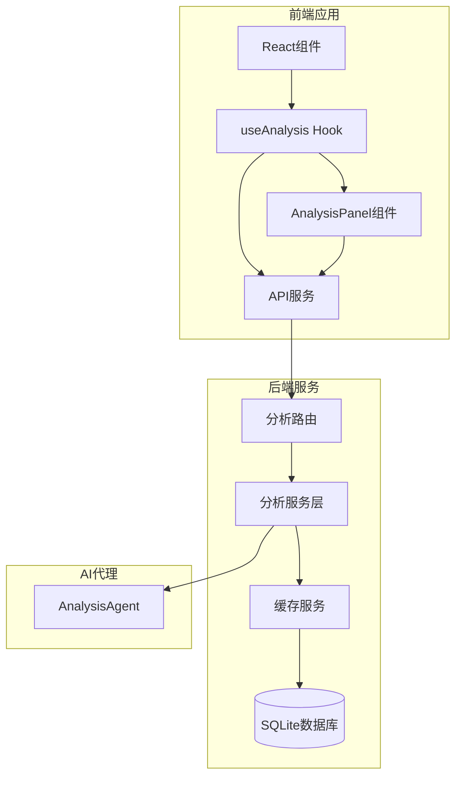
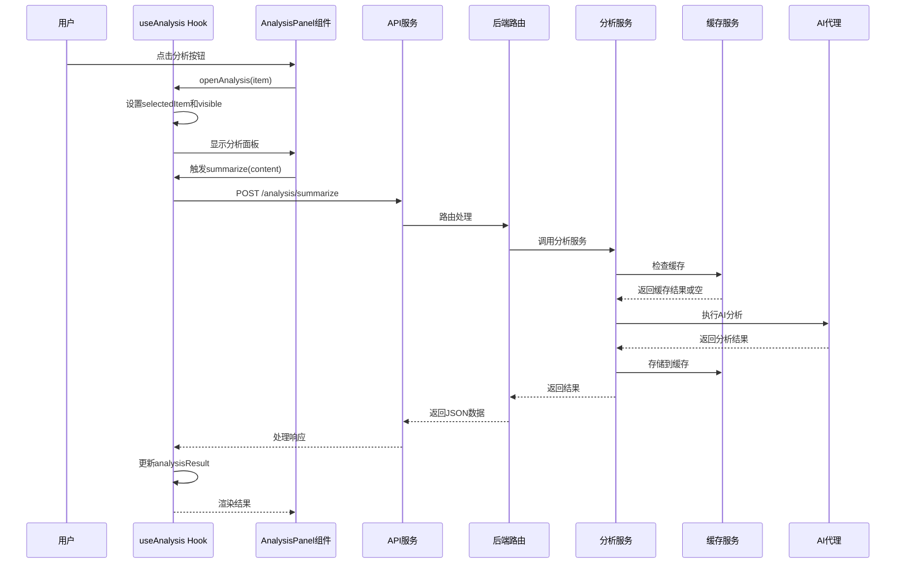
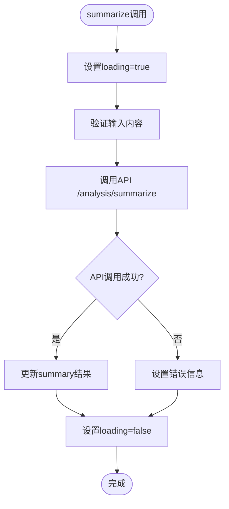
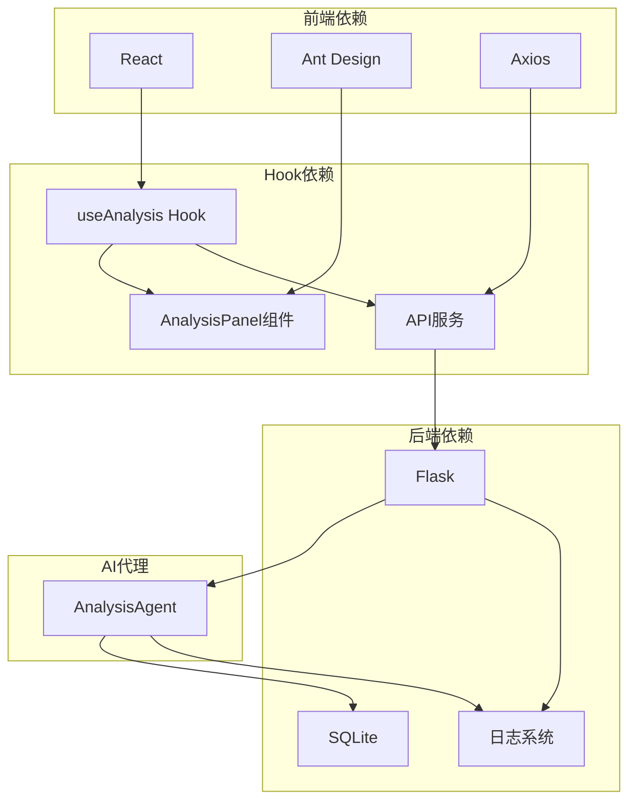

# useAnalysis Hook

<cite>
**本文档引用的文件**
- [useAnalysis.js](file://frontend/src/hooks/useAnalysis.js)
- [AnalysisPanel.jsx](file://frontend/src/components/AnalysisPanel.jsx)
- [api.js](file://frontend/src/services/api.js)
- [App.jsx](file://frontend/src/App.jsx)
- [analysis.py](file://backend/routes/analysis.py)
- [analysis_service.py](file://backend/services/analysis_service.py)
- [cache_service.py](file://backend/services/cache_service.py)
- [database.py](file://backend/models/database.py)
- [config.py](file://backend/config.py)
- [logger.py](file://backend/utils/logger.py)
</cite>

## 目录
1. [简介](#简介)
2. [项目结构](#项目结构)
3. [核心组件](#核心组件)
4. [架构概览](#架构概览)
5. [详细组件分析](#详细组件分析)
6. [依赖关系分析](#依赖关系分析)
7. [性能考虑](#性能考虑)
8. [故障排除指南](#故障排除指南)
9. [结论](#结论)

## 简介

useAnalysis Hook是本项目中用于AI分析功能的核心React Hook，负责管理分析任务的完整生命周期。该Hook实现了状态管理、进度监控、结果缓存等关键功能，为用户提供内容摘要、翻译和学术论文深度分析等AI服务。

该Hook采用函数式编程模式，通过React的useState和useCallback实现高效的状态管理和事件处理，同时集成了完整的错误处理和用户反馈机制。

## 项目结构

系统采用前后端分离架构，useAnalysis Hook位于前端React应用中，负责协调用户界面与后端AI分析服务的交互。

**图表来源**
- [useAnalysis.js](file://frontend/src/hooks/useAnalysis.js#L1-L86)
- [AnalysisPanel.jsx](file://frontend/src/components/AnalysisPanel.jsx#L1-L171)
- [api.js](file://frontend/src/services/api.js#L1-L32)
- [analysis.py](file://backend/routes/analysis.py#L1-L66)

**章节来源**
- [useAnalysis.js](file://frontend/src/hooks/useAnalysis.js#L1-L86)
- [App.jsx](file://frontend/src/App.jsx#L1-L149)

## 核心组件

useAnalysis Hook提供了完整的AI分析功能，包括以下核心能力：

### 状态管理
- 分析结果存储：`analysisResult` - 存储所有分析任务的结果
- 加载状态：`loading` - 显示分析进行中的UI状态
- 可见性控制：`visible` - 控制分析面板的显示/隐藏
- 选中项目：`selectedItem` - 当前分析的对象
- 活动标签：`activeTab` - 当前激活的分析选项卡

### 分析功能
- 内容摘要：`summarize()` - 生成内容摘要和关键要点
- 文本翻译：`translate()` - 支持多语言翻译
- 论文分析：`analyzePaper()` - 学术论文深度分析
- 面板控制：`openAnalysis()`, `closeAnalysis()` - 分析面板的打开和关闭

**章节来源**
- [useAnalysis.js](file://frontend/src/hooks/useAnalysis.js#L4-L84)

## 架构概览

useAnalysis Hook采用分层架构设计，确保了良好的可维护性和扩展性。

**图表来源**
- [useAnalysis.js](file://frontend/src/hooks/useAnalysis.js#L11-L24)
- [AnalysisPanel.jsx](file://frontend/src/components/AnalysisPanel.jsx#L23-L28)
- [api.js](file://frontend/src/services/api.js#L10-L29)
- [analysis.py](file://backend/routes/analysis.py#L10-L25)
- [analysis_service.py](file://backend/services/analysis_service.py#L25-L44)

## 详细组件分析

### useAnalysis Hook实现

useAnalysis Hook使用React Hooks模式实现，提供了完整的分析功能生命周期管理。

#### 状态定义
Hook定义了五个核心状态变量：
- `analysisResult`: 使用对象结构存储不同类型分析结果
- `loading`: 布尔值控制加载状态
- `visible`: 控制分析面板可见性
- `selectedItem`: 当前分析的项目对象
- `activeTab`: 当前激活的选项卡标识

#### 分析方法实现

##### 内容摘要功能

**图表来源**
- [useAnalysis.js](file://frontend/src/hooks/useAnalysis.js#L11-L24)

##### 翻译功能
翻译功能支持指定目标语言，默认为中文：
- 参数：`content`(必需)、`targetLang`(可选，默认'zh')
- 返回：翻译后的文本、源语言信息

##### 论文分析功能
专门针对学术论文的深度分析：
- 输入：论文标题、摘要、片段
- 输出：摘要概述、研究方法、创新点、实验结果、结论与局限性

**章节来源**
- [useAnalysis.js](file://frontend/src/hooks/useAnalysis.js#L11-L57)

### AnalysisPanel组件集成

AnalysisPanel组件作为UI层，与useAnalysis Hook紧密协作：

#### 自动化触发机制
当分析面板可见且没有摘要结果时，自动触发内容摘要生成：
- 检测`visible`和`selectedItem`状态变化
- 提取项目内容（snippet或title）
- 自动调用`onSummarize`回调

#### 多选项卡设计
组件包含三个选项卡：
- **摘要**：内容摘要和关键要点
- **翻译**：文本翻译功能
- **论文分析**：学术论文深度分析

#### 条件渲染逻辑
每个选项卡根据状态动态渲染：
- 加载状态：显示旋转指示器
- 无数据：显示操作按钮
- 错误状态：显示错误信息
- 成功状态：显示分析结果

**章节来源**
- [AnalysisPanel.jsx](file://frontend/src/components/AnalysisPanel.jsx#L23-L127)

### API服务层

前端API服务提供了统一的HTTP请求接口：

#### 请求配置
- 基础URL：`/api`
- 超时时间：60秒
- 内容类型：application/json
- 响应拦截器：统一处理错误状态码

#### 错误处理策略
- 429：请求过于频繁，提示用户稍后再试
- 500：服务器内部错误，显示详细错误信息
- 400：请求参数错误，显示警告
- 超时：网络连接失败，提示重试

**章节来源**
- [api.js](file://frontend/src/services/api.js#L4-L31)

### 后端服务架构

后端采用Flask框架，实现了完整的分析服务层：

#### 路由设计
三个主要分析路由：
- `/analysis/summarize` - 内容摘要
- `/analysis/translate` - 文本翻译  
- `/analysis/paper` - 论文分析

每个路由都包含：
- JSON请求体解析
- 输入参数验证
- 异常捕获和错误响应
- 日志记录

#### 分析服务层
分析服务层实现了智能缓存机制：
- 缓存键生成：基于内容和分析类型的哈希
- 缓存策略：7天有效期
- 懒加载AI代理：按需初始化

#### 缓存系统
使用SQLite数据库实现持久化缓存：
- 表结构：content_hash、analysis_type、result、timestamp
- 过期清理：自动删除过期缓存条目
- 性能优化：避免重复AI调用

**章节来源**
- [analysis.py](file://backend/routes/analysis.py#L10-L66)
- [analysis_service.py](file://backend/services/analysis_service.py#L25-L91)
- [cache_service.py](file://backend/services/cache_service.py#L57-L87)

## 依赖关系分析

系统各组件之间的依赖关系清晰明确：

**图表来源**
- [useAnalysis.js](file://frontend/src/hooks/useAnalysis.js#L1-L2)
- [AnalysisPanel.jsx](file://frontend/src/components/AnalysisPanel.jsx#L1-L7)
- [api.js](file://frontend/src/services/api.js#L1-L8)
- [analysis.py](file://backend/routes/analysis.py#L1-L7)

**章节来源**
- [App.jsx](file://frontend/src/App.jsx#L1-L149)
- [config.py](file://backend/config.py#L15-L85)

## 性能考虑

### 缓存策略
系统实现了多层次的缓存机制以提升性能：

#### 内容摘要缓存
- 缓存键：内容MD5哈希 + 分析类型
- 有效期：7天
- 自动清理：过期缓存自动删除

#### 数据库优化
- 线程本地连接：避免并发问题
- WAL模式：提高写入性能
- 外键约束：保证数据完整性

#### 前端性能优化
- useCallback优化：防止不必要的重新渲染
- 条件渲染：只在需要时执行分析
- 状态合并：批量更新分析结果

### 错误处理和重试机制

#### 前端错误处理
- 统一错误消息：通过Ant Design消息组件显示
- 网络异常处理：超时、连接失败等情况
- 用户友好的错误提示

#### 后端容错机制
- 异常捕获：所有分析操作都在try-catch块中
- 详细日志：记录错误详情和堆栈信息
- 平滑降级：缓存未命中时直接调用AI服务

**章节来源**
- [cache_service.py](file://backend/services/cache_service.py#L67-L87)
- [analysis_service.py](file://backend/services/analysis_service.py#L32-L43)
- [api.js](file://frontend/src/services/api.js#L10-L29)

## 故障排除指南

### 常见问题诊断

#### 分析结果为空
1. 检查网络连接是否正常
2. 验证AI服务是否可用
3. 确认缓存是否正常工作

#### 错误状态码处理
- **400错误**：检查请求参数格式
- **429错误**：等待一段时间后重试
- **500错误**：查看服务器日志

#### 缓存问题
- 清理过期缓存条目
- 检查数据库连接状态
- 验证缓存键生成逻辑

### 调试建议

#### 前端调试
- 在浏览器开发者工具中查看网络请求
- 检查React DevTools中的状态变化
- 监控API调用响应时间

#### 后端调试
- 查看日志输出获取详细错误信息
- 验证AI代理配置正确性
- 检查数据库表结构和索引

**章节来源**
- [logger.py](file://backend/utils/logger.py#L5-L23)
- [analysis.py](file://backend/routes/analysis.py#L22-L24)

## 结论

useAnalysis Hook展现了现代React应用的最佳实践，通过精心设计的状态管理、完善的错误处理和高效的缓存机制，为用户提供了流畅的AI分析体验。

### 主要优势
- **模块化设计**：清晰的职责分离和组件边界
- **性能优化**：智能缓存和条件渲染减少不必要的计算
- **用户体验**：完整的加载状态和错误反馈机制
- **可扩展性**：易于添加新的分析类型和功能

### 技术亮点
- 函数式编程模式的应用
- 前后端分离架构的完美结合
- 持久化缓存系统的实现
- 完善的日志和错误处理机制

该Hook为类似AI分析功能的开发提供了优秀的参考模板，展示了如何在实际项目中平衡性能、可维护性和用户体验。