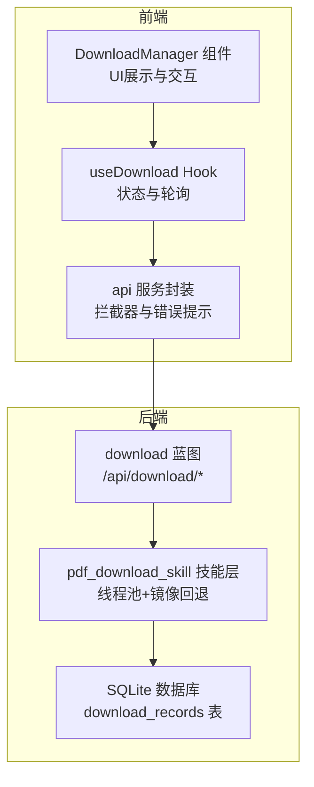
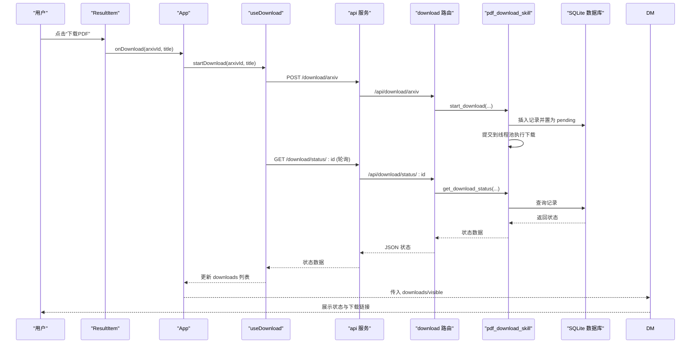
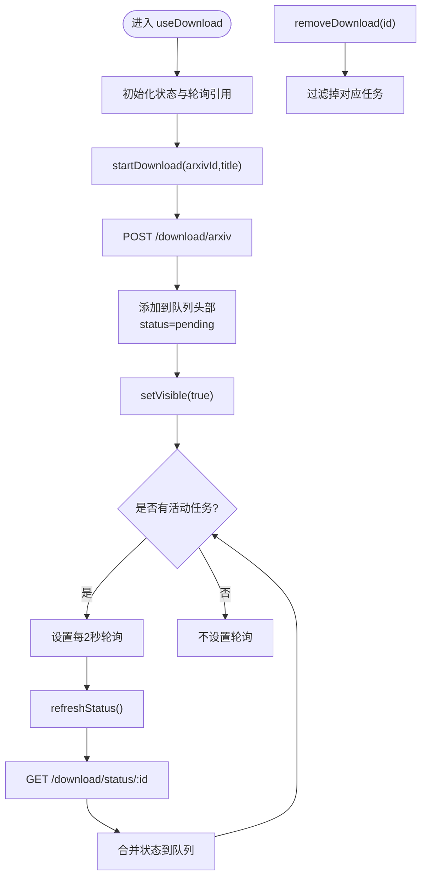
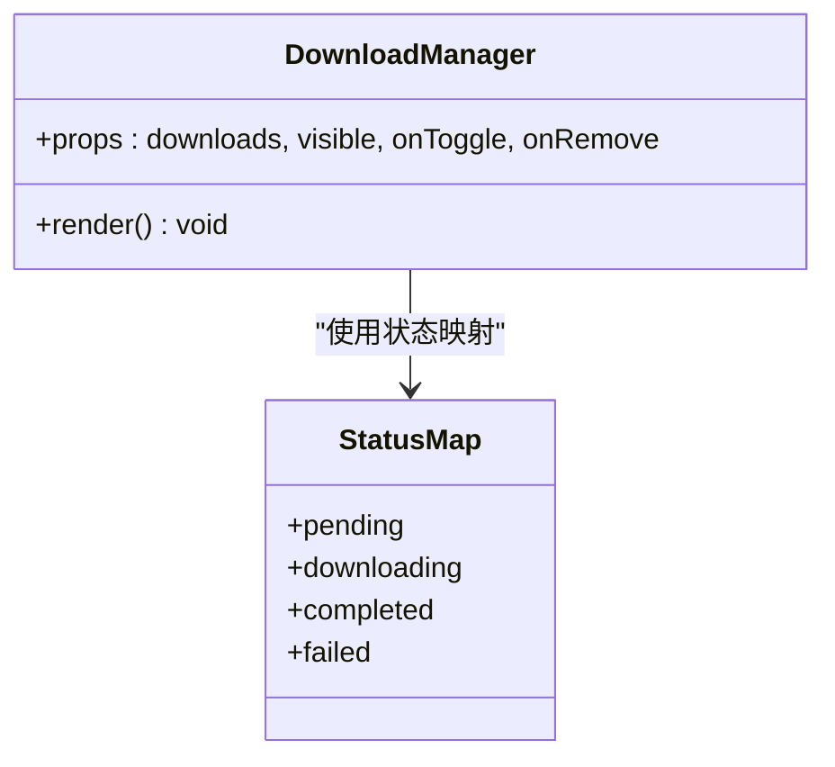
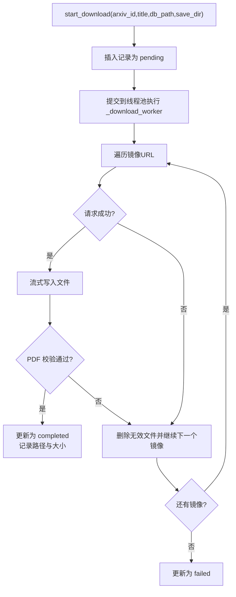
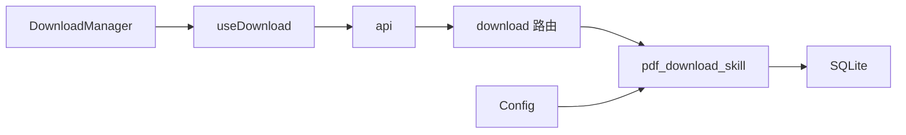

# useDownload Hook

<cite>
**本文引用的文件**
- [frontend/src/hooks/useDownload.js](file://frontend/src/hooks/useDownload.js)
- [frontend/src/components/DownloadManager.jsx](file://frontend/src/components/DownloadManager.jsx)
- [frontend/src/services/api.js](file://frontend/src/services/api.js)
- [frontend/src/App.jsx](file://frontend/src/App.jsx)
- [frontend/src/components/ResultItem.jsx](file://frontend/src/components/ResultItem.jsx)
- [backend/routes/download.py](file://backend/routes/download.py)
- [.qoder/skills/pdf_download_skill.py](file://.qoder/skills/pdf_download_skill.py)
- [backend/models/database.py](file://backend/models/database.py)
- [backend/models/schemas.py](file://backend/models/schemas.py)
- [backend/config.py](file://backend/config.py)
</cite>

## 目录
1. [简介](#简介)
2. [项目结构](#项目结构)
3. [核心组件](#核心组件)
4. [架构总览](#架构总览)
5. [详细组件分析](#详细组件分析)
6. [依赖分析](#依赖分析)
7. [性能考虑](#性能考虑)
8. [故障排除指南](#故障排除指南)
9. [结论](#结论)

## 简介
本文件系统性地解析前端 useDownload Hook 的设计与实现，重点覆盖以下方面：
- 并发控制机制：线程池与最大并发数配置
- 下载队列管理：状态流转与轮询调度
- 状态跟踪：pending/downloading/completed/failed 的实时更新
- 生命周期管理：开始、暂停、取消、重试（当前未实现暂停/取消）
- 进度更新与UI同步：轮询驱动的状态刷新
- 下载历史与持久化：SQLite 表结构与记录维护
- 与 DownloadManager 组件的集成模式
- 性能优化与常见失败处理策略

## 项目结构
该下载子系统由前端 Hook、后端路由与技能层、数据库三层组成，职责清晰分离：
- 前端：useDownload Hook 负责状态管理与轮询；DownloadManager 负责 UI 展示与交互
- 后端：Flask 路由负责接收请求、调用技能层；技能层执行实际下载与状态写入
- 数据库：SQLite 存储下载记录与缓存表

图表来源
- [frontend/src/hooks/useDownload.js](file://frontend/src/hooks/useDownload.js#L1-L78)
- [frontend/src/components/DownloadManager.jsx](file://frontend/src/components/DownloadManager.jsx#L1-L114)
- [frontend/src/services/api.js](file://frontend/src/services/api.js#L1-L32)
- [backend/routes/download.py](file://backend/routes/download.py#L1-L98)
- [.qoder/skills/pdf_download_skill.py](file://.qoder/skills/pdf_download_skill.py#L1-L146)
- [backend/models/database.py](file://backend/models/database.py#L1-L51)

章节来源
- [frontend/src/hooks/useDownload.js](file://frontend/src/hooks/useDownload.js#L1-L78)
- [backend/routes/download.py](file://backend/routes/download.py#L1-L98)

## 核心组件
- useDownload Hook：集中管理下载列表、可见性、启动下载、移除任务与轮询刷新
- DownloadManager 组件：渲染下载队列、状态徽标、文件大小、下载链接与删除操作
- api 服务：统一的 HTTP 客户端，内置响应拦截器与错误提示
- pdf_download_skill 技能层：后台线程池执行下载、镜像回退、状态更新与校验
- 数据库：download_records 表存储下载记录，支持查询与历史导出

章节来源
- [frontend/src/hooks/useDownload.js](file://frontend/src/hooks/useDownload.js#L1-L78)
- [frontend/src/components/DownloadManager.jsx](file://frontend/src/components/DownloadManager.jsx#L1-L114)
- [frontend/src/services/api.js](file://frontend/src/services/api.js#L1-L32)
- [.qoder/skills/pdf_download_skill.py](file://.qoder/skills/pdf_download_skill.py#L1-L146)
- [backend/models/schemas.py](file://backend/models/schemas.py#L28-L36)

## 架构总览
从用户点击“下载PDF”到文件可下载的完整流程如下：

图表来源
- [frontend/src/components/ResultItem.jsx](file://frontend/src/components/ResultItem.jsx#L94-L103)
- [frontend/src/App.jsx](file://frontend/src/App.jsx#L52-L57)
- [frontend/src/hooks/useDownload.js](file://frontend/src/hooks/useDownload.js#L9-L24)
- [frontend/src/services/api.js](file://frontend/src/services/api.js#L4-L8)
- [backend/routes/download.py](file://backend/routes/download.py#L14-L39)
- [.qoder/skills/pdf_download_skill.py](file://.qoder/skills/pdf_download_skill.py#L21-L48)
- [backend/models/database.py](file://backend/models/database.py#L36-L43)

## 详细组件分析

### useDownload Hook 分析
- 状态与可见性
  - downloads：数组，元素包含 id、title、status、file_size 等字段
  - visible：控制 DownloadManager 的展开/收起
- 启动下载
  - 调用 POST /download/arxiv，成功后在队列头部插入新任务，并设置可见性
- 轮询刷新
  - 仅对处于 pending 或 downloading 的任务进行轮询
  - 每 2 秒一次，调用 GET /download/status/:id 获取最新状态并合并到队列
  - 轮询开关：当存在活动任务时开启定时器，否则关闭
- 移除任务
  - 支持按 id 过滤移除，用于清理已完成或失败的任务

图表来源
- [frontend/src/hooks/useDownload.js](file://frontend/src/hooks/useDownload.js#L4-L68)

章节来源
- [frontend/src/hooks/useDownload.js](file://frontend/src/hooks/useDownload.js#L1-L78)

### DownloadManager 组件分析
- 渲染逻辑
  - 当队列为空时不显示
  - 计算活动任务数量并在标题栏显示徽标
  - 使用 Ant Design 的 List/Progress/Badge/Typography/Button 组合展示
- 状态映射
  - pending/downloading/completed/failed 对应不同图标与颜色
- 功能按钮
  - completed 状态下提供下载链接
  - 删除按钮用于移除任务

图表来源
- [frontend/src/components/DownloadManager.jsx](file://frontend/src/components/DownloadManager.jsx#L15-L20)
- [frontend/src/components/DownloadManager.jsx](file://frontend/src/components/DownloadManager.jsx#L22-L113)

章节来源
- [frontend/src/components/DownloadManager.jsx](file://frontend/src/components/DownloadManager.jsx#L1-L114)

### 并发控制与队列管理
- 技能层并发
  - 全局线程池 max_workers=3，限制同时下载任务数
  - 每个下载任务独立线程，互不影响
- 镜像回退
  - 默认镜像列表包含 arxiv.org 与 cn.arxiv.org
  - 逐个尝试，任一成功即保存并校验
- 状态更新
  - 写入 download_records 表，字段包括 status、pdf_path、file_size 等
- 最大并发配置
  - 通过配置项 DOWNLOAD_SETTINGS 中的 max_concurrent_downloads 控制线程池大小

图表来源
- [.qoder/skills/pdf_download_skill.py](file://.qoder/skills/pdf_download_skill.py#L21-L88)
- [backend/config.py](file://backend/config.py#L62-L65)

章节来源
- [.qoder/skills/pdf_download_skill.py](file://.qoder/skills/pdf_download_skill.py#L1-L146)
- [backend/config.py](file://backend/config.py#L62-L65)

### 状态跟踪与生命周期
- 前端状态
  - pending：刚创建，尚未开始下载
  - downloading：正在下载
  - completed：下载完成，可提供下载链接
  - failed：下载失败
- 后端状态
  - 通过 get_download_status 查询 download_records 表返回
- 生命周期事件
  - 开始：插入记录并提交线程池
  - 下载中：更新为 downloading
  - 成功：校验通过后更新为 completed，记录文件路径与大小
  - 失败：所有镜像均失败后更新为 failed

章节来源
- [frontend/src/hooks/useDownload.js](file://frontend/src/hooks/useDownload.js#L26-L48)
- [backend/routes/download.py](file://backend/routes/download.py#L42-L56)
- [.qoder/skills/pdf_download_skill.py](file://.qoder/skills/pdf_download_skill.py#L91-L105)
- [backend/models/schemas.py](file://backend/models/schemas.py#L28-L36)

### 进度更新与 UI 同步
- 前端轮询
  - 每 2 秒对活动任务发起一次状态查询
  - 将后端返回的状态合并到本地队列，触发 UI 重新渲染
- UI 展示
  - 下载中显示进度条
  - 文件大小来自后端返回的 file_size 字段
- 注意
  - 当前 UI 中下载中的进度条为占位值，实际进度需后端返回或前端基于下载字节计算

章节来源
- [frontend/src/hooks/useDownload.js](file://frontend/src/hooks/useDownload.js#L26-L48)
- [frontend/src/components/DownloadManager.jsx](file://frontend/src/components/DownloadManager.jsx#L93-L101)

### 下载历史与持久化
- 数据表
  - download_records：存储下载记录，含标题、URL、状态、文件路径、大小、时间戳等
- 历史接口
  - GET /api/download/history：返回全部下载记录
- 初始化
  - 数据库初始化时创建 download_records 表
- 清理策略
  - 当前未见自动清理逻辑；可通过业务需求扩展定期清理过期记录

章节来源
- [backend/models/schemas.py](file://backend/models/schemas.py#L28-L36)
- [backend/routes/download.py](file://backend/routes/download.py#L85-L97)
- [backend/models/database.py](file://backend/models/database.py#L36-L43)

### 与 DownloadManager 的集成模式
- App 将 useDownload 的状态与方法传递给 DownloadManager
- DownloadManager 负责渲染与用户交互（展开/收起、删除任务、下载文件）
- ResultItem 在检测到 arXiv 来源时显示“下载PDF”按钮，点击后调用 App 的下载处理函数

章节来源
- [frontend/src/App.jsx](file://frontend/src/App.jsx#L44-L50)
- [frontend/src/App.jsx](file://frontend/src/App.jsx#L134-L139)
- [frontend/src/components/ResultItem.jsx](file://frontend/src/components/ResultItem.jsx#L94-L103)

## 依赖分析
- 前端依赖
  - useDownload 依赖 api 服务进行 HTTP 请求
  - DownloadManager 依赖 Ant Design 组件库
- 后端依赖
  - download 路由依赖 pdf_download_skill 执行下载
  - pdf_download_skill 依赖 SQLite 与 requests 库
- 配置依赖
  - 线程池大小与镜像列表来自配置对象

图表来源
- [frontend/src/hooks/useDownload.js](file://frontend/src/hooks/useDownload.js#L1-L2)
- [frontend/src/services/api.js](file://frontend/src/services/api.js#L1-L32)
- [backend/routes/download.py](file://backend/routes/download.py#L1-L11)
- [.qoder/skills/pdf_download_skill.py](file://.qoder/skills/pdf_download_skill.py#L1-L10)
- [backend/config.py](file://backend/config.py#L62-L65)

章节来源
- [frontend/src/hooks/useDownload.js](file://frontend/src/hooks/useDownload.js#L1-L78)
- [frontend/src/services/api.js](file://frontend/src/services/api.js#L1-L32)
- [backend/routes/download.py](file://backend/routes/download.py#L1-L98)
- [.qoder/skills/pdf_download_skill.py](file://.qoder/skills/pdf_download_skill.py#L1-L146)
- [backend/config.py](file://backend/config.py#L62-L65)

## 性能考虑
- 并发限制
  - 线程池 max_workers=3，避免过多并发导致资源争用与网络抖动
  - 可通过配置项调整以适配环境
- 轮询频率
  - 2 秒轮询一次，平衡实时性与服务器压力
  - 可根据任务量动态调整轮询间隔
- 流式下载
  - 后端采用流式写入，减少内存占用
- 镜像回退
  - 多镜像提高成功率，降低单点故障风险
- 缓存与历史
  - 历史记录便于复用与审计，但需注意磁盘空间与清理策略

[本节为通用建议，无需特定文件引用]

## 故障排除指南
- 下载失败
  - 检查镜像是否可用；技能层会尝试多个镜像
  - 校验 PDF 头部与大小，若无效则标记失败并清理文件
- 状态不更新
  - 确认轮询定时器是否运行（有活动任务时开启）
  - 检查后端 /download/status 接口是否正常返回
- 文件不可下载
  - 确认状态为 completed 且 pdf_path 存在
  - 检查后端 /download/file 接口权限与路径
- 错误提示
  - api 拦截器对 429、5xx、400、超时等场景给出友好提示

章节来源
- [.qoder/skills/pdf_download_skill.py](file://.qoder/skills/pdf_download_skill.py#L81-L88)
- [frontend/src/services/api.js](file://frontend/src/services/api.js#L10-L29)
- [backend/routes/download.py](file://backend/routes/download.py#L59-L82)

## 结论
useDownload Hook 通过“轮询+线程池”的组合实现了可靠的下载管理能力：
- 前端负责状态聚合与 UI 同步，后端负责并发执行与状态持久化
- 通过镜像回退与线程池并发控制，提升成功率与吞吐
- 建议后续增强：暂停/取消、重试策略、真实进度条、自动清理与限速控制