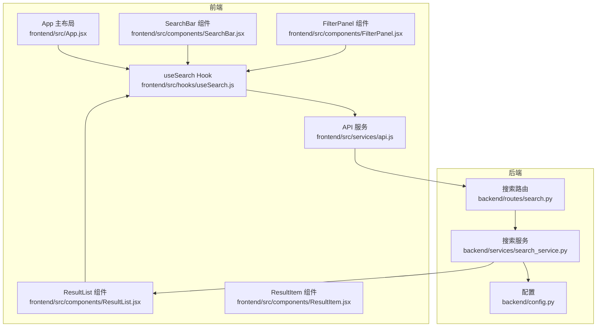
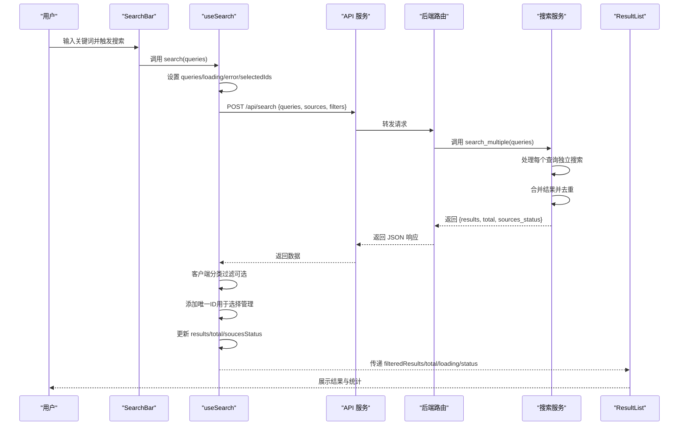
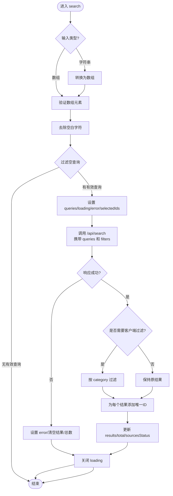
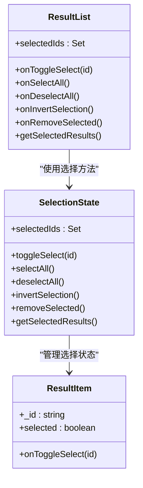
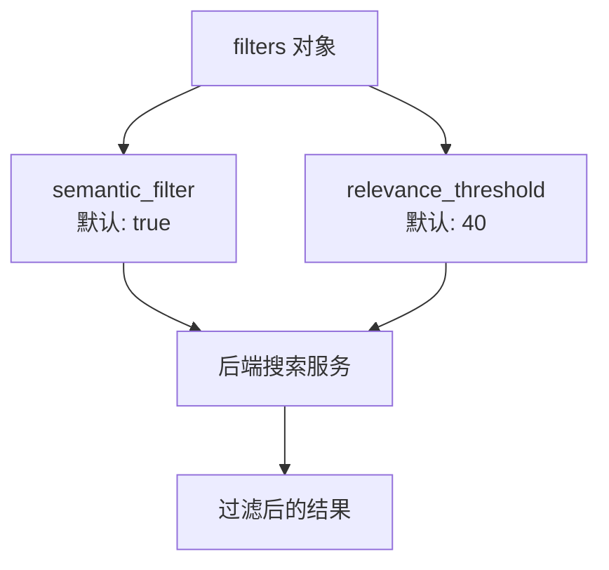
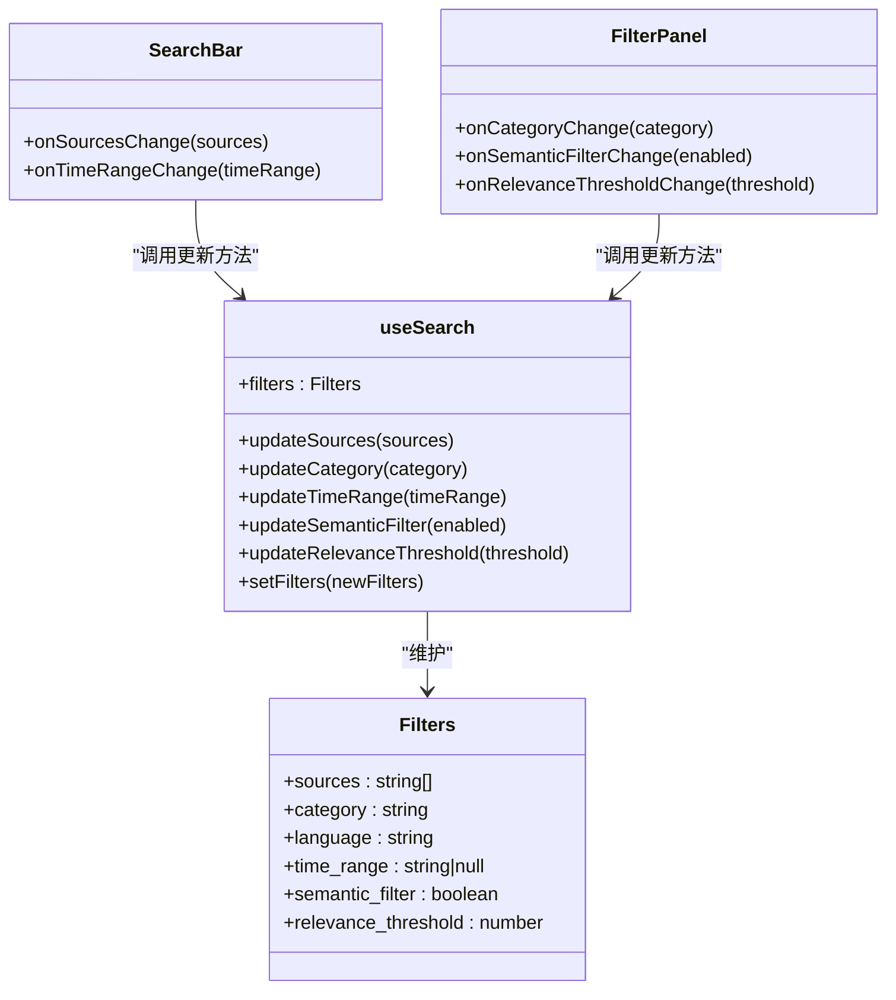
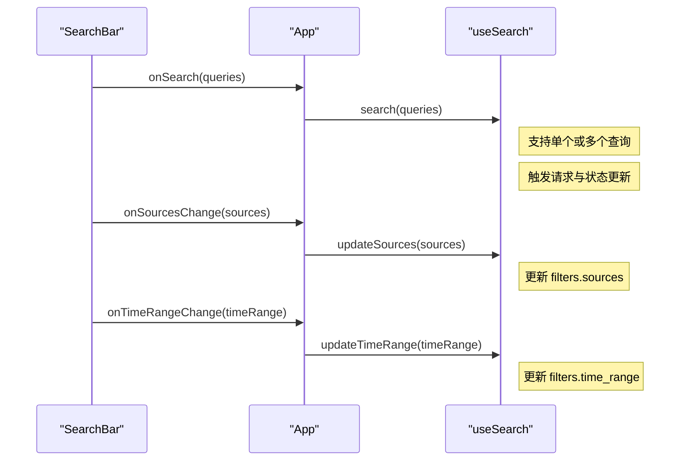
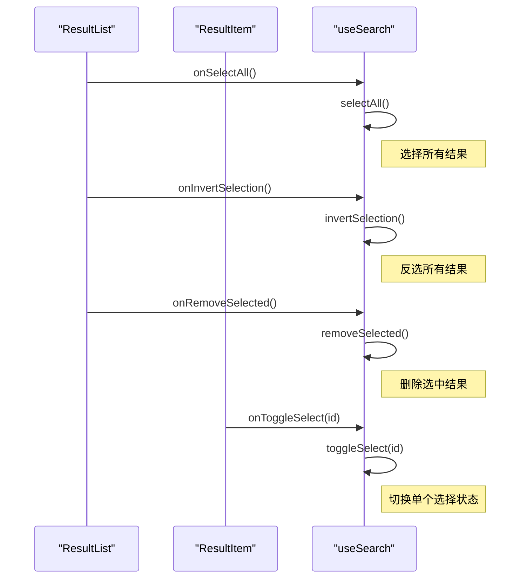
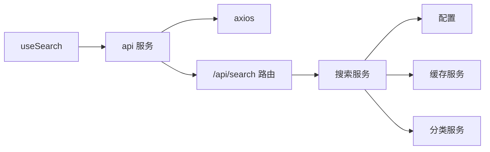

# useSearch Hook

<cite>
**本文引用的文件**
- [frontend/src/hooks/useSearch.js](file://frontend/src/hooks/useSearch.js)
- [frontend/src/services/api.js](file://frontend/src/services/api.js)
- [frontend/src/components/SearchBar.jsx](file://frontend/src/components/SearchBar.jsx)
- [frontend/src/App.jsx](file://frontend/src/App.jsx)
- [frontend/src/components/FilterPanel.jsx](file://frontend/src/components/FilterPanel.jsx)
- [frontend/src/components/ResultList.jsx](file://frontend/src/components/ResultList.jsx)
- [frontend/src/components/ResultItem.jsx](file://frontend/src/components/ResultItem.jsx)
- [backend/routes/search.py](file://backend/routes/search.py)
- [backend/services/search_service.py](file://backend/services/search_service.py)
- [backend/config.py](file://backend/config.py)
- [README.md](file://README.md)
</cite>

## 更新摘要
**变更内容**
- 新增多查询支持，支持单个关键词和多个关键词的混合搜索
- 新增选择状态管理，包括toggleSelect、selectAll、deselectAll、invertSelection、removeSelected、getSelectedResults等批量操作
- 新增语义过滤配置，包括semantic_filter开关和relevance_threshold阈值
- 新增queries状态用于跟踪所有有效的搜索查询
- 新增selectedIds状态用于管理选中结果的ID集合
- 后端路由支持queries数组参数和MAX_QUERIES限制
- 后端服务实现search_multiple函数处理多查询合并逻辑

## 目录
1. [简介](#简介)
2. [项目结构](#项目结构)
3. [核心组件](#核心组件)
4. [架构总览](#架构总览)
5. [详细组件分析](#详细组件分析)
6. [依赖关系分析](#依赖关系分析)
7. [性能考虑](#性能考虑)
8. [故障排查指南](#故障排查指南)
9. [结论](#结论)
10. [附录](#附录)

## 简介
useSearch 是一个用于管理搜索状态与行为的 React 自定义 Hook。它负责：
- 维护搜索结果、总数、各数据源状态、加载状态、错误状态与查询词
- 管理过滤器对象（sources、category、language、time_range、semantic_filter、relevance_threshold）
- 支持单个关键词和多个关键词的混合搜索
- 提供结果选择状态管理与批量操作功能
- 执行搜索请求、处理错误、进行客户端分类过滤，并更新状态
- 提供更新过滤器的方法（如更新数据源、更新分类、更新时间范围、更新语义过滤）

该 Hook 与前端组件（如 SearchBar、FilterPanel、ResultList）紧密协作，形成完整的搜索体验闭环。

## 项目结构
useSearch Hook 位于前端目录，配合 API 服务、路由与后端搜索服务共同工作。其主要交互关系如下：

**图表来源**
- [frontend/src/hooks/useSearch.js](file://frontend/src/hooks/useSearch.js#L1-L156)
- [frontend/src/services/api.js](file://frontend/src/services/api.js#L1-L32)
- [frontend/src/components/SearchBar.jsx](file://frontend/src/components/SearchBar.jsx#L1-L133)
- [frontend/src/components/FilterPanel.jsx](file://frontend/src/components/FilterPanel.jsx#L1-L108)
- [frontend/src/components/ResultList.jsx](file://frontend/src/components/ResultList.jsx#L1-L205)
- [frontend/src/components/ResultItem.jsx](file://frontend/src/components/ResultItem.jsx#L1-L118)
- [backend/routes/search.py](file://backend/routes/search.py#L1-L45)
- [backend/services/search_service.py](file://backend/services/search_service.py#L1-L217)
- [backend/config.py](file://backend/config.py#L1-L85)

**章节来源**
- [frontend/src/hooks/useSearch.js](file://frontend/src/hooks/useSearch.js#L1-L156)
- [frontend/src/App.jsx](file://frontend/src/App.jsx#L1-L170)
- [backend/routes/search.py](file://backend/routes/search.py#L1-L45)

## 核心组件
useSearch Hook 的核心状态与方法：
- 状态
  - results：搜索结果数组
  - total：结果总数
  - sourcesStatus：各数据源的搜索状态（success/failed）
  - loading：是否处于加载中
  - error：错误信息
  - query：当前查询词（多查询时为逗号分隔的字符串）
  - queries：所有有效的搜索查询数组
  - selectedIds：选中结果的ID集合
  - filters：过滤器对象，包含 sources、category、language、time_range、semantic_filter、relevance_threshold
- 方法
  - search(searchQueries)：执行搜索，支持单个或多个查询，发送请求，处理响应与错误，更新状态
  - setFilters(newFilters)：批量设置过滤器
  - updateSources(sources)：更新 sources
  - updateCategory(category)：更新 category
  - updateTimeRange(timeRange)：更新 time_range
  - updateSemanticFilter(enabled)：更新语义过滤开关
  - updateRelevanceThreshold(threshold)：更新相关性阈值
  - toggleSelect(id)：切换单个结果的选择状态
  - selectAll()：选择所有结果
  - deselectAll()：取消选择所有结果
  - invertSelection()：反选所有结果
  - removeSelected()：删除选中的结果
  - getSelectedResults()：获取选中的结果

这些状态与方法在 Hook 返回值中统一导出，供上层组件使用。

**章节来源**
- [frontend/src/hooks/useSearch.js](file://frontend/src/hooks/useSearch.js#L6-L156)

## 架构总览
useSearch 的工作流从用户输入开始，经过 API 请求、后端搜索服务、客户端过滤与状态更新，最终渲染到结果列表与筛选面板。

**图表来源**
- [frontend/src/components/SearchBar.jsx](file://frontend/src/components/SearchBar.jsx#L44-L49)
- [frontend/src/hooks/useSearch.js](file://frontend/src/hooks/useSearch.js#L23-L67)
- [frontend/src/services/api.js](file://frontend/src/services/api.js#L10-L29)
- [backend/routes/search.py](file://backend/routes/search.py#L13-L45)
- [backend/services/search_service.py](file://backend/services/search_service.py#L135-L187)
- [frontend/src/components/ResultList.jsx](file://frontend/src/components/ResultList.jsx#L15-L205)

## 详细组件分析

### useSearch Hook 的状态管理机制
- results：后端返回的结果数组，客户端可进行二次过滤
- total：后端返回的总结果数
- sourcesStatus：后端返回的各数据源状态，前端用于展示"✓/✗"
- loading：控制 UI 加载态
- error：错误信息，用于提示用户
- query：当前查询词（多查询时为逗号分隔的字符串），便于历史与调试
- queries：所有有效的搜索查询数组，支持多关键词搜索
- selectedIds：选中结果的ID集合，使用Set数据结构确保唯一性
- filters：包含 sources、category、language、time_range、semantic_filter、relevance_threshold 的过滤器对象
  - sources：当前启用的数据源列表
  - category：当前选中的分类（all 表示不过滤）
  - language：当前语言过滤（当前实现未使用，保留扩展性）
  - time_range：当前时间范围过滤（null 表示不限制）
  - semantic_filter：是否启用AI语义过滤
  - relevance_threshold：语义相关性阈值（0-100）

**更新** 新增多查询支持、选择状态管理和语义过滤配置

状态更新流程：
- search 函数在发起请求前设置 queries、loading、清除 error、selectedIds
- 成功时写入 results、total、sourcesStatus；失败时设置 error 并清空 results/total
- 最终关闭 loading

**章节来源**
- [frontend/src/hooks/useSearch.js](file://frontend/src/hooks/useSearch.js#L6-L21)
- [frontend/src/hooks/useSearch.js](file://frontend/src/hooks/useSearch.js#L23-L67)

### search 函数的实现逻辑
- 输入校验：支持字符串和数组两种格式，去除空白字符，过滤空查询
- 设置状态：queries、loading、error、selectedIds
- 发起请求：通过 api.post 调用 /api/search，携带 queries、sources、filters（包含 time_range、semantic_filter、relevance_threshold）
- 客户端过滤：若 category 不为 all，则对 results 进行过滤
- ID管理：为每个结果添加唯一ID（_id）用于选择状态追踪
- 更新状态：写入 items、total、sourcesStatus
- 错误处理：捕获异常，设置错误消息，清空结果与总数
- 结束收尾：无论成功与否，关闭 loading

**图表来源**
- [frontend/src/hooks/useSearch.js](file://frontend/src/hooks/useSearch.js#L23-L67)

**章节来源**
- [frontend/src/hooks/useSearch.js](file://frontend/src/hooks/useSearch.js#L23-L67)

### 选择状态管理机制
- selectedIds：使用Set数据结构存储选中结果的ID
- toggleSelect(id)：切换单个结果的选择状态
- selectAll()：选择所有结果，基于results数组生成ID集合
- deselectAll()：取消选择所有结果
- invertSelection()：反选所有结果，基于当前选中状态计算
- removeSelected()：删除选中的结果，更新results并清空selectedIds
- getSelectedResults()：获取选中的结果数组

**更新** 新增完整的批量操作功能

**图表来源**
- [frontend/src/hooks/useSearch.js](file://frontend/src/hooks/useSearch.js#L69-L109)
- [frontend/src/components/ResultItem.jsx](file://frontend/src/components/ResultItem.jsx#L37-L49)
- [frontend/src/components/ResultList.jsx](file://frontend/src/components/ResultList.jsx#L15-L29)

**章节来源**
- [frontend/src/hooks/useSearch.js](file://frontend/src/hooks/useSearch.js#L69-L109)
- [frontend/src/components/ResultItem.jsx](file://frontend/src/components/ResultItem.jsx#L37-L49)
- [frontend/src/components/ResultList.jsx](file://frontend/src/components/ResultList.jsx#L15-L29)

### 语义过滤配置机制
- semantic_filter：布尔值，控制是否启用AI语义过滤，默认true
- relevance_threshold：数字（0-100），控制语义相关性阈值，默认40
- updateSemanticFilter(enabled)：更新语义过滤开关
- updateRelevanceThreshold(threshold)：更新相关性阈值

**更新** 新增语义过滤配置功能

**图表来源**
- [frontend/src/hooks/useSearch.js](file://frontend/src/hooks/useSearch.js#L14-L21)
- [frontend/src/hooks/useSearch.js](file://frontend/src/hooks/useSearch.js#L123-L129)
- [frontend/src/components/FilterPanel.jsx](file://frontend/src/components/FilterPanel.jsx#L65-L103)

**章节来源**
- [frontend/src/hooks/useSearch.js](file://frontend/src/hooks/useSearch.js#L14-L21)
- [frontend/src/hooks/useSearch.js](file://frontend/src/hooks/useSearch.js#L123-L129)
- [frontend/src/components/FilterPanel.jsx](file://frontend/src/components/FilterPanel.jsx#L65-L103)

### filters 对象的管理机制
- 默认值：sources 使用常量 DEFAULT_SOURCES，category 与 language 初始化为 'all'，time_range 初始化为 null，semantic_filter 初始化为 true，relevance_threshold 初始化为 40
- 更新方式：
  - updateSources：通过 setFilters 的回调方式更新 sources
  - updateCategory：通过 setFilters 的回调方式更新 category
  - updateTimeRange：通过 setFilters 的回调方式更新 time_range
  - updateSemanticFilter：通过 setFilters 的回调方式更新 semantic_filter
  - updateRelevanceThreshold：通过 setFilters 的回调方式更新 relevance_threshold
  - setFilters：可一次性设置 filters 的多个字段
- 与 UI 的联动：
  - SearchBar 通过 onSourcesChange 调用 updateSources
  - SearchBar 通过 onTimeRangeChange 调用 updateTimeRange
  - FilterPanel 通过 onCategoryChange 调用 updateCategory
  - FilterPanel 通过 onSemanticFilterChange 调用 updateSemanticFilter
  - FilterPanel 通过 onRelevanceThresholdChange 调用 updateRelevanceThreshold
  - App 层计算 filteredResults 时读取 filters.category

**更新** 新增语义过滤配置和相关阈值管理

**图表来源**
- [frontend/src/hooks/useSearch.js](file://frontend/src/hooks/useSearch.js#L14-L21)
- [frontend/src/hooks/useSearch.js](file://frontend/src/hooks/useSearch.js#L111-L129)
- [frontend/src/components/SearchBar.jsx](file://frontend/src/components/SearchBar.jsx#L22-L18)
- [frontend/src/components/FilterPanel.jsx](file://frontend/src/components/FilterPanel.jsx#L24-L30)

**章节来源**
- [frontend/src/hooks/useSearch.js](file://frontend/src/hooks/useSearch.js#L14-L21)
- [frontend/src/hooks/useSearch.js](file://frontend/src/hooks/useSearch.js#L111-L129)
- [frontend/src/components/SearchBar.jsx](file://frontend/src/components/SearchBar.jsx#L22-L18)
- [frontend/src/components/FilterPanel.jsx](file://frontend/src/components/FilterPanel.jsx#L24-L30)

### 与 SearchBar 组件的集成模式
- SearchBar 负责：
  - 输入关键词并触发 onSearch
  - 支持多关键词输入，最多5个关键词
  - 展示数据源复选框组，变更时触发 onSourcesChange
  - 展示时间范围 Radio 按钮组，变更时触发 onTimeRangeChange
  - loading 状态同步到按钮
- App 将 useSearch 的 search、updateSources、updateCategory、updateTimeRange 传给 SearchBar
- SearchBar 通过回调更新 useSearch 的 filters

**更新** SearchBar 支持多关键词输入，最多5个关键词

**图表来源**
- [frontend/src/components/SearchBar.jsx](file://frontend/src/components/SearchBar.jsx#L44-L49)
- [frontend/src/App.jsx](file://frontend/src/App.jsx#L90-L97)
- [frontend/src/App.jsx](file://frontend/src/App.jsx#L19-L38)

**章节来源**
- [frontend/src/components/SearchBar.jsx](file://frontend/src/components/SearchBar.jsx#L22-L133)
- [frontend/src/App.jsx](file://frontend/src/App.jsx#L90-L97)
- [frontend/src/App.jsx](file://frontend/src/App.jsx#L19-L38)

### 与 ResultList/ResultItem 的集成
- ResultList 展示 loading、空状态、总数与各数据源状态
- ResultList 提供批量操作按钮：全选、取消全选、反选、删除选中项、导出选中结果
- ResultItem 展示分类标签、来源标签、作者、发布时间、链接等元信息
- ResultItem 支持单个结果的选择状态管理
- App 层根据 filters.category 计算 filteredResults，避免重复过滤

**更新** ResultList 新增批量操作功能和选择状态管理

**图表来源**
- [frontend/src/components/ResultList.jsx](file://frontend/src/components/ResultList.jsx#L135-L181)
- [frontend/src/components/ResultItem.jsx](file://frontend/src/components/ResultItem.jsx#L37-L49)
- [frontend/src/hooks/useSearch.js](file://frontend/src/hooks/useSearch.js#L69-L109)

**章节来源**
- [frontend/src/components/ResultList.jsx](file://frontend/src/components/ResultList.jsx#L15-L205)
- [frontend/src/components/ResultItem.jsx](file://frontend/src/components/ResultItem.jsx#L37-L118)
- [frontend/src/App.jsx](file://frontend/src/App.jsx#L79-L84)

### 后端交互与数据流
- 前端通过 api.post 调用 /api/search
- 后端路由接收 JSON 参数（queries、sources、filters）
- 支持 queries 数组和 query 字符串两种格式（向后兼容）
- 搜索服务执行多源搜索、分类标注、缓存与历史记录
- 返回 results、total、sources_status

**更新** 后端路由新增多查询支持和MAX_QUERIES限制，后端服务实现search_multiple函数

**章节来源**
- [frontend/src/services/api.js](file://frontend/src/services/api.js#L4-L8)
- [frontend/src/services/api.js](file://frontend/src/services/api.js#L10-L29)
- [backend/routes/search.py](file://backend/routes/search.py#L13-L45)
- [backend/services/search_service.py](file://backend/services/search_service.py#L135-L187)

## 依赖关系分析
- useSearch 依赖 api 服务进行 HTTP 请求
- api 服务基于 axios，配置了 base URL、超时与拦截器
- 后端路由与服务通过 Flask 与搜索服务实现多源聚合、分类与缓存
- App 组件负责将 useSearch 的状态与方法注入到 UI 组件

**图表来源**
- [frontend/src/hooks/useSearch.js](file://frontend/src/hooks/useSearch.js#L1-L2)
- [frontend/src/services/api.js](file://frontend/src/services/api.js#L1-L8)
- [backend/routes/search.py](file://backend/routes/search.py#L13-L45)
- [backend/services/search_service.py](file://backend/services/search_service.py#L1-L217)
- [backend/config.py](file://backend/config.py#L53-L59)

**章节来源**
- [frontend/src/hooks/useSearch.js](file://frontend/src/hooks/useSearch.js#L1-L2)
- [frontend/src/services/api.js](file://frontend/src/services/api.js#L1-L32)
- [backend/routes/search.py](file://backend/routes/search.py#L1-L45)
- [backend/services/search_service.py](file://backend/services/search_service.py#L1-L217)
- [backend/config.py](file://backend/config.py#L1-L85)

## 性能考虑
- 客户端过滤：当 filters.category 为 'all' 时跳过过滤，避免不必要的数组遍历
- 缓存策略：后端搜索服务使用缓存键与 TTL，减少重复请求
- 并发与超时：axios 配置了较长的超时时间，避免短时间内的网络波动导致失败
- UI 优化：ResultList 在 loading 时显示加载指示，空结果时显示占位，提升用户体验
- 多查询优化：后端服务对相同URL的结果进行去重，避免重复显示
- 选择状态优化：使用Set数据结构存储选中ID，提供O(1)的查找和操作性能

**更新** 新增多查询去重和选择状态优化

**章节来源**
- [frontend/src/hooks/useSearch.js](file://frontend/src/hooks/useSearch.js#L46-L55)
- [backend/services/search_service.py](file://backend/services/search_service.py#L171-L179)
- [frontend/src/services/api.js](file://frontend/src/services/api.js#L4-L8)
- [frontend/src/components/ResultList.jsx](file://frontend/src/components/ResultList.jsx#L103-L113)

## 故障排查指南
- 请求过于频繁（429）：拦截器会提示"请求过于频繁，请稍后再试"
- 服务器内部错误（5xx）：拦截器会提示"服务器内部错误"
- 请求参数错误（400）：拦截器会提示"请求参数错误"
- 请求超时（ECONNABORTED）：拦截器会提示"请求超时，请重试"
- 网络连接失败：拦截器会提示"网络连接失败"
- 后端搜索失败：后端路由捕获异常并返回错误信息
- 时间范围无效（400）：后端路由验证 time_range，不在允许集合中时返回错误
- 查询数量过多（400）：后端路由验证 queries 数组长度，超过MAX_QUERIES时返回错误

**更新** 新增查询数量限制的错误处理

**章节来源**
- [frontend/src/services/api.js](file://frontend/src/services/api.js#L10-L29)
- [backend/routes/search.py](file://backend/routes/search.py#L24-L29)

## 结论
useSearch Hook 以简洁的状态管理与清晰的职责划分，实现了从前端到后端的完整搜索流程。它通过 filters 对象灵活控制数据源、分类、时间范围和语义过滤，结合客户端过滤与后端缓存，提供了良好的性能与用户体验。新增的多查询支持、选择状态管理和批量操作功能进一步增强了Hook的实用性和扩展性。与 SearchBar、FilterPanel、ResultList 等组件的协同，构成了一个可扩展、易维护的搜索界面。

**更新** 新增的多查询支持、选择状态管理和语义过滤配置功能显著提升了搜索体验的灵活性和效率。

## 附录

### 使用示例与最佳实践
- 基本用法
  - 在组件中引入 useSearch，并解构出所需状态与方法
  - 将 search、filters、updateSources、updateCategory、updateTimeRange、updateSemanticFilter、updateRelevanceThreshold 传给 SearchBar 与 FilterPanel
  - 使用 filteredResults 渲染结果列表
  - 使用 selectedIds 和批量操作方法管理结果选择
- 最佳实践
  - 保持 filters 的不可变更新（使用 setFilters 回调）
  - 在搜索前确保 queries 非空且不超过MAX_QUERIES
  - 使用 loading 控制 UI 状态，避免重复触发
  - 仅在必要时进行客户端过滤，减少不必要的计算
  - 合理使用语义过滤，根据需求调整relevance_threshold
  - 使用批量操作功能提高用户交互效率
- 性能优化建议
  - 合理选择数据源，避免同时启用过多来源
  - 利用后端缓存，减少重复请求
  - 对长列表使用虚拟化或分页（如需扩展）
  - 使用Set数据结构管理选择状态，提供高效的操作性能
  - 多查询搜索时注意URL去重，避免重复显示

**更新** 新增多查询、选择状态管理和批量操作的最佳实践建议

**章节来源**
- [frontend/src/App.jsx](file://frontend/src/App.jsx#L19-L38)
- [frontend/src/App.jsx](file://frontend/src/App.jsx#L79-L84)
- [frontend/src/hooks/useSearch.js](file://frontend/src/hooks/useSearch.js#L111-L129)
- [README.md](file://README.md#L355-L359)