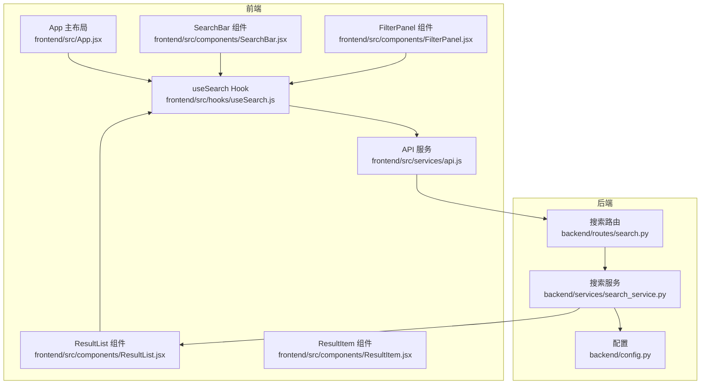
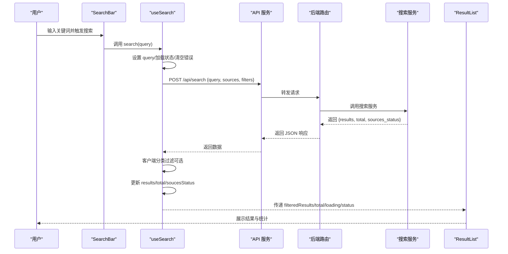
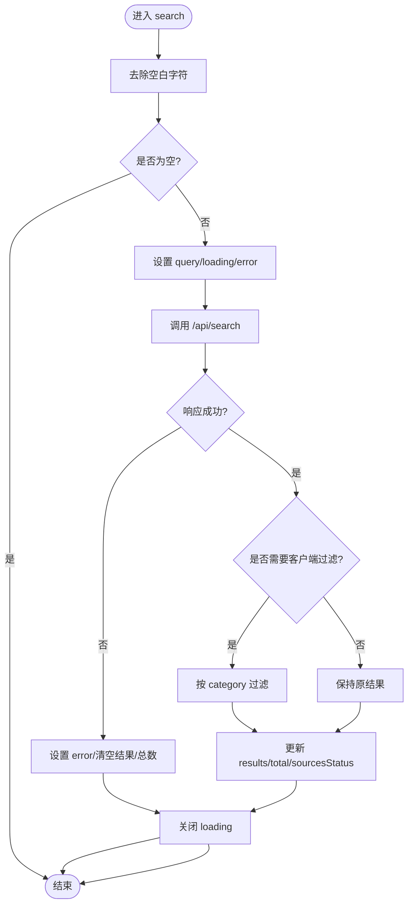
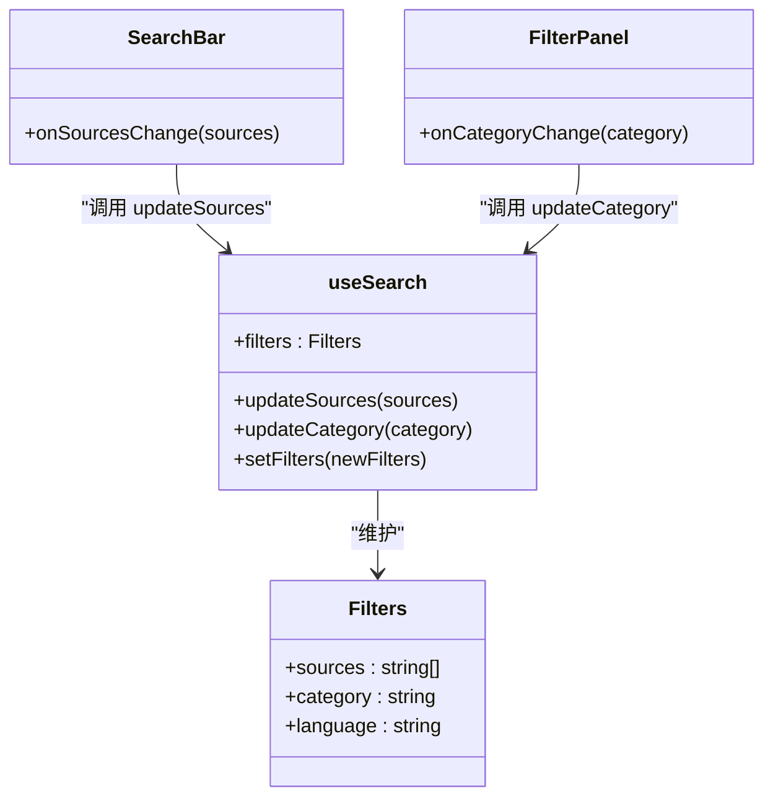
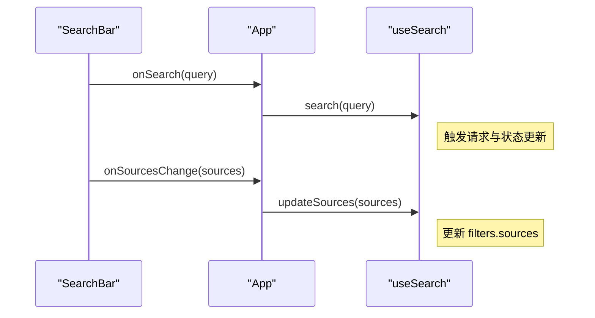
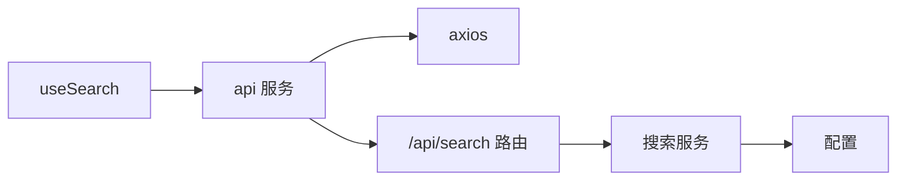

# useSearch Hook

<cite>
**本文引用的文件**
- [frontend/src/hooks/useSearch.js](file://frontend/src/hooks/useSearch.js)
- [frontend/src/services/api.js](file://frontend/src/services/api.js)
- [frontend/src/components/SearchBar.jsx](file://frontend/src/components/SearchBar.jsx)
- [frontend/src/App.jsx](file://frontend/src/App.jsx)
- [frontend/src/components/FilterPanel.jsx](file://frontend/src/components/FilterPanel.jsx)
- [frontend/src/components/ResultList.jsx](file://frontend/src/components/ResultList.jsx)
- [frontend/src/components/ResultItem.jsx](file://frontend/src/components/ResultItem.jsx)
- [backend/routes/search.py](file://backend/routes/search.py)
- [backend/services/search_service.py](file://backend/services/search_service.py)
- [backend/config.py](file://backend/config.py)
- [README.md](file://README.md)
</cite>

## 目录
1. [简介](#简介)
2. [项目结构](#项目结构)
3. [核心组件](#核心组件)
4. [架构总览](#架构总览)
5. [详细组件分析](#详细组件分析)
6. [依赖关系分析](#依赖关系分析)
7. [性能考虑](#性能考虑)
8. [故障排查指南](#故障排查指南)
9. [结论](#结论)
10. [附录](#附录)

## 简介
useSearch 是一个用于管理搜索状态与行为的 React 自定义 Hook。它负责：
- 维护搜索结果、总数、各数据源状态、加载状态、错误状态与查询词
- 管理过滤器对象（sources、category、language）
- 执行搜索请求、处理错误、进行客户端分类过滤，并更新状态
- 提供更新过滤器的方法（如更新数据源、更新分类）

该 Hook 与前端组件（如 SearchBar、FilterPanel、ResultList）紧密协作，形成完整的搜索体验闭环。

## 项目结构
useSearch Hook 位于前端目录，配合 API 服务、路由与后端搜索服务共同工作。其主要交互关系如下：

图表来源
- [frontend/src/hooks/useSearch.js](file://frontend/src/hooks/useSearch.js#L1-L74)
- [frontend/src/services/api.js](file://frontend/src/services/api.js#L1-L32)
- [frontend/src/components/SearchBar.jsx](file://frontend/src/components/SearchBar.jsx#L1-L42)
- [frontend/src/components/FilterPanel.jsx](file://frontend/src/components/FilterPanel.jsx#L1-L52)
- [frontend/src/components/ResultList.jsx](file://frontend/src/components/ResultList.jsx#L1-L58)
- [frontend/src/components/ResultItem.jsx](file://frontend/src/components/ResultItem.jsx#L1-L108)
- [backend/routes/search.py](file://backend/routes/search.py#L1-L28)
- [backend/services/search_service.py](file://backend/services/search_service.py#L1-L98)
- [backend/config.py](file://backend/config.py#L1-L85)

章节来源
- [frontend/src/hooks/useSearch.js](file://frontend/src/hooks/useSearch.js#L1-L74)
- [frontend/src/App.jsx](file://frontend/src/App.jsx#L1-L149)
- [backend/routes/search.py](file://backend/routes/search.py#L1-L28)

## 核心组件
useSearch Hook 的核心状态与方法：
- 状态
  - results：搜索结果数组
  - total：结果总数
  - sourcesStatus：各数据源的搜索状态（success/failed）
  - loading：是否处于加载中
  - error：错误信息
  - query：当前查询词
  - filters：过滤器对象，包含 sources、category、language
- 方法
  - search(searchQuery)：执行搜索，发送请求，处理响应与错误，更新状态
  - setFilters(newFilters)：批量设置过滤器
  - updateSources(sources)：更新 sources
  - updateCategory(category)：更新 category

这些状态与方法在 Hook 返回值中统一导出，供上层组件使用。

章节来源
- [frontend/src/hooks/useSearch.js](file://frontend/src/hooks/useSearch.js#L6-L72)

## 架构总览
useSearch 的工作流从用户输入开始，经过 API 请求、后端搜索服务、客户端过滤与状态更新，最终渲染到结果列表与筛选面板。

图表来源
- [frontend/src/components/SearchBar.jsx](file://frontend/src/components/SearchBar.jsx#L12-L29)
- [frontend/src/hooks/useSearch.js](file://frontend/src/hooks/useSearch.js#L19-L50)
- [frontend/src/services/api.js](file://frontend/src/services/api.js#L10-L29)
- [backend/routes/search.py](file://backend/routes/search.py#L10-L27)
- [backend/services/search_service.py](file://backend/services/search_service.py#L28-L67)
- [frontend/src/components/ResultList.jsx](file://frontend/src/components/ResultList.jsx#L7-L56)

## 详细组件分析

### useSearch Hook 的状态管理机制
- results：后端返回的结果数组，客户端可进行二次过滤
- total：后端返回的总结果数
- sourcesStatus：后端返回的各数据源状态，前端用于展示“✓/✗”
- loading：控制 UI 加载态
- error：错误信息，用于提示用户
- query：当前查询词，便于历史与调试
- filters：包含 sources、category、language 的过滤器对象
  - sources：当前启用的数据源列表
  - category：当前选中的分类（all 表示不过滤）
  - language：当前语言过滤（当前实现未使用，保留扩展性）

状态更新流程：
- search 函数在发起请求前设置 query、loading、清除 error
- 成功时写入 results、total、sourcesStatus；失败时设置 error 并清空 results/total
- 最终关闭 loading

章节来源
- [frontend/src/hooks/useSearch.js](file://frontend/src/hooks/useSearch.js#L6-L17)
- [frontend/src/hooks/useSearch.js](file://frontend/src/hooks/useSearch.js#L19-L50)

### search 函数的实现逻辑
- 输入校验：去除空白字符，空查询直接返回
- 设置状态：query、loading、error
- 发起请求：通过 api.post 调用 /api/search，携带 query、sources、filters
- 客户端过滤：若 category 不为 all，则对 results 进行过滤
- 更新状态：写入 items、total、sourcesStatus
- 错误处理：捕获异常，设置错误消息，清空结果与总数
- 结束收尾：无论成功与否，关闭 loading

图表来源
- [frontend/src/hooks/useSearch.js](file://frontend/src/hooks/useSearch.js#L19-L50)

章节来源
- [frontend/src/hooks/useSearch.js](file://frontend/src/hooks/useSearch.js#L19-L50)

### filters 对象的管理机制
- 默认值：sources 使用常量 DEFAULT_SOURCES，category 与 language 初始化为 'all'
- 更新方式：
  - updateSources：通过 setFilters 的回调方式更新 sources
  - updateCategory：通过 setFilters 的回调方式更新 category
  - setFilters：可一次性设置 filters 的多个字段
- 与 UI 的联动：
  - SearchBar 通过 onSourcesChange 调用 updateSources
  - FilterPanel 通过 onCategoryChange 调用 updateCategory
  - App 层计算 filteredResults 时读取 filters.category

图表来源
- [frontend/src/hooks/useSearch.js](file://frontend/src/hooks/useSearch.js#L13-L17)
- [frontend/src/hooks/useSearch.js](file://frontend/src/hooks/useSearch.js#L52-L58)
- [frontend/src/components/SearchBar.jsx](file://frontend/src/components/SearchBar.jsx#L32-L37)
- [frontend/src/components/FilterPanel.jsx](file://frontend/src/components/FilterPanel.jsx#L30-L35)

章节来源
- [frontend/src/hooks/useSearch.js](file://frontend/src/hooks/useSearch.js#L13-L17)
- [frontend/src/hooks/useSearch.js](file://frontend/src/hooks/useSearch.js#L52-L58)
- [frontend/src/components/SearchBar.jsx](file://frontend/src/components/SearchBar.jsx#L32-L37)
- [frontend/src/components/FilterPanel.jsx](file://frontend/src/components/FilterPanel.jsx#L30-L35)

### 与 SearchBar 组件的集成模式
- SearchBar 负责：
  - 输入关键词并触发 onSearch
  - 展示数据源复选框组，变更时触发 onSourcesChange
  - loading 状态同步到 Input.Search
- App 将 useSearch 的 search、updateSources、updateCategory 传给 SearchBar 与 FilterPanel
- SearchBar 与 FilterPanel 通过回调更新 useSearch 的 filters

图表来源
- [frontend/src/components/SearchBar.jsx](file://frontend/src/components/SearchBar.jsx#L12-L38)
- [frontend/src/App.jsx](file://frontend/src/App.jsx#L80-L85)
- [frontend/src/App.jsx](file://frontend/src/App.jsx#L111-L116)

章节来源
- [frontend/src/components/SearchBar.jsx](file://frontend/src/components/SearchBar.jsx#L12-L38)
- [frontend/src/App.jsx](file://frontend/src/App.jsx#L80-L85)
- [frontend/src/App.jsx](file://frontend/src/App.jsx#L111-L116)

### 与 ResultList/ResultItem 的集成
- ResultList 展示 loading、空状态、总数与各数据源状态
- ResultItem 展示分类标签、来源标签、作者、发布时间、链接等元信息
- App 层根据 filters.category 计算 filteredResults，避免重复过滤

章节来源
- [frontend/src/components/ResultList.jsx](file://frontend/src/components/ResultList.jsx#L7-L56)
- [frontend/src/components/ResultItem.jsx](file://frontend/src/components/ResultItem.jsx#L37-L107)
- [frontend/src/App.jsx](file://frontend/src/App.jsx#L69-L73)

### 后端交互与数据流
- 前端通过 api.post 调用 /api/search
- 后端路由接收 JSON 参数（query、sources、filters）
- 搜索服务执行多源搜索、分类标注、缓存与历史记录
- 返回 results、total、sources_status

章节来源
- [frontend/src/services/api.js](file://frontend/src/services/api.js#L4-L8)
- [frontend/src/services/api.js](file://frontend/src/services/api.js#L10-L29)
- [backend/routes/search.py](file://backend/routes/search.py#L10-L27)
- [backend/services/search_service.py](file://backend/services/search_service.py#L28-L67)

## 依赖关系分析
- useSearch 依赖 api 服务进行 HTTP 请求
- api 服务基于 axios，配置了 base URL、超时与拦截器
- 后端路由与服务通过 Flask 与搜索服务实现多源聚合、分类与缓存
- App 组件负责将 useSearch 的状态与方法注入到 UI 组件

图表来源
- [frontend/src/hooks/useSearch.js](file://frontend/src/hooks/useSearch.js#L1-L2)
- [frontend/src/services/api.js](file://frontend/src/services/api.js#L1-L8)
- [backend/routes/search.py](file://backend/routes/search.py#L10-L27)
- [backend/services/search_service.py](file://backend/services/search_service.py#L28-L67)
- [backend/config.py](file://backend/config.py#L53-L59)

章节来源
- [frontend/src/hooks/useSearch.js](file://frontend/src/hooks/useSearch.js#L1-L2)
- [frontend/src/services/api.js](file://frontend/src/services/api.js#L1-L32)
- [backend/routes/search.py](file://backend/routes/search.py#L1-L28)
- [backend/services/search_service.py](file://backend/services/search_service.py#L1-L98)
- [backend/config.py](file://backend/config.py#L1-L85)

## 性能考虑
- 客户端过滤：当 filters.category 为 'all' 时跳过过滤，避免不必要的数组遍历
- 缓存策略：后端搜索服务使用缓存键与 TTL，减少重复请求
- 并发与超时：axios 配置了较长的超时时间，避免短时间内的网络波动导致失败
- UI 优化：ResultList 在 loading 时显示加载指示，空结果时显示占位，提升用户体验

章节来源
- [frontend/src/hooks/useSearch.js](file://frontend/src/hooks/useSearch.js#L35-L38)
- [backend/services/search_service.py](file://backend/services/search_service.py#L44-L61)
- [frontend/src/services/api.js](file://frontend/src/services/api.js#L4-L8)
- [frontend/src/components/ResultList.jsx](file://frontend/src/components/ResultList.jsx#L15-L21)

## 故障排查指南
- 请求过于频繁（429）：拦截器会提示“请求过于频繁，请稍后再试”
- 服务器内部错误（5xx）：拦截器会提示“服务器内部错误”
- 请求参数错误（400）：拦截器会提示“请求参数错误”
- 请求超时（ECONNABORTED）：拦截器会提示“请求超时，请重试”
- 网络连接失败：拦截器会提示“网络连接失败”
- 后端搜索失败：后端路由捕获异常并返回错误信息

章节来源
- [frontend/src/services/api.js](file://frontend/src/services/api.js#L10-L29)
- [backend/routes/search.py](file://backend/routes/search.py#L25-L27)

## 结论
useSearch Hook 以简洁的状态管理与清晰的职责划分，实现了从前端到后端的完整搜索流程。它通过 filters 对象灵活控制数据源与分类，结合客户端过滤与后端缓存，提供了良好的性能与用户体验。与 SearchBar、FilterPanel、ResultList 等组件的协同，构成了一个可扩展、易维护的搜索界面。

## 附录

### 使用示例与最佳实践
- 基本用法
  - 在组件中引入 useSearch，并解构出所需状态与方法
  - 将 search、filters、updateSources、updateCategory 传给 SearchBar 与 FilterPanel
  - 使用 filteredResults 渲染结果列表
- 最佳实践
  - 保持 filters 的不可变更新（使用 setFilters 回调）
  - 在搜索前确保 query 非空
  - 使用 loading 控制 UI 状态，避免重复触发
  - 仅在必要时进行客户端过滤，减少不必要的计算
- 性能优化建议
  - 合理选择数据源，避免同时启用过多来源
  - 利用后端缓存，减少重复请求
  - 对长列表使用虚拟化或分页（如需扩展）

章节来源
- [frontend/src/App.jsx](file://frontend/src/App.jsx#L19-L28)
- [frontend/src/App.jsx](file://frontend/src/App.jsx#L69-L73)
- [frontend/src/hooks/useSearch.js](file://frontend/src/hooks/useSearch.js#L52-L58)
- [README.md](file://README.md#L355-L359)