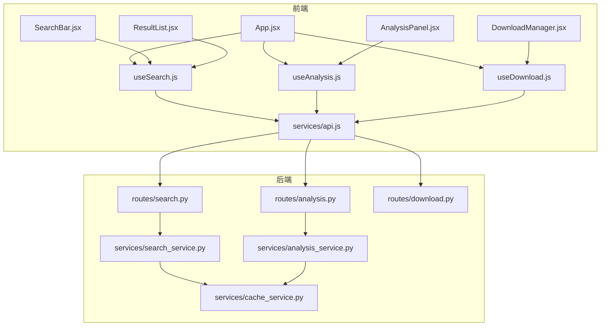
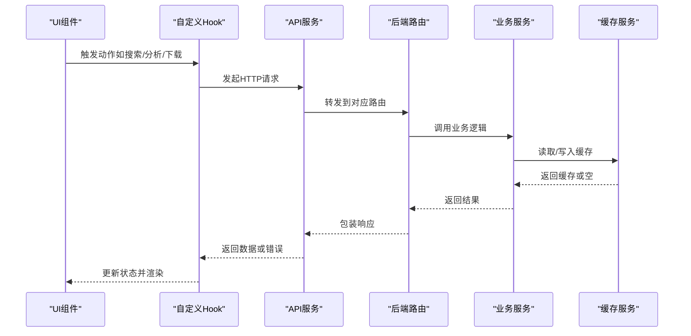
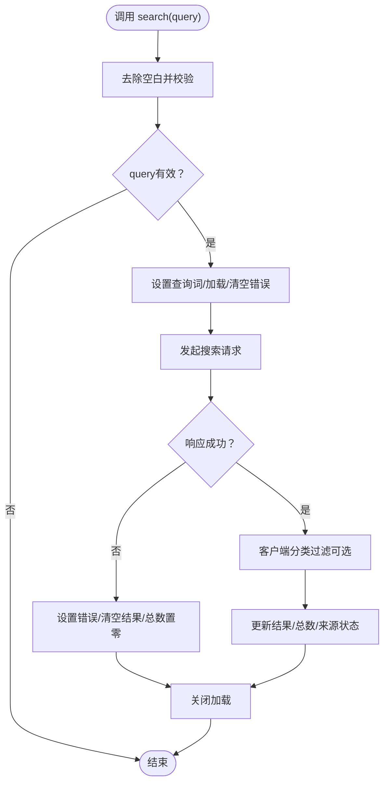
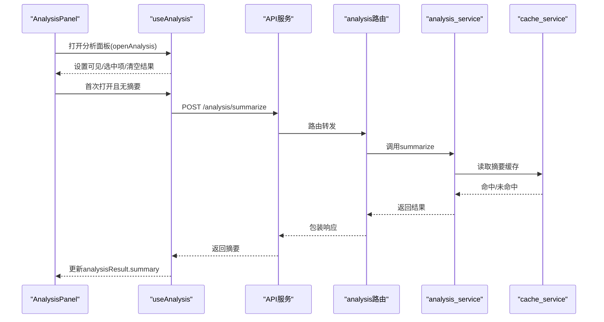
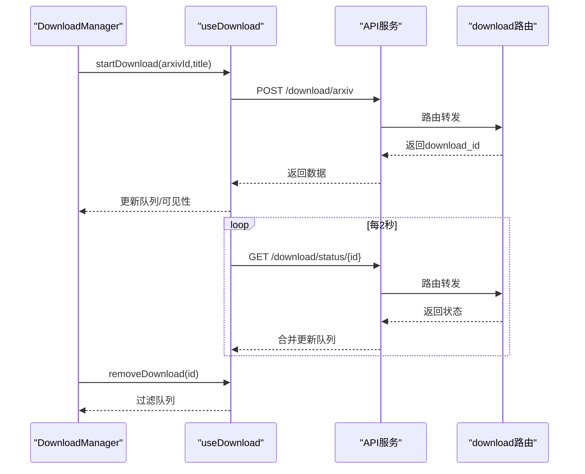
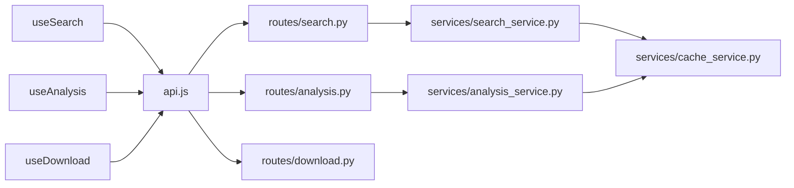

# 自定义Hook系统

<cite>
**本文引用的文件**
- [frontend/src/hooks/useSearch.js](file://frontend/src/hooks/useSearch.js)
- [frontend/src/hooks/useAnalysis.js](file://frontend/src/hooks/useAnalysis.js)
- [frontend/src/hooks/useDownload.js](file://frontend/src/hooks/useDownload.js)
- [frontend/src/services/api.js](file://frontend/src/services/api.js)
- [frontend/src/App.jsx](file://frontend/src/App.jsx)
- [frontend/src/components/SearchBar.jsx](file://frontend/src/components/SearchBar.jsx)
- [frontend/src/components/ResultList.jsx](file://frontend/src/components/ResultList.jsx)
- [frontend/src/components/AnalysisPanel.jsx](file://frontend/src/components/AnalysisPanel.jsx)
- [frontend/src/components/DownloadManager.jsx](file://frontend/src/components/DownloadManager.jsx)
- [backend/routes/search.py](file://backend/routes/search.py)
- [backend/routes/analysis.py](file://backend/routes/analysis.py)
- [backend/routes/download.py](file://backend/routes/download.py)
- [backend/services/search_service.py](file://backend/services/search_service.py)
- [backend/services/analysis_service.py](file://backend/services/analysis_service.py)
- [backend/services/cache_service.py](file://backend/services/cache_service.py)
</cite>

## 目录
1. [简介](#简介)
2. [项目结构](#项目结构)
3. [核心组件](#核心组件)
4. [架构总览](#架构总览)
5. [详细组件分析](#详细组件分析)
6. [依赖关系分析](#依赖关系分析)
7. [性能考量](#性能考量)
8. [故障排查指南](#故障排查指南)
9. [结论](#结论)
10. [附录：测试策略与最佳实践](#附录测试策略与最佳实践)

## 简介
本文件系统化梳理前端自定义Hook设计与实现，围绕 useSearch、useAnalysis、useDownload 三大核心Hook，阐述其状态管理、副作用处理与数据缓存策略；解释Hook在应用中的组合使用、依赖注入与错误处理机制；并给出测试策略、性能优化与扩展指南。

## 项目结构
前端采用按功能分层组织：Hooks 聚合业务状态与副作用，Services 封装API调用与拦截器，Components 作为UI与Hook的桥接层；后端以Flask蓝图划分路由，服务层负责业务逻辑与缓存。

图表来源
- [frontend/src/App.jsx](file://frontend/src/App.jsx#L16-L50)
- [frontend/src/hooks/useSearch.js](file://frontend/src/hooks/useSearch.js#L6-L72)
- [frontend/src/hooks/useAnalysis.js](file://frontend/src/hooks/useAnalysis.js#L4-L84)
- [frontend/src/hooks/useDownload.js](file://frontend/src/hooks/useDownload.js#L4-L76)
- [frontend/src/services/api.js](file://frontend/src/services/api.js#L1-L32)
- [backend/routes/search.py](file://backend/routes/search.py#L10-L27)
- [backend/routes/analysis.py](file://backend/routes/analysis.py#L10-L65)
- [backend/routes/download.py](file://backend/routes/download.py#L14-L97)
- [backend/services/search_service.py](file://backend/services/search_service.py#L28-L67)
- [backend/services/analysis_service.py](file://backend/services/analysis_service.py#L25-L90)
- [backend/services/cache_service.py](file://backend/services/cache_service.py#L30-L86)

章节来源
- [frontend/src/App.jsx](file://frontend/src/App.jsx#L16-L50)
- [frontend/src/hooks/useSearch.js](file://frontend/src/hooks/useSearch.js#L6-L72)
- [frontend/src/hooks/useAnalysis.js](file://frontend/src/hooks/useAnalysis.js#L4-L84)
- [frontend/src/hooks/useDownload.js](file://frontend/src/hooks/useDownload.js#L4-L76)
- [frontend/src/services/api.js](file://frontend/src/services/api.js#L1-L32)
- [backend/routes/search.py](file://backend/routes/search.py#L10-L27)
- [backend/routes/analysis.py](file://backend/routes/analysis.py#L10-L65)
- [backend/routes/download.py](file://backend/routes/download.py#L14-L97)
- [backend/services/search_service.py](file://backend/services/search_service.py#L28-L67)
- [backend/services/analysis_service.py](file://backend/services/analysis_service.py#L25-L90)
- [backend/services/cache_service.py](file://backend/services/cache_service.py#L30-L86)

## 核心组件
- useSearch：集中管理搜索结果、总数、来源状态、加载与错误状态，以及查询词与过滤条件；提供搜索执行、来源切换、分类筛选等操作。
- useAnalysis：封装摘要、翻译、论文分析三类分析能力，维护分析结果、可见性、选中项与活动标签页；提供打开/关闭分析面板与各分析动作。
- useDownload：管理下载队列、可见性与轮询刷新；提供开始下载、移除任务、自动轮询状态更新的能力。

章节来源
- [frontend/src/hooks/useSearch.js](file://frontend/src/hooks/useSearch.js#L6-L72)
- [frontend/src/hooks/useAnalysis.js](file://frontend/src/hooks/useAnalysis.js#L4-L84)
- [frontend/src/hooks/useDownload.js](file://frontend/src/hooks/useDownload.js#L4-L76)

## 架构总览
前端通过Hooks抽象状态与副作用，统一经由API服务发起HTTP请求；后端路由接收请求，委派至服务层；服务层结合缓存与外部代理/工具完成计算，并返回标准化响应。错误在API层统一拦截并提示，保证用户体验一致性。

图表来源
- [frontend/src/hooks/useSearch.js](file://frontend/src/hooks/useSearch.js#L19-L50)
- [frontend/src/hooks/useAnalysis.js](file://frontend/src/hooks/useAnalysis.js#L11-L57)
- [frontend/src/hooks/useDownload.js](file://frontend/src/hooks/useDownload.js#L9-L48)
- [frontend/src/services/api.js](file://frontend/src/services/api.js#L10-L29)
- [backend/routes/search.py](file://backend/routes/search.py#L10-L27)
- [backend/routes/analysis.py](file://backend/routes/analysis.py#L10-L65)
- [backend/routes/download.py](file://backend/routes/download.py#L14-L97)
- [backend/services/search_service.py](file://backend/services/search_service.py#L28-L67)
- [backend/services/analysis_service.py](file://backend/services/analysis_service.py#L25-L90)
- [backend/services/cache_service.py](file://backend/services/cache_service.py#L30-L86)

## 详细组件分析

### useSearch：搜索状态与过滤
- 状态管理
  - 结果列表、总数、来源状态、加载与错误标志、查询词、过滤条件（来源、分类、语言）。
- 副作用与流程
  - 搜索函数接收查询词，清理空值，设置查询词与加载状态，发起请求；成功时进行客户端分类过滤，更新结果、总数与来源状态；异常时设置错误并清空结果；最终收尾恢复加载状态。
  - 提供更新来源与分类的方法，均通过不可变更新保持稳定引用。
- 数据缓存策略
  - 客户端不直接缓存，但后端服务层对搜索结果进行缓存，命中则直接返回，降低重复查询成本。
- 组合使用
  - App中聚合useSearch状态，配合ResultList与SearchBar展示与交互；同时基于结果计算分类计数并进行二次过滤。

图表来源
- [frontend/src/hooks/useSearch.js](file://frontend/src/hooks/useSearch.js#L19-L50)
- [frontend/src/App.jsx](file://frontend/src/App.jsx#L59-L73)
- [backend/services/search_service.py](file://backend/services/search_service.py#L44-L67)

章节来源
- [frontend/src/hooks/useSearch.js](file://frontend/src/hooks/useSearch.js#L6-L72)
- [frontend/src/App.jsx](file://frontend/src/App.jsx#L59-L73)
- [backend/services/search_service.py](file://backend/services/search_service.py#L28-L67)

### useAnalysis：分析能力与状态
- 状态管理
  - 分析结果对象（含摘要、翻译、论文分析）、加载状态、可见性、选中项、活动标签页。
- 副作用与流程
  - 摘要/翻译/论文分析分别封装异步请求，统一在成功时合并到分析结果对象，失败时在对应字段记录错误信息；打开分析面板时重置状态并设为可见；关闭时清理可见性、选中项与结果。
  - AnalysisPanel在抽屉首次打开且未有摘要时自动触发摘要生成，体现“懒加载”式初始化。
- 数据缓存策略
  - 后端分析服务对摘要、翻译、论文分析分别建立缓存键，命中则直接返回；非错误结果写入缓存，提升重复内容处理效率。

图表来源
- [frontend/src/components/AnalysisPanel.jsx](file://frontend/src/components/AnalysisPanel.jsx#L23-L28)
- [frontend/src/hooks/useAnalysis.js](file://frontend/src/hooks/useAnalysis.js#L59-L64)
- [frontend/src/services/api.js](file://frontend/src/services/api.js#L10-L29)
- [backend/routes/analysis.py](file://backend/routes/analysis.py#L10-L24)
- [backend/services/analysis_service.py](file://backend/services/analysis_service.py#L25-L43)
- [backend/services/cache_service.py](file://backend/services/cache_service.py#L57-L75)

章节来源
- [frontend/src/hooks/useAnalysis.js](file://frontend/src/hooks/useAnalysis.js#L4-L84)
- [frontend/src/components/AnalysisPanel.jsx](file://frontend/src/components/AnalysisPanel.jsx#L23-L28)
- [backend/services/analysis_service.py](file://backend/services/analysis_service.py#L25-L90)
- [backend/services/cache_service.py](file://backend/services/cache_service.py#L57-L86)

### useDownload：下载队列与轮询
- 状态管理
  - 下载队列、可见性。
- 副作用与流程
  - 开始下载：向后端发起下载请求，将新任务插入队列顶部，设置可见性并返回任务ID；失败返回空。
  - 刷新状态：遍历处于“等待中/下载中”的任务，逐个查询状态并合并更新；忽略轮询错误，避免中断整体刷新。
  - 轮询控制：根据是否存在活跃任务决定启动/停止定时器；组件卸载时清理定时器，防止内存泄漏。
  - 移除任务：按ID过滤队列。
- 数据缓存策略
  - 下载状态由后端技能模块维护，前端仅轮询查询；无需前端缓存。

图表来源
- [frontend/src/hooks/useDownload.js](file://frontend/src/hooks/useDownload.js#L9-L64)
- [frontend/src/components/DownloadManager.jsx](file://frontend/src/components/DownloadManager.jsx#L49-L107)
- [frontend/src/services/api.js](file://frontend/src/services/api.js#L10-L29)
- [backend/routes/download.py](file://backend/routes/download.py#L14-L56)

章节来源
- [frontend/src/hooks/useDownload.js](file://frontend/src/hooks/useDownload.js#L4-L76)
- [frontend/src/components/DownloadManager.jsx](file://frontend/src/components/DownloadManager.jsx#L22-L113)
- [backend/routes/download.py](file://backend/routes/download.py#L14-L97)

## 依赖关系分析
- Hooks与服务层
  - useSearch/useAnalysis/useDownload 通过统一的API服务访问后端接口；API服务内置拦截器，统一处理429、5xx、400、超时与网络错误，向上抛出Promise以便Hook捕获。
- 服务层与缓存
  - 搜索服务与分析服务均使用缓存服务生成键并进行读写；搜索缓存支持TTL，分析缓存支持7天过期清理。
- 组件与Hook
  - App将多个Hook状态聚合，SearchBar与ResultList消费useSearch；AnalysisPanel消费useAnalysis；DownloadManager消费useDownload。

图表来源
- [frontend/src/hooks/useSearch.js](file://frontend/src/hooks/useSearch.js#L1-L2)
- [frontend/src/hooks/useAnalysis.js](file://frontend/src/hooks/useAnalysis.js#L1-L2)
- [frontend/src/hooks/useDownload.js](file://frontend/src/hooks/useDownload.js#L1-L2)
- [frontend/src/services/api.js](file://frontend/src/services/api.js#L1-L32)
- [backend/routes/search.py](file://backend/routes/search.py#L1-L7)
- [backend/routes/analysis.py](file://backend/routes/analysis.py#L1-L7)
- [backend/routes/download.py](file://backend/routes/download.py#L1-L11)
- [backend/services/search_service.py](file://backend/services/search_service.py#L1-L13)
- [backend/services/analysis_service.py](file://backend/services/analysis_service.py#L1-L10)
- [backend/services/cache_service.py](file://backend/services/cache_service.py#L1-L8)

章节来源
- [frontend/src/services/api.js](file://frontend/src/services/api.js#L10-L29)
- [backend/services/search_service.py](file://backend/services/search_service.py#L44-L67)
- [backend/services/analysis_service.py](file://backend/services/analysis_service.py#L32-L43)
- [backend/services/cache_service.py](file://backend/services/cache_service.py#L30-L86)

## 性能考量
- 请求去抖与幂等
  - 搜索建议在调用侧进行空值校验与空白清理，避免无效请求。
- 客户端过滤
  - useSearch在客户端进行分类过滤，减少不必要的后端请求；App中进一步计算分类计数与二次过滤，减轻渲染压力。
- 缓存利用
  - 后端对搜索与分析结果进行缓存，命中即返回，显著降低重复请求成本；缓存清理定期执行，避免脏数据滞留。
- 轮询节流
  - useDownload仅在存在活跃任务时启动轮询，且固定周期2秒，避免高频轮询；错误被静默处理，保证稳定性。
- 渲染优化
  - App使用记忆化计算结果计数与过滤列表，避免每次渲染都重新计算。

章节来源
- [frontend/src/hooks/useSearch.js](file://frontend/src/hooks/useSearch.js#L19-L50)
- [frontend/src/App.jsx](file://frontend/src/App.jsx#L59-L73)
- [backend/services/search_service.py](file://backend/services/search_service.py#L44-L67)
- [backend/services/analysis_service.py](file://backend/services/analysis_service.py#L32-L43)
- [backend/services/cache_service.py](file://backend/services/cache_service.py#L91-L103)
- [frontend/src/hooks/useDownload.js](file://frontend/src/hooks/useDownload.js#L50-L64)

## 故障排查指南
- 错误拦截与提示
  - API拦截器针对不同HTTP状态与错误类型输出相应提示，包括请求过于频繁、服务器内部错误、参数错误、请求超时与网络失败；所有错误均透传给调用方。
- 搜索失败
  - useSearch在异常时清空结果与总数，并设置错误消息；检查后端路由是否正确接收参数与服务层是否抛出异常。
- 分析失败
  - useAnalysis在各分析动作失败时在对应字段记录错误；检查后端分析路由参数校验与服务层代理/工具可用性。
- 下载失败
  - useDownload在开始下载失败时返回空；轮询错误被忽略，不影响其他任务；检查后端下载路由与技能模块状态记录。
- 缓存问题
  - 若出现旧结果或长时间未更新，检查缓存键生成规则与过期时间；必要时触发缓存清理。

章节来源
- [frontend/src/services/api.js](file://frontend/src/services/api.js#L10-L29)
- [frontend/src/hooks/useSearch.js](file://frontend/src/hooks/useSearch.js#L43-L49)
- [frontend/src/hooks/useAnalysis.js](file://frontend/src/hooks/useAnalysis.js#L16-L23)
- [frontend/src/hooks/useDownload.js](file://frontend/src/hooks/useDownload.js#L21-L23)
- [backend/routes/search.py](file://backend/routes/search.py#L15-L17)
- [backend/routes/analysis.py](file://backend/routes/analysis.py#L15-L17)
- [backend/services/cache_service.py](file://backend/services/cache_service.py#L91-L103)

## 结论
本Hook体系以清晰的状态边界与副作用封装，实现了搜索、分析与下载三大核心场景的解耦与复用。通过统一的API拦截与后端缓存策略，兼顾了用户体验与系统性能。组件层与Hook层职责分明，便于扩展与测试。

## 附录：测试策略与最佳实践

### 测试策略
- 单元测试
  - 对Hook内部逻辑进行断言：如useSearch的过滤逻辑、useAnalysis的错误回退、useDownload的轮询时机与队列更新。
- 集成测试
  - 使用Mock API拦截器模拟后端响应，覆盖正常路径与错误路径；验证缓存命中与过期行为。
- 端到端测试
  - 在真实或模拟后端环境下，验证从UI到Hook再到服务层的完整链路，关注轮询稳定性与并发场景。

### 性能优化
- 合理拆分Hook，避免单Hook承担过多职责。
- 使用useCallback/useMemo稳定回调与计算，减少子组件重渲染。
- 控制轮询频率与范围，避免全局扫描导致的抖动。
- 利用后端缓存与键空间设计，减少重复计算与IO。

### 最佳实践
- 明确Hook职责边界，一个Hook只做一件事。
- 在Hook内统一处理错误与加载态，暴露简洁的公共接口。
- 通过不可变更新与稳定引用，降低渲染成本。
- 为关键流程编写可视化序列图与流程图，辅助协作与评审。

### 扩展指南
- 新增Hook时遵循现有命名与导出规范，保持一致的返回结构。
- 优先考虑后端缓存策略，再考虑前端缓存，避免重复造轮子。
- 对外暴露的副作用函数应具备幂等性与可取消性（如需要），并在组件卸载时清理资源。
- 为复杂流程绘制流程图与时序图，确保团队成员对状态流转有一致理解。