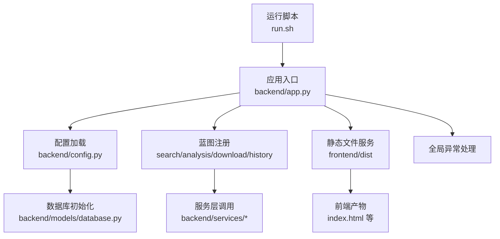
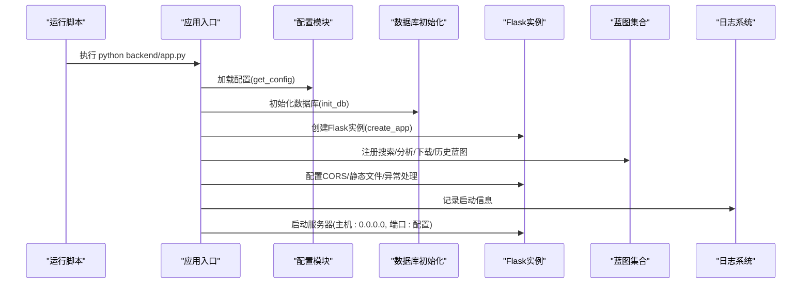
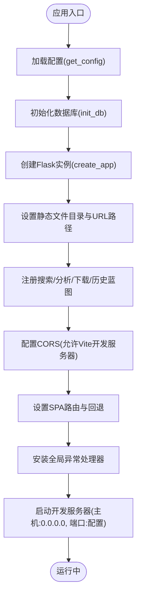
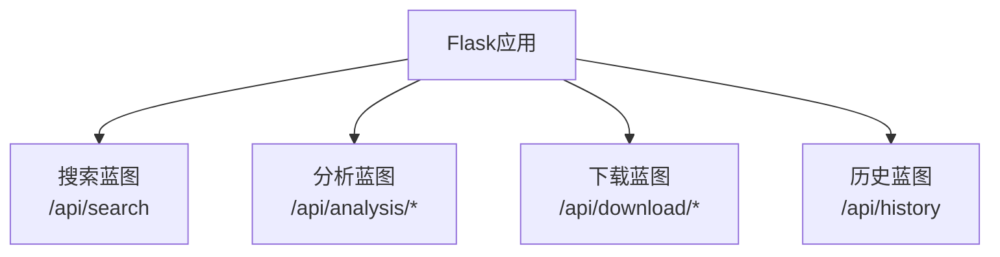
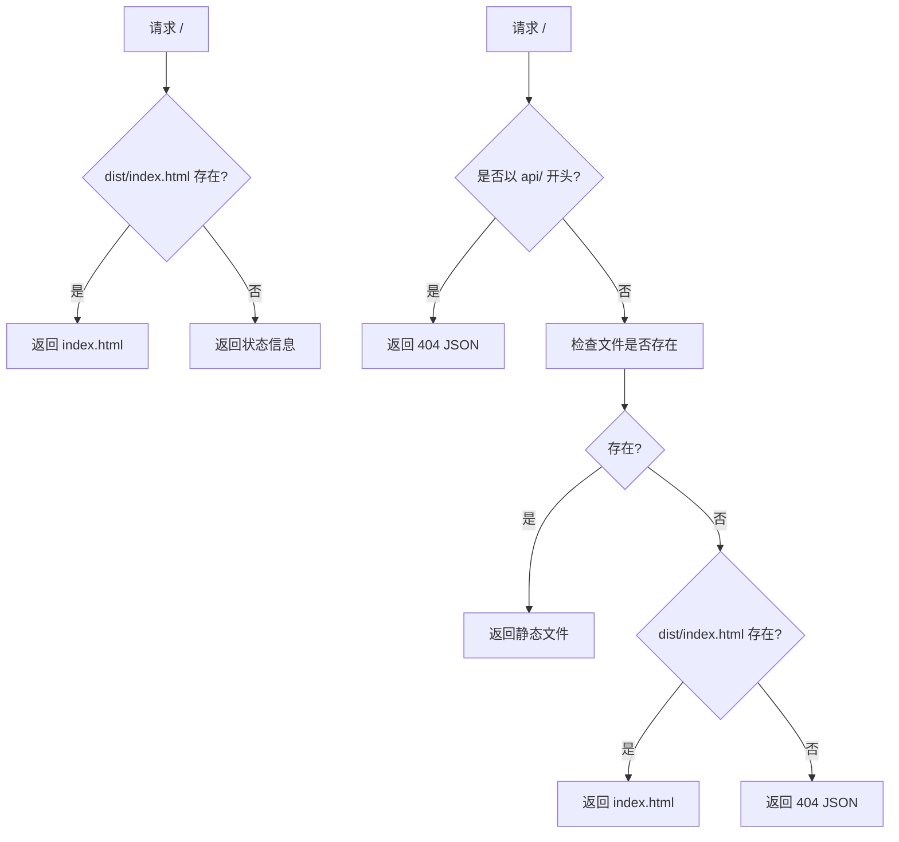
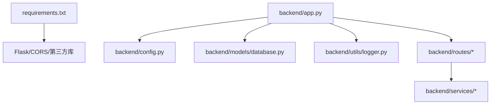

# Flask应用入口

<cite>
**本文档引用的文件**
- [backend/app.py](file://backend/app.py)
- [backend/config.py](file://backend/config.py)
- [backend/utils/logger.py](file://backend/utils/logger.py)
- [backend/models/database.py](file://backend/models/database.py)
- [backend/routes/search.py](file://backend/routes/search.py)
- [backend/routes/analysis.py](file://backend/routes/analysis.py)
- [backend/routes/download.py](file://backend/routes/download.py)
- [backend/routes/history.py](file://backend/routes/history.py)
- [run.sh](file://run.sh)
- [.env](file://.env)
- [backend/requirements.txt](file://backend/requirements.txt)
- [.qoder/config.json](file://.qoder/config.json)
</cite>

## 目录
1. [简介](#简介)
2. [项目结构](#项目结构)
3. [核心组件](#核心组件)
4. [架构总览](#架构总览)
5. [详细组件分析](#详细组件分析)
6. [依赖关系分析](#依赖关系分析)
7. [性能考虑](#性能考虑)
8. [故障排除指南](#故障排除指南)
9. [结论](#结论)
10. [附录](#附录)

## 简介
本文件聚焦于Flask应用入口的设计与实现，系统性阐述应用初始化流程、蓝图注册机制、静态文件服务（SPA路由）配置、CORS跨域策略、全局异常捕获、开发/生产环境差异，以及启动参数、端口配置与日志记录机制。通过结合后端蓝图、数据库初始化、配置加载与前端静态资源托管的实际代码，帮助开发者快速理解整体架构与启动流程。

## 项目结构
该Flask应用采用前后端分离架构：后端为Python Flask服务，前端为Vite构建的静态站点。应用入口位于后端根目录，负责创建Flask应用实例、注册蓝图、配置CORS、设置静态文件服务与SPA回退路由，并提供全局错误处理。配置由环境变量与.qoder配置文件共同决定，数据库在应用启动前完成初始化。

图表来源
- [backend/app.py](file://backend/app.py#L21-L78)
- [backend/config.py](file://backend/config.py#L15-L85)
- [backend/models/database.py](file://backend/models/database.py#L36-L43)
- [run.sh](file://run.sh#L46-L49)

章节来源
- [backend/app.py](file://backend/app.py#L1-L78)
- [run.sh](file://run.sh#L1-L50)

## 核心组件
- 应用工厂函数：负责创建Flask实例、加载配置、注册蓝图、配置CORS、设置静态文件与SPA路由、安装全局异常处理器。
- 配置系统：统一从环境变量与.qoder配置文件读取参数，支持开发/生产环境切换与默认值。
- 数据库初始化：在应用启动前执行，确保SQLite表结构存在。
- 日志系统：统一格式化输出，便于问题定位与运维监控。
- 蓝图集合：按功能拆分API路由，清晰隔离业务边界。

章节来源
- [backend/app.py](file://backend/app.py#L21-L78)
- [backend/config.py](file://backend/config.py#L15-L85)
- [backend/utils/logger.py](file://backend/utils/logger.py#L5-L23)
- [backend/models/database.py](file://backend/models/database.py#L36-L43)

## 架构总览
应用启动的关键流程如下：运行脚本激活虚拟环境并启动Python应用；应用入口加载配置、初始化数据库、创建Flask实例；注册四个蓝图；配置CORS与静态文件服务；设置SPA回退路由；安装全局异常处理器；最后根据配置启动开发服务器。

图表来源
- [run.sh](file://run.sh#L46-L49)
- [backend/app.py](file://backend/app.py#L70-L78)
- [backend/config.py](file://backend/config.py#L80-L85)
- [backend/models/database.py](file://backend/models/database.py#L36-L43)

## 详细组件分析

### 应用工厂与初始化流程
- 工厂函数职责
  - 加载配置并设置Flask实例的关键参数（如SECRET_KEY）。
  - 设置静态文件目录为前端构建产物目录，并将静态URL路径设为空字符串以便直接访问。
  - 注册四个蓝图：搜索、分析、下载、历史。
  - 安装全局异常处理器，统一返回JSON错误响应。
- 数据库初始化
  - 在应用创建之前调用数据库初始化函数，确保SQLite表结构存在。
- 开发服务器启动
  - 通过配置中的端口与调试模式启动Flask内置服务器，监听所有网络接口。

图表来源
- [backend/app.py](file://backend/app.py#L21-L78)
- [backend/models/database.py](file://backend/models/database.py#L36-L43)

章节来源
- [backend/app.py](file://backend/app.py#L21-L78)

### 蓝图注册机制
- 四个蓝图分别对应不同业务域：搜索、分析、下载、历史。
- 每个蓝图内部定义了具体的API端点，遵循REST风格，返回JSON响应。
- 蓝图在应用工厂中集中注册，便于维护与扩展。

图表来源
- [backend/app.py](file://backend/app.py#L35-L39)
- [backend/routes/search.py](file://backend/routes/search.py#L10-L27)
- [backend/routes/analysis.py](file://backend/routes/analysis.py#L10-L65)
- [backend/routes/download.py](file://backend/routes/download.py#L14-L97)
- [backend/routes/history.py](file://backend/routes/history.py#L10-L32)

章节来源
- [backend/app.py](file://backend/app.py#L35-L39)
- [backend/routes/search.py](file://backend/routes/search.py#L1-L28)
- [backend/routes/analysis.py](file://backend/routes/analysis.py#L1-L66)
- [backend/routes/download.py](file://backend/routes/download.py#L1-L98)
- [backend/routes/history.py](file://backend/routes/history.py#L1-L33)

### 静态文件服务与SPA路由处理
- 静态文件服务
  - 将Flask的static_folder指向前端dist目录，static_url_path设为空字符串，使静态资源可直接通过根路径访问。
- SPA路由处理
  - 根路径“/”优先返回index.html，若不存在则返回简要状态信息。
  - 通配符路径“/<path:path>”优先拦截以“api/”开头的请求（避免API被误当静态文件），否则检查文件是否存在；若不存在则回退到index.html，实现单页应用的客户端路由。
- 生产部署建议
  - 前端需先构建生成dist目录，再由Flask托管；开发阶段可配合Vite热更新（CORS已针对Vite开发服务器放行）。

图表来源
- [backend/app.py](file://backend/app.py#L41-L59)

章节来源
- [backend/app.py](file://backend/app.py#L25-L29)
- [backend/app.py](file://backend/app.py#L41-L59)

### CORS配置
- 放行来源
  - 开发环境下放行Vite开发服务器的两个常见地址，便于本地联调。
- 生产环境建议
  - 明确指定生产域名或使用通配策略时注意安全风险，避免过度放行。

章节来源
- [backend/app.py](file://backend/app.py#L32-L33)

### 全局异常捕获
- 统一异常处理
  - 捕获所有未处理异常，记录详细错误日志（含堆栈信息），并向客户端返回标准JSON错误响应与500状态码。
- 业务异常处理
  - 各蓝图内部对特定业务错误进行显式处理并返回相应状态码（如400、404、500），保持API一致性。

章节来源
- [backend/app.py](file://backend/app.py#L61-L65)
- [backend/routes/search.py](file://backend/routes/search.py#L22-L27)
- [backend/routes/analysis.py](file://backend/routes/analysis.py#L19-L24)
- [backend/routes/download.py](file://backend/routes/download.py#L37-L39)
- [backend/routes/history.py](file://backend/routes/history.py#L19-L21)

### 开发/生产环境差异
- 环境变量驱动
  - FLASK_ENV控制DEBUG开关；FLASK_PORT决定监听端口；SECRET_KEY用于会话与签名。
- 默认行为
  - 开发环境默认开启DEBUG，生产环境应关闭DEBUG并设置更安全的SECRET_KEY。
- 配置来源
  - .env文件提供基础配置；.qoder/config.json提供高级参数（如限流、搜索默认值、下载与分析设置）。

章节来源
- [backend/config.py](file://backend/config.py#L29-L36)
- [backend/config.py](file://backend/config.py#L80-L85)
- [.env](file://.env#L8-L11)
- [.qoder/config.json](file://.qoder/config.json#L1-L31)

### 应用启动参数、端口配置与日志记录
- 启动参数
  - 主机：0.0.0.0（对外可访问）
  - 端口：来自配置的FLASK_PORT
  - 调试：由FLASK_ENV推导的DEBUG
- 端口配置
  - 默认5000，可在.env中修改。
- 日志记录
  - 使用统一的日志器，输出格式包含时间戳、级别、名称与消息；输出到标准输出，便于容器与日志平台采集。

章节来源
- [backend/app.py](file://backend/app.py#L74-L77)
- [backend/config.py](file://backend/config.py#L30-L33)
- [.env](file://.env#L10-L11)
- [backend/utils/logger.py](file://backend/utils/logger.py#L5-L23)

## 依赖关系分析
- 外部依赖
  - Flask、Flask-CORS、第三方搜索与学术资源库、dotenv等。
- 内部依赖
  - 应用入口依赖配置模块、数据库初始化、各蓝图模块与日志模块。
- 蓝图依赖
  - 各蓝图依赖服务层与日志模块；下载蓝图还依赖.qoder中的技能模块。

图表来源
- [backend/requirements.txt](file://backend/requirements.txt#L1-L11)
- [backend/app.py](file://backend/app.py#L10-L16)
- [backend/config.py](file://backend/config.py#L1-L12)
- [backend/models/database.py](file://backend/models/database.py#L1-L8)
- [backend/utils/logger.py](file://backend/utils/logger.py#L1-L23)
- [backend/routes/search.py](file://backend/routes/search.py#L1-L6)

章节来源
- [backend/requirements.txt](file://backend/requirements.txt#L1-L11)
- [backend/app.py](file://backend/app.py#L10-L16)

## 性能考虑
- 数据库连接
  - 使用线程局部存储管理SQLite连接，启用WAL模式、超时与外键约束，提升并发与稳定性。
- 缓存与限流
  - .qoder配置提供限流参数，可在服务层结合缓存策略优化响应速度。
- 静态文件
  - 生产环境建议使用反向代理或CDN加速静态资源访问。
- 异常处理
  - 全局异常处理器避免未处理异常导致进程崩溃，同时记录日志便于追踪。

章节来源
- [backend/models/database.py](file://backend/models/database.py#L11-L21)
- [backend/models/database.py](file://backend/models/database.py#L36-L43)
- [.qoder/config.json](file://.qoder/config.json#L2-L7)

## 故障排除指南
- 无法访问静态页面
  - 确认前端已构建且dist目录存在；检查静态文件夹路径与URL路径配置。
- API 404 或路由冲突
  - 确认请求路径不以“api/”开头（会被拦截）；检查通配符路由是否正确回退到index.html。
- 跨域问题
  - 开发环境确认CORS放行Vite地址；生产环境核对域名白名单。
- 服务器启动失败
  - 检查端口占用与权限；确认FLASK_PORT与FLASK_ENV配置正确。
- 数据库相关错误
  - 确认数据库文件路径与权限；查看初始化日志与表结构。
- 未处理异常
  - 查看日志输出，定位具体异常位置与堆栈信息。

章节来源
- [backend/app.py](file://backend/app.py#L41-L59)
- [backend/app.py](file://backend/app.py#L61-L65)
- [backend/models/database.py](file://backend/models/database.py#L36-L43)
- [backend/utils/logger.py](file://backend/utils/logger.py#L5-L23)

## 结论
该Flask应用入口通过工厂函数实现了清晰的初始化流程，结合蓝图模块化设计、CORS与SPA路由配置、全局异常处理与统一日志记录，形成了可维护、可扩展的后端服务骨架。配合.qoder配置与.env环境变量，能够灵活适配开发与生产环境需求。建议在生产环境中进一步完善CORS白名单、静态资源缓存与健康检查机制，以提升安全性与稳定性。

## 附录
- 启动命令参考
  - 使用run.sh一键安装依赖、构建前端并启动后端服务。
- 关键配置项
  - SECRET_KEY、FLASK_ENV、FLASK_PORT、DATABASE_PATH、DOWNLOAD_DIR、ZHIPU_API_KEY、DEEPSEEK_API_KEY、HTTP_PROXY等。
- 最佳实践
  - 生产环境关闭DEBUG，使用强密码与HTTPS；限制CORS来源；为静态资源添加ETag/缓存头；定期备份数据库。

章节来源
- [run.sh](file://run.sh#L1-L50)
- [backend/config.py](file://backend/config.py#L29-L77)
- [.env](file://.env#L1-L22)
- [.qoder/config.json](file://.qoder/config.json#L1-L31)