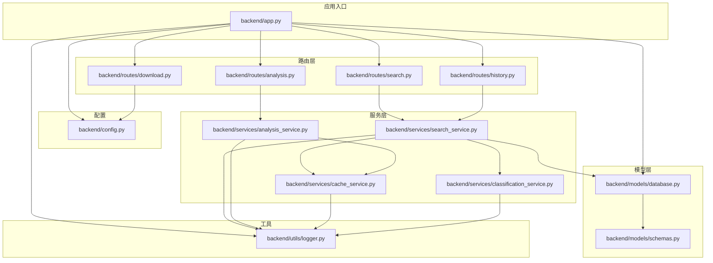
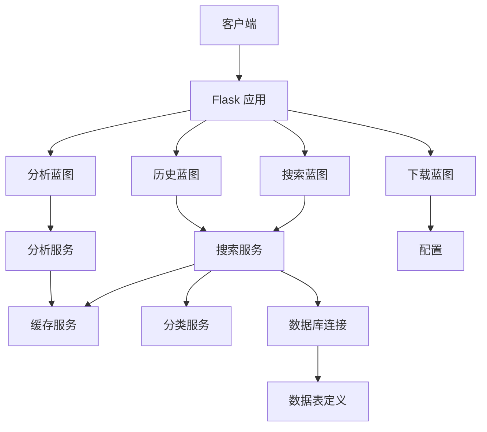
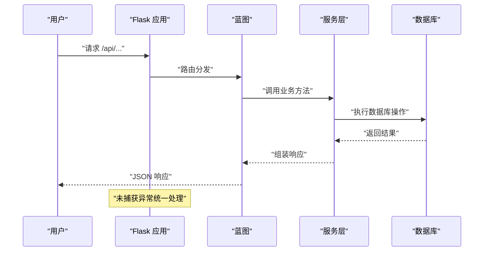
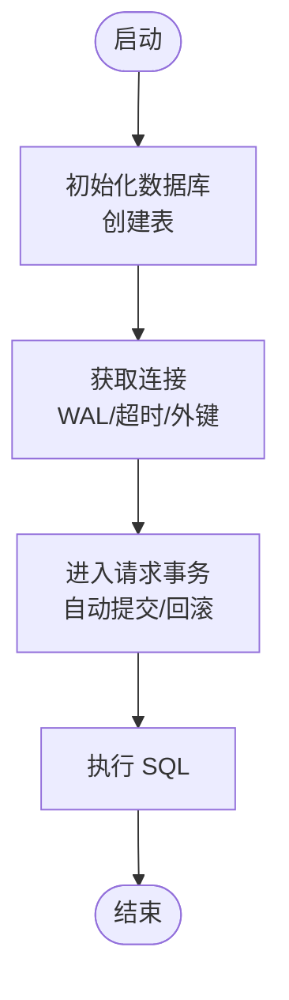
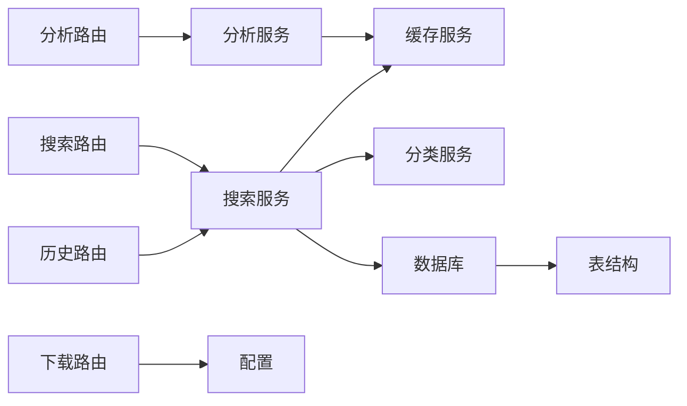

# 后端开发指南

<cite>
**本文档引用的文件**
- [backend/app.py](file://backend/app.py)
- [backend/config.py](file://backend/config.py)
- [backend/models/database.py](file://backend/models/database.py)
- [backend/models/schemas.py](file://backend/models/schemas.py)
- [backend/routes/search.py](file://backend/routes/search.py)
- [backend/routes/analysis.py](file://backend/routes/analysis.py)
- [backend/routes/download.py](file://backend/routes/download.py)
- [backend/routes/history.py](file://backend/routes/history.py)
- [backend/services/search_service.py](file://backend/services/search_service.py)
- [backend/services/analysis_service.py](file://backend/services/analysis_service.py)
- [backend/services/cache_service.py](file://backend/services/cache_service.py)
- [backend/services/classification_service.py](file://backend/services/classification_service.py)
- [backend/utils/logger.py](file://backend/utils/logger.py)
- [backend/test_integration.py](file://backend/test_integration.py)
- [.env.example](file://.env.example)
- [run.sh](file://run.sh)
</cite>

## 目录
1. [简介](#简介)
2. [项目结构](#项目结构)
3. [核心组件](#核心组件)
4. [架构总览](#架构总览)
5. [详细组件分析](#详细组件分析)
6. [依赖关系分析](#依赖关系分析)
7. [性能考虑](#性能考虑)
8. [故障排查指南](#故障排查指南)
9. [结论](#结论)
10. [附录](#附录)

## 简介
本指南面向后端开发者，系统性讲解基于 Flask 的搜索与分析平台后端开发与维护方法。内容涵盖应用入口、配置管理、数据库模型、服务层与路由层实现，以及 MVC 架构在项目中的落地方式；同时给出数据库连接管理、事务处理机制、错误处理策略、代码贡献规范、开发环境搭建与调试技巧，帮助你快速上手并高质量维护该后端系统。

## 项目结构
后端采用按功能分层的模块化组织方式：应用入口负责装配与路由注册；配置模块集中管理运行参数；模型层封装数据库访问与表结构；服务层实现业务逻辑与缓存策略；路由层定义 API 接口；工具层提供日志等通用能力；测试脚本用于集成验证。

图表来源
- [backend/app.py](file://backend/app.py#L21-L78)
- [backend/config.py](file://backend/config.py#L15-L85)
- [backend/models/database.py](file://backend/models/database.py#L11-L51)
- [backend/models/schemas.py](file://backend/models/schemas.py#L1-L38)
- [backend/services/search_service.py](file://backend/services/search_service.py#L28-L98)
- [backend/services/analysis_service.py](file://backend/services/analysis_service.py#L25-L91)
- [backend/services/cache_service.py](file://backend/services/cache_service.py#L30-L104)
- [backend/services/classification_service.py](file://backend/services/classification_service.py#L30-L64)
- [backend/routes/search.py](file://backend/routes/search.py#L10-L28)
- [backend/routes/analysis.py](file://backend/routes/analysis.py#L10-L66)
- [backend/routes/download.py](file://backend/routes/download.py#L14-L98)
- [backend/routes/history.py](file://backend/routes/history.py#L10-L33)
- [backend/utils/logger.py](file://backend/utils/logger.py#L5-L23)

章节来源
- [backend/app.py](file://backend/app.py#L21-L78)
- [backend/config.py](file://backend/config.py#L15-L85)

## 核心组件
- 应用入口与装配
  - 负责读取配置、初始化数据库、注册蓝图、设置静态资源与 SPA 回退、统一异常处理。
  - 参考路径：[应用工厂函数与全局错误处理](file://backend/app.py#L21-L78)
- 配置管理
  - 单例配置类，合并 .env 与 .qoder/config.json，提供 Flask、数据库、下载、限流、搜索默认值、分析设置等。
  - 参考路径：[配置类与单例获取](file://backend/config.py#L15-L85)
- 数据库模型与连接
  - 线程本地连接、上下文管理器自动提交/回滚、WAL 模式、超时与外键约束；初始化建表。
  - 参考路径：[连接与上下文管理](file://backend/models/database.py#L24-L34)，[初始化与建表](file://backend/models/database.py#L36-L44)
- 服务层
  - 搜索服务：多源检索、分类、缓存、历史记录持久化。
  - 分析服务：摘要、翻译、论文分析，带缓存。
  - 缓存服务：搜索与分析缓存键生成、过期控制、清理。
  - 分类服务：URL/来源分类规则。
  - 参考路径：
    - [搜索服务](file://backend/services/search_service.py#L28-L98)
    - [分析服务](file://backend/services/analysis_service.py#L25-L91)
    - [缓存服务](file://backend/services/cache_service.py#L30-L104)
    - [分类服务](file://backend/services/classification_service.py#L30-L64)
- 路由层
  - 搜索、分析（摘要/翻译/论文）、下载（发起/状态/文件/历史）、历史查询与清空。
  - 参考路径：
    - [搜索路由](file://backend/routes/search.py#L10-L28)
    - [分析路由](file://backend/routes/analysis.py#L10-L66)
    - [下载路由](file://backend/routes/download.py#L14-L98)
    - [历史路由](file://backend/routes/history.py#L10-L33)
- 工具与日志
  - 统一日志配置，按模块命名空间输出。
  - 参考路径：[日志工具](file://backend/utils/logger.py#L5-L23)

章节来源
- [backend/app.py](file://backend/app.py#L21-L78)
- [backend/config.py](file://backend/config.py#L15-L85)
- [backend/models/database.py](file://backend/models/database.py#L11-L51)
- [backend/services/search_service.py](file://backend/services/search_service.py#L28-L98)
- [backend/services/analysis_service.py](file://backend/services/analysis_service.py#L25-L91)
- [backend/services/cache_service.py](file://backend/services/cache_service.py#L30-L104)
- [backend/services/classification_service.py](file://backend/services/classification_service.py#L30-L64)
- [backend/routes/search.py](file://backend/routes/search.py#L10-L28)
- [backend/routes/analysis.py](file://backend/routes/analysis.py#L10-L66)
- [backend/routes/download.py](file://backend/routes/download.py#L14-L98)
- [backend/routes/history.py](file://backend/routes/history.py#L10-L33)
- [backend/utils/logger.py](file://backend/utils/logger.py#L5-L23)

## 架构总览
系统遵循 MVC 思想：
- 视图层：前端静态资源与 SPA 回退（由 Flask 提供）
- 控制器层：Blueprint 路由处理器，负责请求解析、参数校验、调用服务层并返回响应
- 模型层：SQLite 数据库访问与表结构定义
- 服务层：业务编排、外部代理调用、缓存与历史持久化

图表来源
- [backend/app.py](file://backend/app.py#L21-L78)
- [backend/routes/search.py](file://backend/routes/search.py#L10-L28)
- [backend/routes/analysis.py](file://backend/routes/analysis.py#L10-L66)
- [backend/routes/download.py](file://backend/routes/download.py#L14-L98)
- [backend/routes/history.py](file://backend/routes/history.py#L10-L33)
- [backend/services/search_service.py](file://backend/services/search_service.py#L28-L98)
- [backend/services/analysis_service.py](file://backend/services/analysis_service.py#L25-L91)
- [backend/services/cache_service.py](file://backend/services/cache_service.py#L30-L104)
- [backend/services/classification_service.py](file://backend/services/classification_service.py#L30-L64)
- [backend/models/database.py](file://backend/models/database.py#L11-L51)
- [backend/models/schemas.py](file://backend/models/schemas.py#L1-L38)

## 详细组件分析

### 应用入口与装配（App Factory）
- 功能要点
  - 读取配置并设置 SECRET_KEY、CORS 允许开发服务器回源
  - 注册四个蓝图：搜索、分析、下载、历史
  - 生产环境静态资源回退与 SPA 回退逻辑
  - 全局异常处理，统一返回 JSON 错误
- 关键流程

图表来源
- [backend/app.py](file://backend/app.py#L21-L78)
- [backend/routes/search.py](file://backend/routes/search.py#L10-L28)
- [backend/services/search_service.py](file://backend/services/search_service.py#L28-L98)
- [backend/models/database.py](file://backend/models/database.py#L24-L34)

章节来源
- [backend/app.py](file://backend/app.py#L21-L78)

### 配置管理（Config）
- 设计原则
  - 单例模式避免重复加载
  - 合并 .env 与 .qoder/config.json，支持搜索默认值、下载设置、分析设置、限流配置
  - 自动创建数据目录
- 关键字段示例
  - Flask 运行参数：环境、端口、调试开关
  - 数据库路径：绝对路径确保一致性
  - 外部服务密钥：智谱、DeepSeek
  - 下载目录与并发限制
  - 缓存与分析 TTL 设置
- 参考路径
  - [配置类与字段](file://backend/config.py#L15-L85)

章节来源
- [backend/config.py](file://backend/config.py#L15-L85)

### 数据库模型与连接（Models）
- 连接策略
  - 线程本地连接，避免跨线程共享
  - 上下文管理器自动提交或回滚
  - WAL 模式、busy_timeout、外键开启提升并发与一致性
- 表结构
  - 搜索历史、搜索缓存、分析缓存、下载记录
- 初始化流程

图表来源
- [backend/models/database.py](file://backend/models/database.py#L36-L51)
- [backend/models/schemas.py](file://backend/models/schemas.py#L1-L38)

章节来源
- [backend/models/database.py](file://backend/models/database.py#L11-L51)
- [backend/models/schemas.py](file://backend/models/schemas.py#L1-L38)

### 服务层设计（Services）
- 搜索服务
  - 参数归一化、缓存命中检查、外部代理调用、结果分类、写入缓存、保存历史
  - 参考路径：[搜索主流程](file://backend/services/search_service.py#L28-L67)
- 分析服务
  - 摘要、翻译、论文分析三类，均使用缓存键与 TTL 控制
  - 参考路径：[分析主流程](file://backend/services/analysis_service.py#L25-L91)
- 缓存服务
  - 搜索缓存：按查询+来源+过滤器生成哈希键，按小时过期
  - 分析缓存：按内容截断+类型生成键，按天过期并清理过期项
  - 参考路径：[缓存键与过期](file://backend/services/cache_service.py#L16-L87)
- 分类服务
  - 来源优先级 + URL 域名匹配规则，返回学术、问答、博客、论坛、网页等类别
  - 参考路径：[分类规则](file://backend/services/classification_service.py#L30-L64)

章节来源
- [backend/services/search_service.py](file://backend/services/search_service.py#L28-L98)
- [backend/services/analysis_service.py](file://backend/services/analysis_service.py#L25-L91)
- [backend/services/cache_service.py](file://backend/services/cache_service.py#L30-L104)
- [backend/services/classification_service.py](file://backend/services/classification_service.py#L30-L64)

### 路由层组织（Routes）
- 搜索
  - POST /api/search：校验 query，调用搜索服务，异常记录日志并返回 500
  - 参考路径：[搜索路由](file://backend/routes/search.py#L10-L28)
- 分析
  - POST /api/analysis/summarize：内容摘要
  - POST /api/analysis/translate：目标语言翻译
  - POST /api/analysis/paper：论文深度分析
  - 参考路径：[分析路由](file://backend/routes/analysis.py#L10-L66)
- 下载
  - POST /api/download/arxiv：发起 arXiv 下载，返回记录 ID
  - GET /api/download/status/<id>：查询状态
  - GET /api/download/file/<id>：返回 PDF 文件
  - GET /api/download/history：下载历史列表
  - 参考路径：[下载路由](file://backend/routes/download.py#L14-L98)
- 历史
  - GET /api/history：查询最近历史，支持 limit
  - DELETE /api/history：清空历史
  - 参考路径：[历史路由](file://backend/routes/history.py#L10-L33)

章节来源
- [backend/routes/search.py](file://backend/routes/search.py#L10-L28)
- [backend/routes/analysis.py](file://backend/routes/analysis.py#L10-L66)
- [backend/routes/download.py](file://backend/routes/download.py#L14-L98)
- [backend/routes/history.py](file://backend/routes/history.py#L10-L33)

### 日志与错误处理
- 日志
  - 按模块命名空间获取 logger，统一格式输出到 stdout
  - 参考路径：[日志工具](file://backend/utils/logger.py#L5-L23)
- 错误处理
  - 路由层对必填参数进行校验，返回 400
  - 服务层异常记录日志并向上抛出
  - 应用层统一捕获未处理异常，返回 500
  - 参考路径：
    - [路由层错误处理](file://backend/routes/search.py#L16-L17)
    - [应用层全局异常](file://backend/app.py#L61-L65)

章节来源
- [backend/utils/logger.py](file://backend/utils/logger.py#L5-L23)
- [backend/routes/search.py](file://backend/routes/search.py#L16-L17)
- [backend/app.py](file://backend/app.py#L61-L65)

## 依赖关系分析
- 组件耦合
  - 路由层仅依赖服务层接口，低耦合高内聚
  - 服务层依赖缓存与数据库，形成清晰的业务边界
  - 配置贯穿所有模块，作为唯一可信源
- 外部依赖
  - Flask、Flask-CORS、python-dotenv、sqlite3（内置）
  - .qoder 技能与代理模块通过动态导入接入（如搜索代理、分析代理、PDF 下载技能）

图表来源
- [backend/routes/search.py](file://backend/routes/search.py#L10-L28)
- [backend/routes/analysis.py](file://backend/routes/analysis.py#L10-L66)
- [backend/routes/download.py](file://backend/routes/download.py#L14-L98)
- [backend/routes/history.py](file://backend/routes/history.py#L10-L33)
- [backend/services/search_service.py](file://backend/services/search_service.py#L28-L98)
- [backend/services/analysis_service.py](file://backend/services/analysis_service.py#L25-L91)
- [backend/services/cache_service.py](file://backend/services/cache_service.py#L30-L104)
- [backend/services/classification_service.py](file://backend/services/classification_service.py#L30-L64)
- [backend/models/database.py](file://backend/models/database.py#L11-L51)
- [backend/models/schemas.py](file://backend/models/schemas.py#L1-L38)

## 性能考虑
- 数据库
  - 使用线程本地连接减少锁竞争；WAL 模式提升并发写入；合理设置 busy_timeout
  - 建议在高频查询列建立索引（已存在 hash 索引）
- 缓存
  - 搜索缓存按小时过期，分析缓存按天过期并定期清理
  - 对长文本进行截断再哈希，避免键过长
- 代理与网络
  - 通过配置注入 HTTP_PROXY，必要时启用代理
- 并发与限流
  - 结合 .qoder/config.json 中的限流配置与下载并发限制，避免资源争用

## 故障排查指南
- 常见问题定位
  - 路由 400：检查必填参数是否缺失（如 query、content、arxiv_id）
  - 路由 500：查看应用层全局异常日志，定位具体服务层异常
  - 下载 404：确认下载记录是否存在、状态是否完成
  - 下载 400：状态非 completed 时禁止下载
- 日志定位
  - 使用模块命名空间日志（如 routes.search、services.search_service）快速定位
- 数据库问题
  - 确认数据库文件存在且可写；检查表结构是否初始化成功
- 集成测试
  - 使用提供的集成测试脚本验证核心路径：根页面、搜索、历史、参数校验、下载状态与历史、清空历史

章节来源
- [backend/routes/search.py](file://backend/routes/search.py#L16-L17)
- [backend/routes/download.py](file://backend/routes/download.py#L69-L72)
- [backend/app.py](file://backend/app.py#L61-L65)
- [backend/test_integration.py](file://backend/test_integration.py#L12-L103)

## 结论
本项目以 Flask 为基础，采用清晰的 MVC 分层与模块化设计，结合 SQLite、缓存与外部代理，构建了可扩展的搜索与分析后端。通过统一配置、线程本地数据库连接、完善的日志与错误处理，保证了开发效率与运行稳定性。建议在后续迭代中持续完善缓存清理策略、监控埋点与可观测性，并保持配置与表结构的版本化演进。

## 附录

### 开发环境搭建
- 环境变量
  - 参考示例文件：[环境变量模板](file://.env.example)
- 启动脚本
  - 参考路径：[启动脚本](file://run.sh)
- 依赖安装
  - 参考路径：[后端依赖清单](file://backend/requirements.txt)

章节来源
- [.env.example](file://.env.example)
- [run.sh](file://run.sh)
- [backend/requirements.txt](file://backend/requirements.txt)

### API 路由一览
- 搜索
  - POST /api/search：多源搜索
- 分析
  - POST /api/analysis/summarize：摘要
  - POST /api/analysis/translate：翻译
  - POST /api/analysis/paper：论文分析
- 下载
  - POST /api/download/arxiv：发起下载
  - GET /api/download/status/<id>：查询状态
  - GET /api/download/file/<id>：下载文件
  - GET /api/download/history：下载历史
- 历史
  - GET /api/history：查询历史
  - DELETE /api/history：清空历史

章节来源
- [backend/routes/search.py](file://backend/routes/search.py#L10-L28)
- [backend/routes/analysis.py](file://backend/routes/analysis.py#L10-L66)
- [backend/routes/download.py](file://backend/routes/download.py#L14-L98)
- [backend/routes/history.py](file://backend/routes/history.py#L10-L33)

### 数据模型概览
- 表结构
  - 搜索历史、搜索缓存、分析缓存、下载记录
- 参考路径：[表结构定义](file://backend/models/schemas.py#L1-L38)

章节来源
- [backend/models/schemas.py](file://backend/models/schemas.py#L1-L38)

### 调试技巧
- 使用 Flask 测试客户端运行集成测试脚本，覆盖关键路径与参数校验
  - 参考路径：[集成测试](file://backend/test_integration.py#L12-L103)
- 在开发环境设置 FLASK_ENV=development，启用 debug 模式
  - 参考路径：[应用入口调试开关](file://backend/app.py#L74-L77)
- 通过日志定位问题，关注 routes.* 与 services.* 命名空间

章节来源
- [backend/test_integration.py](file://backend/test_integration.py#L12-L103)
- [backend/app.py](file://backend/app.py#L74-L77)
- [backend/utils/logger.py](file://backend/utils/logger.py#L5-L23)