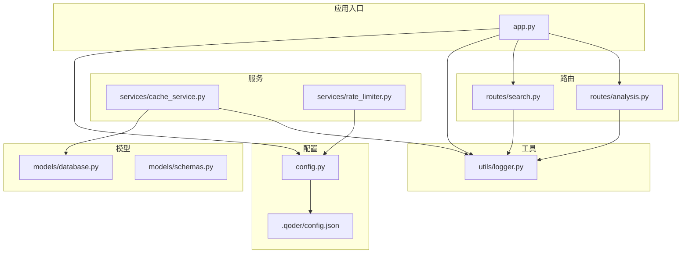
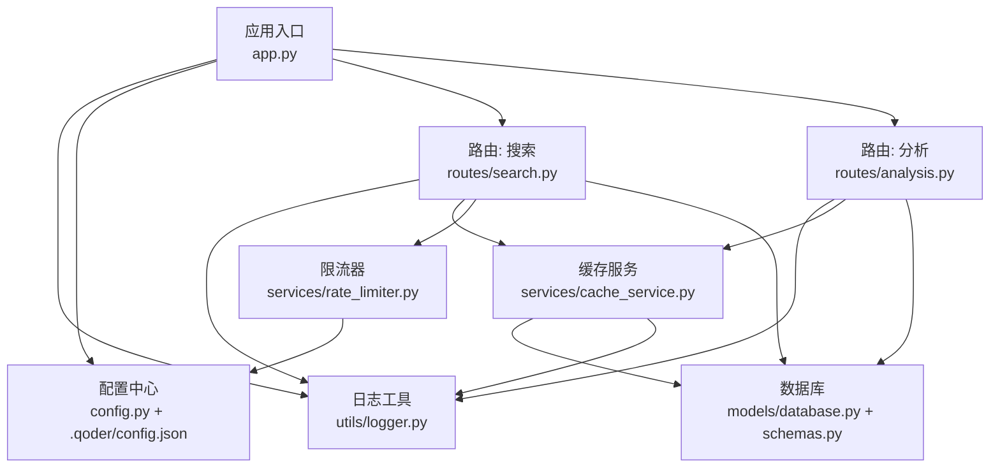
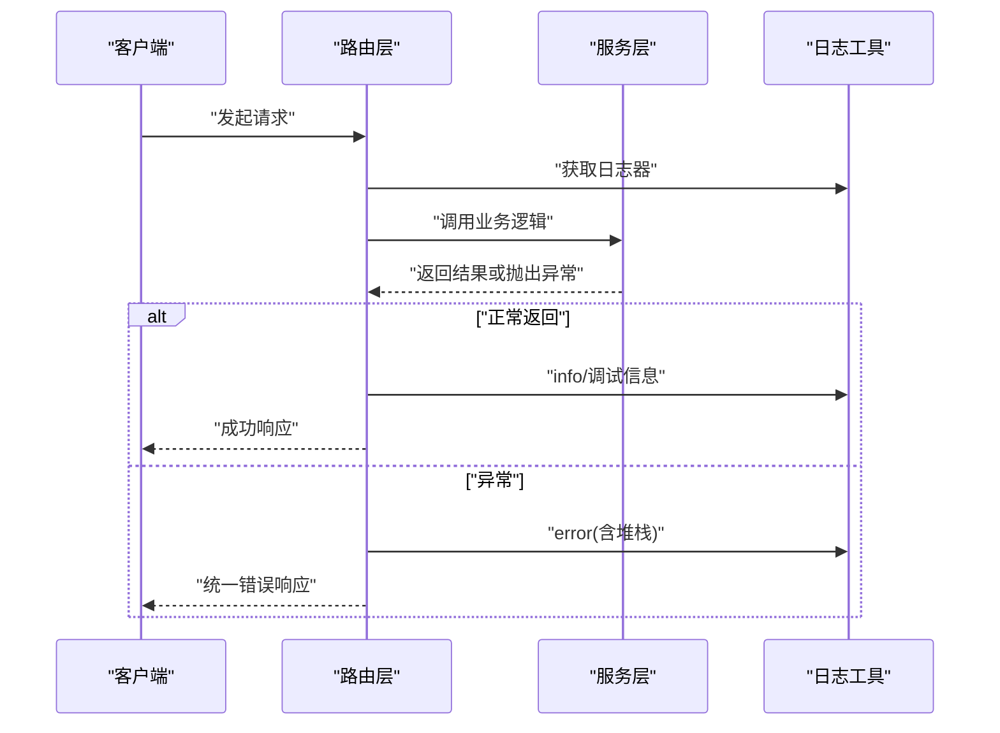
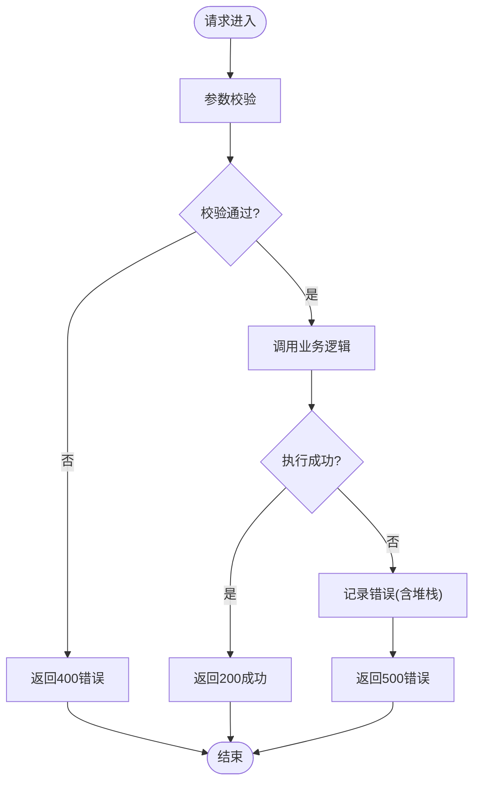
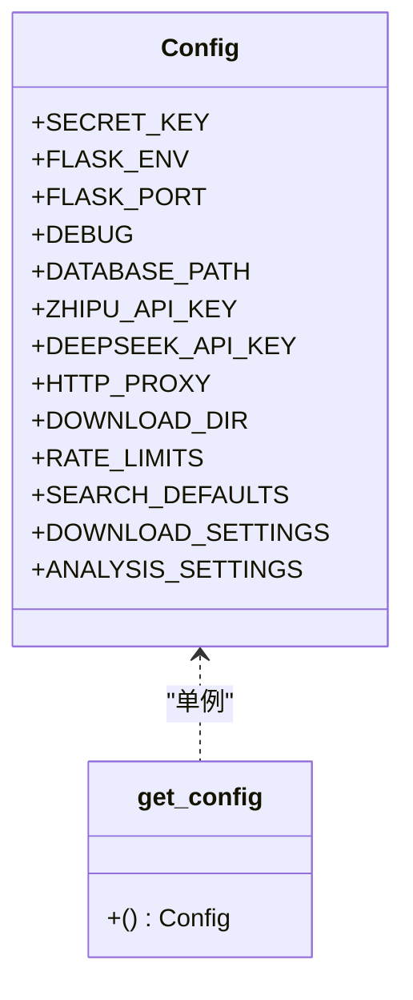
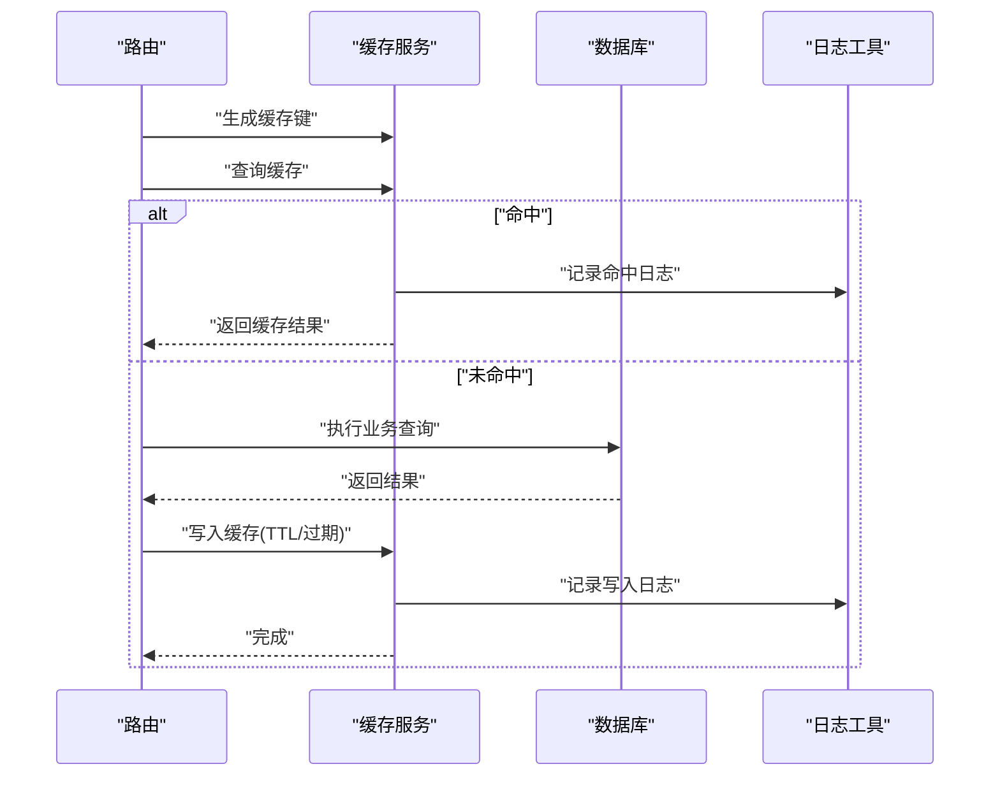
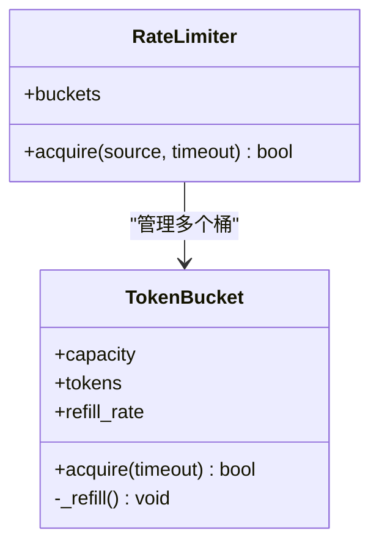
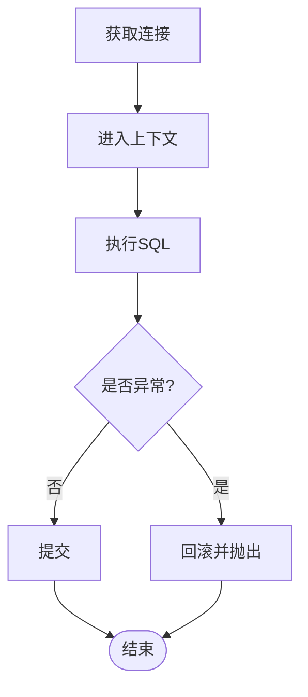
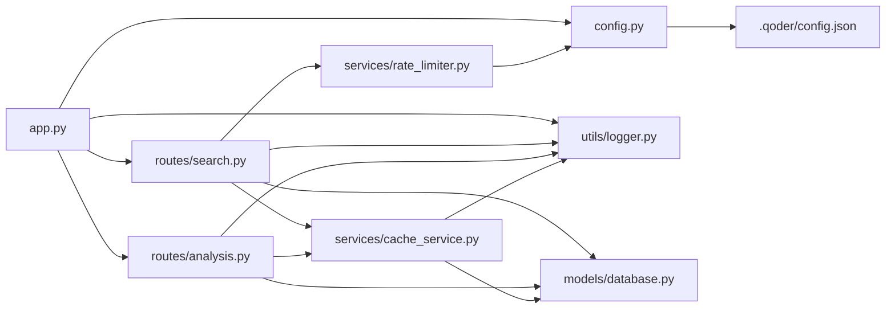

# 工具函数与辅助功能

<cite>
**本文引用的文件**
- [backend/utils/logger.py](file://backend/utils/logger.py)
- [backend/app.py](file://backend/app.py)
- [backend/config.py](file://backend/config.py)
- [.qoder/config.json](file://.qoder/config.json)
- [backend/services/cache_service.py](file://backend/services/cache_service.py)
- [backend/services/rate_limiter.py](file://backend/services/rate_limiter.py)
- [backend/models/database.py](file://backend/models/database.py)
- [backend/models/schemas.py](file://backend/models/schemas.py)
- [backend/routes/search.py](file://backend/routes/search.py)
- [backend/routes/analysis.py](file://backend/routes/analysis.py)
- [run.sh](file://run.sh)
- [backend/test_integration.py](file://backend/test_integration.py)
</cite>

## 目录
1. [简介](#简介)
2. [项目结构](#项目结构)
3. [核心组件](#核心组件)
4. [架构总览](#架构总览)
5. [详细组件分析](#详细组件分析)
6. [依赖关系分析](#依赖关系分析)
7. [性能考虑](#性能考虑)
8. [故障排查指南](#故障排查指南)
9. [结论](#结论)
10. [附录](#附录)

## 简介
本章节聚焦于工具函数与辅助功能，涵盖日志记录系统配置、日志级别与格式化、错误处理机制与异常捕获策略、用户友好错误提示、性能监控与调试工具、故障排查方法，并提供日志配置示例、错误处理最佳实践以及监控指标收集思路。文档以代码为依据，结合架构图与流程图，帮助读者快速理解并扩展这些工具能力。

## 项目结构
后端采用分层组织：应用入口负责初始化与全局错误处理；配置模块集中管理环境变量与运行时配置；工具模块提供日志等通用能力；服务层封装业务逻辑；模型层负责数据库连接与表结构；路由层暴露 API 并统一进行参数校验与错误捕获。

图表来源
- [backend/app.py](file://backend/app.py#L1-L78)
- [backend/config.py](file://backend/config.py#L1-L85)
- [.qoder/config.json](file://.qoder/config.json#L1-L31)
- [backend/utils/logger.py](file://backend/utils/logger.py#L1-L23)
- [backend/services/cache_service.py](file://backend/services/cache_service.py#L1-L104)
- [backend/services/rate_limiter.py](file://backend/services/rate_limiter.py#L1-L75)
- [backend/models/database.py](file://backend/models/database.py#L1-L51)
- [backend/models/schemas.py](file://backend/models/schemas.py#L1-L38)
- [backend/routes/search.py](file://backend/routes/search.py#L1-L28)
- [backend/routes/analysis.py](file://backend/routes/analysis.py#L1-L66)

章节来源
- [backend/app.py](file://backend/app.py#L1-L78)
- [backend/config.py](file://backend/config.py#L1-L85)
- [backend/utils/logger.py](file://backend/utils/logger.py#L1-L23)
- [backend/services/cache_service.py](file://backend/services/cache_service.py#L1-L104)
- [backend/services/rate_limiter.py](file://backend/services/rate_limiter.py#L1-L75)
- [backend/models/database.py](file://backend/models/database.py#L1-L51)
- [backend/models/schemas.py](file://backend/models/schemas.py#L1-L38)
- [backend/routes/search.py](file://backend/routes/search.py#L1-L28)
- [backend/routes/analysis.py](file://backend/routes/analysis.py#L1-L66)

## 核心组件
- 日志系统：统一通过工具模块提供的工厂函数创建日志器，设置级别、处理器与格式化器，确保输出一致且可追踪。
- 配置系统：集中读取环境变量与运行时 JSON 配置，提供单例访问，支撑各模块行为。
- 缓存服务：基于 SQLite 的两级缓存（搜索与分析），提供键生成、命中检查、写入与过期清理。
- 速率限制：基于令牌桶算法的线程安全限流器，支持多数据源独立配额。
- 数据库连接：线程局部连接、上下文管理、自动提交/回滚与 WAL 模式优化。
- 路由与错误处理：API 路由统一进行参数校验与异常捕获，全局错误处理器输出统一错误响应。

章节来源
- [backend/utils/logger.py](file://backend/utils/logger.py#L1-L23)
- [backend/config.py](file://backend/config.py#L1-L85)
- [backend/services/cache_service.py](file://backend/services/cache_service.py#L1-L104)
- [backend/services/rate_limiter.py](file://backend/services/rate_limiter.py#L1-L75)
- [backend/models/database.py](file://backend/models/database.py#L1-L51)
- [backend/routes/search.py](file://backend/routes/search.py#L1-L28)
- [backend/routes/analysis.py](file://backend/routes/analysis.py#L1-L66)

## 架构总览
下图展示日志、配置、缓存、限流与数据库在系统中的交互关系，以及路由层如何统一接入这些工具。

图表来源
- [backend/utils/logger.py](file://backend/utils/logger.py#L1-L23)
- [backend/config.py](file://backend/config.py#L1-L85)
- [.qoder/config.json](file://.qoder/config.json#L1-L31)
- [backend/services/cache_service.py](file://backend/services/cache_service.py#L1-L104)
- [backend/services/rate_limiter.py](file://backend/services/rate_limiter.py#L1-L75)
- [backend/models/database.py](file://backend/models/database.py#L1-L51)
- [backend/models/schemas.py](file://backend/models/schemas.py#L1-L38)
- [backend/routes/search.py](file://backend/routes/search.py#L1-L28)
- [backend/routes/analysis.py](file://backend/routes/analysis.py#L1-L66)
- [backend/app.py](file://backend/app.py#L1-L78)

## 详细组件分析

### 日志记录系统
- 配置方式：通过工厂函数创建命名日志器，若未配置处理器则添加标准输出处理器与格式化器，统一时间戳、级别、模块名与消息格式。
- 日志级别：默认设置为调试级别，便于开发与排障；生产可通过环境变量或配置调整。
- 使用场景：应用入口、路由层、服务层与缓存服务均通过该工具获取日志器，保证跨模块一致性。
- 扩展建议：可增加文件处理器、JSON 格式化器、级别过滤器，或集成结构化日志系统（如 Structlog）。

图表来源
- [backend/routes/search.py](file://backend/routes/search.py#L1-L28)
- [backend/routes/analysis.py](file://backend/routes/analysis.py#L1-L66)
- [backend/app.py](file://backend/app.py#L61-L66)
- [backend/utils/logger.py](file://backend/utils/logger.py#L1-L23)

章节来源
- [backend/utils/logger.py](file://backend/utils/logger.py#L1-L23)
- [backend/app.py](file://backend/app.py#L61-L66)
- [backend/routes/search.py](file://backend/routes/search.py#L1-L28)
- [backend/routes/analysis.py](file://backend/routes/analysis.py#L1-L66)

### 错误处理机制与异常捕获策略
- 路由层捕获：对每个 API 路由在 try-except 中包裹业务调用，记录详细错误与堆栈信息，并返回统一错误体。
- 全局错误处理：应用入口注册全局异常处理器，捕获未处理异常，记录错误并返回通用内部错误响应。
- 用户友好提示：路由层返回结构化的错误字段，包含错误原因与细节；全局处理器避免泄露内部实现细节。
- 最佳实践：区分参数校验错误（400）与业务异常（500）；在开发环境保留堆栈信息，在生产关闭详细堆栈。

图表来源
- [backend/routes/search.py](file://backend/routes/search.py#L16-L27)
- [backend/routes/analysis.py](file://backend/routes/analysis.py#L16-L43)
- [backend/app.py](file://backend/app.py#L61-L66)

章节来源
- [backend/routes/search.py](file://backend/routes/search.py#L1-L28)
- [backend/routes/analysis.py](file://backend/routes/analysis.py#L1-L66)
- [backend/app.py](file://backend/app.py#L61-L66)

### 配置与运行时参数
- 环境变量：通过加载 .env 文件读取密钥、端口、数据库路径、代理等。
- 运行时配置：读取 .qoder/config.json 合并到配置对象，覆盖速率限制、搜索默认值、下载与分析设置。
- 单例访问：提供获取配置实例的工厂函数，避免重复初始化。
- 使用场景：路由层、服务层与限流器均依赖配置决定行为。

图表来源
- [backend/config.py](file://backend/config.py#L15-L85)
- [.qoder/config.json](file://.qoder/config.json#L1-L31)

章节来源
- [backend/config.py](file://backend/config.py#L1-L85)
- [.qoder/config.json](file://.qoder/config.json#L1-L31)

### 缓存服务与性能优化
- 缓存键生成：对查询参数与分析参数进行序列化与哈希，保证键稳定且可复现。
- 搜索缓存：按查询参数哈希查找，支持 TTL 过期；命中则直接返回，未命中则写入。
- 分析缓存：按内容与类型组合哈希，支持 7 天过期；过期自动清理。
- 清理策略：定期删除过期条目，降低数据库膨胀。
- 日志记录：命中与写入均记录调试/信息日志，便于观测缓存效果。

图表来源
- [backend/services/cache_service.py](file://backend/services/cache_service.py#L16-L104)
- [backend/models/database.py](file://backend/models/database.py#L24-L34)
- [backend/utils/logger.py](file://backend/utils/logger.py#L1-L23)

章节来源
- [backend/services/cache_service.py](file://backend/services/cache_service.py#L1-L104)
- [backend/models/database.py](file://backend/models/database.py#L1-L51)
- [backend/models/schemas.py](file://backend/models/schemas.py#L1-L38)

### 速率限制与资源保护
- 令牌桶算法：每个数据源维护独立桶，按 refill_rate 补充 token，acquire 成功扣减。
- 线程安全：使用锁保护 refill 与消费过程，避免并发竞争。
- 默认配额：内置默认速率限制，可被运行时配置覆盖。
- 使用场景：在调用外部数据源前先申请令牌，超时则拒绝请求或降级。

图表来源
- [backend/services/rate_limiter.py](file://backend/services/rate_limiter.py#L5-L75)

章节来源
- [backend/services/rate_limiter.py](file://backend/services/rate_limiter.py#L1-L75)
- [backend/config.py](file://backend/config.py#L50-L52)
- [.qoder/config.json](file://.qoder/config.json#L2-L7)

### 数据库连接与事务
- 线程局部连接：每个线程持有独立连接，避免并发冲突。
- 上下文管理：提供上下文管理器，自动提交或回滚，简化异常处理。
- PRAGMA 优化：启用 WAL 模式、设置忙等待与外键约束，提升并发与一致性。
- 初始化：根据模式脚本创建必要表与索引。

图表来源
- [backend/models/database.py](file://backend/models/database.py#L24-L34)
- [backend/models/schemas.py](file://backend/models/schemas.py#L1-L38)

章节来源
- [backend/models/database.py](file://backend/models/database.py#L1-L51)
- [backend/models/schemas.py](file://backend/models/schemas.py#L1-L38)

## 依赖关系分析
- 路由层依赖日志工具与服务层；服务层依赖配置、缓存与数据库；缓存层依赖数据库与日志；限流器依赖配置；应用入口依赖配置与日志，并注册全局错误处理。
- 配置来源：.env 与 .qoder/config.json 合并，形成统一配置对象。

图表来源
- [backend/app.py](file://backend/app.py#L1-L78)
- [backend/config.py](file://backend/config.py#L1-L85)
- [.qoder/config.json](file://.qoder/config.json#L1-L31)
- [backend/utils/logger.py](file://backend/utils/logger.py#L1-L23)
- [backend/services/cache_service.py](file://backend/services/cache_service.py#L1-L104)
- [backend/services/rate_limiter.py](file://backend/services/rate_limiter.py#L1-L75)
- [backend/models/database.py](file://backend/models/database.py#L1-L51)
- [backend/routes/search.py](file://backend/routes/search.py#L1-L28)
- [backend/routes/analysis.py](file://backend/routes/analysis.py#L1-L66)

章节来源
- [backend/app.py](file://backend/app.py#L1-L78)
- [backend/config.py](file://backend/config.py#L1-L85)
- [backend/utils/logger.py](file://backend/utils/logger.py#L1-L23)
- [backend/services/cache_service.py](file://backend/services/cache_service.py#L1-L104)
- [backend/services/rate_limiter.py](file://backend/services/rate_limiter.py#L1-L75)
- [backend/models/database.py](file://backend/models/database.py#L1-L51)
- [backend/routes/search.py](file://backend/routes/search.py#L1-L28)
- [backend/routes/analysis.py](file://backend/routes/analysis.py#L1-L66)

## 性能考虑
- 缓存优先：搜索与分析结果通过缓存命中显著降低延迟与外部依赖压力。
- 限流保护：针对外部 API 的速率限制避免触发对方限流或被封禁。
- 数据库优化：WAL 模式与忙等待提升并发读写效率；索引加速查询。
- 日志开销：生产环境建议降低日志级别或使用异步日志，避免阻塞请求。
- 监控指标建议：记录请求耗时、缓存命中率、外部调用成功率与失败码分布、错误率与 P95/P99 延迟，结合日志进行关联分析。

## 故障排查指南
- 启动与环境
  - 使用一键脚本启动，确保 Python 虚拟环境、依赖安装与 .env 配置正确。
  - 端口占用与权限问题需检查系统日志与防火墙。
- 日志定位
  - 在路由层与服务层的关键节点添加日志，区分“调试”“信息”“错误”，便于快速定位。
  - 全局错误处理器会记录异常堆栈，优先查看其输出。
- 参数与业务
  - 路由层对空参数返回 400，确认前端传参完整；业务异常返回 500，查看日志堆栈。
  - 使用集成测试脚本验证核心路径（根页面、搜索、历史、下载等）。
- 缓存与限流
  - 若出现“命中率低”或“频繁超时”，检查缓存键生成与 TTL 设置、限流配额是否合理。
  - 定期执行缓存清理，避免数据库膨胀。
- 数据库
  - 关注 WAL 模式与 busy_timeout 配置，避免长时间锁等待导致超时。
  - 核对表结构与索引是否存在，缺失时由初始化脚本补齐。

章节来源
- [run.sh](file://run.sh#L1-L50)
- [backend/test_integration.py](file://backend/test_integration.py#L1-L103)
- [backend/app.py](file://backend/app.py#L61-L66)
- [backend/routes/search.py](file://backend/routes/search.py#L16-L27)
- [backend/routes/analysis.py](file://backend/routes/analysis.py#L16-L43)
- [backend/services/cache_service.py](file://backend/services/cache_service.py#L91-L104)
- [backend/models/database.py](file://backend/models/database.py#L17-L19)

## 结论
本项目的工具函数与辅助功能围绕“统一日志、集中配置、缓存与限流、健壮错误处理”展开，既满足开发期的可观测性，也兼顾生产环境的稳定性与性能。建议在现有基础上引入结构化日志、指标采集与告警，持续优化缓存策略与限流参数，以应对更高并发与更复杂的业务场景。

## 附录

### 日志配置示例（步骤说明）
- 创建日志器：通过工具模块工厂函数获取命名日志器。
- 设置级别：默认为调试级别，可在开发/生产环境中调整。
- 设置处理器：添加标准输出处理器，便于终端查看。
- 设置格式化器：统一时间、级别、模块名与消息格式，便于检索。
- 使用建议：跨模块共享同一日志器；在关键路径记录 info/debug/error；生产关闭详细堆栈。

章节来源
- [backend/utils/logger.py](file://backend/utils/logger.py#L5-L22)

### 错误处理最佳实践
- 路由层：参数校验失败返回 400；业务异常捕获并记录错误，返回统一 500。
- 全局处理器：兜底未处理异常，记录堆栈并返回通用错误。
- 用户提示：在响应中包含错误原因与可读信息，避免泄露内部实现。
- 开发 vs 生产：开发保留堆栈，生产隐藏堆栈细节。

章节来源
- [backend/routes/search.py](file://backend/routes/search.py#L16-L27)
- [backend/routes/analysis.py](file://backend/routes/analysis.py#L16-L43)
- [backend/app.py](file://backend/app.py#L61-L66)

### 监控指标收集思路
- 指标类别：请求量、错误率、响应时间（P50/P90/P95/P99）、缓存命中率、外部调用成功率与失败码分布。
- 来源：路由层统计请求与错误；缓存服务记录命中/写入；限流器记录拒绝次数；数据库记录慢查询与锁等待。
- 建议：结合日志进行关联分析，建立告警阈值与仪表盘。

### 工具函数使用场景与扩展方法
- 日志工具：在每个模块入口处获取日志器，贯穿请求生命周期；扩展为文件输出与 JSON 格式。
- 配置工具：通过单例访问统一配置；扩展支持热更新或远程配置中心。
- 缓存工具：在高频查询与昂贵计算前加缓存；扩展支持分布式缓存与失效广播。
- 限流工具：在外部调用前申请令牌；扩展支持动态配额与熔断降级。
- 数据库工具：使用上下文管理器简化事务；扩展支持连接池与只读副本。