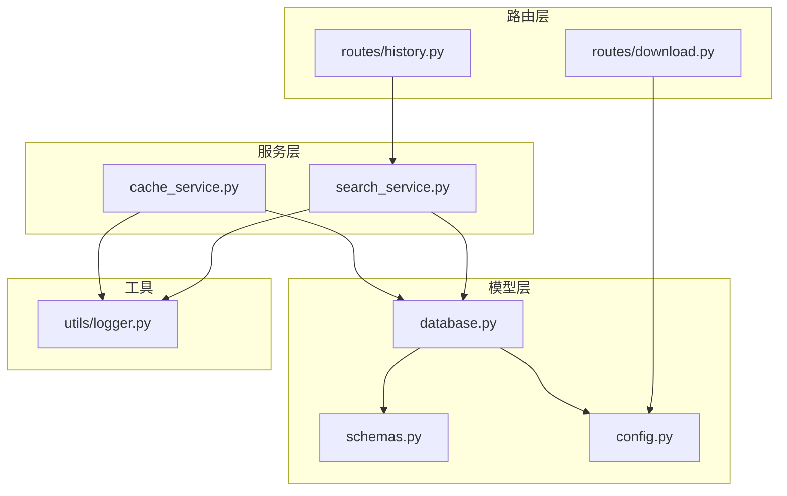
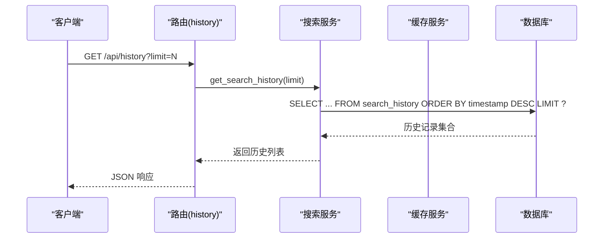
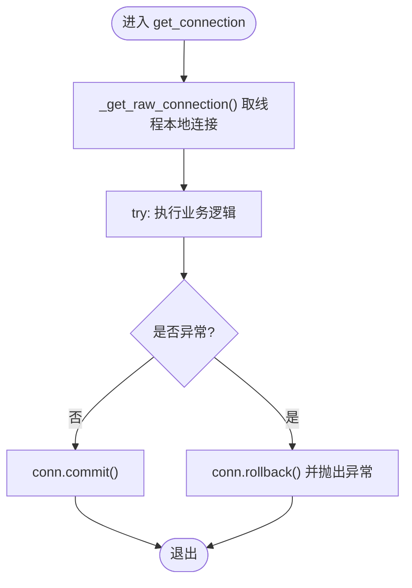
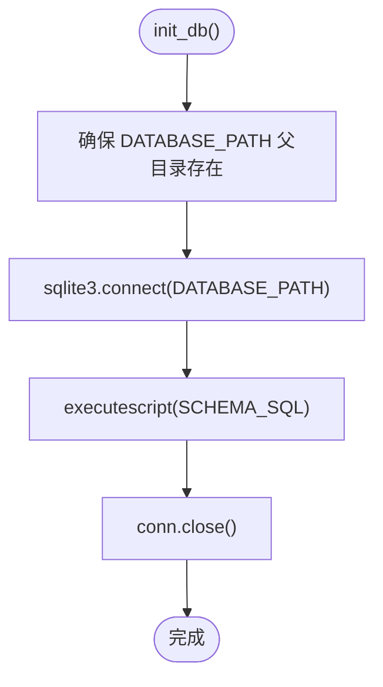
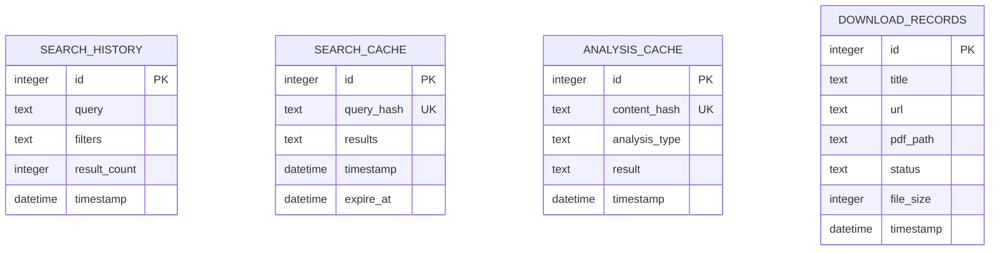
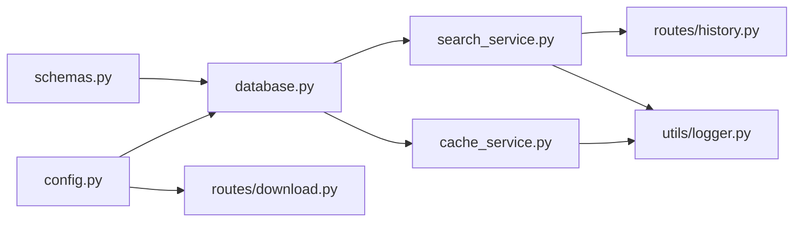

# 数据库模型层

<cite>
**本文引用的文件**
- [backend/models/database.py](file://backend/models/database.py)
- [backend/models/schemas.py](file://backend/models/schemas.py)
- [backend/config.py](file://backend/config.py)
- [backend/services/cache_service.py](file://backend/services/cache_service.py)
- [backend/services/search_service.py](file://backend/services/search_service.py)
- [backend/routes/history.py](file://backend/routes/history.py)
- [backend/routes/download.py](file://backend/routes/download.py)
- [backend/utils/logger.py](file://backend/utils/logger.py)
</cite>

## 目录
1. [简介](#简介)
2. [项目结构](#项目结构)
3. [核心组件](#核心组件)
4. [架构总览](#架构总览)
5. [详细组件分析](#详细组件分析)
6. [依赖关系分析](#依赖关系分析)
7. [性能考量](#性能考量)
8. [故障排查指南](#故障排查指南)
9. [结论](#结论)
10. [附录](#附录)

## 简介
本文件系统性阐述数据库模型层的设计与实现，覆盖以下主题：
- SQLite 连接管理：线程本地连接、自动提交/回滚、WAL 模式与超时配置
- 数据库初始化流程：模式脚本执行、目录准备
- 事务处理机制：上下文管理器封装、异常回滚
- 表结构设计：字段定义、索引策略、约束规则
- 数据模型映射与 ORM 使用：Row 工厂、字典式访问
- 缓存表、历史记录表、下载记录表的设计原理
- SQL 查询示例与最佳实践
- 性能优化建议与数据库维护指南

## 项目结构
数据库模型层位于后端 models 目录，核心文件包括：
- database.py：连接管理、初始化、关闭
- schemas.py：DDL 脚本（表与索引）
- config.py：数据库路径等配置
- services/cache_service.py：缓存读写与过期清理
- services/search_service.py：搜索历史持久化
- routes/history.py、routes/download.py：历史与下载接口
- utils/logger.py：日志工具

图表来源
- [backend/models/database.py](file://backend/models/database.py#L1-L51)
- [backend/models/schemas.py](file://backend/models/schemas.py#L1-L38)
- [backend/config.py](file://backend/config.py#L1-L85)
- [backend/services/cache_service.py](file://backend/services/cache_service.py#L1-L104)
- [backend/services/search_service.py](file://backend/services/search_service.py#L1-L98)
- [backend/routes/history.py](file://backend/routes/history.py#L1-L33)
- [backend/routes/download.py](file://backend/routes/download.py#L1-L98)
- [backend/utils/logger.py](file://backend/utils/logger.py#L1-L23)

章节来源
- [backend/models/database.py](file://backend/models/database.py#L1-L51)
- [backend/models/schemas.py](file://backend/models/schemas.py#L1-L38)
- [backend/config.py](file://backend/config.py#L1-L85)

## 核心组件
- 连接管理器：提供线程本地连接、自动提交/回滚、WAL 模式与超时设置
- 初始化函数：确保数据库目录存在并执行 DDL 脚本
- 关闭连接：释放线程本地连接资源
- 模式定义：集中于 SCHEMA_SQL，包含历史、缓存、下载三类表及索引
- 缓存服务：基于哈希键的搜索与分析结果缓存，含 TTL 与过期清理
- 搜索服务：历史记录持久化与查询接口
- 路由接口：历史查询与删除、下载启动/状态查询/文件下发、下载历史

章节来源
- [backend/models/database.py](file://backend/models/database.py#L11-L50)
- [backend/models/schemas.py](file://backend/models/schemas.py#L1-L38)
- [backend/services/cache_service.py](file://backend/services/cache_service.py#L1-L104)
- [backend/services/search_service.py](file://backend/services/search_service.py#L70-L97)
- [backend/routes/history.py](file://backend/routes/history.py#L10-L32)
- [backend/routes/download.py](file://backend/routes/download.py#L14-L97)

## 架构总览
数据库模型层采用“轻量 ORM”思路：通过 sqlite3.Row 提供字典式访问，结合上下文管理器实现事务语义。初始化阶段一次性创建所有表与索引；运行期通过服务层调用数据库接口，路由层负责对外暴露 API。

图表来源
- [backend/routes/history.py](file://backend/routes/history.py#L10-L21)
- [backend/services/search_service.py](file://backend/services/search_service.py#L82-L90)

## 详细组件分析

### 连接管理与事务处理
- 线程本地连接：每个线程维护独立连接，避免并发冲突
- 自动提交/回滚：上下文管理器在正常退出时提交，异常时回滚
- WAL 模式：提升并发读写性能
- 超时与外键：设置 busy_timeout 避免锁等待超时；启用外键约束保证参照完整性
- 关闭连接：在线程结束或应用停止时释放资源

图表来源
- [backend/models/database.py](file://backend/models/database.py#L24-L33)

章节来源
- [backend/models/database.py](file://backend/models/database.py#L11-L50)

### 数据库初始化流程
- 目录准备：确保数据库父目录存在
- 执行脚本：一次性创建所有表与索引
- 关闭连接：初始化完成后关闭连接，避免资源泄漏

图表来源
- [backend/models/database.py](file://backend/models/database.py#L36-L43)
- [backend/config.py](file://backend/config.py#L35-L36)
- [backend/models/schemas.py](file://backend/models/schemas.py#L1-L38)

章节来源
- [backend/models/database.py](file://backend/models/database.py#L36-L43)
- [backend/config.py](file://backend/config.py#L35-L36)
- [backend/models/schemas.py](file://backend/models/schemas.py#L1-L38)

### 表结构设计与约束
- 搜索历史表（search_history）
  - 字段：自增主键、查询文本、过滤条件（JSON 文本）、结果数量、时间戳
  - 约束：非空、默认值、自动生成时间戳
  - 用途：记录每次搜索的关键信息，支持历史查询与重放
- 搜索缓存表（search_cache）
  - 字段：自增主键、查询哈希唯一键、结果 JSON、时间戳、过期时间
  - 索引：按查询哈希建立唯一索引，加速命中与去重
  - 约束：查询哈希唯一、过期时间字段
  - 用途：缓存搜索结果，降低重复请求开销
- 分析缓存表（analysis_cache）
  - 字段：自增主键、内容哈希唯一键、分析类型、结果 JSON、时间戳
  - 索引：按内容哈希建立唯一索引
  - 约束：内容哈希唯一、分析类型标识
  - 用途：缓存摘要、翻译、论文分析等结果
- 下载记录表（download_records）
  - 字段：自增主键、标题、URL、PDF 路径、状态（默认 pending）、文件大小、时间戳
  - 约束：状态枚举化、默认值、时间戳
  - 用途：跟踪下载任务生命周期与文件落盘情况

图表来源
- [backend/models/schemas.py](file://backend/models/schemas.py#L2-L36)

章节来源
- [backend/models/schemas.py](file://backend/models/schemas.py#L1-L38)

### 索引策略与查询示例
- 索引策略
  - search_cache(query_hash)：唯一索引，加速命中与去重
  - analysis_cache(content_hash)：唯一索引，加速命中
- 查询示例（以路径代替具体代码）
  - 获取最近 N 条搜索历史：[查询路径](file://backend/services/search_service.py#L84-L89)
  - 插入搜索历史：[插入路径](file://backend/services/search_service.py#L73-L77)
  - 查询搜索缓存（未过期）：[查询路径](file://backend/services/cache_service.py#L32-L36)
  - 查询分析缓存（未过期）：[查询路径](file://backend/services/cache_service.py#L59-L63)
  - 删除全部历史记录：[删除路径](file://backend/services/search_service.py#L95-L96)
  - 清理过期缓存（定时任务）：[清理路径](file://backend/services/cache_service.py#L95-L101)

章节来源
- [backend/models/schemas.py](file://backend/models/schemas.py#L17-L26)
- [backend/services/search_service.py](file://backend/services/search_service.py#L82-L97)
- [backend/services/cache_service.py](file://backend/services/cache_service.py#L30-L52)
- [backend/services/cache_service.py](file://backend/services/cache_service.py#L57-L75)
- [backend/services/cache_service.py](file://backend/services/cache_service.py#L91-L103)

### 数据模型映射与 ORM 使用
- Row 工厂：通过 row_factory=sqlite3.Row，使游标返回可按列名访问的行对象
- 字典式访问：服务层将 sqlite3.Row 转为 dict，便于序列化与前端消费
- ORM 使用：未引入第三方 ORM，采用原生 SQL 与 Row 工厂实现最小化抽象

章节来源
- [backend/models/database.py](file://backend/models/database.py#L15-L16)
- [backend/services/search_service.py](file://backend/services/search_service.py#L89-L90)

### 事务处理机制
- 自动提交：正常退出上下文即提交
- 异常回滚：捕获异常后回滚并重新抛出
- 适用范围：所有通过 get_connection() 的数据库操作均受此语义保护

章节来源
- [backend/models/database.py](file://backend/models/database.py#L24-L33)

### 缓存表设计原理
- 搜索缓存
  - 键生成：对查询参数进行标准化 JSON 序列化后取哈希
  - TTL：按小时控制，支持配置
  - 命中：按哈希与过期时间查询，命中则直接返回
- 分析缓存
  - 键生成：对内容截断+分析类型组合后取哈希
  - TTL：按天控制（7 天），到期自动清理
  - 命中：按哈希与类型查询，命中则返回；过期则删除并返回未命中
- 过期清理
  - 定时清理：按当前时间删除过期搜索缓存，按固定时间阈值清理分析缓存

章节来源
- [backend/services/cache_service.py](file://backend/services/cache_service.py#L16-L19)
- [backend/services/cache_service.py](file://backend/services/cache_service.py#L22-L25)
- [backend/services/cache_service.py](file://backend/services/cache_service.py#L30-L52)
- [backend/services/cache_service.py](file://backend/services/cache_service.py#L57-L86)
- [backend/services/cache_service.py](file://backend/services/cache_service.py#L91-L103)

### 历史记录表设计原理
- 记录内容：查询词、过滤条件（JSON 文本）、结果总数
- 写入时机：每次搜索完成后持久化
- 查询接口：支持分页与排序，用于前端历史面板展示
- 清理接口：支持一键清空历史

章节来源
- [backend/services/search_service.py](file://backend/services/search_service.py#L70-L79)
- [backend/services/search_service.py](file://backend/services/search_service.py#L82-L97)
- [backend/routes/history.py](file://backend/routes/history.py#L10-L32)

### 下载记录表设计原理
- 记录内容：标题、URL、PDF 路径、状态、文件大小、时间戳
- 状态机：pending/completed/failed 等（由外部流程更新）
- 文件服务：仅当状态为 completed 且磁盘文件存在时提供下载
- 历史查询：支持列出所有下载记录

章节来源
- [backend/routes/download.py](file://backend/routes/download.py#L14-L39)
- [backend/routes/download.py](file://backend/routes/download.py#L42-L56)
- [backend/routes/download.py](file://backend/routes/download.py#L59-L82)
- [backend/routes/download.py](file://backend/routes/download.py#L85-L97)

## 依赖关系分析
- database.py 依赖 config.py 获取数据库路径，并依赖 schemas.py 的 DDL 脚本
- cache_service.py 与 search_service.py 均依赖 database.py 提供的连接
- routes/history.py 与 routes/download.py 依赖对应服务层，间接依赖 database.py
- logger.py 为各模块提供统一日志输出

图表来源
- [backend/models/database.py](file://backend/models/database.py#L5-L6)
- [backend/config.py](file://backend/config.py#L35-L36)
- [backend/models/schemas.py](file://backend/models/schemas.py#L1-L38)
- [backend/services/cache_service.py](file://backend/services/cache_service.py#L5-L6)
- [backend/services/search_service.py](file://backend/services/search_service.py#L7-L11)
- [backend/routes/history.py](file://backend/routes/history.py#L3-L4)
- [backend/routes/download.py](file://backend/routes/download.py#L7-L8)
- [backend/utils/logger.py](file://backend/utils/logger.py#L5-L22)

章节来源
- [backend/models/database.py](file://backend/models/database.py#L5-L6)
- [backend/config.py](file://backend/config.py#L35-L36)
- [backend/models/schemas.py](file://backend/models/schemas.py#L1-L38)
- [backend/services/cache_service.py](file://backend/services/cache_service.py#L5-L6)
- [backend/services/search_service.py](file://backend/services/search_service.py#L7-L11)
- [backend/routes/history.py](file://backend/routes/history.py#L3-L4)
- [backend/routes/download.py](file://backend/routes/download.py#L7-L8)
- [backend/utils/logger.py](file://backend/utils/logger.py#L5-L22)

## 性能考量
- WAL 模式：提升并发读写吞吐，减少写放大
- busy_timeout：避免短时锁竞争导致的失败重试
- 索引优化：对高频查询字段（如缓存表的哈希键）建立唯一索引
- TTL 控制：合理设置缓存过期时间，平衡命中率与存储占用
- Row 工厂：减少 ORM 抽象成本，提高读取效率
- 日志级别：生产环境建议调整日志级别，降低 I/O 压力

## 故障排查指南
- 连接异常
  - 症状：数据库繁忙或锁等待
  - 处理：检查 busy_timeout 设置；确认并发写入是否过多；必要时拆分写入
- 初始化失败
  - 症状：无法创建表或索引
  - 处理：确认 DATABASE_PATH 可写；检查 SCHEMA_SQL 语法；确保父目录已创建
- 缓存未命中
  - 症状：重复请求未命中缓存
  - 处理：核对键生成逻辑（参数顺序、JSON 序列化）；检查 TTL 是否过短
- 过期清理无效
  - 症状：历史缓存未被清理
  - 处理：确认定时任务是否执行；检查时区与 ISO 时间格式一致性
- 下载文件不可用
  - 症状：状态为 completed 但文件不存在
  - 处理：检查下载目录权限与路径拼接；确认外部流程正确更新状态与路径

章节来源
- [backend/models/database.py](file://backend/models/database.py#L17-L18)
- [backend/models/database.py](file://backend/models/database.py#L36-L43)
- [backend/services/cache_service.py](file://backend/services/cache_service.py#L91-L103)
- [backend/routes/download.py](file://backend/routes/download.py#L66-L79)

## 结论
该数据库模型层以轻量设计实现高可用的数据持久化能力：通过线程本地连接与上下文事务管理，确保并发安全与一致性；通过 WAL 模式与索引策略提升性能；通过缓存表与 TTL 机制显著降低重复计算与网络请求成本；通过历史与下载记录表支撑用户行为追踪与文件管理。整体架构清晰、职责明确，易于扩展与维护。

## 附录
- 配置项参考
  - DATABASE_PATH：数据库文件路径（默认 data/search.db）
  - DOWNLOAD_DIR：下载文件保存目录（默认 data/downloads）
  - SEARCH_DEFAULTS.cache_expire_hours：搜索缓存 TTL（小时）
  - ANALYSIS_SETTINGS.cache_expire_days：分析缓存 TTL（天）

章节来源
- [backend/config.py](file://backend/config.py#L35-L36)
- [backend/config.py](file://backend/config.py#L54-L59)
- [backend/config.py](file://backend/config.py#L67-L73)