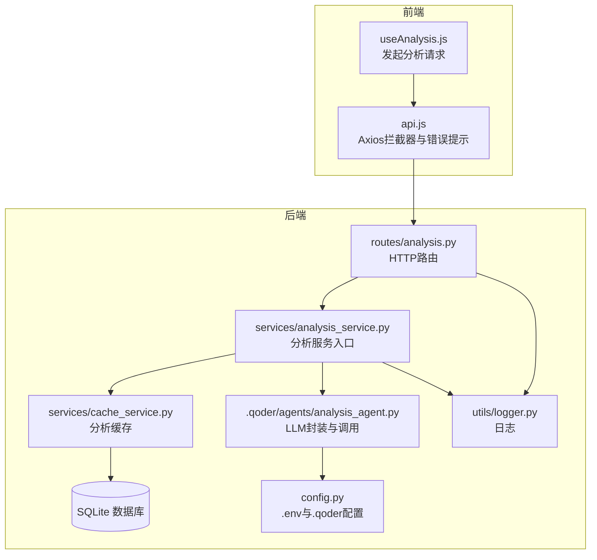
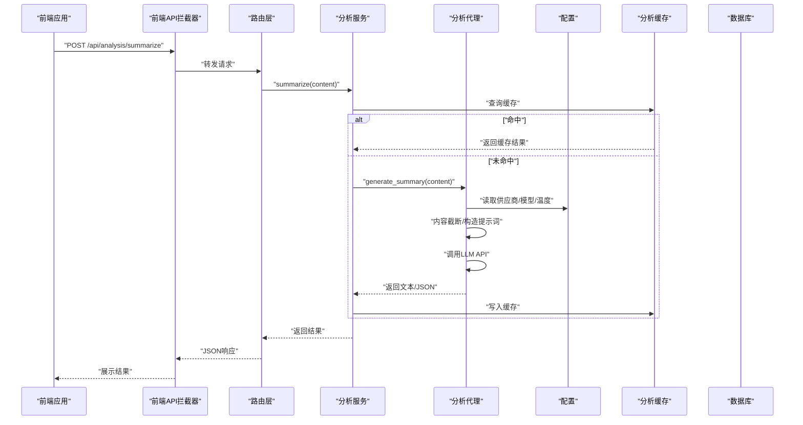
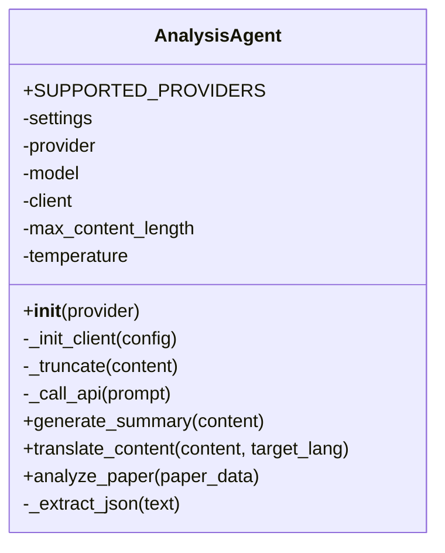
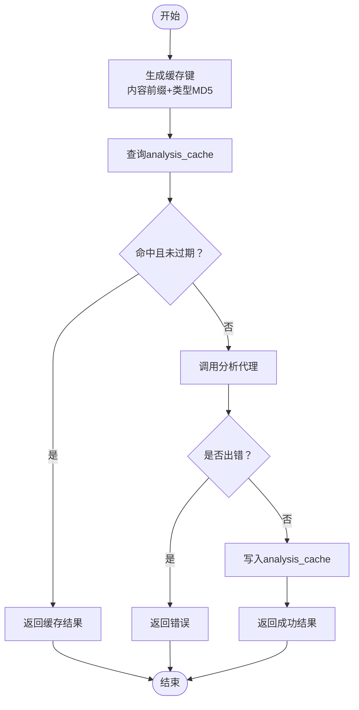
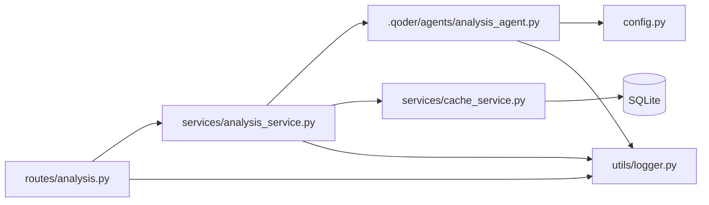

# 分析服务

<cite>
**本文引用的文件**
- [backend/services/analysis_service.py](file://backend/services/analysis_service.py)
- [backend/routes/analysis.py](file://backend/routes/analysis.py)
- [backend/services/cache_service.py](file://backend/services/cache_service.py)
- [backend/config.py](file://backend/config.py)
- [.qoder/config.json](file://.qoder/config.json)
- [.qoder/agents/analysis_agent.py](file://.qoder/agents/analysis_agent.py)
- [backend/models/schemas.py](file://backend/models/schemas.py)
- [backend/utils/logger.py](file://backend/utils/logger.py)
- [frontend/src/hooks/useAnalysis.js](file://frontend/src/hooks/useAnalysis.js)
- [frontend/src/services/api.js](file://frontend/src/services/api.js)
- [.qoder/skills/pdf_download_skill.py](file://.qoder/skills/pdf_download_skill.py)
- [.qoder/skills/web_scraping_skill.py](file://.qoder/skills/web_scraping_skill.py)
</cite>

## 目录
1. [简介](#简介)
2. [项目结构](#项目结构)
3. [核心组件](#核心组件)
4. [架构总览](#架构总览)
5. [详细组件分析](#详细组件分析)
6. [依赖分析](#依赖分析)
7. [性能考虑](#性能考虑)
8. [故障排查指南](#故障排查指南)
9. [结论](#结论)
10. [附录](#附录)

## 简介
本文件系统性阐述“分析服务”的设计与实现，覆盖三大核心能力：摘要生成、文本翻译、论文深度分析；详述其与智谱AI及DeepSeek API的集成方式、模型调用参数、响应解析与错误恢复；解释缓存策略、内容预处理流程与结果格式化；并给出质量控制、性能优化与成本控制建议，以及扩展接口、自定义分析技能集成与调试指南。

## 项目结构
分析服务位于后端Python工程中，采用分层架构：路由层负责HTTP接口与入参校验；服务层封装分析逻辑与缓存；配置层统一管理环境变量与.qoder配置；日志层提供统一日志输出；前端通过React Hook与Axios进行调用。

图表来源
- [backend/routes/analysis.py](file://backend/routes/analysis.py#L1-L66)
- [backend/services/analysis_service.py](file://backend/services/analysis_service.py#L1-L91)
- [.qoder/agents/analysis_agent.py](file://.qoder/agents/analysis_agent.py#L1-L211)
- [backend/services/cache_service.py](file://backend/services/cache_service.py#L1-L104)
- [backend/config.py](file://backend/config.py#L1-L85)
- [backend/utils/logger.py](file://backend/utils/logger.py#L1-L23)
- [frontend/src/hooks/useAnalysis.js](file://frontend/src/hooks/useAnalysis.js#L1-L86)
- [frontend/src/services/api.js](file://frontend/src/services/api.js#L1-L32)

章节来源
- [backend/routes/analysis.py](file://backend/routes/analysis.py#L1-L66)
- [backend/services/analysis_service.py](file://backend/services/analysis_service.py#L1-L91)
- [.qoder/agents/analysis_agent.py](file://.qoder/agents/analysis_agent.py#L1-L211)
- [backend/services/cache_service.py](file://backend/services/cache_service.py#L1-L104)
- [backend/config.py](file://backend/config.py#L1-L85)
- [backend/utils/logger.py](file://backend/utils/logger.py#L1-L23)
- [frontend/src/hooks/useAnalysis.js](file://frontend/src/hooks/useAnalysis.js#L1-L86)
- [frontend/src/services/api.js](file://frontend/src/services/api.js#L1-L32)

## 核心组件
- 路由层：提供三个REST接口，分别对应摘要、翻译与论文分析，负责参数校验与异常捕获。
- 服务层：封装分析入口，统一执行缓存命中、调用代理、写入缓存与错误透传。
- 代理层：封装LLM客户端初始化、模型选择、内容截断、API调用与响应解析（含JSON抽取）。
- 缓存层：基于SQLite的分析缓存表，支持按内容哈希与类型维度存储，带过期清理。
- 配置层：合并.env与.qoder/config.json，提供模型、温度、最大长度、供应商等设置。
- 日志层：统一格式化日志输出，便于问题定位。
- 前端Hook：封装分析请求状态、错误处理与UI交互。

章节来源
- [backend/routes/analysis.py](file://backend/routes/analysis.py#L10-L66)
- [backend/services/analysis_service.py](file://backend/services/analysis_service.py#L25-L91)
- [.qoder/agents/analysis_agent.py](file://.qoder/agents/analysis_agent.py#L13-L211)
- [backend/services/cache_service.py](file://backend/services/cache_service.py#L22-L87)
- [backend/config.py](file://backend/config.py#L67-L73)
- [backend/utils/logger.py](file://backend/utils/logger.py#L5-L23)
- [frontend/src/hooks/useAnalysis.js](file://frontend/src/hooks/useAnalysis.js#L11-L57)

## 架构总览
分析服务的调用链路如下：前端通过Axios调用后端路由，路由进入服务层，服务层先查缓存，未命中则委托代理层调用LLM API，代理层根据配置选择供应商与模型，最终将结果写回缓存并返回给前端。

图表来源
- [frontend/src/services/api.js](file://frontend/src/services/api.js#L4-L29)
- [backend/routes/analysis.py](file://backend/routes/analysis.py#L10-L25)
- [backend/services/analysis_service.py](file://backend/services/analysis_service.py#L25-L44)
- [.qoder/agents/analysis_agent.py](file://.qoder/agents/analysis_agent.py#L86-L115)
- [backend/services/cache_service.py](file://backend/services/cache_service.py#L57-L87)
- [backend/config.py](file://backend/config.py#L67-L73)

## 详细组件分析

### 路由层（HTTP接口）
- 接口职责
  - 摘要：接收content，校验非空，调用服务层summarize并返回JSON。
  - 翻译：接收content与target_lang，校验非空，调用服务层translate并返回JSON。
  - 论文分析：接收title/abstract/snippet至少一项，调用服务层analyze_paper并返回JSON。
- 错误处理：捕获异常并记录日志，返回统一错误结构。
- 参数校验：对必填字段进行基础校验，避免无效请求进入服务层。

章节来源
- [backend/routes/analysis.py](file://backend/routes/analysis.py#L10-L66)

### 服务层（分析入口）
- 缓存策略
  - 生成缓存键：对输入内容截断并拼接分析类型，使用MD5生成稳定键。
  - 查询缓存：若命中且未过期，直接返回；否则调用代理层。
  - 写入缓存：仅在无错误时写入，避免污染缓存。
- 代理懒加载：首次使用时动态导入分析代理类，降低启动开销。
- 统一返回：保证三种分析的返回结构一致，便于前端消费。

章节来源
- [backend/services/analysis_service.py](file://backend/services/analysis_service.py#L25-L91)
- [backend/services/cache_service.py](file://backend/services/cache_service.py#L22-L25)
- [backend/services/cache_service.py](file://backend/services/cache_service.py#L57-L87)

### 代理层（LLM封装与调用）
- 供应商与模型
  - 支持供应商：zhipu（默认）、deepseek。
  - 模型选择：根据供应商从配置读取对应模型名；默认zhipu为“glm-4-flash”，deepseek为“deepseek-chat”。
- 客户端初始化
  - DeepSeek：OpenAI兼容客户端，base_url指向DeepSeek网关，需配置DEEPSEEK_API_KEY。
  - 智谱AI：zhipuai客户端，需配置ZHIPU_API_KEY。
- 内容预处理
  - 截断：按最大长度限制截断，防止超出模型上下文。
  - 提示词：针对不同任务构造结构化提示词，鼓励返回JSON。
- API调用
  - 温度：从配置读取，用于控制创造性。
  - 返回解析：优先尝试解析JSON对象，否则回退为纯文本。
  - 错误恢复：捕获异常并返回错误信息，避免中断流程。

图表来源
- [.qoder/agents/analysis_agent.py](file://.qoder/agents/analysis_agent.py#L13-L211)

章节来源
- [.qoder/agents/analysis_agent.py](file://.qoder/agents/analysis_agent.py#L18-L61)
- [.qoder/agents/analysis_agent.py](file://.qoder/agents/analysis_agent.py#L68-L85)
- [.qoder/agents/analysis_agent.py](file://.qoder/agents/analysis_agent.py#L86-L185)
- [.qoder/agents/analysis_agent.py](file://.qoder/agents/analysis_agent.py#L187-L211)

### 缓存层（分析缓存）
- 表结构
  - analysis_cache：content_hash、analysis_type、result、timestamp。
  - 索引：content_hash索引提升查询效率。
- 缓存键
  - 对输入内容前缀截断后拼接分析类型，再做MD5，确保键稳定且可控。
- 过期策略
  - 分析缓存7天过期，到期自动清理。
- 写入与读取
  - 读取：命中即返回；过期则删除旧项。
  - 写入：仅在无错误时写入，避免污染缓存。

图表来源
- [backend/services/cache_service.py](file://backend/services/cache_service.py#L22-L87)
- [backend/models/schemas.py](file://backend/models/schemas.py#L19-L26)

章节来源
- [backend/services/cache_service.py](file://backend/services/cache_service.py#L57-L87)
- [backend/models/schemas.py](file://backend/models/schemas.py#L19-L26)

### 配置层（环境与.qoder配置）
- 合并策略
  - 读取.env中的密钥与通用配置。
  - 读取.qoder/config.json中的分析设置与默认值。
- 关键配置项
  - provider：默认供应商（zhipu/deepseek）。
  - zhipu_model/deepseek_model：对应模型名称。
  - max_content_length：最大输入长度。
  - temperature：采样温度。
  - cache_expire_days：分析缓存过期天数。
- 默认值
  - 若未配置，使用安全默认值，避免运行时异常。

章节来源
- [backend/config.py](file://backend/config.py#L67-L73)
- [.qoder/config.json](file://.qoder/config.json#L22-L29)

### 前端集成（Hook与API拦截）
- useAnalysis.js
  - 封装三类分析方法：summarize、translate、analyzePaper。
  - 维护loading、visible、selectedItem、activeTab等状态。
  - 成功更新analysisResult，失败回填error字段。
- api.js
  - Axios实例，设置baseURL、超时与Content-Type。
  - 统一拦截器：429限流、5xx错误、400参数错误、超时与网络错误提示。

章节来源
- [frontend/src/hooks/useAnalysis.js](file://frontend/src/hooks/useAnalysis.js#L11-L57)
- [frontend/src/services/api.js](file://frontend/src/services/api.js#L4-L29)

### 技能扩展（下载与抓取）
- PDF下载技能
  - 支持arXiv镜像回退下载，线程池并发控制。
  - 下载记录入库，状态机：pending -> downloading -> completed/failed。
  - 校验PDF有效性，失败自动清理。
- 网页抓取技能
  - 随机User-Agent，解析Zhihu问答与OG元数据。
  - 失败降级与日志记录，避免影响主流程。

章节来源
- [.qoder/skills/pdf_download_skill.py](file://.qoder/skills/pdf_download_skill.py#L21-L88)
- [.qoder/skills/web_scraping_skill.py](file://.qoder/skills/web_scraping_skill.py#L27-L84)

## 依赖分析
- 组件耦合
  - 路由依赖服务层；服务层依赖代理与缓存；代理依赖配置；缓存依赖数据库与日志。
- 外部依赖
  - OpenAI兼容客户端（DeepSeek）与zhipuai（智谱AI）。
  - requests、BeautifulSoup等网络与解析工具。
- 可能的循环依赖
  - 当前模块间为单向依赖，未见循环。

图表来源
- [backend/routes/analysis.py](file://backend/routes/analysis.py#L1-L7)
- [backend/services/analysis_service.py](file://backend/services/analysis_service.py#L1-L10)
- [.qoder/agents/analysis_agent.py](file://.qoder/agents/analysis_agent.py#L1-L10)
- [backend/services/cache_service.py](file://backend/services/cache_service.py#L1-L8)
- [backend/config.py](file://backend/config.py#L1-L12)
- [backend/utils/logger.py](file://backend/utils/logger.py#L1-L23)

## 性能考虑
- 缓存命中率
  - 对重复内容进行缓存，显著降低API调用次数与延迟。
  - 建议：对长文本进行分段或摘要化处理，提高键复用率。
- 内容截断
  - 在代理层对输入进行截断，避免超长请求导致失败与高延迟。
- 并发与限流
  - 前端Axios设置合理超时；可结合后端限流中间件（如现有速率限制配置）控制突发流量。
- 模型参数
  - 适当降低temperature可减少Token消耗；合理设置max_tokens避免冗余输出。
- 数据库索引
  - 已有content_hash索引，建议定期维护统计信息以优化查询计划。

[本节为通用性能建议，不直接分析具体文件]

## 故障排查指南
- 常见错误与定位
  - API密钥未配置：代理层会记录警告；检查.env与.qoder配置。
  - 请求参数错误：路由层返回400，检查content/target_lang/title等字段。
  - 服务器内部错误：路由层捕获异常并返回500，查看后端日志。
  - 缓存异常：确认analysis_cache表结构与索引是否存在。
- 日志与监控
  - 使用统一日志格式，关注“分析缓存命中/未命中”、“API调用失败”、“JSON解析失败”等关键信息。
- 前端提示
  - 429限流、5xx错误、400参数错误、超时与网络错误均有明确提示，便于用户感知。

章节来源
- [.qoder/agents/analysis_agent.py](file://.qoder/agents/analysis_agent.py#L34-L61)
- [backend/routes/analysis.py](file://backend/routes/analysis.py#L16-L24)
- [backend/services/cache_service.py](file://backend/services/cache_service.py#L57-L75)
- [backend/utils/logger.py](file://backend/utils/logger.py#L5-L23)
- [frontend/src/services/api.js](file://frontend/src/services/api.js#L10-L29)

## 结论
分析服务通过清晰的分层设计与完善的缓存策略，实现了摘要、翻译与论文分析的高可用与高性能。通过对供应商与模型的灵活配置、严格的错误恢复与日志体系，系统具备良好的可维护性与可扩展性。建议在生产环境中结合限流、成本阈值与质量评估指标持续优化。

[本节为总结性内容，不直接分析具体文件]

## 附录

### 接口定义与返回格式
- 摘要接口
  - 方法与路径：POST /api/analysis/summarize
  - 请求体：content（必填）
  - 返回：summary（字符串）、key_points（字符串数组）、error（可选）
- 翻译接口
  - 方法与路径：POST /api/analysis/translate
  - 请求体：content（必填）、target_lang（默认zh）
  - 返回：translated_text（字符串）、source_lang（字符串）、error（可选）
- 论文分析接口
  - 方法与路径：POST /api/analysis/paper
  - 请求体：title（可选）、abstract（可选）、snippet（可选）
  - 返回：abstract_summary、method、innovation、results、conclusion（均字符串）、error（可选）

章节来源
- [backend/routes/analysis.py](file://backend/routes/analysis.py#L10-L66)
- [backend/services/analysis_service.py](file://backend/services/analysis_service.py#L25-L91)

### 配置项一览
- 供应商与模型
  - provider：zhipu 或 deepseek
  - zhipu_model：默认“glm-4-flash”
  - deepseek_model：默认“deepseek-chat”
- 分析参数
  - max_content_length：默认4000
  - temperature：默认0.7
  - cache_expire_days：默认7
- 环境变量
  - ZHIPU_API_KEY、DEEPSEEK_API_KEY、HTTP_PROXY、DATABASE_PATH、DOWNLOAD_DIR等

章节来源
- [.qoder/config.json](file://.qoder/config.json#L22-L29)
- [backend/config.py](file://backend/config.py#L38-L42)
- [backend/config.py](file://backend/config.py#L67-L73)

### 数据库模式
- analysis_cache表：content_hash、analysis_type、result、timestamp
- 索引：content_hash

章节来源
- [backend/models/schemas.py](file://backend/models/schemas.py#L19-L26)

### 扩展接口与自定义分析技能
- 扩展接口
  - 在路由层新增Blueprint与视图函数，遵循现有参数校验与错误处理模式。
  - 在服务层新增分析函数，复用缓存与代理层能力。
- 自定义分析技能
  - 参考PDF下载与网页抓取技能，实现异步任务与状态持久化。
  - 在代理层增加新任务的提示词模板与JSON解析逻辑。

章节来源
- [backend/routes/analysis.py](file://backend/routes/analysis.py#L1-L7)
- [backend/services/analysis_service.py](file://backend/services/analysis_service.py#L1-L10)
- [.qoder/skills/pdf_download_skill.py](file://.qoder/skills/pdf_download_skill.py#L21-L48)
- [.qoder/skills/web_scraping_skill.py](file://.qoder/skills/web_scraping_skill.py#L27-L46)