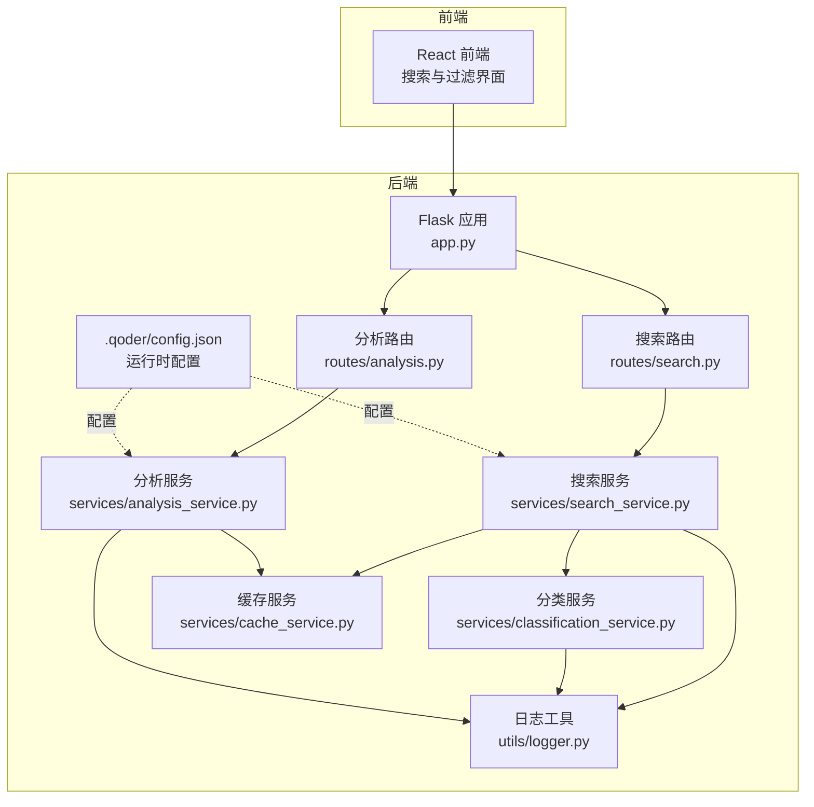
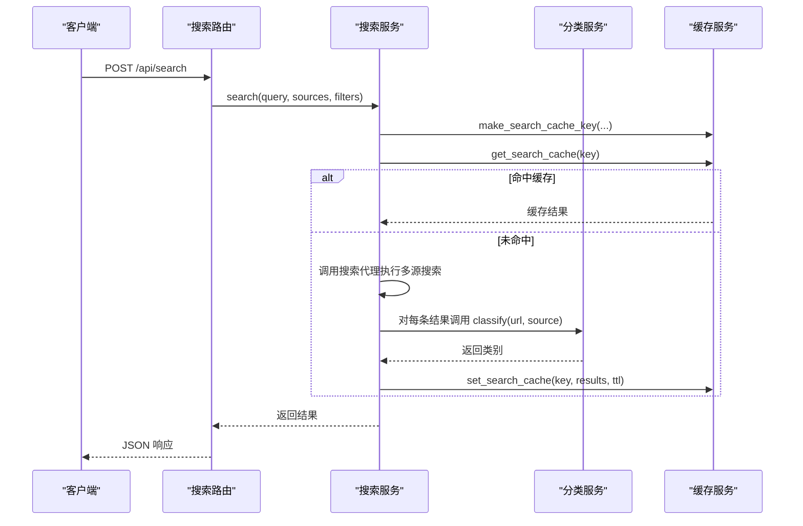
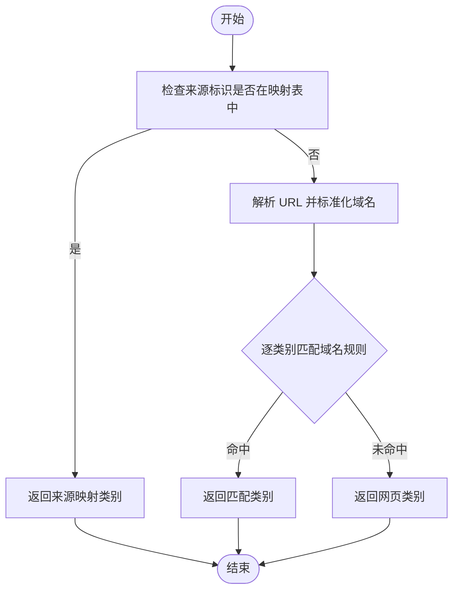
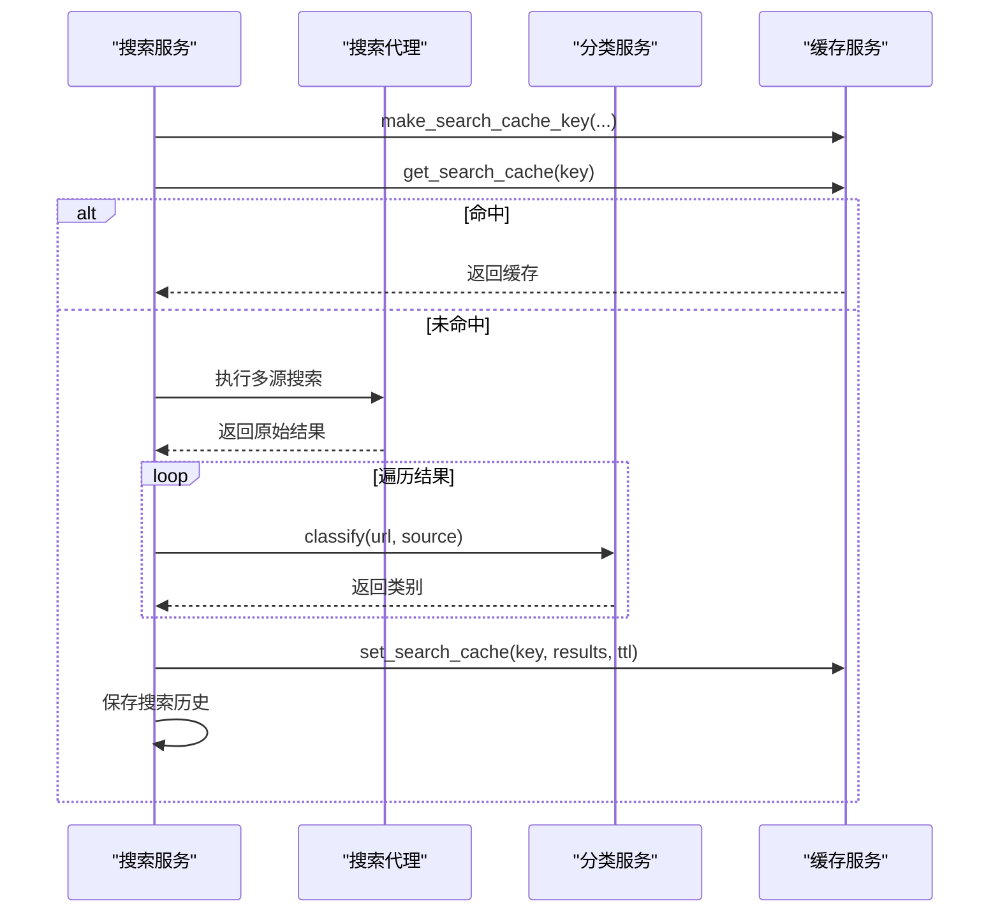
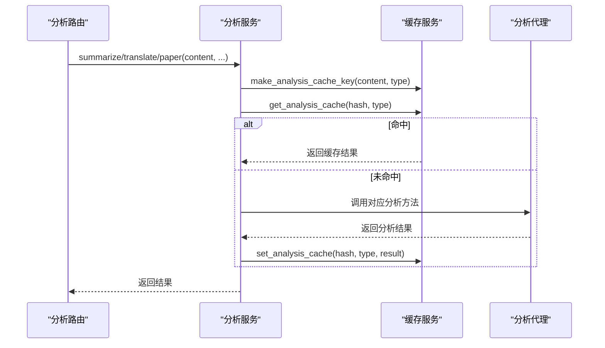
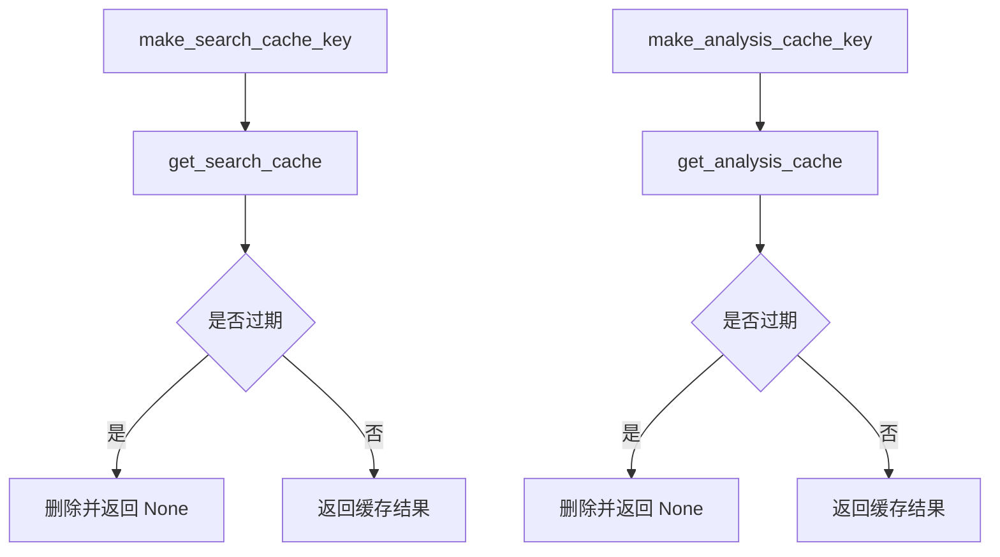
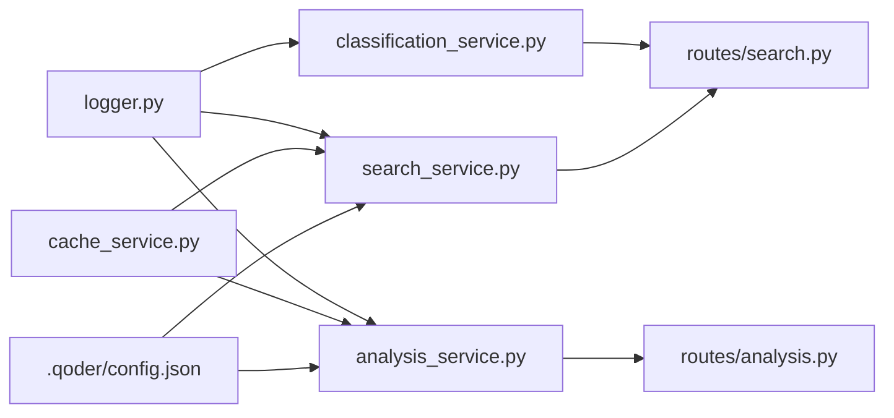

# 分类服务

<cite>
**本文档引用的文件**
- [backend/services/classification_service.py](file://backend/services/classification_service.py)
- [backend/services/search_service.py](file://backend/services/search_service.py)
- [backend/routes/search.py](file://backend/routes/search.py)
- [backend/routes/analysis.py](file://backend/routes/analysis.py)
- [backend/services/analysis_service.py](file://backend/services/analysis_service.py)
- [backend/services/cache_service.py](file://backend/services/cache_service.py)
- [backend/models/schemas.py](file://backend/models/schemas.py)
- [backend/app.py](file://backend/app.py)
- [backend/utils/logger.py](file://backend/utils/logger.py)
- [backend/services/rate_limiter.py](file://backend/services/rate_limiter.py)
- [.qoder/config.json](file://.qoder/config.json)
- [README.md](file://README.md)
</cite>

## 目录
1. [简介](#简介)
2. [项目结构](#项目结构)
3. [核心组件](#核心组件)
4. [架构总览](#架构总览)
5. [详细组件分析](#详细组件分析)
6. [依赖关系分析](#依赖关系分析)
7. [性能考量](#性能考量)
8. [故障排查指南](#故障排查指南)
9. [结论](#结论)
10. [附录](#附录)

## 简介
本文件面向“分类服务”的实现与使用，系统性阐述内容分类算法的工作原理与工程实践，涵盖：
- URL 分析与域名匹配策略
- 内容特征提取与分类决策逻辑
- 分类规则配置与扩展方法
- 分类器训练与准确性评估思路
- 不同内容类型的处理方式与置信度说明
- 新分类类型的添加流程与性能优化建议
- 扩展接口与机器学习模型集成方案

该分类服务在系统中承担“对搜索结果进行内容类别标注”的职责，目前采用基于规则的 URL 域名匹配策略，并在搜索服务中被调用以标注每个结果项的类别。

## 项目结构
后端采用 Flask 微服务架构，分类服务位于业务层，与搜索服务、缓存服务、路由层协同工作；分析服务与缓存服务配合提供摘要、翻译、论文分析等能力。

图表来源
- [backend/app.py](file://backend/app.py#L21-L78)
- [backend/routes/search.py](file://backend/routes/search.py#L10-L28)
- [backend/routes/analysis.py](file://backend/routes/analysis.py#L10-L66)
- [backend/services/search_service.py](file://backend/services/search_service.py#L28-L67)
- [backend/services/classification_service.py](file://backend/services/classification_service.py#L30-L63)
- [backend/services/analysis_service.py](file://backend/services/analysis_service.py#L25-L90)
- [backend/services/cache_service.py](file://backend/services/cache_service.py#L16-L87)
- [backend/utils/logger.py](file://backend/utils/logger.py#L5-L23)
- [.qoder/config.json](file://.qoder/config.json#L1-L31)

章节来源
- [backend/app.py](file://backend/app.py#L21-L78)
- [README.md](file://README.md#L1-L409)

## 核心组件
- 分类服务（URL 域名规则分类）：负责根据 URL 域名与来源标识，将结果归类为学术论文、问答、博客、论坛或网页。
- 搜索服务：统一执行多源搜索，调用分类服务为每条结果打标，并写入缓存与历史。
- 分析服务：提供摘要、翻译、论文分析等能力，内部使用缓存避免重复请求。
- 缓存服务：提供搜索与分析两类缓存，支持过期清理与命中日志。
- 日志工具：统一格式化输出，便于定位问题。
- 运行时配置：包含速率限制、搜索默认参数、分析提供商与模型等。

章节来源
- [backend/services/classification_service.py](file://backend/services/classification_service.py#L30-L63)
- [backend/services/search_service.py](file://backend/services/search_service.py#L28-L67)
- [backend/services/analysis_service.py](file://backend/services/analysis_service.py#L25-L90)
- [backend/services/cache_service.py](file://backend/services/cache_service.py#L16-L87)
- [backend/utils/logger.py](file://backend/utils/logger.py#L5-L23)
- [.qoder/config.json](file://.qoder/config.json#L1-L31)

## 架构总览
分类服务在搜索完成后的结果标注阶段发挥作用，其调用链如下：

图表来源
- [backend/routes/search.py](file://backend/routes/search.py#L10-L28)
- [backend/services/search_service.py](file://backend/services/search_service.py#L28-L67)
- [backend/services/classification_service.py](file://backend/services/classification_service.py#L30-L63)
- [backend/services/cache_service.py](file://backend/services/cache_service.py#L16-L53)

## 详细组件分析

### 分类服务（URL 域名规则分类）
- 规则结构：按类别维护域名集合，支持精确匹配与子域匹配。
- 决策流程：
  1) 优先依据来源标识映射（如 arXiv、Google Scholar、知乎）进行分类；
  2) 若来源未覆盖，则解析 URL，标准化域名（去除 www.），遍历规则匹配；
  3) 默认返回“网页”类别。
- 类别定义：学术论文、问答、博客、论坛、网页。

图表来源
- [backend/services/classification_service.py](file://backend/services/classification_service.py#L30-L63)

章节来源
- [backend/services/classification_service.py](file://backend/services/classification_service.py#L7-L27)
- [backend/services/classification_service.py](file://backend/services/classification_service.py#L30-L63)

### 搜索服务（分类标注与缓存）
- 在搜索完成后，遍历结果列表，调用分类服务为每条结果添加“category”字段。
- 使用缓存键生成与查询，命中则直接返回，未命中则写入缓存。
- 同时记录搜索历史，便于审计与回溯。

图表来源
- [backend/services/search_service.py](file://backend/services/search_service.py#L28-L67)
- [backend/services/classification_service.py](file://backend/services/classification_service.py#L30-L63)
- [backend/services/cache_service.py](file://backend/services/cache_service.py#L16-L53)

章节来源
- [backend/services/search_service.py](file://backend/services/search_service.py#L28-L67)

### 分析服务（摘要/翻译/论文分析）
- 提供摘要、翻译、论文分析三项能力，均具备缓存机制与错误处理。
- 缓存键包含内容片段与分析类型，避免重复调用 LLM。
- 分析代理延迟初始化，按需加载。

图表来源
- [backend/routes/analysis.py](file://backend/routes/analysis.py#L10-L66)
- [backend/services/analysis_service.py](file://backend/services/analysis_service.py#L25-L90)
- [backend/services/cache_service.py](file://backend/services/cache_service.py#L57-L87)

章节来源
- [backend/routes/analysis.py](file://backend/routes/analysis.py#L10-L66)
- [backend/services/analysis_service.py](file://backend/services/analysis_service.py#L25-L90)
- [backend/services/cache_service.py](file://backend/services/cache_service.py#L57-L87)

### 缓存服务（搜索与分析）
- 搜索缓存：基于查询、来源、过滤条件生成哈希键，支持 TTL 过期。
- 分析缓存：基于内容截断与分析类型生成哈希键，支持 7 天过期清理。
- 提供统一的清理机制，定期删除过期条目。

图表来源
- [backend/services/cache_service.py](file://backend/services/cache_service.py#L16-L87)

章节来源
- [backend/services/cache_service.py](file://backend/services/cache_service.py#L16-L104)
- [backend/models/schemas.py](file://backend/models/schemas.py#L1-L38)

### 日志与错误处理
- 统一日志格式，包含时间、级别、模块名与消息。
- 路由层与服务层均捕获异常并返回标准错误响应。
- 分类服务在 URL 解析异常时兜底返回“网页”。

章节来源
- [backend/utils/logger.py](file://backend/utils/logger.py#L5-L23)
- [backend/routes/search.py](file://backend/routes/search.py#L22-L27)
- [backend/routes/analysis.py](file://backend/routes/analysis.py#L22-L24)
- [backend/services/classification_service.py](file://backend/services/classification_service.py#L55-L56)

## 依赖关系分析
- 分类服务依赖日志工具，不依赖数据库或外部模型。
- 搜索服务依赖分类服务、缓存服务与配置，负责结果标注与缓存写入。
- 分析服务依赖缓存服务与分析代理，负责摘要、翻译与论文分析。
- 路由层作为入口，统一校验请求参数并转发至对应服务。
- 运行时配置影响搜索默认行为与分析提供商设置。

图表来源
- [backend/utils/logger.py](file://backend/utils/logger.py#L5-L23)
- [backend/services/classification_service.py](file://backend/services/classification_service.py#L3-L5)
- [backend/services/search_service.py](file://backend/services/search_service.py#L9-L11)
- [backend/services/analysis_service.py](file://backend/services/analysis_service.py#L6-L8)
- [backend/routes/search.py](file://backend/routes/search.py#L3-L4)
- [backend/routes/analysis.py](file://backend/routes/analysis.py#L3-L4)
- [backend/services/cache_service.py](file://backend/services/cache_service.py#L5-L8)
- [.qoder/config.json](file://.qoder/config.json#L1-L31)

章节来源
- [backend/services/classification_service.py](file://backend/services/classification_service.py#L1-L6)
- [backend/services/search_service.py](file://backend/services/search_service.py#L1-L11)
- [backend/services/analysis_service.py](file://backend/services/analysis_service.py#L1-L8)
- [backend/routes/search.py](file://backend/routes/search.py#L1-L4)
- [backend/routes/analysis.py](file://backend/routes/analysis.py#L1-L4)
- [backend/services/cache_service.py](file://backend/services/cache_service.py#L1-L8)
- [.qoder/config.json](file://.qoder/config.json#L1-L31)

## 性能考量
- URL 解析与域名匹配为 O(N)（N 为规则类别数），在小规模规则集下开销极低。
- 分类服务无外部依赖，调用成本低，适合批量标注。
- 搜索与分析均具备缓存，显著降低重复请求与 LLM 调用次数。
- 建议：
  - 控制规则数量与匹配顺序，确保常见域名靠前。
  - 对长尾域名采用通配匹配时注意性能，必要时引入 Trie 或正则优化。
  - 分析缓存键尽量稳定，避免频繁变更导致命中率下降。
  - 结合速率限制与并发控制，避免上游数据源限流。

[本节为通用性能建议，不直接分析具体文件]

## 故障排查指南
- URL 解析异常导致分类失败：分类服务在解析失败时返回“网页”，可通过日志定位具体 URL。
- 路由参数缺失：搜索与分析路由对必填字段进行校验，返回 400 错误。
- 未命中缓存：检查缓存键生成逻辑与数据库表结构，确认 TTL 与过期清理是否正常。
- 日志定位：统一使用模块名前缀的日志输出，结合错误处理器查看堆栈信息。

章节来源
- [backend/services/classification_service.py](file://backend/services/classification_service.py#L55-L56)
- [backend/routes/search.py](file://backend/routes/search.py#L15-L17)
- [backend/routes/analysis.py](file://backend/routes/analysis.py#L15-L17)
- [backend/services/cache_service.py](file://backend/services/cache_service.py#L91-L104)
- [backend/utils/logger.py](file://backend/utils/logger.py#L5-L23)

## 结论
当前分类服务采用简单可靠的 URL 域名规则分类，满足多源搜索结果的快速标注需求。其与缓存、路由、分析服务形成清晰的分层协作，具备良好的可维护性与扩展空间。若未来需要更精细的分类效果，可在保持现有规则的基础上引入内容特征提取与机器学习模型，逐步提升准确性与鲁棒性。

[本节为总结性内容，不直接分析具体文件]

## 附录

### 分类规则配置与扩展
- 规则位置：分类服务内部维护类别与域名集合。
- 扩展步骤：
  1) 在规则字典中新增类别与域名列表；
  2) 如需基于来源的优先映射，补充来源映射表；
  3) 在搜索服务中确认调用位置与字段命名一致；
  4) 前端过滤面板同步新增类别枚举值。
- 影响范围：无需改动路由与缓存逻辑，保持向后兼容。

章节来源
- [backend/services/classification_service.py](file://backend/services/classification_service.py#L7-L27)
- [backend/services/search_service.py](file://backend/services/search_service.py#L55-L58)

### 分类器训练与准确性评估
- 数据准备：收集带标签的 URL/文本样本，标注类别（学术、问答、博客、论坛、网页）。
- 特征提取：除域名外，可引入页面标题、描述、正文关键词、TF-IDF 向量、BERT 文本嵌入等。
- 模型选择：朴素贝叶斯、SVM、随机森林、LightGBM/XGBoost 或深度学习分类器。
- 评估指标：准确率、精确率、召回率、F1 分数、混淆矩阵。
- 交叉验证：采用分层 K 折交叉验证，避免类别不平衡带来的偏差。
- A/B 对比：线上灰度发布，对比规则+模型与纯规则的命中率与用户反馈。

[本节为方法论建议，不直接分析具体文件]

### 置信度计算与阈值策略
- 规则匹配：命中即返回类别，无显式置信度；可考虑为每个域名赋予权重，综合打分后排序取 top-k。
- 机器学习：输出类别概率分布，设定阈值过滤低置信度样本，或采用不确定性采样（如 MC Dropout）估计置信度。
- 前端展示：对低置信度结果提示“待人工确认”或“建议结合来源判断”。

[本节为方法论建议，不直接分析具体文件]

### 机器学习模型集成方案
- 接口设计：新增 classify_ml(url, content) 方法，内部调用模型推理并返回类别与置信度。
- 缓存策略：将 URL/指纹与内容指纹共同构成缓存键，避免重复推理。
- 模型更新：提供热切换与 A/B 实验能力，支持离线训练与在线增量更新。
- 监控指标：模型预测耗时、吞吐量、误判率、漂移检测等。

[本节为架构建议，不直接分析具体文件]

### 速率限制与稳定性
- 速率限制：基于令牌桶算法，针对不同数据源配置容量与补充速率。
- 配置位置：运行时配置文件中 rate_limits 字段，搜索服务与下载服务可复用。
- 建议：为分类服务预留独立桶，避免上游限流影响分类标注。

章节来源
- [backend/services/rate_limiter.py](file://backend/services/rate_limiter.py#L45-L75)
- [.qoder/config.json](file://.qoder/config.json#L2-L7)