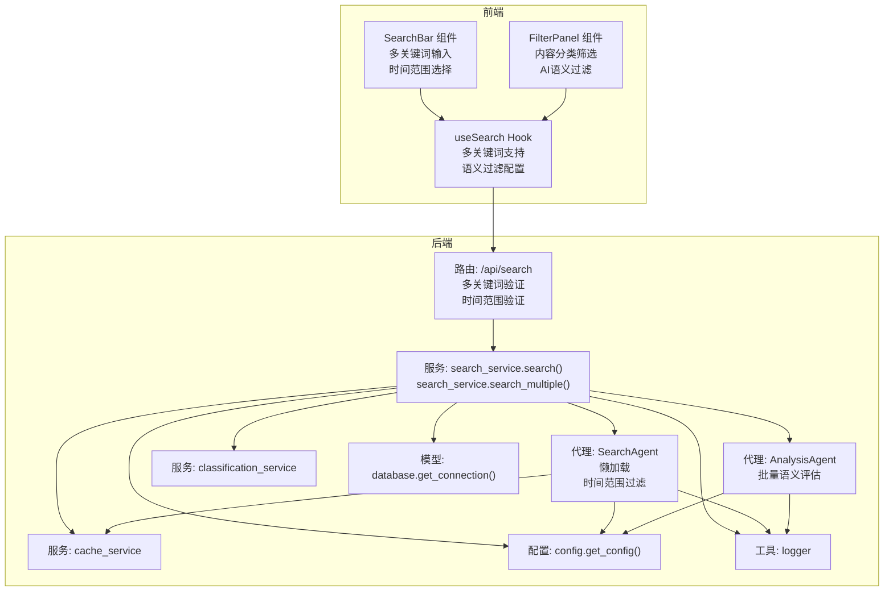
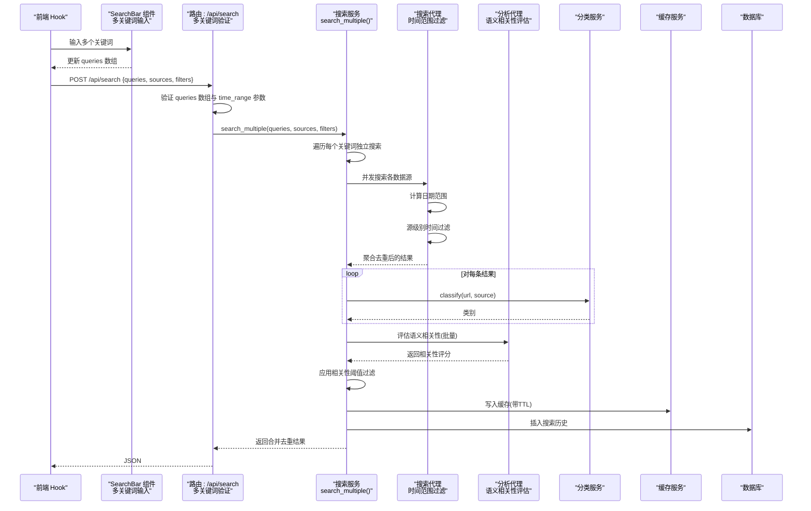
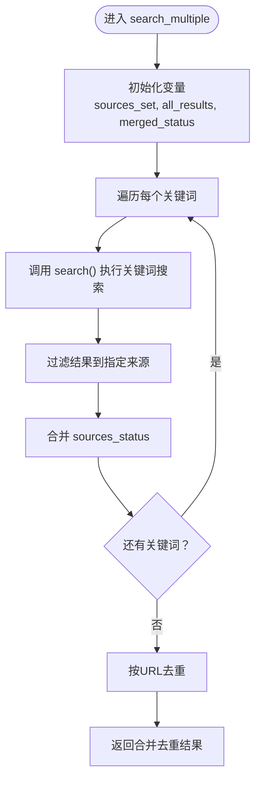
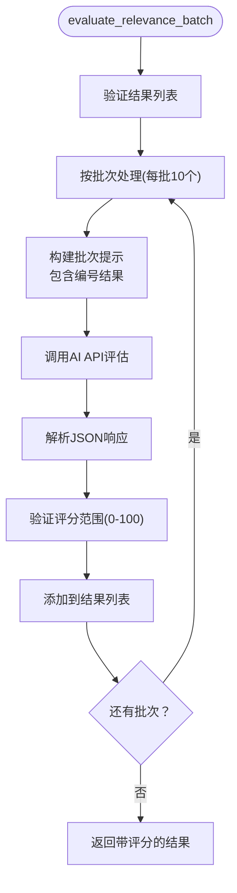
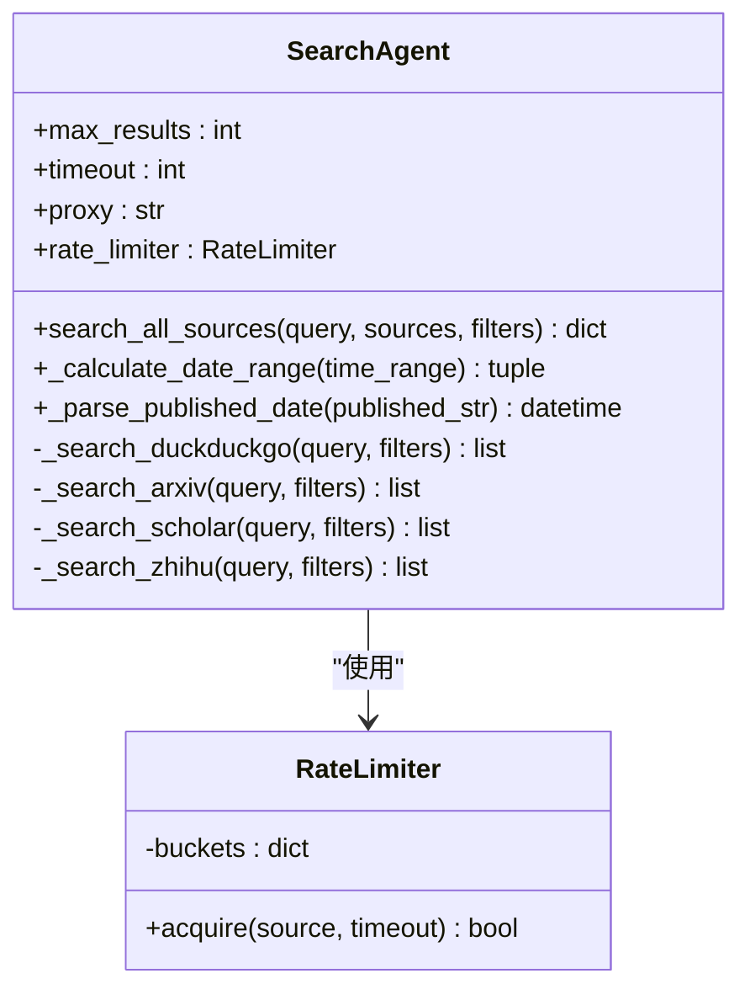
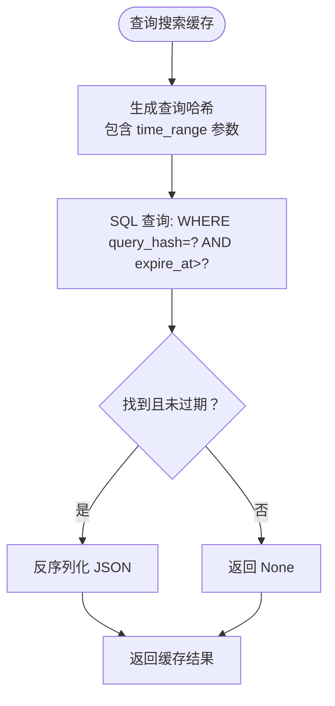
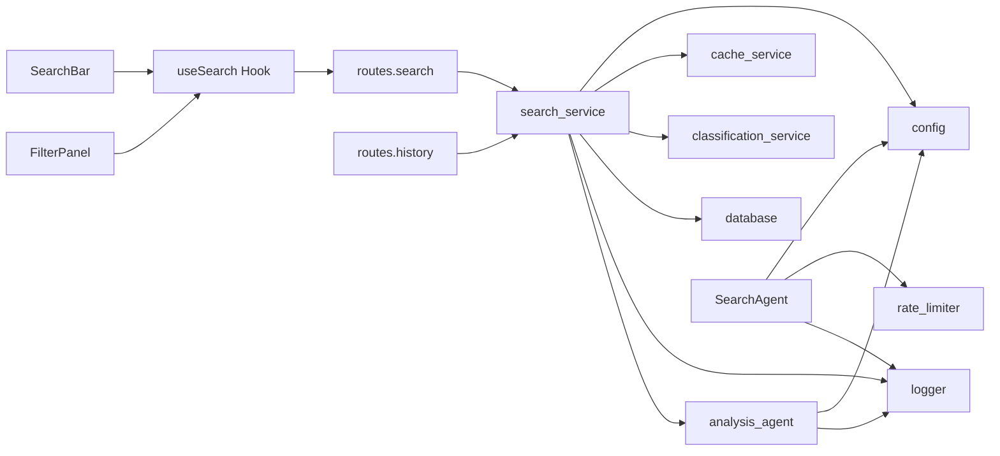

# 搜索服务

<cite>
**本文引用的文件**
- [backend/services/search_service.py](file://backend/services/search_service.py)
- [backend/routes/search.py](file://backend/routes/search.py)
- [backend/models/database.py](file://backend/models/database.py)
- [backend/services/cache_service.py](file://backend/services/cache_service.py)
- [backend/services/classification_service.py](file://backend/services/classification_service.py)
- [backend/models/schemas.py](file://backend/models/schemas.py)
- [backend/config.py](file://backend/config.py)
- [.qoder/agents/search_agent.py](file://.qoder/agents/search_agent.py)
- [.qoder/agents/analysis_agent.py](file://.qoder/agents/analysis_agent.py)
- [backend/utils/logger.py](file://backend/utils/logger.py)
- [frontend/src/hooks/useSearch.js](file://frontend/src/hooks/useSearch.js)
- [frontend/src/components/SearchBar.jsx](file://frontend/src/components/SearchBar.jsx)
- [frontend/src/components/FilterPanel.jsx](file://frontend/src/components/FilterPanel.jsx)
- [backend/routes/history.py](file://backend/routes/history.py)
- [.qoder/config.json](file://.qoder/config.json)
- [README.md](file://README.md)
</cite>

## 目录
1. [简介](#简介)
2. [项目结构](#项目结构)
3. [核心组件](#核心组件)
4. [架构总览](#架构总览)
5. [详细组件分析](#详细组件分析)
6. [依赖关系分析](#依赖关系分析)
7. [性能考虑](#性能考虑)
8. [故障排查指南](#故障排查指南)
9. [结论](#结论)
10. [附录](#附录)

## 简介
本文件面向"搜索服务"的实现与使用，重点阐述多源搜索的执行流程、搜索代理的懒加载机制、缓存策略与结果分类流程；并详细说明搜索函数的参数处理、缓存键生成、搜索历史记录保存与错误处理机制。文档还涵盖搜索代理的动态导入、搜索结果聚合与分类服务集成，以及与 AI 代理系统协作、与数据库历史记录交互的方式。最后提供性能优化技巧、缓存配置选项与调试方法。

**更新** 本次更新增加了对多关键词搜索功能和AI语义过滤能力的支持，包括新增的search_multiple函数、增强的语义过滤配置和相关的前端界面组件。

## 项目结构
后端采用分层设计：路由层负责接收请求并校验参数，服务层封装业务逻辑（搜索、缓存、分类、历史），模型层负责数据库连接与表结构初始化，工具层提供日志等通用能力。前端通过自定义 Hook 发起搜索请求并展示结果。

**图表来源**
- [backend/routes/search.py](file://backend/routes/search.py#L1-L45)
- [backend/services/search_service.py](file://backend/services/search_service.py#L1-L217)
- [.qoder/agents/search_agent.py](file://.qoder/agents/search_agent.py#L1-L408)
- [.qoder/agents/analysis_agent.py](file://.qoder/agents/analysis_agent.py#L1-L310)
- [backend/services/cache_service.py](file://backend/services/cache_service.py#L1-L104)
- [backend/services/classification_service.py](file://backend/services/classification_service.py#L1-L64)
- [backend/models/database.py](file://backend/models/database.py#L1-L51)
- [backend/config.py](file://backend/config.py#L1-L85)
- [backend/utils/logger.py](file://backend/utils/logger.py#L1-L23)
- [frontend/src/hooks/useSearch.js](file://frontend/src/hooks/useSearch.js#L1-L82)
- [frontend/src/components/SearchBar.jsx](file://frontend/src/components/SearchBar.jsx#L1-L66)
- [frontend/src/components/FilterPanel.jsx](file://frontend/src/components/FilterPanel.jsx#L1-L108)

**章节来源**
- [README.md](file://README.md#L1-L409)

## 核心组件
- 搜索服务：负责参数处理、缓存命中检查、调用搜索代理、结果分类、缓存写入与历史记录持久化。**新增** 支持单关键词和多关键词搜索，提供search_multiple函数实现独立执行多个关键词搜索并合并去重。
- 搜索代理：懒加载的多源并发搜索执行器，支持 arXiv、Semantic Scholar、Bing（站内搜索知乎）、DuckDuckGo（通过 Bing）。**新增** 支持时间范围过滤，包括日期范围计算和结果后过滤。
- **新增** 分析代理：提供AI语义相关性评估功能，支持批量评估搜索结果与查询的语义相关性，返回0-100分的评分。
- 缓存服务：基于 SQLite 的搜索与分析缓存，提供键生成、过期时间控制与清理。
- 分类服务：根据 URL 与来源对结果进行内容类别判定。
- 数据库模型：提供线程安全连接、表初始化与上下文管理。
- 配置中心：统一读取 .env 与 .qoder/config.json，合并为运行时配置。**新增** 包含搜索默认配置和AI分析设置。
- 日志工具：统一格式化输出，便于调试与监控。
- **新增** 前端组件：SearchBar 提供多关键词输入框，FilterPanel 提供AI语义过滤配置界面。

**章节来源**
- [backend/services/search_service.py](file://backend/services/search_service.py#L1-L217)
- [.qoder/agents/search_agent.py](file://.qoder/agents/search_agent.py#L1-L408)
- [.qoder/agents/analysis_agent.py](file://.qoder/agents/analysis_agent.py#L1-L310)
- [backend/services/cache_service.py](file://backend/services/cache_service.py#L1-L104)
- [backend/services/classification_service.py](file://backend/services/classification_service.py#L1-L64)
- [backend/models/database.py](file://backend/models/database.py#L1-L51)
- [backend/config.py](file://backend/config.py#L1-L85)
- [backend/utils/logger.py](file://backend/utils/logger.py#L1-L23)
- [frontend/src/hooks/useSearch.js](file://frontend/src/hooks/useSearch.js#L1-L82)
- [frontend/src/components/SearchBar.jsx](file://frontend/src/components/SearchBar.jsx#L1-L66)
- [frontend/src/components/FilterPanel.jsx](file://frontend/src/components/FilterPanel.jsx#L1-L108)

## 架构总览
搜索服务的端到端流程如下：前端通过 Hook 发起搜索请求，后端路由解析参数并校验时间范围，服务层先检查缓存，未命中则通过懒加载的搜索代理并发拉取各数据源，随后对结果进行分类和时间范围过滤，**新增** 执行AI语义过滤评估，写入缓存并保存历史记录，最终返回给前端。

**图表来源**
- [backend/routes/search.py](file://backend/routes/search.py#L13-L45)
- [backend/services/search_service.py](file://backend/services/search_service.py#L135-L186)
- [.qoder/agents/search_agent.py](file://.qoder/agents/search_agent.py#L35-L175)
- [.qoder/agents/analysis_agent.py](file://.qoder/agents/analysis_agent.py#L212-L310)
- [backend/services/classification_service.py](file://backend/services/classification_service.py#L30-L63)
- [backend/services/cache_service.py](file://backend/services/cache_service.py#L30-L52)
- [backend/models/database.py](file://backend/models/database.py#L24-L34)

## 详细组件分析

### 搜索服务（search_service）
职责与流程
- 参数处理：默认来源与过滤器从配置读取，若传入则覆盖。**新增** 支持单关键词和多关键词搜索。
- 缓存键生成：以查询词、排序后的来源列表与过滤器字典拼接后做哈希，保证相同参数得到一致键。
- 缓存命中：若命中则直接返回，避免重复请求。
- 代理调用：懒加载搜索代理，调用其并发搜索方法，聚合结果并去重。
- 结果分类：逐项调用分类服务，为每条结果添加类别字段。
- **新增** 语义过滤：调用分析代理评估结果与查询的语义相关性，按阈值过滤并排序。
- 缓存写入：按配置的 TTL 写入缓存。
- 历史记录：将查询、过滤器与结果数写入数据库。
- 错误处理：捕获异常并记录日志，返回统一错误响应。

**新增** search_multiple函数实现
- 独立执行多个关键词搜索：对每个关键词调用search函数。
- 结果合并：将所有关键词的结果合并到一个列表中。
- 源过滤：仅保留用户指定来源的结果。
- 状态合并：合并各关键词搜索的来源状态，保留最差状态。
- 去重策略：按URL去重，确保合并后的结果唯一性。

关键实现位置
- 懒加载代理与调用：[backend/services/search_service.py](file://backend/services/search_service.py#L23-L38)、[backend/services/search_service.py](file://backend/services/search_service.py#L110-L111)
- 参数与缓存键：[backend/services/search_service.py](file://backend/services/search_service.py#L102-L107)
- 缓存读写：[backend/services/search_service.py](file://backend/services/search_service.py#L124-L126)、[backend/services/cache_service.py](file://backend/services/cache_service.py#L30-L52)
- 分类与写入历史：[backend/services/search_service.py](file://backend/services/search_service.py#L113-L129)
- **新增** 语义过滤：[backend/services/search_service.py](file://backend/services/search_service.py#L41-L78)
- **新增** 多关键词搜索：[backend/services/search_service.py](file://backend/services/search_service.py#L135-L186)

**图表来源**
- [backend/services/search_service.py](file://backend/services/search_service.py#L135-L186)

**章节来源**
- [backend/services/search_service.py](file://backend/services/search_service.py#L1-L217)

### 分析代理（AnalysisAgent）
职责与流程
- 初始化：根据配置选择AI提供商（ZhipuAI或DeepSeek），设置模型和温度参数。
- **新增** 批量语义评估：evaluate_relevance_batch函数评估多个搜索结果与查询的语义相关性。
- **新增** 批处理优化：支持批量处理，减少API调用次数，提高效率。
- **新增** 相关性评分：返回0-100分的语义相关性评分，支持阈值过滤。
- 内容分析：提供摘要生成、翻译和论文分析功能。
- 错误处理：API密钥缺失或初始化失败时返回警告信息。

**新增** 语义相关性评估实现细节
- 批处理机制：每批处理10个结果，优化API调用效率。
- 批次提示构建：为每个批次构建包含编号结果的提示。
- 评分标准：80-100分（高度相关）、60-79分（中度相关）、40-59分（弱相关）、0-39分（不相关）。
- 结果验证：确保评分在0-100范围内，无效评分默认为50分。

关键实现位置
- **新增** 批量评估：[.qoder/agents/analysis_agent.py](file://.qoder/agents/analysis_agent.py#L212-L310)
- **新增** 评分验证：[.qoder/agents/analysis_agent.py](file://.qoder/agents/analysis_agent.py#L294-L305)
- **新增** 批处理循环：[.qoder/agents/analysis_agent.py](file://.qoder/agents/analysis_agent.py#L229-L240)
- AI客户端初始化：[.qoder/agents/analysis_agent.py](file://.qoder/agents/analysis_agent.py#L34-L61)

**图表来源**
- [.qoder/agents/analysis_agent.py](file://.qoder/agents/analysis_agent.py#L212-L310)

**章节来源**
- [.qoder/agents/analysis_agent.py](file://.qoder/agents/analysis_agent.py#L1-L310)

### 搜索代理（SearchAgent）
职责与流程
- 初始化：读取配置中的最大结果数、超时与代理设置，构造速率限制器。
- 并发搜索：根据传入的来源列表映射到对应搜索方法，使用线程池并发执行，统一超时控制。
- 结果聚合：收集各来源结果，按 URL 去重，统计每个来源的状态（成功/失败/超时/跳过）。
- **新增** 时间范围过滤：支持 week、month、year、3years 四种时间范围，通过日期范围计算和结果后过滤实现。
- 数据源实现：
  - DuckDuckGo：通过 Bing 中国站点抓取网页结果。**注意**：DuckDuckGo 不支持时间范围过滤，会忽略 time_range 参数。
  - arXiv：使用官方客户端搜索学术论文。当启用时间过滤时，按提交日期排序并获取更多结果以补偿后过滤。
  - Scholar：调用 Semantic Scholar Graph API，带指数退避重试。支持通过 year 参数进行时间范围过滤。
  - 知乎：通过 Bing 站内搜索限定域名。**注意**：知乎搜索不支持时间范围过滤，会忽略 time_range 参数。
- 速率限制：不同来源使用独立令牌桶，避免被外部 API 限流。

**新增** 时间范围过滤实现细节
- 日期范围计算：根据 time_range 关键字计算开始和结束日期，支持 week(7天)、month(30天)、year(365天)、3years(1095天)。
- 源级别过滤：arXiv 和 Scholar 实现了源级别的精确时间过滤，DuckDuckGo 和 知乎 由于 API 限制不支持。
- 结果后过滤：作为安全网，对所有来源的结果进行统一的时间范围过滤，处理无法解析日期的特殊情况。

关键实现位置
- 并发与超时：[.qoder/agents/search_agent.py](file://.qoder/agents/search_agent.py#L111-L137)
- 去重与汇总：[.qoder/agents/search_agent.py](file://.qoder/agents/search_agent.py#L138-L175)
- **新增** 日期范围计算：[.qoder/agents/search_agent.py](file://.qoder/agents/search_agent.py#L35-L48)
- **新增** 源级别时间过滤：[.qoder/agents/search_agent.py](file://.qoder/agents/search_agent.py#L230-L241)、[.qoder/agents/search_agent.py](file://.qoder/agents/search_agent.py#L294-L301)
- **新增** 结果后过滤：[.qoder/agents/search_agent.py](file://.qoder/agents/search_agent.py#L147-L170)
- 各数据源实现：[.qoder/agents/search_agent.py](file://.qoder/agents/search_agent.py#L177-L407)
- 速率限制器：[backend/services/rate_limiter.py](file://backend/services/rate_limiter.py#L1-L75)

**图表来源**
- [.qoder/agents/search_agent.py](file://.qoder/agents/search_agent.py#L22-L175)
- [backend/services/rate_limiter.py](file://backend/services/rate_limiter.py#L45-L75)

**章节来源**
- [.qoder/agents/search_agent.py](file://.qoder/agents/search_agent.py#L1-L408)
- [backend/services/rate_limiter.py](file://backend/services/rate_limiter.py#L1-L75)

### 缓存服务（cache_service）
职责与流程
- 缓存键生成：对搜索参数序列化并哈希，确保一致性；分析缓存对内容截断后哈希。
- 搜索缓存：按查询哈希与过期时间存储 JSON 结果；读取时检查过期。
- 分析缓存：按内容哈希与分析类型存储 JSON 结果；7 天过期清理。
- 缓存清理：定期删除过期条目，分别清理搜索与分析缓存。

**重要** 缓存键生成已包含时间范围过滤参数，确保相同时间范围的查询使用相同的缓存键。

关键实现位置
- 键生成与哈希：[backend/services/cache_service.py](file://backend/services/cache_service.py#L11-L19)
- 搜索缓存读写：[backend/services/cache_service.py](file://backend/services/cache_service.py#L30-L52)
- 分析缓存读写与清理：[backend/services/cache_service.py](file://backend/services/cache_service.py#L57-L86)、[backend/services/cache_service.py](file://backend/services/cache_service.py#L91-L103)

**图表来源**
- [backend/services/cache_service.py](file://backend/services/cache_service.py#L30-L40)

**章节来源**
- [backend/services/cache_service.py](file://backend/services/cache_service.py#L1-L104)

### 分类服务（classification_service）
职责与流程
- 优先级：来源名映射优先于 URL 规则。
- 来源映射：arXiv、Google Scholar 映射为学术；知乎映射为问答。
- URL 规则：按域名匹配学术、问答、博客、论坛等类别。
- 默认：无法匹配时归类为网页。

关键实现位置
- 规则与映射：[backend/services/classification_service.py](file://backend/services/classification_service.py#L8-L27)、[backend/services/classification_service.py](file://backend/services/classification_service.py#L42-L48)
- URL 解析与匹配：[backend/services/classification_service.py](file://backend/services/classification_service.py#L50-L63)

**图表来源**
- [backend/services/classification_service.py](file://backend/services/classification_service.py#L30-L63)

**章节来源**
- [backend/services/classification_service.py](file://backend/services/classification_service.py#L1-L64)

### 数据库与历史记录（database 与 history 路由）
- 数据库连接：线程本地连接、WAL 模式、超时与外键开启，提供上下文管理。
- 表结构：搜索历史、搜索缓存、分析缓存、下载记录。
- 历史接口：获取最近 N 条历史与清空历史。

**重要** 历史记录表包含 filters 字段，可以存储时间范围过滤参数，用于历史查询和分析。

关键实现位置
- 连接与上下文：[backend/models/database.py](file://backend/models/database.py#L11-L34)
- 表初始化：[backend/models/database.py](file://backend/models/database.py#L36-L43)、[backend/models/schemas.py](file://backend/models/schemas.py#L1-L38)
- 历史查询与清理：[backend/services/search_service.py](file://backend/services/search_service.py#L201-L217)、[backend/routes/history.py](file://backend/routes/history.py#L10-L32)

**章节来源**
- [backend/models/database.py](file://backend/models/database.py#L1-L51)
- [backend/models/schemas.py](file://backend/models/schemas.py#L1-L38)
- [backend/routes/history.py](file://backend/routes/history.py#L1-L33)
- [backend/services/search_service.py](file://backend/services/search_service.py#L189-L217)

### 前端搜索 Hook（useSearch）
- 状态：结果、总数、来源状态、加载、错误、查询词与过滤器。
- 搜索流程：校验查询词，发起 POST 请求，按类别过滤本地结果。
- 过滤器：支持来源、类别和**新增**时间范围切换。
- **新增** 多关键词支持：接受字符串数组，支持最多5个关键词。

**新增** 多关键词搜索实现
- 输入处理：支持字符串和字符串数组两种输入格式。
- 验证与清理：去除空字符串和空白字符，限制最多5个关键词。
- API调用：向后端发送queries数组而非单个query。

**新增** 语义过滤配置
- semantic_filter：布尔值，控制是否启用AI语义过滤，默认true。
- relevance_threshold：整数值(0-100)，控制相关性阈值，默认40。

关键实现位置
- 搜索与过滤：[frontend/src/hooks/useSearch.js](file://frontend/src/hooks/useSearch.js#L23-L67)
- **新增** 多关键词处理：[frontend/src/hooks/useSearch.js](file://frontend/src/hooks/useSearch.js#L24-L26)
- **新增** 语义过滤配置：[frontend/src/hooks/useSearch.js](file://frontend/src/hooks/useSearch.js#L14-L21)

**章节来源**
- [frontend/src/hooks/useSearch.js](file://frontend/src/hooks/useSearch.js#L1-L82)

### 前端组件（SearchBar 与 FilterPanel）
**新增** SearchBar 组件提供多关键词输入功能
- 多关键词输入：支持最多5个关键词，每个关键词一行。
- 动态添加/删除：支持添加和删除关键词输入框。
- 验证与清理：自动去除空白字符，确保至少有一个有效关键词。

**新增** FilterPanel 组件
- 内容分类筛选：全部、学术论文、问答内容、博客文章、论坛帖子、网页
- 显示各类别的结果数量统计
- **新增** AI语义过滤配置：开关控制和相关性阈值滑块
- 与 useSearch hook 的方法绑定

**新增** AI语义过滤界面
- 启用开关：控制是否启用AI语义过滤
- 阈值滑块：0-100分，步长5分，支持预设标记
- 提示信息：解释不同阈值的含义和推荐值

关键实现位置
- **新增** 多关键词输入：[frontend/src/components/SearchBar.jsx](file://frontend/src/components/SearchBar.jsx#L22-L49)
- **新增** 动态关键词管理：[frontend/src/components/SearchBar.jsx](file://frontend/src/components/SearchBar.jsx#L31-L42)
- **新增** 语义过滤界面：[frontend/src/components/FilterPanel.jsx](file://frontend/src/components/FilterPanel.jsx#L65-L103)

**章节来源**
- [frontend/src/components/SearchBar.jsx](file://frontend/src/components/SearchBar.jsx#L1-L66)
- [frontend/src/components/FilterPanel.jsx](file://frontend/src/components/FilterPanel.jsx#L1-L108)

## 依赖关系分析
- 搜索服务依赖配置中心、缓存服务、分类服务、数据库与日志工具。
- 搜索代理依赖速率限制器与配置中心。
- **新增** 分析代理提供AI语义过滤能力，与搜索服务协同工作。
- 路由层仅负责参数校验与异常捕获，不参与业务逻辑。
- 历史路由依赖搜索服务提供的历史查询与清理接口。
- **新增** 前端组件依赖 useSearch hook 提供的状态和方法。

**图表来源**
- [backend/routes/search.py](file://backend/routes/search.py#L1-L45)
- [backend/services/search_service.py](file://backend/services/search_service.py#L1-L217)
- [backend/services/cache_service.py](file://backend/services/cache_service.py#L1-L104)
- [backend/services/classification_service.py](file://backend/services/classification_service.py#L1-L64)
- [backend/models/database.py](file://backend/models/database.py#L1-L51)
- [backend/config.py](file://backend/config.py#L1-L85)
- [.qoder/agents/search_agent.py](file://.qoder/agents/search_agent.py#L1-L408)
- [.qoder/agents/analysis_agent.py](file://.qoder/agents/analysis_agent.py#L1-L310)
- [backend/services/rate_limiter.py](file://backend/services/rate_limiter.py#L1-L75)
- [backend/routes/history.py](file://backend/routes/history.py#L1-L33)
- [frontend/src/hooks/useSearch.js](file://frontend/src/hooks/useSearch.js#L1-L82)
- [frontend/src/components/SearchBar.jsx](file://frontend/src/components/SearchBar.jsx#L1-L66)
- [frontend/src/components/FilterPanel.jsx](file://frontend/src/components/FilterPanel.jsx#L1-L108)

**章节来源**
- [backend/routes/search.py](file://backend/routes/search.py#L1-L45)
- [backend/routes/history.py](file://backend/routes/history.py#L1-L33)
- [backend/services/search_service.py](file://backend/services/search_service.py#L1-L217)
- [.qoder/agents/search_agent.py](file://.qoder/agents/search_agent.py#L1-L408)
- [.qoder/agents/analysis_agent.py](file://.qoder/agents/analysis_agent.py#L1-L310)
- [frontend/src/hooks/useSearch.js](file://frontend/src/hooks/useSearch.js#L1-L82)
- [frontend/src/components/SearchBar.jsx](file://frontend/src/components/SearchBar.jsx#L1-L66)
- [frontend/src/components/FilterPanel.jsx](file://frontend/src/components/FilterPanel.jsx#L1-L108)

## 性能考虑
- 懒加载代理：首次使用时才导入与实例化，降低启动开销。
- 并发搜索：线程池并发拉取各数据源，缩短总等待时间；统一超时避免长时间阻塞。
- 去重策略：按 URL 去重，避免重复结果影响体验与资源浪费。
- 速率限制：不同来源独立令牌桶，平滑请求节奏，降低被限流风险。
- 缓存策略：搜索结果按小时级 TTL 缓存，分析结果按天级缓存，显著减少重复请求。
- **新增** 多关键词优化：search_multiple函数避免重复搜索相同来源，提高整体效率。
- **新增** 批量语义评估：分析代理支持批量处理，减少API调用次数，提高语义过滤效率。
- **新增** 相关性阈值优化：通过阈值控制减少后续处理的工作量。
- **新增** 时间范围优化：arXiv 在启用时间过滤时按提交日期排序并获取更多结果，确保质量的同时减少后过滤的影响。
- 数据库优化：WAL 模式提升并发读写性能；索引加速缓存查询。
- 前端过滤：客户端按类别过滤，减少不必要的网络请求。

**章节来源**
- [.qoder/agents/search_agent.py](file://.qoder/agents/search_agent.py#L230-L241)
- [backend/services/rate_limiter.py](file://backend/services/rate_limiter.py#L45-L75)
- [backend/services/cache_service.py](file://backend/services/cache_service.py#L43-L52)
- [backend/models/database.py](file://backend/models/database.py#L17-L18)
- [.qoder/agents/analysis_agent.py](file://.qoder/agents/analysis_agent.py#L229-L240)
- [backend/services/search_service.py](file://backend/services/search_service.py#L135-L186)

## 故障排查指南
- 搜索为空或部分来源失败
  - 检查各数据源可用性与网络代理配置。
  - 查看后端日志定位具体来源错误。
  - 关注超时与限流情况。
- 缓存未生效
  - 确认缓存键生成是否一致（参数顺序与过滤器字典需稳定）。
  - 检查数据库连接与表是否存在。
- 历史记录异常
  - 确认数据库初始化完成与表结构正确。
  - 检查插入语句与 JSON 序列化。
- **新增** 多关键词搜索问题
  - 确认前端输入的关键词数量不超过5个。
  - 检查后端路由对queries数组的验证逻辑。
  - 验证search_multiple函数的去重和状态合并逻辑。
- **新增** AI语义过滤问题
  - 确认.env中AI API密钥配置正确。
  - 检查分析代理的客户端初始化是否成功。
  - 验证相关性阈值在0-100范围内。
  - 查看语义过滤的日志输出。
- **新增** 时间范围过滤问题
  - 确认前端时间范围选择值在 {"week", "month", "year", "3years", None} 集合内。
  - 检查 arXiv 和 Scholar 的时间过滤是否正常工作。
  - 验证结果后过滤逻辑是否正确处理无法解析的日期。

**章节来源**
- [backend/routes/search.py](file://backend/routes/search.py#L24-L29)
- [backend/services/search_service.py](file://backend/services/search_service.py#L189-L198)
- [backend/models/database.py](file://backend/models/database.py#L36-L43)
- [backend/models/schemas.py](file://backend/models/schemas.py#L1-L38)
- [.qoder/agents/search_agent.py](file://.qoder/agents/search_agent.py#L35-L48)
- [.qoder/agents/analysis_agent.py](file://.qoder/agents/analysis_agent.py#L34-L61)

## 结论
该搜索服务通过懒加载代理、并发搜索、统一缓存与分类机制，实现了高效稳定的多源聚合搜索。**新增** 的多关键词搜索功能通过search_multiple函数支持独立执行多个关键词搜索并合并去重，显著提升了复杂查询场景下的搜索效果。**新增** 的AI语义过滤能力通过分析代理提供批量语义相关性评估，支持0-100分的评分和阈值过滤，进一步提高了搜索结果的相关性和质量。配合SQLite历史记录、前端本地过滤和多关键词输入界面，形成了完整的用户体验闭环。通过合理的配置与日志体系，能够有效定位与解决运行时问题。

## 附录

### API 定义（搜索）
- 方法与路径：POST /api/search
- 请求体
  - **新增** queries: 字符串数组，必填，最多5个关键词
  - **新增** query: 字符串，兼容旧版本，可选
  - sources: 字符串数组，默认来自配置
  - filters: 字典，默认空
    - **新增** time_range: 字符串，可选，支持 "week"、"month"、"year"、"3years" 或 null
    - **新增** semantic_filter: 布尔值，可选，控制是否启用AI语义过滤，默认true
    - **新增** relevance_threshold: 整数(0-100)，可选，相关性阈值，默认40
- 响应
  - results: 结果数组
  - total: 结果总数
  - sources_status: 各来源状态（success/failed/skipped/timeout）

**章节来源**
- [backend/routes/search.py](file://backend/routes/search.py#L13-L45)
- [README.md](file://README.md#L215-L248)

### 配置选项
- 速率限制（.qoder/config.json）
  - arxiv: capacity/refill_rate
  - zhihu: capacity/refill_rate
  - scholar: capacity/refill_rate
  - duckduckgo: capacity/refill_rate
- 搜索默认（.qoder/config.json）
  - max_results_per_source
  - timeout_seconds
  - cache_expire_hours
  - default_sources
  - **新增** enable_semantic_filter: 全局开关，控制是否启用AI语义过滤
  - **新增** relevance_threshold: 默认相关性阈值 (0-100)
- HTTP 代理（.env）
  - HTTP_PROXY/HTTPS_PROXY
- **新增** AI分析配置（.qoder/config.json）
  - provider: AI提供商（zhipu/deepseek）
  - zhipu_model: 智谱AI模型名称
  - deepseek_model: DeepSeek模型名称
  - max_content_length: 最大内容长度
  - temperature: AI模型温度参数
  - cache_expire_days: 分析缓存过期天数

**章节来源**
- [.qoder/config.json](file://.qoder/config.json#L1-L31)
- [backend/config.py](file://backend/config.py#L53-L73)
- [README.md](file://README.md#L400-L436)

### 多关键词搜索实现
- **新增** 输入验证：支持字符串和字符串数组，最多5个关键词。
- **新增** 独立搜索：对每个关键词调用search函数，避免重复搜索。
- **新增** 结果合并：将所有关键词的结果合并到一个列表中。
- **新增** 去重策略：按URL去重，确保结果唯一性。
- **新增** 状态合并：合并各关键词搜索的来源状态，保留最差状态。

**章节来源**
- [backend/services/search_service.py](file://backend/services/search_service.py#L135-L186)
- [backend/routes/search.py](file://backend/routes/search.py#L18-L29)

### AI语义过滤配置
- **新增** 语义过滤开关：enable_semantic_filter，全局控制是否启用。
- **新增** 相关性阈值：relevance_threshold，控制过滤严格程度。
- **新增** 批量评估：分析代理支持批量处理，提高效率。
- **新增** 评分标准：0-100分，支持阈值过滤和排序。

**章节来源**
- [backend/services/search_service.py](file://backend/services/search_service.py#L41-L78)
- [.qoder/agents/analysis_agent.py](file://.qoder/agents/analysis_agent.py#L212-L310)
- [frontend/src/components/FilterPanel.jsx](file://frontend/src/components/FilterPanel.jsx#L65-L103)
- [frontend/src/hooks/useSearch.js](file://frontend/src/hooks/useSearch.js#L14-L21)

### 时间范围过滤参数验证
- **新增** 有效时间范围集合：{"week", "month", "year", "3years", None}
- **新增** 路由层参数验证：确保 time_range 参数在允许集合内
- **新增** 前端组件支持：SearchBar 提供时间范围选择界面

**章节来源**
- [backend/routes/search.py](file://backend/routes/search.py#L9-L37)
- [frontend/src/components/SearchBar.jsx](file://frontend/src/components/SearchBar.jsx#L12-L18)
- [frontend/src/hooks/useSearch.js](file://frontend/src/hooks/useSearch.js#L17)

### 搜索代理时间范围实现
- **新增** 日期范围计算：根据关键字映射到天数，计算开始和结束日期
- **新增** 源级别过滤：arXiv 按提交日期排序，Scholar 使用 year 参数
- **新增** 结果后过滤：统一的时间范围安全网，处理无法解析日期的情况
- **新增** 不支持时间过滤的数据源：DuckDuckGo 和 知乎，会记录日志并忽略 time_range 参数

**章节来源**
- [.qoder/agents/search_agent.py](file://.qoder/agents/search_agent.py#L35-L48)
- [.qoder/agents/search_agent.py](file://.qoder/agents/search_agent.py#L230-L241)
- [.qoder/agents/search_agent.py](file://.qoder/agents/search_agent.py#L294-L301)
- [.qoder/agents/search_agent.py](file://.qoder/agents/search_agent.py#L147-L170)
- [.qoder/agents/search_agent.py](file://.qoder/agents/search_agent.py#L182-L184)
- [.qoder/agents/search_agent.py](file://.qoder/agents/search_agent.py#L363-L365)