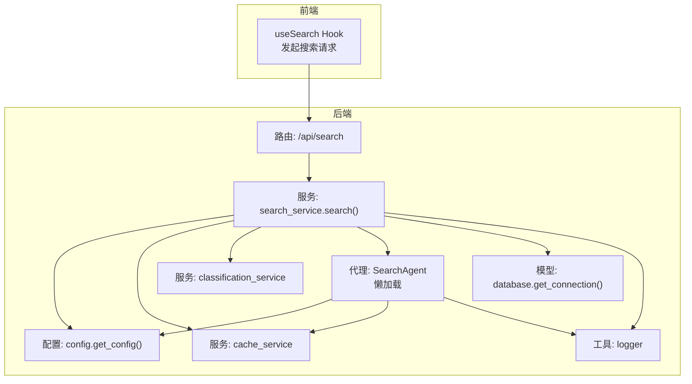
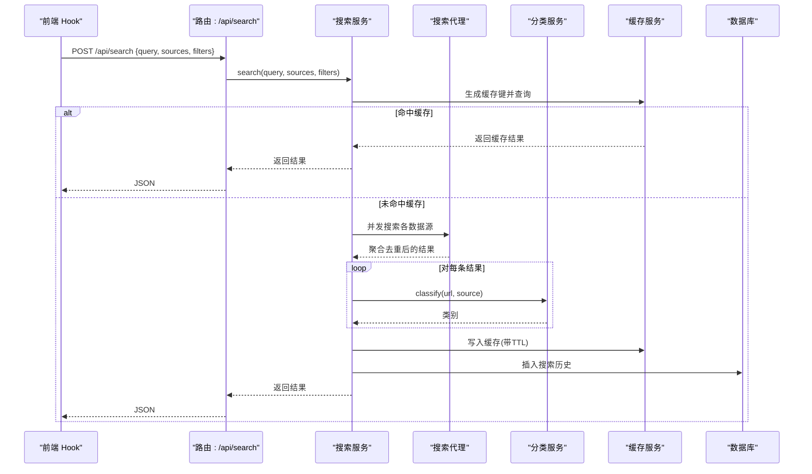
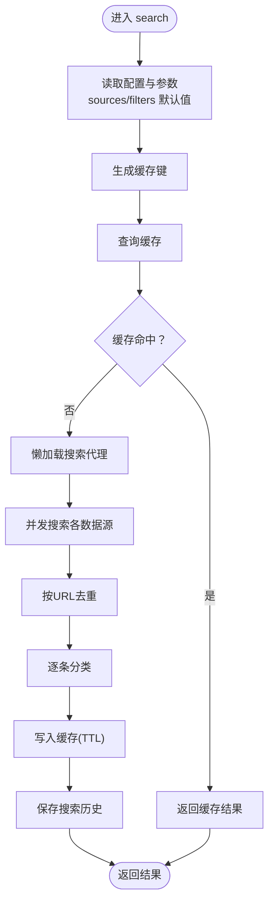
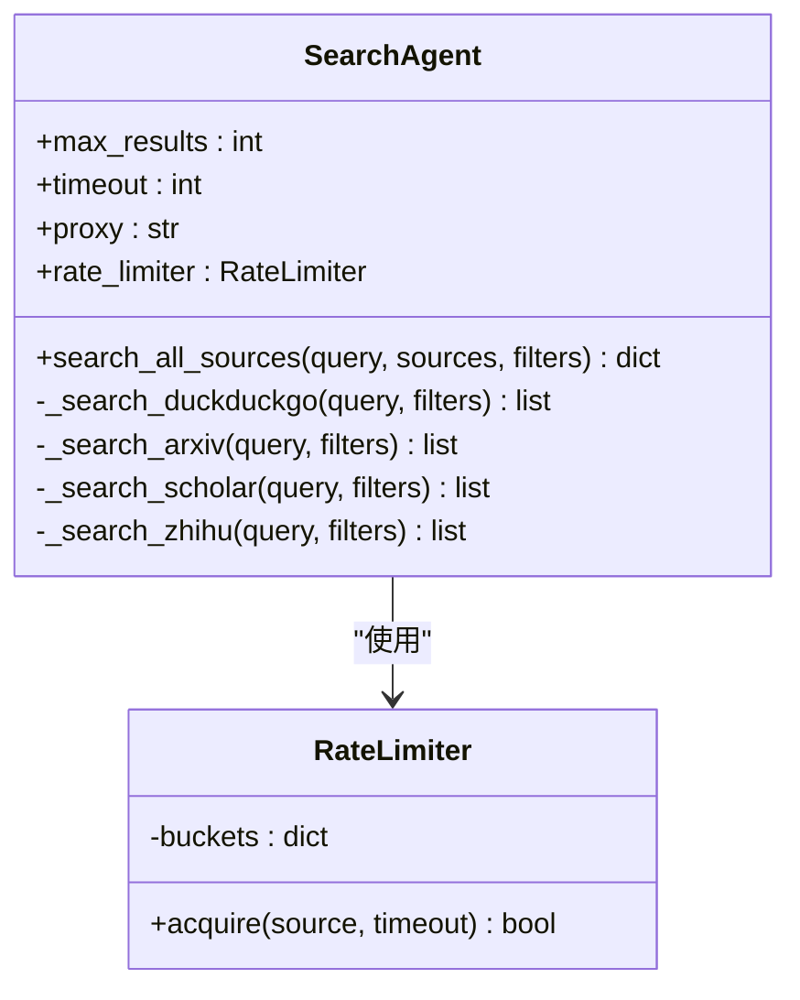
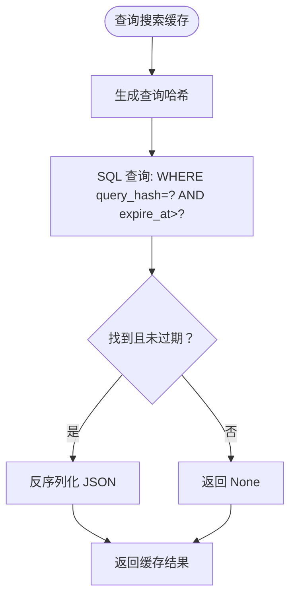
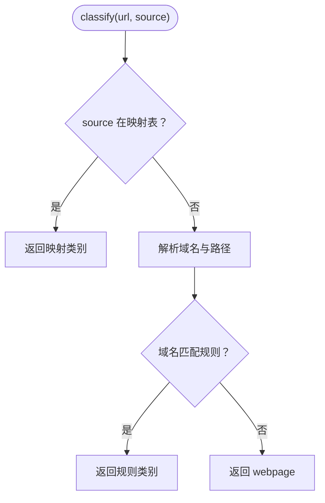
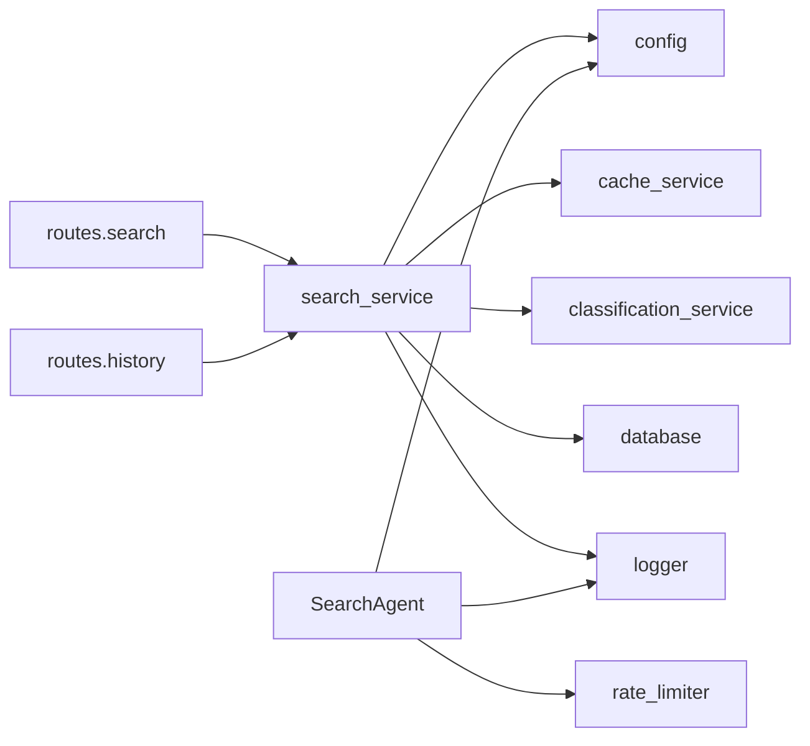

# 搜索服务

<cite>
**本文引用的文件**
- [backend/services/search_service.py](file://backend/services/search_service.py)
- [backend/routes/search.py](file://backend/routes/search.py)
- [backend/models/database.py](file://backend/models/database.py)
- [backend/services/cache_service.py](file://backend/services/cache_service.py)
- [backend/services/classification_service.py](file://backend/services/classification_service.py)
- [backend/models/schemas.py](file://backend/models/schemas.py)
- [backend/config.py](file://backend/config.py)
- [.qoder/agents/search_agent.py](file://.qoder/agents/search_agent.py)
- [backend/utils/logger.py](file://backend/utils/logger.py)
- [frontend/src/hooks/useSearch.js](file://frontend/src/hooks/useSearch.js)
- [backend/routes/history.py](file://backend/routes/history.py)
- [.qoder/config.json](file://.qoder/config.json)
- [README.md](file://README.md)
</cite>

## 目录
1. [简介](#简介)
2. [项目结构](#项目结构)
3. [核心组件](#核心组件)
4. [架构总览](#架构总览)
5. [详细组件分析](#详细组件分析)
6. [依赖关系分析](#依赖关系分析)
7. [性能考虑](#性能考虑)
8. [故障排查指南](#故障排查指南)
9. [结论](#结论)
10. [附录](#附录)

## 简介
本文件面向“搜索服务”的实现与使用，重点阐述多源搜索的执行流程、搜索代理的懒加载机制、缓存策略与结果分类流程；并详细说明搜索函数的参数处理、缓存键生成、搜索历史记录保存与错误处理机制。文档还涵盖搜索代理的动态导入、搜索结果聚合与分类服务集成，以及与 AI 代理系统协作、与数据库历史记录交互的方式。最后提供性能优化技巧、缓存配置选项与调试方法。

## 项目结构
后端采用分层设计：路由层负责接收请求并校验参数，服务层封装业务逻辑（搜索、缓存、分类、历史），模型层负责数据库连接与表结构初始化，工具层提供日志等通用能力。前端通过自定义 Hook 发起搜索请求并展示结果。

图表来源
- [backend/routes/search.py](file://backend/routes/search.py#L1-L28)
- [backend/services/search_service.py](file://backend/services/search_service.py#L1-L98)
- [.qoder/agents/search_agent.py](file://.qoder/agents/search_agent.py#L1-L305)
- [backend/services/cache_service.py](file://backend/services/cache_service.py#L1-L104)
- [backend/services/classification_service.py](file://backend/services/classification_service.py#L1-L64)
- [backend/models/database.py](file://backend/models/database.py#L1-L51)
- [backend/config.py](file://backend/config.py#L1-L85)
- [backend/utils/logger.py](file://backend/utils/logger.py#L1-L23)

章节来源
- [README.md](file://README.md#L1-L409)

## 核心组件
- 搜索服务：负责参数处理、缓存命中检查、调用搜索代理、结果分类、缓存写入与历史记录持久化。
- 搜索代理：懒加载的多源并发搜索执行器，支持 arXiv、Semantic Scholar、Bing（站内搜索知乎）、DuckDuckGo（通过 Bing）。
- 缓存服务：基于 SQLite 的搜索与分析缓存，提供键生成、过期时间控制与清理。
- 分类服务：根据 URL 与来源对结果进行内容类别判定。
- 数据库模型：提供线程安全连接、表初始化与上下文管理。
- 配置中心：统一读取 .env 与 .qoder/config.json，合并为运行时配置。
- 日志工具：统一格式化输出，便于调试与监控。

章节来源
- [backend/services/search_service.py](file://backend/services/search_service.py#L1-L98)
- [.qoder/agents/search_agent.py](file://.qoder/agents/search_agent.py#L1-L305)
- [backend/services/cache_service.py](file://backend/services/cache_service.py#L1-L104)
- [backend/services/classification_service.py](file://backend/services/classification_service.py#L1-L64)
- [backend/models/database.py](file://backend/models/database.py#L1-L51)
- [backend/config.py](file://backend/config.py#L1-L85)
- [backend/utils/logger.py](file://backend/utils/logger.py#L1-L23)

## 架构总览
搜索服务的端到端流程如下：前端通过 Hook 发起搜索请求，后端路由解析参数并调用搜索服务；搜索服务先检查缓存，未命中则通过懒加载的搜索代理并发拉取各数据源，随后对结果进行分类，写入缓存并保存历史记录，最终返回给前端。

图表来源
- [backend/routes/search.py](file://backend/routes/search.py#L1-L28)
- [backend/services/search_service.py](file://backend/services/search_service.py#L28-L67)
- [.qoder/agents/search_agent.py](file://.qoder/agents/search_agent.py#L33-L111)
- [backend/services/classification_service.py](file://backend/services/classification_service.py#L30-L63)
- [backend/services/cache_service.py](file://backend/services/cache_service.py#L30-L52)
- [backend/models/database.py](file://backend/models/database.py#L24-L34)

## 详细组件分析

### 搜索服务（search_service）
职责与流程
- 参数处理：默认来源与过滤器从配置读取，若传入则覆盖。
- 缓存键生成：以查询词、排序后的来源列表与过滤器字典拼接后做哈希，保证相同参数得到一致键。
- 缓存命中：若命中则直接返回，避免重复请求。
- 代理调用：懒加载搜索代理，调用其并发搜索方法，聚合结果并去重。
- 结果分类：逐项调用分类服务，为每条结果添加类别字段。
- 缓存写入：按配置的 TTL 写入缓存。
- 历史记录：将查询、过滤器与结果数写入数据库。
- 错误处理：捕获异常并记录日志，返回统一错误响应。

关键实现位置
- 懒加载代理与调用：[backend/services/search_service.py](file://backend/services/search_service.py#L19-L25)、[backend/services/search_service.py](file://backend/services/search_service.py#L52-L53)
- 参数与缓存键：[backend/services/search_service.py](file://backend/services/search_service.py#L40-L46)
- 缓存读写：[backend/services/search_service.py](file://backend/services/search_service.py#L46-L61)、[backend/services/cache_service.py](file://backend/services/cache_service.py#L30-L52)
- 分类与写入历史：[backend/services/search_service.py](file://backend/services/search_service.py#L55-L64)、[backend/services/search_service.py](file://backend/services/search_service.py#L70-L79)
- 历史查询与清理：[backend/services/search_service.py](file://backend/services/search_service.py#L82-L97)、[backend/routes/history.py](file://backend/routes/history.py#L10-L32)

图表来源
- [backend/services/search_service.py](file://backend/services/search_service.py#L28-L67)
- [backend/services/cache_service.py](file://backend/services/cache_service.py#L16-L52)
- [backend/services/classification_service.py](file://backend/services/classification_service.py#L30-L63)

章节来源
- [backend/services/search_service.py](file://backend/services/search_service.py#L1-L98)

### 搜索代理（SearchAgent）
职责与流程
- 初始化：读取配置中的最大结果数、超时与代理设置，构造速率限制器。
- 并发搜索：根据传入的来源列表映射到对应搜索方法，使用线程池并发执行，统一超时控制。
- 结果聚合：收集各来源结果，按 URL 去重，统计每个来源的状态（成功/失败/超时/跳过）。
- 数据源实现：
  - DuckDuckGo：通过 Bing 中国站点抓取网页结果。
  - arXiv：使用官方客户端搜索学术论文。
  - Scholar：调用 Semantic Scholar Graph API，带指数退避重试。
  - 知乎：通过 Bing 站内搜索限定域名。
- 速率限制：不同来源使用独立令牌桶，避免被外部 API 限流。

关键实现位置
- 并发与超时：[.qoder/agents/search_agent.py](file://.qoder/agents/search_agent.py#L71-L96)
- 去重与汇总：[.qoder/agents/search_agent.py](file://.qoder/agents/search_agent.py#L98-L111)
- 各数据源实现：[.qoder/agents/search_agent.py](file://.qoder/agents/search_agent.py#L113-L304)
- 速率限制器：[backend/services/rate_limiter.py](file://backend/services/rate_limiter.py#L1-L75)

图表来源
- [.qoder/agents/search_agent.py](file://.qoder/agents/search_agent.py#L21-L111)
- [backend/services/rate_limiter.py](file://backend/services/rate_limiter.py#L45-L75)

章节来源
- [.qoder/agents/search_agent.py](file://.qoder/agents/search_agent.py#L1-L305)
- [backend/services/rate_limiter.py](file://backend/services/rate_limiter.py#L1-L75)

### 缓存服务（cache_service）
职责与流程
- 缓存键生成：对搜索参数序列化并哈希，确保一致性；分析缓存对内容截断后哈希。
- 搜索缓存：按查询哈希与过期时间存储 JSON 结果；读取时检查过期。
- 分析缓存：按内容哈希与分析类型存储 JSON 结果；7 天过期清理。
- 缓存清理：定期删除过期条目，分别清理搜索与分析缓存。

关键实现位置
- 键生成与哈希：[backend/services/cache_service.py](file://backend/services/cache_service.py#L11-L19)
- 搜索缓存读写：[backend/services/cache_service.py](file://backend/services/cache_service.py#L30-L52)
- 分析缓存读写与清理：[backend/services/cache_service.py](file://backend/services/cache_service.py#L57-L86)、[backend/services/cache_service.py](file://backend/services/cache_service.py#L91-L103)

图表来源
- [backend/services/cache_service.py](file://backend/services/cache_service.py#L30-L40)

章节来源
- [backend/services/cache_service.py](file://backend/services/cache_service.py#L1-L104)

### 分类服务（classification_service）
职责与流程
- 优先级：来源名映射优先于 URL 规则。
- 来源映射：arXiv、Google Scholar 映射为学术；知乎映射为问答。
- URL 规则：按域名匹配学术、问答、博客、论坛等类别。
- 默认：无法匹配时归类为网页。

关键实现位置
- 规则与映射：[backend/services/classification_service.py](file://backend/services/classification_service.py#L8-L27)、[backend/services/classification_service.py](file://backend/services/classification_service.py#L42-L48)
- URL 解析与匹配：[backend/services/classification_service.py](file://backend/services/classification_service.py#L50-L63)

图表来源
- [backend/services/classification_service.py](file://backend/services/classification_service.py#L30-L63)

章节来源
- [backend/services/classification_service.py](file://backend/services/classification_service.py#L1-L64)

### 数据库与历史记录（database 与 history 路由）
- 数据库连接：线程本地连接、WAL 模式、超时与外键开启，提供上下文管理。
- 表结构：搜索历史、搜索缓存、分析缓存、下载记录。
- 历史接口：获取最近 N 条历史与清空历史。

关键实现位置
- 连接与上下文：[backend/models/database.py](file://backend/models/database.py#L11-L34)
- 表初始化：[backend/models/database.py](file://backend/models/database.py#L36-L43)、[backend/models/schemas.py](file://backend/models/schemas.py#L1-L38)
- 历史查询与清理：[backend/services/search_service.py](file://backend/services/search_service.py#L82-L97)、[backend/routes/history.py](file://backend/routes/history.py#L10-L32)

章节来源
- [backend/models/database.py](file://backend/models/database.py#L1-L51)
- [backend/models/schemas.py](file://backend/models/schemas.py#L1-L38)
- [backend/routes/history.py](file://backend/routes/history.py#L1-L33)
- [backend/services/search_service.py](file://backend/services/search_service.py#L70-L97)

### 前端搜索 Hook（useSearch）
- 状态：结果、总数、来源状态、加载、错误、查询词与过滤器。
- 搜索流程：校验查询词，发起 POST 请求，按类别过滤本地结果。
- 过滤器：支持来源与类别切换。

关键实现位置
- 搜索与过滤：[frontend/src/hooks/useSearch.js](file://frontend/src/hooks/useSearch.js#L19-L50)

章节来源
- [frontend/src/hooks/useSearch.js](file://frontend/src/hooks/useSearch.js#L1-L74)

## 依赖关系分析
- 搜索服务依赖配置中心、缓存服务、分类服务、数据库与日志工具。
- 搜索代理依赖速率限制器与配置中心。
- 路由层仅负责参数校验与异常捕获，不参与业务逻辑。
- 历史路由依赖搜索服务提供的历史查询与清理接口。

图表来源
- [backend/routes/search.py](file://backend/routes/search.py#L1-L28)
- [backend/services/search_service.py](file://backend/services/search_service.py#L1-L98)
- [backend/services/cache_service.py](file://backend/services/cache_service.py#L1-L104)
- [backend/services/classification_service.py](file://backend/services/classification_service.py#L1-L64)
- [backend/models/database.py](file://backend/models/database.py#L1-L51)
- [backend/config.py](file://backend/config.py#L1-L85)
- [.qoder/agents/search_agent.py](file://.qoder/agents/search_agent.py#L1-L305)
- [backend/services/rate_limiter.py](file://backend/services/rate_limiter.py#L1-L75)
- [backend/routes/history.py](file://backend/routes/history.py#L1-L33)

章节来源
- [backend/routes/search.py](file://backend/routes/search.py#L1-L28)
- [backend/routes/history.py](file://backend/routes/history.py#L1-L33)
- [backend/services/search_service.py](file://backend/services/search_service.py#L1-L98)
- [.qoder/agents/search_agent.py](file://.qoder/agents/search_agent.py#L1-L305)

## 性能考虑
- 懒加载代理：首次使用时才导入与实例化，降低启动开销。
- 并发搜索：线程池并发拉取各数据源，缩短总等待时间；统一超时避免长时间阻塞。
- 去重策略：按 URL 去重，避免重复结果影响体验与资源浪费。
- 速率限制：不同来源独立令牌桶，平滑请求节奏，降低被限流风险。
- 缓存策略：搜索结果按小时级 TTL 缓存，分析结果按天级缓存，显著减少重复请求。
- 数据库优化：WAL 模式提升并发读写性能；索引加速缓存查询。
- 前端过滤：客户端按类别过滤，减少不必要的网络请求。

章节来源
- [.qoder/agents/search_agent.py](file://.qoder/agents/search_agent.py#L71-L96)
- [backend/services/rate_limiter.py](file://backend/services/rate_limiter.py#L45-L75)
- [backend/services/cache_service.py](file://backend/services/cache_service.py#L43-L52)
- [backend/models/database.py](file://backend/models/database.py#L17-L18)

## 故障排查指南
- 搜索为空或部分来源失败
  - 检查各数据源可用性与网络代理配置。
  - 查看后端日志定位具体来源错误。
  - 关注超时与限流情况。
- 缓存未生效
  - 确认缓存键生成是否一致（参数顺序与过滤器字典需稳定）。
  - 检查数据库连接与表是否存在。
- 历史记录异常
  - 确认数据库初始化完成与表结构正确。
  - 检查插入语句与 JSON 序列化。
- AI 分析不可用
  - 确认 .env 中 API 密钥配置正确。
  - 检查 .qoder/config.json 中 provider 与模型设置。

章节来源
- [backend/routes/search.py](file://backend/routes/search.py#L22-L27)
- [backend/services/search_service.py](file://backend/services/search_service.py#L78-L79)
- [backend/models/database.py](file://backend/models/database.py#L36-L43)
- [backend/models/schemas.py](file://backend/models/schemas.py#L1-L38)

## 结论
该搜索服务通过懒加载代理、并发搜索、统一缓存与分类机制，实现了高效稳定的多源聚合搜索。配合 SQLite 历史记录与前端本地过滤，形成完整的用户体验闭环。通过合理的配置与日志体系，能够有效定位与解决运行时问题。

## 附录

### API 定义（搜索）
- 方法与路径：POST /api/search
- 请求体
  - query: 字符串，必填
  - sources: 字符串数组，默认来自配置
  - filters: 字典，默认空
- 响应
  - results: 结果数组
  - total: 结果总数
  - sources_status: 各来源状态（success/failed/skipped/timeout）

章节来源
- [backend/routes/search.py](file://backend/routes/search.py#L10-L27)
- [README.md](file://README.md#L229-L248)

### 配置选项
- 速率限制（.qoder/config.json）
  - arxiv: capacity/refill_rate
  - zhihu: capacity/refill_rate
  - scholar: capacity/refill_rate
  - duckduckgo: capacity/refill_rate
- 搜索默认（.qoder/config.json）
  - max_results_per_source
  - timeout_seconds
  - cache_expire_hours
  - default_sources
- HTTP 代理（.env）
  - HTTP_PROXY/HTTPS_PROXY

章节来源
- [.qoder/config.json](file://.qoder/config.json#L2-L12)
- [backend/config.py](file://backend/config.py#L50-L59)
- [README.md](file://README.md#L314-L336)