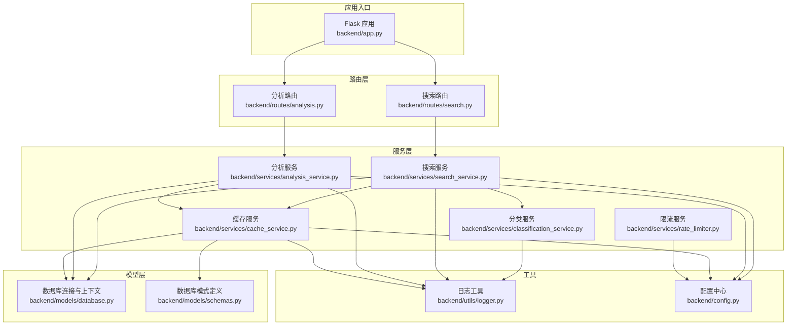
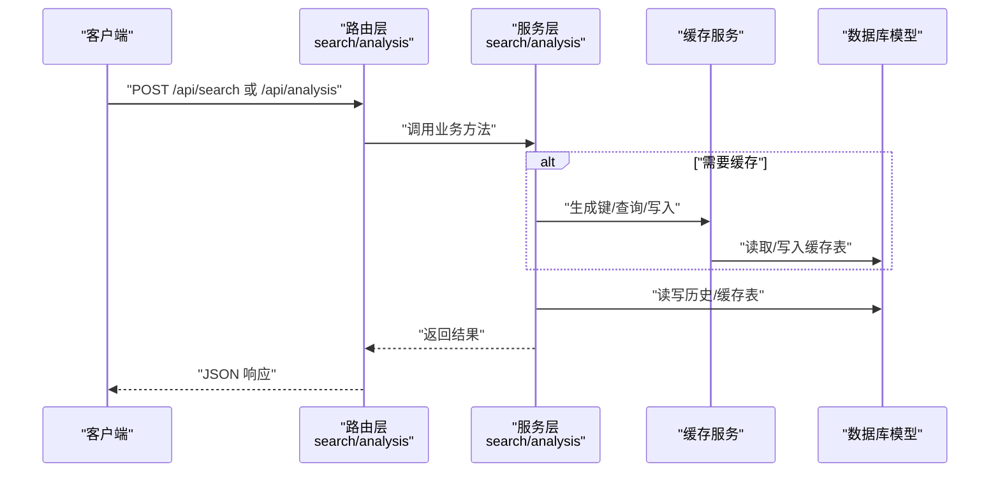
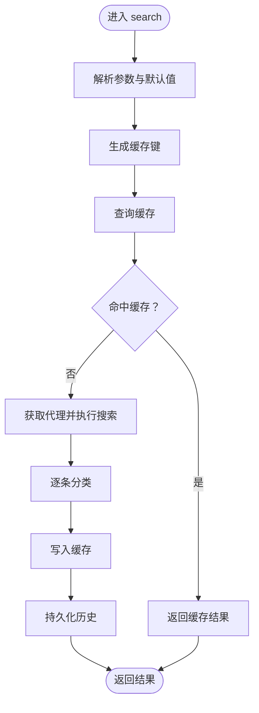
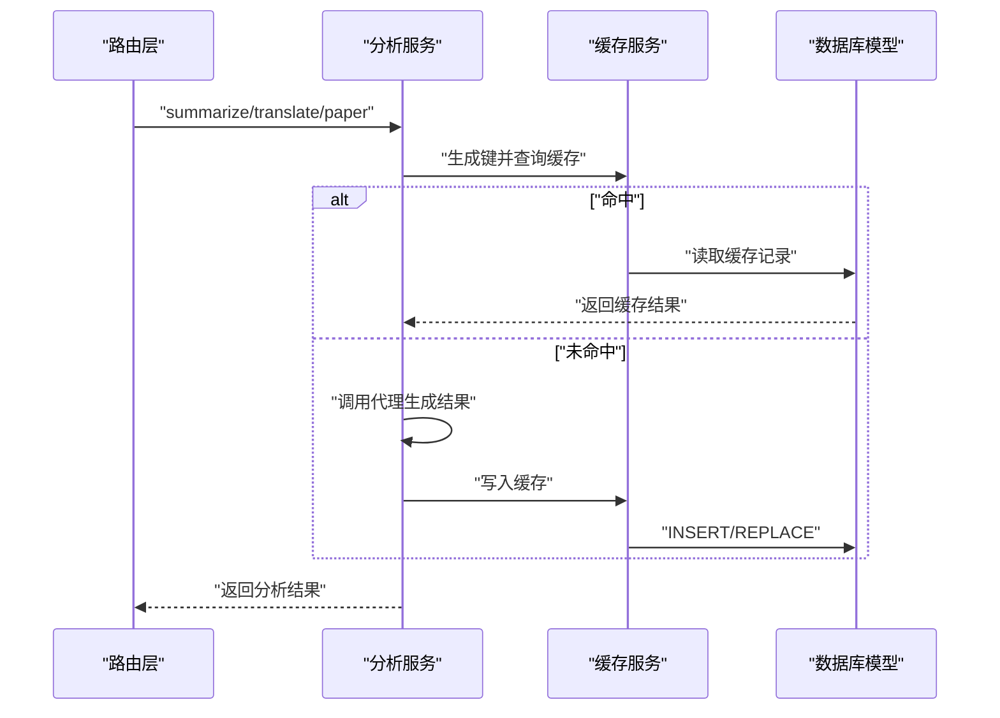
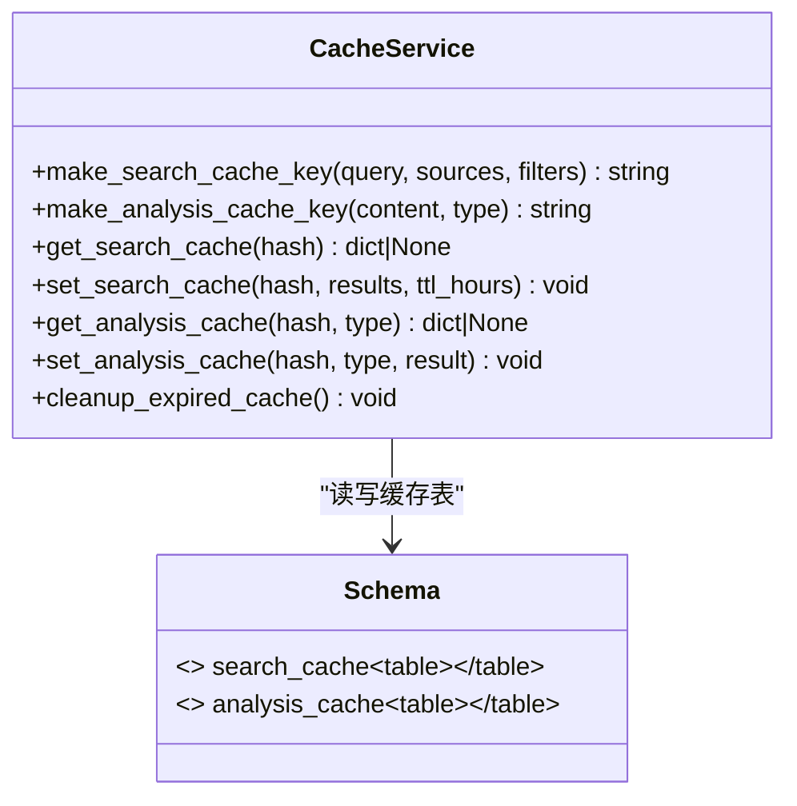
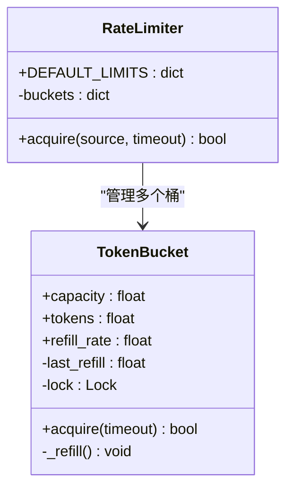
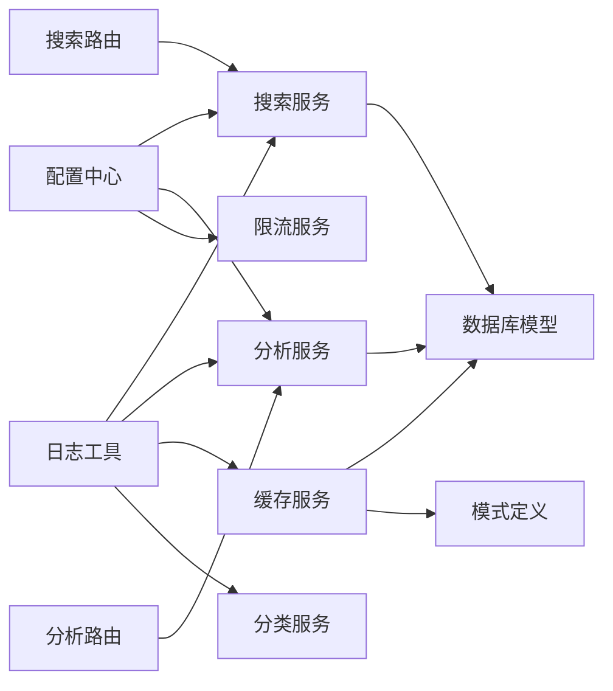

# 服务层架构

<cite>
**本文引用的文件**
- [backend/app.py](file://backend/app.py)
- [backend/config.py](file://backend/config.py)
- [backend/models/database.py](file://backend/models/database.py)
- [backend/models/schemas.py](file://backend/models/schemas.py)
- [backend/routes/search.py](file://backend/routes/search.py)
- [backend/routes/analysis.py](file://backend/routes/analysis.py)
- [backend/services/search_service.py](file://backend/services/search_service.py)
- [backend/services/analysis_service.py](file://backend/services/analysis_service.py)
- [backend/services/cache_service.py](file://backend/services/cache_service.py)
- [backend/services/classification_service.py](file://backend/services/classification_service.py)
- [backend/services/rate_limiter.py](file://backend/services/rate_limiter.py)
- [backend/utils/logger.py](file://backend/utils/logger.py)
</cite>

## 目录
1. [简介](#简介)
2. [项目结构](#项目结构)
3. [核心组件](#核心组件)
4. [架构总览](#架构总览)
5. [详细组件分析](#详细组件分析)
6. [依赖分析](#依赖分析)
7. [性能考虑](#性能考虑)
8. [故障排查指南](#故障排查指南)
9. [结论](#结论)
10. [附录](#附录)

## 简介
本文件系统性阐述后端服务层的架构设计与实现，覆盖以下主题：
- 设计原则：关注点分离、可测试性、可扩展性、可维护性
- 依赖注入机制：通过配置中心与模块导入实现松耦合
- 业务逻辑封装策略：围绕搜索、分析、缓存、分类、限流五大服务抽象
- 服务间通信：通过共享数据库与缓存服务进行数据交换
- 错误处理：统一异常捕获与日志记录
- 事务管理：基于上下文管理器的自动提交/回滚
- 性能优化：缓存、索引、线程本地连接、令牌桶限流
- 扩展指南：新增服务与路由的最佳实践
- 单元测试策略与调试技巧
- 服务层与路由层、模型层的协作方式

## 项目结构
后端采用分层组织：应用入口负责装配；路由层承接请求；服务层封装业务；模型层负责数据访问与模式定义。

图表来源
- [backend/app.py](file://backend/app.py#L21-L78)
- [backend/routes/search.py](file://backend/routes/search.py#L1-L28)
- [backend/routes/analysis.py](file://backend/routes/analysis.py#L1-L66)
- [backend/services/search_service.py](file://backend/services/search_service.py#L1-L98)
- [backend/services/analysis_service.py](file://backend/services/analysis_service.py#L1-L91)
- [backend/services/cache_service.py](file://backend/services/cache_service.py#L1-L104)
- [backend/services/classification_service.py](file://backend/services/classification_service.py#L1-L64)
- [backend/services/rate_limiter.py](file://backend/services/rate_limiter.py#L1-L75)
- [backend/models/database.py](file://backend/models/database.py#L1-L51)
- [backend/models/schemas.py](file://backend/models/schemas.py#L1-L38)
- [backend/utils/logger.py](file://backend/utils/logger.py#L1-L23)
- [backend/config.py](file://backend/config.py#L1-L85)

章节来源
- [backend/app.py](file://backend/app.py#L21-L78)
- [backend/config.py](file://backend/config.py#L15-L85)

## 核心组件
- 配置中心：集中管理环境变量与.qoder配置合并，提供全局常量（如默认搜索参数、下载设置、分析设置、限流规则等）
- 日志工具：统一格式化输出，便于问题定位与审计
- 数据模型：SQLite 连接池与上下文管理器，自动提交/回滚；模式定义包含历史、搜索缓存、分析缓存、下载记录表
- 路由层：对外暴露 /api/search 与 /api/analysis 等接口，参数校验与错误处理
- 服务层：
  - 搜索服务：多源聚合、缓存命中、结果分类、历史持久化
  - 分析服务：摘要、翻译、论文深度分析，带缓存
  - 缓存服务：统一键生成、过期控制、清理任务
  - 分类服务：URL/来源映射，内容类别判定
  - 限流服务：令牌桶算法，按来源维度限速

章节来源
- [backend/config.py](file://backend/config.py#L15-L85)
- [backend/utils/logger.py](file://backend/utils/logger.py#L1-L23)
- [backend/models/database.py](file://backend/models/database.py#L11-L51)
- [backend/models/schemas.py](file://backend/models/schemas.py#L1-L38)
- [backend/routes/search.py](file://backend/routes/search.py#L1-L28)
- [backend/routes/analysis.py](file://backend/routes/analysis.py#L1-L66)
- [backend/services/search_service.py](file://backend/services/search_service.py#L1-L98)
- [backend/services/analysis_service.py](file://backend/services/analysis_service.py#L1-L91)
- [backend/services/cache_service.py](file://backend/services/cache_service.py#L1-L104)
- [backend/services/classification_service.py](file://backend/services/classification_service.py#L1-L64)
- [backend/services/rate_limiter.py](file://backend/services/rate_limiter.py#L1-L75)

## 架构总览
服务层通过“配置中心 + 工具 + 模型层”为“路由层 + 业务服务”提供基础设施，形成清晰的职责边界与调用链路。

图表来源
- [backend/routes/search.py](file://backend/routes/search.py#L10-L28)
- [backend/routes/analysis.py](file://backend/routes/analysis.py#L10-L66)
- [backend/services/search_service.py](file://backend/services/search_service.py#L28-L98)
- [backend/services/analysis_service.py](file://backend/services/analysis_service.py#L25-L91)
- [backend/services/cache_service.py](file://backend/services/cache_service.py#L16-L104)
- [backend/models/database.py](file://backend/models/database.py#L24-L51)

## 详细组件分析

### 搜索服务（search_service）
- 设计原则
  - 关注点分离：搜索执行、缓存、分类、历史持久化分别封装
  - 可测试性：通过懒加载代理对象与外部依赖注入，便于替换
  - 可扩展性：支持自定义来源列表与过滤器
- 实现要点
  - 代理懒加载：延迟导入并实例化搜索代理，避免启动时开销
  - 缓存键生成：对查询参数进行标准化序列化后哈希
  - 结果分类：优先使用来源映射，其次基于域名规则
  - 历史持久化：在事务上下文中插入历史记录
- 错误处理
  - 历史保存失败仅记录告警，不影响主流程
- 复杂度
  - 时间复杂度近似 O(N)（N 为结果条数），主要消耗在分类循环
  - 空间复杂度 O(1)，除结果集外无额外存储

图表来源
- [backend/services/search_service.py](file://backend/services/search_service.py#L28-L98)
- [backend/services/cache_service.py](file://backend/services/cache_service.py#L16-L53)
- [backend/services/classification_service.py](file://backend/services/classification_service.py#L30-L64)
- [backend/models/database.py](file://backend/models/database.py#L24-L34)

章节来源
- [backend/services/search_service.py](file://backend/services/search_service.py#L1-L98)
- [backend/services/classification_service.py](file://backend/services/classification_service.py#L1-L64)
- [backend/services/cache_service.py](file://backend/services/cache_service.py#L1-L104)

### 分析服务（analysis_service）
- 设计原则
  - 功能内聚：摘要、翻译、论文分析三类能力独立封装
  - 缓存优先：对相同内容与类型进行缓存复用
  - 容错设计：代理返回错误时仍可走缓存路径
- 实现要点
  - 代理懒加载：延迟初始化分析代理
  - 缓存键策略：摘要/翻译/论文分析分别以内容与类型组合生成键
  - 过期策略：分析缓存按天过期，到期自动清理
- 复杂度
  - 时间复杂度取决于代理调用与缓存 IO，典型 O(1) 查询
  - 空间复杂度 O(1)，结果 JSON 序列化

图表来源
- [backend/routes/analysis.py](file://backend/routes/analysis.py#L10-L66)
- [backend/services/analysis_service.py](file://backend/services/analysis_service.py#L25-L91)
- [backend/services/cache_service.py](file://backend/services/cache_service.py#L57-L87)
- [backend/models/database.py](file://backend/models/database.py#L24-L34)

章节来源
- [backend/services/analysis_service.py](file://backend/services/analysis_service.py#L1-L91)
- [backend/services/cache_service.py](file://backend/services/cache_service.py#L1-L104)

### 缓存服务（cache_service）
- 设计原则
  - 统一键生成：对输入进行标准化与哈希，保证一致性
  - 过期控制：搜索缓存按小时，分析缓存按天，到期自动清理
  - 清理任务：定期删除过期记录，保持数据库整洁
- 实现要点
  - 键生成：搜索键基于查询、来源、过滤器；分析键基于内容前缀与类型
  - 存储结构：SQLite 表分别存放搜索与分析缓存，含时间戳与过期字段
  - 索引优化：对哈希字段建立索引，加速查询
- 复杂度
  - 查询与写入均为单表操作，时间复杂度 O(1)，受索引影响
  - 清理任务批量删除，复杂度与过期条目数量线性相关

图表来源
- [backend/services/cache_service.py](file://backend/services/cache_service.py#L16-L104)
- [backend/models/schemas.py](file://backend/models/schemas.py#L10-L27)

章节来源
- [backend/services/cache_service.py](file://backend/services/cache_service.py#L1-L104)
- [backend/models/schemas.py](file://backend/models/schemas.py#L1-L38)

### 分类服务（classification_service）
- 设计原则
  - 规则明确：来源映射优先于域名匹配
  - 易扩展：规则集中定义，便于增删改
  - 容错：解析失败时回退到网页类别
- 实现要点
  - 来源映射：arXiv、Google Scholar、知乎等映射到学术/问答
  - 域名规则：覆盖主流学术、问答、博客、论坛站点
  - 路径兼容：忽略 www 前缀，统一小写比较
- 复杂度
  - 时间复杂度 O(M+N)，M 为来源映射项，N 为域名规则项
  - 空间复杂度 O(1)，规则表规模固定

章节来源
- [backend/services/classification_service.py](file://backend/services/classification_service.py#L1-L64)

### 限流服务（rate_limiter）
- 设计原则
  - 线程安全：令牌桶内部使用锁保护状态
  - 可配置：支持按来源维度配置容量与补充速率
  - 平滑限速：基于时间差动态补充令牌
- 实现要点
  - 令牌桶：容量上限、补充速率、上次补充时间、互斥锁
  - 限流器：为每个来源维护一个桶，未配置来源默认放行
  - 获取令牌：超时时间内等待可用令牌或直接失败
- 复杂度
  - 获取令牌平均 O(1)，最坏情况受超时与睡眠轮询影响
  - 内存占用 O(S)，S 为来源数量

图表来源
- [backend/services/rate_limiter.py](file://backend/services/rate_limiter.py#L5-L75)

章节来源
- [backend/services/rate_limiter.py](file://backend/services/rate_limiter.py#L1-L75)

### 路由层与服务层协作
- 搜索路由
  - 参数校验：要求 query 存在
  - 异常捕获：服务抛出异常时统一记录并返回 500
- 分析路由
  - 摘要：要求 content 存在
  - 翻译：支持目标语言，默认中文
  - 论文分析：要求标题或摘要/片段至少一项存在
  - 异常捕获：同上

章节来源
- [backend/routes/search.py](file://backend/routes/search.py#L1-L28)
- [backend/routes/analysis.py](file://backend/routes/analysis.py#L1-L66)

### 模型层与事务管理
- 连接管理
  - 线程本地连接：避免并发冲突
  - 上下文管理器：自动提交或回滚
  - SQLite 优化：WAL 模式、忙碌超时、外键约束
- 模式定义
  - 搜索历史、搜索缓存、分析缓存、下载记录四张表
  - 为缓存表建立索引，提升查询性能

章节来源
- [backend/models/database.py](file://backend/models/database.py#L11-L51)
- [backend/models/schemas.py](file://backend/models/schemas.py#L1-L38)

## 依赖分析
- 组件耦合
  - 服务层对配置中心与日志工具存在弱依赖，利于解耦
  - 服务层与模型层通过数据库上下文管理器耦合，遵循最小暴露原则
  - 路由层仅依赖服务层接口，不直接操作数据库
- 外部依赖
  - .qoder 目录下的智能体代理（搜索/分析）通过动态导入接入
  - 环境变量与 .qoder 配置共同决定行为
- 循环依赖
  - 未发现循环导入；模块间为单向依赖

图表来源
- [backend/config.py](file://backend/config.py#L15-L85)
- [backend/utils/logger.py](file://backend/utils/logger.py#L1-L23)
- [backend/services/search_service.py](file://backend/services/search_service.py#L1-L13)
- [backend/services/analysis_service.py](file://backend/services/analysis_service.py#L1-L10)
- [backend/services/cache_service.py](file://backend/services/cache_service.py#L1-L8)
- [backend/models/schemas.py](file://backend/models/schemas.py#L1-L38)
- [backend/routes/search.py](file://backend/routes/search.py#L1-L7)
- [backend/routes/analysis.py](file://backend/routes/analysis.py#L1-L7)

章节来源
- [backend/config.py](file://backend/config.py#L15-L85)
- [backend/utils/logger.py](file://backend/utils/logger.py#L1-L23)
- [backend/services/search_service.py](file://backend/services/search_service.py#L1-L13)
- [backend/services/analysis_service.py](file://backend/services/analysis_service.py#L1-L10)
- [backend/services/cache_service.py](file://backend/services/cache_service.py#L1-L8)
- [backend/models/schemas.py](file://backend/models/schemas.py#L1-L38)
- [backend/routes/search.py](file://backend/routes/search.py#L1-L7)
- [backend/routes/analysis.py](file://backend/routes/analysis.py#L1-L7)

## 性能考虑
- 缓存策略
  - 搜索缓存：按小时过期，降低重复查询成本
  - 分析缓存：按天过期，适合长周期复用
  - 键生成：标准化输入，确保命中率
- 数据库优化
  - 索引：为缓存表哈希字段建立索引
  - WAL 模式：提升并发读写性能
  - 事务：上下文管理器自动提交/回滚，减少显式事务开销
- 线程安全
  - 令牌桶使用锁，避免并发竞争
- I/O 优化
  - 懒加载代理，减少启动时资源占用
  - 日志按需输出，避免高频 I/O

[本节为通用性能建议，无需特定文件引用]

## 故障排查指南
- 全局错误处理
  - 应用层统一捕获未处理异常并记录日志，返回标准错误响应
- 日志定位
  - 使用 get_logger 获取命名日志器，结合时间戳与模块名快速定位问题
- 数据库问题
  - 检查数据库文件是否存在、权限是否正确
  - 确认模式初始化成功，索引存在
- 缓存异常
  - 检查缓存键生成逻辑是否一致
  - 查看过期时间与清理任务是否正常运行
- 代理调用失败
  - 确认 .qoder 目录下智能体代理可用
  - 检查网络代理与 API 密钥配置

章节来源
- [backend/app.py](file://backend/app.py#L61-L66)
- [backend/utils/logger.py](file://backend/utils/logger.py#L5-L23)
- [backend/models/database.py](file://backend/models/database.py#L36-L51)
- [backend/services/cache_service.py](file://backend/services/cache_service.py#L91-L104)

## 结论
服务层通过清晰的职责划分与统一的基础设施，实现了高内聚、低耦合的业务封装。配合路由层的参数校验与错误处理、模型层的事务与索引优化，以及限流与缓存策略，整体系统具备良好的可扩展性与稳定性。建议在新增功能时遵循现有模式：先定义服务接口与缓存策略，再接入路由与模型层，确保变更可控且易于测试。

[本节为总结性内容，无需特定文件引用]

## 附录

### 服务扩展指南
- 新增服务步骤
  - 在 backend/services 下创建服务模块，定义核心函数与缓存键生成
  - 在 backend/models/schemas.py 中添加必要的表结构与索引
  - 在 backend/routes 下注册新路由，完成参数校验与异常处理
  - 在 backend/config.py 中添加必要配置项
  - 在 backend/app.py 中注册蓝图
- 最佳实践
  - 优先使用缓存，避免重复计算
  - 严格区分来源与内容键，防止缓存污染
  - 使用上下文管理器进行数据库操作
  - 为新表建立索引，保障查询性能

章节来源
- [backend/services/cache_service.py](file://backend/services/cache_service.py#L16-L26)
- [backend/models/schemas.py](file://backend/models/schemas.py#L1-L38)
- [backend/routes/search.py](file://backend/routes/search.py#L1-L28)
- [backend/routes/analysis.py](file://backend/routes/analysis.py#L1-L66)
- [backend/config.py](file://backend/config.py#L50-L78)
- [backend/app.py](file://backend/app.py#L35-L39)

### 单元测试策略
- 测试范围
  - 服务函数：输入参数、缓存命中、异常分支
  - 数据库：事务提交/回滚、索引查询、清理任务
  - 路由：参数校验、错误码、响应结构
- 推荐做法
  - 使用内存数据库或临时文件模拟 SQLite
  - Mock 外部代理与网络调用，隔离非确定性因素
  - 对缓存键生成与过期逻辑进行边界测试
  - 对限流器进行并发与超时测试

[本节为通用测试建议，无需特定文件引用]

### 调试技巧
- 启用调试模式
  - 设置 FLASK_ENV=development，开启调试输出
- 日志级别
  - 使用 get_logger 获取命名日志器，结合 DEBUG/INFO/ERROR 级别输出
- 数据验证
  - 校验数据库文件路径与权限
  - 检查缓存表与索引状态
- 性能观测
  - 关注缓存命中率与清理频率
  - 监控代理调用耗时与错误率

章节来源
- [backend/config.py](file://backend/config.py#L30-L34)
- [backend/utils/logger.py](file://backend/utils/logger.py#L5-L23)
- [backend/models/database.py](file://backend/models/database.py#L11-L21)