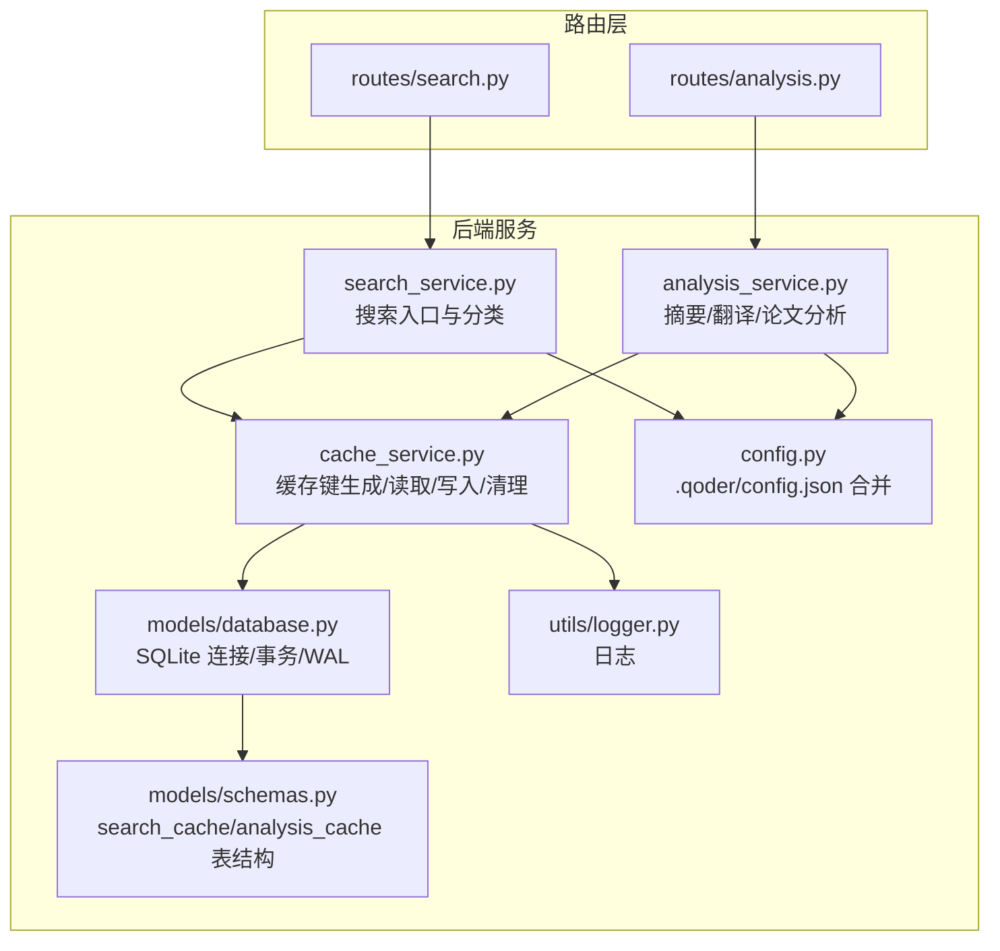
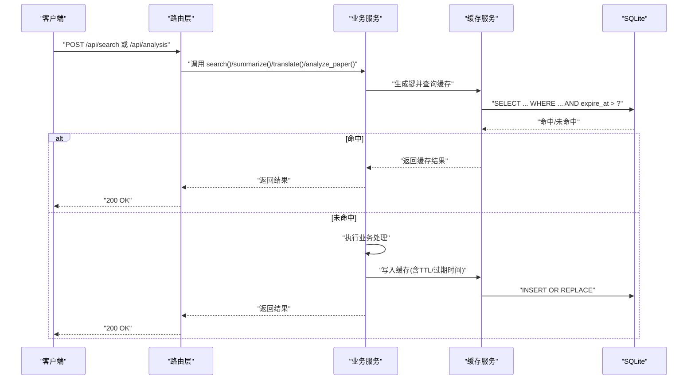
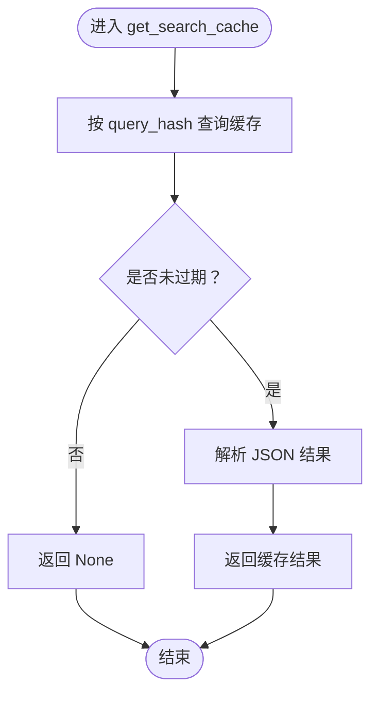
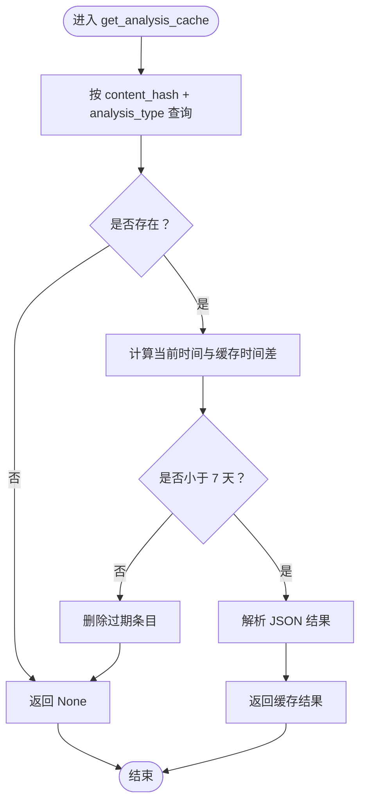
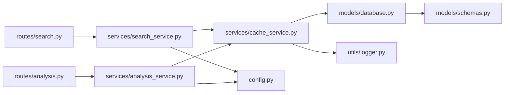

# 缓存服务

<cite>
**本文引用的文件**
- [backend/services/cache_service.py](file://backend/services/cache_service.py)
- [backend/services/search_service.py](file://backend/services/search_service.py)
- [backend/services/analysis_service.py](file://backend/services/analysis_service.py)
- [backend/models/database.py](file://backend/models/database.py)
- [backend/models/schemas.py](file://backend/models/schemas.py)
- [backend/config.py](file://backend/config.py)
- [backend/routes/search.py](file://backend/routes/search.py)
- [backend/routes/analysis.py](file://backend/routes/analysis.py)
- [.qoder/config.json](file://.qoder/config.json)
- [backend/utils/logger.py](file://backend/utils/logger.py)
- [run.sh](file://run.sh)
</cite>

## 目录
1. [简介](#简介)
2. [项目结构](#项目结构)
3. [核心组件](#核心组件)
4. [架构总览](#架构总览)
5. [详细组件分析](#详细组件分析)
6. [依赖关系分析](#依赖关系分析)
7. [性能考量](#性能考量)
8. [故障排除指南](#故障排除指南)
9. [结论](#结论)
10. [附录](#附录)

## 简介
本文件系统性阐述后端缓存服务的设计与实现，覆盖多级缓存架构（搜索结果缓存、分析结果缓存、配置缓存）、缓存键生成算法、TTL 管理与失效策略、命中率优化、内存与持久化存储方案、配置参数、性能监控指标以及扩展与一致性保障机制。目标是帮助开发者在不深入源码的前提下，快速理解并高效使用与扩展该缓存体系。

## 项目结构
缓存服务位于后端 Python 包中，围绕 SQLite 数据库存储实现“内存 + 持久化”的两级缓存模型：内存层面由线程本地连接与 WAL 模式提供高性能读写；持久化层面通过表结构与索引实现跨进程、跨会话的缓存复用与清理。

图表来源
- [backend/services/cache_service.py](file://backend/services/cache_service.py#L1-L104)
- [backend/services/search_service.py](file://backend/services/search_service.py#L1-L98)
- [backend/services/analysis_service.py](file://backend/services/analysis_service.py#L1-L91)
- [backend/models/database.py](file://backend/models/database.py#L1-L51)
- [backend/models/schemas.py](file://backend/models/schemas.py#L1-L38)
- [backend/config.py](file://backend/config.py#L1-L85)
- [backend/routes/search.py](file://backend/routes/search.py#L1-L28)
- [backend/routes/analysis.py](file://backend/routes/analysis.py#L1-L66)
- [backend/utils/logger.py](file://backend/utils/logger.py#L1-L23)

章节来源
- [backend/services/cache_service.py](file://backend/services/cache_service.py#L1-L104)
- [backend/models/schemas.py](file://backend/models/schemas.py#L1-L38)
- [backend/models/database.py](file://backend/models/database.py#L1-L51)
- [backend/config.py](file://backend/config.py#L1-L85)

## 核心组件
- 缓存键生成器：为搜索与分析两类缓存分别提供稳定、可重复的键值，确保相同输入得到一致的键。
- 搜索缓存：以查询参数为键，存储完整搜索结果，并基于绝对过期时间（TTL）控制生命周期。
- 分析缓存：以内容片段与分析类型为键，存储摘要、翻译、论文分析等结果，基于相对过期时间（7 天）控制生命周期。
- 配置缓存：通过合并 .env 与 .qoder/config.json 的配置项，集中提供 TTL、默认来源、最大结果数、温度等参数。
- 清理器：定期删除过期条目，释放存储空间并保持数据库健康。
- 日志：记录缓存命中/设置/清理等关键事件，便于监控与排障。

章节来源
- [backend/services/cache_service.py](file://backend/services/cache_service.py#L11-L26)
- [backend/services/cache_service.py](file://backend/services/cache_service.py#L30-L52)
- [backend/services/cache_service.py](file://backend/services/cache_service.py#L57-L86)
- [backend/config.py](file://backend/config.py#L54-L73)
- [backend/services/cache_service.py](file://backend/services/cache_service.py#L91-L103)

## 架构总览
缓存服务采用“请求驱动 + 数据库持久化”的设计：上层服务在执行业务逻辑前先查缓存，命中则直接返回；未命中则执行业务处理并将结果写回缓存。数据库层通过线程本地连接与 WAL 模式提升并发与可靠性。

图表来源
- [backend/routes/search.py](file://backend/routes/search.py#L10-L27)
- [backend/routes/analysis.py](file://backend/routes/analysis.py#L10-L65)
- [backend/services/search_service.py](file://backend/services/search_service.py#L28-L67)
- [backend/services/analysis_service.py](file://backend/services/analysis_service.py#L25-L90)
- [backend/services/cache_service.py](file://backend/services/cache_service.py#L30-L86)
- [backend/models/database.py](file://backend/models/database.py#L24-L33)

## 详细组件分析

### 搜索结果缓存
- 键生成策略：对查询词、排序后的来源列表与过滤器进行序列化并生成哈希，确保语义等价的查询得到相同键。
- 读取流程：按键查询，同时检查绝对过期时间，仅返回未过期数据。
- 写入流程：将结果序列化为 JSON，计算绝对过期时间并写入数据库，支持替换更新。
- TTL 来源：从配置中读取默认小时级 TTL，默认值来自 .qoder/config.json。

图表来源
- [backend/services/cache_service.py](file://backend/services/cache_service.py#L30-L40)

章节来源
- [backend/services/cache_service.py](file://backend/services/cache_service.py#L16-L19)
- [backend/services/cache_service.py](file://backend/services/cache_service.py#L30-L52)
- [backend/services/search_service.py](file://backend/services/search_service.py#L44-L61)
- [backend/config.py](file://backend/config.py#L54-L59)
- [.qoder/config.json](file://.qoder/config.json#L8-L13)

### 分析结果缓存
- 键生成策略：对内容进行截断（前若干字符），并与分析类型拼接后生成哈希，避免超长内容导致键过长。
- 读取流程：按内容哈希与分析类型联合查询，若存在则检查相对过期时间（7 天），未过期则返回；过期则清理并返回 None。
- 写入流程：将结果序列化为 JSON 并写入数据库，支持替换更新。
- TTL 来源：配置项中提供天级 TTL，默认值来自 .qoder/config.json。

图表来源
- [backend/services/cache_service.py](file://backend/services/cache_service.py#L57-L75)

章节来源
- [backend/services/cache_service.py](file://backend/services/cache_service.py#L22-L25)
- [backend/services/cache_service.py](file://backend/services/cache_service.py#L57-L86)
- [backend/services/analysis_service.py](file://backend/services/analysis_service.py#L25-L90)
- [backend/config.py](file://backend/config.py#L67-L73)
- [.qoder/config.json](file://.qoder/config.json#L22-L29)

### 配置缓存与参数
- 合并策略：优先加载 .qoder/config.json 中的搜索、下载、分析等设置，再叠加 .env 环境变量覆盖。
- 关键参数：
  - 搜索默认来源与最大结果数、超时秒数、小时级缓存 TTL。
  - 下载并发数与镜像地址。
  - 分析模型、最大内容长度、温度、天级缓存 TTL。
- 使用方式：业务服务在执行前读取配置，决定来源、TTL、模型等行为。

章节来源
- [backend/config.py](file://backend/config.py#L20-L78)
- [.qoder/config.json](file://.qoder/config.json#L1-L31)

### 缓存键生成算法
- 搜索键：对查询、来源列表（排序去重）与过滤器字典进行稳定序列化后生成哈希。
- 分析键：对内容前缀进行截断，与分析类型拼接后生成哈希，兼顾稳定性与性能。

章节来源
- [backend/services/cache_service.py](file://backend/services/cache_service.py#L11-L26)

### TTL 管理机制与失效策略
- 搜索缓存：绝对过期时间（UTC 字符串），写入时计算并存储，读取时比较。
- 分析缓存：相对过期时间（当前时间减去缓存时间小于 7 天），读取时判断并在过期时清理。
- 清理器：定期删除过期条目，减少存储占用并保持数据库整洁。

章节来源
- [backend/services/cache_service.py](file://backend/services/cache_service.py#L43-L52)
- [backend/services/cache_service.py](file://backend/services/cache_service.py#L65-L75)
- [backend/services/cache_service.py](file://backend/services/cache_service.py#L91-L103)

### 内存管理与持久化存储
- 内存：线程本地 SQLite 连接，避免跨线程共享状态；启用 WAL 模式提升并发读写。
- 持久化：使用 SQLite 文件数据库，表结构包含唯一键与索引，确保键冲突与查询效率。
- 事务：上下文管理器自动提交/回滚，保证一致性。

章节来源
- [backend/models/database.py](file://backend/models/database.py#L11-L33)
- [backend/models/schemas.py](file://backend/models/schemas.py#L10-L26)

### 路由与服务集成
- 搜索路由：接收查询、来源与过滤器，调用搜索服务并返回结果。
- 分析路由：接收内容与目标语言，调用分析服务并返回摘要/翻译/论文分析结果。
- 服务层：在执行业务前先查缓存，未命中则执行业务并写回缓存。

章节来源
- [backend/routes/search.py](file://backend/routes/search.py#L10-L27)
- [backend/routes/analysis.py](file://backend/routes/analysis.py#L10-L65)
- [backend/services/search_service.py](file://backend/services/search_service.py#L28-L67)
- [backend/services/analysis_service.py](file://backend/services/analysis_service.py#L25-L90)

## 依赖关系分析

图表来源
- [backend/routes/search.py](file://backend/routes/search.py#L1-L28)
- [backend/routes/analysis.py](file://backend/routes/analysis.py#L1-L66)
- [backend/services/search_service.py](file://backend/services/search_service.py#L1-L98)
- [backend/services/analysis_service.py](file://backend/services/analysis_service.py#L1-L91)
- [backend/services/cache_service.py](file://backend/services/cache_service.py#L1-L104)
- [backend/models/database.py](file://backend/models/database.py#L1-L51)
- [backend/models/schemas.py](file://backend/models/schemas.py#L1-L38)
- [backend/config.py](file://backend/config.py#L1-L85)
- [backend/utils/logger.py](file://backend/utils/logger.py#L1-L23)

章节来源
- [backend/services/cache_service.py](file://backend/services/cache_service.py#L1-L104)
- [backend/models/database.py](file://backend/models/database.py#L1-L51)
- [backend/models/schemas.py](file://backend/models/schemas.py#L1-L38)
- [backend/config.py](file://backend/config.py#L1-L85)

## 性能考量
- 命中率优化
  - 搜索键稳定性：来源列表排序、过滤器稳定序列化，避免等价查询产生不同键。
  - 分析键截断：对长内容进行前缀截断，降低键长度与哈希碰撞概率。
  - TTL 设计：搜索缓存小时级、分析缓存天级，平衡新鲜度与命中率。
- 内存与并发
  - 线程本地连接与 WAL 模式，减少锁竞争，提升并发吞吐。
  - 事务自动提交/回滚，避免脏读与死锁。
- 存储与索引
  - 唯一键约束防止重复写入，索引加速查询。
  - 定期清理过期条目，维持表规模与查询性能。
- 监控指标建议
  - 缓存命中/未命中次数、平均响应时间、数据库行数与索引扫描次数。
  - 可通过日志统计与数据库指标观测。

章节来源
- [backend/services/cache_service.py](file://backend/services/cache_service.py#L11-L26)
- [backend/services/cache_service.py](file://backend/services/cache_service.py#L30-L52)
- [backend/services/cache_service.py](file://backend/services/cache_service.py#L57-L86)
- [backend/models/database.py](file://backend/models/database.py#L11-L21)
- [backend/models/schemas.py](file://backend/models/schemas.py#L17-L26)
- [backend/utils/logger.py](file://backend/utils/logger.py#L5-L22)

## 故障排除指南
- 缓存未命中
  - 检查键生成是否一致（来源列表是否排序、过滤器是否稳定序列化）。
  - 确认 TTL 是否过短或已过期。
- 分析缓存异常
  - 确认内容截断长度是否合理，避免因截断差异导致键不一致。
  - 检查分析类型键是否正确（如翻译的语言标识）。
- 数据库问题
  - 确认数据库路径与权限，初始化数据库脚本是否成功执行。
  - 观察日志中的清理信息，确认定期清理是否正常运行。
- 启动与环境
  - 确保 .env 已创建并配置必要密钥，前端构建可选。
  - 启动后访问根路径验证服务可用性。

章节来源
- [backend/services/cache_service.py](file://backend/services/cache_service.py#L91-L103)
- [backend/models/database.py](file://backend/models/database.py#L36-L43)
- [run.sh](file://run.sh#L39-L49)
- [backend/utils/logger.py](file://backend/utils/logger.py#L5-L22)

## 结论
该缓存服务以简洁稳定的键生成、明确的 TTL 策略与定期清理机制为核心，结合 SQLite 的线程本地连接与 WAL 模式，在保证一致性的同时实现了良好的性能与可维护性。通过路由与服务层的统一接入，搜索与分析两大场景均获得显著的命中率与响应速度提升。建议在生产环境中配合日志与数据库指标持续监控，并根据业务特征调整 TTL 与内容截断策略。

## 附录

### 缓存配置参数清单
- 搜索默认配置
  - 最大结果数：每源最大返回条数
  - 超时秒数：单源请求超时
  - 小时级缓存 TTL：搜索结果缓存过期时间
  - 默认来源：未指定来源时使用的源列表
- 下载配置
  - 并发数：同时下载的最大任务数
  - 镜像地址：arXiv 等镜像站点
- 分析配置
  - 提供商与模型：摘要/翻译/论文分析所用模型
  - 最大内容长度：分析键截断阈值
  - 温度：推理采样温度
  - 天级缓存 TTL：分析结果缓存过期时间

章节来源
- [backend/config.py](file://backend/config.py#L54-L73)
- [.qoder/config.json](file://.qoder/config.json#L8-L30)

### 扩展接口与自定义策略
- 新增缓存类型
  - 在缓存服务中新增键生成函数与读写函数，并在对应服务中接入。
  - 在数据库模式中增加新表并添加索引。
- 自定义 TTL
  - 通过配置中心动态调整小时级/天级 TTL，或在服务层按场景传参。
- 缓存一致性
  - 对于强一致需求，可在写入后立即刷新相关键，或引入版本号字段。
  - 对于最终一致场景，可通过定期清理与日志审计保障数据健康。

章节来源
- [backend/services/cache_service.py](file://backend/services/cache_service.py#L11-L26)
- [backend/models/schemas.py](file://backend/models/schemas.py#L10-L26)
- [backend/config.py](file://backend/config.py#L54-L73)