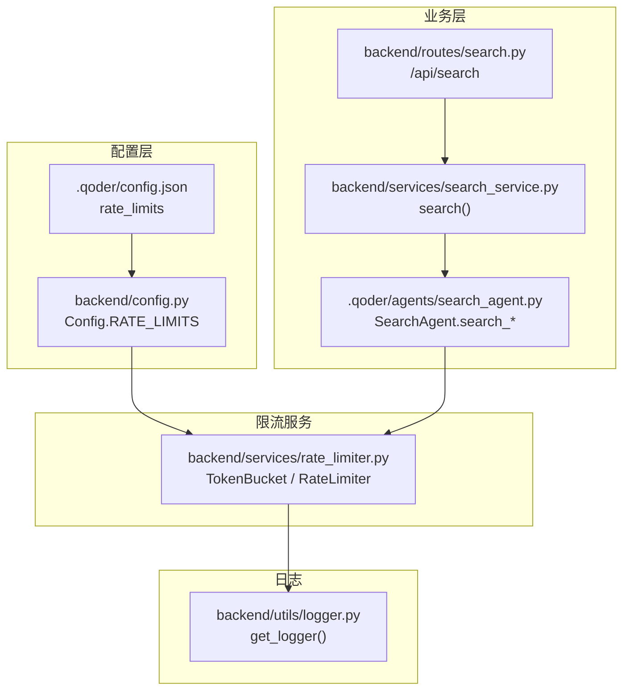
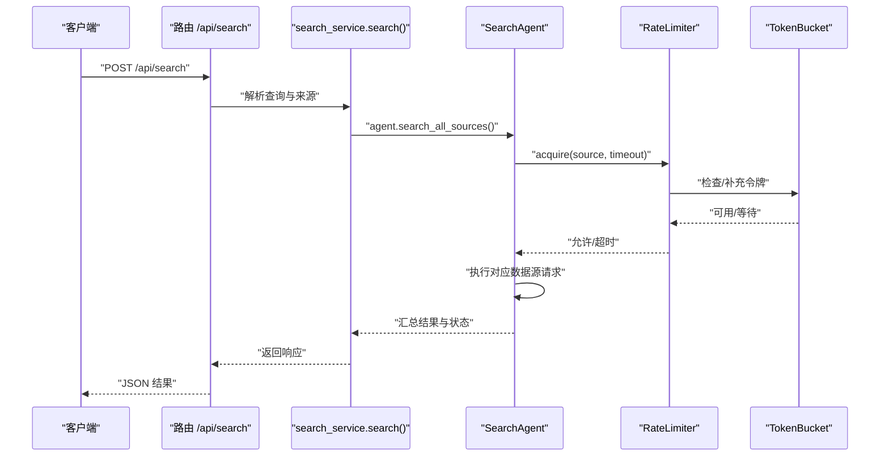
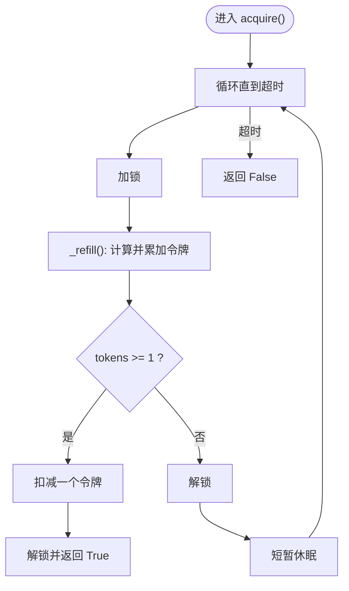
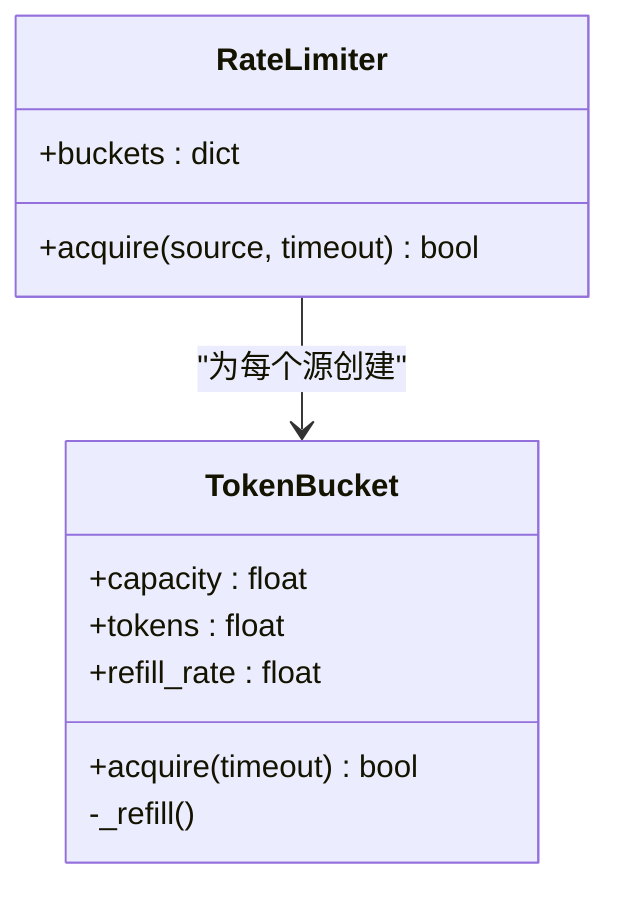
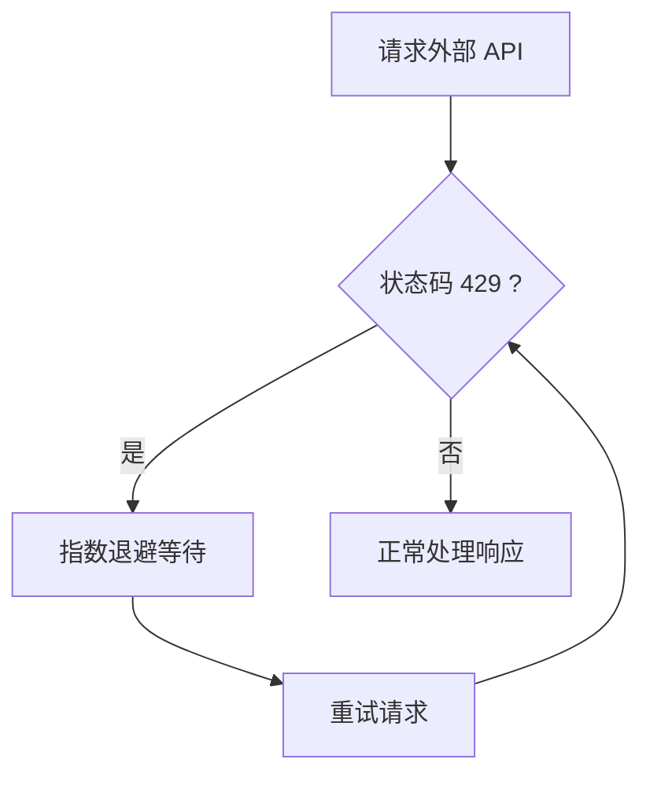
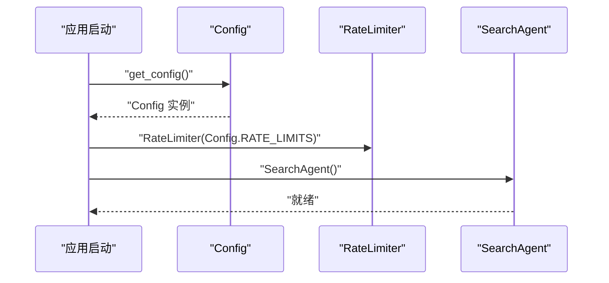
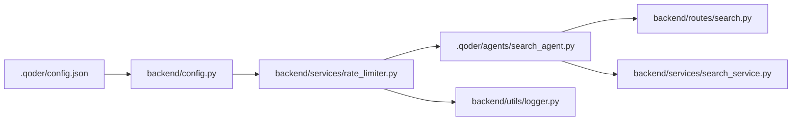

# 速率限制服务

<cite>
**本文引用的文件**
- [backend/services/rate_limiter.py](file://backend/services/rate_limiter.py)
- [.qoder/config.json](file://.qoder/config.json)
- [backend/config.py](file://backend/config.py)
- [.qoder/agents/search_agent.py](file://.qoder/agents/search_agent.py)
- [backend/routes/search.py](file://backend/routes/search.py)
- [backend/services/search_service.py](file://backend/services/search_service.py)
- [backend/utils/logger.py](file://backend/utils/logger.py)
- [README.md](file://README.md)
</cite>

## 目录
1. [简介](#简介)
2. [项目结构](#项目结构)
3. [核心组件](#核心组件)
4. [架构总览](#架构总览)
5. [详细组件分析](#详细组件分析)
6. [依赖关系分析](#依赖关系分析)
7. [性能考量](#性能考量)
8. [故障排查指南](#故障排查指南)
9. [结论](#结论)
10. [附录](#附录)

## 简介
本文件系统性阐述“速率限制服务”的设计与实现，重点覆盖：
- 令牌桶算法的原理与线程安全实现
- 多源速率控制策略与差异化阈值
- 限流阈值配置、重试机制与异常流量处理
- 对 arXiv、DuckDuckGo、Google Scholar（Semantic Scholar）、知乎的 API 限制适配
- 监控方法、性能影响与调优策略
- 扩展接口、自定义限流策略与异常流量处置方案

## 项目结构
速率限制服务位于后端服务层，围绕“令牌桶 + 多源限流器”组织，配合配置中心与搜索代理共同完成多数据源并发搜索的速率控制。

**图表来源**
- [backend/services/rate_limiter.py](file://backend/services/rate_limiter.py#L1-L75)
- [.qoder/config.json](file://.qoder/config.json#L1-L31)
- [backend/config.py](file://backend/config.py#L50-L51)
- [.qoder/agents/search_agent.py](file://.qoder/agents/search_agent.py#L113-L305)
- [backend/services/search_service.py](file://backend/services/search_service.py#L28-L67)
- [backend/routes/search.py](file://backend/routes/search.py#L10-L27)
- [backend/utils/logger.py](file://backend/utils/logger.py#L5-L22)

**章节来源**
- [backend/services/rate_limiter.py](file://backend/services/rate_limiter.py#L1-L75)
- [.qoder/config.json](file://.qoder/config.json#L1-L31)
- [backend/config.py](file://backend/config.py#L50-L51)
- [.qoder/agents/search_agent.py](file://.qoder/agents/search_agent.py#L113-L305)
- [backend/services/search_service.py](file://backend/services/search_service.py#L28-L67)
- [backend/routes/search.py](file://backend/routes/search.py#L10-L27)
- [backend/utils/logger.py](file://backend/utils/logger.py#L5-L22)

## 核心组件
- 令牌桶（TokenBucket）：线程安全的速率控制单元，基于容量与补充速率动态发放令牌。
- 限流器（RateLimiter）：为每个数据源维护独立的令牌桶，并提供统一的获取接口。
- 配置来源：优先读取运行时配置（.qoder/config.json），回退至内置默认阈值。
- 使用方：搜索代理在各数据源请求前调用限流器，确保遵守各自阈值。

关键行为与参数
- 令牌补充：按时间增量计算，不超过容量上限。
- 获取阻塞：在超时时间内循环尝试，避免瞬时拥塞。
- 未配置源：直接放行（视为无限制）。

**章节来源**
- [backend/services/rate_limiter.py](file://backend/services/rate_limiter.py#L5-L43)
- [backend/services/rate_limiter.py](file://backend/services/rate_limiter.py#L45-L75)
- [.qoder/config.json](file://.qoder/config.json#L2-L7)
- [backend/config.py](file://backend/config.py#L50-L51)

## 架构总览
下图展示一次多源搜索中，限流服务如何与配置、代理、路由及服务层协作：

**图表来源**
- [backend/routes/search.py](file://backend/routes/search.py#L10-L27)
- [backend/services/search_service.py](file://backend/services/search_service.py#L28-L67)
- [.qoder/agents/search_agent.py](file://.qoder/agents/search_agent.py#L33-L112)
- [backend/services/rate_limiter.py](file://backend/services/rate_limiter.py#L64-L74)

## 详细组件分析

### 令牌桶算法实现
- 线程安全：使用锁保护令牌补充与消费逻辑。
- 时间驱动：每次获取前刷新令牌数，保证随时间恢复。
- 超时策略：在指定超时内反复尝试，避免无限阻塞。
- 未配置即放行：当某数据源未在配置中出现时，视为不限速。

**图表来源**
- [backend/services/rate_limiter.py](file://backend/services/rate_limiter.py#L27-L42)
- [backend/services/rate_limiter.py](file://backend/services/rate_limiter.py#L20-L25)

**章节来源**
- [backend/services/rate_limiter.py](file://backend/services/rate_limiter.py#L5-L43)

### 多源速率控制策略
- 源粒度隔离：每个数据源拥有独立令牌桶，互不影响。
- 默认阈值：内置默认限流参数，满足常见场景。
- 运行时覆盖：通过配置文件可调整任意源的容量与补充速率。
- 未配置放行：若配置中未声明某源，则不限速，便于扩展新源。

**图表来源**
- [backend/services/rate_limiter.py](file://backend/services/rate_limiter.py#L45-L75)
- [backend/services/rate_limiter.py](file://backend/services/rate_limiter.py#L5-L43)

**章节来源**
- [backend/services/rate_limiter.py](file://backend/services/rate_limiter.py#L45-L75)
- [.qoder/config.json](file://.qoder/config.json#L2-L7)
- [backend/config.py](file://backend/config.py#L50-L51)

### 限流阈值设置与重试机制设计
- 阈值来源：优先使用运行时配置；若为空则采用内置默认值。
- 阈值含义：capacity 表示最大突发请求数，refill_rate 表示每秒补充令牌数。
- 重试策略：
  - 外部 API（如 Semantic Scholar）遇到 429 时，采用指数退避重试。
  - 限流器内部获取令牌超时，代理侧会记录相应来源状态（成功/失败/超时/跳过）。

**图表来源**
- [.qoder/agents/search_agent.py](file://.qoder/agents/search_agent.py#L209-L223)

**章节来源**
- [.qoder/agents/search_agent.py](file://.qoder/agents/search_agent.py#L113-L155)
- [.qoder/agents/search_agent.py](file://.qoder/agents/search_agent.py#L157-L189)
- [.qoder/agents/search_agent.py](file://.qoder/agents/search_agent.py#L191-L257)
- [.qoder/agents/search_agent.py](file://.qoder/agents/search_agent.py#L259-L304)
- [.qoder/agents/search_agent.py](file://.qoder/agents/search_agent.py#L209-L223)

### 不同数据源的差异化速率控制
- arXiv：论文检索，补充速率较低，适合稳定低频请求。
- DuckDuckGo（通过 Bing）：网页搜索，补充速率较高，适合高频请求。
- Google Scholar（通过 Semantic Scholar）：学术搜索，补充速率中等，需配合外部 429 重试。
- 知乎：站内搜索，补充速率较低，适合小并发。

这些差异通过配置文件中的 capacity/refill_rate 参数体现，代理在各数据源方法中调用限流器进行控制。

**章节来源**
- [.qoder/config.json](file://.qoder/config.json#L2-L7)
- [.qoder/agents/search_agent.py](file://.qoder/agents/search_agent.py#L113-L155)
- [.qoder/agents/search_agent.py](file://.qoder/agents/search_agent.py#L157-L189)
- [.qoder/agents/search_agent.py](file://.qoder/agents/search_agent.py#L191-L257)
- [.qoder/agents/search_agent.py](file://.qoder/agents/search_agent.py#L259-L304)

### 与配置中心的集成
- 配置加载：应用启动时读取 .qoder/config.json 并合并到 Config 单例。
- 限流参数：Config.RATE_LIMITS 作为 RateLimiter 的构造参数传入。
- 代理初始化：SearchAgent 在构造时注入 RateLimiter 实例。

**图表来源**
- [backend/config.py](file://backend/config.py#L50-L51)
- [backend/services/rate_limiter.py](file://backend/services/rate_limiter.py#L55-L62)
- [.qoder/agents/search_agent.py](file://.qoder/agents/search_agent.py#L24-L26)

**章节来源**
- [backend/config.py](file://backend/config.py#L50-L51)
- [backend/services/rate_limiter.py](file://backend/services/rate_limiter.py#L55-L62)
- [.qoder/agents/search_agent.py](file://.qoder/agents/search_agent.py#L24-L26)

## 依赖关系分析
- 配置依赖：.qoder/config.json → backend/config.py → RateLimiter
- 使用依赖：SearchAgent → RateLimiter → TokenBucket
- 日志依赖：各模块通过 get_logger 输出运行状态与错误

**图表来源**
- [.qoder/config.json](file://.qoder/config.json#L1-L31)
- [backend/config.py](file://backend/config.py#L50-L51)
- [backend/services/rate_limiter.py](file://backend/services/rate_limiter.py#L55-L62)
- [.qoder/agents/search_agent.py](file://.qoder/agents/search_agent.py#L24-L26)
- [backend/routes/search.py](file://backend/routes/search.py#L10-L27)
- [backend/services/search_service.py](file://backend/services/search_service.py#L28-L67)
- [backend/utils/logger.py](file://backend/utils/logger.py#L5-L22)

**章节来源**
- [.qoder/config.json](file://.qoder/config.json#L1-L31)
- [backend/config.py](file://backend/config.py#L50-L51)
- [backend/services/rate_limiter.py](file://backend/services/rate_limiter.py#L55-L62)
- [.qoder/agents/search_agent.py](file://.qoder/agents/search_agent.py#L24-L26)
- [backend/routes/search.py](file://backend/routes/search.py#L10-L27)
- [backend/services/search_service.py](file://backend/services/search_service.py#L28-L67)
- [backend/utils/logger.py](file://backend/utils/logger.py#L5-L22)

## 性能考量
- 令牌桶的线程安全与时间刷新开销较小，适合高并发场景。
- 限流超时可能导致请求延迟上升，应结合业务合理设置 timeout。
- 外部 API 的 429 重试会增加整体耗时，建议在代理层做幂等与去重。
- 多源并发搜索时，限流器与线程池协同工作，避免单源成为瓶颈。
- 建议通过监控来源状态（success/failure/timeout/skipped）评估限流效果。

[本节为通用性能讨论，不直接分析具体文件]

## 故障排查指南
- 限流超时
  - 现象：代理记录来源状态为 timeout，或限流器 acquire 返回 False。
  - 排查：检查配置中的 capacity/refill_rate 是否过低；适当提高 timeout。
- 外部 API 429
  - 现象：Semantic Scholar 返回 429，代理按指数退避重试。
  - 排查：确认代理的重试逻辑是否生效；必要时降低并发或增大补充速率。
- 未配置数据源
  - 现象：该源请求未被限流。
  - 排查：在 .qoder/config.json 中添加该源的 rate_limits 条目。
- 日志定位
  - 使用 get_logger 输出的模块名定位问题来源，关注 error/warning 级别日志。

**章节来源**
- [.qoder/agents/search_agent.py](file://.qoder/agents/search_agent.py#L88-L96)
- [.qoder/agents/search_agent.py](file://.qoder/agents/search_agent.py#L214-L222)
- [backend/utils/logger.py](file://backend/utils/logger.py#L5-L22)

## 结论
本速率限制服务以令牌桶为核心，结合运行时配置实现了对多数据源的差异化限速。通过在代理层统一调用限流器，并辅以外部 API 的指数退避重试，系统在保证稳定性的同时兼顾了性能与可扩展性。建议根据实际外部 API 的配额与 SLA 调整阈值，并持续监控来源状态以优化体验。

[本节为总结性内容，不直接分析具体文件]

## 附录

### 配置参数说明
- rate_limits
  - arxiv: capacity, refill_rate
  - duckduckgo: capacity, refill_rate
  - scholar: capacity, refill_rate
  - zhihu: capacity, refill_rate

- search_defaults
  - max_results_per_source
  - timeout_seconds
  - cache_expire_hours
  - default_sources

- download_settings
  - save_directory
  - max_concurrent_downloads
  - arxiv_mirrors

- analysis_settings
  - provider
  - zhipu_model
  - deepseek_model
  - max_content_length
  - temperature
  - cache_expire_days

**章节来源**
- [.qoder/config.json](file://.qoder/config.json#L2-L30)
- [backend/config.py](file://backend/config.py#L54-L73)
- [README.md](file://README.md#L299-L336)

### API 与使用示例
- 搜索接口
  - 方法：POST
  - 路径：/api/search
  - 请求体字段：query, sources, filters
  - 响应字段：results, total, sources_status

**章节来源**
- [backend/routes/search.py](file://backend/routes/search.py#L10-L27)
- [README.md](file://README.md#L229-L248)

### 扩展接口与自定义策略
- 新增数据源
  - 在 .qoder/config.json 的 rate_limits 中添加条目
  - 在 SearchAgent 的 source_methods 中注册对应方法
- 自定义限流策略
  - 可替换为漏桶、固定窗口或滑动窗口等算法
  - 可引入分布式限流（如 Redis）以跨实例共享状态
- 异常流量处理
  - 对连续失败的来源临时降级或熔断
  - 增加来源维度的统计指标，结合告警系统

[本节为概念性扩展，不直接分析具体文件]