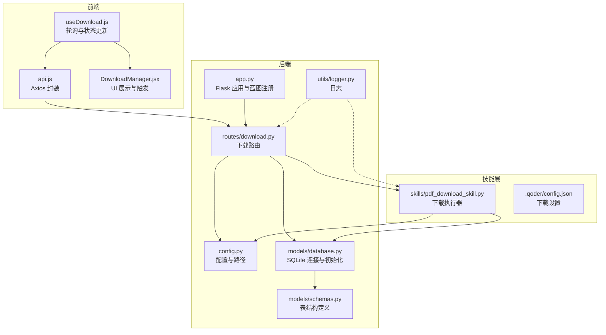
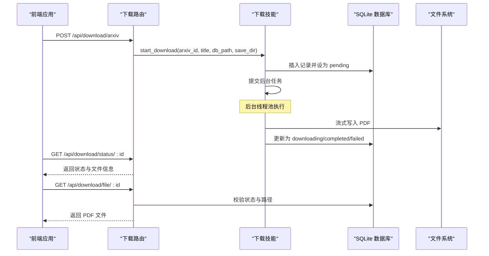
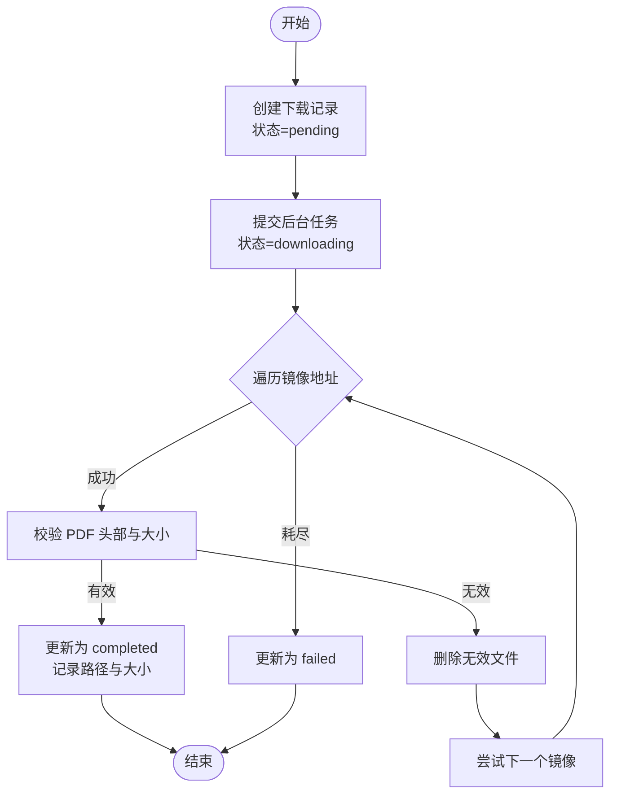
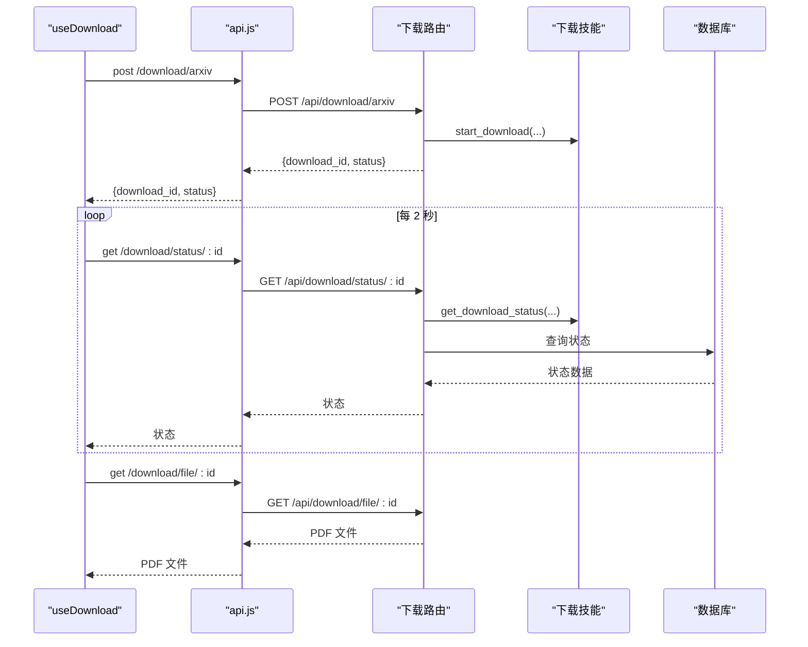
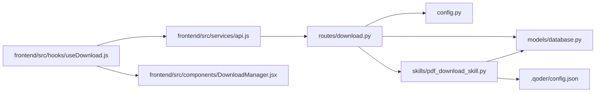

# 下载路由

<cite>
**本文引用的文件**
- [backend/routes/download.py](file://backend/routes/download.py)
- [.qoder/skills/pdf_download_skill.py](file://.qoder/skills/pdf_download_skill.py)
- [backend/config.py](file://backend/config.py)
- [backend/models/database.py](file://backend/models/database.py)
- [backend/models/schemas.py](file://backend/models/schemas.py)
- [backend/app.py](file://backend/app.py)
- [frontend/src/hooks/useDownload.js](file://frontend/src/hooks/useDownload.js)
- [frontend/src/services/api.js](file://frontend/src/services/api.js)
- [frontend/src/components/DownloadManager.jsx](file://frontend/src/components/DownloadManager.jsx)
- [backend/utils/logger.py](file://backend/utils/logger.py)
- [.qoder/config.json](file://.qoder/config.json)
</cite>

## 目录
1. [简介](#简介)
2. [项目结构](#项目结构)
3. [核心组件](#核心组件)
4. [架构总览](#架构总览)
5. [详细组件分析](#详细组件分析)
6. [依赖分析](#依赖分析)
7. [性能考虑](#性能考虑)
8. [故障排查指南](#故障排查指南)
9. [结论](#结论)
10. [附录](#附录)

## 简介
本文件系统性阐述下载路由的实现与使用，覆盖以下方面：
- PDF 下载相关 API 端点：arXiv 论文下载启动、下载状态查询、文件获取与历史记录
- 下载任务创建流程、并发控制与队列管理
- 异步下载处理与进度跟踪（前端轮询）
- 下载缓存策略、文件存储管理与错误恢复机制
- 完整示例：从触发下载到完成获取的端到端流程

## 项目结构
后端采用 Flask 蓝图组织路由；下载相关逻辑位于下载蓝图中，并通过技能模块执行实际下载工作。数据库初始化与表结构定义在模型层，配置项集中于配置模块，日志统一由工具模块提供。

图表来源
- [backend/app.py](file://backend/app.py#L21-L78)
- [backend/routes/download.py](file://backend/routes/download.py#L1-L98)
- [backend/config.py](file://backend/config.py#L15-L85)
- [backend/models/database.py](file://backend/models/database.py#L24-L51)
- [backend/models/schemas.py](file://backend/models/schemas.py#L1-L38)
- [.qoder/skills/pdf_download_skill.py](file://.qoder/skills/pdf_download_skill.py#L1-L146)
- [.qoder/config.json](file://.qoder/config.json#L14-L21)

章节来源
- [backend/app.py](file://backend/app.py#L21-L78)
- [backend/routes/download.py](file://backend/routes/download.py#L1-L98)
- [backend/config.py](file://backend/config.py#L15-L85)
- [backend/models/database.py](file://backend/models/database.py#L24-L51)
- [backend/models/schemas.py](file://backend/models/schemas.py#L1-L38)
- [.qoder/skills/pdf_download_skill.py](file://.qoder/skills/pdf_download_skill.py#L1-L146)
- [.qoder/config.json](file://.qoder/config.json#L14-L21)

## 核心组件
- 下载蓝图与路由
  - POST /api/download/arxiv：启动 arXiv 论文下载，返回下载记录 ID 与初始状态
  - GET /api/download/status/{id}：查询下载状态
  - GET /api/download/file/{id}：获取已下载 PDF 文件
  - GET /api/download/history：获取全部下载记录
- 技能模块
  - start_download：创建记录并提交后台任务
  - _download_worker：镜像回退下载、流式写入、校验与状态更新
  - get_download_status/get_all_downloads：查询状态与历史
- 前端集成
  - useDownload：发起下载、轮询状态、UI 展示
  - DownloadManager：展示状态、大小、触发下载链接
  - api.js：统一拦截与错误提示

章节来源
- [backend/routes/download.py](file://backend/routes/download.py#L14-L98)
- [.qoder/skills/pdf_download_skill.py](file://.qoder/skills/pdf_download_skill.py#L21-L146)
- [frontend/src/hooks/useDownload.js](file://frontend/src/hooks/useDownload.js#L9-L77)
- [frontend/src/components/DownloadManager.jsx](file://frontend/src/components/DownloadManager.jsx#L15-L114)
- [frontend/src/services/api.js](file://frontend/src/services/api.js#L4-L32)

## 架构总览
下载流程从前端触发，经由后端路由进入技能模块，后台线程池执行下载，数据库记录状态，前端通过轮询获取进度并最终下载文件。

图表来源
- [backend/routes/download.py](file://backend/routes/download.py#L14-L98)
- [.qoder/skills/pdf_download_skill.py](file://.qoder/skills/pdf_download_skill.py#L21-L106)
- [backend/models/database.py](file://backend/models/database.py#L24-L51)

## 详细组件分析

### 路由与端点设计
- POST /api/download/arxiv
  - 参数：arxiv_id（必填）、title（可选）
  - 行为：校验参数，调用技能模块创建下载记录并提交后台任务，返回 download_id 与初始状态
  - 错误：缺少 arxiv_id 返回 400；异常返回 500
- GET /api/download/status/{id}
  - 行为：根据记录 ID 查询状态；未找到返回 404；异常返回 500
- GET /api/download/file/{id}
  - 行为：仅当状态为 completed 时允许获取；校验文件存在性；否则返回相应错误码
- GET /api/download/history
  - 行为：返回所有下载记录列表

章节来源
- [backend/routes/download.py](file://backend/routes/download.py#L14-L98)

### 技能模块与并发控制
- 全局线程池
  - 使用固定大小的线程池执行下载任务，限制并发数量
- 下载流程
  - 创建记录并置为 pending
  - 提交后台任务，置为 downloading
  - 遍历镜像地址尝试下载，支持流式写入与断点续传友好（逐块写入）
  - 校验 PDF 头部与最小大小，确保有效性
  - 成功则更新为 completed 并记录文件路径与大小；失败则标记 failed
- 状态查询
  - 从数据库读取单条或全部记录，供前端轮询与 UI 展示

图表来源
- [.qoder/skills/pdf_download_skill.py](file://.qoder/skills/pdf_download_skill.py#L21-L106)

章节来源
- [.qoder/skills/pdf_download_skill.py](file://.qoder/skills/pdf_download_skill.py#L12-L146)

### 前端集成与轮询机制
- useDownload
  - startDownload：向后端发起下载请求，插入本地状态并显示下载管理面板
  - refreshStatus：对处于 pending/downloading 的任务进行轮询更新
  - 自动启停轮询：有活动任务时每 2 秒轮询一次
- DownloadManager
  - 展示状态图标、颜色与文本
  - 显示文件大小（若可用）
  - 完成后提供直接下载链接
- api.js
  - 统一设置基础 URL 与超时
  - 对 429、5xx、400 等错误进行用户提示

图表来源
- [frontend/src/hooks/useDownload.js](file://frontend/src/hooks/useDownload.js#L9-L77)
- [frontend/src/services/api.js](file://frontend/src/services/api.js#L4-L32)
- [backend/routes/download.py](file://backend/routes/download.py#L42-L82)
- [.qoder/skills/pdf_download_skill.py](file://.qoder/skills/pdf_download_skill.py#L122-L135)

章节来源
- [frontend/src/hooks/useDownload.js](file://frontend/src/hooks/useDownload.js#L9-L77)
- [frontend/src/components/DownloadManager.jsx](file://frontend/src/components/DownloadManager.jsx#L15-L114)
- [frontend/src/services/api.js](file://frontend/src/services/api.js#L4-L32)

### 数据库与文件存储
- 表结构
  - download_records：包含标题、URL、PDF 路径、状态、文件大小与时间戳
- 初始化
  - 应用启动时创建表（如不存在）
- 存储位置
  - 保存目录由配置决定，默认 data/downloads
  - PDF 以 arXiv ID 命名并保存在该目录下

章节来源
- [backend/models/schemas.py](file://backend/models/schemas.py#L28-L37)
- [backend/models/database.py](file://backend/models/database.py#L36-L44)
- [backend/config.py](file://backend/config.py#L47-L49)

### 缓存策略与错误恢复
- 当前下载流程不涉及搜索或分析缓存；下载状态与历史通过数据库持久化
- 错误恢复
  - 镜像回退：多镜像地址依次尝试
  - 无效文件清理：校验失败自动删除
  - 状态幂等更新：根据最新状态写入数据库
- 日志
  - 路由与技能模块均使用统一日志器输出关键事件与异常

章节来源
- [.qoder/skills/pdf_download_skill.py](file://.qoder/skills/pdf_download_skill.py#L56-L88)
- [backend/utils/logger.py](file://backend/utils/logger.py#L5-L23)

## 依赖分析
- 路由依赖
  - 依赖配置模块获取数据库路径与下载目录
  - 依赖技能模块执行下载、查询状态与获取历史
- 技能模块依赖
  - 依赖 SQLite 连接与表结构
  - 依赖配置模块中的下载设置（并发数、镜像列表）
- 前端依赖
  - 通过 api.js 统一访问 /api 前缀
  - 依赖 DownloadManager 展示与交互

图表来源
- [backend/routes/download.py](file://backend/routes/download.py#L1-L98)
- [backend/config.py](file://backend/config.py#L15-L85)
- [backend/models/database.py](file://backend/models/database.py#L24-L51)
- [.qoder/skills/pdf_download_skill.py](file://.qoder/skills/pdf_download_skill.py#L1-L146)
- [.qoder/config.json](file://.qoder/config.json#L14-L21)
- [frontend/src/hooks/useDownload.js](file://frontend/src/hooks/useDownload.js#L1-L78)
- [frontend/src/services/api.js](file://frontend/src/services/api.js#L1-L32)
- [frontend/src/components/DownloadManager.jsx](file://frontend/src/components/DownloadManager.jsx#L1-L114)

章节来源
- [backend/routes/download.py](file://backend/routes/download.py#L1-L98)
- [backend/config.py](file://backend/config.py#L15-L85)
- [backend/models/database.py](file://backend/models/database.py#L24-L51)
- [.qoder/skills/pdf_download_skill.py](file://.qoder/skills/pdf_download_skill.py#L1-L146)
- [.qoder/config.json](file://.qoder/config.json#L14-L21)
- [frontend/src/hooks/useDownload.js](file://frontend/src/hooks/useDownload.js#L1-L78)
- [frontend/src/services/api.js](file://frontend/src/services/api.js#L1-L32)
- [frontend/src/components/DownloadManager.jsx](file://frontend/src/components/DownloadManager.jsx#L1-L114)

## 性能考虑
- 并发控制
  - 技能模块使用固定大小线程池，避免过多并发导致资源争用
  - 建议结合全局速率限制与后端限流策略进一步优化
- I/O 与网络
  - 流式写入减少内存占用；镜像回退提升成功率
- 数据库
  - WAL 模式与超时设置有助于提升并发稳定性
- 前端轮询
  - 2 秒间隔平衡实时性与服务压力；可根据业务调整

章节来源
- [.qoder/skills/pdf_download_skill.py](file://.qoder/skills/pdf_download_skill.py#L12-L14)
- [backend/models/database.py](file://backend/models/database.py#L11-L21)
- [frontend/src/hooks/useDownload.js](file://frontend/src/hooks/useDownload.js#L51-L64)

## 故障排查指南
- 常见错误与处理
  - 缺少 arxiv_id：返回 400，检查请求体
  - 下载未完成：返回 400，需等待完成后再次请求
  - 文件不存在：返回 404，确认保存目录与权限
  - 服务器异常：返回 500，查看后端日志
- 日志定位
  - 路由层与技能层均有日志输出，便于追踪下载生命周期
- 前端提示
  - api.js 已对常见错误进行用户提示，便于快速反馈

章节来源
- [backend/routes/download.py](file://backend/routes/download.py#L22-L39)
- [backend/routes/download.py](file://backend/routes/download.py#L69-L78)
- [backend/utils/logger.py](file://backend/utils/logger.py#L5-L23)
- [frontend/src/services/api.js](file://frontend/src/services/api.js#L10-L29)

## 结论
下载路由通过清晰的端点设计、稳定的后台执行与数据库持久化，实现了可靠的 PDF 下载能力。配合前端轮询与 UI 展示，用户可直观地跟踪下载进度并获取文件。后续可在并发上限、镜像可用性与错误重试策略上进一步优化。

## 附录

### API 端点一览
- POST /api/download/arxiv
  - 请求体字段：arxiv_id（必填）、title（可选）
  - 响应：download_id、status
- GET /api/download/status/{id}
  - 响应：状态对象（含 pdf_path、file_size 等）
- GET /api/download/file/{id}
  - 响应：PDF 文件（二进制）
- GET /api/download/history
  - 响应：下载记录数组

章节来源
- [backend/routes/download.py](file://backend/routes/download.py#L14-L98)

### 配置项参考
- 下载设置
  - max_concurrent_downloads：最大并发数
  - arxiv_mirrors：镜像地址列表
- 数据目录
  - DATABASE_PATH：数据库路径
  - DOWNLOAD_DIR：PDF 保存目录

章节来源
- [.qoder/config.json](file://.qoder/config.json#L14-L21)
- [backend/config.py](file://backend/config.py#L35-L49)