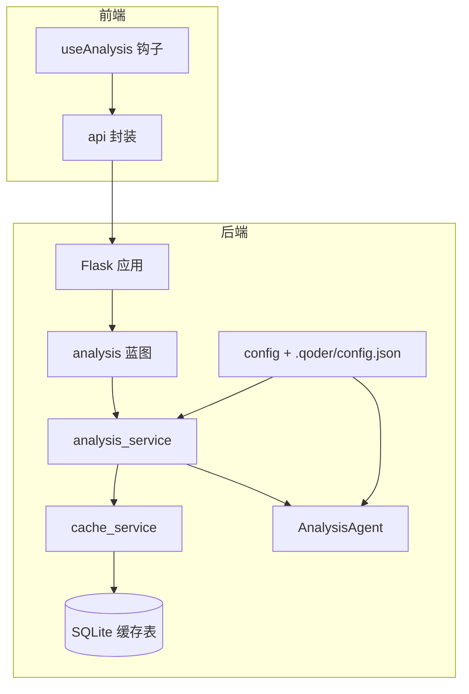
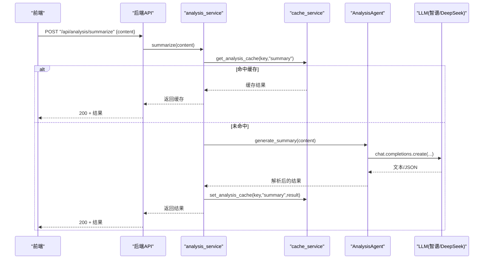
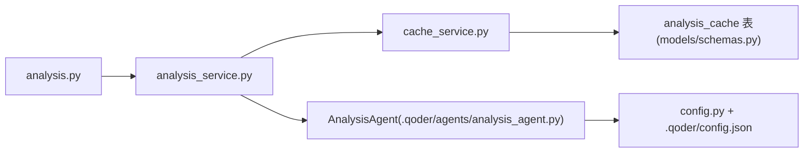
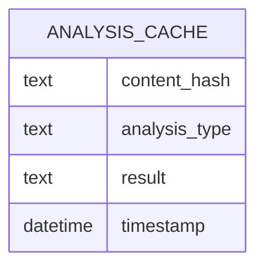

# 分析路由

<cite>
**本文引用的文件**
- [backend/routes/analysis.py](file://backend/routes/analysis.py)
- [backend/services/analysis_service.py](file://backend/services/analysis_service.py)
- [backend/services/cache_service.py](file://backend/services/cache_service.py)
- [backend/config.py](file://backend/config.py)
- [.qoder/config.json](file://.qoder/config.json)
- [.qoder/agents/analysis_agent.py](file://.qoder/agents/analysis_agent.py)
- [backend/models/schemas.py](file://backend/models/schemas.py)
- [backend/app.py](file://backend/app.py)
- [frontend/src/hooks/useAnalysis.js](file://frontend/src/hooks/useAnalysis.js)
- [frontend/src/services/api.js](file://frontend/src/services/api.js)
- [backend/test_integration.py](file://backend/test_integration.py)
</cite>

## 目录
1. [简介](#简介)
2. [项目结构](#项目结构)
3. [核心组件](#核心组件)
4. [架构总览](#架构总览)
5. [详细组件分析](#详细组件分析)
6. [依赖分析](#依赖分析)
7. [性能考虑](#性能考虑)
8. [故障排查指南](#故障排查指南)
9. [结论](#结论)
10. [附录](#附录)

## 简介
本文件系统化梳理“分析路由”的实现与使用，覆盖以下能力：
- 内容摘要生成
- 文本翻译
- 学术论文深度分析

文档重点说明：
- 各分析类型对应的API端点、请求参数与响应结构
- AI模型选择机制与配置来源
- 分析结果缓存策略与过期清理
- 错误处理与常见问题排查
- 前后端交互流程与典型使用场景

## 项目结构
分析路由位于后端蓝图中，通过Flask注册到应用；服务层负责调用分析代理与缓存；配置层统一管理模型与缓存参数；前端通过自定义Hook与API封装进行调用。

图表来源
- [backend/app.py](file://backend/app.py#L21-L67)
- [backend/routes/analysis.py](file://backend/routes/analysis.py#L1-L66)
- [backend/services/analysis_service.py](file://backend/services/analysis_service.py#L1-L91)
- [backend/services/cache_service.py](file://backend/services/cache_service.py#L1-L104)
- [backend/config.py](file://backend/config.py#L67-L73)
- [.qoder/config.json](file://.qoder/config.json#L22-L29)
- [.qoder/agents/analysis_agent.py](file://.qoder/agents/analysis_agent.py#L13-L33)
- [backend/models/schemas.py](file://backend/models/schemas.py#L1-L38)

章节来源
- [backend/app.py](file://backend/app.py#L21-L67)
- [backend/routes/analysis.py](file://backend/routes/analysis.py#L1-L66)

## 核心组件
- 路由层：提供三个分析端点，分别处理摘要、翻译与论文分析，并进行基础参数校验与异常捕获。
- 服务层：封装缓存键生成、缓存读取/写入、调用分析代理执行具体任务。
- 缓存层：基于SQLite的分析缓存表，支持按内容哈希与分析类型检索，带7天过期控制。
- 配置层：从环境变量与.qoder/config.json合并读取分析设置，包含模型、温度、最大长度、缓存过期等。
- 分析代理：根据配置初始化Zhipu或DeepSeek客户端，构造提示词并调用LLM，解析JSON输出或回退纯文本。

章节来源
- [backend/routes/analysis.py](file://backend/routes/analysis.py#L10-L66)
- [backend/services/analysis_service.py](file://backend/services/analysis_service.py#L25-L91)
- [backend/services/cache_service.py](file://backend/services/cache_service.py#L55-L87)
- [backend/config.py](file://backend/config.py#L67-L73)
- [.qoder/config.json](file://.qoder/config.json#L22-L29)
- [.qoder/agents/analysis_agent.py](file://.qoder/agents/analysis_agent.py#L13-L33)

## 架构总览
下图展示一次“摘要生成”请求在系统内的调用链路。

图表来源
- [backend/routes/analysis.py](file://backend/routes/analysis.py#L10-L25)
- [backend/services/analysis_service.py](file://backend/services/analysis_service.py#L25-L44)
- [backend/services/cache_service.py](file://backend/services/cache_service.py#L57-L87)
- [.qoder/agents/analysis_agent.py](file://.qoder/agents/analysis_agent.py#L86-L115)

## 详细组件分析

### 摘要生成（/api/analysis/summarize）
- 请求方法与路径
  - POST /api/analysis/summarize
- 请求体字段
  - content: string（必填，空白将触发400）
- 成功响应字段
  - summary: string（摘要）
  - key_points: array[string]（关键要点列表）
  - error: string|null（错误信息，成功时为null）
- 失败响应
  - 400：缺少content
  - 500：内部错误（含detail）
- 实现要点
  - 使用缓存键：基于content前缀与“summary”类型生成MD5
  - 命中缓存直接返回；未命中则调用AnalysisAgent生成摘要并写入缓存
  - content截断至最大长度（来自配置）

章节来源
- [backend/routes/analysis.py](file://backend/routes/analysis.py#L10-L25)
- [backend/services/analysis_service.py](file://backend/services/analysis_service.py#L25-L44)
- [backend/services/cache_service.py](file://backend/services/cache_service.py#L22-L25)
- [backend/config.py](file://backend/config.py#L67-L73)
- [.qoder/agents/analysis_agent.py](file://.qoder/agents/analysis_agent.py#L86-L115)

### 文本翻译（/api/analysis/translate）
- 请求方法与路径
  - POST /api/analysis/translate
- 请求体字段
  - content: string（必填）
  - target_lang: string（可选，默认"zh"）
- 成功响应字段
  - translated_text: string（译文）
  - source_lang: string（源语言标识）
  - error: string|null（错误信息）
- 失败响应
  - 400：缺少content
  - 500：内部错误（含detail）
- 实现要点
  - 缓存键：基于content前缀与“translate_{target_lang}”类型生成MD5
  - 支持目标语言切换（中文/其他语种）
  - 截断content至最大长度后调用AnalysisAgent执行翻译

章节来源
- [backend/routes/analysis.py](file://backend/routes/analysis.py#L27-L44)
- [backend/services/analysis_service.py](file://backend/services/analysis_service.py#L46-L64)
- [backend/services/cache_service.py](file://backend/services/cache_service.py#L22-L25)
- [backend/config.py](file://backend/config.py#L67-L73)
- [.qoder/agents/analysis_agent.py](file://.qoder/agents/analysis_agent.py#L116-L139)

### 论文分析（/api/analysis/paper）
- 请求方法与路径
  - POST /api/analysis/paper
- 请求体字段
  - title: string（可选）
  - abstract: string（可选，或使用snippet）
  - snippet: string（可选，或使用abstract）
- 成功响应字段
  - abstract_summary: string（摘要概述）
  - method: string（研究方法）
  - innovation: string（主要创新点）
  - results: string（实验结果）
  - conclusion: string（结论与局限性）
  - error: string|null（错误信息）
- 失败响应
  - 400：title与abstract/snippet均缺失
  - 500：内部错误（含detail）
- 实现要点
  - 缓存键：基于标题+摘要/片段拼接与“paper_analysis”类型生成MD5
  - 当abstract为空时回退到snippet
  - 截断后构造提示词，要求返回JSON，解析失败时回退纯文本

章节来源
- [backend/routes/analysis.py](file://backend/routes/analysis.py#L46-L66)
- [backend/services/analysis_service.py](file://backend/services/analysis_service.py#L67-L91)
- [backend/services/cache_service.py](file://backend/services/cache_service.py#L22-L25)
- [backend/config.py](file://backend/config.py#L67-L73)
- [.qoder/agents/analysis_agent.py](file://.qoder/agents/analysis_agent.py#L141-L185)

### AI模型选择机制
- 提供商与模型
  - provider: 来自配置（默认zhipu）
  - zhipu_model: 默认glm-4-flash
  - deepseek_model: 默认deepseek-chat
- 客户端初始化
  - DeepSeek：OpenAI兼容客户端，base_url=https://api.deepseek.com
  - Zhipu：zhipuai客户端
- 温度与最大长度
  - temperature：0.7
  - max_content_length：4000（超出截断）
- 未配置API Key的处理
  - 初始化日志警告；后续调用将返回“API key not configured or client initialization failed”

章节来源
- [.qoder/config.json](file://.qoder/config.json#L22-L29)
- [backend/config.py](file://backend/config.py#L67-L73)
- [.qoder/agents/analysis_agent.py](file://.qoder/agents/analysis_agent.py#L18-L33)
- [.qoder/agents/analysis_agent.py](file://.qoder/agents/analysis_agent.py#L34-L61)
- [.qoder/agents/analysis_agent.py](file://.qoder/agents/analysis_agent.py#L68-L85)

### 分析结果缓存策略
- 缓存键生成
  - 摘要/翻译：content前缀 + 类型
  - 论文分析：title+abstract/snippet + 类型
- 缓存存储
  - 表：analysis_cache（content_hash, analysis_type, result, timestamp）
  - 过期策略：7天
- 缓存命中与写入
  - 命中：直接返回
  - 未命中：调用代理后写入
- 过期清理
  - 启动时定期清理过期条目
  - 清理逻辑：删除analysis_cache中超过7天的记录

章节来源
- [backend/services/cache_service.py](file://backend/services/cache_service.py#L22-L25)
- [backend/services/cache_service.py](file://backend/services/cache_service.py#L57-L87)
- [backend/models/schemas.py](file://backend/models/schemas.py#L19-L26)
- [backend/services/cache_service.py](file://backend/services/cache_service.py#L91-L104)

### 错误处理与验证
- 参数校验
  - 摘要/翻译：content必填且非空
  - 论文分析：title与abstract/snippet至少一个存在
- 异常捕获
  - 路由层捕获异常并返回500，包含detail
  - 代理层捕获LLM调用异常并返回error
- 前端交互
  - 统一拦截器：429/5xx/400分别提示
  - useAnalysis钩子：聚合各分析结果，暴露loading与可见性状态

章节来源
- [backend/routes/analysis.py](file://backend/routes/analysis.py#L15-L17)
- [backend/routes/analysis.py](file://backend/routes/analysis.py#L32-L34)
- [backend/routes/analysis.py](file://backend/routes/analysis.py#L57-L58)
- [backend/routes/analysis.py](file://backend/routes/analysis.py#L22-L24)
- [backend/routes/analysis.py](file://backend/routes/analysis.py#L42-L43)
- [backend/routes/analysis.py](file://backend/routes/analysis.py#L64-L65)
- [.qoder/agents/analysis_agent.py](file://.qoder/agents/analysis_agent.py#L82-L84)
- [frontend/src/services/api.js](file://frontend/src/services/api.js#L10-L29)
- [frontend/src/hooks/useAnalysis.js](file://frontend/src/hooks/useAnalysis.js#L11-L24)

### 典型使用场景与示例

- 场景一：学术论文分析
  - 请求
    - 方法：POST
    - 路径：/api/analysis/paper
    - 示例请求体：
      - { "title": "...", "abstract": "..." }
      - 或 { "title": "...", "snippet": "..." }
  - 响应
    - { "abstract_summary": "...", "method": "...", "innovation": "...", "results": "...", "conclusion": "...", "error": null }

- 场景二：技术文档翻译
  - 请求
    - 方法：POST
    - 路径：/api/analysis/translate
    - 示例请求体：
      - { "content": "...", "target_lang": "en" }
  - 响应
    - { "translated_text": "...", "source_lang": "en", "error": null }

- 场景三：内容总结
  - 请求
    - 方法：POST
    - 路径：/api/analysis/summarize
    - 示例请求体：
      - { "content": "..." }
  - 响应
    - { "summary": "...", "key_points": [...], "error": null }

章节来源
- [backend/routes/analysis.py](file://backend/routes/analysis.py#L46-L66)
- [backend/routes/analysis.py](file://backend/routes/analysis.py#L27-L44)
- [backend/routes/analysis.py](file://backend/routes/analysis.py#L10-L25)

## 依赖分析
- 组件耦合
  - 路由层仅负责参数校验与异常包装，业务逻辑集中在服务层
  - 服务层通过AnalysisAgent解耦不同提供商的LLM调用
  - 缓存层与数据库表结构解耦，便于替换存储介质
- 外部依赖
  - ZhipuAI SDK（zhipuai）或OpenAI兼容SDK（DeepSeek）
  - SQLite（analysis_cache表）
- 可能的循环依赖
  - 未发现直接循环导入；模块间单向依赖清晰

图表来源
- [backend/routes/analysis.py](file://backend/routes/analysis.py#L1-L7)
- [backend/services/analysis_service.py](file://backend/services/analysis_service.py#L1-L10)
- [backend/services/cache_service.py](file://backend/services/cache_service.py#L1-L8)
- [.qoder/agents/analysis_agent.py](file://.qoder/agents/analysis_agent.py#L1-L10)
- [backend/config.py](file://backend/config.py#L15-L84)
- [.qoder/config.json](file://.qoder/config.json#L1-L31)
- [backend/models/schemas.py](file://backend/models/schemas.py#L19-L26)

章节来源
- [backend/routes/analysis.py](file://backend/routes/analysis.py#L1-L7)
- [backend/services/analysis_service.py](file://backend/services/analysis_service.py#L1-L10)
- [backend/services/cache_service.py](file://backend/services/cache_service.py#L1-L8)
- [.qoder/agents/analysis_agent.py](file://.qoder/agents/analysis_agent.py#L1-L10)
- [backend/config.py](file://backend/config.py#L15-L84)
- [.qoder/config.json](file://.qoder/config.json#L1-L31)
- [backend/models/schemas.py](file://backend/models/schemas.py#L19-L26)

## 性能考虑
- 缓存命中率
  - 对相同内容的重复分析可显著降低延迟与成本
  - 建议在前端对高频查询做去抖与结果复用
- 内容截断
  - 截断阈值与提示词长度共同限制单次调用成本
- 并发与限流
  - 建议在网关或上游增加速率限制，避免LLM配额超限
- 数据库存储
  - analysis_cache表带索引，建议定期维护与监控磁盘占用

## 故障排查指南
- 常见错误与定位
  - 400：检查请求体是否包含必需字段
  - 500：查看后端日志中的error与detail
  - 429/5xx：前端拦截器已提示，检查网络与配额
- 配置核对
  - 确认.env中ZHIPU_API_KEY或DEEPSEEK_API_KEY已正确设置
  - 检查.qoder/config.json中的provider/model/temperature/max_content_length
- 缓存问题
  - 若结果异常陈旧，等待7天过期清理或手动清空analysis_cache
- 单元/集成测试参考
  - 可通过后端集成测试脚本验证端点可用性与参数校验

章节来源
- [backend/routes/analysis.py](file://backend/routes/analysis.py#L16-L17)
- [backend/routes/analysis.py](file://backend/routes/analysis.py#L33-L34)
- [backend/routes/analysis.py](file://backend/routes/analysis.py#L57-L58)
- [backend/test_integration.py](file://backend/test_integration.py#L55-L58)
- [frontend/src/services/api.js](file://frontend/src/services/api.js#L10-L29)

## 结论
分析路由通过清晰的三层架构（路由/服务/代理）与SQLite缓存，提供了稳定的内容摘要、翻译与论文分析能力。其配置化模型选择与严格的参数校验，使得系统在易用性与可维护性之间取得平衡。建议在生产环境中结合速率限制与监控，持续优化缓存命中与LLM调用成本。

## 附录

### API定义与示例

- 摘要生成
  - 方法：POST /api/analysis/summarize
  - 请求体：{ "content": "..." }
  - 成功响应：{ "summary": "...", "key_points": [...], "error": null }
  - 失败响应：400/500

- 翻译
  - 方法：POST /api/analysis/translate
  - 请求体：{ "content": "...", "target_lang": "zh" }
  - 成功响应：{ "translated_text": "...", "source_lang": "en", "error": null }
  - 失败响应：400/500

- 论文分析
  - 方法：POST /api/analysis/paper
  - 请求体：{ "title": "...", "abstract": "..." } 或 { "title": "...", "snippet": "..." }
  - 成功响应：{ "abstract_summary": "...", "method": "...", "innovation": "...", "results": "...", "conclusion": "...", "error": null }
  - 失败响应：400/500

章节来源
- [backend/routes/analysis.py](file://backend/routes/analysis.py#L10-L66)

### 数据模型（analysis_cache）

图表来源
- [backend/models/schemas.py](file://backend/models/schemas.py#L19-L26)