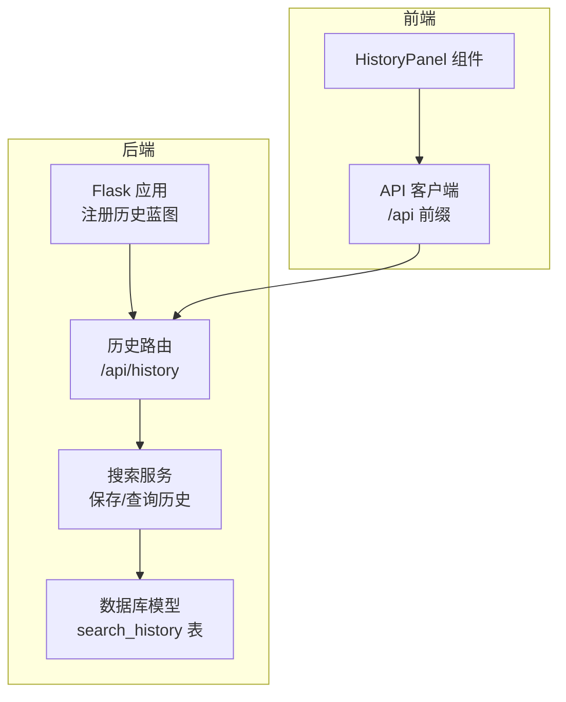
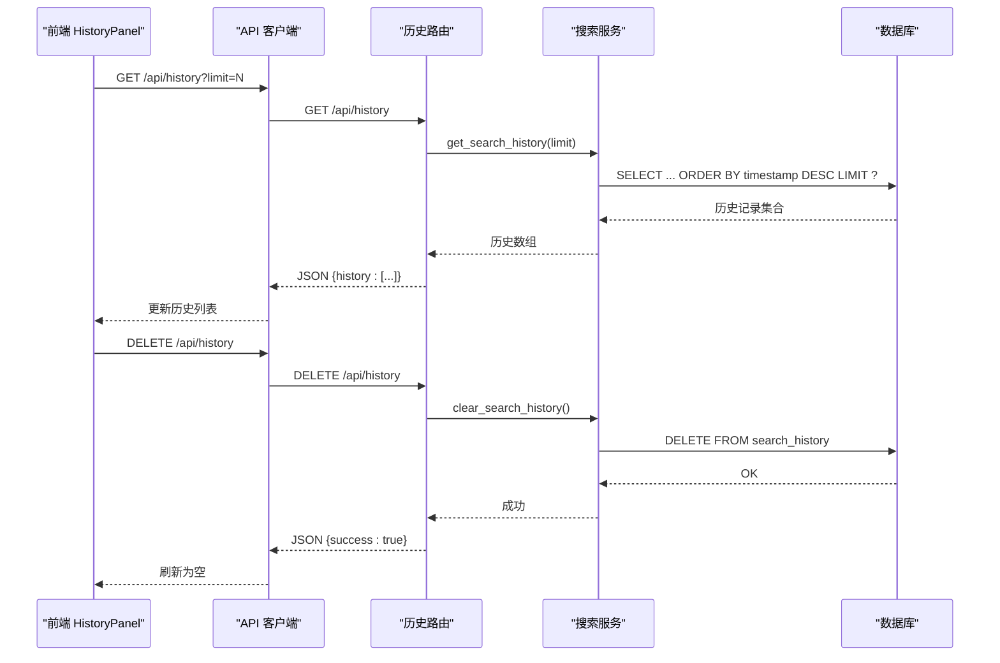
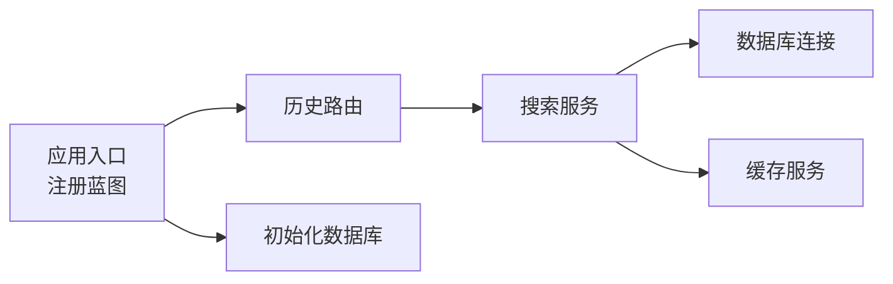

# 历史路由

<cite>
**本文引用的文件**
- [backend/routes/history.py](file://backend/routes/history.py)
- [backend/services/search_service.py](file://backend/services/search_service.py)
- [backend/models/schemas.py](file://backend/models/schemas.py)
- [backend/models/database.py](file://backend/models/database.py)
- [backend/app.py](file://backend/app.py)
- [frontend/src/components/HistoryPanel.jsx](file://frontend/src/components/HistoryPanel.jsx)
- [frontend/src/services/api.js](file://frontend/src/services/api.js)
- [backend/config.py](file://backend/config.py)
- [backend/routes/download.py](file://backend/routes/download.py)
- [backend/test_integration.py](file://backend/test_integration.py)
</cite>

## 目录
1. [简介](#简介)
2. [项目结构](#项目结构)
3. [核心组件](#核心组件)
4. [架构总览](#架构总览)
5. [详细组件分析](#详细组件分析)
6. [依赖关系分析](#依赖关系分析)
7. [性能与存储优化](#性能与存储优化)
8. [隐私与安全](#隐私与安全)
9. [故障排查指南](#故障排查指南)
10. [结论](#结论)

## 简介
本文件聚焦“历史路由”的实现与使用，涵盖搜索历史与下载历史相关的API端点、历史记录的存储结构、查询与清理流程、以及在前端中的展示与交互。同时提供历史数据的生命周期管理、存储优化策略与隐私保护建议，帮助开发者与使用者全面理解与正确使用历史功能。

## 项目结构
历史路由位于后端Flask蓝图中，通过独立的模块组织API端点；历史数据存储于SQLite数据库，并由服务层负责写入与查询；前端通过HistoryPanel组件展示历史并支持清空操作。

图表来源
- [backend/app.py](file://backend/app.py#L35-L39)
- [backend/routes/history.py](file://backend/routes/history.py#L1-L32)
- [backend/services/search_service.py](file://backend/services/search_service.py#L82-L97)
- [backend/models/schemas.py](file://backend/models/schemas.py#L2-L8)
- [frontend/src/components/HistoryPanel.jsx](file://frontend/src/components/HistoryPanel.jsx#L12-L35)
- [frontend/src/services/api.js](file://frontend/src/services/api.js#L4-L8)

章节来源
- [backend/app.py](file://backend/app.py#L35-L39)
- [backend/routes/history.py](file://backend/routes/history.py#L1-L32)
- [backend/services/search_service.py](file://backend/services/search_service.py#L82-L97)
- [backend/models/schemas.py](file://backend/models/schemas.py#L2-L8)
- [frontend/src/components/HistoryPanel.jsx](file://frontend/src/components/HistoryPanel.jsx#L12-L35)
- [frontend/src/services/api.js](file://frontend/src/services/api.js#L4-L8)

## 核心组件
- 历史路由（后端）：提供获取历史与清空历史两个端点，支持限制返回条数。
- 搜索服务：在每次搜索完成后写入历史记录，并提供查询与清空历史的方法。
- 数据库模型：定义search_history表结构，包含查询语句、过滤条件、结果数量与时间戳。
- 前端历史面板：拉取历史列表、展示条目、支持一键清空并触发重新搜索。

章节来源
- [backend/routes/history.py](file://backend/routes/history.py#L10-L32)
- [backend/services/search_service.py](file://backend/services/search_service.py#L70-L97)
- [backend/models/schemas.py](file://backend/models/schemas.py#L2-L8)
- [frontend/src/components/HistoryPanel.jsx](file://frontend/src/components/HistoryPanel.jsx#L12-L35)

## 架构总览
历史功能的端到端流程如下：
- 前端HistoryPanel发起请求获取历史或清空历史；
- 路由层history_bp接收请求并调用对应服务方法；
- 服务层通过数据库连接执行SQL读写；
- 数据库采用线程本地连接与WAL模式，保证并发与可靠性；
- 前端根据响应更新UI状态。

图表来源
- [frontend/src/components/HistoryPanel.jsx](file://frontend/src/components/HistoryPanel.jsx#L12-L35)
- [frontend/src/services/api.js](file://frontend/src/services/api.js#L4-L8)
- [backend/routes/history.py](file://backend/routes/history.py#L10-L32)
- [backend/services/search_service.py](file://backend/services/search_service.py#L82-L97)
- [backend/models/database.py](file://backend/models/database.py#L24-L33)

## 详细组件分析

### 后端历史路由（/api/history）
- GET /api/history
  - 参数：limit（默认20，最小1，最大100）
  - 返回：JSON对象，包含history字段为历史数组
  - 错误：捕获异常并记录日志，返回500与错误信息
- DELETE /api/history
  - 功能：清空所有历史记录
  - 返回：JSON对象，包含success字段
  - 错误：捕获异常并记录日志，返回500与错误信息

章节来源
- [backend/routes/history.py](file://backend/routes/history.py#L10-L32)

### 搜索服务与历史数据管理
- 写入历史
  - 在搜索完成后调用_save_history，将查询语句、过滤条件与结果数量写入search_history表
- 查询历史
  - get_search_history按时间倒序返回最近N条记录，默认limit=20
- 清空历史
  - clear_search_history删除search_history表全部记录

章节来源
- [backend/services/search_service.py](file://backend/services/search_service.py#L28-L67)
- [backend/services/search_service.py](file://backend/services/search_service.py#L70-L80)
- [backend/services/search_service.py](file://backend/services/search_service.py#L82-L97)

### 数据库模型与连接
- 表结构（search_history）
  - 字段：id（自增主键）、query（查询文本）、filters（JSON字符串，过滤条件）、result_count（整型）、timestamp（时间戳）
- 连接与事务
  - 使用线程本地连接，启用WAL模式、busy_timeout、外键约束
  - 提供上下文管理器自动提交/回滚

章节来源
- [backend/models/schemas.py](file://backend/models/schemas.py#L2-L8)
- [backend/models/database.py](file://backend/models/database.py#L11-L33)

### 前端历史面板与交互
- 拉取历史：首次打开抽屉时调用GET /api/history?limit=50
- 展示历史：列表项包含查询语句、结果数量与时间戳
- 清空历史：弹窗确认后调用DELETE /api/history，成功后清空列表
- 快速重搜：点击历史项触发父级回调进行重新搜索

章节来源
- [frontend/src/components/HistoryPanel.jsx](file://frontend/src/components/HistoryPanel.jsx#L12-L35)
- [frontend/src/components/HistoryPanel.jsx](file://frontend/src/components/HistoryPanel.jsx#L37-L40)

### 下载历史（补充说明）
- GET /api/download/history
  - 返回所有下载记录（用于前端下载管理器）
- 该端点与历史路由同属后端蓝图，但不直接参与搜索历史管理

章节来源
- [backend/routes/download.py](file://backend/routes/download.py#L85-L97)

## 依赖关系分析
历史路由依赖搜索服务，搜索服务依赖数据库连接与缓存服务；应用启动时注册历史蓝图并初始化数据库。

图表来源
- [backend/app.py](file://backend/app.py#L35-L39)
- [backend/app.py](file://backend/app.py#L70-L72)
- [backend/routes/history.py](file://backend/routes/history.py#L3)
- [backend/services/search_service.py](file://backend/services/search_service.py#L7-L11)

章节来源
- [backend/app.py](file://backend/app.py#L35-L39)
- [backend/app.py](file://backend/app.py#L70-L72)
- [backend/routes/history.py](file://backend/routes/history.py#L3)
- [backend/services/search_service.py](file://backend/services/search_service.py#L7-L11)

## 性能与存储优化
- 查询性能
  - 历史查询按timestamp降序并限制条数，避免全表扫描；可在timestamp列建立索引以进一步优化（当前未见显式索引，但按时间排序通常受益于B-tree索引）
- 存储优化
  - SQLite WAL模式提升并发读写性能
  - 线程本地连接减少锁竞争
  - 历史记录仅包含必要字段，JSON过滤条件便于扩展
- 缓存与历史的关系
  - 搜索结果缓存与历史记录是两个独立的机制；历史记录不参与搜索加速，但有助于用户行为追踪与复现
- 建议
  - 可考虑对timestamp添加索引以优化排序查询
  - 对filters字段可做更细粒度的索引或物化视图（视业务需求而定）

章节来源
- [backend/models/database.py](file://backend/models/database.py#L17-L18)
- [backend/services/search_service.py](file://backend/services/search_service.py#L82-L90)

## 隐私与安全
- 数据最小化
  - 历史表仅存储查询文本、过滤条件、结果数量与时间戳，不包含敏感内容
- 删除机制
  - 提供清空历史接口，支持用户主动删除个人历史
- 日志与异常
  - 路由层对异常进行统一记录，避免敏感信息泄露
- 前端交互
  - 历史面板支持一键清空，清空前弹窗确认，保障用户知情权

章节来源
- [backend/routes/history.py](file://backend/routes/history.py#L19-L21)
- [backend/routes/history.py](file://backend/routes/history.py#L30-L32)
- [frontend/src/components/HistoryPanel.jsx](file://frontend/src/components/HistoryPanel.jsx#L50-L56)

## 故障排查指南
- 常见问题
  - 获取历史失败：检查后端日志，确认数据库连接是否正常、表是否存在
  - 清空历史无效：确认DELETE /api/history返回200且前端已刷新列表
  - 历史为空：确认搜索是否成功写入历史（搜索完成后会调用保存逻辑）
- 测试验证
  - 集成测试覆盖了历史查询与清空的历史路径，可用于回归验证

章节来源
- [backend/test_integration.py](file://backend/test_integration.py#L74-L93)

## 结论
历史路由提供了简洁可靠的历史记录查询与清理能力，配合搜索服务与数据库模型，实现了完整的用户行为记录与复现路径。前端通过HistoryPanel直观地展示了历史并支持一键清空。建议在未来版本中对时间戳字段增加索引以进一步提升查询性能，并持续关注用户隐私与数据最小化原则的落实。