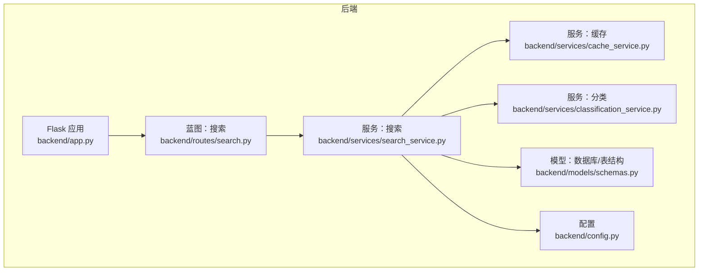
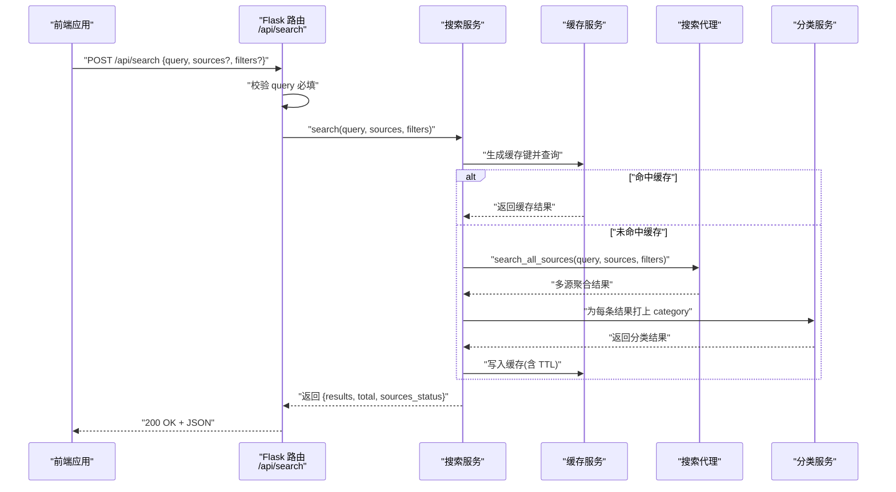
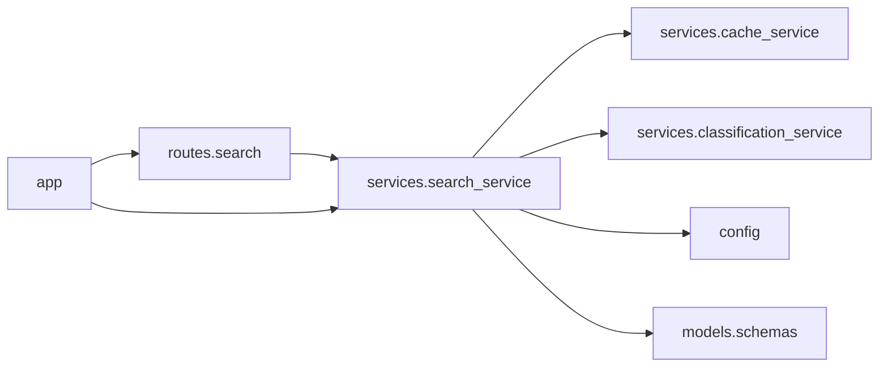

# 搜索路由

<cite>
**本文引用的文件**
- [backend/routes/search.py](file://backend/routes/search.py)
- [backend/services/search_service.py](file://backend/services/search_service.py)
- [backend/services/cache_service.py](file://backend/services/cache_service.py)
- [backend/services/classification_service.py](file://backend/services/classification_service.py)
- [backend/models/schemas.py](file://backend/models/schemas.py)
- [backend/app.py](file://backend/app.py)
- [backend/config.py](file://backend/config.py)
- [frontend/src/hooks/useSearch.js](file://frontend/src/hooks/useSearch.js)
- [frontend/src/services/api.js](file://frontend/src/services/api.js)
- [backend/test_integration.py](file://backend/test_integration.py)
</cite>

## 目录
1. [简介](#简介)
2. [项目结构](#项目结构)
3. [核心组件](#核心组件)
4. [架构总览](#架构总览)
5. [详细组件分析](#详细组件分析)
6. [依赖关系分析](#依赖关系分析)
7. [性能考虑](#性能考虑)
8. [故障排查指南](#故障排查指南)
9. [结论](#结论)
10. [附录](#附录)

## 简介
本文件聚焦于后端搜索路由的实现与使用，详细说明 POST /api/search 端点的请求参数校验、错误处理机制、响应格式，以及搜索服务的调用流程、多源搜索与结果聚合过程。同时提供请求/响应示例、过滤器使用方法与性能优化策略，帮助开发者快速理解并正确集成搜索功能。

## 项目结构
后端采用 Flask 蓝图组织路由，搜索路由位于 backend/routes/search.py；搜索业务逻辑在 backend/services/search_service.py 中实现；缓存与分类等辅助能力分别由 backend/services/cache_service.py 和 backend/services/classification_service.py 提供；数据库模式定义在 backend/models/schemas.py；应用入口与蓝图注册在 backend/app.py；全局配置在 backend/config.py。

图表来源
- [backend/app.py](file://backend/app.py#L21-L67)
- [backend/routes/search.py](file://backend/routes/search.py#L1-L28)
- [backend/services/search_service.py](file://backend/services/search_service.py#L1-L98)
- [backend/services/cache_service.py](file://backend/services/cache_service.py#L1-L104)
- [backend/services/classification_service.py](file://backend/services/classification_service.py#L1-L64)
- [backend/models/schemas.py](file://backend/models/schemas.py#L1-L38)
- [backend/config.py](file://backend/config.py#L1-L85)

章节来源
- [backend/app.py](file://backend/app.py#L21-L67)
- [backend/routes/search.py](file://backend/routes/search.py#L1-L28)
- [backend/services/search_service.py](file://backend/services/search_service.py#L1-L98)
- [backend/services/cache_service.py](file://backend/services/cache_service.py#L1-L104)
- [backend/services/classification_service.py](file://backend/services/classification_service.py#L1-L64)
- [backend/models/schemas.py](file://backend/models/schemas.py#L1-L38)
- [backend/config.py](file://backend/config.py#L1-L85)

## 核心组件
- 路由层：负责接收请求、解析 JSON、参数校验、异常捕获与统一返回。
- 服务层：实现多源搜索、缓存命中、结果分类、历史记录持久化与统计。
- 缓存层：基于 SQLite 的搜索结果缓存，带过期时间管理。
- 分类层：根据 URL 或来源对结果进行内容类别标注。
- 配置层：集中管理默认搜索参数、缓存 TTL、下载与分析设置等。
- 前端集成：通过自定义 Hook 与 API 封装发起搜索请求，并在客户端做二次过滤。

章节来源
- [backend/routes/search.py](file://backend/routes/search.py#L10-L27)
- [backend/services/search_service.py](file://backend/services/search_service.py#L28-L67)
- [backend/services/cache_service.py](file://backend/services/cache_service.py#L16-L52)
- [backend/services/classification_service.py](file://backend/services/classification_service.py#L30-L63)
- [backend/config.py](file://backend/config.py#L53-L59)
- [frontend/src/hooks/useSearch.js](file://frontend/src/hooks/useSearch.js#L19-L50)
- [frontend/src/services/api.js](file://frontend/src/services/api.js#L4-L29)

## 架构总览
下图展示了从客户端到后端服务的整体调用链路，包括参数校验、缓存检查、多源搜索、结果分类与缓存写入。

图表来源
- [backend/routes/search.py](file://backend/routes/search.py#L10-L27)
- [backend/services/search_service.py](file://backend/services/search_service.py#L28-L67)
- [backend/services/cache_service.py](file://backend/services/cache_service.py#L16-L52)
- [backend/services/classification_service.py](file://backend/services/classification_service.py#L30-L63)

## 详细组件分析

### 路由层：POST /api/search
- 请求体字段
  - query: 关键词字符串，必填且会去除首尾空白。
  - sources: 字符串数组，可选，默认取配置项。
  - filters: 字典，可选，用于向搜索代理传递过滤条件。
- 参数校验
  - 若 query 为空或仅空白字符，返回 400 并提示“query is required”。
- 错误处理
  - 服务层抛出异常时捕获并记录日志，返回 500 与包含 detail 的错误信息。
- 成功响应
  - 直接返回服务层结果对象（见“响应格式”）。

章节来源
- [backend/routes/search.py](file://backend/routes/search.py#L10-L27)

### 服务层：搜索服务
- 默认参数
  - sources 默认来自配置项 SEARCH_DEFAULTS.default_sources。
  - filters 默认空字典。
- 缓存策略
  - 使用缓存键生成函数计算 query_hash。
  - 若缓存存在且未过期，直接返回缓存结果。
- 多源搜索
  - 通过懒加载的搜索代理执行 search_all_sources(query, sources, filters)，得到聚合结果。
- 结果分类
  - 对每条结果添加 category 字段，优先依据来源映射，其次基于 URL 域名规则判定。
- 缓存写入
  - 使用配置项 SEARCH_DEFAULTS.cache_expire_hours 设置 TTL。
- 历史记录
  - 将查询、过滤器与结果总数写入 search_history 表。

章节来源
- [backend/services/search_service.py](file://backend/services/search_service.py#L28-L67)
- [backend/services/cache_service.py](file://backend/services/cache_service.py#L16-L52)
- [backend/services/classification_service.py](file://backend/services/classification_service.py#L30-L63)
- [backend/models/schemas.py](file://backend/models/schemas.py#L1-L17)
- [backend/config.py](file://backend/config.py#L53-L59)

### 缓存服务
- 搜索缓存键
  - 基于排序后的 sources 与 filters 生成稳定 JSON 字符串，再经 MD5 得到 query_hash。
- 查询与写入
  - 查询时检查过期时间；写入时按 TTL 计算过期时间。
- 清理策略
  - 提供清理过期缓存的函数（按时间阈值删除）。

章节来源
- [backend/services/cache_service.py](file://backend/services/cache_service.py#L16-L52)

### 分类服务
- 来源优先：如 arxiv、scholar、zhihu 等来源映射到学术、问答等类别。
- URL 规则：基于域名后缀匹配学术、问答、博客、论坛等类别。
- 无法识别：返回通用类别 webpage。

章节来源
- [backend/services/classification_service.py](file://backend/services/classification_service.py#L30-L63)

### 数据模型与表结构
- search_history：保存每次搜索的 query、filters、result_count 与时间戳。
- search_cache：保存查询哈希、结果 JSON 与过期时间。
- analysis_cache：保存分析结果缓存（与搜索无关，但同属缓存体系）。

章节来源
- [backend/models/schemas.py](file://backend/models/schemas.py#L1-L38)

### 前端集成
- useSearch Hook
  - 维护 results、total、sourcesStatus、loading、error、query、filters。
  - 发起 POST /api/search，将 filters.sources 传给后端。
  - 客户端侧支持按 category 过滤显示。
- API 封装
  - 统一拦截器处理 400、429、5xx 等状态码，提升用户体验。

章节来源
- [frontend/src/hooks/useSearch.js](file://frontend/src/hooks/useSearch.js#L19-L50)
- [frontend/src/services/api.js](file://frontend/src/services/api.js#L10-L29)

## 依赖关系分析
- 路由依赖服务层；服务层依赖缓存、分类、配置与数据库；应用入口注册所有蓝图并初始化数据库。
- 搜索代理由服务层懒加载注入，避免启动时的模块导入开销。

图表来源
- [backend/routes/search.py](file://backend/routes/search.py#L1-L28)
- [backend/services/search_service.py](file://backend/services/search_service.py#L1-L98)
- [backend/services/cache_service.py](file://backend/services/cache_service.py#L1-L104)
- [backend/services/classification_service.py](file://backend/services/classification_service.py#L1-L64)
- [backend/models/schemas.py](file://backend/models/schemas.py#L1-L38)
- [backend/app.py](file://backend/app.py#L21-L67)
- [backend/config.py](file://backend/config.py#L1-L85)

章节来源
- [backend/app.py](file://backend/app.py#L21-L67)
- [backend/routes/search.py](file://backend/routes/search.py#L1-L28)
- [backend/services/search_service.py](file://backend/services/search_service.py#L1-L98)

## 性能考虑
- 缓存命中优先：通过稳定的缓存键与过期时间控制，显著降低重复查询成本。
- 懒加载代理：仅在首次调用时初始化搜索代理，减少启动时间。
- 结果分类批量处理：遍历结果集一次性完成分类，避免多次外部调用。
- 配置化参数：最大结果数、超时、TTL 等均可通过配置调整，便于按环境优化。
- 建议
  - 合理设置 SEARCH_DEFAULTS.max_results_per_source 与 timeout_seconds。
  - 控制 filters 的复杂度，避免导致代理层处理压力过大。
  - 定期清理过期缓存，维持数据库健康。

章节来源
- [backend/services/search_service.py](file://backend/services/search_service.py#L28-L67)
- [backend/services/cache_service.py](file://backend/services/cache_service.py#L43-L52)
- [backend/config.py](file://backend/config.py#L53-L59)

## 故障排查指南
- 常见错误与处理
  - 400 参数缺失：当 query 为空时，路由直接返回错误，检查前端是否正确传参。
  - 500 服务异常：路由捕获异常并记录日志，检查后端日志定位具体原因。
  - 404 非 API 路径：静态资源回退至 SPA 入口，确保前端构建产物存在。
- 日志与监控
  - 路由与服务层均输出关键日志，建议结合日志定位问题。
- 单元/集成测试参考
  - 可参考集成测试脚本中对 /api/search 的调用与断言，验证行为一致性。

章节来源
- [backend/routes/search.py](file://backend/routes/search.py#L10-L27)
- [backend/app.py](file://backend/app.py#L61-L65)
- [backend/test_integration.py](file://backend/test_integration.py#L16-L59)

## 结论
POST /api/search 提供了简洁而强大的多源搜索能力：严格的参数校验、完善的错误处理、可配置的缓存与分类、以及与前端的无缝协作。通过合理的配置与优化策略，可在保证性能的同时满足多样化的搜索需求。

## 附录

### 请求参数与响应格式
- 请求体
  - query: 字符串，必填
  - sources: 字符串数组，可选（默认取配置）
  - filters: 字典，可选（透传给搜索代理）
- 成功响应
  - 结构：包含 results（数组）、total（整数）、sources_status（字典）
  - 示例（路径）
    - [成功响应示例](file://backend/test_integration.py#L26-L37)
- 错误响应
  - 400：缺少 query
    - 示例（路径）：[参数校验失败](file://backend/test_integration.py#L48-L53)
  - 500：服务异常
    - 示例（路径）：[服务异常](file://backend/routes/search.py#L25-L27)

章节来源
- [backend/routes/search.py](file://backend/routes/search.py#L10-L27)
- [backend/test_integration.py](file://backend/test_integration.py#L26-L59)

### 过滤器使用方法
- filters 为字典类型，可按需传递给搜索代理以实现更精细的筛选（例如语言、时间范围等）。当前前端示例中传空字典，实际使用时可根据代理支持的键进行扩展。
- 客户端也可在本地对 results 进行二次过滤（如按 category），但推荐优先通过 filters 在服务端完成，减少传输与渲染负担。

章节来源
- [frontend/src/hooks/useSearch.js](file://frontend/src/hooks/useSearch.js#L13-L38)
- [backend/services/search_service.py](file://backend/services/search_service.py#L40-L42)

### 多源搜索与结果聚合
- sources 为空时使用配置默认值；非空时按传入列表执行多源搜索。
- 代理层负责并发或顺序访问各数据源并聚合结果，服务层返回统一结构。
- 聚合完成后对每条结果添加 category 字段，便于前端展示与筛选。

章节来源
- [backend/services/search_service.py](file://backend/services/search_service.py#L40-L57)

### 请求/响应示例
- 成功示例
  - 请求：POST /api/search，body 包含 query 与 sources
  - 响应：包含 results、total、sources_status
  - 参考（路径）：[集成测试用例](file://backend/test_integration.py#L26-L37)
- 参数错误示例
  - 请求：POST /api/search，body 为空
  - 响应：{"error":"query is required"}
  - 参考（路径）：[集成测试用例](file://backend/test_integration.py#L48-L53)
- 服务异常示例
  - 请求：POST /api/search，触发服务层异常
  - 响应：{"error":"Search failed","detail":"..."}
  - 参考（路径）：[路由异常处理](file://backend/routes/search.py#L25-L27)

章节来源
- [backend/test_integration.py](file://backend/test_integration.py#L26-L59)
- [backend/routes/search.py](file://backend/routes/search.py#L25-L27)