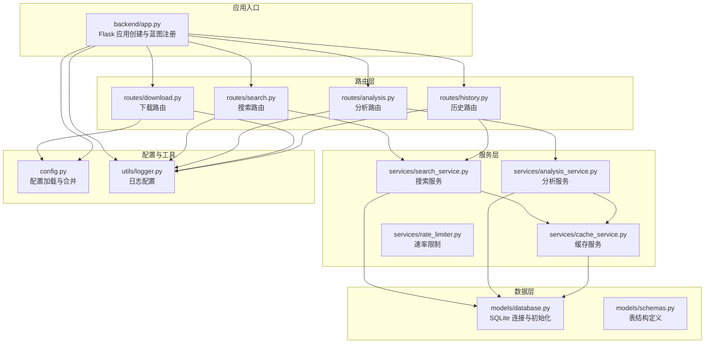
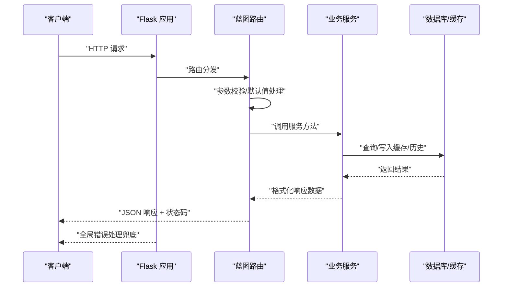
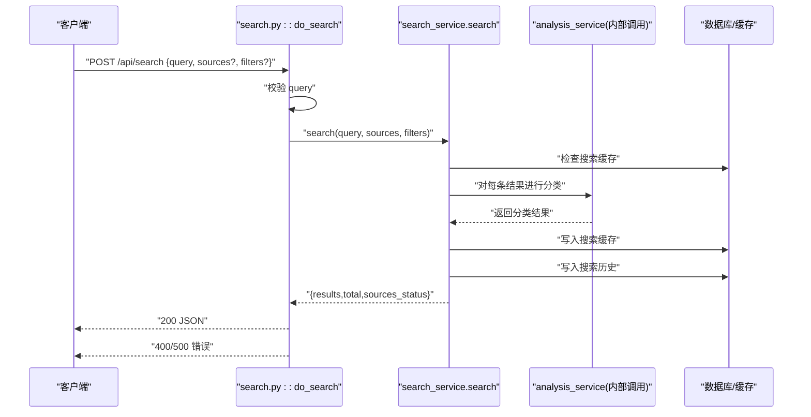
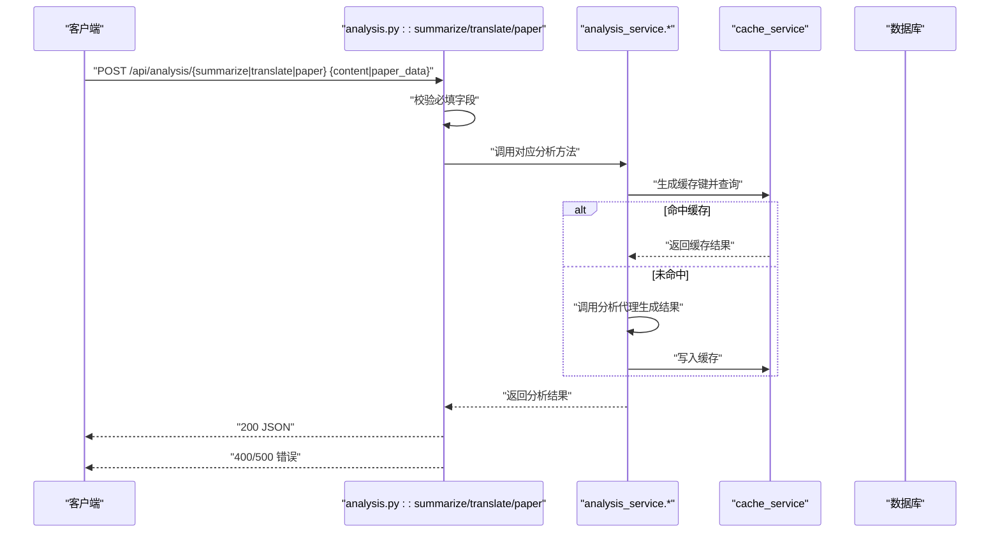
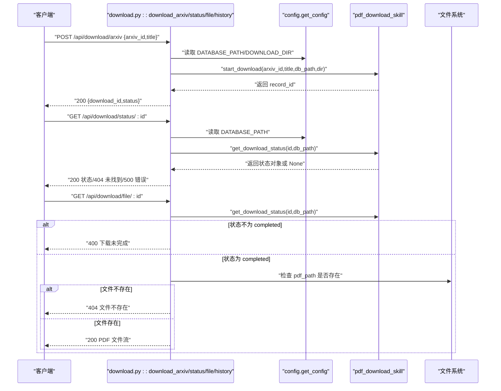
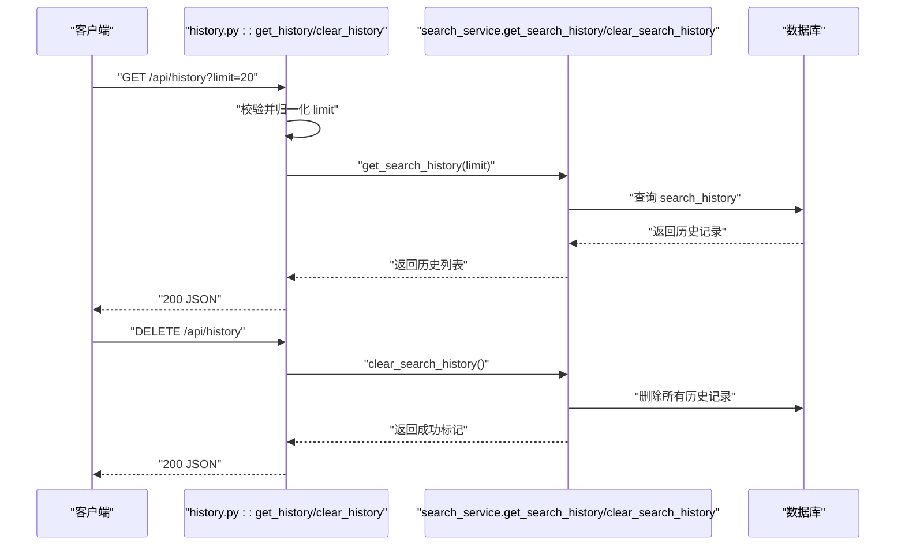
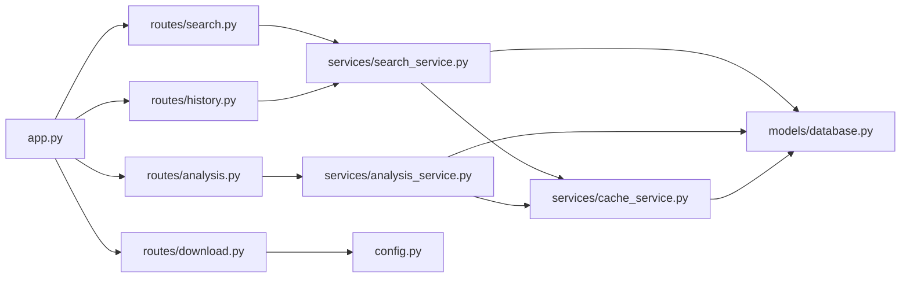

# 路由层设计

<cite>
**本文档引用的文件**
- [backend/app.py](file://backend/app.py)
- [backend/config.py](file://backend/config.py)
- [backend/routes/search.py](file://backend/routes/search.py)
- [backend/routes/analysis.py](file://backend/routes/analysis.py)
- [backend/routes/download.py](file://backend/routes/download.py)
- [backend/routes/history.py](file://backend/routes/history.py)
- [backend/services/search_service.py](file://backend/services/search_service.py)
- [backend/services/analysis_service.py](file://backend/services/analysis_service.py)
- [backend/services/cache_service.py](file://backend/services/cache_service.py)
- [backend/services/rate_limiter.py](file://backend/services/rate_limiter.py)
- [backend/models/database.py](file://backend/models/database.py)
- [backend/models/schemas.py](file://backend/models/schemas.py)
- [backend/utils/logger.py](file://backend/utils/logger.py)
- [backend/test_integration.py](file://backend/test_integration.py)
- [README.md](file://README.md)
</cite>

## 目录
1. [简介](#简介)
2. [项目结构](#项目结构)
3. [核心组件](#核心组件)
4. [架构总览](#架构总览)
5. [详细组件分析](#详细组件分析)
6. [依赖分析](#依赖分析)
7. [性能考虑](#性能考虑)
8. [故障排查指南](#故障排查指南)
9. [结论](#结论)
10. [附录](#附录)

## 简介
本文件系统性阐述后端路由层的设计与实现，覆盖 API 路由组织、请求处理流程、响应格式标准化、搜索/分析/下载/历史等核心路由的实现细节，并包含请求参数校验、响应数据格式化、错误处理与状态码管理、API 端点示例、请求响应示例、集成测试方法以及路由中间件、权限控制与安全考虑。

## 项目结构
后端采用 Flask + Blueprint 的分层组织方式，路由层位于 backend/routes，业务逻辑位于 backend/services，数据模型与数据库初始化位于 backend/models，全局配置与日志工具位于 backend/config 与 backend/utils。应用入口在 backend/app.py 中注册蓝图并提供静态资源服务与全局错误处理。

图表来源
- [backend/app.py](file://backend/app.py#L21-L67)
- [backend/routes/search.py](file://backend/routes/search.py#L1-L28)
- [backend/routes/analysis.py](file://backend/routes/analysis.py#L1-L66)
- [backend/routes/download.py](file://backend/routes/download.py#L1-L98)
- [backend/routes/history.py](file://backend/routes/history.py#L1-L33)
- [backend/services/search_service.py](file://backend/services/search_service.py#L1-L98)
- [backend/services/analysis_service.py](file://backend/services/analysis_service.py#L1-L91)
- [backend/services/cache_service.py](file://backend/services/cache_service.py#L1-L104)
- [backend/models/database.py](file://backend/models/database.py#L1-L51)
- [backend/models/schemas.py](file://backend/models/schemas.py#L1-L38)
- [backend/config.py](file://backend/config.py#L1-L85)
- [backend/utils/logger.py](file://backend/utils/logger.py#L1-L23)

章节来源
- [backend/app.py](file://backend/app.py#L1-L78)
- [backend/routes/search.py](file://backend/routes/search.py#L1-L28)
- [backend/routes/analysis.py](file://backend/routes/analysis.py#L1-L66)
- [backend/routes/download.py](file://backend/routes/download.py#L1-L98)
- [backend/routes/history.py](file://backend/routes/history.py#L1-L33)

## 核心组件
- 蓝图注册与静态资源：在应用入口中注册四个蓝图，启用 CORS 并提供 SPA 静态文件回退。
- 日志系统：统一通过 get_logger 初始化日志器，确保各路由与服务模块的日志一致性。
- 配置系统：集中读取 .env 与 .qoder/config.json，提供数据库路径、下载目录、速率限制、搜索默认值等。
- 数据库初始化：在应用启动时创建表结构，确保 search_history、search_cache、analysis_cache、download_records 表存在。
- 全局错误处理：捕获未处理异常并返回统一的 JSON 错误响应。

章节来源
- [backend/app.py](file://backend/app.py#L21-L67)
- [backend/utils/logger.py](file://backend/utils/logger.py#L1-L23)
- [backend/config.py](file://backend/config.py#L15-L85)
- [backend/models/database.py](file://backend/models/database.py#L36-L43)
- [backend/models/schemas.py](file://backend/models/schemas.py#L1-L38)

## 架构总览
路由层采用“请求 → 路由 → 服务 → 数据库/缓存”的标准流水线，每个路由负责参数校验、调用对应服务、格式化响应并处理异常；服务层负责业务编排、缓存命中、历史记录与外部 API 调用；数据层负责 SQLite 表结构与连接管理。

图表来源
- [backend/app.py](file://backend/app.py#L21-L67)
- [backend/routes/search.py](file://backend/routes/search.py#L10-L28)
- [backend/routes/analysis.py](file://backend/routes/analysis.py#L10-L66)
- [backend/routes/download.py](file://backend/routes/download.py#L14-L98)
- [backend/routes/history.py](file://backend/routes/history.py#L10-L33)
- [backend/services/search_service.py](file://backend/services/search_service.py#L28-L67)
- [backend/services/analysis_service.py](file://backend/services/analysis_service.py#L25-L91)
- [backend/services/cache_service.py](file://backend/services/cache_service.py#L30-L87)
- [backend/models/database.py](file://backend/models/database.py#L24-L43)

## 详细组件分析

### 搜索路由（/api/search）
- 路由定义：POST /api/search，接收 JSON 请求体，包含 query、sources、filters。
- 参数校验：
  - 必填字段：query，非空且去空白。
  - 可选字段：sources（默认取配置）、filters（默认空字典）。
- 业务流程：
  - 调用搜索服务执行多源搜索，返回包含 results、total、sources_status 的结构。
  - 服务层内置缓存命中逻辑，避免重复请求。
  - 保存搜索历史至数据库。
- 响应格式：成功返回 JSON 对象，失败返回包含 error 与 detail 的对象。
- 状态码：200 成功；400 参数缺失；500 服务异常。

图表来源
- [backend/routes/search.py](file://backend/routes/search.py#L10-L28)
- [backend/services/search_service.py](file://backend/services/search_service.py#L28-L67)
- [backend/services/analysis_service.py](file://backend/services/analysis_service.py#L25-L91)
- [backend/models/database.py](file://backend/models/database.py#L36-L43)

章节来源
- [backend/routes/search.py](file://backend/routes/search.py#L10-L28)
- [backend/services/search_service.py](file://backend/services/search_service.py#L28-L67)

### 分析路由（/api/analysis/*）
- 路由定义与端点：
  - POST /api/analysis/summarize：生成摘要与关键点。
  - POST /api/analysis/translate：内容翻译，默认目标语言为中文。
  - POST /api/analysis/paper：学术论文深度分析（标题/摘要/片段任一即可）。
- 参数校验：
  - summarize/translate：content 必填且非空。
  - paper：title 与 abstract/snippet 至少一项存在。
- 业务流程：
  - 服务层根据内容与分析类型生成缓存键，优先返回缓存。
  - 调用分析代理生成结果，若无错误则写入缓存。
- 响应格式：成功返回对应分析结果对象；失败返回包含 error 与 detail 的对象。
- 状态码：200 成功；400 参数缺失；500 服务异常。

图表来源
- [backend/routes/analysis.py](file://backend/routes/analysis.py#L10-L66)
- [backend/services/analysis_service.py](file://backend/services/analysis_service.py#L25-L91)
- [backend/services/cache_service.py](file://backend/services/cache_service.py#L16-L87)

章节来源
- [backend/routes/analysis.py](file://backend/routes/analysis.py#L10-L66)
- [backend/services/analysis_service.py](file://backend/services/analysis_service.py#L25-L91)
- [backend/services/cache_service.py](file://backend/services/cache_service.py#L16-L87)

### 下载路由（/api/download/*）
- 路由定义与端点：
  - POST /api/download/arxiv：开始 arXiv PDF 下载，返回 download_id 与初始状态 pending。
  - GET /api/download/status/<int:download_id>：查询下载状态。
  - GET /api/download/file/<int:download_id>：返回 PDF 文件（需已完成）。
  - GET /api/download/history：获取全部下载记录。
- 参数校验：
  - arxiv：arxiv_id 必填；title 可选。
  - status/file/history：无额外参数校验。
- 业务流程：
  - 使用配置中的数据库路径与下载目录驱动技能模块执行下载与状态查询。
  - file 路由在状态非 completed 时返回 400，并携带当前状态。
  - 文件不存在时返回 404。
- 响应格式：成功返回 JSON 对象；失败返回包含 error 的对象。
- 状态码：200 成功；400 参数无效/未完成；404 未找到；500 服务异常。

图表来源
- [backend/routes/download.py](file://backend/routes/download.py#L14-L98)
- [backend/config.py](file://backend/config.py#L35-L48)

章节来源
- [backend/routes/download.py](file://backend/routes/download.py#L14-L98)
- [backend/config.py](file://backend/config.py#L35-L48)

### 历史路由（/api/history）
- 路由定义与端点：
  - GET /api/history：获取搜索历史，支持 limit 查询参数（1~100）。
  - DELETE /api/history：清空搜索历史。
- 参数校验：
  - GET：limit 默认 20，强制限制在 1~100。
- 业务流程：
  - GET：调用服务层查询最近的历史记录。
  - DELETE：清空历史表并记录日志。
- 响应格式：GET 返回 {"history": [...]}; DELETE 返回 {"success": true}。
- 状态码：200 成功；500 服务异常。

图表来源
- [backend/routes/history.py](file://backend/routes/history.py#L10-L33)
- [backend/services/search_service.py](file://backend/services/search_service.py#L82-L98)

章节来源
- [backend/routes/history.py](file://backend/routes/history.py#L10-L33)
- [backend/services/search_service.py](file://backend/services/search_service.py#L82-L98)

### 请求参数验证与响应格式标准化
- 参数验证：
  - 所有路由均显式读取 JSON 请求体并进行必要校验，缺失必填项时返回 400。
  - GET 路由对查询参数进行范围约束（如 limit）。
- 响应格式：
  - 成功：返回包含业务字段的 JSON 对象。
  - 失败：返回包含 error 字段的对象；部分路由附加 detail 字段以提供更详细信息。
- 状态码：
  - 200：成功。
  - 400：参数校验失败或业务状态不符合预期。
  - 404：资源不存在。
  - 500：服务异常。

章节来源
- [backend/routes/search.py](file://backend/routes/search.py#L15-L17)
- [backend/routes/analysis.py](file://backend/routes/analysis.py#L15-L17)
- [backend/routes/download.py](file://backend/routes/download.py#L19-L23)
- [backend/routes/history.py](file://backend/routes/history.py#L13-L14)

### 错误处理与状态码管理
- 路由层：捕获异常并记录日志，返回统一的 JSON 错误对象与相应状态码。
- 应用层：全局错误处理器捕获未处理异常，统一返回 500。
- 日志：使用 get_logger 输出结构化日志，便于定位问题。

章节来源
- [backend/routes/search.py](file://backend/routes/search.py#L25-L27)
- [backend/routes/analysis.py](file://backend/routes/analysis.py#L22-L24)
- [backend/routes/download.py](file://backend/routes/download.py#L37-L39)
- [backend/routes/history.py](file://backend/routes/history.py#L19-L21)
- [backend/app.py](file://backend/app.py#L61-L65)
- [backend/utils/logger.py](file://backend/utils/logger.py#L5-L22)

### API 端点示例与请求响应示例
- 搜索接口
  - 请求：POST /api/search
  - 示例请求体：{"query": "关键词", "sources": ["duckduckgo","arxiv"], "filters": {}}
  - 示例响应：{"results": [...], "total": 15, "sources_status": {"arxiv":"success","duckduckgo":"success"}}
- 分析接口
  - 请求：POST /api/analysis/summarize
  - 示例请求体：{"content": "待分析文本"}
  - 示例响应：{"summary": "...", "key_points": ["..."], "error": null}
- 下载接口
  - 请求：POST /api/download/arxiv
  - 示例请求体：{"arxiv_id": "2107.00001", "title": "示例论文"}
  - 示例响应：{"download_id": 123, "status": "pending"}
  - 请求：GET /api/download/status/123
  - 示例响应：{"status": "completed", "pdf_path": "/data/downloads/..."}
  - 请求：GET /api/download/file/123
  - 示例响应：PDF 文件流（200）
- 历史接口
  - 请求：GET /api/history?limit=20
  - 示例响应：{"history": [{"id":1,"query":"关键词","filters":"{}","result_count":15,"timestamp":"..."}]}
  - 请求：DELETE /api/history
  - 示例响应：{"success": true}

章节来源
- [README.md](file://README.md#L229-L274)
- [backend/routes/search.py](file://backend/routes/search.py#L10-L28)
- [backend/routes/analysis.py](file://backend/routes/analysis.py#L10-L66)
- [backend/routes/download.py](file://backend/routes/download.py#L14-L98)
- [backend/routes/history.py](file://backend/routes/history.py#L10-L33)

### 集成测试方法
- 测试脚本：backend/test_integration.py
- 测试覆盖：
  - 根路径返回前端 HTML。
  - 搜索接口返回有效结果。
  - 历史接口返回非空历史。
  - 参数校验：空请求体返回 400。
  - 下载状态：不存在 ID 返回 404。
  - 下载历史：接口返回 200。
  - 清空历史：DELETE 成功，再次查询为空。
- 运行方式：设置 FLASK_ENV=development，使用 Flask test_client 发起请求。

章节来源
- [backend/test_integration.py](file://backend/test_integration.py#L12-L97)

### 路由中间件、权限控制与安全考虑
- CORS：在开发模式允许 Vite 开发服务器域名（localhost:5173）跨域访问。
- 静态资源：SPA 回退逻辑，未匹配 API 的静态路径优先返回 index.html，否则 404。
- 安全建议：
  - 生产环境需配置 SECRET_KEY、HTTPS、CORS 白名单与反向代理。
  - 对外暴露的 API 应增加速率限制与鉴权机制（当前仓库未实现）。
  - 敏感配置通过环境变量注入，避免硬编码。

章节来源
- [backend/app.py](file://backend/app.py#L32-L59)
- [README.md](file://README.md#L340-L344)

## 依赖分析
路由层与服务层、数据层之间的耦合关系清晰，遵循“路由薄、服务厚、数据薄”的设计原则。路由仅负责参数校验与响应封装，业务逻辑集中在服务层，数据访问通过统一的数据库上下文管理。

图表来源
- [backend/app.py](file://backend/app.py#L12-L39)
- [backend/routes/search.py](file://backend/routes/search.py#L3)
- [backend/routes/analysis.py](file://backend/routes/analysis.py#L3)
- [backend/routes/download.py](file://backend/routes/download.py#L7)
- [backend/routes/history.py](file://backend/routes/history.py#L3)
- [backend/services/search_service.py](file://backend/services/search_service.py#L7-L11)
- [backend/services/analysis_service.py](file://backend/services/analysis_service.py#L6-L8)
- [backend/services/cache_service.py](file://backend/services/cache_service.py#L5)
- [backend/models/database.py](file://backend/models/database.py#L5-L6)
- [backend/config.py](file://backend/config.py#L15-L85)

章节来源
- [backend/app.py](file://backend/app.py#L12-L39)
- [backend/routes/search.py](file://backend/routes/search.py#L3)
- [backend/routes/analysis.py](file://backend/routes/analysis.py#L3)
- [backend/routes/download.py](file://backend/routes/download.py#L7)
- [backend/routes/history.py](file://backend/routes/history.py#L3)
- [backend/services/search_service.py](file://backend/services/search_service.py#L7-L11)
- [backend/services/analysis_service.py](file://backend/services/analysis_service.py#L6-L8)
- [backend/services/cache_service.py](file://backend/services/cache_service.py#L5)
- [backend/models/database.py](file://backend/models/database.py#L5-L6)
- [backend/config.py](file://backend/config.py#L15-L85)

## 性能考虑
- 缓存策略：
  - 搜索缓存：基于查询参数哈希，支持 TTL 控制。
  - 分析缓存：基于内容截断与类型组合的哈希，支持 7 天过期清理。
- 速率限制：
  - 提供 TokenBucket 实现，支持按数据源配置容量与补充速率。
- 数据库优化：
  - WAL 模式、超时与外键约束开启，索引优化缓存表查询。
- 建议：
  - 在路由层引入速率限制中间件（当前未实现）。
  - 对高频请求的路由增加缓存键粒度细化与过期策略调整。

章节来源
- [backend/services/cache_service.py](file://backend/services/cache_service.py#L16-L87)
- [backend/services/rate_limiter.py](file://backend/services/rate_limiter.py#L5-L75)
- [backend/models/database.py](file://backend/models/database.py#L11-L21)
- [backend/models/schemas.py](file://backend/models/schemas.py#L10-L26)

## 故障排查指南
- 400 参数错误：
  - 检查请求体是否为合法 JSON，必填字段是否存在。
  - 对于下载 file 路由，确认状态为 completed。
- 404 资源不存在：
  - 下载状态或文件路径不存在，检查 download_id 与磁盘路径。
- 500 服务异常：
  - 查看后端日志输出，定位异常堆栈。
  - 确认数据库连接与表结构初始化正常。
- 集成测试：
  - 使用提供的测试脚本验证端到端行为，包括参数校验与状态码。

章节来源
- [backend/routes/search.py](file://backend/routes/search.py#L15-L17)
- [backend/routes/download.py](file://backend/routes/download.py#L69-L76)
- [backend/app.py](file://backend/app.py#L61-L65)
- [backend/test_integration.py](file://backend/test_integration.py#L48-L97)

## 结论
路由层设计遵循“薄路由、厚服务”的原则，通过明确的参数校验、标准化响应与完善的错误处理，提供了稳定可靠的 API 接口。结合缓存与数据库优化，系统具备良好的扩展性与性能表现。建议在生产环境中补充速率限制与鉴权机制，进一步提升安全性与稳定性。

## 附录
- 配置项参考：数据库路径、下载目录、速率限制、搜索默认值、分析设置等。
- 表结构参考：search_history、search_cache、analysis_cache、download_records。

章节来源
- [backend/config.py](file://backend/config.py#L35-L73)
- [backend/models/schemas.py](file://backend/models/schemas.py#L1-L38)