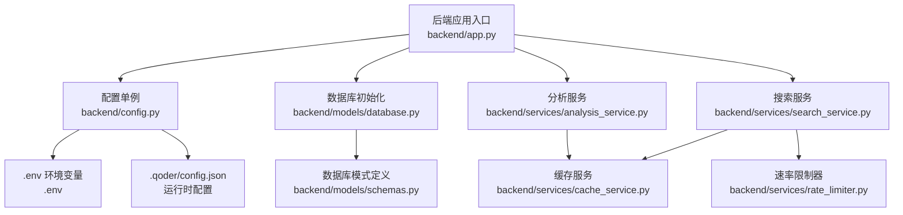
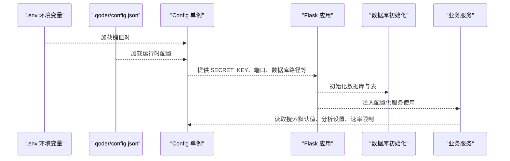
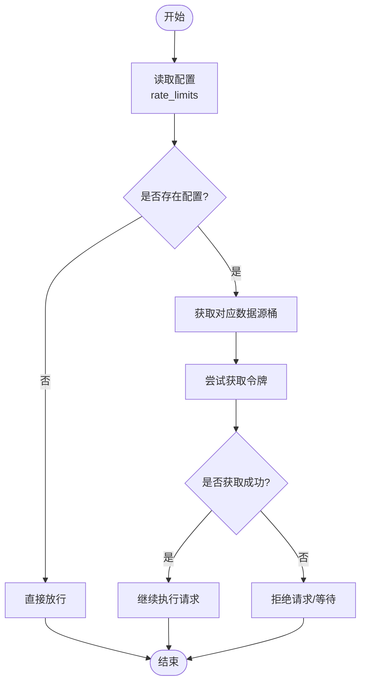
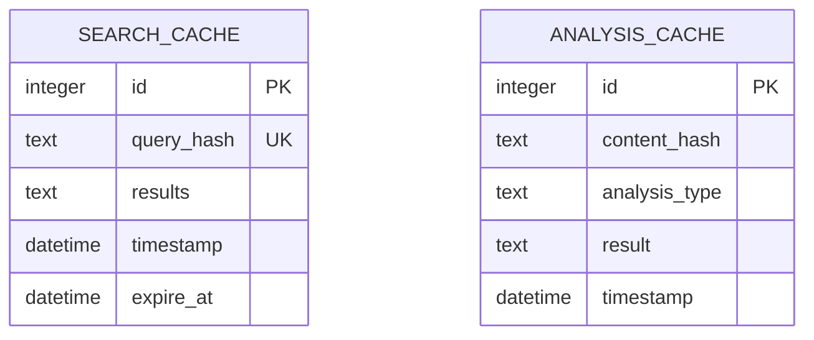
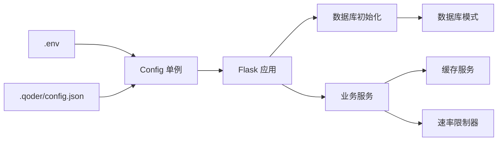

# 配置管理系统

<cite>
**本文档引用的文件**
- [backend/config.py](file://backend/config.py)
- [.qoder/config.json](file://.qoder/config.json)
- [.env](file://.env)
- [.env.example](file://.env.example)
- [backend/app.py](file://backend/app.py)
- [backend/services/rate_limiter.py](file://backend/services/rate_limiter.py)
- [backend/services/cache_service.py](file://backend/services/cache_service.py)
- [backend/models/database.py](file://backend/models/database.py)
- [backend/models/schemas.py](file://backend/models/schemas.py)
- [backend/services/search_service.py](file://backend/services/search_service.py)
- [backend/services/analysis_service.py](file://backend/services/analysis_service.py)
- [run.sh](file://run.sh)
- [README.md](file://README.md)
</cite>

## 目录
1. [简介](#简介)
2. [项目结构](#项目结构)
3. [核心组件](#核心组件)
4. [架构总览](#架构总览)
5. [详细组件分析](#详细组件分析)
6. [依赖关系分析](#依赖关系分析)
7. [性能考量](#性能考量)
8. [故障排除指南](#故障排除指南)
9. [结论](#结论)
10. [附录](#附录)

## 简介
本文件系统性阐述该配置管理系统的实现与使用，覆盖配置加载机制、环境变量处理、JSON配置合并策略、配置验证流程，以及后端配置、AI提供商配置、速率限制配置、缓存配置的具体实现。文档还解释了配置优先级、默认值设置、运行时配置更新的可行性与限制、配置安全性考虑，并提供配置文件示例、环境变量设置指南与常见问题排查方法。

## 项目结构
配置系统围绕后端应用入口与配置单例展开，结合 .env 环境变量与 .qoder/config.json 运行时配置，形成“环境变量优先 + JSON 合并”的双层配置体系。数据库初始化与表结构定义位于 models 层，缓存与速率限制分别由独立服务模块实现。

图表来源
- [backend/app.py](file://backend/app.py#L21-L67)
- [backend/config.py](file://backend/config.py#L15-L78)
- [.env](file://.env#L1-L22)
- [.qoder/config.json](file://.qoder/config.json#L1-L31)
- [backend/models/database.py](file://backend/models/database.py#L36-L43)
- [backend/models/schemas.py](file://backend/models/schemas.py#L1-L38)
- [backend/services/search_service.py](file://backend/services/search_service.py#L28-L67)
- [backend/services/analysis_service.py](file://backend/services/analysis_service.py#L25-L90)
- [backend/services/cache_service.py](file://backend/services/cache_service.py#L28-L86)
- [backend/services/rate_limiter.py](file://backend/services/rate_limiter.py#L45-L74)

章节来源
- [backend/app.py](file://backend/app.py#L21-L67)
- [backend/config.py](file://backend/config.py#L15-L78)
- [.env](file://.env#L1-L22)
- [.qoder/config.json](file://.qoder/config.json#L1-L31)
- [backend/models/database.py](file://backend/models/database.py#L36-L43)
- [backend/models/schemas.py](file://backend/models/schemas.py#L1-L38)

## 核心组件
- 配置单例 Config：负责加载 .env 与 .qoder/config.json，合并为统一配置对象；提供 Flask、数据库、AI提供商、HTTP代理、下载目录、速率限制、搜索默认值、下载设置、分析设置等字段。
- 应用入口 create_app：读取配置并注入 Flask 应用，注册蓝图，设置静态资源与CORS。
- 数据库层：根据配置初始化数据库路径与表结构，提供线程本地连接与上下文管理。
- 缓存服务：基于 SQLite 的搜索与分析缓存，支持过期清理。
- 速率限制器：基于令牌桶算法的多源限流，支持默认与自定义配置。

章节来源
- [backend/config.py](file://backend/config.py#L15-L78)
- [backend/app.py](file://backend/app.py#L21-L67)
- [backend/models/database.py](file://backend/models/database.py#L11-L43)
- [backend/services/cache_service.py](file://backend/services/cache_service.py#L11-L103)
- [backend/services/rate_limiter.py](file://backend/services/rate_limiter.py#L5-L74)

## 架构总览
配置加载与使用的关键流程如下：

图表来源
- [backend/config.py](file://backend/config.py#L15-L78)
- [backend/app.py](file://backend/app.py#L21-L67)
- [backend/models/database.py](file://backend/models/database.py#L36-L43)
- [backend/services/search_service.py](file://backend/services/search_service.py#L40-L61)
- [backend/services/analysis_service.py](file://backend/services/analysis_service.py#L32-L43)

## 详细组件分析

### 配置加载机制与优先级
- 加载顺序
  - 优先加载 .env 中的键值对，作为系统默认来源。
  - 读取 .qoder/config.json 作为运行时配置源，用于覆盖或扩展部分行为。
- 合并策略
  - 对于简单字段（如数据库路径、下载目录、Flask参数），采用“环境变量优先”的策略，若未设置则使用默认值。
  - 对于复杂结构（如搜索默认值、分析设置、下载设置、速率限制），以 .qoder/config.json 为主，未提供的键使用硬编码默认值。
- 默认值设置
  - Flask：开发/生产模式、端口、调试开关。
  - 数据库：默认相对路径 data/search.db。
  - AI提供商：默认为空字符串（需显式配置）。
  - HTTP代理：默认为空字符串（可选）。
  - 下载目录：默认 data/downloads。
  - 搜索默认值：包含最大结果数、超时秒数、缓存过期间隔、默认数据源等。
  - 下载设置：包含并发下载数与镜像列表。
  - 分析设置：包含提供商、模型名、最大内容长度、温度、缓存过期天数等。
- 运行时配置更新
  - 当前实现为单例初始化一次，不支持动态热更新。若需变更，需重启应用以重新加载配置。

章节来源
- [backend/config.py](file://backend/config.py#L20-L78)
- [.qoder/config.json](file://.qoder/config.json#L1-L31)
- [.env](file://.env#L1-L22)

### 环境变量处理
- .env 示例与实际文件
  - .env.example 提供字段模板，run.sh 在缺失时自动复制并提示编辑。
  - .env 由 Config 类在初始化时加载，键名与用途详见示例文件。
- 关键环境变量
  - API 密钥：ZHIPU_API_KEY、DEEPSEEK_API_KEY。
  - Flask：SECRET_KEY、FLASK_ENV、FLASK_PORT。
  - 存储：DATABASE_PATH、DOWNLOAD_DIR。
  - 网络：HTTP_PROXY、HTTPS_PROXY。
- 安全性
  - README 强调 .env 包含敏感信息，应纳入忽略清单，避免提交至版本控制。

章节来源
- [.env.example](file://.env.example#L1-L21)
- [.env](file://.env#L1-L22)
- [run.sh](file://run.sh#L39-L44)
- [README.md](file://README.md#L340-L345)

### JSON 配置合并策略
- 合并范围
  - 速率限制：来自 .qoder/config.json 的 rate_limits 字段，未提供时为空字典。
  - 搜索默认值：来自 search_defaults，未提供时使用硬编码默认值。
  - 下载设置：来自 download_settings，未提供时使用硬编码默认值。
  - 分析设置：来自 analysis_settings，未提供时使用硬编码默认值。
- 未提供的键
  - 采用硬编码默认值，确保服务可用性与一致性。

章节来源
- [backend/config.py](file://backend/config.py#L50-L73)
- [.qoder/config.json](file://.qoder/config.json#L1-L31)

### 配置验证流程
- 配置读取阶段
  - Config 初始化时完成字段赋值与目录创建，未进行显式的字段校验。
- 运行时验证
  - 服务层在使用配置时进行必要检查（例如搜索接口要求查询词非空；分析接口要求内容非空）。
- 建议改进
  - 在 Config 初始化阶段增加字段类型与取值范围校验，提前暴露配置错误。

章节来源
- [backend/config.py](file://backend/config.py#L20-L78)
- [backend/routes/search.py](file://backend/routes/search.py#L15-L17)
- [backend/routes/analysis.py](file://backend/routes/analysis.py#L15-L17)

### 后端配置
- Flask 参数
  - SECRET_KEY、FLASK_ENV、FLASK_PORT、DEBUG。
- 静态资源与CORS
  - 应用入口根据环境设置静态目录与CORS允许来源。
- 日志
  - 使用统一的日志器，便于集中输出与排查。

章节来源
- [backend/config.py](file://backend/config.py#L29-L33)
- [backend/app.py](file://backend/app.py#L21-L67)
- [backend/utils/logger.py](file://backend/utils/logger.py#L5-L22)

### AI 提供商配置
- 配置位置
  - .qoder/config.json 的 analysis_settings.provider 指定提供商（zhipu 或 deepseek）。
- 使用方式
  - 服务层通过代理模块调用对应提供商的模型，配置中的模型名与温度等参数由代理层读取。
- 安全与密钥
  - API 密钥通过 .env 注入，Config 类读取后供代理层使用。

章节来源
- [.qoder/config.json](file://.qoder/config.json#L22-L29)
- [backend/services/analysis_service.py](file://backend/services/analysis_service.py#L16-L22)
- [backend/config.py](file://backend/config.py#L38-L42)

### 速率限制配置
- 配置来源
  - .qoder/config.json 的 rate_limits 字段定义各数据源的容量与补充速率。
- 实现机制
  - 令牌桶算法：每个数据源维护一个桶，按补充速率恢复令牌，获取令牌成功才允许请求。
  - 默认配置：若未提供特定数据源，则视为无限制。
- 使用方式
  - 服务层在发起外部请求前调用限流器获取令牌，超时则拒绝请求。

图表来源
- [backend/config.py](file://backend/config.py#L50-L51)
- [backend/services/rate_limiter.py](file://backend/services/rate_limiter.py#L45-L74)

章节来源
- [backend/config.py](file://backend/config.py#L50-L51)
- [backend/services/rate_limiter.py](file://backend/services/rate_limiter.py#L5-L74)

### 缓存配置
- 缓存类型
  - 搜索缓存：按查询参数生成哈希键，支持按小时过期。
  - 分析缓存：按内容与分析类型生成哈希键，支持按天过期。
- 存储介质
  - 使用 SQLite 表存储缓存条目，包含唯一键、结果内容与过期时间戳。
- 清理策略
  - 提供过期清理函数，定期删除过期条目，保持数据库整洁。

图表来源
- [backend/models/schemas.py](file://backend/models/schemas.py#L10-L26)

章节来源
- [backend/services/cache_service.py](file://backend/services/cache_service.py#L11-L103)
- [backend/models/schemas.py](file://backend/models/schemas.py#L10-L26)

### 数据库配置
- 初始化流程
  - 根据配置创建数据库目录与数据库文件，执行模式定义脚本创建表。
- 连接管理
  - 线程本地连接，启用 WAL 模式、忙等待与外键约束，提升并发与一致性。
- 历史表
  - 搜索历史表用于记录查询、过滤条件与结果数量。

章节来源
- [backend/models/database.py](file://backend/models/database.py#L36-L43)
- [backend/models/schemas.py](file://backend/models/schemas.py#L2-L8)

## 依赖关系分析

图表来源
- [backend/config.py](file://backend/config.py#L15-L78)
- [backend/app.py](file://backend/app.py#L21-L67)
- [backend/models/database.py](file://backend/models/database.py#L36-L43)
- [backend/models/schemas.py](file://backend/models/schemas.py#L1-L38)
- [backend/services/cache_service.py](file://backend/services/cache_service.py#L11-L103)
- [backend/services/rate_limiter.py](file://backend/services/rate_limiter.py#L45-L74)

章节来源
- [backend/config.py](file://backend/config.py#L15-L78)
- [backend/app.py](file://backend/app.py#L21-L67)
- [backend/models/database.py](file://backend/models/database.py#L36-L43)

## 性能考量
- 缓存命中率
  - 搜索与分析均提供缓存，合理设置过期时间可显著降低重复计算与外部请求。
- 速率限制
  - 令牌桶算法可平滑突发流量，避免触发外部服务限流。
- 数据库优化
  - WAL 模式与索引有助于提升并发读写性能。
- 并发与超时
  - 搜索默认超时与最大结果数可平衡响应时间与结果质量。

## 故障排除指南
- 环境变量未生效
  - 确认 .env 是否存在且键名正确；run.sh 会在缺失时复制示例文件并提示编辑。
- API 密钥无效
  - 检查 .env 中的 ZHIPU_API_KEY 或 DEEPSEEK_API_KEY 是否填写；确认提供商配置与代理模块一致。
- 速率限制导致请求失败
  - 检查 .qoder/config.json 的 rate_limits 配置；适当提高容量或降低请求频率。
- 缓存异常
  - 确认数据库表存在且可写；必要时执行缓存清理逻辑。
- 数据库连接问题
  - 检查 DATABASE_PATH 权限与磁盘空间；确认初始化脚本执行成功。
- 日志定位
  - 使用统一日志器输出错误堆栈，结合后端日志快速定位问题。

章节来源
- [run.sh](file://run.sh#L39-L44)
- [.env](file://.env#L1-L22)
- [.qoder/config.json](file://.qoder/config.json#L1-L31)
- [backend/services/cache_service.py](file://backend/services/cache_service.py#L91-L103)
- [backend/models/database.py](file://backend/models/database.py#L36-L43)
- [backend/utils/logger.py](file://backend/utils/logger.py#L5-L22)

## 结论
该配置管理系统通过“环境变量优先 + JSON 合并”的双层设计，实现了灵活而可控的配置管理。配合令牌桶限流与两级缓存，系统在性能与稳定性方面具备良好表现。建议在未来增强配置校验与动态更新能力，进一步提升运维效率与安全性。

## 附录

### 配置文件示例与说明
- .env 示例与字段说明
  - 参考示例文件，包含 API 密钥、Flask 参数、存储路径与可选代理配置。
- .qoder/config.json 示例与字段说明
  - rate_limits：各数据源的容量与补充速率。
  - search_defaults：搜索最大结果数、超时秒数、缓存过期小时数、默认数据源。
  - download_settings：下载目录、并发数与镜像列表。
  - analysis_settings：提供商、模型名、最大内容长度、温度、缓存过期天数。

章节来源
- [.env.example](file://.env.example#L1-L21)
- [.qoder/config.json](file://.qoder/config.json#L1-L31)
- [README.md](file://README.md#L299-L336)

### 环境变量设置指南
- 快速开始
  - 复制示例文件并编辑：参考示例命令。
  - 填写 API 密钥与 Flask 参数。
- 安全建议
  - 不要将 .env 提交至版本控制；生产环境建议使用密钥管理服务。

章节来源
- [run.sh](file://run.sh#L39-L44)
- [README.md](file://README.md#L340-L345)