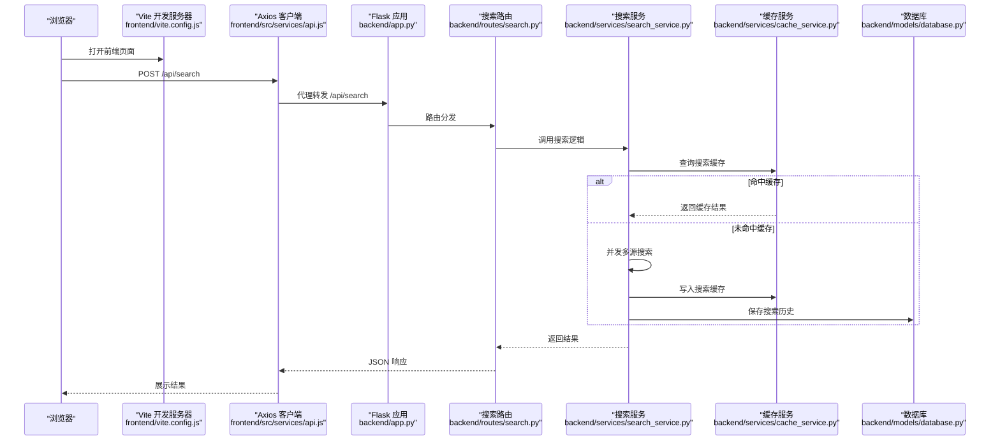
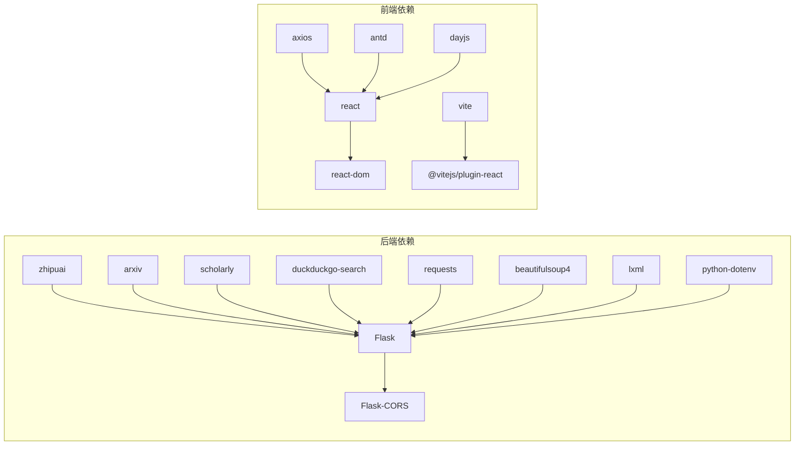

# 快速开始

<cite>
**本文引用的文件**
- [README.md](file://README.md)
- [run.sh](file://run.sh)
- [.env.example](file://.env.example)
- [backend/requirements.txt](file://backend/requirements.txt)
- [frontend/package.json](file://frontend/package.json)
- [.qoder/config.json](file://.qoder/config.json)
- [backend/config.py](file://backend/config.py)
- [backend/app.py](file://backend/app.py)
- [backend/models/schemas.py](file://backend/models/schemas.py)
- [backend/routes/search.py](file://backend/routes/search.py)
- [backend/services/search_service.py](file://backend/services/search_service.py)
- [backend/utils/logger.py](file://backend/utils/logger.py)
- [frontend/vite.config.js](file://frontend/vite.config.js)
- [frontend/src/services/api.js](file://frontend/src/services/api.js)
- [frontend/src/hooks/useSearch.js](file://frontend/src/hooks/useSearch.js)
- [frontend/src/components/SearchBar.jsx](file://frontend/src/components/SearchBar.jsx)
- [backend/models/database.py](file://backend/models/database.py)
</cite>

## 目录
1. [简介](#简介)
2. [项目结构](#项目结构)
3. [核心组件](#核心组件)
4. [架构总览](#架构总览)
5. [详细组件分析](#详细组件分析)
6. [依赖关系分析](#依赖关系分析)
7. [性能注意事项](#性能注意事项)
8. [故障排查指南](#故障排查指南)
9. [结论](#结论)
10. [附录](#附录)

## 简介
本指南面向首次接触“Search Is All You Need”项目的用户，帮助你在30分钟内完成环境准备、依赖安装、配置与启动，并理解开发与生产两种运行模式。项目提供一键启动脚本与手动安装两种方式；支持两种主流大模型提供商（智谱/DeepSeek）；内置多数据源聚合搜索、AI内容分析、PDF下载与搜索历史等功能。

## 项目结构
项目采用前后端分离架构，后端基于Flask提供REST API，前端基于React/Vite构建，数据库使用SQLite（WAL模式）。配置通过环境变量与.qoder配置文件共同完成。

```mermaid
graph TB
subgraph "后端"
APP["Flask 应用<br/>backend/app.py"]
CFG["配置加载<br/>backend/config.py"]
DB["数据库初始化<br/>backend/models/database.py"]
ROUTES["路由注册<br/>backend/routes/*"]
SRV["业务服务<br/>backend/services/*"]
MODELS["数据模型/表结构<br/>backend/models/schemas.py"]
end
subgraph "前端"
VITE["开发服务器/Vite<br/>frontend/vite.config.js"]
API["API 客户端<br/>frontend/src/services/api.js"]
HOOKS["搜索状态钩子<br/>frontend/src/hooks/useSearch.js"]
UI["搜索组件<br/>frontend/src/components/SearchBar.jsx"]
end
subgraph "配置"
ENV[".env 环境变量<br/>.env.example"]
QCFG[".qoder/config.json<br/>运行时配置"]
end
VITE --> API
API --> APP
APP --> CFG
APP --> DB
APP --> ROUTES
ROUTES --> SRV
SRV --> MODELS
CFG <-- ENV
CFG <-- QCFG
```

图表来源
- [backend/app.py](file://backend/app.py#L21-L67)
- [backend/config.py](file://backend/config.py#L15-L78)
- [backend/models/database.py](file://backend/models/database.py#L36-L43)
- [backend/routes/search.py](file://backend/routes/search.py#L10-L27)
- [backend/services/search_service.py](file://backend/services/search_service.py#L28-L67)
- [frontend/vite.config.js](file://frontend/vite.config.js#L4-L19)
- [frontend/src/services/api.js](file://frontend/src/services/api.js#L4-L8)
- [frontend/src/hooks/useSearch.js](file://frontend/src/hooks/useSearch.js#L19-L50)
- [frontend/src/components/SearchBar.jsx](file://frontend/src/components/SearchBar.jsx#L12-L28)
- [.env.example](file://.env.example#L1-L21)
- [.qoder/config.json](file://.qoder/config.json#L1-L31)

章节来源
- [README.md](file://README.md#L376-L404)

## 核心组件
- 后端应用入口与静态资源托管：负责创建Flask应用、注册蓝图、CORS配置以及生产模式下的SPA静态文件回退。
- 配置系统：统一读取.env与.qoder/config.json，合并为运行时配置，包括数据库路径、下载目录、LLM提供商、速率限制、搜索默认值等。
- 数据库：SQLite WAL模式，初始化表结构，提供线程安全连接与上下文管理。
- 路由与服务：搜索路由调用搜索服务，搜索服务集成缓存、分类与历史记录。
- 前端：Vite开发服务器，代理/api到后端；Axios封装统一错误处理；React组件驱动交互。

章节来源
- [backend/app.py](file://backend/app.py#L21-L67)
- [backend/config.py](file://backend/config.py#L15-L78)
- [backend/models/database.py](file://backend/models/database.py#L36-L43)
- [backend/routes/search.py](file://backend/routes/search.py#L10-L27)
- [backend/services/search_service.py](file://backend/services/search_service.py#L28-L67)
- [frontend/vite.config.js](file://frontend/vite.config.js#L4-L19)
- [frontend/src/services/api.js](file://frontend/src/services/api.js#L4-L8)

## 架构总览
下面的序列图展示了从浏览器发起搜索请求到后端返回结果的完整流程，包括缓存命中与未命中的分支。



图表来源
- [frontend/vite.config.js](file://frontend/vite.config.js#L8-L13)
- [frontend/src/services/api.js](file://frontend/src/services/api.js#L10-L29)
- [backend/app.py](file://backend/app.py#L35-L39)
- [backend/routes/search.py](file://backend/routes/search.py#L10-L27)
- [backend/services/search_service.py](file://backend/services/search_service.py#L44-L67)
- [backend/models/database.py](file://backend/models/database.py#L36-L43)

## 详细组件分析

### 环境变量与配置
- 环境变量模板：复制示例文件后，需填写LLM提供商API密钥、Flask运行参数、数据库与下载目录路径，以及可选的HTTP代理。
- 运行时配置：.qoder/config.json定义了速率限制、搜索默认值、下载设置与AI分析设置（包括提供商与模型选择）。

章节来源
- [.env.example](file://.env.example#L1-L21)
- [.qoder/config.json](file://.qoder/config.json#L22-L29)
- [backend/config.py](file://backend/config.py#L38-L73)

### 一键启动脚本 run.sh
- 自动创建Python虚拟环境并安装后端依赖。
- 检测Node.js版本（>=18），如满足则安装并构建前端产物。
- 若缺少.env则从示例复制并提示编辑。
- 最终启动Flask应用。

章节来源
- [run.sh](file://run.sh#L9-L49)

### 手动安装流程
- 后端：创建虚拟环境、安装requirements.txt中的依赖（包含zhipuai、arxiv、requests、beautifulsoup4、lxml、python-dotenv等）。
- 前端：安装Node.js（>=18）、安装依赖并构建产物至dist目录。

章节来源
- [backend/requirements.txt](file://backend/requirements.txt#L1-L11)
- [frontend/package.json](file://frontend/package.json#L6-L10)

### 开发模式与生产模式
- 开发模式：启动后端（Flask调试模式），前端使用Vite开发服务器（端口5173），通过代理将/api转发到后端（5000）。
- 生产模式：先构建前端，再启动后端，后端以静态文件方式提供前端产物，根路径回退到index.html。

章节来源
- [README.md](file://README.md#L156-L183)
- [frontend/vite.config.js](file://frontend/vite.config.js#L6-L14)
- [backend/app.py](file://backend/app.py#L42-L59)

### 数据库与表结构
- 初始化数据库：创建搜索历史、搜索缓存、分析缓存、下载记录等表，并建立索引。
- 连接管理：线程本地连接、WAL模式、超时与外键约束开启。

章节来源
- [backend/models/schemas.py](file://backend/models/schemas.py#L1-L38)
- [backend/models/database.py](file://backend/models/database.py#L36-L43)

### 搜索流程与缓存
- 输入校验：查询关键词非空。
- 缓存键：基于查询词、数据源与过滤条件生成唯一键。
- 多源搜索：调用搜索代理并发执行，随后对每条结果进行分类。
- 缓存写入：根据配置的过期时间写入搜索缓存。
- 历史记录：将查询、过滤条件与结果数写入历史表。

章节来源
- [backend/routes/search.py](file://backend/routes/search.py#L10-L27)
- [backend/services/search_service.py](file://backend/services/search_service.py#L28-L67)

### 前端交互与API封装
- API拦截器：统一处理429、5xx、400与超时/网络错误，向用户展示友好提示。
- useSearch钩子：维护搜索状态、默认数据源、分类过滤与调用后端接口。
- 搜索栏组件：提供数据源勾选与回车触发搜索。

章节来源
- [frontend/src/services/api.js](file://frontend/src/services/api.js#L10-L29)
- [frontend/src/hooks/useSearch.js](file://frontend/src/hooks/useSearch.js#L19-L50)
- [frontend/src/components/SearchBar.jsx](file://frontend/src/components/SearchBar.jsx#L12-L28)

## 依赖关系分析
后端依赖主要分为：Web框架与跨域、LLM SDK、学术搜索SDK、HTTP与HTML解析、配置加载等；前端依赖React生态与Vite构建工具。



图表来源
- [backend/requirements.txt](file://backend/requirements.txt#L1-L11)
- [frontend/package.json](file://frontend/package.json#L11-L22)

章节来源
- [backend/requirements.txt](file://backend/requirements.txt#L1-L11)
- [frontend/package.json](file://frontend/package.json#L11-L22)

## 性能注意事项
- 首次搜索可能较慢，后续利用缓存显著提升响应速度。
- 建议避免同时勾选过多数据源，降低并发开销。
- AI分析会消耗LLM额度，合理设置温度与内容长度。
- SQLite使用WAL模式提升并发读写性能，注意磁盘空间与权限。

## 故障排查指南
- 搜索返回空结果
  - arXiv仅支持英文搜索。
  - Semantic Scholar API存在速率限制，系统会自动重试。
  - 查看后端日志定位具体错误。
- AI分析功能不可用
  - 确认已配置有效的API密钥。
  - 检查.qoder/config.json中的provider设置是否正确。
- PDF下载失败
  - arXiv服务器可能临时不可用。
  - 系统会自动尝试国内镜像。
- 前端无法访问后端API
  - 确认Vite代理已启用并将/api转发到后端。
  - 检查后端CORS配置是否允许开发服务器地址。
- 环境变量未生效
  - 确保复制.env.example为.env并正确填写。
  - 检查FLASK_ENV与FLASK_PORT是否符合预期。
- 数据库初始化异常
  - 确认DATABASE_PATH目录可写，SQLite文件具备相应权限。
- 代理配置无效
  - 在.env中设置HTTP_PROXY/HTTPS_PROXY，当前国内可直连搜索引擎一般无需代理。

章节来源
- [README.md](file://README.md#L361-L375)
- [frontend/vite.config.js](file://frontend/vite.config.js#L8-L13)
- [backend/app.py](file://backend/app.py#L32-L33)
- [.env.example](file://.env.example#L18-L20)
- [backend/config.py](file://backend/config.py#L44-L45)
- [backend/models/database.py](file://backend/models/database.py#L36-L43)

## 结论
按照本指南，你可以在30分钟内完成从零到运行的全流程：选择一种安装方式（一键或手动）、配置环境变量与LLM提供商、启动后端与前端、体验多源搜索与AI分析。遇到问题时，可依据故障排查指南快速定位并解决。

## 附录

### 环境要求与安装步骤
- 后端：Python 3.8+，安装requirements.txt中的依赖。
- 前端：Node.js >= 18，安装依赖并构建产物。
- 一键启动：执行run.sh，自动完成虚拟环境、依赖安装、前端构建与启动。

章节来源
- [README.md](file://README.md#L113-L155)
- [run.sh](file://run.sh#L9-L49)
- [backend/requirements.txt](file://backend/requirements.txt#L1-L11)
- [frontend/package.json](file://frontend/package.json#L6-L10)

### 环境变量与LLM提供商配置
- 在.env中填写ZHIPU_API_KEY或DEEPSEEK_API_KEY之一。
- 在.qoder/config.json中设置analysis_settings.provider为zhipu或deepseek，并指定对应模型名称。

章节来源
- [.env.example](file://.env.example#L1-L5)
- [.qoder/config.json](file://.qoder/config.json#L22-L29)

### 网络代理设置
- 如需通过代理访问外部服务，在.env中设置HTTP_PROXY/HTTPS_PROXY。
- 当前搜索引擎在国内可直接访问，一般无需代理。

章节来源
- [.env.example](file://.env.example#L18-L20)
- [README.md](file://README.md#L327-L336)

### 开发与生产模式启动
- 开发模式：后端+前端分别启动，前端通过代理访问后端。
- 生产模式：先构建前端，再启动后端，后端静态托管前端产物。

章节来源
- [README.md](file://README.md#L156-L183)
- [frontend/vite.config.js](file://frontend/vite.config.js#L6-L14)
- [backend/app.py](file://backend/app.py#L42-L59)