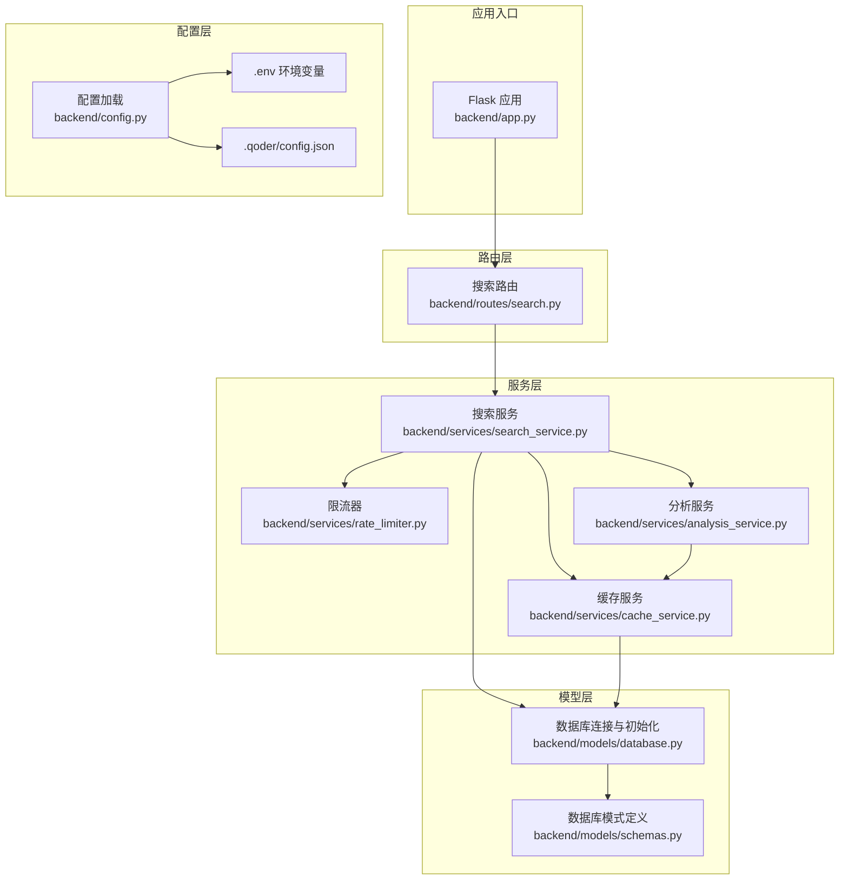
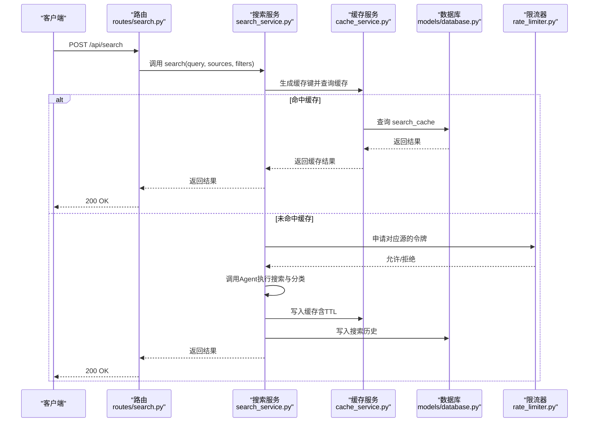
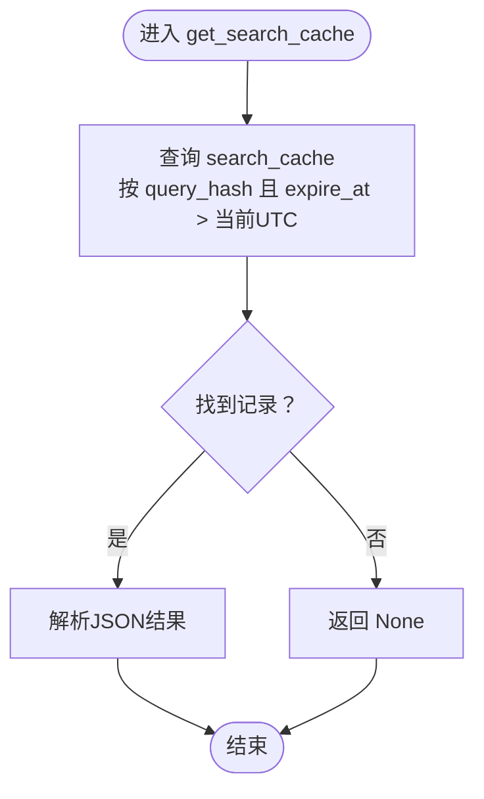
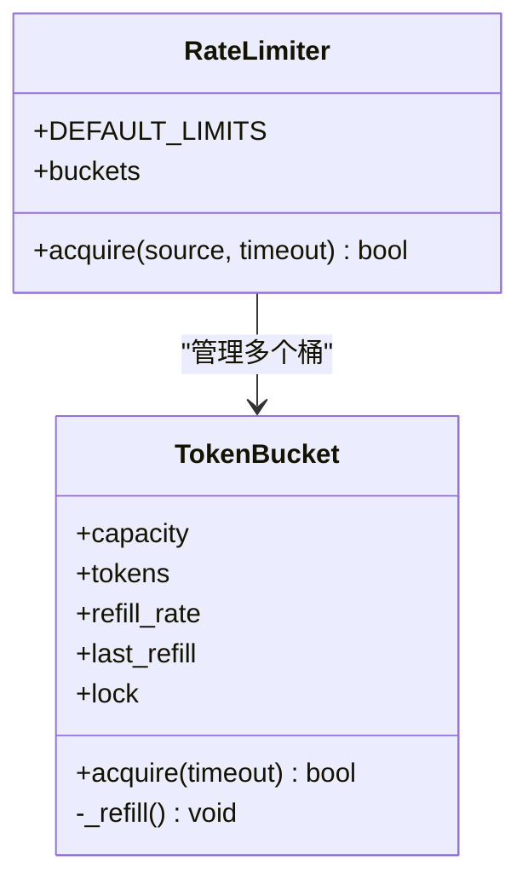
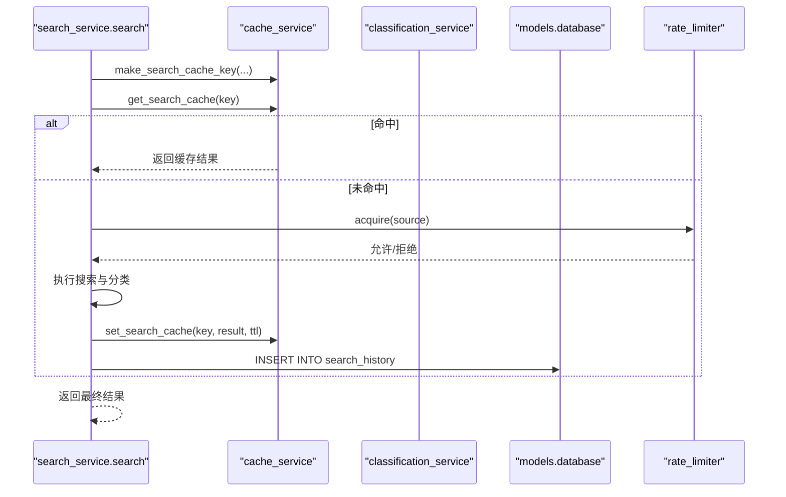
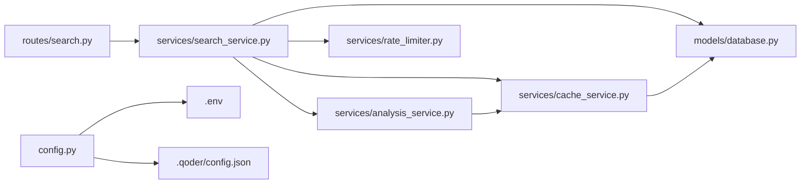

# 性能优化与缓存策略

<cite>
**本文引用的文件**
- [backend/services/cache_service.py](file://backend/services/cache_service.py)
- [backend/services/rate_limiter.py](file://backend/services/rate_limiter.py)
- [backend/services/search_service.py](file://backend/services/search_service.py)
- [backend/config.py](file://backend/config.py)
- [backend/models/database.py](file://backend/models/database.py)
- [backend/models/schemas.py](file://backend/models/schemas.py)
- [backend/routes/search.py](file://backend/routes/search.py)
- [backend/app.py](file://backend/app.py)
- [.qoder/config.json](file://.qoder/config.json)
- [.env](file://.env)
- [backend/utils/logger.py](file://backend/utils/logger.py)
- [backend/services/analysis_service.py](file://backend/services/analysis_service.py)
</cite>

## 目录
1. [简介](#简介)
2. [项目结构](#项目结构)
3. [核心组件](#核心组件)
4. [架构总览](#架构总览)
5. [详细组件分析](#详细组件分析)
6. [依赖关系分析](#依赖关系分析)
7. [性能考虑](#性能考虑)
8. [故障排查指南](#故障排查指南)
9. [结论](#结论)
10. [附录](#附录)

## 简介
本文件面向系统管理员与性能工程师，系统性阐述“Search Is All You Need”在缓存与速率控制方面的实现与优化策略。内容涵盖：
- 多级缓存架构：基于SQLite的搜索结果缓存与内容分析缓存
- 缓存键策略与TTL管理
- 缓存失效与清理机制
- 令牌桶算法实现与多源速率控制
- 性能监控指标、瓶颈分析方法与优化建议
- 缓存配置指南与性能调优技巧

## 项目结构
后端采用Flask应用，路由层负责请求接入，服务层封装业务逻辑（搜索、分析、缓存、限流），模型层负责数据库初始化与连接，配置层统一读取环境变量与.qoder配置。

图表来源
- [backend/app.py](file://backend/app.py#L21-L78)
- [backend/routes/search.py](file://backend/routes/search.py#L1-L28)
- [backend/services/search_service.py](file://backend/services/search_service.py#L1-L98)
- [backend/services/cache_service.py](file://backend/services/cache_service.py#L1-L104)
- [backend/services/rate_limiter.py](file://backend/services/rate_limiter.py#L1-L75)
- [backend/services/analysis_service.py](file://backend/services/analysis_service.py#L1-L48)
- [backend/models/database.py](file://backend/models/database.py#L1-L51)
- [backend/models/schemas.py](file://backend/models/schemas.py#L1-L38)
- [backend/config.py](file://backend/config.py#L1-L85)
- [.env](file://.env#L1-L22)
- [.qoder/config.json](file://.qoder/config.json#L1-L31)

章节来源
- [backend/app.py](file://backend/app.py#L21-L78)
- [backend/routes/search.py](file://backend/routes/search.py#L1-L28)
- [backend/services/search_service.py](file://backend/services/search_service.py#L1-L98)
- [backend/services/cache_service.py](file://backend/services/cache_service.py#L1-L104)
- [backend/services/rate_limiter.py](file://backend/services/rate_limiter.py#L1-L75)
- [backend/services/analysis_service.py](file://backend/services/analysis_service.py#L1-L48)
- [backend/models/database.py](file://backend/models/database.py#L1-L51)
- [backend/models/schemas.py](file://backend/models/schemas.py#L1-L38)
- [backend/config.py](file://backend/config.py#L1-L85)
- [.env](file://.env#L1-L22)
- [.qoder/config.json](file://.qoder/config.json#L1-L31)

## 核心组件
- 缓存服务：提供搜索结果与分析结果的缓存读写、过期判断与清理
- 限流器：基于令牌桶的多源并发控制
- 搜索服务：组合缓存、分类与历史记录，协调外部Agent执行搜索
- 配置中心：统一加载.env与.qoder配置，提供默认值与覆盖项
- 数据库层：线程本地连接、WAL模式、超时与外键设置

章节来源
- [backend/services/cache_service.py](file://backend/services/cache_service.py#L1-L104)
- [backend/services/rate_limiter.py](file://backend/services/rate_limiter.py#L1-L75)
- [backend/services/search_service.py](file://backend/services/search_service.py#L1-L98)
- [backend/config.py](file://backend/config.py#L1-L85)
- [backend/models/database.py](file://backend/models/database.py#L1-L51)

## 架构总览
下图展示一次搜索请求从路由到服务、缓存与数据库的完整流程，并标注限流与日志位置。

图表来源
- [backend/routes/search.py](file://backend/routes/search.py#L10-L28)
- [backend/services/search_service.py](file://backend/services/search_service.py#L28-L67)
- [backend/services/cache_service.py](file://backend/services/cache_service.py#L30-L52)
- [backend/models/database.py](file://backend/models/database.py#L24-L34)
- [backend/services/rate_limiter.py](file://backend/services/rate_limiter.py#L45-L75)

## 详细组件分析

### 多级缓存架构与实现
- 搜索结果缓存
  - 存储表：search_cache（唯一索引 query_hash）
  - 过期策略：expire_at 字段，查询时比较当前UTC时间
  - TTL：由配置决定，默认24小时
- 分析结果缓存
  - 存储表：analysis_cache（唯一索引 content_hash+analysis_type）
  - 过期策略：按记录创建时间计算是否超过7天
  - TTL：固定7天
- 缓存键策略
  - 搜索键：对查询、源列表、过滤器序列化后排序拼接再做MD5
  - 分析键：对内容前缀与类型拼接后做MD5
- 清理机制
  - 定时清理：删除过期的search_cache与analysis_cache记录
  - 日志记录：清理统计信息

图表来源
- [backend/services/cache_service.py](file://backend/services/cache_service.py#L30-L40)

章节来源
- [backend/services/cache_service.py](file://backend/services/cache_service.py#L16-L26)
- [backend/services/cache_service.py](file://backend/services/cache_service.py#L30-L52)
- [backend/services/cache_service.py](file://backend/services/cache_service.py#L57-L86)
- [backend/services/cache_service.py](file://backend/services/cache_service.py#L91-L104)
- [backend/models/schemas.py](file://backend/models/schemas.py#L10-L26)
- [backend/config.py](file://backend/config.py#L54-L59)

### 缓存键策略与TTL管理
- 键生成
  - 搜索键：对查询、源集合、过滤器字典进行稳定序列化，再取MD5
  - 分析键：对内容前缀与分析类型拼接后取MD5
- TTL
  - 搜索：通过配置项控制，默认24小时
  - 分析：固定7天
- 命中与未命中
  - 命中：直接返回缓存结果
  - 未命中：执行业务逻辑并写入缓存

章节来源
- [backend/services/cache_service.py](file://backend/services/cache_service.py#L16-L26)
- [backend/services/cache_service.py](file://backend/services/cache_service.py#L43-L52)
- [backend/services/cache_service.py](file://backend/services/cache_service.py#L78-L86)
- [backend/config.py](file://backend/config.py#L54-L73)

### 缓存失效与清理机制
- 搜索缓存：expire_at到期自动失效
- 分析缓存：按记录时间超过7天清理
- 清理触发：定期执行清理函数，删除过期记录并输出统计日志

章节来源
- [backend/services/cache_service.py](file://backend/services/cache_service.py#L91-L104)

### 令牌桶算法与多源速率控制
- 令牌桶
  - 线程安全：使用锁保护令牌增减
  - 动态补给：根据上次补给到现在的时间差按速率补充
  - 获取阻塞：在超时时间内循环尝试直至获得令牌或超时
- 多源限流
  - 每个数据源维护独立桶
  - 支持配置覆盖默认限流参数
  - 未配置的源视为无限制

图表来源
- [backend/services/rate_limiter.py](file://backend/services/rate_limiter.py#L5-L43)
- [backend/services/rate_limiter.py](file://backend/services/rate_limiter.py#L45-L75)

章节来源
- [backend/services/rate_limiter.py](file://backend/services/rate_limiter.py#L1-L75)
- [.qoder/config.json](file://.qoder/config.json#L2-L7)
- [backend/config.py](file://backend/config.py#L50-L51)

### 搜索服务与缓存集成
- 请求处理
  - 生成缓存键并查询缓存
  - 命中则直接返回；未命中则执行搜索与分类
  - 将结果写入缓存（含TTL）
  - 记录搜索历史
- 并发与线程安全
  - 使用线程本地数据库连接，避免跨线程共享连接
  - 限流器在服务层调用以控制外部源访问频率

图表来源
- [backend/services/search_service.py](file://backend/services/search_service.py#L28-L67)
- [backend/services/cache_service.py](file://backend/services/cache_service.py#L16-L26)
- [backend/services/cache_service.py](file://backend/services/cache_service.py#L30-L52)
- [backend/services/classification_service.py](file://backend/services/classification_service.py#L30-L64)
- [backend/models/database.py](file://backend/models/database.py#L24-L34)
- [backend/services/rate_limiter.py](file://backend/services/rate_limiter.py#L64-L74)

章节来源
- [backend/services/search_service.py](file://backend/services/search_service.py#L28-L67)
- [backend/services/classification_service.py](file://backend/services/classification_service.py#L30-L64)

### 数据库与连接池特性
- 线程本地连接：每个线程持有独立连接，避免并发竞争
- WAL模式：提升并发读写性能
- 超时与外键：设置忙等待超时与启用外键约束
- 初始化：启动时按模式脚本创建表

章节来源
- [backend/models/database.py](file://backend/models/database.py#L11-L21)
- [backend/models/database.py](file://backend/models/database.py#L24-L34)
- [backend/models/database.py](file://backend/models/database.py#L36-L43)
- [backend/models/schemas.py](file://backend/models/schemas.py#L1-L38)

### 配置与环境变量
- 配置来源
  - .env：Flask运行参数、数据库路径、下载目录、代理等
  - .qoder/config.json：限流参数、搜索默认值、下载设置、分析设置
- 关键配置项
  - SEARCH_DEFAULTS：max_results_per_source、timeout_seconds、cache_expire_hours、default_sources
  - ANALYSIS_SETTINGS：max_content_length、temperature、cache_expire_days
  - RATE_LIMITS：各源容量与补充速率

章节来源
- [.env](file://.env#L1-L22)
- [.qoder/config.json](file://.qoder/config.json#L1-L31)
- [backend/config.py](file://backend/config.py#L50-L73)

## 依赖关系分析
- 组件耦合
  - search_service依赖cache_service、classification_service、config、models.database
  - cache_service依赖models.database与utils.logger
  - rate_limiter独立于业务逻辑，可被任意服务调用
- 外部依赖
  - Flask路由与蓝图
  - SQLite作为本地存储
  - .qoder配置与环境变量

图表来源
- [backend/routes/search.py](file://backend/routes/search.py#L1-L28)
- [backend/services/search_service.py](file://backend/services/search_service.py#L1-L98)
- [backend/services/cache_service.py](file://backend/services/cache_service.py#L1-L104)
- [backend/services/analysis_service.py](file://backend/services/analysis_service.py#L1-L48)
- [backend/services/rate_limiter.py](file://backend/services/rate_limiter.py#L1-L75)
- [backend/models/database.py](file://backend/models/database.py#L1-L51)
- [backend/config.py](file://backend/config.py#L1-L85)
- [.env](file://.env#L1-L22)
- [.qoder/config.json](file://.qoder/config.json#L1-L31)

## 性能考虑
- 缓存命中率
  - 搜索键稳定性：确保相同查询参数生成一致键，提高命中率
  - TTL设置：根据业务热点调整搜索缓存TTL，平衡新鲜度与性能
- 数据库性能
  - 索引：search_cache与analysis_cache均建立唯一索引，加速查找
  - WAL模式：提升并发读写吞吐
  - 连接管理：线程本地连接减少锁竞争
- 限流策略
  - 按源限流：不同源的访问速率差异较大，应依据实际API配额与SLA调整
  - 超时控制：令牌获取超时避免请求长时间阻塞
- I/O与序列化
  - 结果JSON序列化：确保非ASCII字符正确编码
  - 内容截断：分析键对长内容做前缀截断，降低键长度与哈希碰撞概率

章节来源
- [backend/models/schemas.py](file://backend/models/schemas.py#L10-L26)
- [backend/models/database.py](file://backend/models/database.py#L11-L21)
- [backend/services/cache_service.py](file://backend/services/cache_service.py#L16-L26)
- [backend/services/cache_service.py](file://backend/services/cache_service.py#L43-L52)
- [backend/services/rate_limiter.py](file://backend/services/rate_limiter.py#L27-L42)

## 故障排查指南
- 缓存相关
  - 缓存未命中：检查缓存键生成是否一致、TTL是否过短、数据库连接是否正常
  - 缓存清理频繁：确认清理周期与过期阈值设置
- 限流相关
  - 请求被拒绝：检查源的容量与补充速率配置，适当增大或放宽超时
- 数据库相关
  - 连接异常：确认WAL模式与busy_timeout设置，避免长时间锁等待
- 日志定位
  - 使用统一logger输出调试信息，结合应用日志快速定位问题

章节来源
- [backend/utils/logger.py](file://backend/utils/logger.py#L5-L23)
- [backend/services/cache_service.py](file://backend/services/cache_service.py#L91-L104)
- [backend/services/rate_limiter.py](file://backend/services/rate_limiter.py#L64-L74)
- [backend/models/database.py](file://backend/models/database.py#L11-L21)

## 结论
本系统通过SQLite本地缓存与令牌桶限流实现了轻量而高效的性能优化方案。搜索与分析双通道缓存配合合理的TTL与清理策略，显著降低了重复请求成本；多源限流保障了对外部API的合规访问。建议在生产环境中结合业务热点动态调整TTL与限流参数，并持续监控缓存命中率与数据库负载，以获得最佳性能表现。

## 附录

### 缓存配置指南
- 搜索缓存
  - TTL：通过配置项控制，默认24小时
  - 建议：热点查询可缩短TTL以保证新鲜度；低频查询可延长TTL
- 分析缓存
  - TTL：固定7天
  - 建议：对长文本摘要与翻译场景适当提高命中率
- 缓存键
  - 搜索键：包含查询、源集合、过滤器；保持参数顺序稳定
  - 分析键：内容前缀+类型；注意长度控制

章节来源
- [backend/config.py](file://backend/config.py#L54-L73)
- [backend/services/cache_service.py](file://backend/services/cache_service.py#L16-L26)
- [backend/services/cache_service.py](file://backend/services/cache_service.py#L57-L86)

### 性能调优技巧
- 提升缓存命中率
  - 规范化输入参数，避免多余空格与顺序差异
  - 对高频查询增加TTL，对实时性要求高的查询缩短TTL
- 数据库优化
  - 使用WAL模式与合适的busy_timeout
  - 合理拆分查询，避免大事务
- 限流调优
  - 基于实际API配额与延迟特征调整容量与补充速率
  - 设置合理超时，避免请求堆积

章节来源
- [backend/models/database.py](file://backend/models/database.py#L11-L21)
- [backend/services/rate_limiter.py](file://backend/services/rate_limiter.py#L8-L18)
- [backend/services/rate_limiter.py](file://backend/services/rate_limiter.py#L20-L42)

### 资源使用优化策略
- 连接复用：线程本地连接减少上下文切换
- I/O批处理：批量清理过期缓存，降低碎片化
- 日志级别：生产环境适度降低日志级别，减少I/O开销

章节来源
- [backend/models/database.py](file://backend/models/database.py#L8-L21)
- [backend/utils/logger.py](file://backend/utils/logger.py#L5-L23)
- [backend/services/cache_service.py](file://backend/services/cache_service.py#L91-L104)