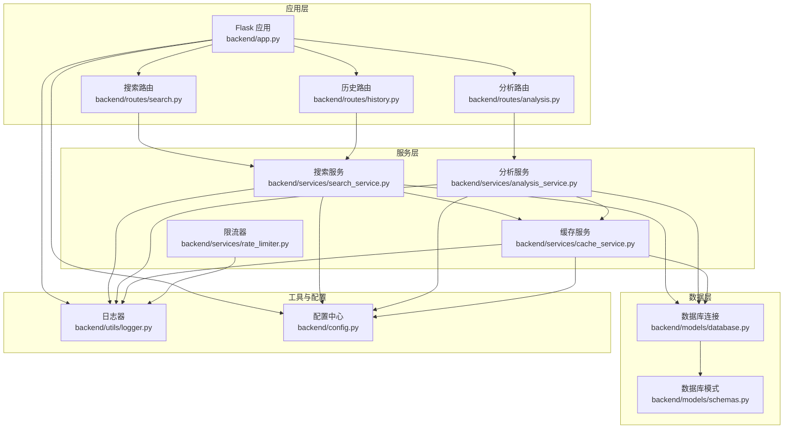
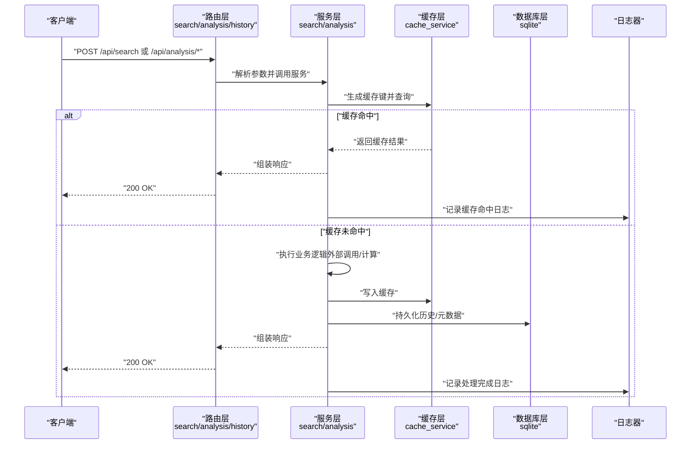
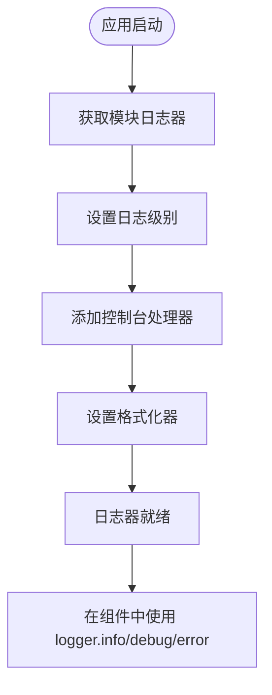
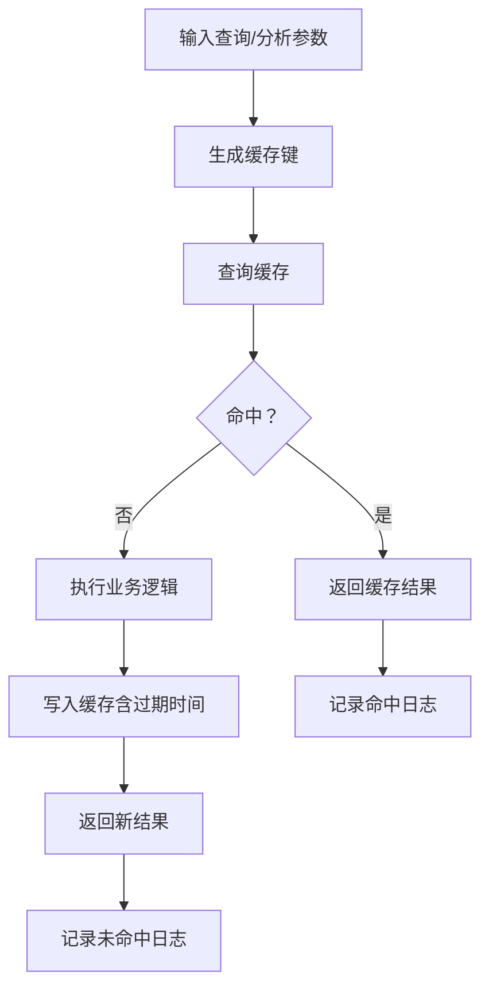
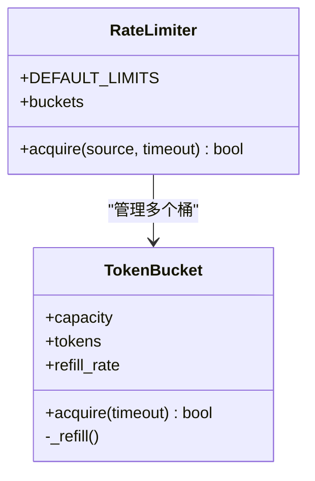
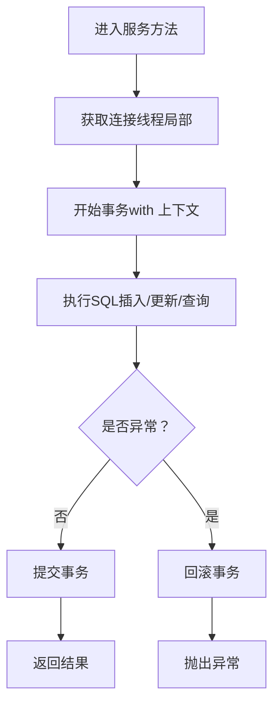
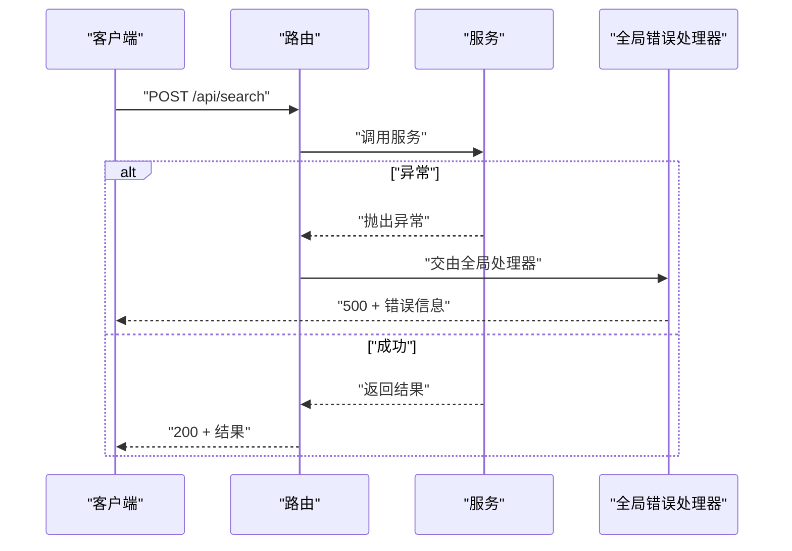
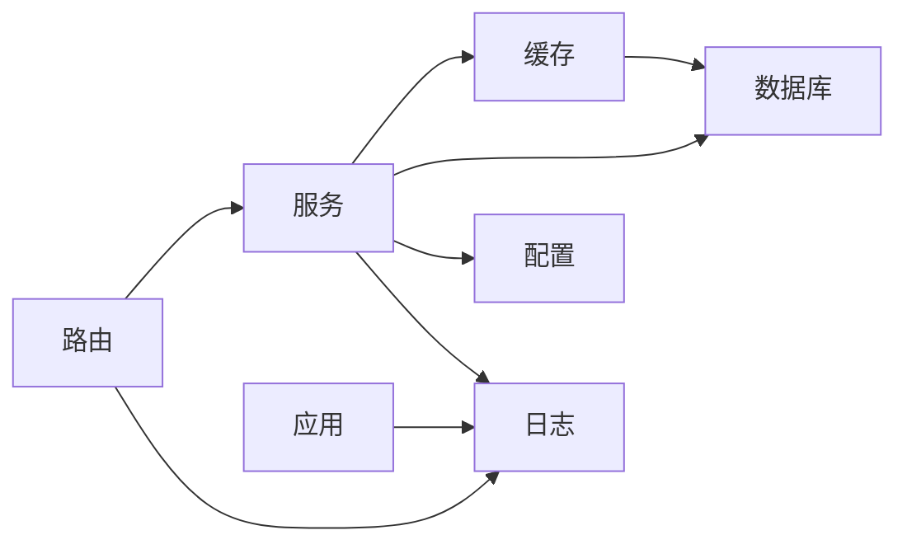

# 性能监控与优化

<cite>
**本文引用的文件**
- [backend/app.py](file://backend/app.py)
- [backend/utils/logger.py](file://backend/utils/logger.py)
- [backend/services/cache_service.py](file://backend/services/cache_service.py)
- [backend/services/rate_limiter.py](file://backend/services/rate_limiter.py)
- [backend/config.py](file://backend/config.py)
- [backend/routes/search.py](file://backend/routes/search.py)
- [backend/routes/analysis.py](file://backend/routes/analysis.py)
- [backend/routes/history.py](file://backend/routes/history.py)
- [backend/models/database.py](file://backend/models/database.py)
- [backend/models/schemas.py](file://backend/models/schemas.py)
- [backend/services/search_service.py](file://backend/services/search_service.py)
- [backend/services/analysis_service.py](file://backend/services/analysis_service.py)
- [backend/test_integration.py](file://backend/test_integration.py)
- [run.sh](file://run.sh)
- [.env.example](file://.env.example)
</cite>

## 目录
1. [简介](#简介)
2. [项目结构](#项目结构)
3. [核心组件](#核心组件)
4. [架构总览](#架构总览)
5. [详细组件分析](#详细组件分析)
6. [依赖关系分析](#依赖关系分析)
7. [性能考虑](#性能考虑)
8. [故障排查指南](#故障排查指南)
9. [结论](#结论)
10. [附录](#附录)

## 简介
本文件面向运维工程师与性能工程师，系统化梳理 Search Is All You Need 的性能监控与优化实践。内容涵盖日志记录体系、性能指标采集与监控告警、瓶颈识别方法、性能分析工具与优化建议，并给出缓存命中率、API 响应时间与资源使用跟踪方案，以及基准测试、负载测试与容量规划指南。

## 项目结构
后端采用 Flask 应用，前端通过静态资源提供单页应用（SPA）。核心模块包括：
- 应用入口与路由：Flask 蓝图注册、CORS 配置、全局错误处理
- 服务层：搜索、分析、缓存、限流、历史管理
- 数据层：SQLite 数据库初始化、连接池与事务控制
- 工具层：统一日志器
- 配置层：环境变量与 .qoder/config.json 合并配置

图表来源
- [backend/app.py](file://backend/app.py#L21-L78)
- [backend/routes/search.py](file://backend/routes/search.py#L1-L28)
- [backend/routes/analysis.py](file://backend/routes/analysis.py#L1-L66)
- [backend/routes/history.py](file://backend/routes/history.py#L1-L33)
- [backend/services/search_service.py](file://backend/services/search_service.py#L1-L98)
- [backend/services/analysis_service.py](file://backend/services/analysis_service.py#L1-L91)
- [backend/services/cache_service.py](file://backend/services/cache_service.py#L1-L104)
- [backend/services/rate_limiter.py](file://backend/services/rate_limiter.py#L1-L75)
- [backend/models/database.py](file://backend/models/database.py#L1-L51)
- [backend/models/schemas.py](file://backend/models/schemas.py#L1-L38)
- [backend/utils/logger.py](file://backend/utils/logger.py#L1-L23)
- [backend/config.py](file://backend/config.py#L1-L85)

章节来源
- [backend/app.py](file://backend/app.py#L1-L78)
- [backend/config.py](file://backend/config.py#L1-L85)

## 核心组件
- 日志系统：统一日志器，按模块输出结构化日志，便于性能分析与问题定位
- 缓存体系：基于 SQLite 的搜索与分析结果缓存，带过期清理与命中调试日志
- 限流机制：基于令牌桶的多源限流，支持线程安全与可配置速率
- 数据库：SQLite 连接池（线程局部）、WAL 模式、超时与外键约束
- 配置中心：合并 .env 与 .qoder/config.json，集中管理运行参数

章节来源
- [backend/utils/logger.py](file://backend/utils/logger.py#L1-L23)
- [backend/services/cache_service.py](file://backend/services/cache_service.py#L1-L104)
- [backend/services/rate_limiter.py](file://backend/services/rate_limiter.py#L1-L75)
- [backend/models/database.py](file://backend/models/database.py#L1-L51)
- [backend/config.py](file://backend/config.py#L1-L85)

## 架构总览
下图展示请求从路由到服务再到缓存与数据库的整体流程，以及关键性能点（缓存命中、限流、数据库事务）：

图表来源
- [backend/routes/search.py](file://backend/routes/search.py#L1-L28)
- [backend/routes/analysis.py](file://backend/routes/analysis.py#L1-L66)
- [backend/services/search_service.py](file://backend/services/search_service.py#L1-L98)
- [backend/services/analysis_service.py](file://backend/services/analysis_service.py#L1-L91)
- [backend/services/cache_service.py](file://backend/services/cache_service.py#L1-L104)
- [backend/models/database.py](file://backend/models/database.py#L1-L51)
- [backend/utils/logger.py](file://backend/utils/logger.py#L1-L23)

## 详细组件分析

### 日志记录系统
- 统一日志器：按模块名创建 logger，设置格式与输出到标准输出，避免重复处理器
- 使用范围：应用入口、各路由、服务层、缓存层均有日志输出，便于串联调用链
- 建议：生产环境可接入结构化日志收集（如 JSON），并区分级别（info/debug/warning/error）

图表来源
- [backend/utils/logger.py](file://backend/utils/logger.py#L1-L23)
- [backend/app.py](file://backend/app.py#L18-L65)
- [backend/routes/search.py](file://backend/routes/search.py#L6)
- [backend/services/search_service.py](file://backend/services/search_service.py#L13)

章节来源
- [backend/utils/logger.py](file://backend/utils/logger.py#L1-L23)
- [backend/app.py](file://backend/app.py#L18-L65)

### 缓存体系与命中率监控
- 缓存类型：搜索结果缓存（按查询参数哈希+过期时间）、分析结果缓存（按内容哈希+类型+过期时间）
- 命中日志：命中与写入均输出调试日志，便于统计命中率
- 清理策略：定期删除过期条目（搜索缓存按小时过期；分析缓存按天过期）
- 指标建议：统计“缓存命中数/总请求数”、“平均缓存响应时间（命中）vs. 未命中）”

图表来源
- [backend/services/cache_service.py](file://backend/services/cache_service.py#L16-L86)
- [backend/services/search_service.py](file://backend/services/search_service.py#L44-L67)
- [backend/services/analysis_service.py](file://backend/services/analysis_service.py#L32-L43)

章节来源
- [backend/services/cache_service.py](file://backend/services/cache_service.py#L1-L104)
- [backend/services/search_service.py](file://backend/services/search_service.py#L44-L67)
- [backend/services/analysis_service.py](file://backend/services/analysis_service.py#L32-L43)

### 限流与并发控制
- 实现：令牌桶（TokenBucket）+ RateLimiter（多源独立桶）
- 配置：默认针对不同数据源设定容量与补充速率，支持从配置覆盖
- 行为：阻塞等待直至获得令牌或超时；线程安全
- 建议：结合业务峰值与下游能力，动态调整容量与补充速率；对异常源进行熔断

图表来源
- [backend/services/rate_limiter.py](file://backend/services/rate_limiter.py#L1-L75)

章节来源
- [backend/services/rate_limiter.py](file://backend/services/rate_limiter.py#L1-L75)
- [backend/config.py](file://backend/config.py#L50-L53)

### 数据库与事务
- 连接模型：线程局部连接、自动提交/回滚、WAL 模式、超时与外键开启
- 事务边界：服务层使用上下文管理器包裹数据库操作，异常自动回滚
- 建议：对热点表建立索引（已建索引见模式定义）；监控锁等待与慢查询

图表来源
- [backend/models/database.py](file://backend/models/database.py#L24-L34)
- [backend/models/schemas.py](file://backend/models/schemas.py#L1-L38)

章节来源
- [backend/models/database.py](file://backend/models/database.py#L1-L51)
- [backend/models/schemas.py](file://backend/models/schemas.py#L1-L38)

### API 路由与错误处理
- 路由职责：搜索、分析（摘要/翻译/论文分析）、历史查询与清空
- 错误处理：全局异常捕获并记录，返回统一错误响应
- 建议：为每个路由增加请求耗时埋点与状态码统计，便于 SLA 监控

图表来源
- [backend/routes/search.py](file://backend/routes/search.py#L10-L27)
- [backend/app.py](file://backend/app.py#L62-L65)

章节来源
- [backend/routes/search.py](file://backend/routes/search.py#L1-L28)
- [backend/routes/analysis.py](file://backend/routes/analysis.py#L1-L66)
- [backend/routes/history.py](file://backend/routes/history.py#L1-L33)
- [backend/app.py](file://backend/app.py#L62-L65)

## 依赖关系分析
- 组件耦合：路由依赖服务；服务依赖缓存与数据库；缓存依赖数据库；服务依赖配置；日志贯穿全链路
- 外部依赖：Flask、flask-cors、sqlite3、dotenv、.qoder 目录下的配置与智能体
- 潜在风险：服务层对智能体的懒加载可能带来首次延迟；数据库为单机 SQLite，需关注并发与磁盘 IO

图表来源
- [backend/app.py](file://backend/app.py#L10-L39)
- [backend/services/search_service.py](file://backend/services/search_service.py#L1-L98)
- [backend/services/analysis_service.py](file://backend/services/analysis_service.py#L1-L91)
- [backend/services/cache_service.py](file://backend/services/cache_service.py#L1-L104)
- [backend/models/database.py](file://backend/models/database.py#L1-L51)
- [backend/config.py](file://backend/config.py#L1-L85)
- [backend/utils/logger.py](file://backend/utils/logger.py#L1-L23)

章节来源
- [backend/app.py](file://backend/app.py#L10-L39)
- [backend/config.py](file://backend/config.py#L1-L85)

## 性能考虑

### 指标与监控
- 缓存命中率
  - 计算方式：命中次数 / 总请求次数
  - 来源：缓存读取日志（命中/未命中）
  - 建议：按接口维度拆分（搜索/分析），按内容长度/类型细分
- API 响应时间
  - 建议：在路由层或中间件埋点，记录请求进入与返回时间，区分 2xx/4xx/5xx
  - 关键指标：P50/P90/P99 响应时间、吞吐量（req/sec）
- 资源使用
  - CPU/内存：容器/主机监控（如 cgroups、top、htop）
  - 磁盘 IO：I/O 等待、队列长度、每请求 IO 字节数
  - 网络：并发连接数、带宽占用、上游服务 RTT

### 瓶颈识别方法
- 自顶向下：先看整体吞吐与错误率，再逐层深入（路由→服务→缓存→数据库→IO）
- 并发放大：观察高并发下数据库锁等待、缓存未命中率上升、外部服务限流
- 首次延迟：智能体懒加载导致的冷启动延迟，可通过预热缓解
- I/O 热点：高频写入缓存/历史表，检查索引与批量写入策略

### 优化建议
- 缓存优化
  - 提升命中率：扩大 TTL、减少键抖动、预热热点内容
  - 写入优化：批量写入、异步清理任务
- 数据库优化
  - 索引：热点查询字段已有索引；必要时新增复合索引
  - WAL：已启用 WAL，注意磁盘写入策略与 fsync 配置
  - 连接：线程局部连接已降低竞争，避免长事务
- 限流与弹性
  - 动态限流：根据下游健康度自适应调整
  - 熔断降级：对失败率/RTT异常的上游接口快速失败
- 外部依赖
  - 代理与网络：合理配置 HTTP_PROXY，避免跨域与 DNS 延迟
  - API 密钥与配额：监控调用频率与剩余额度，提前预警

### 性能基准测试
- 方法
  - 单接口压测：使用 wrk/ab/JMeter 对 /api/search 与 /api/analysis/* 分别施压
  - 场景覆盖：空缓存、满缓存、极限 TTL、大内容分析
  - 指标采集：响应时间分布、错误率、CPU/内存/IO
- 建议
  - 固定环境：相同硬件、相同 .env 配置、关闭 debug
  - 基线对比：记录不同配置（TTL、限流、并发）下的基线

### 负载测试策略
- 渐进式加压：从 10 并发到峰值，观察 P95/P99 与错误率拐点
- 混合场景：搜索 + 分析 + 历史查询混合流量
- 容量规划：以 P99 响应时间不超过阈值为目标，反推最大并发与资源配额

### 容量规划指南
- 评估维度：QPS、峰值并发、缓存命中率、数据库写入速率、磁盘写入速率
- 扩展策略：水平扩展（多实例 + 反向代理）、垂直扩展（CPU/内存/磁盘）、缓存扩容（Redis/Memcached）
- 风险预案：限流/熔断、降级开关、备份数据库

## 故障排查指南
- 常见问题
  - 500 错误：查看全局错误处理器日志，定位具体路由与服务异常
  - 缓存未命中：确认键生成一致性、TTL 设置、清理任务是否正常
  - 数据库锁/超时：检查事务时长、热点写入、索引缺失
  - 限流触发：核对限流配置与来源，必要时临时放宽
- 排查步骤
  - 快速验证：使用集成测试脚本验证基本功能
  - 日志定位：按模块过滤日志，串联请求链路
  - 压测复现：构造相似场景复现问题
  - 回归验证：修复后回归基准测试

章节来源
- [backend/app.py](file://backend/app.py#L62-L65)
- [backend/test_integration.py](file://backend/test_integration.py#L12-L97)

## 结论
本项目在日志、缓存、限流与数据库层面具备良好的性能基础。建议在现有基础上引入统一的指标埋点与可视化监控，完善缓存命中率与响应时间统计，结合压测与容量规划持续迭代，确保在高并发与复杂业务场景下的稳定性与可扩展性。

## 附录

### 配置项与性能相关要点
- 环境变量与 .qoder 配置合并，集中管理 API 密钥、端口、数据库路径、下载目录、代理等
- 搜索默认参数：每源最大结果数、超时秒数、缓存过期小时数、默认来源
- 分析默认参数：模型、最大内容长度、温度、缓存过期天数
- 限流配置：可从 .qoder/config.json 覆盖默认限流参数

章节来源
- [backend/config.py](file://backend/config.py#L15-L85)
- [.env.example](file://.env.example#L1-L21)

### 启动与部署提示
- 虚拟环境与依赖安装、前端构建（可选）、.env 初始化、Flask 启动
- 建议：生产环境使用 WSGI 服务器（如 gunicorn/uwsgi）与反向代理，开启 gzip/静态资源缓存

章节来源
- [run.sh](file://run.sh#L1-L50)