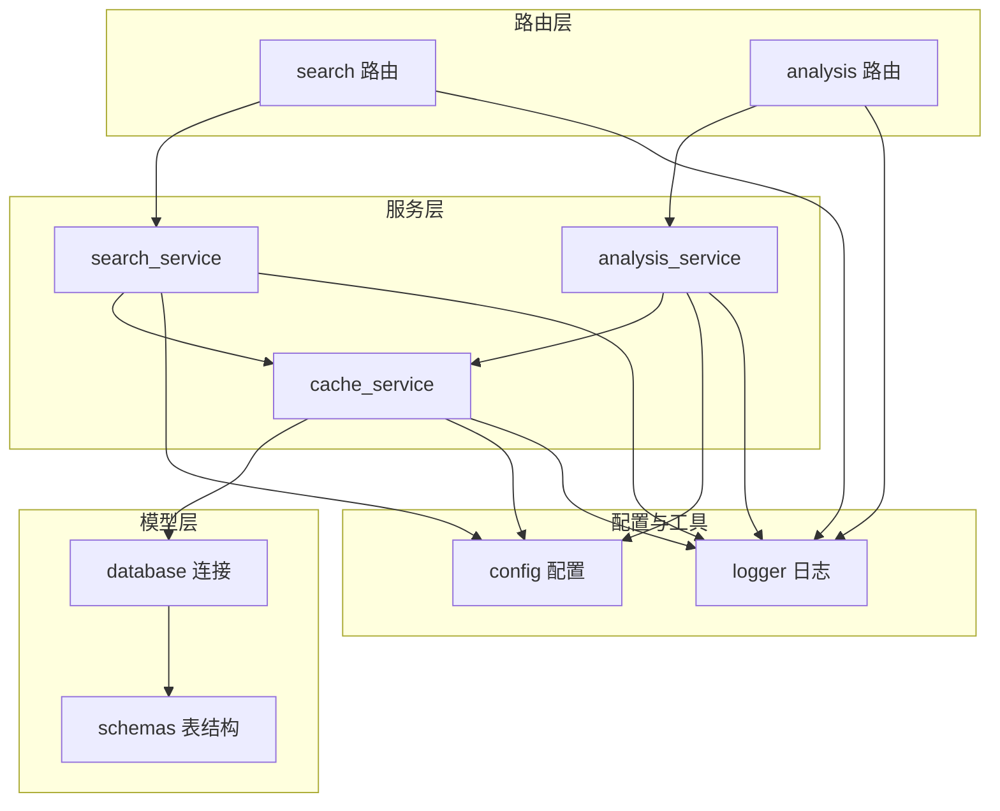
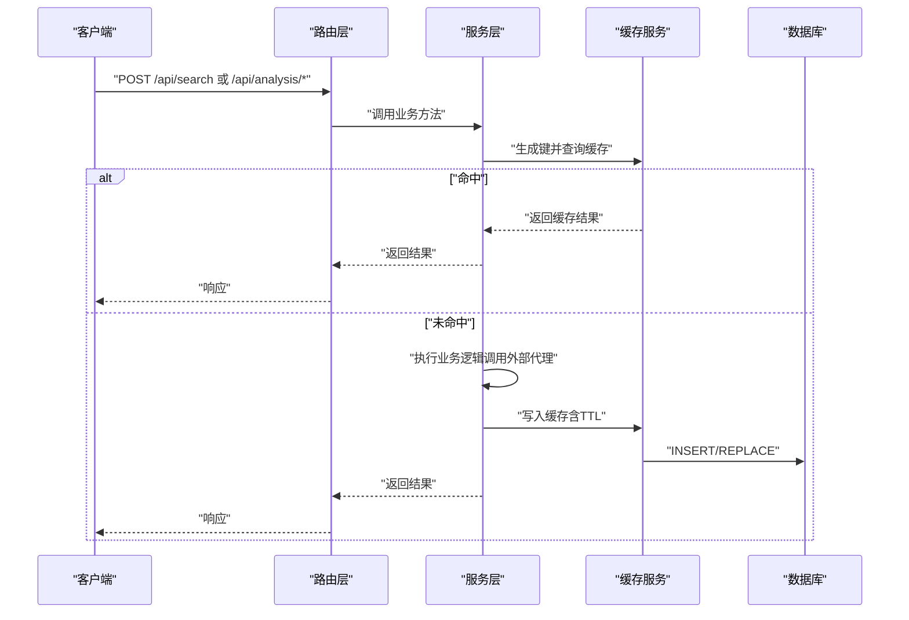
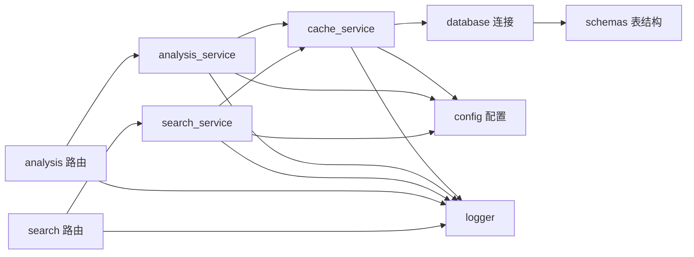

# 缓存策略设计

<cite>
**本文引用的文件**
- [backend/services/cache_service.py](file://backend/services/cache_service.py)
- [backend/services/search_service.py](file://backend/services/search_service.py)
- [backend/services/analysis_service.py](file://backend/services/analysis_service.py)
- [backend/models/schemas.py](file://backend/models/schemas.py)
- [backend/models/database.py](file://backend/models/database.py)
- [backend/config.py](file://backend/config.py)
- [.qoder/config.json](file://.qoder/config.json)
- [backend/routes/search.py](file://backend/routes/search.py)
- [backend/routes/analysis.py](file://backend/routes/analysis.py)
- [backend/app.py](file://backend/app.py)
- [backend/utils/logger.py](file://backend/utils/logger.py)
</cite>

## 目录
1. [简介](#简介)
2. [项目结构](#项目结构)
3. [核心组件](#核心组件)
4. [架构总览](#架构总览)
5. [详细组件分析](#详细组件分析)
6. [依赖关系分析](#依赖关系分析)
7. [性能考量](#性能考量)
8. [故障排查指南](#故障排查指南)
9. [结论](#结论)
10. [附录](#附录)

## 简介
本设计文档围绕 Search Is All You Need 的多级缓存架构展开，系统性阐述缓存键生成策略（MD5 哈希）、缓存分类（搜索缓存与分析缓存）的设计原理，以及 TTL 管理与失效策略。文档还覆盖缓存命中率优化、缓存清理机制、数据库索引设计，并提供缓存配置参数说明、性能调优建议与监控指标，最后给出开发者最佳实践与扩展指南。

## 项目结构
后端采用分层架构：路由层负责请求入口与错误处理；服务层封装业务逻辑（搜索、分析、缓存、限流等）；模型层负责数据库连接与表结构；配置层统一读取环境变量与 JSON 配置；工具层提供日志与通用能力。

图表来源
- [backend/routes/search.py](file://backend/routes/search.py#L1-L28)
- [backend/routes/analysis.py](file://backend/routes/analysis.py#L1-L66)
- [backend/services/search_service.py](file://backend/services/search_service.py#L1-L98)
- [backend/services/analysis_service.py](file://backend/services/analysis_service.py#L1-L91)
- [backend/services/cache_service.py](file://backend/services/cache_service.py#L1-L104)
- [backend/models/database.py](file://backend/models/database.py#L1-L51)
- [backend/models/schemas.py](file://backend/models/schemas.py#L1-L38)
- [backend/config.py](file://backend/config.py#L1-L85)
- [backend/utils/logger.py](file://backend/utils/logger.py#L1-L23)

章节来源
- [backend/app.py](file://backend/app.py#L1-L78)
- [backend/routes/search.py](file://backend/routes/search.py#L1-L28)
- [backend/routes/analysis.py](file://backend/routes/analysis.py#L1-L66)

## 核心组件
- 缓存服务：提供搜索缓存与分析缓存的键生成、读取、写入与过期清理。
- 搜索服务：在执行搜索前进行缓存查询，命中则直接返回，未命中则调用外部代理执行搜索并落盘缓存。
- 分析服务：对摘要、翻译、论文分析等分析任务进行缓存封装，按类型区分键空间。
- 数据库与模式：SQLite 存储缓存数据，定义搜索缓存与分析缓存表及索引。
- 配置中心：从 .env 与 .qoder/config.json 合并配置，提供 TTL、默认源、模型参数等。

章节来源
- [backend/services/cache_service.py](file://backend/services/cache_service.py#L1-L104)
- [backend/services/search_service.py](file://backend/services/search_service.py#L28-L67)
- [backend/services/analysis_service.py](file://backend/services/analysis_service.py#L25-L90)
- [backend/models/schemas.py](file://backend/models/schemas.py#L10-L26)
- [backend/config.py](file://backend/config.py#L50-L73)
- [.qoder/config.json](file://.qoder/config.json#L8-L29)

## 架构总览
下图展示从 API 请求到缓存与数据库的交互流程，包括缓存命中/未命中分支、TTL 到期判断与清理路径。

图表来源
- [backend/routes/search.py](file://backend/routes/search.py#L10-L27)
- [backend/routes/analysis.py](file://backend/routes/analysis.py#L10-L65)
- [backend/services/search_service.py](file://backend/services/search_service.py#L28-L67)
- [backend/services/analysis_service.py](file://backend/services/analysis_service.py#L25-L90)
- [backend/services/cache_service.py](file://backend/services/cache_service.py#L30-L86)

## 详细组件分析

### 缓存键生成策略（MD5 哈希）
- 搜索缓存键：对查询词、排序后的来源列表与过滤器字典进行序列化后生成 MD5 哈希，确保语义一致即键相同。
- 分析缓存键：对内容截断（前 2000 字符）与分析类型拼接后生成 MD5 哈希，避免超长内容导致键过长与索引膨胀。
- 设计要点：
  - 统一序列化顺序（sort_keys=True）保证不同字段顺序不影响键值。
  - 来源列表排序后参与计算，确保同构查询得到同一键。
  - 内容截断避免大文本影响缓存效率与存储。

章节来源
- [backend/services/cache_service.py](file://backend/services/cache_service.py#L11-L25)

### 缓存分类与职责边界
- 搜索缓存：面向多源聚合搜索结果，键空间与 TTL 可配置，适合高频重复查询场景。
- 分析缓存：面向摘要、翻译、论文分析等，按分析类型区分键空间，支持更长的保留周期（7 天）。

章节来源
- [backend/services/cache_service.py](file://backend/services/cache_service.py#L16-L25)
- [backend/services/analysis_service.py](file://backend/services/analysis_service.py#L32-L89)

### TTL 管理与失效策略
- 搜索缓存：基于绝对时间戳 expire_at，查询时比较当前 UTC 时间，未到期则命中；支持通过配置设置 TTL 小时数。
- 分析缓存：基于记录时间 timestamp，每次访问时计算与当前时间差，超过 7 天则删除并视为未命中；清理后自动回源重新计算。
- 清理机制：提供集中清理函数，定期删除过期条目，降低表膨胀与查询成本。

章节来源
- [backend/services/cache_service.py](file://backend/services/cache_service.py#L30-L52)
- [backend/services/cache_service.py](file://backend/services/cache_service.py#L57-L86)
- [backend/services/cache_service.py](file://backend/services/cache_service.py#L91-L103)
- [backend/config.py](file://backend/config.py#L54-L59)
- [backend/config.py](file://backend/config.py#L67-L73)
- [.qoder/config.json](file://.qoder/config.json#L11-L12)
- [.qoder/config.json](file://.qoder/config.json#L28-L28)

### 缓存命中率优化
- 键稳定性：统一序列化顺序与来源排序，减少“同义不同键”。
- 内容截断：分析键对输入内容截断，平衡命中率与存储开销。
- 类型隔离：分析键中加入类型后缀，避免不同类型混淆。
- 预热策略：对热点查询与热门内容可考虑启动时预填充缓存（需结合业务场景）。

章节来源
- [backend/services/cache_service.py](file://backend/services/cache_service.py#L16-L25)
- [backend/services/analysis_service.py](file://backend/services/analysis_service.py#L32-L89)

### 缓存清理机制
- 定时清理：提供清理函数，删除搜索缓存过期项与分析缓存超期项（基于 timestamp）。
- 自动清理：分析缓存命中过期项时同步删除，保持表整洁。
- 日志记录：清理操作会输出统计信息，便于运维观察。

章节来源
- [backend/services/cache_service.py](file://backend/services/cache_service.py#L91-L103)

### 数据库索引设计
- 搜索缓存：以 query_hash 为主键（UNIQUE），并建立索引，加速按键查找。
- 分析缓存：以 content_hash+analysis_type 复合键（UNIQUE），并建立 content_hash 索引，提升复合条件查询效率。
- 其他：search_history 表用于历史记录，schema 中已定义。

章节来源
- [backend/models/schemas.py](file://backend/models/schemas.py#L10-L26)

### 与业务流程的集成
- 搜索流程：路由接收请求 → 服务层生成键 → 查询缓存 → 未命中则调用代理执行 → 分类与落盘缓存 → 记录历史。
- 分析流程：路由接收请求 → 服务层生成键 → 查询缓存 → 未命中则调用代理执行 → 落盘缓存 → 返回结果。

章节来源
- [backend/routes/search.py](file://backend/routes/search.py#L10-L27)
- [backend/routes/analysis.py](file://backend/routes/analysis.py#L10-L65)
- [backend/services/search_service.py](file://backend/services/search_service.py#L28-L67)
- [backend/services/analysis_service.py](file://backend/services/analysis_service.py#L25-L90)

## 依赖关系分析
- 缓存服务依赖数据库连接与日志模块，负责键生成、读写与清理。
- 搜索/分析服务依赖缓存服务与配置中心，分别在业务层完成缓存调用与 TTL 设置。
- 数据库层提供线程本地连接、WAL 模式与外键约束，保障并发与一致性。
- 路由层仅负责参数校验与异常记录，不参与缓存逻辑。

图表来源
- [backend/routes/search.py](file://backend/routes/search.py#L1-L28)
- [backend/routes/analysis.py](file://backend/routes/analysis.py#L1-L66)
- [backend/services/search_service.py](file://backend/services/search_service.py#L1-L98)
- [backend/services/analysis_service.py](file://backend/services/analysis_service.py#L1-L91)
- [backend/services/cache_service.py](file://backend/services/cache_service.py#L1-L104)
- [backend/models/database.py](file://backend/models/database.py#L1-L51)
- [backend/models/schemas.py](file://backend/models/schemas.py#L1-L38)
- [backend/config.py](file://backend/config.py#L1-L85)
- [backend/utils/logger.py](file://backend/utils/logger.py#L1-L23)

章节来源
- [backend/app.py](file://backend/app.py#L11-L40)

## 性能考量
- 查询路径优化
  - 使用索引键精确匹配，避免全表扫描。
  - 搜索缓存使用绝对过期时间，查询时只需一次比较。
  - 分析缓存命中时即时判断过期，过期即删，避免脏数据传播。
- 存储与序列化
  - 结果以 JSON 文本存储，避免复杂对象序列化开销。
  - 分析键对内容截断，控制键长度与索引大小。
- 并发与事务
  - 线程本地连接与自动提交，减少锁竞争。
  - INSERT OR REPLACE 保证幂等更新，避免重复键冲突。
- 配置与调优
  - 搜索 TTL 默认 24 小时，可根据热点程度调整。
  - 分析 TTL 固定 7 天，适合长尾内容复用。
  - 可通过配置中心动态调整默认源与超时，间接影响缓存命中与回源频率。

章节来源
- [backend/services/cache_service.py](file://backend/services/cache_service.py#L30-L86)
- [backend/models/database.py](file://backend/models/database.py#L11-L21)
- [backend/config.py](file://backend/config.py#L54-L59)
- [backend/config.py](file://backend/config.py#L67-L73)
- [.qoder/config.json](file://.qoder/config.json#L11-L12)
- [.qoder/config.json](file://.qoder/config.json#L28-L28)

## 故障排查指南
- 缓存未命中
  - 检查键生成是否一致（序列化顺序、来源排序、内容截断）。
  - 确认 TTL 是否过短或过期被清理。
- 缓存命中但结果异常
  - 核对分析类型键后缀是否一致（如翻译目标语言）。
  - 检查内容截断是否导致关键信息丢失。
- 数据库问题
  - 确认表结构与索引存在，必要时重新初始化数据库。
  - 观察清理日志，确认过期项是否被及时删除。
- 日志定位
  - 缓存命中/写入均有调试日志，便于追踪键与 TTL。
  - 路由层捕获异常并记录，便于定位上游错误。

章节来源
- [backend/services/cache_service.py](file://backend/services/cache_service.py#L30-L86)
- [backend/utils/logger.py](file://backend/utils/logger.py#L5-L22)
- [backend/routes/search.py](file://backend/routes/search.py#L25-L27)
- [backend/routes/analysis.py](file://backend/routes/analysis.py#L23-L43)

## 结论
该多级缓存架构以 MD5 键稳定性和两类缓存的职责分离为核心，结合搜索与分析的不同 TTL 需求，实现了高命中率与低回源成本。通过索引优化、自动清理与配置中心，系统在易维护性与性能之间取得良好平衡。后续可在热点预热、监控埋点与清理策略自动化方面进一步增强。

## 附录

### 缓存配置参数说明
- 搜索默认配置
  - max_results_per_source：每源最大返回数量
  - timeout_seconds：请求超时秒数
  - cache_expire_hours：搜索缓存 TTL（小时）
  - default_sources：默认搜索源列表
- 分析默认配置
  - provider：分析模型提供商
  - zhipu_model / deepseek_model：模型名称
  - max_content_length：分析内容最大长度
  - temperature：采样温度
  - cache_expire_days：分析缓存 TTL（天）

章节来源
- [backend/config.py](file://backend/config.py#L54-L59)
- [backend/config.py](file://backend/config.py#L67-L73)
- [.qoder/config.json](file://.qoder/config.json#L8-L13)
- [.qoder/config.json](file://.qoder/config.json#L22-L29)

### 缓存监控指标建议
- 命中率
  - 搜索命中率 = 搜索缓存命中次数 / 搜索请求数
  - 分析命中率 = 分析缓存命中次数 / 分析请求数
- 延迟分布
  - 缓存命中延迟、回源延迟、总延迟
- 存储与清理
  - 缓存条目总数、过期清理数量、平均 TTL 剩余时间
- 错误与告警
  - 缓存写入失败、键生成异常、数据库连接失败

### 开发者最佳实践与扩展指南
- 键生成
  - 新增缓存类型时，确保键包含所有影响结果的参数，且序列化顺序固定。
  - 对超长输入进行截断或摘要，避免键过长。
- TTL 策略
  - 热点查询可适当延长 TTL，长尾内容缩短 TTL。
  - 分析类内容可按类型设置差异化 TTL。
- 清理与可观测性
  - 定期执行清理函数，或在业务空闲时段批量清理。
  - 在关键路径增加日志与指标埋点，持续观测命中率与延迟。
- 扩展方向
  - 引入 LRU/LFU 等淘汰策略，配合 TTL 实现更精细的容量管理。
  - 将缓存迁移到 Redis/Memcached 等内存数据库，提升并发与持久化能力。
  - 增加缓存预热与回源降级策略，提升可用性与稳定性。