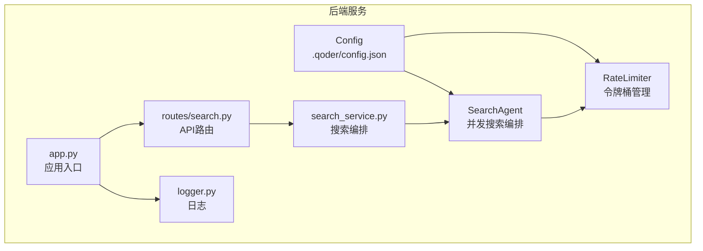
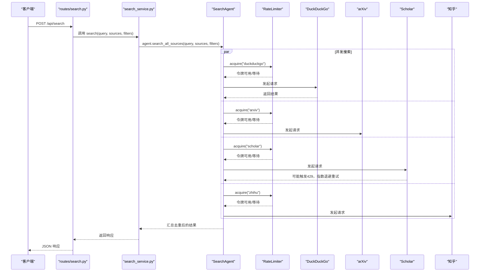
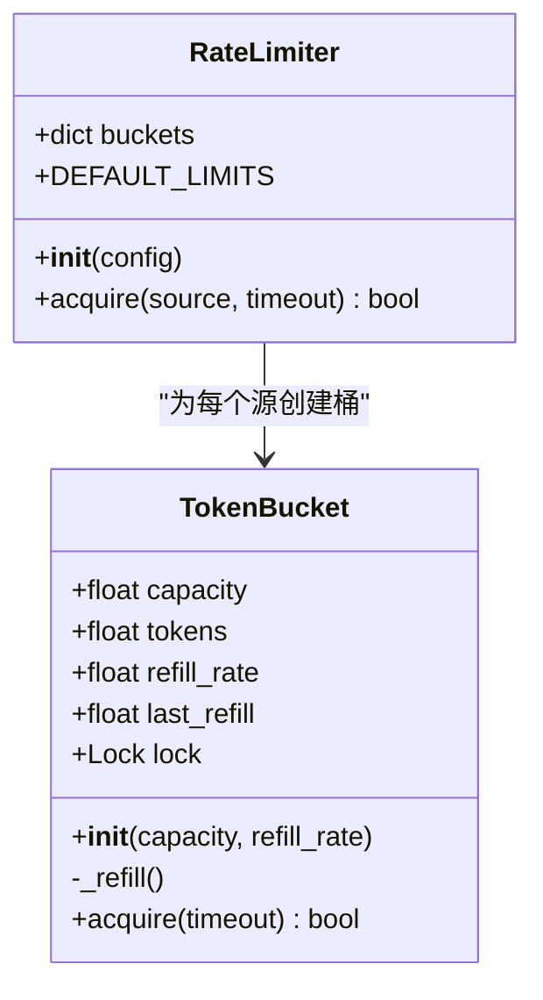
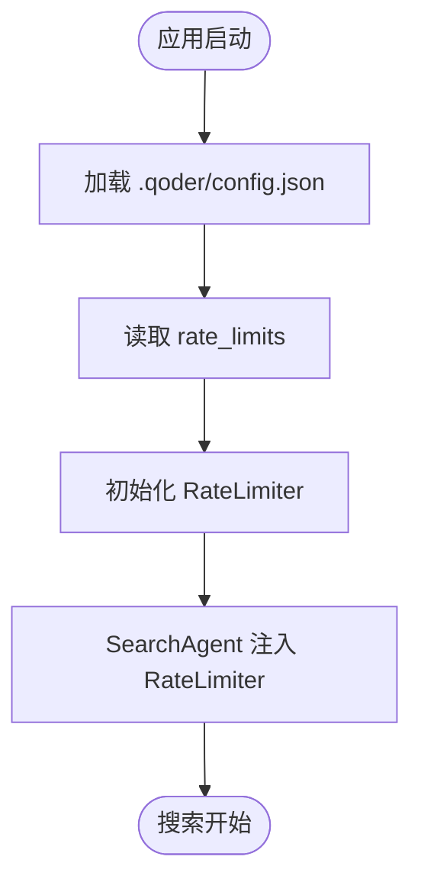
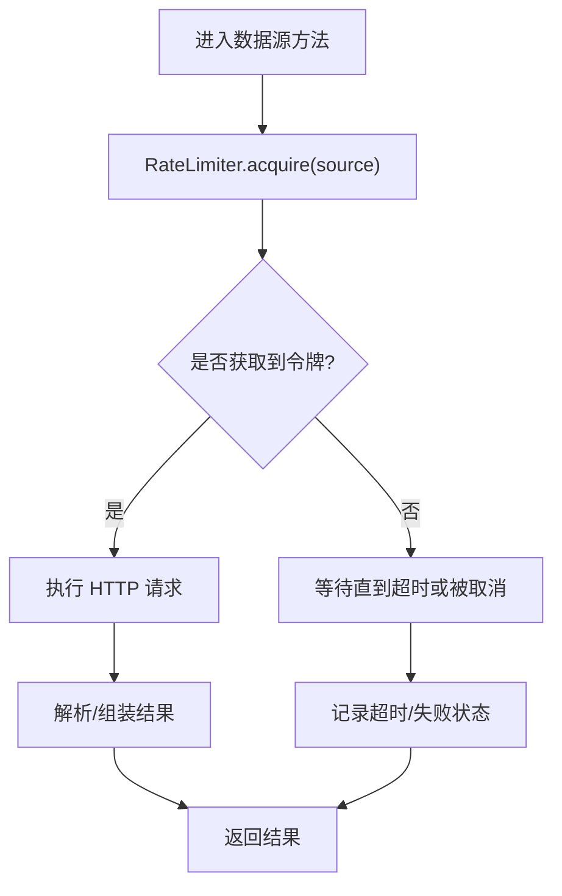
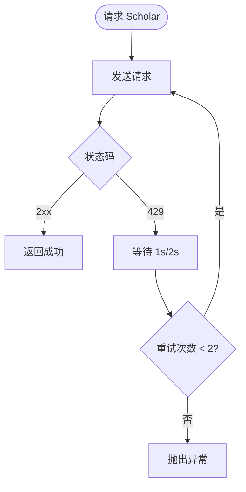
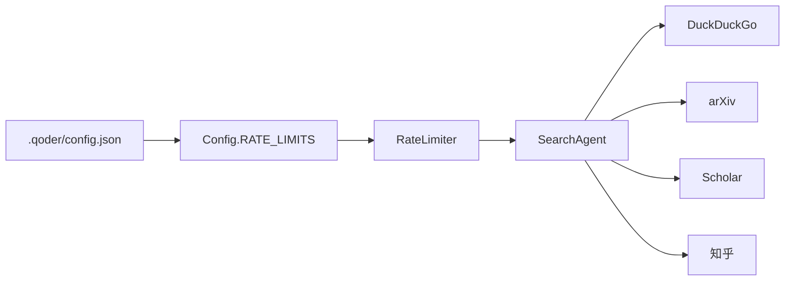

# 速率限制机制

<cite>
**本文引用的文件**
- [backend/services/rate_limiter.py](file://backend/services/rate_limiter.py)
- [.qoder/config.json](file://.qoder/config.json)
- [backend/config.py](file://backend/config.py)
- [backend/services/search_service.py](file://backend/services/search_service.py)
- [.qoder/agents/search_agent.py](file://.qoder/agents/search_agent.py)
- [backend/routes/search.py](file://backend/routes/search.py)
- [backend/app.py](file://backend/app.py)
- [backend/utils/logger.py](file://backend/utils/logger.py)
- [README.md](file://README.md)
</cite>

## 目录
1. [简介](#简介)
2. [项目结构](#项目结构)
3. [核心组件](#核心组件)
4. [架构总览](#架构总览)
5. [详细组件分析](#详细组件分析)
6. [依赖关系分析](#依赖关系分析)
7. [性能考量](#性能考量)
8. [故障排除指南](#故障排除指南)
9. [结论](#结论)
10. [附录](#附录)

## 简介
本文件系统性阐述 Search Is All You Need 的速率限制机制，重点覆盖：
- 令牌桶算法实现与多源速率控制策略
- 速率限制核心原理、令牌生成速率与桶容量管理
- 不同数据源（arXiv、DuckDuckGo、Google Scholar、知乎）的速率限制策略与AI API的速率控制
- 重试机制、退避策略与错误处理
- 速率限制配置指南、性能监控指标与故障排除方法
- 面向系统管理员的调优与监控专业参考

## 项目结构
围绕速率限制的关键文件与职责如下：
- 令牌桶与全局速率控制器：backend/services/rate_limiter.py
- 运行时配置加载与速率限制参数注入：backend/config.py、.qoder/config.json
- 搜索服务编排与并发执行：backend/services/search_service.py、.qoder/agents/search_agent.py
- API 路由入口：backend/routes/search.py
- 应用入口与日志：backend/app.py、backend/utils/logger.py
- 使用说明与配置示例：README.md

图表来源
- [backend/services/rate_limiter.py](file://backend/services/rate_limiter.py#L45-L74)
- [backend/config.py](file://backend/config.py#L50-L51)
- [.qoder/config.json](file://.qoder/config.json#L2-L7)
- [.qoder/agents/search_agent.py](file://.qoder/agents/search_agent.py#L24-L28)
- [backend/services/search_service.py](file://backend/services/search_service.py#L28-L67)
- [backend/routes/search.py](file://backend/routes/search.py#L10-L27)
- [backend/app.py](file://backend/app.py#L21-L67)
- [backend/utils/logger.py](file://backend/utils/logger.py#L5-L22)

章节来源
- [backend/services/rate_limiter.py](file://backend/services/rate_limiter.py#L1-L75)
- [backend/config.py](file://backend/config.py#L50-L51)
- [.qoder/config.json](file://.qoder/config.json#L1-L31)
- [.qoder/agents/search_agent.py](file://.qoder/agents/search_agent.py#L24-L28)
- [backend/services/search_service.py](file://backend/services/search_service.py#L28-L67)
- [backend/routes/search.py](file://backend/routes/search.py#L10-L27)
- [backend/app.py](file://backend/app.py#L21-L67)
- [backend/utils/logger.py](file://backend/utils/logger.py#L5-L22)

## 核心组件
- 令牌桶 TokenBucket：线程安全的单源速率限制器，基于时间差动态补充令牌，支持阻塞式获取与超时控制。
- 全局速率控制器 RateLimiter：为多个数据源维护独立的令牌桶实例，并提供统一的 acquire(source, timeout) 接口。
- 配置注入：Config 类从 .qoder/config.json 加载 rate_limits 参数，SearchAgent 在初始化时注入到 RateLimiter。
- 搜索编排：SearchAgent 并发调用各数据源搜索方法，每个数据源在发起请求前先申请令牌；同时对 Semantic Scholar 实现了显式的指数退避重试。

章节来源
- [backend/services/rate_limiter.py](file://backend/services/rate_limiter.py#L5-L43)
- [backend/services/rate_limiter.py](file://backend/services/rate_limiter.py#L45-L74)
- [backend/config.py](file://backend/config.py#L50-L51)
- [.qoder/config.json](file://.qoder/config.json#L2-L7)
- [.qoder/agents/search_agent.py](file://.qoder/agents/search_agent.py#L24-L28)
- [.qoder/agents/search_agent.py](file://.qoder/agents/search_agent.py#L113-L155)
- [.qoder/agents/search_agent.py](file://.qoder/agents/search_agent.py#L157-L189)
- [.qoder/agents/search_agent.py](file://.qoder/agents/search_agent.py#L191-L257)
- [.qoder/agents/search_agent.py](file://.qoder/agents/search_agent.py#L259-L304)

## 架构总览
下图展示从 API 请求到各数据源搜索的完整流程，以及速率限制在其中的插入点。

图表来源
- [backend/routes/search.py](file://backend/routes/search.py#L10-L27)
- [backend/services/search_service.py](file://backend/services/search_service.py#L28-L67)
- [.qoder/agents/search_agent.py](file://.qoder/agents/search_agent.py#L33-L111)
- [.qoder/agents/search_agent.py](file://.qoder/agents/search_agent.py#L113-L155)
- [.qoder/agents/search_agent.py](file://.qoder/agents/search_agent.py#L157-L189)
- [.qoder/agents/search_agent.py](file://.qoder/agents/search_agent.py#L191-L257)
- [.qoder/agents/search_agent.py](file://.qoder/agents/search_agent.py#L259-L304)
- [backend/services/rate_limiter.py](file://backend/services/rate_limiter.py#L64-L74)

## 详细组件分析

### 令牌桶算法与 RateLimiter
- 核心原理
  - 桶容量 capacity：最大令牌数，代表允许的最大突发请求数。
  - 令牌生成速率 refill_rate：每秒新增令牌数，决定稳定期的请求速率。
  - 时间补给：每次获取前根据“当前时间 - 上次补给时间”计算新增令牌数，不超过容量上限。
  - 阻塞获取：若当前令牌不足，循环等待直至超时或获得令牌。
- 线程安全：使用锁保护补给与消费逻辑，避免并发竞争。
- 默认策略：内置默认速率限制配置，未匹配到源时直接放行（不施加限制）。

图表来源
- [backend/services/rate_limiter.py](file://backend/services/rate_limiter.py#L5-L43)
- [backend/services/rate_limiter.py](file://backend/services/rate_limiter.py#L45-L74)

章节来源
- [backend/services/rate_limiter.py](file://backend/services/rate_limiter.py#L5-L43)
- [backend/services/rate_limiter.py](file://backend/services/rate_limiter.py#L45-L74)

### 配置注入与运行时参数
- 配置来源：Config 类从 .qoder/config.json 读取 rate_limits 字段，作为 RateLimiter 的初始配置。
- 注入位置：SearchAgent 初始化时将 Config.RATE_LIMITS 传入 RateLimiter，使各数据源的令牌桶参数生效。
- 默认值：若 .qoder/config.json 未提供 rate_limits，则使用 RateLimiter 内置默认配置。

图表来源
- [backend/config.py](file://backend/config.py#L50-L51)
- [.qoder/config.json](file://.qoder/config.json#L2-L7)
- [.qoder/agents/search_agent.py](file://.qoder/agents/search_agent.py#L24-L28)

章节来源
- [backend/config.py](file://backend/config.py#L50-L51)
- [.qoder/config.json](file://.qoder/config.json#L2-L7)
- [.qoder/agents/search_agent.py](file://.qoder/agents/search_agent.py#L24-L28)

### 数据源速率控制策略
- DuckDuckGo（Bing 作为后端）
  - 令牌桶：高容量、高速率，适合高频并发抓取。
  - 调用点：在发起请求前调用 acquire("duckduckgo")。
- arXiv
  - 令牌桶：较低容量与速率，配合 arxiv.Client 的 delay_seconds 与 num_retries，降低 429 风险。
  - 调用点：在发起请求前调用 acquire("arxiv")。
- Google Scholar（Semantic Scholar）
  - 令牌桶：中等容量与速率。
  - 显式重试：当收到 429 时采用指数退避（1s、2s）最多重试两次。
- 知乎
  - 令牌桶：低容量、低速率，适配站内搜索的访问频率。
  - 调用点：在发起请求前调用 acquire("zhihu")。

图表来源
- [.qoder/agents/search_agent.py](file://.qoder/agents/search_agent.py#L113-L155)
- [.qoder/agents/search_agent.py](file://.qoder/agents/search_agent.py#L157-L189)
- [.qoder/agents/search_agent.py](file://.qoder/agents/search_agent.py#L191-L257)
- [.qoder/agents/search_agent.py](file://.qoder/agents/search_agent.py#L259-L304)
- [backend/services/rate_limiter.py](file://backend/services/rate_limiter.py#L64-L74)

章节来源
- [.qoder/agents/search_agent.py](file://.qoder/agents/search_agent.py#L113-L155)
- [.qoder/agents/search_agent.py](file://.qoder/agents/search_agent.py#L157-L189)
- [.qoder/agents/search_agent.py](file://.qoder/agents/search_agent.py#L191-L257)
- [.qoder/agents/search_agent.py](file://.qoder/agents/search_agent.py#L259-L304)
- [backend/services/rate_limiter.py](file://backend/services/rate_limiter.py#L64-L74)

### AI API 的速率控制
- 当前代码未在 AI 分析服务中显式集成 RateLimiter.acquire 调用。
- AI API 的速率控制主要依赖于外部 SDK 的内部重试与节流策略，以及 LLM 提供商自身的配额与限速。
- 建议：如需对 AI API 进行统一速率限制，可在相应服务中引入 RateLimiter.acquire 并结合超时与重试策略。

章节来源
- [README.md](file://README.md#L348-L354)
- [backend/services/search_service.py](file://backend/services/search_service.py#L28-L67)

### 重试机制与退避策略
- Semantic Scholar（Google Scholar）：当返回 429 时，采用指数退避（1s、2s）进行最多两次重试。
- arXiv：通过 arxiv.Client 的 delay_seconds 与 num_retries 参数降低 429 风险。
- 令牌桶：作为“软限流”，在超时后仍会继续执行，但不会导致外部 API 被过度请求。

图表来源
- [.qoder/agents/search_agent.py](file://.qoder/agents/search_agent.py#L209-L223)

章节来源
- [.qoder/agents/search_agent.py](file://.qoder/agents/search_agent.py#L209-L223)
- [.qoder/agents/search_agent.py](file://.qoder/agents/search_agent.py#L163-L164)

### 错误处理与日志
- API 层：统一捕获异常并记录错误日志，返回标准化错误响应。
- 搜索层：对各数据源的异常进行分类记录（success/failure/timeout/skipped），便于前端展示与统计。
- 日志格式：统一的格式化输出，包含时间、级别、模块名与消息。

章节来源
- [backend/routes/search.py](file://backend/routes/search.py#L22-L27)
- [.qoder/agents/search_agent.py](file://.qoder/agents/search_agent.py#L87-L96)
- [backend/utils/logger.py](file://backend/utils/logger.py#L5-L22)

## 依赖关系分析
- RateLimiter 依赖 Config.RATE_LIMITS 提供的参数字典。
- SearchAgent 依赖 RateLimiter 进行令牌申请，并在各数据源方法中调用。
- 搜索服务与路由层不直接参与速率限制，但通过并发执行与超时控制间接影响整体吞吐。

图表来源
- [.qoder/config.json](file://.qoder/config.json#L2-L7)
- [backend/config.py](file://backend/config.py#L50-L51)
- [backend/services/rate_limiter.py](file://backend/services/rate_limiter.py#L55-L62)
- [.qoder/agents/search_agent.py](file://.qoder/agents/search_agent.py#L24-L28)

章节来源
- [backend/config.py](file://backend/config.py#L50-L51)
- [backend/services/rate_limiter.py](file://backend/services/rate_limiter.py#L55-L62)
- [.qoder/agents/search_agent.py](file://.qoder/agents/search_agent.py#L24-L28)

## 性能考量
- 令牌桶参数调优
  - capacity：突发流量容忍度，过高可能导致外部 API 短期内被冲击；过低则增加等待时间。
  - refill_rate：稳定期请求速率，需结合外部 API 的配额与限速策略设置。
- 并发与超时
  - SearchAgent 使用线程池并发执行各数据源，timeout 控制整体最长等待时间。
  - 各数据源内部也设置了合理的请求超时，避免阻塞。
- 缓存与去重
  - 搜索结果在服务层进行 URL 去重，减少重复请求与下游压力。
- 日志与可观测性
  - 通过日志记录各数据源的成功/失败/超时状态，便于定位瓶颈与异常。

章节来源
- [.qoder/agents/search_agent.py](file://.qoder/agents/search_agent.py#L71-L96)
- [.qoder/agents/search_agent.py](file://.qoder/agents/search_agent.py#L98-L105)
- [backend/services/search_service.py](file://backend/services/search_service.py#L44-L49)

## 故障排除指南
- 问题：Semantic Scholar 返回 429
  - 现象：请求被限流，出现速率限制错误。
  - 处理：系统已实现指数退避重试；可适当降低 Scholar 的 refill_rate 或提高 capacity。
- 问题：arXiv 请求频繁失败
  - 现象：429 或连接超时。
  - 处理：增大 arxiv 的 capacity/refill_rate，或增加 delay_seconds 与 num_retries。
- 问题：某些数据源超时
  - 现象：sources_status 中出现 timeout。
  - 处理：检查 timeout_seconds 与各数据源的请求超时设置，必要时提升超时阈值。
- 问题：未配置 rate_limits
  - 现象：部分数据源不受限，可能触发外部 API 限流。
  - 处理：在 .qoder/config.json 中添加 rate_limits 配置。
- 问题：日志中频繁出现失败
  - 现象：sources_status 中大量 failed。
  - 处理：检查网络代理、目标站点可达性与请求头设置。

章节来源
- [.qoder/agents/search_agent.py](file://.qoder/agents/search_agent.py#L209-L223)
- [.qoder/agents/search_agent.py](file://.qoder/agents/search_agent.py#L163-L164)
- [.qoder/agents/search_agent.py](file://.qoder/agents/search_agent.py#L87-L96)
- [.qoder/config.json](file://.qoder/config.json#L2-L7)
- [backend/utils/logger.py](file://backend/utils/logger.py#L5-L22)

## 结论
本系统通过令牌桶算法实现了细粒度的多源速率控制，结合并发执行与显式重试/退避策略，有效平衡了用户体验与外部 API 的稳定性。管理员可通过 .qoder/config.json 对各数据源的速率参数进行精细化调优，并结合日志与状态反馈持续优化性能与可靠性。

## 附录

### 速率限制配置指南
- 配置位置：.qoder/config.json 中的 rate_limits 字段
- 参数说明
  - capacity：桶容量，表示允许的最大突发请求数
  - refill_rate：令牌生成速率（tokens/秒）
- 示例
  - arxiv：低容量、低速率
  - duckduckgo：高容量、高速率
  - scholar：中等容量与速率
  - zhihu：低容量、低速率

章节来源
- [.qoder/config.json](file://.qoder/config.json#L2-L7)
- [README.md](file://README.md#L299-L312)

### 性能监控指标建议
- 各数据源的请求成功率、失败率、超时率
- 令牌桶的平均等待时间与超时比例
- 各数据源的响应时间分布
- AI API 的调用次数与费用消耗（结合提供商监控）

章节来源
- [.qoder/agents/search_agent.py](file://.qoder/agents/search_agent.py#L87-L96)
- [backend/services/search_service.py](file://backend/services/search_service.py#L55-L57)

### 重试与退避策略清单
- Semantic Scholar：指数退避（1s、2s），最多重试两次
- arXiv：通过 SDK 参数设置延迟与重试次数
- 令牌桶：阻塞等待至超时

章节来源
- [.qoder/agents/search_agent.py](file://.qoder/agents/search_agent.py#L209-L223)
- [.qoder/agents/search_agent.py](file://.qoder/agents/search_agent.py#L163-L164)
- [backend/services/rate_limiter.py](file://backend/services/rate_limiter.py#L27-L42)