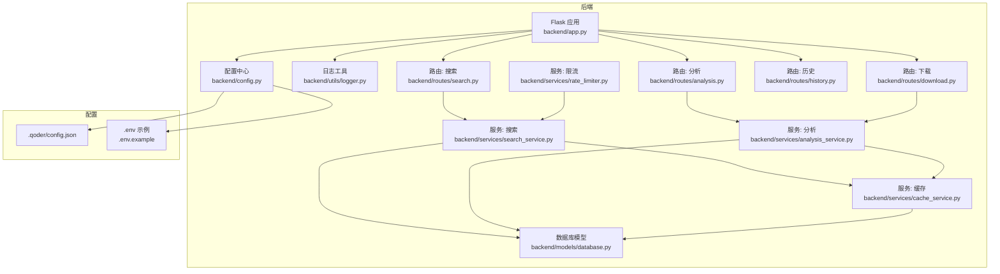
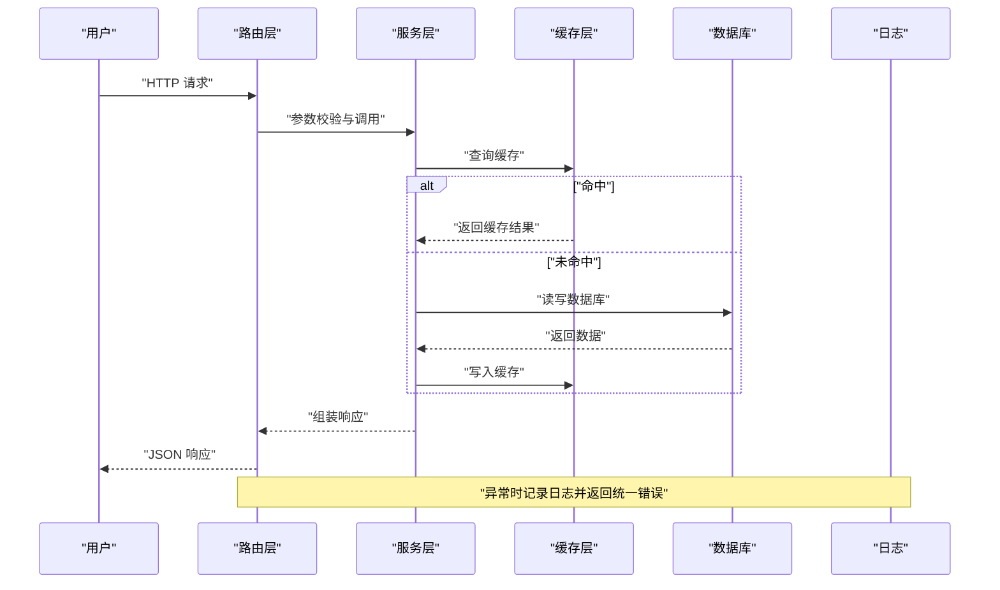
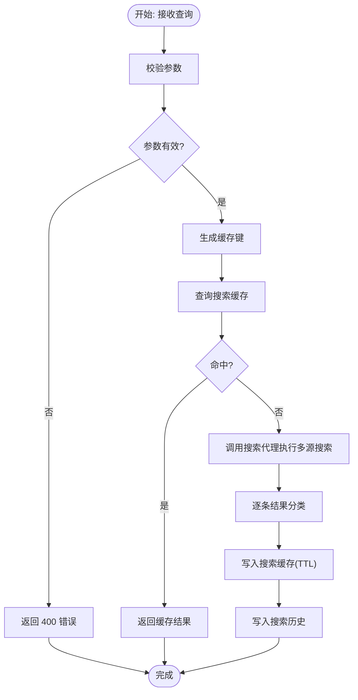
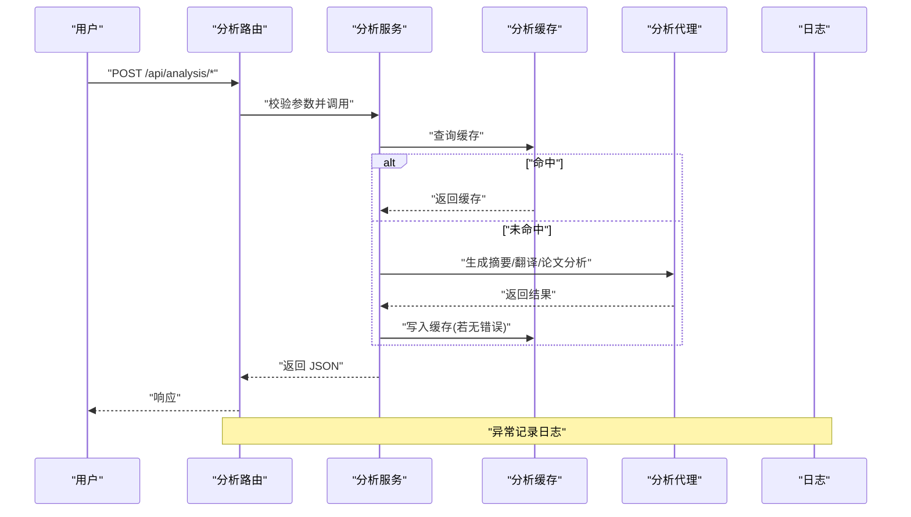
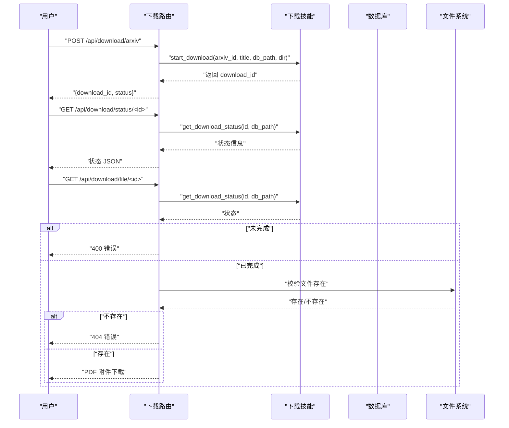
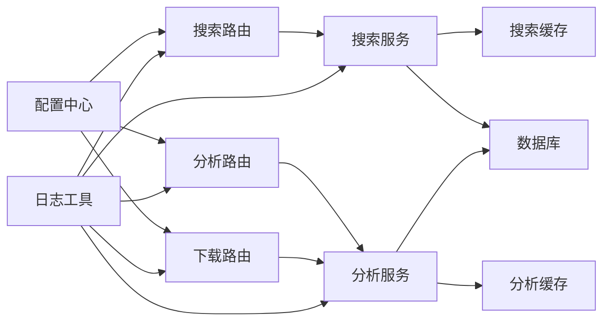

# 故障排查指南

<cite>
**本文引用的文件**
- [README.md](file://README.md)
- [backend/app.py](file://backend/app.py)
- [backend/config.py](file://backend/config.py)
- [backend/utils/logger.py](file://backend/utils/logger.py)
- [backend/models/database.py](file://backend/models/database.py)
- [backend/routes/search.py](file://backend/routes/search.py)
- [backend/routes/analysis.py](file://backend/routes/analysis.py)
- [backend/routes/download.py](file://backend/routes/download.py)
- [backend/routes/history.py](file://backend/routes/history.py)
- [backend/services/search_service.py](file://backend/services/search_service.py)
- [backend/services/analysis_service.py](file://backend/services/analysis_service.py)
- [backend/services/cache_service.py](file://backend/services/cache_service.py)
- [backend/services/rate_limiter.py](file://backend/services/rate_limiter.py)
- [.qoder/config.json](file://.qoder/config.json)
- [.env.example](file://.env.example)
</cite>

## 目录
1. [简介](#简介)
2. [项目结构](#项目结构)
3. [核心组件](#核心组件)
4. [架构总览](#架构总览)
5. [详细组件分析](#详细组件分析)
6. [依赖关系分析](#依赖关系分析)
7. [性能考虑](#性能考虑)
8. [故障排查指南](#故障排查指南)
9. [结论](#结论)
10. [附录](#附录)

## 简介
本指南面向技术支持与系统管理员，聚焦“Search Is All You Need”常见故障的诊断与修复，覆盖搜索功能异常、AI分析失败、PDF下载问题、数据库连接错误等场景；并提供日志分析方法、错误码含义、系统状态检查技巧、性能问题诊断、内存泄漏检测、网络连接故障处理、预防性维护、监控告警配置与应急流程。

## 项目结构
后端采用 Flask 微服务风格，按蓝图划分功能模块；前端为静态资源，生产模式由后端统一托管。配置来自 .env 与 .qoder/config.json 的合并；日志统一通过工具模块输出；数据库为 SQLite（WAL 模式），使用线程本地连接与上下文管理器确保事务一致性。

图表来源
- [backend/app.py](file://backend/app.py#L21-L78)
- [backend/config.py](file://backend/config.py#L15-L85)
- [backend/utils/logger.py](file://backend/utils/logger.py#L5-L23)
- [backend/models/database.py](file://backend/models/database.py#L11-L51)
- [backend/routes/search.py](file://backend/routes/search.py#L10-L28)
- [backend/routes/analysis.py](file://backend/routes/analysis.py#L10-L66)
- [backend/routes/download.py](file://backend/routes/download.py#L14-L98)
- [backend/routes/history.py](file://backend/routes/history.py#L10-L33)
- [backend/services/search_service.py](file://backend/services/search_service.py#L28-L98)
- [backend/services/analysis_service.py](file://backend/services/analysis_service.py#L25-L91)
- [backend/services/cache_service.py](file://backend/services/cache_service.py#L30-L104)
- [backend/services/rate_limiter.py](file://backend/services/rate_limiter.py#L45-L75)
- [.qoder/config.json](file://.qoder/config.json#L1-L31)
- [.env.example](file://.env.example#L1-L21)

章节来源
- [README.md](file://README.md#L376-L409)
- [backend/app.py](file://backend/app.py#L21-L78)
- [backend/config.py](file://backend/config.py#L15-L85)

## 核心组件
- 应用入口与全局错误处理：负责初始化数据库、注册蓝图、静态资源托管与全局异常捕获。
- 配置中心：合并 .env 与 .qoder/config.json，提供数据库、LLM、下载、分析、限流等配置。
- 日志工具：统一格式化输出，便于定位问题。
- 数据库层：SQLite（WAL），线程本地连接，自动提交/回滚，外键开启。
- 路由层：搜索、分析、下载、历史接口，参数校验与异常记录。
- 服务层：搜索/分析业务逻辑、缓存读写、历史持久化、限流协调。
- 缓存层：基于 SQLite 的搜索与分析缓存表，带过期清理。
- 限流层：令牌桶算法，按数据源维度控制并发节奏。

章节来源
- [backend/app.py](file://backend/app.py#L21-L78)
- [backend/config.py](file://backend/config.py#L15-L85)
- [backend/utils/logger.py](file://backend/utils/logger.py#L5-L23)
- [backend/models/database.py](file://backend/models/database.py#L11-L51)
- [backend/routes/search.py](file://backend/routes/search.py#L10-L28)
- [backend/routes/analysis.py](file://backend/routes/analysis.py#L10-L66)
- [backend/routes/download.py](file://backend/routes/download.py#L14-L98)
- [backend/routes/history.py](file://backend/routes/history.py#L10-L33)
- [backend/services/search_service.py](file://backend/services/search_service.py#L28-L98)
- [backend/services/analysis_service.py](file://backend/services/analysis_service.py#L25-L91)
- [backend/services/cache_service.py](file://backend/services/cache_service.py#L30-L104)
- [backend/services/rate_limiter.py](file://backend/services/rate_limiter.py#L45-L75)

## 架构总览
系统采用前后端分离，后端提供 RESTful API，前端静态资源由后端统一托管。核心流程包括：请求进入 -> 路由分发 -> 服务处理 -> 缓存命中/未命中 -> 数据库交互 -> 返回响应。异常通过全局错误处理器统一返回。

图表来源
- [backend/routes/search.py](file://backend/routes/search.py#L10-L28)
- [backend/routes/analysis.py](file://backend/routes/analysis.py#L10-L66)
- [backend/routes/download.py](file://backend/routes/download.py#L14-L98)
- [backend/services/search_service.py](file://backend/services/search_service.py#L28-L98)
- [backend/services/analysis_service.py](file://backend/services/analysis_service.py#L25-L91)
- [backend/services/cache_service.py](file://backend/services/cache_service.py#L30-L104)
- [backend/models/database.py](file://backend/models/database.py#L24-L43)
- [backend/app.py](file://backend/app.py#L61-L66)

## 详细组件分析

### 搜索组件（路由/服务/缓存）
- 路由层对查询参数进行基础校验，异常记录日志并返回统一错误。
- 服务层先查缓存，未命中则调用搜索代理执行多源并发搜索，随后分类并写入缓存，最后持久化搜索历史。
- 缓存层以查询参数哈希作为键，支持 TTL 控制与过期清理。

图表来源
- [backend/routes/search.py](file://backend/routes/search.py#L10-L28)
- [backend/services/search_service.py](file://backend/services/search_service.py#L28-L98)
- [backend/services/cache_service.py](file://backend/services/cache_service.py#L30-L53)

章节来源
- [backend/routes/search.py](file://backend/routes/search.py#L10-L28)
- [backend/services/search_service.py](file://backend/services/search_service.py#L28-L98)
- [backend/services/cache_service.py](file://backend/services/cache_service.py#L30-L53)

### AI 分析组件（摘要/翻译/论文分析）
- 路由层对内容进行必要性校验，异常记录日志并返回统一错误。
- 服务层按分析类型生成缓存键，命中则直接返回；未命中则调用分析代理生成结果，并在无错误时写入缓存。
- 缓存层对分析结果按类型区分键空间，支持 7 天过期清理。

图表来源
- [backend/routes/analysis.py](file://backend/routes/analysis.py#L10-L66)
- [backend/services/analysis_service.py](file://backend/services/analysis_service.py#L25-L91)
- [backend/services/cache_service.py](file://backend/services/cache_service.py#L57-L87)

章节来源
- [backend/routes/analysis.py](file://backend/routes/analysis.py#L10-L66)
- [backend/services/analysis_service.py](file://backend/services/analysis_service.py#L25-L91)
- [backend/services/cache_service.py](file://backend/services/cache_service.py#L57-L87)

### PDF 下载组件（发起/状态/文件/历史）
- 路由层对 arXiv ID 校验，异常返回 400；成功则调用技能模块发起下载并返回任务 ID。
- 状态查询路由根据任务 ID 查询状态，不存在返回 404，未完成返回 400。
- 文件路由校验状态与磁盘存在性，不存在返回 404，否则以附件形式返回 PDF。
- 历史路由返回全部下载记录。

图表来源
- [backend/routes/download.py](file://backend/routes/download.py#L14-L98)

章节来源
- [backend/routes/download.py](file://backend/routes/download.py#L14-L98)

### 历史记录组件（查询/清空）
- 路由层对 limit 参数做边界约束，异常记录日志并返回错误。
- 服务层封装查询与清空逻辑，异常记录日志并返回错误。

章节来源
- [backend/routes/history.py](file://backend/routes/history.py#L10-L33)
- [backend/services/search_service.py](file://backend/services/search_service.py#L82-L98)

### 缓存与限流组件
- 缓存：搜索与分析分别维护独立表，支持 TTL 与 7 天过期清理。
- 限流：令牌桶算法，按数据源维度配置容量与补充速率，默认覆盖 arXiv、知乎、Scholar、DuckDuckGo。

章节来源
- [backend/services/cache_service.py](file://backend/services/cache_service.py#L30-L104)
- [backend/services/rate_limiter.py](file://backend/services/rate_limiter.py#L45-L75)
- [.qoder/config.json](file://.qoder/config.json#L2-L7)

## 依赖关系分析
- 路由依赖服务层；服务层依赖缓存与数据库；分析服务依赖分析代理；搜索服务依赖搜索代理与分类服务。
- 配置中心贯穿应用，决定运行行为（端口、数据库路径、LLM 提供商、下载镜像、缓存 TTL、限流参数等）。
- 日志模块被各层复用，统一输出格式。

图表来源
- [backend/routes/search.py](file://backend/routes/search.py#L10-L28)
- [backend/routes/analysis.py](file://backend/routes/analysis.py#L10-L66)
- [backend/routes/download.py](file://backend/routes/download.py#L14-L98)
- [backend/services/search_service.py](file://backend/services/search_service.py#L28-L98)
- [backend/services/analysis_service.py](file://backend/services/analysis_service.py#L25-L91)
- [backend/services/cache_service.py](file://backend/services/cache_service.py#L30-L104)
- [backend/models/database.py](file://backend/models/database.py#L24-L43)
- [backend/config.py](file://backend/config.py#L15-L85)
- [backend/utils/logger.py](file://backend/utils/logger.py#L5-L23)

## 性能考虑
- 缓存策略：搜索与分析均具备缓存，显著降低重复请求与 LLM 调用成本；定期清理过期缓存避免膨胀。
- 限流策略：按数据源维度控制并发，避免外部 API 限流导致的抖动。
- 数据库优化：SQLite 使用 WAL 模式、超时与外键设置，提升并发与一致性。
- 建议：合理设置缓存 TTL 与分析缓存过期时间；监控外部数据源响应延迟与成功率；对热点查询增加索引（如需扩展）。

章节来源
- [backend/services/cache_service.py](file://backend/services/cache_service.py#L30-L104)
- [backend/services/rate_limiter.py](file://backend/services/rate_limiter.py#L45-L75)
- [backend/models/database.py](file://backend/models/database.py#L11-L21)
- [README.md](file://README.md#L355-L360)

## 故障排查指南

### 一、搜索功能异常
- 症状
  - 返回空结果或部分数据源失败
  - 首次搜索缓慢
- 诊断步骤
  1) 检查查询参数是否为空，确认路由层已返回 400。
  2) 查看后端日志中“搜索路由/服务”的错误记录。
  3) 检查各数据源配置与限流设置，确认未触发限流阻塞。
  4) 检查缓存是否命中，观察缓存命中率与 TTL。
  5) 核对默认数据源与最大结果数配置。
- 关联文件
  - [backend/routes/search.py](file://backend/routes/search.py#L10-L28)
  - [backend/services/search_service.py](file://backend/services/search_service.py#L28-L98)
  - [backend/services/cache_service.py](file://backend/services/cache_service.py#L30-L53)
  - [backend/services/rate_limiter.py](file://backend/services/rate_limiter.py#L45-L75)
  - [.qoder/config.json](file://.qoder/config.json#L8-L13)

章节来源
- [backend/routes/search.py](file://backend/routes/search.py#L10-L28)
- [backend/services/search_service.py](file://backend/services/search_service.py#L28-L98)
- [backend/services/cache_service.py](file://backend/services/cache_service.py#L30-L53)
- [backend/services/rate_limiter.py](file://backend/services/rate_limiter.py#L45-L75)
- [.qoder/config.json](file://.qoder/config.json#L8-L13)

### 二、AI 分析失败
- 症状
  - 摘要/翻译/论文分析接口返回错误
  - 内容过长或重复调用导致 LLM 额度紧张
- 诊断步骤
  1) 确认 LLM 提供商配置正确（智谱/DeepSeek），密钥有效。
  2) 检查分析服务缓存是否命中，避免重复调用。
  3) 查看日志中的分析路由与服务错误堆栈。
  4) 调整分析设置（最大内容长度、温度、缓存过期天数）。
- 关联文件
  - [backend/routes/analysis.py](file://backend/routes/analysis.py#L10-L66)
  - [backend/services/analysis_service.py](file://backend/services/analysis_service.py#L25-L91)
  - [backend/services/cache_service.py](file://backend/services/cache_service.py#L57-L87)
  - [.qoder/config.json](file://.qoder/config.json#L22-L29)
  - [.env.example](file://.env.example#L1-L21)

章节来源
- [backend/routes/analysis.py](file://backend/routes/analysis.py#L10-L66)
- [backend/services/analysis_service.py](file://backend/services/analysis_service.py#L25-L91)
- [backend/services/cache_service.py](file://backend/services/cache_service.py#L57-L87)
- [.qoder/config.json](file://.qoder/config.json#L22-L29)
- [.env.example](file://.env.example#L1-L21)

### 三、PDF 下载问题
- 症状
  - 发起下载返回错误
  - 查询状态返回未完成或找不到
  - 文件下载返回 404
- 诊断步骤
  1) 确认 arXiv ID 有效，路由层已校验。
  2) 检查下载历史与状态接口返回的任务状态。
  3) 校验下载目录权限与磁盘空间。
  4) 确认下载镜像可用，必要时切换镜像。
  5) 查看下载路由的日志错误。
- 关联文件
  - [backend/routes/download.py](file://backend/routes/download.py#L14-L98)
  - [.qoder/config.json](file://.qoder/config.json#L14-L21)

章节来源
- [backend/routes/download.py](file://backend/routes/download.py#L14-L98)
- [.qoder/config.json](file://.qoder/config.json#L14-L21)

### 四、数据库连接错误
- 症状
  - 初始化数据库失败
  - 查询/插入历史时报错
  - 事务回滚频繁
- 诊断步骤
  1) 检查 DATABASE_PATH 是否存在且可写。
  2) 确认 SQLite WAL 模式、busy_timeout、foreign_keys 设置生效。
  3) 查看数据库连接上下文是否正确提交/回滚。
  4) 检查线程本地连接是否泄漏（长时间持有未关闭）。
- 关联文件
  - [backend/models/database.py](file://backend/models/database.py#L11-L51)
  - [backend/config.py](file://backend/config.py#L35-L37)
  - [backend/services/search_service.py](file://backend/services/search_service.py#L70-L98)

章节来源
- [backend/models/database.py](file://backend/models/database.py#L11-L51)
- [backend/config.py](file://backend/config.py#L35-L37)
- [backend/services/search_service.py](file://backend/services/search_service.py#L70-L98)

### 五、日志分析方法与错误码含义
- 日志格式
  - 时间戳、级别、模块名、消息；统一输出，便于集中采集与检索。
- 常见错误码
  - 400：请求参数缺失或非法（如查询/内容为空、arXiv ID 缺失）
  - 404：资源不存在（下载任务/文件）
  - 400（下载文件）：任务未完成
  - 500：未捕获异常，统一返回内部错误
- 建议
  - 在开发环境开启 DEBUG，生产环境保持 INFO；结合日志聚合系统（如 ELK/Graylog）进行检索与告警。
  - 对高频错误（如外部 API 限流）增加重试与熔断策略。

章节来源
- [backend/utils/logger.py](file://backend/utils/logger.py#L5-L23)
- [backend/routes/search.py](file://backend/routes/search.py#L16-L27)
- [backend/routes/analysis.py](file://backend/routes/analysis.py#L16-L43)
- [backend/routes/download.py](file://backend/routes/download.py#L22-L82)
- [backend/app.py](file://backend/app.py#L61-L66)

### 六、系统状态检查技巧
- 端口与进程
  - 确认 FLASK_PORT 正常监听；检查进程占用与僵尸进程。
- 配置验证
  - 检查 .env 与 .qoder/config.json 合法性；优先级与默认值是否符合预期。
- 数据库健康
  - 执行 PRAGMA 健康检查（journal_mode、busy_timeout、foreign_keys）。
- 缓存健康
  - 定期清理过期缓存；监控缓存命中率与表大小。
- 外部依赖
  - 测试 arXiv、Bing、Semantic Scholar 等外部服务连通性与响应时间。

章节来源
- [backend/config.py](file://backend/config.py#L31-L33)
- [backend/models/database.py](file://backend/models/database.py#L17-L19)
- [backend/services/cache_service.py](file://backend/services/cache_service.py#L91-L104)
- [README.md](file://README.md#L346-L354)

### 七、性能问题诊断
- 搜索慢
  - 检查缓存命中率；减少默认数据源数量；调整 max_results_per_source 与 timeout_seconds。
- 分析耗时长
  - 控制内容长度；启用缓存；降低 temperature；评估提供商响应时间。
- 下载卡顿
  - 检查并发数限制与镜像可用性；监控磁盘 IO。
- 数据库慢
  - 使用 WAL 模式；适当增大 busy_timeout；避免长事务；定期 VACUUM（如需）。

章节来源
- [.qoder/config.json](file://.qoder/config.json#L8-L13)
- [backend/services/cache_service.py](file://backend/services/cache_service.py#L30-L53)
- [backend/services/rate_limiter.py](file://backend/services/rate_limiter.py#L45-L75)
- [backend/models/database.py](file://backend/models/database.py#L17-L19)

### 八、内存泄漏检测
- 现象
  - 进程 RSS 持续增长；GC 不回收；线程数异常上升。
- 排查
  1) 检查线程本地数据库连接是否在请求结束时释放。
  2) 关注第三方库（requests、arxiv、llm SDK）的连接池与资源释放。
  3) 使用内存分析工具（如 tracemalloc、memory_profiler）定位泄漏对象。
  4) 重启服务验证内存回落。
- 关联文件
  - [backend/models/database.py](file://backend/models/database.py#L46-L51)

章节来源
- [backend/models/database.py](file://backend/models/database.py#L46-L51)

### 九、网络连接故障
- 症状
  - 外部 API 超时或返回 429/5xx
  - DNS 解析失败或代理不通
- 诊断步骤
  1) 检查 HTTP_PROXY/HTTPS_PROXY 是否正确配置。
  2) 验证 arXiv、Bing、Semantic Scholar 的连通性与可用性。
  3) 在限流策略允许范围内降低并发或增加重试。
- 关联文件
  - [.env.example](file://.env.example#L18-L20)
  - [README.md](file://README.md#L346-L354)

章节来源
- [.env.example](file://.env.example#L18-L20)
- [README.md](file://README.md#L346-L354)

### 十、预防性维护与应急流程
- 预防性维护
  - 定期备份数据库；监控磁盘空间与 inode；轮换日志文件；清理过期缓存。
  - 更新第三方依赖；关注外部 API 变更与限流策略调整。
- 监控告警
  - 关键指标：响应时间、错误率、缓存命中率、数据库连接数、CPU/内存/IO。
  - 告警阈值：错误率超过 1%、P95 响应时间超过阈值、缓存命中率低于阈值、数据库锁等待超时。
- 应急流程
  1) 快速降级：关闭高风险功能（如分析/下载），保留搜索核心链路。
  2) 限流与熔断：临时提高令牌桶容量或暂停非关键来源。
  3) 回滚与切换：回退到上一个稳定版本；切换外部服务镜像。
  4) 事后复盘：收集日志、生成报告、更新预案。

章节来源
- [backend/services/cache_service.py](file://backend/services/cache_service.py#L91-L104)
- [backend/services/rate_limiter.py](file://backend/services/rate_limiter.py#L45-L75)
- [README.md](file://README.md#L355-L360)

## 结论
通过统一的日志、完善的配置中心、分层的服务与缓存、以及严格的限流与数据库优化，系统具备良好的可运维性。建议在生产环境中强化监控与告警、定期进行缓存与数据库健康检查，并制定标准化的应急流程，以保障服务稳定性与用户体验。

## 附录
- 常用命令与路径
  - 后端启动：python backend/app.py
  - 前端构建：cd frontend && npm run build
  - 数据库路径：data/search.db
  - 下载目录：data/downloads
- 关键配置项
  - LLM 提供商与模型：analysis_settings.provider/model
  - 限流参数：rate_limits
  - 搜索默认值：search_defaults
  - 下载设置：download_settings

章节来源
- [README.md](file://README.md#L113-L183)
- [.qoder/config.json](file://.qoder/config.json#L1-L31)
- [backend/config.py](file://backend/config.py#L35-L78)