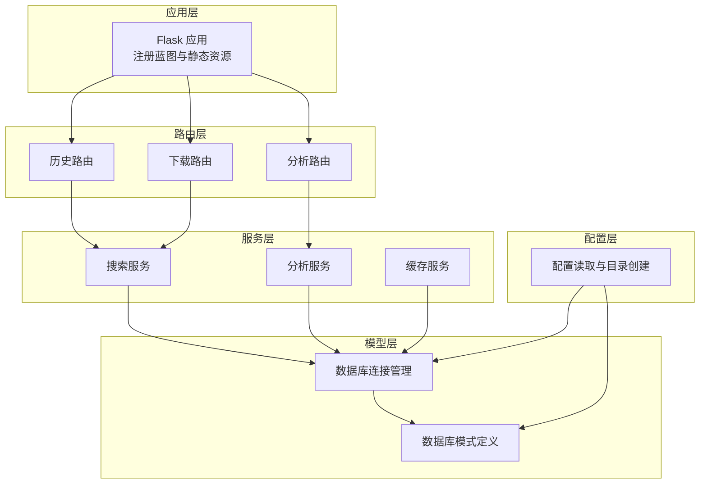
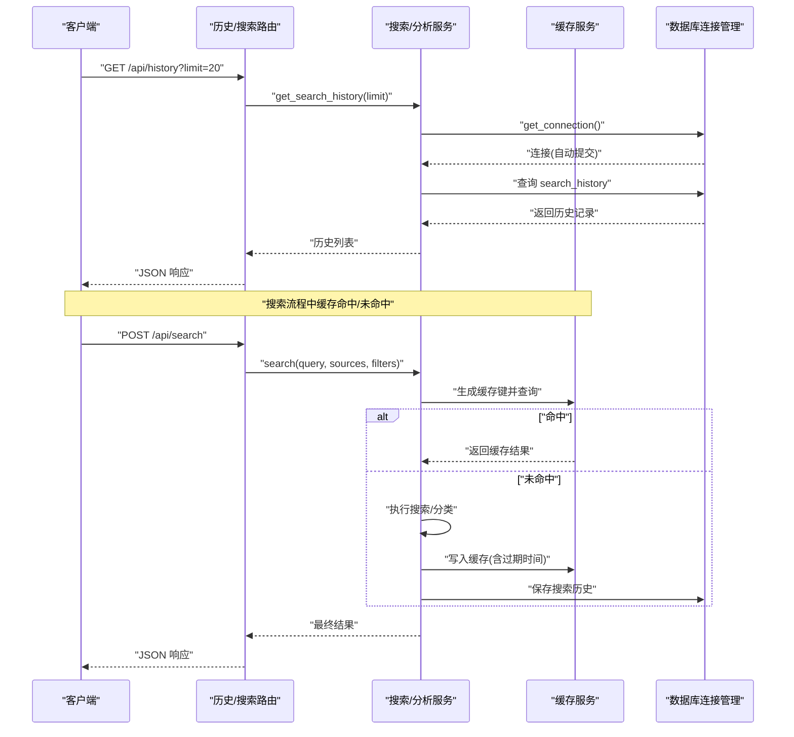
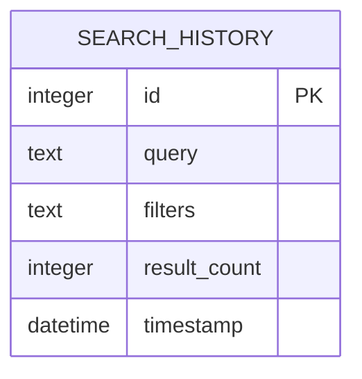
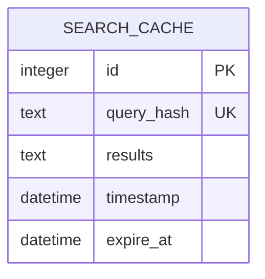
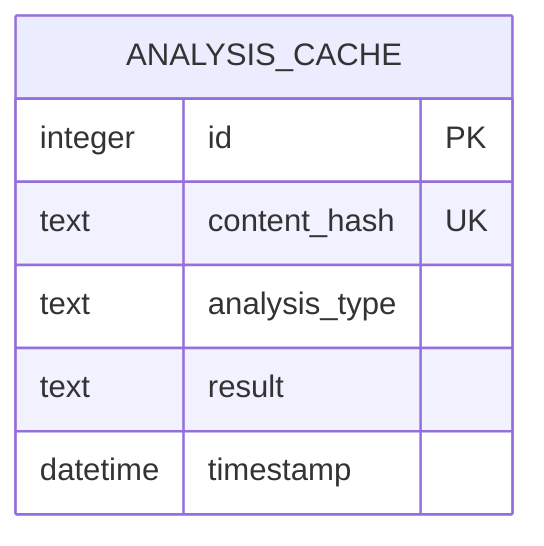
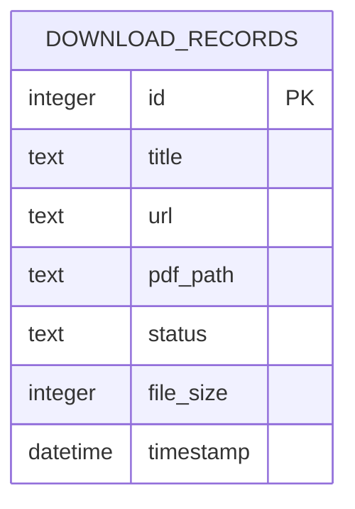
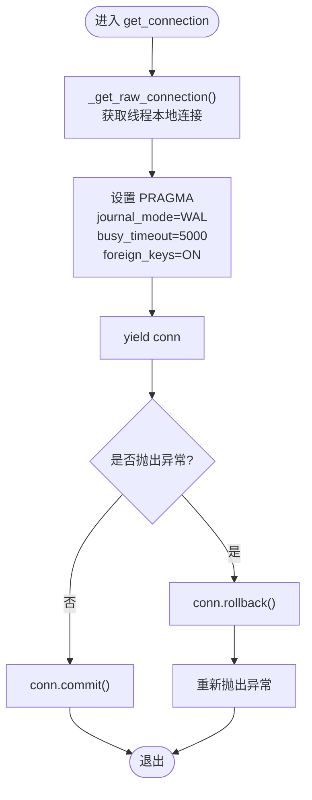
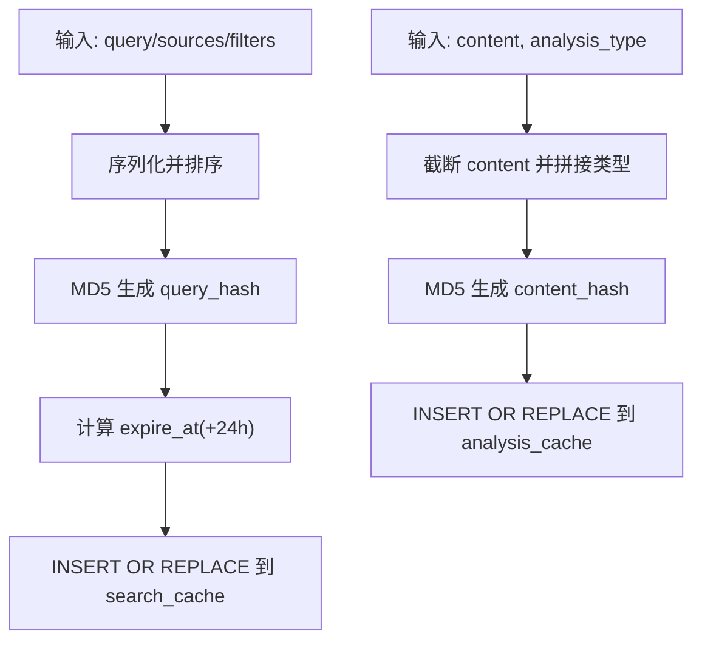
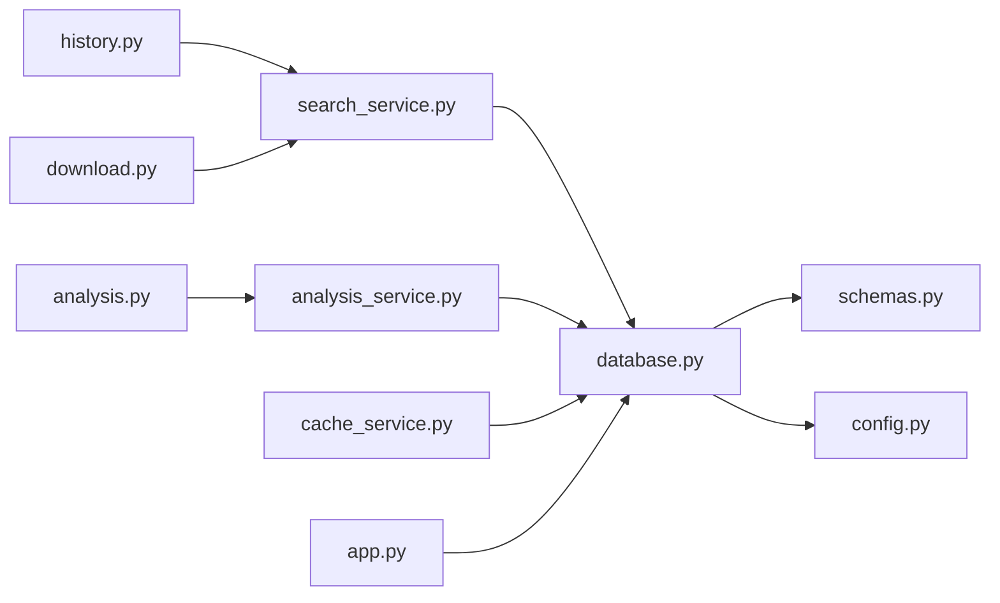

# 数据库设计

<cite>
**本文引用的文件**
- [backend/models/database.py](file://backend/models/database.py)
- [backend/models/schemas.py](file://backend/models/schemas.py)
- [backend/config.py](file://backend/config.py)
- [backend/services/cache_service.py](file://backend/services/cache_service.py)
- [backend/services/search_service.py](file://backend/services/search_service.py)
- [backend/routes/history.py](file://backend/routes/history.py)
- [backend/routes/analysis.py](file://backend/routes/analysis.py)
- [backend/routes/download.py](file://backend/routes/download.py)
- [backend/app.py](file://backend/app.py)
- [.qoder/config.json](file://.qoder/config.json)
</cite>

## 目录
1. [简介](#简介)
2. [项目结构](#项目结构)
3. [核心组件](#核心组件)
4. [架构总览](#架构总览)
5. [详细组件分析](#详细组件分析)
6. [依赖关系分析](#依赖关系分析)
7. [性能考虑](#性能考虑)
8. [故障排查指南](#故障排查指南)
9. [结论](#结论)
10. [附录](#附录)

## 简介
本文件面向数据库管理员与开发者，系统性阐述基于 SQLite 的数据模型与架构设计。重点覆盖以下四类表：搜索历史表、搜索缓存表、分析缓存表与下载记录表。内容包括字段定义、索引策略、约束与完整性保障、连接与事务管理、性能优化、迁移与维护建议等，帮助读者快速理解并安全运维该数据库。

## 项目结构
后端采用分层架构：
- 配置层：集中管理数据库路径、默认参数与目录创建
- 模型层：负责数据库初始化、连接管理与模式定义
- 服务层：封装业务逻辑（搜索、缓存、分析）
- 路由层：对外暴露 REST 接口
- 应用入口：启动时初始化数据库并注册蓝图

图表来源
- [backend/app.py](file://backend/app.py#L21-L78)
- [backend/routes/history.py](file://backend/routes/history.py#L1-L33)
- [backend/routes/analysis.py](file://backend/routes/analysis.py#L1-L66)
- [backend/routes/download.py](file://backend/routes/download.py#L1-L98)
- [backend/services/search_service.py](file://backend/services/search_service.py#L1-L98)
- [backend/services/analysis_service.py](file://backend/services/analysis_service.py#L1-L91)
- [backend/services/cache_service.py](file://backend/services/cache_service.py#L1-L104)
- [backend/models/database.py](file://backend/models/database.py#L1-L51)
- [backend/models/schemas.py](file://backend/models/schemas.py#L1-L38)
- [backend/config.py](file://backend/config.py#L1-L85)

章节来源
- [backend/app.py](file://backend/app.py#L21-L78)
- [backend/config.py](file://backend/config.py#L15-L85)

## 核心组件
- 数据库连接管理：线程本地连接、自动提交/回滚、WAL 日志模式、超时与外键约束设置
- 模式定义：四张核心表的建表语句、索引与约束
- 缓存服务：搜索与分析结果的缓存键生成、过期控制与清理
- 业务服务：搜索历史持久化、历史查询与清理、分析接口调用与缓存交互
- 路由接口：历史查询与清空、分析接口、下载任务创建与状态查询

章节来源
- [backend/models/database.py](file://backend/models/database.py#L11-L51)
- [backend/models/schemas.py](file://backend/models/schemas.py#L1-L38)
- [backend/services/cache_service.py](file://backend/services/cache_service.py#L1-L104)
- [backend/services/search_service.py](file://backend/services/search_service.py#L70-L98)
- [backend/routes/history.py](file://backend/routes/history.py#L10-L33)

## 架构总览
下图展示从请求到数据库的典型流程，涵盖搜索、缓存与历史写入的关键步骤。

图表来源
- [backend/routes/history.py](file://backend/routes/history.py#L10-L33)
- [backend/services/search_service.py](file://backend/services/search_service.py#L28-L98)
- [backend/services/cache_service.py](file://backend/services/cache_service.py#L30-L87)
- [backend/models/database.py](file://backend/models/database.py#L24-L34)

## 详细组件分析

### 搜索历史表（search_history）
- 设计理念
  - 记录用户每次搜索的关键信息，便于回溯与统计
  - 通过 JSON 字符串存储过滤器，支持灵活扩展
- 字段定义
  - id：自增主键
  - query：搜索关键词，非空
  - filters：过滤器 JSON，默认为空字典
  - result_count：本次搜索返回条数，默认 0
  - timestamp：记录创建时间，默认当前时间戳
- 索引策略
  - 无显式索引；按时间倒序查询为主，适合按时间排序的场景
- 约束与完整性
  - 主键约束确保唯一标识
  - 非空约束保证查询与计数字段有效
- 写入与查询
  - 写入：在搜索完成后持久化历史
  - 查询：按时间倒序取前 N 条

图表来源
- [backend/models/schemas.py](file://backend/models/schemas.py#L2-L8)
- [backend/services/search_service.py](file://backend/services/search_service.py#L70-L90)

章节来源
- [backend/models/schemas.py](file://backend/models/schemas.py#L2-L8)
- [backend/services/search_service.py](file://backend/services/search_service.py#L70-L98)

### 搜索缓存表（search_cache）
- 设计理念
  - 存储多源搜索结果，以查询哈希作为键，支持 TTL 过期
  - 使用唯一索引加速命中与去重更新
- 字段定义
  - id：自增主键
  - query_hash：查询哈希值，唯一且非空
  - results：序列化后的搜索结果 JSON
  - timestamp：缓存创建时间，默认当前时间戳
  - expire_at：过期时间点，非空
- 索引策略
  - 对 query_hash 建立唯一索引，提升查找与插入效率
- 约束与完整性
  - 唯一约束保证同一查询不会重复缓存
  - 非空约束确保过期时间与结果存在
- 过期与清理
  - 插入或替换时写入 expire_at
  - 定期清理过期记录，释放空间

图表来源
- [backend/models/schemas.py](file://backend/models/schemas.py#L10-L17)
- [backend/services/cache_service.py](file://backend/services/cache_service.py#L30-L53)

章节来源
- [backend/models/schemas.py](file://backend/models/schemas.py#L10-L17)
- [backend/services/cache_service.py](file://backend/services/cache_service.py#L30-L104)

### 分析缓存表（analysis_cache）
- 设计理念
  - 存储内容分析结果（摘要、翻译、论文分析），以内容哈希+类型为复合键
  - 支持不同分析类型的独立缓存
- 字段定义
  - id：自增主键
  - content_hash：内容哈希值，唯一且非空
  - analysis_type：分析类型标识，如 summary、translate_zh、paper_analysis
  - result：序列化后的分析结果 JSON
  - timestamp：缓存创建时间，默认当前时间戳
- 索引策略
  - 对 content_hash 建立唯一索引，提升查找与去重效率
- 约束与完整性
  - 唯一约束保证同一内容同类型仅保留最新缓存
  - 非空约束确保类型与结果存在
- 过期与清理
  - 采用时间戳对比进行 7 天过期判断，过期即删除
  - 提供统一清理函数定期移除过期项

图表来源
- [backend/models/schemas.py](file://backend/models/schemas.py#L19-L27)
- [backend/services/cache_service.py](file://backend/services/cache_service.py#L57-L87)

章节来源
- [backend/models/schemas.py](file://backend/models/schemas.py#L19-L27)
- [backend/services/cache_service.py](file://backend/services/cache_service.py#L57-L104)

### 下载记录表（download_records）
- 设计理念
  - 记录 arXiv 下载任务的状态与产物路径，支持查询与文件下载
- 字段定义
  - id：自增主键
  - title：标题，非空
  - url：原始链接，非空
  - pdf_path：PDF 文件本地路径，可空
  - status：任务状态，默认 pending
  - file_size：文件大小，默认 0
  - timestamp：记录创建时间，默认当前时间戳
- 索引策略
  - 无显式索引；按 ID 与状态查询为主
- 约束与完整性
  - 主键约束确保唯一标识
  - 非空约束保证标题与 URL 有效
- 业务关联
  - 由下载路由触发创建，状态变更由外部技能模块驱动
  - 支持按 ID 查询状态与文件下载

图表来源
- [backend/models/schemas.py](file://backend/models/schemas.py#L28-L37)
- [backend/routes/download.py](file://backend/routes/download.py#L14-L98)

章节来源
- [backend/models/schemas.py](file://backend/models/schemas.py#L28-L37)
- [backend/routes/download.py](file://backend/routes/download.py#L14-L98)

### 数据库连接管理与事务机制
- 连接策略
  - 线程本地连接：每个线程持有独立连接，避免并发冲突
  - 初始化参数：启用 WAL 模式、设置 busy_timeout、开启外键检查
  - 行工厂：使用 sqlite3.Row 以便按列名访问结果
- 事务控制
  - 上下文管理器：自动提交成功事务，异常时回滚
  - 作用域：所有数据库写入均在上下文内完成，保证一致性
- 生命周期
  - 应用启动时初始化数据库与表结构
  - 线程结束时关闭连接，释放资源

图表来源
- [backend/models/database.py](file://backend/models/database.py#L11-L51)

章节来源
- [backend/models/database.py](file://backend/models/database.py#L11-L51)
- [backend/app.py](file://backend/app.py#L70-L72)

### 缓存键生成与过期策略
- 搜索缓存键
  - 组合查询参数（query、sources、filters）并序列化后做 MD5
  - TTL 可配置，默认 24 小时
- 分析缓存键
  - 截断内容长度（约 2000 字符）并附加分析类型，再做 MD5
  - TTL 固定为 7 天
- 过期清理
  - 搜索缓存：按 expire_at 删除
  - 分析缓存：按 timestamp 删除超过 7 天的记录

图表来源
- [backend/services/cache_service.py](file://backend/services/cache_service.py#L11-L26)
- [backend/services/cache_service.py](file://backend/services/cache_service.py#L43-L87)

章节来源
- [backend/services/cache_service.py](file://backend/services/cache_service.py#L11-L104)
- [.qoder/config.json](file://.qoder/config.json#L8-L13)

## 依赖关系分析
- 模块耦合
  - 路由层依赖服务层；服务层依赖缓存与数据库模型
  - 数据库模型依赖配置与模式定义
- 外部依赖
  - SQLite 作为嵌入式数据库，无需独立进程
  - 外部技能模块用于下载任务状态与文件服务
- 循环依赖
  - 未发现循环导入；各层职责清晰

图表来源
- [backend/routes/history.py](file://backend/routes/history.py#L1-L33)
- [backend/routes/analysis.py](file://backend/routes/analysis.py#L1-L66)
- [backend/routes/download.py](file://backend/routes/download.py#L1-L98)
- [backend/services/search_service.py](file://backend/services/search_service.py#L1-L98)
- [backend/services/analysis_service.py](file://backend/services/analysis_service.py#L1-L91)
- [backend/services/cache_service.py](file://backend/services/cache_service.py#L1-L104)
- [backend/models/database.py](file://backend/models/database.py#L1-L51)
- [backend/models/schemas.py](file://backend/models/schemas.py#L1-L38)
- [backend/config.py](file://backend/config.py#L1-L85)
- [backend/app.py](file://backend/app.py#L1-L78)

章节来源
- [backend/app.py](file://backend/app.py#L10-L16)
- [backend/models/database.py](file://backend/models/database.py#L5-L6)

## 性能考虑
- WAL 模式与并发
  - 启用 WAL 模式提升读写并发能力，减少锁竞争
  - busy_timeout 设置为 5000ms，缓解短暂阻塞
- 索引优化
  - 搜索缓存与分析缓存对哈希字段建立唯一索引，显著降低查找与去重成本
  - 建议未来根据查询模式评估是否为 search_history 的 timestamp 建立索引
- 序列化与体积
  - 结果与分析结果以 JSON 文本存储，注意控制单条记录体积，避免过大导致 IO 压力
- TTL 与清理
  - 定期清理过期缓存，保持表规模可控
  - 建议在低峰时段执行清理任务
- 连接与事务
  - 线程本地连接避免跨线程共享，减少上下文切换开销
  - 自动提交/回滚确保一致性，避免长事务占用资源

[本节为通用性能指导，不直接分析具体文件]

## 故障排查指南
- 连接问题
  - 检查数据库路径是否存在，必要时创建父目录
  - 确认 busy_timeout 与 WAL 模式设置是否生效
- 写入失败
  - 查看异常日志，确认事务回滚是否正确触发
  - 核对唯一索引冲突（如缓存键重复）
- 缓存异常
  - 检查过期时间计算与清理任务是否正常运行
  - 验证哈希生成逻辑与序列化编码一致性
- 历史与下载
  - 确认历史写入与查询 SQL 是否匹配
  - 下载文件不存在时检查 pdf_path 与磁盘路径

章节来源
- [backend/models/database.py](file://backend/models/database.py#L11-L51)
- [backend/services/cache_service.py](file://backend/services/cache_service.py#L91-L104)
- [backend/services/search_service.py](file://backend/services/search_service.py#L70-L98)
- [backend/routes/download.py](file://backend/routes/download.py#L60-L82)

## 结论
该数据库设计围绕 SQLite 的轻量特性，采用线程本地连接、WAL 模式与自动事务管理，结合搜索与分析缓存表实现高效的数据复用。四张核心表职责清晰、约束明确，配合合理的索引与清理策略，能够在中小规模场景下提供稳定可靠的性能表现。建议在生产环境中持续监控缓存命中率与表规模，并根据实际查询模式调整索引与清理策略。

[本节为总结性内容，不直接分析具体文件]

## 附录

### 数据库初始化与模式定义
- 初始化流程
  - 应用启动时调用初始化函数，确保目录存在并执行建表脚本
  - 建表脚本包含四张核心表与必要索引
- 模式定义
  - 使用字符串常量集中管理建表 SQL，便于版本化与迁移

章节来源
- [backend/app.py](file://backend/app.py#L70-L72)
- [backend/models/database.py](file://backend/models/database.py#L36-L44)
- [backend/models/schemas.py](file://backend/models/schemas.py#L1-L38)

### 配置与默认参数
- 数据库路径
  - 默认位于项目根目录 data/search.db
- 搜索默认参数
  - 默认来源、每源最大结果、超时与缓存 TTL
- 分析默认参数
  - 模型、最大内容长度、温度与分析缓存 TTL
- 下载默认参数
  - 保存目录、并发限制与镜像地址

章节来源
- [backend/config.py](file://backend/config.py#L35-L77)
- [.qoder/config.json](file://.qoder/config.json#L8-L30)

### 数据迁移与备份恢复
- 迁移策略
  - 新增字段：使用 ALTER TABLE 添加列并设置默认值
  - 新增索引：先创建索引，再重建以优化现有数据
  - 修改约束：导出数据 -> 重建表 -> 导入数据（SQLite 不支持在线修改约束）
- 备份与恢复
  - 备份：直接复制 SQLite 文件（数据文件与 WAL/SHM 文件需一致）
  - 恢复：停止服务 -> 替换数据库文件 -> 启动服务
- 维护最佳实践
  - 定期执行 VACUUM（SQLite 特有）以回收空间
  - 监控 WAL 文件大小，必要时进行 checkpoint 或切换回传统模式
  - 在低峰时段执行大规模清理与重建索引

[本节为通用运维建议，不直接分析具体文件]