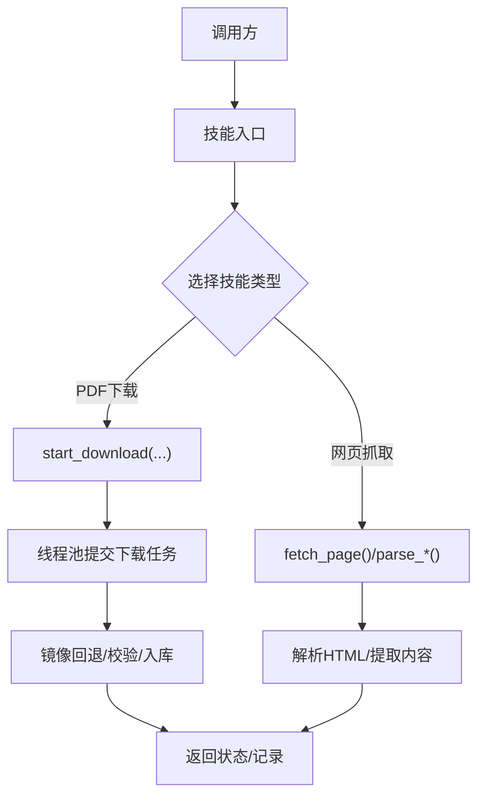

# AI代理系统架构

<cite>
**本文引用的文件**
- [README.md](file://README.md)
- [backend/app.py](file://backend/app.py)
- [backend/config.py](file://backend/config.py)
- [.qoder/config.json](file://.qoder/config.json)
- [backend/routes/search.py](file://backend/routes/search.py)
- [backend/routes/analysis.py](file://backend/routes/analysis.py)
- [backend/services/search_service.py](file://backend/services/search_service.py)
- [backend/services/analysis_service.py](file://backend/services/analysis_service.py)
- [.qoder/agents/search_agent.py](file://.qoder/agents/search_agent.py)
- [.qoder/agents/analysis_agent.py](file://.qoder/agents/analysis_agent.py)
- [.qoder/skills/pdf_download_skill.py](file://.qoder/skills/pdf_download_skill.py)
- [.qoder/skills/web_scraping_skill.py](file://.qoder/skills/web_scraping_skill.py)
- [backend/models/schemas.py](file://backend/models/schemas.py)
</cite>

## 目录
1. [简介](#简介)
2. [项目结构](#项目结构)
3. [核心组件](#核心组件)
4. [架构总览](#架构总览)
5. [详细组件分析](#详细组件分析)
6. [依赖关系分析](#依赖关系分析)
7. [性能考量](#性能考量)
8. [故障排查指南](#故障排查指南)
9. [结论](#结论)
10. [附录](#附录)

## 简介
本项目“Search Is All You Need”提供多源内容检索与AI智能分析能力，采用前后端分离架构，后端基于Flask，前端基于React/Vite。AI代理系统是本项目的核心抽象层，负责：
- 搜索代理：统一调度多数据源并发搜索，进行结果去重与分类
- 分析代理：封装LLM提供商（智谱AI/DeepSeek）的调用，提供摘要、翻译、论文解析等能力
- 技能模块：提供PDF下载与网页抓取等可复用能力
- 配置驱动：通过运行时配置文件与环境变量统一管理提供商、模型、速率限制、缓存等参数

本架构强调可扩展性与可维护性，支持通过配置切换LLM提供商、新增数据源与技能模块。

## 项目结构
后端采用分层组织：
- 应用入口与路由：Flask应用、蓝图路由
- 业务服务：搜索服务、分析服务
- 配置管理：合并.env与.qoder/config.json
- 数据模型：数据库表结构定义
- AI代理与技能：.qoder目录下的agents与skills

图表来源
- [backend/app.py](file://backend/app.py#L21-L67)
- [backend/routes/search.py](file://backend/routes/search.py#L10-L27)
- [backend/routes/analysis.py](file://backend/routes/analysis.py#L10-L65)
- [backend/services/search_service.py](file://backend/services/search_service.py#L28-L67)
- [backend/services/analysis_service.py](file://backend/services/analysis_service.py#L25-L90)
- [.qoder/agents/search_agent.py](file://.qoder/agents/search_agent.py#L33-L111)
- [.qoder/agents/analysis_agent.py](file://.qoder/agents/analysis_agent.py#L13-L33)
- [.qoder/skills/pdf_download_skill.py](file://.qoder/skills/pdf_download_skill.py#L21-L48)
- [.qoder/skills/web_scraping_skill.py](file://.qoder/skills/web_scraping_skill.py#L27-L46)
- [backend/models/schemas.py](file://backend/models/schemas.py#L1-L37)

章节来源
- [README.md](file://README.md#L376-L404)
- [backend/app.py](file://backend/app.py#L21-L67)

## 核心组件
- 搜索代理（SearchAgent）
  - 职责：并发调用多数据源（DuckDuckGo、arXiv、Semantic Scholar、知乎），统一结果格式，去重与统计状态
  - 并发策略：线程池，超时控制，速率限制
  - 输出：统一结构化结果与各数据源状态
- 分析代理（AnalysisAgent）
  - 职责：封装LLM提供商调用，提供摘要、翻译、论文解析；支持内容截断与JSON抽取
  - 提供商抽象：根据配置初始化不同客户端（智谱AI/DeepSeek）
  - 输出：结构化分析结果或错误信息
- 技能模块
  - PDF下载技能：后台下载arXiv PDF，镜像回退，校验有效性，数据库记录状态
  - 网页抓取技能：随机UA、解析Zhihu内容、提取OpenGraph元数据
- 配置驱动
  - 合并.env与.qoder/config.json，统一管理提供商、模型、速率限制、缓存与下载设置

章节来源
- [.qoder/agents/search_agent.py](file://.qoder/agents/search_agent.py#L21-L111)
- [.qoder/agents/analysis_agent.py](file://.qoder/agents/analysis_agent.py#L13-L61)
- [.qoder/skills/pdf_download_skill.py](file://.qoder/skills/pdf_download_skill.py#L21-L88)
- [.qoder/skills/web_scraping_skill.py](file://.qoder/skills/web_scraping_skill.py#L27-L127)
- [backend/config.py](file://backend/config.py#L15-L78)
- [.qoder/config.json](file://.qoder/config.json#L1-L31)

## 架构总览
AI代理系统围绕“配置驱动 + 代理抽象 + 技能模块”的三层设计展开：
- 配置层：集中管理提供商、模型、速率限制、缓存与下载策略
- 代理层：搜索代理与分析代理分别承担数据获取与AI推理职责
- 技能层：可插拔的通用能力（PDF下载、网页抓取）

图表来源
- [backend/config.py](file://backend/config.py#L15-L78)
- [.qoder/config.json](file://.qoder/config.json#L1-L31)
- [.qoder/agents/search_agent.py](file://.qoder/agents/search_agent.py#L21-L32)
- [.qoder/agents/analysis_agent.py](file://.qoder/agents/analysis_agent.py#L13-L33)
- [.qoder/skills/pdf_download_skill.py](file://.qoder/skills/pdf_download_skill.py#L12-L18)
- [.qoder/skills/web_scraping_skill.py](file://.qoder/skills/web_scraping_skill.py#L9-L15)

## 详细组件分析

### 搜索代理（SearchAgent）
- 设计理念
  - 工厂式动态调度：根据传入的数据源列表，映射到对应搜索方法，避免硬编码耦合
  - 并发与容错：线程池并发执行，统一超时与异常处理，未完成任务标记为超时
  - 结果去重：按URL去重，保证全局唯一
- 关键流程
  - 输入：查询词、数据源集合、过滤条件
  - 执行：为每个有效数据源提交任务，收集结果
  - 输出：统一结构、总数、各数据源状态
- 速率限制与超时
  - 每个数据源调用前先申请令牌，避免触发上游限流
  - 整体超时控制，确保快速失败与资源释放

图表来源
- [backend/routes/search.py](file://backend/routes/search.py#L10-L27)
- [backend/services/search_service.py](file://backend/services/search_service.py#L28-L67)
- [.qoder/agents/search_agent.py](file://.qoder/agents/search_agent.py#L33-L111)

章节来源
- [.qoder/agents/search_agent.py](file://.qoder/agents/search_agent.py#L21-L111)

### 分析代理（AnalysisAgent）
- 设计理念
  - 提供商抽象：通过配置选择zhipu或deepseek，按需初始化客户端
  - 统一接口：generate_summary、translate_content、analyze_paper
  - 容错与截断：内容长度截断、错误返回、JSON抽取增强
- 关键流程
  - 初始化：读取配置，选择模型与温度，构建客户端
  - 调用：构造提示词，调用LLM，解析返回
  - 输出：结构化结果或错误信息

图表来源
- [backend/routes/analysis.py](file://backend/routes/analysis.py#L10-L24)
- [backend/services/analysis_service.py](file://backend/services/analysis_service.py#L25-L43)
- [.qoder/agents/analysis_agent.py](file://.qoder/agents/analysis_agent.py#L68-L114)

章节来源
- [.qoder/agents/analysis_agent.py](file://.qoder/agents/analysis_agent.py#L13-L61)

### 技能模块（PDF下载与网页抓取）
- PDF下载技能
  - 背景线程池：全局线程池，最大并发受控
  - 镜像回退：主镜像失败自动切换备用镜像
  - 校验与记录：下载完成后校验PDF头，写入数据库状态
- 网页抓取技能
  - 随机UA：降低被反爬风险
  - Zhihu解析：提取标题与若干答案片段
  - 元数据抽取：优先OpenGraph，回退<title>与<meta name="description">

图表来源
- [.qoder/skills/pdf_download_skill.py](file://.qoder/skills/pdf_download_skill.py#L21-L88)

章节来源
- [.qoder/skills/pdf_download_skill.py](file://.qoder/skills/pdf_download_skill.py#L1-L146)
- [.qoder/skills/web_scraping_skill.py](file://.qoder/skills/web_scraping_skill.py#L1-L128)

### 配置驱动的代理管理
- 配置来源
  - 环境变量：.env中的API密钥、Flask配置、下载目录、HTTP代理
  - 运行时配置：.qoder/config.json中的提供商、模型、速率限制、搜索默认值、下载设置、分析设置
- 合并与覆盖
  - Config类统一加载与合并，提供单一可信源
  - 分析代理按配置选择模型与温度，搜索代理按配置设置并发与超时
- 配置管理架构

图表来源
- [backend/config.py](file://backend/config.py#L15-L78)
- [.qoder/config.json](file://.qoder/config.json#L1-L31)

章节来源
- [backend/config.py](file://backend/config.py#L15-L78)
- [.qoder/config.json](file://.qoder/config.json#L1-L31)

### 代理间的协作机制与错误处理策略
- 协作机制
  - 路由层：/api/search 与 /api/analysis 将请求委派给对应服务
  - 服务层：懒加载代理实例，统一缓存键生成与命中逻辑
  - 代理层：搜索代理负责数据源编排，分析代理负责LLM调用
- 错误处理
  - 路由层捕获异常并记录日志，返回统一错误响应
  - 服务层缓存命中失败时降级到代理调用
  - 代理层对LLM调用异常进行捕获与返回，避免中断整体流程

章节来源
- [backend/routes/search.py](file://backend/routes/search.py#L22-L27)
- [backend/routes/analysis.py](file://backend/routes/analysis.py#L22-L24)
- [backend/services/search_service.py](file://backend/services/search_service.py#L70-L79)
- [backend/services/analysis_service.py](file://backend/services/analysis_service.py#L32-L35)

### AI代理生命周期图

图表来源
- [backend/app.py](file://backend/app.py#L61-L65)
- [backend/services/search_service.py](file://backend/services/search_service.py#L70-L79)
- [backend/services/analysis_service.py](file://backend/services/analysis_service.py#L32-L35)

### 技能调用流程图

图表来源
- [.qoder/skills/pdf_download_skill.py](file://.qoder/skills/pdf_download_skill.py#L21-L88)
- [.qoder/skills/web_scraping_skill.py](file://.qoder/skills/web_scraping_skill.py#L27-L127)

### 配置管理架构图

图表来源
- [backend/config.py](file://backend/config.py#L15-L78)
- [.qoder/config.json](file://.qoder/config.json#L1-L31)

## 依赖关系分析
- 组件耦合
  - 路由依赖服务层，服务层依赖代理层与配置层
  - 代理层依赖配置层与第三方SDK（requests、arxiv、zhipuai/openai）
  - 技能模块独立，通过简单函数暴露能力
- 外部依赖
  - 数据源：Bing/semantic scholar/arXiv/Zhihu
  - LLM提供商：zhipuai、openai兼容接口（DeepSeek）
  - 工具库：BeautifulSoup4、sqlite3、concurrent.futures

图表来源
- [backend/routes/search.py](file://backend/routes/search.py#L10-L27)
- [backend/routes/analysis.py](file://backend/routes/analysis.py#L10-L65)
- [backend/services/search_service.py](file://backend/services/search_service.py#L28-L67)
- [backend/services/analysis_service.py](file://backend/services/analysis_service.py#L25-L90)
- [.qoder/agents/search_agent.py](file://.qoder/agents/search_agent.py#L21-L32)
- [.qoder/agents/analysis_agent.py](file://.qoder/agents/analysis_agent.py#L13-L33)
- [backend/models/schemas.py](file://backend/models/schemas.py#L1-L37)

章节来源
- [backend/routes/search.py](file://backend/routes/search.py#L10-L27)
- [backend/routes/analysis.py](file://backend/routes/analysis.py#L10-L65)
- [backend/services/search_service.py](file://backend/services/search_service.py#L28-L67)
- [backend/services/analysis_service.py](file://backend/services/analysis_service.py#L25-L90)

## 性能考量
- 并发与限流
  - 搜索代理使用线程池并发执行，结合速率限制器避免上游限流
  - 分析代理调用LLM存在额度与延迟，应合理设置温度与最大token
- 缓存策略
  - 搜索与分析均提供缓存键生成与命中逻辑，减少重复请求与API开销
- I/O优化
  - PDF下载采用流式写入与镜像回退，提升成功率与稳定性
- 前端与后端分离
  - 前端静态资源由后端统一托管，SPA回退逻辑保证路由健壮性

## 故障排查指南
- 搜索无结果或超时
  - 检查数据源可用性与网络代理配置
  - 查看路由层日志，确认异常被捕获并返回
- AI分析失败
  - 确认LLM提供商API密钥配置正确
  - 检查分析设置中的provider与model是否匹配
- PDF下载失败
  - 观察镜像回退日志，确认文件大小与PDF头校验
  - 检查数据库记录状态与保存目录权限

章节来源
- [backend/routes/search.py](file://backend/routes/search.py#L22-L27)
- [backend/routes/analysis.py](file://backend/routes/analysis.py#L22-L24)
- [.qoder/skills/pdf_download_skill.py](file://.qoder/skills/pdf_download_skill.py#L50-L88)

## 结论
本AI代理系统通过“配置驱动 + 代理抽象 + 技能模块”的分层设计，实现了多数据源并发搜索与LLM能力的统一接入。其可扩展性体现在：
- 新增数据源：在搜索代理中添加映射与方法，即可纳入并发调度
- 新增LLM提供商：在分析代理中扩展客户端初始化逻辑
- 新增技能：以函数形式提供能力，按需注入到代理或服务中

该架构在保证易用性的同时，兼顾了性能与可靠性，适合进一步演进为更复杂的多代理协作平台。

## 附录
- 数据库表结构（用于历史、缓存与下载记录）
  

图表来源
- [backend/models/schemas.py](file://backend/models/schemas.py#L1-L37)